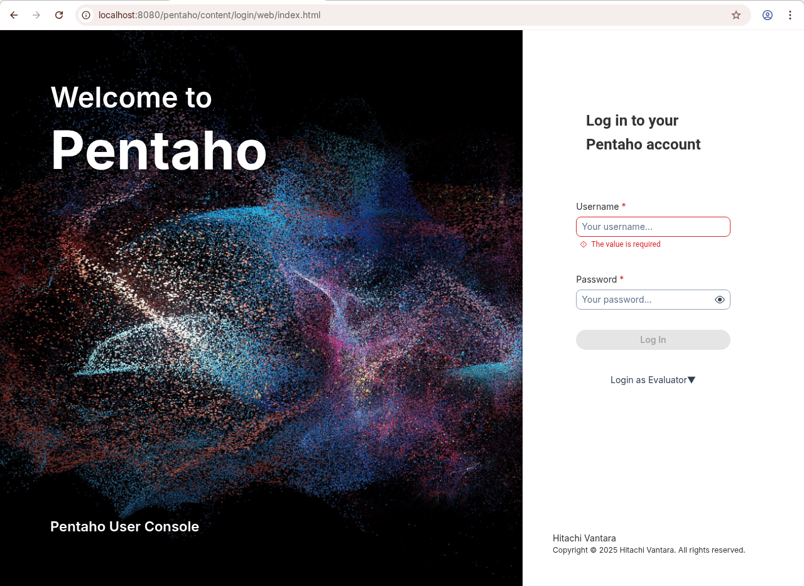

# Overview of PUC

> **Note:**
>
> #### Introduction
> 
> The Pentaho User Console is a web-based interface that serves as the main portal for business users to access and interact with Pentaho's business intelligence capabilities. It provides a centralized platform where users can view, schedule, and share reports, dashboards, and analytics content.&#x20;
> 
> The console features role-based security controls, allowing administrators to manage user access and permissions. Users can navigate through organized folders of content, execute reports on demand, set up automated report distribution, and interact with dynamic dashboards.&#x20;
> 
> The interface supports various content types including interactive reports, analysis views, and data visualizations, making it a key component of Pentaho's business intelligence suite for non-technical users to access and analyze business data.
> 
> In Pentaho 11 you have the option to switch to the new login screen which will redirect you to the new pentaho console.

**Pentaho 11**

<figure><figcaption>
NEW - Pentaho User Login
</figcaption></figure>

***

**🎥 Embed:** [Pentaho 10 User Console](<https://www.loom.com/share/31b64ef6661c42f99c2dcdbd6328266a?hideEmbedTopBar=true&hide_owner=true&hide_share=true&hide_title=true>)
