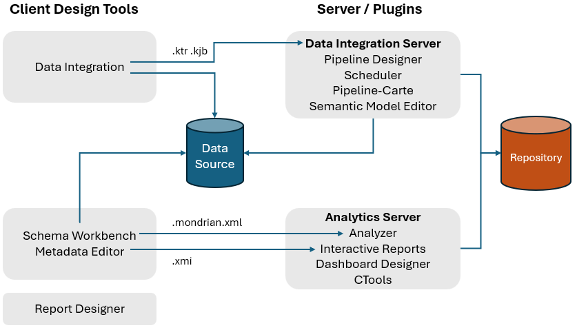
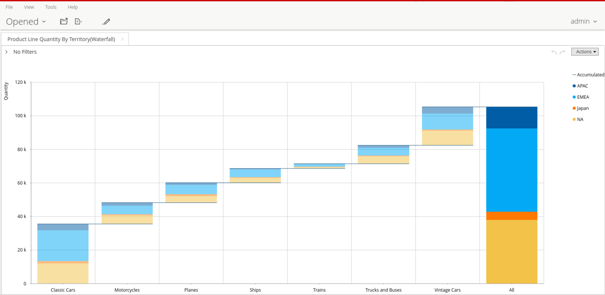
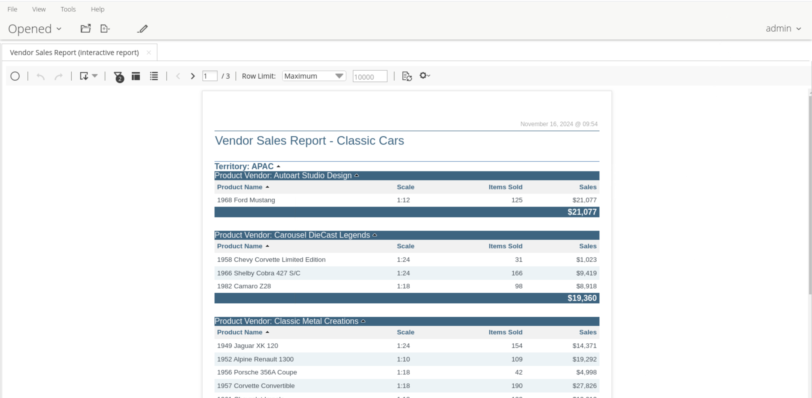
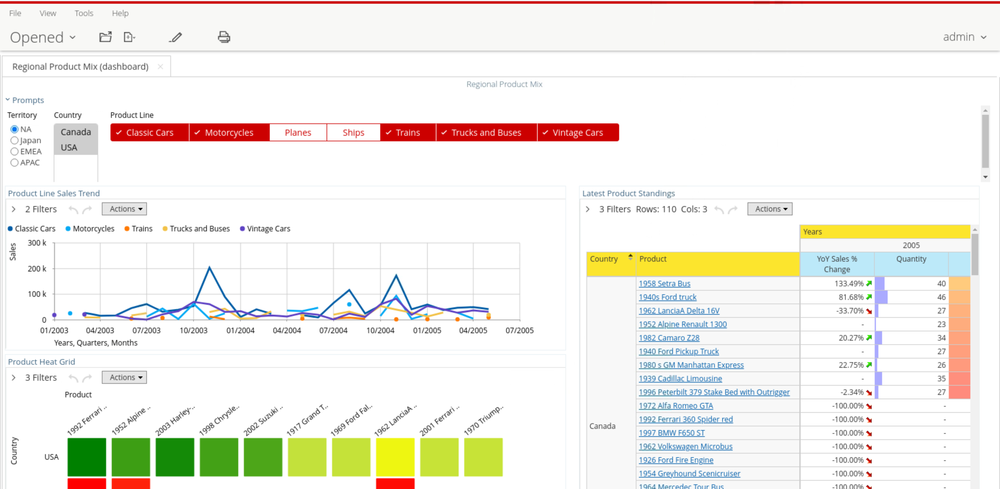

# Overview of PUC

> **Note:**
>
> #### The Pentaho BA platform
> 
> Pentaho Business Analytics (BA) platform is comprised of a server, design tools, and plugins that use your data to provide valuable insight into business trends and performance. BA components are divided into three categories:
> 
> &#x20; • BA Server and User Console
> 
> &#x20; • Web-Based Tools and Plugins
> 
> &#x20; • Client-Based Design Tools
> 
> The Pentaho Server, which is the heart of the Pentaho BA Suite, processes reporting, analysis, and dashboard content. The Pentaho Server hosts the centralized Repository for secure sharing of all data solutions. It also provides scheduling and audit functionality. The Pentaho server is managed through its web-based tool, the User Console. Use the User Console to create business analytics content, display and schedule reports, and manage Pentaho security.

<figure><figcaption>
Pentaho Architecture
</figcaption></figure>

***

> **Note:**
>
> #### The User Console
> 
> The Pentaho User Console is a web-based interface that serves as the main portal for business users to access and interact with Pentaho's business intelligence capabilities. It provides a centralized platform where users can view, schedule, and share reports, dashboards, and analytics content.&#x20;
> 
> The console features role-based security controls, allowing administrators to manage user access and permissions. Users can navigate through organized folders of content, execute reports on demand, set up automated report distribution, and interact with dynamic dashboards.&#x20;
> 
> The interface supports various content types including interactive reports, analysis views, and data visualizations, making it a key component of Pentaho's business intelligence suite for non-technical users to access and analyze business data.
> 
> In Pentaho 11 you have the option to switch to the new login screen which will redirect you to the new pentaho console.

**Pentaho 11**

<figure><figcaption>
NEW - Pentaho User Login
</figcaption></figure>

***

## The tools you will use

This course works through the three web-based tools in the sections
that follow. **Report Designer** is a desktop tool covered by its own
course — it is described here so you can place it alongside the rest.

::: tabs

### Analyzer Reports

> **Note:**
>
> #### Analyzer
> 
> **Pentaho Analyzer** (PAZ) is a web-based OLAP (Online Analytical Processing) analysis tool that's part of the Pentaho Business Intelligence Suite. It enables business users to create interactive reports and perform deep data analysis through an intuitive drag-and-drop interface.&#x20;
> 
> The tool allows users to explore data from multiple angles, create sophisticated visualizations, and generate detailed reports without requiring advanced technical skills. Key features include the ability to create pivot tables, charts, and interactive dashboards, along with capabilities for drilling down into data, filtering results, and exporting analyses in various formats.&#x20;
> 
> Pentaho Analyzer works with multiple data sources and supports both relational and multidimensional (OLAP) data models, making it a versatile tool for business intelligence and data analysis needs.

<figure><figcaption>
Product Line Quantity by Territory (Waterfall)
</figcaption></figure>

### Interactive Reports

> **Note:**
>
> #### Interactive Reports
> 
> **Pentaho Interactive Reporting** (PIR) is a business intelligence tool that enables users to create and customize interactive reports without requiring extensive technical knowledge. As part of the Pentaho Business Analytics Pro suite, PIR provides a web-based interface where users can drag and drop elements to design reports, apply filters, and create visualizations of their data.&#x20;
> 
> The tool supports various data sources, including databases, spreadsheets, and big data platforms. Key features include the ability to create ad-hoc reports, interactive filtering, parameter input, and the option to export reports in multiple formats such as PDF, Excel, and HTML.&#x20;
> 
> The platform emphasizes self-service reporting, allowing business users to generate and modify reports independently while maintaining data governance and security protocols.

<figure><figcaption>
Vendor Sales Report
</figcaption></figure>

### Dashboard Designer

> **Note:**
>
> #### Dashboard Designer
> 
> The Pentaho **Dashboard Designer** (PDD), is a visual analytics tool that was part of the Pentaho Business Pro Suite. It allows users to create interactive business dashboards without requiring extensive programming knowledge.&#x20;
> 
> The tool provides drag-and-drop functionality for building dashboards that can integrate multiple data sources, including databases, spreadsheets, and OLAP cubes. Users can incorporate various visualization components like charts, tables, and metrics, and add interactive elements such as filters and drill-down capabilities.&#x20;

<figure><figcaption>
Regional Product Mix
</figcaption></figure>

### Report Designer

> **Note:**
>
> #### Report Designer
> 
> Pentaho Report Designer (PRD) is a powerful open-source business intelligence tool that enables users to create sophisticated, data-driven reports. As part of the larger Pentaho Pro suite, this desktop application provides a visual, drag-and-drop interface for designing both simple and complex reports from various data sources including databases, spreadsheets, and XML files.&#x20;
> 
> It offers advanced features such as parameterized reporting, sub-reports, cross-tabs, charts, and conditional formatting. The tool supports multiple output formats including PDF, Excel, HTML, and CSV, making it versatile for different business needs. What sets Pentaho Report Designer apart is its ability to handle large datasets efficiently, integrate with different data sources seamlessly, and provide pixel-perfect reporting capabilities while maintaining the flexibility of an open-source solution.&#x20;
> 
> Its enterprise-grade features, combined with its cost-effectiveness, make it particularly attractive for organizations looking to implement robust reporting solutions without significant licensing costs.

Report Designer has its own workshop — **Pentaho BI Developer - RD
Practitioner** — which covers it hands-on.

:::

***

**🎥 Embed:** [Pentaho 10 User Console](<https://www.loom.com/share/31b64ef6661c42f99c2dcdbd6328266a?hideEmbedTopBar=true&hide_owner=true&hide_share=true&hide_title=true>)
