# PUC

> **Warning:**
>
> #### Workshop - Pentaho User Console
>
> The Pentaho User Console (PUC) is the web-based hub where report viewing, content management, and platform administration converge.
>
> In this workshop, you navigate the different User Console perspectives, organize your workspace with custom folders and Favorites, explore the administrative capabilities, and locate the platform's help resources.
>
> **What you'll do**
>
> * Successfully log in to the Pentaho User Console
> * Navigate and describe the purpose of different User Console perspectives (Home, Browse Files, Opened, Favorites, Recents, Schedules, Administration)
> * Create and organize new repository folders for content management
> * Build a personalized Favorites list to streamline access to critical reports and content
> * Explore scheduling capabilities and administrative functions (for users with appropriate permissions)
> * Locate and access online help resources and documentation within the platform
>
> **Prerequisites:** Pentaho Business Analytics Server installed with valid user credentials
>
> **Estimated time:** 15 minutes

1. Make sure the Pentaho Server is running. On a lab VM it already is; on your own machine start it as in [Before You Start](../00-before-you-start/guide.md):

```powershell
C:\Pentaho\server\pentaho-server\start-pentaho.bat
```

It takes a few minutes; the console is ready when http://localhost:8080/pentaho opens the login page.

Select the Pentaho User Console version:

::::: tabs

### Modern Design

> **Note:**
>
> #### Pentaho User Console 11
>
> The Modern design of the Pentaho User Console (PUC) offers an improved user experience that is intuitive, responsive, and secure.&#x20;

<figure>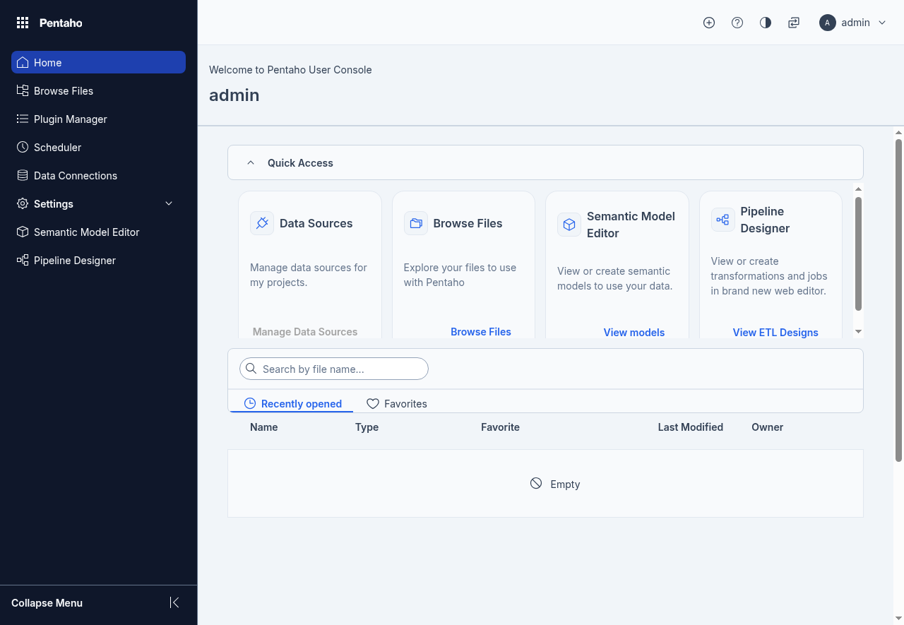<figcaption><p>PUC - Modern Design</p></figcaption></figure>

1. Log into the Modern Design Pentaho Server Console.

<div class="pcm-embed-card" data-href="http://localhost:8080/pentaho/content/login/web/index.html" data-title="localhost"></div>

| Role          | Username | Password |
| ------------- | -------- | -------- |
| Administrator | admin    | password |
| Power User    | suzy     | password |

Select a menu option:

::: tabs

### Home

> **Note:**
>
> #### Home
>
> The Home page functions as your central access point for Pentaho tools and features within the Modern Design of the Pentaho User Console (PUC). Its **Quick Access** cards open **Data Sources**, **Browse Files** and **Pipeline Designer**, and the left-hand menu reaches **Home**, **Browse Files**, **Plugin Manager**, **Scheduler**, **Data Connections** and **Pipeline Designer**. A server with more plugins installed shows more: the picture below comes from one with a **Semantic Model Editor** card and a **Settings** menu.
>
> Additionally, the Home page displays your recently opened and favorited files - such as transformations and jobs - enabling you to launch or manage them directly without navigating elsewhere.

<figure>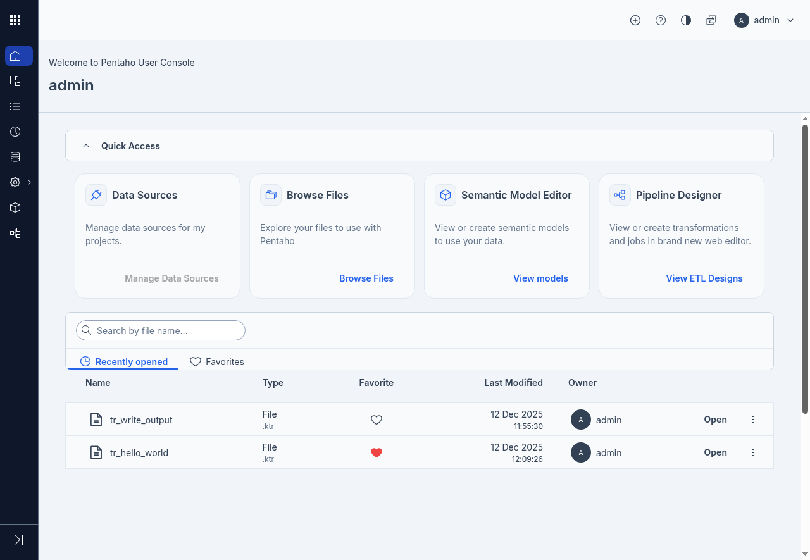<figcaption><p>Pentaho User Console - Modern Design</p></figcaption></figure>

### Browse Files

> **Note:**
>
> #### Browse Files
>
> The Browse Files page enables you to organize your files and folders for efficient retrieval and use. The folders, files, and actions visible within this page are determined by your assigned role and permissions.

<figure>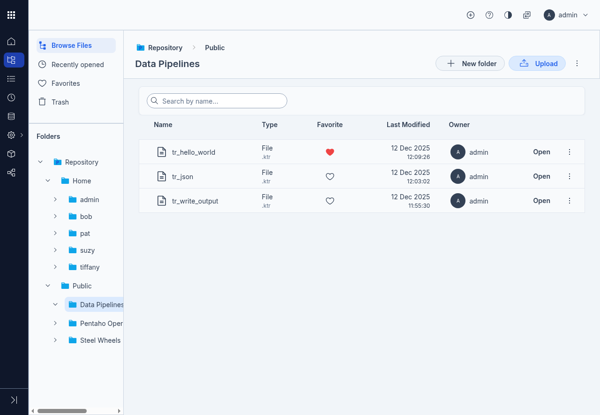<figcaption><p>Browse Files</p></figcaption></figure>

| Menu option     | Description                                                                                                                                                                                                                      |
| --------------- | -------------------------------------------------------------------------------------------------------------------------------------------------------------------------------------------------------------------------------- |
| Browse Files    | Makes the **Folders** menu navigable so that you can search for or browse to a folder that contains one or more files that you want to view. When you select a folder, the main pane displays the files contained in the folder. |
| Recently opened | Displays a list of recently opened files in the main pane.                                                                                                                                                                       |
| Favorites       | Displays a list of files that you have specified as a favorite in the main pane.                                                                                                                                                 |
| Trash           | Displays a list of files that you moved to the trash.                                                                                                                                                                            |

### Plugin Manager

> **Note:**
>
> #### Plugin Manager
>
> You can extend the **Pentaho User Console (PUC)** by installing plugins that add new capabilities, such as new visualizations, dashboards, and content access extensions. The recommended method for installing, updating, and managing plugins is through the Plugin Manager.
>
> You can use the Plugin Manager to:
>
> * **Install plugins**
>
>   Extend platform functionality by installing new platform plugins and plugins to add new visualizations, dashboards, and content access extensions.
> * **Update plugins**
>
>   Update existing plugins to the latest versions.
> * **Uninstall plugins**
>
>   Uninstall plugins that are no longer needed.

<figure>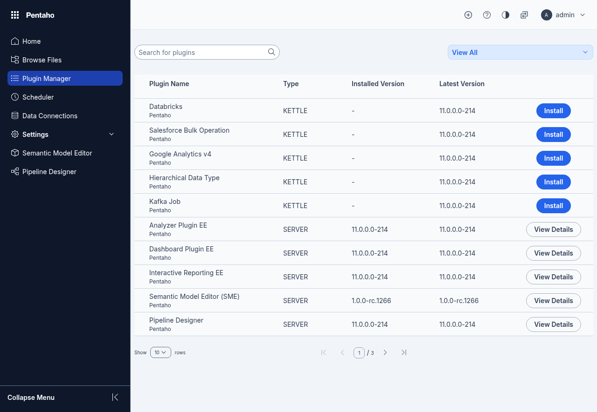<figcaption><p>Plugin Manager</p></figcaption></figure>

### Scheduler

> **Note:**
>
> #### Scheduler
>
> The Scheduler lists every scheduled run: what runs, when it runs next, and where its output goes. You create a schedule from a file's actions; the classic console's Schedules perspective, below, walks through one.

<figure>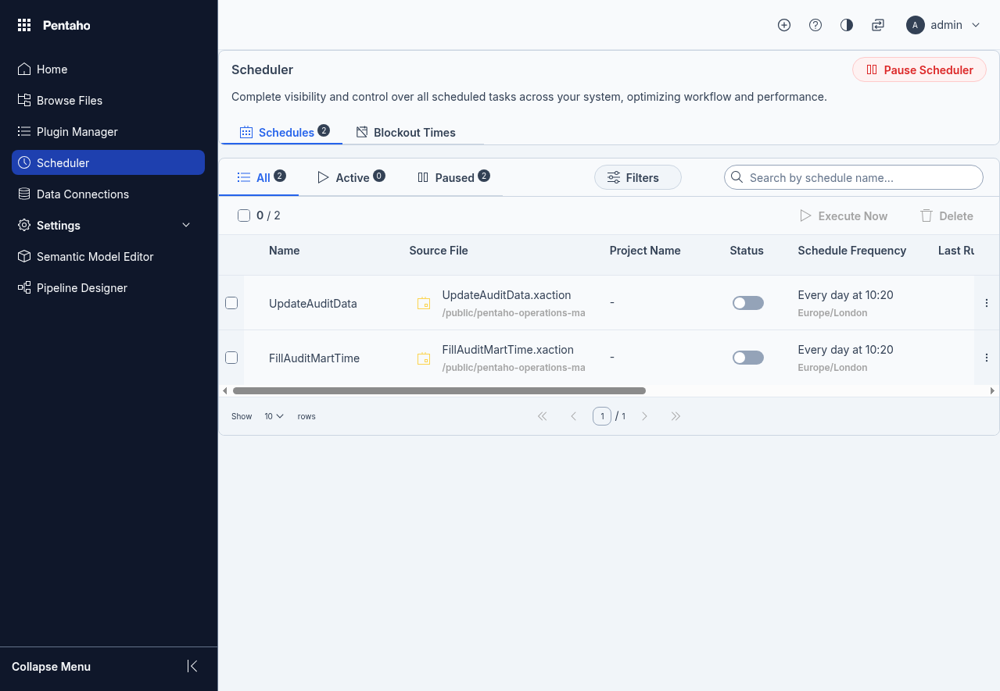<figcaption><p>Scheduler</p></figcaption></figure>

:::

### PUC

> **Note:**
>
> #### Pentaho User Console
>
> The classic console is still available alongside the Modern Design, and is where Interactive Reports, Analyzer and Dashboard Designer content opens in this course.

1. Click on the link below and log in with the same users as above:

<div class="pcm-embed-card" data-href="http://localhost:8080/pentaho/Home" data-title="localhost"></div>

#### Perspectives

:::: tabs

### 1. Home

> **Note:** The Home Perspective provides quick access to common actions, recently viewed content, and your favourite content. The Getting Started section at the top of the Home Perspective is a great place for new users to browse samples of Pentaho reports, analysis views, and dashboards, or to learn how to create your own content against your data through a series of short 3-5-minute video tutorials.

<figure>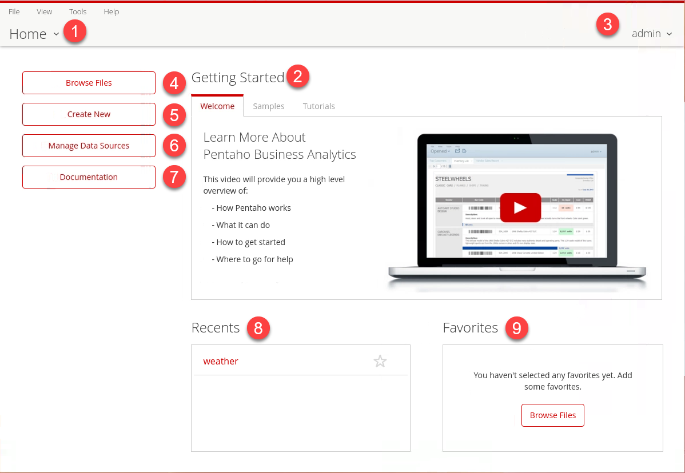<figcaption><p>Pentaho User Console - PUC</p></figcaption></figure>

<table><thead><tr><th width="82">Item</th><th width="180">Name</th><th>Function</th></tr></thead><tbody><tr><td>1</td><td>Home indicator</td><td>Indicates the current User Console perspective that you are using. The Home menu lets you flip easily from page to page, or return to your Home page.</td></tr><tr><td>2</td><td>Getting Started</td><td>Displays some resources to help you get familiar with the User Console. The Welcome tab shows an introductory video about Pentaho products. The Samples tab holds a variety of small sample reports and dashboards that you can use to get familiar with the software. The Tutorials tab contains a number of tutorial videos that give you a visual guide to the software.</td></tr><tr><td>3</td><td>Current User</td><td>Shows the name of the person currently logged in to the User Console. Clicking the arrow next to the name lets you log out of the User Console.</td></tr><tr><td>4</td><td>Browse Files</td><td>Brings you to the Browse Files window, where you can locate your files using the Browsing and Files panes, and manage them using the Actions pane.</td></tr><tr><td>5</td><td>Create New</td><td>Gives you the option to create a new report in <a href="https://docs.hitachivantara.com/r/IWGVG8qV~XMn3ekqEIpjTw/DMmWA4vfu43ddn~aj9PJUA">Pentaho Interactive Reports</a>, <a href="https://docs.hitachivantara.com/r/IWGVG8qV~XMn3ekqEIpjTw/peN6X2OgzB_40iLFljBFeA">Pentaho Analyzer</a>, or <a href="https://docs.hitachivantara.com/r/IWGVG8qV~XMn3ekqEIpjTw/z1sO8VcaROLgS_EgylsScA">Pentaho Dashboard Designer</a>. If you have permissions to work with data sources, this button also gives you the option to create a new data source.</td></tr><tr><td>6</td><td>Manage Data Sources</td><td>Opens the Manage Data Sources dialog, where users with the Manage Data Sources permission view, create, edit and delete data sources.</td></tr><tr><td>7</td><td>Documentation</td><td>Documentation for Pentaho products.</td></tr><tr><td>8</td><td>Recents</td><td>Shows a list of your most recently opened files. Clicking on the star icon next to a recently opened file adds it to your Favorites list.</td></tr><tr><td>9</td><td>Favorites</td><td>Shows a list of your favorite files for quick access.</td></tr></tbody></table>

### 2. Browse Files

> **Note:** **Browse Files** is where you access and manage all the content that you create or have access to in Pentaho.&#x20;

1. From the Perspectives drop-down list, select Browse Files.

<figure>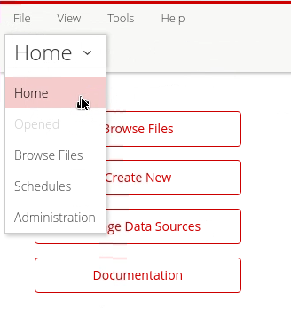<figcaption><p>Browse Files</p></figcaption></figure>

> **Note:** The left panel displays the directory of files, including your personal home location, as well as the default public space where you can share content with other users and groups. Selecting a folder will display the files in that folder in the middle section of the Browse Perspective.&#x20;
>
> Finally, the Actions list at the right provides fast access to actions available for the selected folder or file, such as opening content, scheduling a report to be run, or adding an item to your Favorites list.

<figure>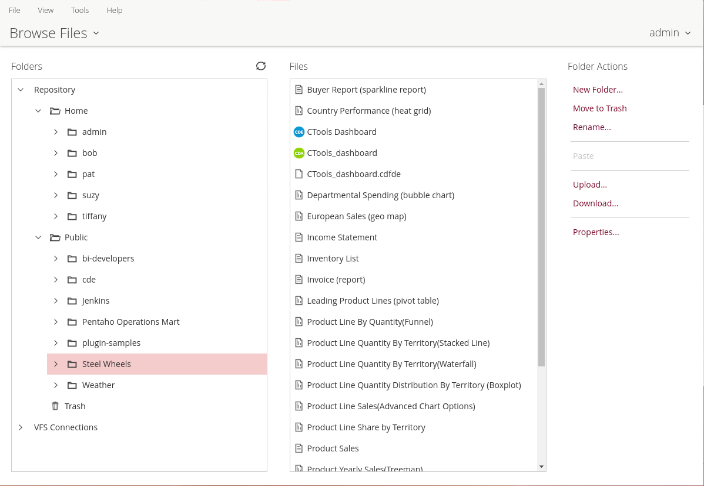<figcaption><p>Browse Files</p></figcaption></figure>

***

**Create a Training Folder**

> **Note:** Create a folder named Training, in which you will save your content.

1. To add a new folder, from the Folders pane, click Public, and then from the Folder Actions pane, click New Folder.

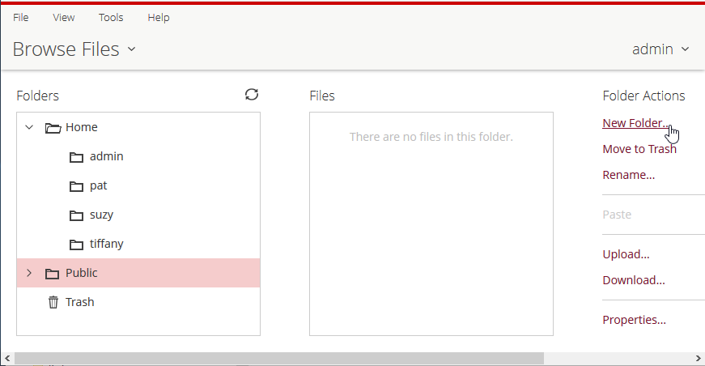

2. In the Name field, type Training, and then click OK.

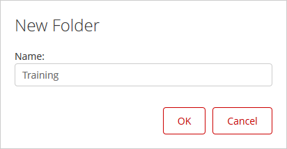

3. From the Perspectives drop-down list, select Home.

**Add a Favorite and find the documentation**

4. From the Perspectives drop-down list, select Browse Files. Select **Public > Steel Wheels > Leading Product Lines (pivot table)**, and in the File Actions pane click **Add to Favorites**.
5. Return to Home: the report now appears under **Favorites**.
6. From the **Help** menu, click **Documentation...** to open the Pentaho documentation.

### 3. Schedules

> **Note:** The Schedules Perspective is where you can view and manage all scheduled activities.&#x20;
>
> The Manage Schedules table provides information about what is being scheduled when, where the content generated by the schedule will be placed, the last time a schedule was run, and the next planned schedule trigger.&#x20;
>
> Clicking on the output link for a schedule will take you to the Browse Perspective so you can open any documents generated by the schedule.

<figure>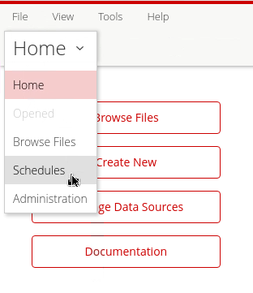<figcaption><p>Schedules</p></figcaption></figure>

1. In the Browse Files perspective, select **Public > Steel Wheels > Vendor Sales Report (interactive report)**, and then in the File Actions pane click **Schedule...**.

> **Note:** There are several reporting options:
>
> &#x20; • Append a timestamp
>
> &#x20; • Save the scheduled report in another location (with overwrite)
>
> &#x20; • Change the report Owner

<figure>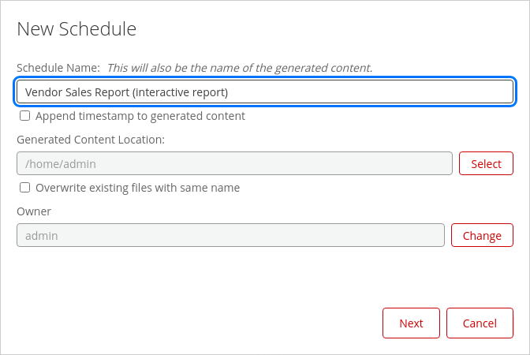<figcaption><p>Schedule options</p></figcaption></figure>

2. Click 'Next'.

<figure>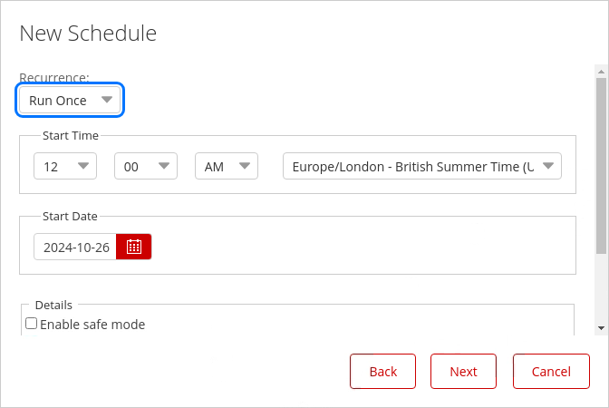<figcaption></figcaption></figure>

> **Note:** There are several scheduling options:
>
> &#x20; • When & How often to schedule
>
> &#x20; • Performance metrics & Logging level

3. Click 'Next'.

<figure>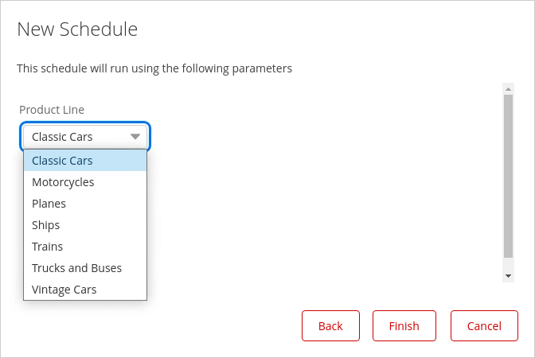<figcaption><p>Set Parameter - Classic Cars</p></figcaption></figure>

> **Note:** The report settings only allow you to select 1 parameter.

4. Click 'Finish'. The schedule has now been created and can be viewed in the Schedule Perspective.

<figure>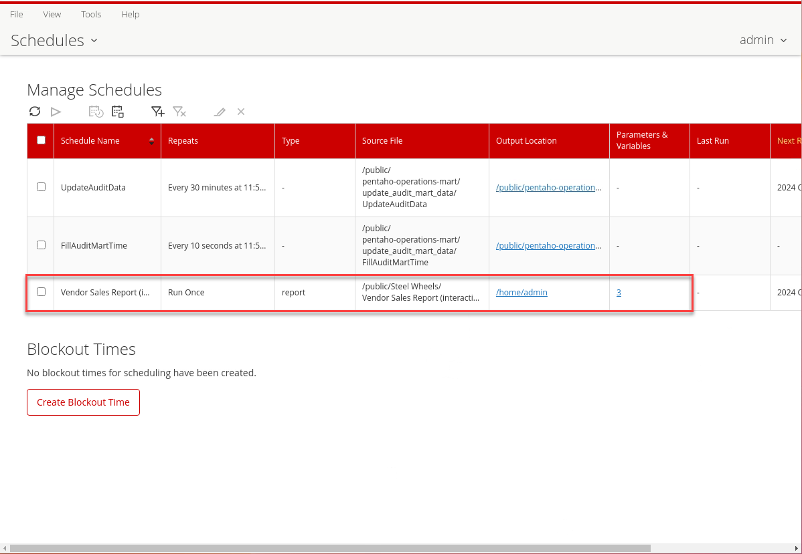<figcaption><p>Schedule Perspective</p></figcaption></figure>

### 4. Administration

> **Note:** The Administration Perspective is where the system administrator manages and configures your Pentaho Business Analytics Server:
>
> including managing user role security - LDAP or Active Directory,&#x20;
>
> set up your mail server settings&#x20;
>
> manage your Pentaho enterprise license keys,&#x20;
>
> manage clean-up routines for manually or scheduled clean-up of content generated by the scheduling system.

<figure>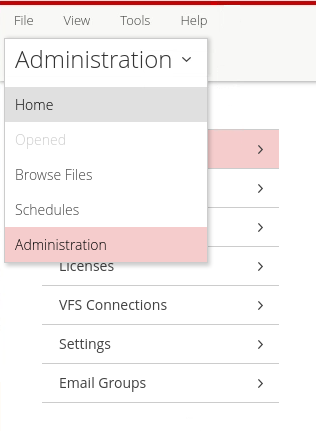<figcaption></figcaption></figure>

::: tabs

### Users & Roles

> **Note:** The Users & Roles page in the Pentaho User Console (PUC) is a point-and-click interface for managing system access and permissions. Only administrators or users with Administer Security permission can manage these settings. The system comes with default user and role assignments that can serve as templates.
>
> Before making any security changes, it's crucial to back up the system. For wizard installations, this means backing up the Pentaho Business Analytics and Server directories. For manual or archive installations, additional backup of WAR files and solutions is required.
>
> The interface allows administrators to add, edit, and delete users and roles, as well as customize file and folder permissions through the Browse Files perspective. For organizations with multiple tenants, there's an option to hide individual users' Home folders for enhanced security. More detailed information is available in the Administer Pentaho Data Integration and Analytics documentation.

<figure>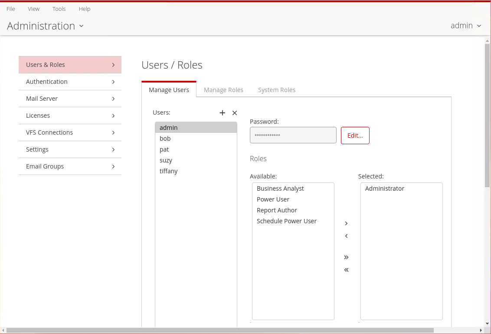<figcaption><p>Users &#x26; Roles</p></figcaption></figure>

1. Click Home -> Administration.
2. Highlight a user in the Users list to display which roles are available for that user, as well as which roles are currently defined for that user.&#x20;

You can use the following sample users as templates for adding your own users:

<table><thead><tr><th width="147">Sample User</th><th width="196">Default Role</th><th>Default Operation Permissions</th></tr></thead><tbody><tr><td>admin</td><td>Administrator</td><td><ul><li>Administer Security</li><li>Schedule Content</li><li>Read Content</li><li>Execute Schedules</li><li>Publish Content</li><li>Create Content</li><li>Execute</li><li>Manage Data Sources</li></ul></td></tr><tr><td>bob</td><td>Schedule Power user</td><td><ul><li>Read Content</li><li>Execute Schedules</li></ul></td></tr><tr><td>pat</td><td>Business Analyst</td><td><ul><li>Publish Content</li></ul></td></tr><tr><td>suzy</td><td>Power User</td><td><ul><li>Schedule Content</li><li>Read Content</li><li>Publish Content</li><li>Create Content</li><li>Execute</li></ul></td></tr><tr><td>tiffany</td><td>Report Author</td><td><ul><li>Schedule Content</li><li>Publish Content</li></ul></td></tr></tbody></table>

3. Select the Manage Roles tab to display the Operation Permissions for the user's role.

> **Note:** You can alter or remove these roles. Roles can be based on need. Each default role and sample user come with a standard set of permissions, which define a specific set of capabilities when using Pentaho tools and the Pentaho Server.

<figure>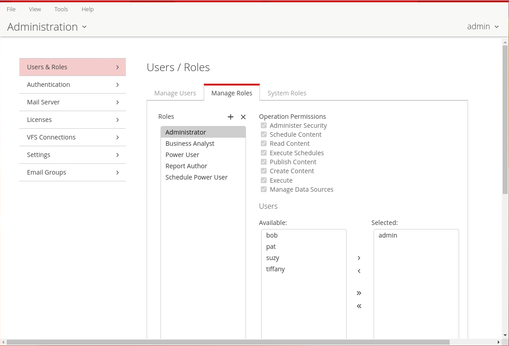<figcaption><p>Manage Roles</p></figcaption></figure>

<table><thead><tr><th width="213">Operation Permission</th><th>Definition</th></tr></thead><tbody><tr><td>Administer Security</td><td><p>The default Administrator role automatically conveys full operation permissions to users assigned to that role, even if the check box next to it is cleared. These permissions include the Read Content and Create Content permissions, which are required for accessing the Administration perspective.</p><p>This permission has the following capabilities:</p><ul><li>Access to the Administration perspective of PUC.</li><li>Access and manage all content in the Browse perspective.</li><li>View and work with all user schedules in the Schedules perspective.</li><li>Create server block out times in the Schedules perspective.</li></ul></td></tr><tr><td>Schedule Content</td><td><ul><li>Schedule reports and content.</li><li>View, edit, or delete their own schedules using the Schedules perspective.</li></ul></td></tr><tr><td>Read Content</td><td><ul><li>View content in the Browse perspective.</li><li>View content through the File > Open dialog box.</li></ul></td></tr><tr><td>Execute Schedules</td><td><ul><li>View all scheduled reports from all users.</li><li>Pause and resume all scheduled reports</li><li>Run scheduled reports and content if that user has access to data source material used for the reports.</li></ul></td></tr><tr><td>Publish Content</td><td><p>This permission includes the following capabilities for tools such as Report Designer, Schema Workbench, and Metadata Editor.</p><ul><li>Allows client tools to store reports or data models in the Pentaho Repository.</li><li>When held in conjunction with Write permission on the target folder, upload supported content types. See the <em>Administer Pentaho Data Integration and Analytics</em> document for details.</li></ul></td></tr><tr><td>Create Content</td><td><ul><li>Create, import, delete, and save reports to the repository.</li><li>See a list of data sources which are used to create reports or dashboards.</li></ul></td></tr><tr><td>Execute</td><td>Read and execute transformations and jobs.</td></tr><tr><td>Manage Data Sources</td><td><ul><li>Create, edit, or delete new data sources.</li><li>See a list of data sources that are used to create reports or dashboards.</li><li><p>Also includes the following capabilities while working with Analysis Reports:</p><ul><li>Make inline model editing changes including modifying existing (base) measures.</li><li>Add and edit calculated measures to the data model.</li><li>Hide and show fields.</li></ul></li></ul><p>Note: This operation permission does not include Metadata Editor data sources. </p></td></tr></tbody></table>

:::

::::

:::::

> **Under the hood:**
>
> #### Every folder you clicked is a node in a content repository
>
> Browse Files isn't a file share. The Pentaho Server keeps its content
> in a JCR repository (Apache Jackrabbit, configured under
> `pentaho-solutions/system/jackrabbit`): every report, dashboard and
> folder is a node with properties, a version history and an
> access-control list. Creating a folder created a node whose ACL is
> inherited from its parent; adding a Favorite wrote a per-user
> setting, not a copy of anything.
>
> The console itself is a browser client of the server's REST API
> (`/pentaho/api/...`). Everything it shows arrives over HTTP, and the
> server checks the ACL on every request — hiding a button never hides
> data. The Schedules perspective lists jobs the server's scheduler
> will run: the same report through the same engine, with its output
> written back into the repository.
>
> **Why it matters:** the console is one client among many — Report
> Designer, PDI and scripts hit the same API — so a permission set here
> is the permission everywhere.

> **Success:** You can log in to the Pentaho User Console, navigate its perspectives, organize content with folders and Favorites, and locate the platform's administrative and help resources.
