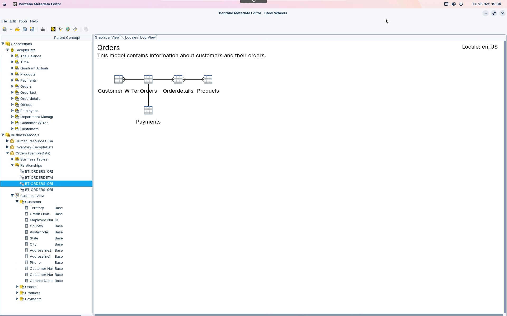

# Overview of Interactive Reports

> **Note:**
>
> #### Introduction
> 
> Pentaho Interactive Reporting provides you with a Web-based, drag-and-drop interface that allows you to add elements to your report layout quickly and easily.&#x20;
> 
> Among other things, common formatting features such as font selection, column resizing, column sorting, column heading renaming, copy/paste formatting, and unlimited undo/redo capability are available from the Interactive Reports formatting menu and toolbar.&#x20;
> 
> The reports you create can be output as HTML, PDF, CSV or Excel files. Additionally, you can display your report in a dashboard.

**🎥 Embed:** [Interactive Reports](<https://www.loom.com/share/12198bef03724d4f873da37232000a9f?hideEmbedTopBar=true&hide_owner=true&hide_share=true&hide_title=true>)

> **Note:** Before you can create an Interactive Report, you must have access to a data source provided by an administrator. The data source for an Interactive Report is based on a metadata model. A metadata model presents the data you use in reports in business terms; for example, users see Customers and Orders instead of CUST\_TBLE or ORDR\_TBLE.
> 
> Pentaho Metadata Editor removes the need for you to know query languages, such as SQL. Queries are generated based on the metadata selection. The metadata model allows you to create an Interactive Report without knowing the complexities of the database structure. Some examples of metadata include the names of tables and columns. Also included are the relationships between columns and tables, security, and access rules.
> 
> A metadata model is created using Pentaho Metadata Editor or generated by the Data Source Wizard (either through a manually entered SQL query, an auto-query written against a defined set of tables and joins in a relational database, or a CSV file).

<figure><figcaption>
Metadata Editor - Steel Wheels
</figcaption></figure>

> **Note:** Reports you create using Interactive Reporting can be opened in Report Designer for further customization. Pentaho Report Designer is the most comprehensive report design tool in the Pentaho Pro Suite and provides you with advanced formatting capabilities and the ability to connect to disparate data sources. Charts and other report elements, including sub-reports can be added to a basic report.&#x20;
> 
> Below is a subset of Report Designer capabilities:
> 
> &#x20; • Connect to diverse data sources including relational data, Pentaho Analysis, Pentaho Metadata, flat files, java objects, or stream data directly from Pentaho Data Integration transformations to design reports
> 
> &#x20; • Create and view user prompts, including dynamic cascading prompts
> 
> &#x20; • Add data visualizations such as charts, barcodes, sparklines, survey scales, and more
> 
> &#x20; • Localize reports easily to support multi-lingual deployment with a single report file
> 
> &#x20; • Embed HTML and JavaScript controls for dynamic and interactive online reports
> 
> &#x20; • Fine-tune reports using the built-in interactive preview mode

> **Note:** Once you customize an Interactive Report using Report Designer, you can no longer edit the report using the Interactive Reporting module in the Pentaho User Console.
> 
> Interactive Reports are saved as **.prpti** files. Report Designer report files have a **.prpt** extension. In the Pentaho User Console, Interactive Reports are displayed with a special icon that differentiates them from reports that are created in Report Designer.
> 
> If you want to create a new Interactive Reporting template, you must create it in Report Designer and place the template in the Interactive Reporting templates directory.

***

> **Note:**
>
> #### Use Cases for Interactive Reports
> 
> * If you wish to create an operational or financial report that answers business questions such as, “Who are my top performers this week?” or “What are the current inventory levels for product X? ...“
> * If you wish to create a report that looks professional and provides you with significant control over formatting elements such as fonts, font colour, column widths, background colours, column sorting, and more...
> * If you wish to create a quick prototype report that you can later customize using Pentaho Report Designer...
