# Sales Territory

> **Warning:**
>
> #### Workshop - Sales Territory
> 
> Build a professional Sales Order Report from the ground up using Pentaho's Interactive Reporting tool, turning raw sales data into an organized report that reveals revenue patterns across territories, countries, and customers.
> 
> In this workshop, you'll work through the complete lifecycle of an Interactive Report, from selecting a data source and template to publishing the finished report to the repository, mastering grouping, sorting, filtering, prompts, and professional formatting along the way.
> 
> **What you'll do**
> 
> * Select an appropriate data source and report template to begin your report
> * Add relevant data columns (Customer Name, City, Order Date, Order Number, Sales Revenue)
> * Create logical report groups to organize data by Territory and Country
> * Apply sorting and filtering to control data presentation
> * Implement user prompts to make your report interactive and flexible
> * Add summary totals to calculate revenue aggregations at group levels
> * Format numeric data (currency, decimals) for professional presentation
> * Customize report headers, footers, and titles to create polished, branded output
> * Save and publish your completed Interactive Report to the Pentaho repository
> 
> **Prerequisites:** Pentaho Business Analytics Server with sample sales data source configured
> 
> **Estimated time:** 20 minutes

<figure>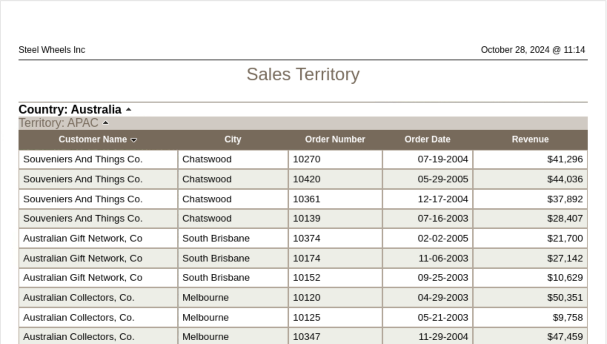<figcaption>
Sales Territory Report
</figcaption></figure>

***

:::: tabs

### Vendor Sales Report

> **Note:**
>
> #### Vendor Sales Report
> 
> The Vendor Sales Report consists of Product Name, Scale, Items Sold, and Sales grouped by Territory and Product Vendor.&#x20;
> 
> It includes subtotals for each Product Vendor, and the Sales column has been formatted as currency with no decimal places.

1. In the Folders pane, expand Public > Steel Wheels, and then in the Files pane, double-click Vendor Sales Report.

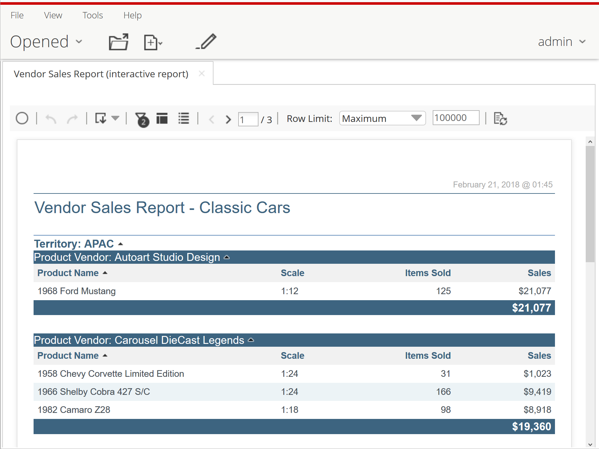

***

> **Note:**
>
> #### Toolbar
> 
> The **Interactive Toolbar** includes buttons to undo or redo changes, export the report, display the Filters or Layout panels, create prompts, and to navigate through the report pages.

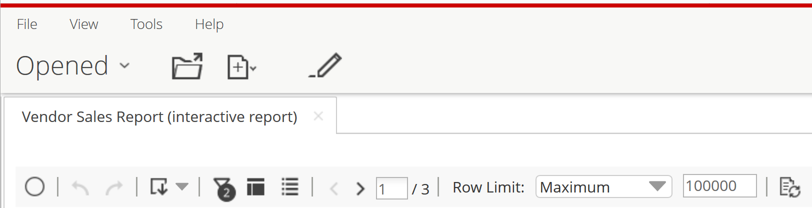

1. To view the available fields, on the main toolbar, click the Edit Content button.

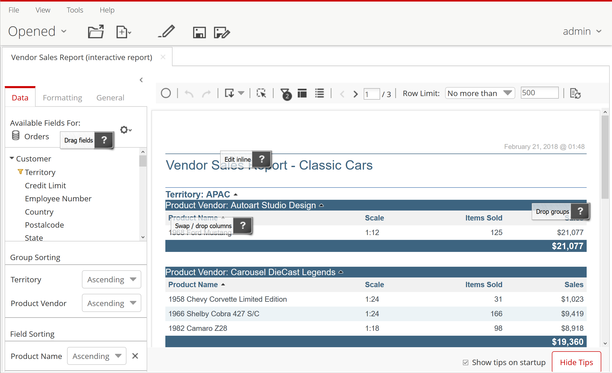

> **Note:** You're only able to view the report ..
> 
> but you can see in the **Data** tab in the **Selection** pane that the available fields come from the Orders data source. The **Data** tab also identifies grouping and sorting information.
> 
> The **Selection** pane also includes a tab for formatting individual report elements, and a tab for general report preferences.
> 
> In the lower right corner, an option to show tips on start-up and a button to hide tips.

2. To view the available export formats, on the interactive toolbar click the drop-down arrow for Export.

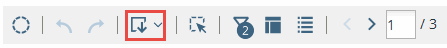

3. To display the Filter panel, on the interactive toolbar click the Filters button.

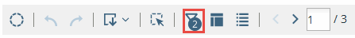

4. To display the Layout panel, on the interactive toolbar click the Layout button.

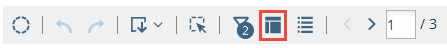

5. You can also set the Row Limit.

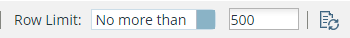

### Sales Territory Report

> **Note:**
>
> #### Sales Territory
> 
> One of the standard corporate reports is a breakdown of the total customer revenue by 'Sales Territory'.

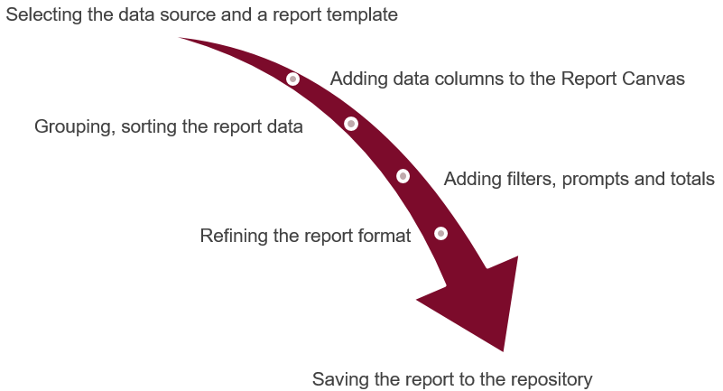

::: tabs

### 1. Data Source & Templates

> **Note:**
>
> #### Data Sources & Templates
> 
> The first step to creating an Interactive Report is selecting a data source. Data sources are provided to you by an administrator or authorized user.

***

1. From the User Console Home Perspective, click Create New > Interactive Report.

<figure>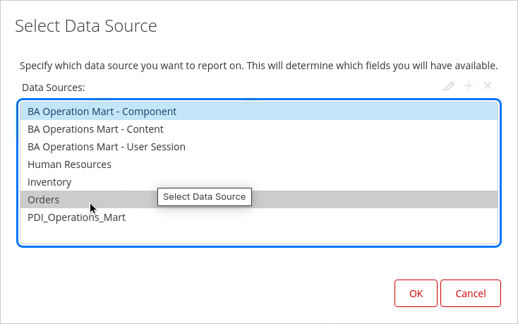<figcaption>
Orders - Data Source
</figcaption></figure>

2. In the Select Data Source window, click Orders, and then click OK.

***

> **Note:**
>
> #### Report Template
> 
> You can select a different template for your report using the General tab. You can define your own Template using Report Designer.

1. In the Selection Pane, click the General tab, and then click Select.

<figure>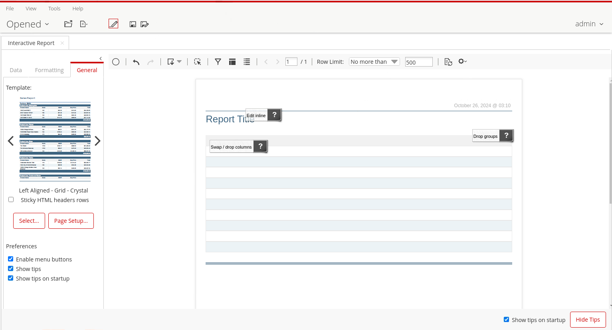<figcaption>
Select - Report Template
</figcaption></figure>

2. Use the left and right arrow to scroll through the available templates, and then click on Left Aligned - Nickel.

<figure>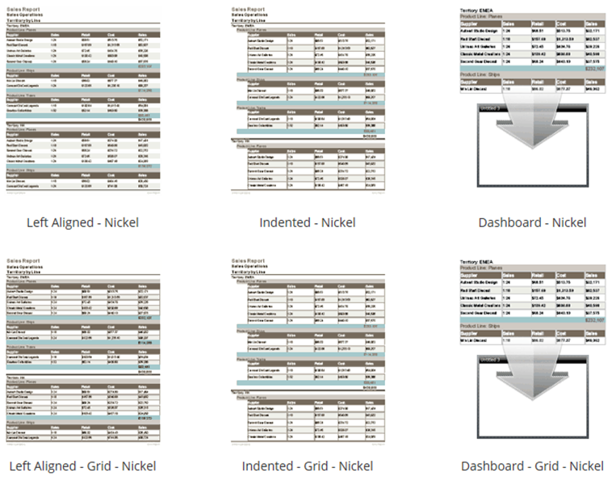<figcaption>
Report Templates
</figcaption></figure>

> **Note:** You can define your own Report Template using Pentaho Report Designer.

<figure>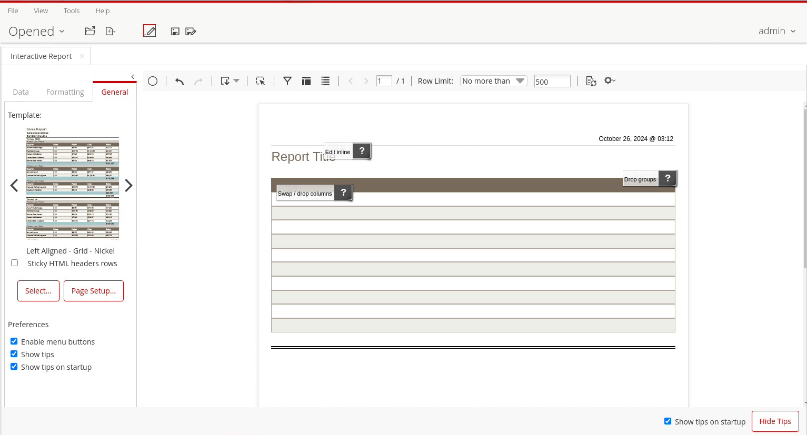<figcaption>
Left Aligned - Grid -Nickel
</figcaption></figure>

> **Note:**
>
> #### Freeze the report top row
> 
> Select the Sticky HTML headers rows option on the General tab to freeze the output header row when viewing reports in HTML (Single Page) output. This keeps the data correlation with the header when moving within a page of a report, similar to the Freeze Top Row function in Excel.

### 2. Adding Data

> **Note:**
>
> #### Adding Data
> 
> When you first open an Interactive Report, the categories and fields associated with the data source you selected are displayed on the Data panel in the Selection Pane.
> 
> &#x20; • There are several methods to add data columns to the report:
> 
> &#x20; • Select a field and drag it to the Report Canvas
> 
> &#x20; • Turn on the Layout panel and drag fields to the Columns line
> 
> &#x20; • Right-click a field in the Data panel and select Add to Columns
> 
> &#x20; • Double-click a field in the Data panel
> 
> You can select more than one field by holding the Shift or Control key before adding them to the report. As you add fields, a blue vertical or horizontal line indicates where the column will be placed.&#x20;

***

1. In the Selection Pane, click the Data tab.

<figure>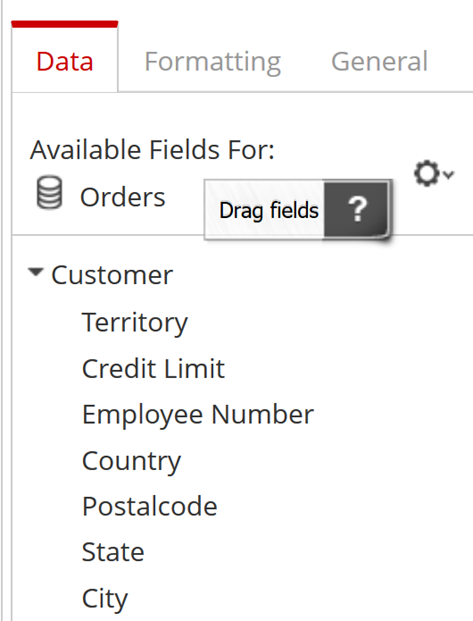<figcaption>
Data Fields
</figcaption></figure>

2. From the Data panel, select Country and drag it to the Report Canvas. A blue vertical line appears, indicating where the column will be placed.

<figure>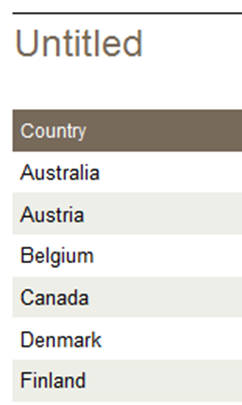<figcaption></figcaption></figure>

3. To remove Country from the Report Canvas:

   &#x20;  • Click the Country column header.

   &#x20;  • Drag it to the lower right corner of the canvas.

   &#x20;  • Drop it in the trashcan.

<figure>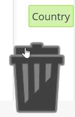<figcaption>
Delete Country
</figcaption></figure>

4. To turn on the Layout panel, on the Interactive Toolbar, click the Layout button.

<figure>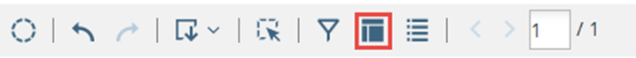<figcaption>
Interactive Toolbar
</figcaption></figure>

5. From the Data panel, select Country and drag it to the Columns line on the Layout panel.

<figure>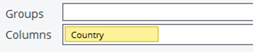<figcaption>
Layout Panel
</figcaption></figure>

6. From the Data panel, select City and drag it to the Report Canvas. The vertical line indicates the option of either displaying the data as a column or row. Drop City to the *right* of Country.
7. From the Data panel, double-click Customer Name.
8. Add the following additional fields, from the Data panel:

   &#x20; • Select Order Date.

   &#x20; • Hold the Ctrl key and select Order Number and Total.

   &#x20; • Right-click and select Add to Columns.
9. To rearrange columns from the Layout panel, on the Columns line, click Customer Name and drag it *between* Country and City.

<figure>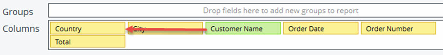<figcaption>
Rearrange Fields in Layout
</figcaption></figure>

10. &#x20;To rearrange columns from the Report Canvas, click the Order Number column header and drag it *between* City and Order Date.

<figure>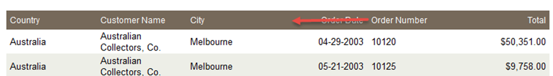<figcaption>
Rearrange Fields on Canvas
</figcaption></figure>

11. To resize the Customer Name column, click the resize bar *between* the Customer Name and City column headers and drag it to the right.

<figure>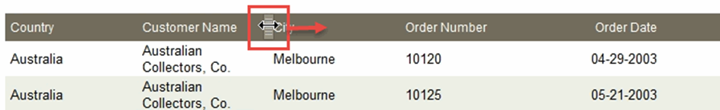<figcaption>
Resize columns
</figcaption></figure>

12. Resize the Order Number and Order Date columns to make them smaller.

### 3. Grouping & Sorting

> **Note:**
>
> #### Grouping & Sorting
> 
> The grouping feature in Interactive Reporting allows you to group the data in your report by one or more fields. To create a group, drag a field from the Data pane and place it above the column headers on the Report Canvas. The blue horizontal line indicates the field will be used for grouping.
> 
> If the field you want to group by is already a column in your report, click the column header and drag it up above the other headers in the report. Alternatively, you can drag a field to the Groups line on the Layout panel. You can create nested groups by “stacking” the fields on the Report Canvas or adding additional fields to the Groups line on the Layout panel.

***

1. To add a group for Territory, drag Territory, from the Data pane to the Groups line on the Layout panel.

<figure>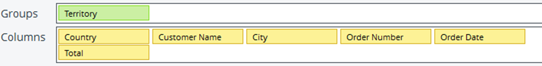<figcaption>
Grouping
</figcaption></figure>

2. To add a subgroup, on the Report Canvas, click the Country column header and drag it *below* the Territory group.

<figure>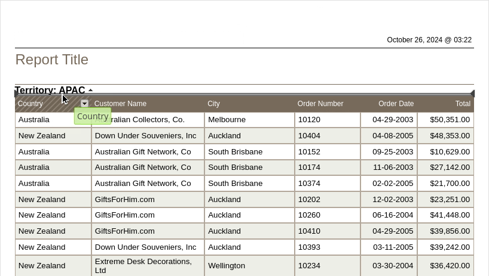<figcaption>
Country sub-group
</figcaption></figure>

> **Note:** Territory and Country are added to the Group line on the Layout panel, and to the Group Sorting section at the bottom of the Data pane. By default, groups are sorted in Ascending order when they are created.

***

> **Note:**
>
> #### Sorting
> 
> You can sort the report data by group and/or by individual column. By default, groups are sorted in ascending order. Change the sort order using the Group Sorting drop-down in the Selection Pane.
> 
> To change the sort order for an individual column, click the drop-down arrow next to the column heading, and then select Sort > Ascending, Sort > Descending, or Sort > None from the context menu.

1. To change the sort order for Territory to Descending.

<figure>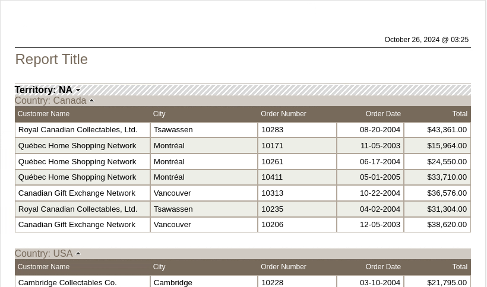<figcaption>
Descending sort on Territory
</figcaption></figure>

2. To sort the Customer Name column, on the Report Canvas, click the drop-down arrow next to the Customer Name column header, and then select Sort > Ascending.

<figure>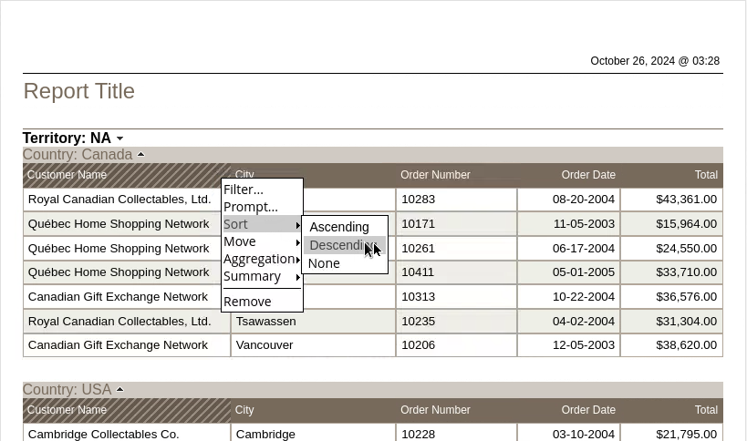<figcaption>
Descending sort on Customer Name
</figcaption></figure>

> **Note:** Under Field Sorting in the Selection Pane, the sort order for Customer Name is Ascending. There is a red X you can click to remove the sort.

<figure>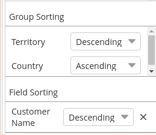<figcaption>
Data tab - sorting
</figcaption></figure>

### Filters & Prompts

> **Note:** Filters are used to restrict or limit the data that is presented in a report. When you create the filter, you can choose to select from a list of values or match a specific value by typing the value in the text box and specifying a constraint.
> 
> There are several ways to create filters:
> 
> &#x20; • Turn on the Filters panel and drag fields to the filter area
> 
> &#x20; • Click the drop-down arrow next to a column header and then select Filter
> 
> &#x20; • Right-click a field in the Data panel and then select Filter

> **Note:** Filter the report to only show results for the North American Territory; Country is the USA, since January 1, 2004.

1. Ensure the report layout is defined as illustrated.

<figure><figcaption>
Report layout
</figcaption></figure>

2. On the **Interactive Toolbar**, click the **Filters** button.

<figure>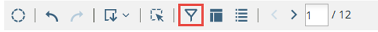<figcaption>
Filter
</figcaption></figure>

3. To filter on **Territory**, from the **Data** pane, select **Territory** and drag it to the **Filters** panel.

<figure>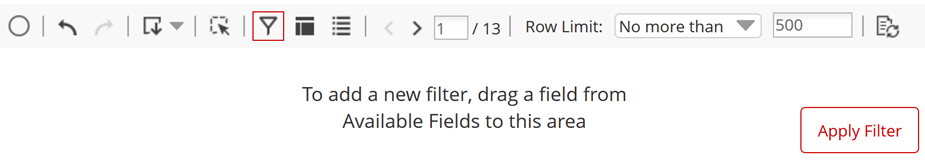<figcaption>
Filter Panel
</figcaption></figure>

4. In the Filter on Territory dialog box:

   &#x20; • Select the option: Select from a list.

   &#x20; • From the list of values, click NA.

   &#x20; • Click the right arrow to move NA to the Currently Included list.

   &#x20; • Click OK.

<figure>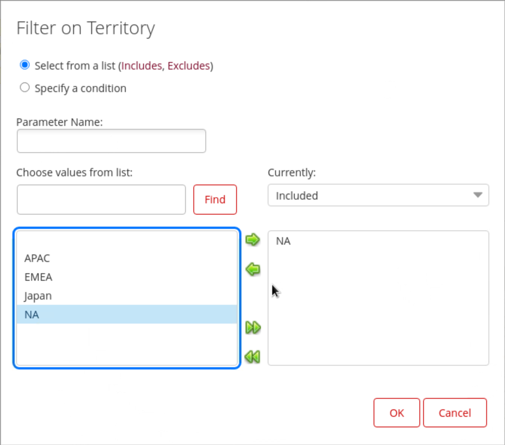<figcaption>
Filter on Territory
</figcaption></figure>

> **Note:** You can define a filter constraint as a parameter. The parameter name will appear under the Parameters tab in Dashboard Designer when you use the report in a dashboard. The parameter(s) also appear, and can be edited when working in Report Designer.

<figure>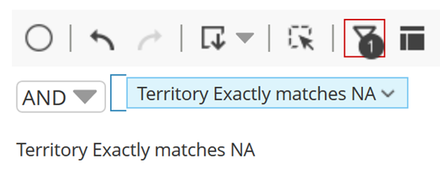<figcaption>
Filter Panel
</figcaption></figure>

5. To filter on Country, in the report details, drag Country to the Filters panel.
6. In the Filter on Country dialog box, select Specify a Condition, and from the available constraints drop-down list, select Begins with, then in the text box, type US, and then click OK.

<figure>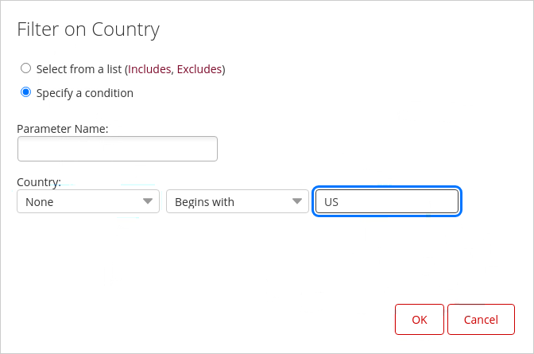<figcaption></figcaption></figure>

7. To filter on Order Date, in the report details, click the Order Date column header and drag it to the Filters panel.

<figure>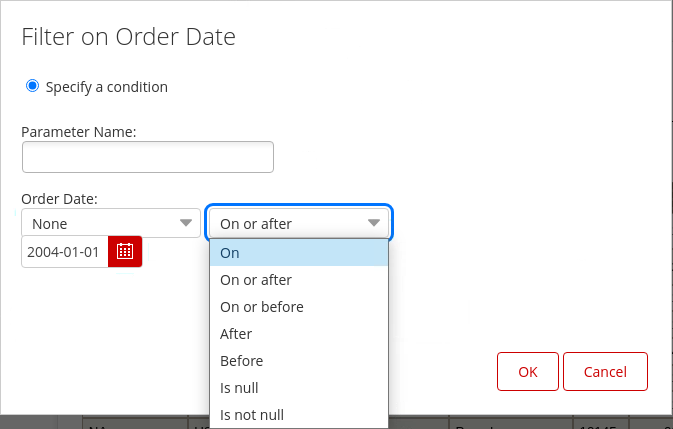<figcaption>
Filter on Order Date
</figcaption></figure>

8. In the Filter on Order Date dialog box:

   &#x20; • From the available constraints, drop-down list, select On or after.

   &#x20; • Click the next drop-down arrow, then navigate to January 2004.

   &#x20; • Select January 1, 2004 (2004-01-01).

   &#x20; • Click OK.

The filters applied are illustrated below:

| Operator | Definition                                                                  |
| -------- | --------------------------------------------------------------------------- |
| AND      | 
Finds records that match both values.

<strong>1 AND 2</strong>
 |
| OR       | 
Finds records that match either value.

<strong>1 OR 2</strong>
 |

> **Note:** Filter icons appear on the dimension(s) / measure(s) in the Data Panel

<figure>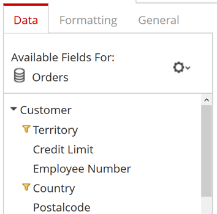<figcaption></figcaption></figure>

***

#### Prompts

> **Note:** Prompts to provide an easy way to interactively filter a report.

Let's create a prompt for Territory.

1. Ensure the report layout is defined as illustrated.

<figure>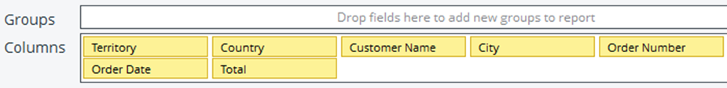<figcaption>
Report Layout
</figcaption></figure>

> **Warning:** You will need to remove ‘Country begins with US’ filter and Territory.&#x20;

2. Click on the dropdown arrow and select ‘Delete’.

<figure>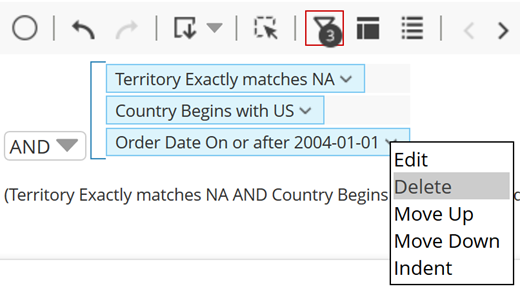<figcaption>
Delete Filters
</figcaption></figure>

3. To display the Prompts panel, on the Interactive Toolbar, click the Prompts button.

<figure>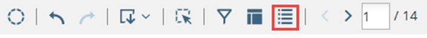<figcaption>
Prompts
</figcaption></figure>

4. From the Data panel, select Territory and drag it to the Prompts panel.

<figure>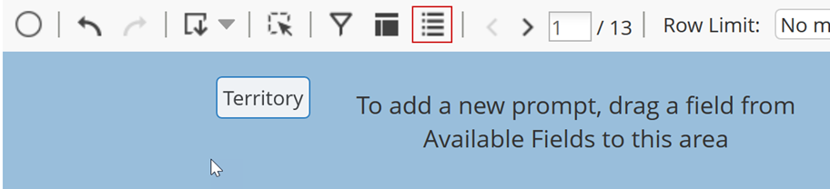<figcaption>
Prompts Panel
</figcaption></figure>

The default prompt is a drop-down list.

5. From the Territory Parameter drop-down list, select NA.

<figure>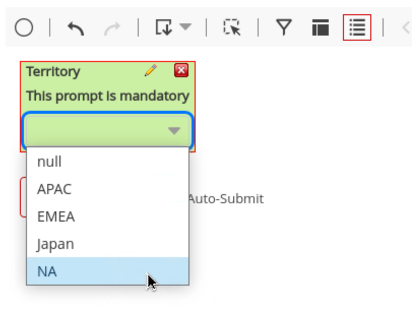<figcaption>
Select Territory = NA
</figcaption></figure>

> **Note:** We'll be revisiting Prompts ..!

### Totals

> **Note:** You can apply a summary function to columns containing numeric values to add subtotals and grand totals to your report.
> 
> To apply a summary function to a numeric value, click the drop-down arrow next to the column header, and then select Summary from the context menu.&#x20;
> 
> You can then specify to summarize the data using one of the following functions:
> 
> &#x20; • None
> 
> &#x20; • Average
> 
> &#x20; • Count
> 
> &#x20; • Count Distinct
> 
> &#x20; • Maximum / Minimum
> 
> &#x20; • Sum
> 
> After the total is added to the report, you can customize the label in the cell next to the total.

1. Remove all the filters / Prompts.

<figure>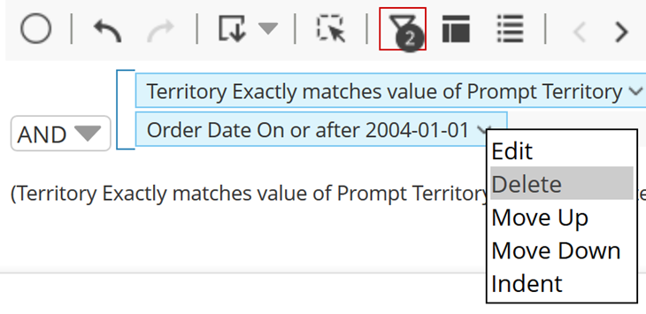<figcaption>
Remove all Filters
</figcaption></figure>

2. Group the report by Territory and Country.

<figure>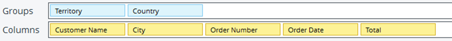<figcaption>
Report layout
</figcaption></figure>

3. Uncheck the Filters option in Interactive Toolbar.
4. To add totals for the Total column, in the report details:

   &#x20; • Click the drop-down arrow next to the Total column header.

   &#x20; • Click Summary.

   &#x20; • Click Sum.

<figure>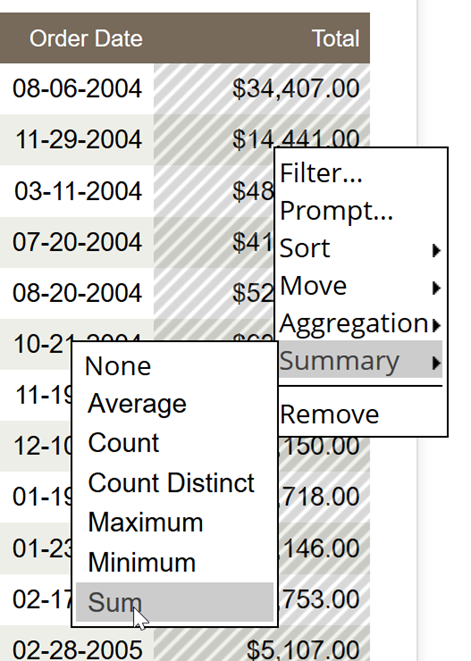<figcaption>
Add Totals
</figcaption></figure>

5. To edit the label for the Country subtotals:

   &#x20; • Point to the cell just to the *left* of the Australia subtotal.

   &#x20; • Double-click.

   &#x20; • In the text box, type Country Subtotal.

   &#x20; • Press Enter.

<figure>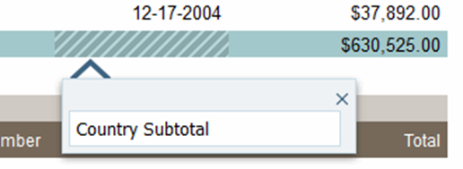<figcaption>
Add caption
</figcaption></figure>

6. Repeat the workflow for Territory and Grand Total.

***

#### Calculated Measures

> **Note:** You can create calculated fields from fields that are available in the data source and from other calculated fields. When you create a calculated field, a new field is generated in the Calculated Fields list. The values are determined by the kind of calculation the function performs. You can add these fields to the columns or groups in the layout to create more robust reports.&#x20;
> 
> Generic functions like now() or 2+5 cannot be added to an empty layout. These generic functions can be added after the layout has at least one column or group from a data source field.&#x20;
> 
> The Filter, Prompt, Sort, and Aggregation options are not supported for calculated fields.

1. Select the Data tab in the Interactive Report in which you want to add a calculated field.
2. Navigate to the bottom of the Data tab, locate the Calculated Fields entry.

<figure>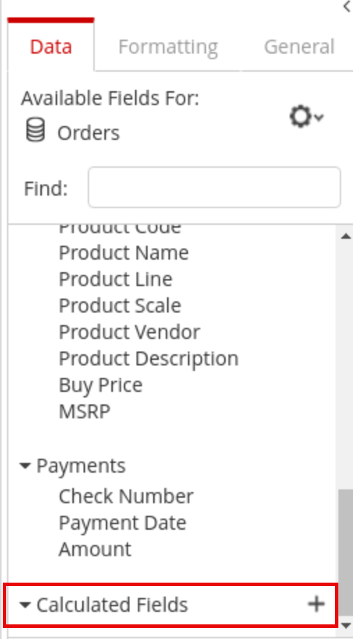<figcaption>
Calculated Fields
</figcaption></figure>

3. Click the + sign on the Calculated Fields.
4. To calculate the Tax:  =\[BC\_ORDERDETAILS\_TOTAL]\*0.15

<figure>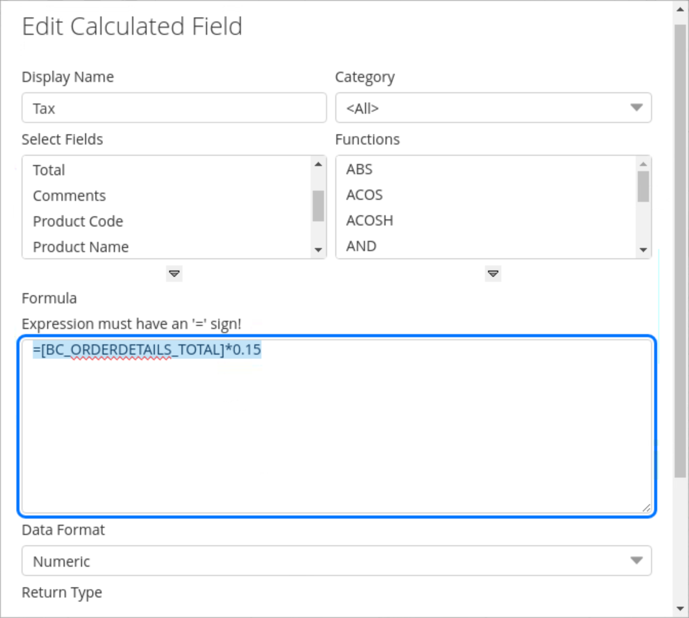<figcaption>
Calculated Measure - Tax
</figcaption></figure>

5. Add to the Report Drag & Drop.

> **Note:** If you're creating alot of Calculated Measures, then BP is to add them to the Schema.

### Format & Save

> **Note:** You can add a report title or text to a report header and footer by double- clicking the label in the appropriate section on the first page of the report.
> 
> Formatting options such as font type, font size, colour, background colour, and text alignment are available under the **Formatting** panel in the **Selection Pane**. Buttons are also available to copy, paste, and remove formatting. To apply formatting, first select the object in the report. The appropriate formatting buttons activate based on the type of object selected.
> 
> By default, Interactive Reporting presents you with a page in Letter format (8.5” x 11”) in portrait mode. You can change the page format, orientation, and margin sizes by clicking the **Page Setup** button found on the **General** panel in the **Selection Pane**.
> 
> If a report contains numeric values, you may need to change the formatting of those values (for example, to include a currency symbol). Select the column that contains the numeric values, and then specify the numeric format on the **Formatting** panel. In some instances, formatting is applied based on the metadata associated with the data source. This formatting can be overridden.

> **Note:** To finish off the report we're going to:
> 
> &#x20; • Add a title for the report and centre it&#x20;
> 
> &#x20; • Add text to the report header&#x20;
> 
> &#x20; • Format column headers and data&#x20;
> 
> &#x20; • Change the column header for the Total column&#x20;
> 
> &#x20; • Change the page layout to landscape.

1. To add a report title, in the title area:

   &#x20; • Double-click on Untitled.

   &#x20; • In the text box type Sales Territory Report.

   &#x20; • Press Enter.

<figure>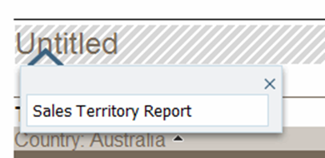<figcaption>
Add a Report Title
</figcaption></figure>

2. To centre the report title, in the Selection Pane, click the Formatting tab, and then click the Align Center icon.

<figure>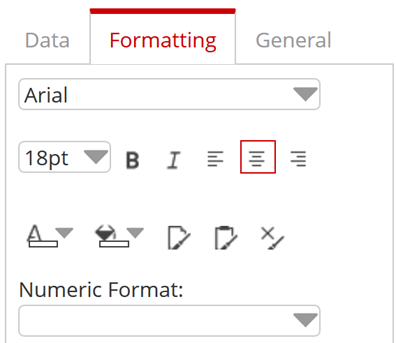<figcaption>
Fomatting options
</figcaption></figure>

3. To add text to the report header, in the header area:

   &#x20; • Point to the *left* side.

   &#x20; • Double-click.

   &#x20; • In the text box, type Steel Wheels, Inc.

   &#x20; • Press Enter.

<figure>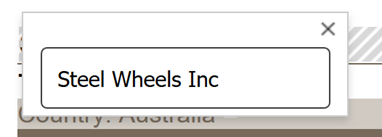<figcaption>
Report Title
</figcaption></figure>

4. Select the City column header in the report details, and in the Formatting panel, click the Bold icon, and then click the Align Center icon.
5. Click within the City data column, and in the Formatting panel, click the Align Center icon.

<figure>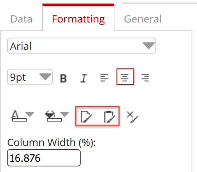<figcaption></figcaption></figure>

6. To copy the formatting of the City column header and apply it to the Order Number column header, in the report details:

   &#x20; • Click the City column header.

   &#x20; • On the Formatting panel, click the Copy formatting icon.

   &#x20; • In the report details, click the Order Number column header.

   &#x20; • On the Formatting panel, click the Paste formatting icon.
7. To remove the decimal places from the Total column, in the report details:

   &#x20; • Click within Total data column.

   &#x20; • On the Formatting panel, click the drop-down arrow for Numeric Format.

   &#x20; • Select $#,###.
8. To change the column header for the Total column:

   &#x20; • Double-click the Total column header.

   &#x20; • In the text box, type Revenue.

   &#x20; • Press Enter.
9. To change the page format to landscape, in the Selection Pane, click the General panel, and then click the Page Setup button.

<figure>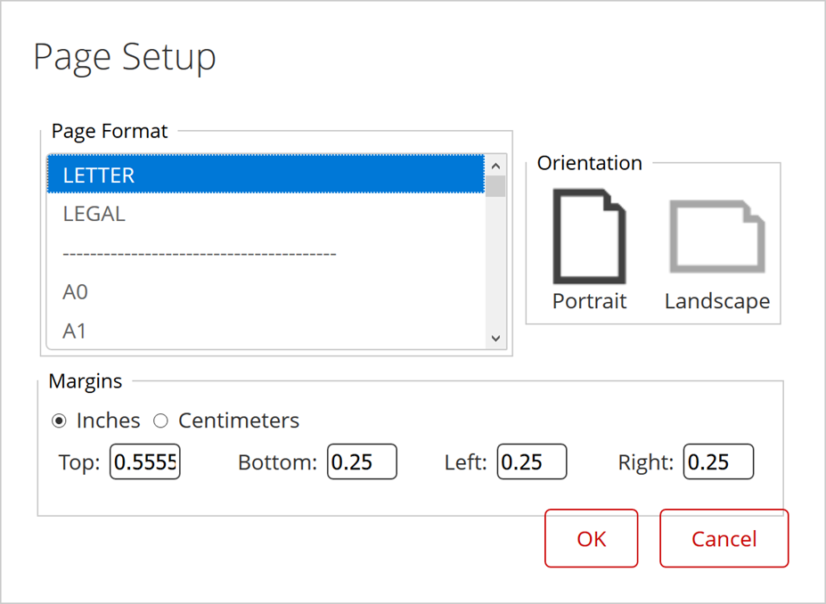<figcaption>
Page setup
</figcaption></figure>

***

> **Note:** You can save your report using the Save or Save As toolbar buttons, or by selecting **File > Save** or **File > Save As** from the menu. When you save the report, you must specify both a filename and a repository location.

1. To save the report, on the toolbar click the **Save** icon.

<figure>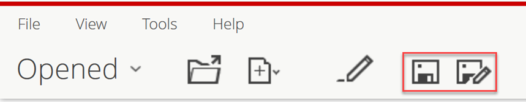<figcaption></figcaption></figure>

2. To save the report:

   &#x20; • In the Filename field, type Sales Territory Report - Demo.

   &#x20; • For the Location, click the Up One Level icon twice.

   &#x20; • In the list of folders, double-click Public.

   &#x20; • In the list of folders, double-click Training.

   &#x20; • Click Save.

<figure>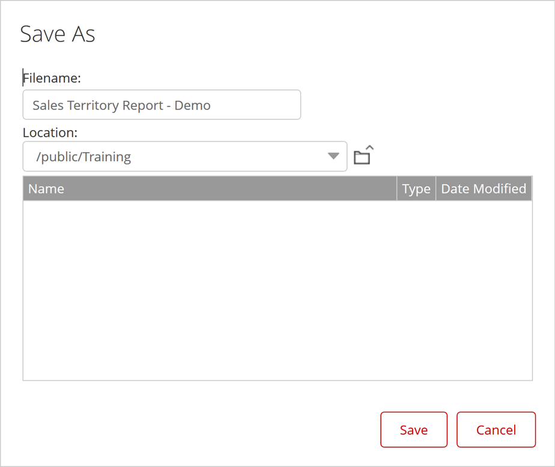<figcaption>
Save Report
</figcaption></figure>

:::

### Query Settings

> **Note:**
>
> #### Query Settings
> 
> The Query Settings dialog box is found on the Data panel.

> **Note:**
>
> #### **Enabling Row Limit and Query Timeout**
> 
> You can limit the number of rows that are displayed in your report. You can also limit the number of seconds a query runs before a timeout occurs. Imposing row limits and timeouts on queries is important to avoid out of memory errors or processes that consume too many resources on the database server.
> 
> In the **Data** tab, click the small icon on the upper right corner to open the Query Setup dialog box. Make your changes as needed and close the dialog box when you are done.

> **Note:**
>
> #### Auto Refresh
> 
> When you disable the **Auto Refresh** mode in Interactive Report you can design your report layout first, including calculations and filtering, without querying the database until you are done. Once the report layout is complete, you can re-enable Auto Refresh mode. Data retrieval will occur once and your report will display the requested data. Disable auto refresh if you want to reduce the number of queries executed against the data source or if you know that the data source returns data slowly.
> 
> To disable Auto Refresh, click the small icon in the upper right corner of the Data tab to open the Query Setup dialog box, then disable the Auto Refresh option.

::::

