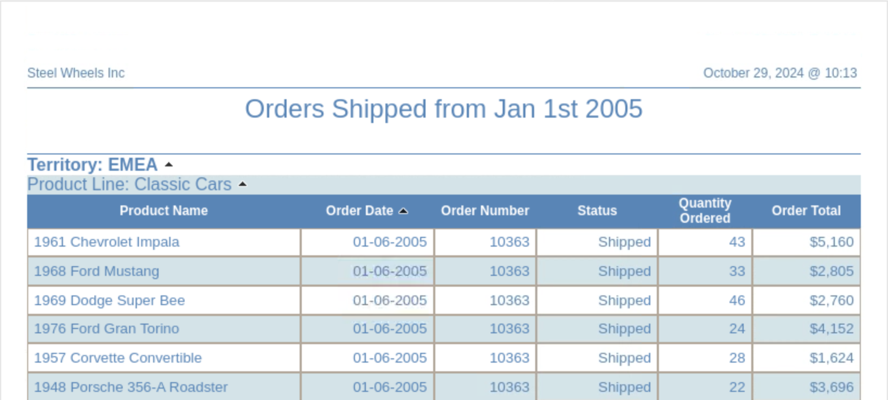
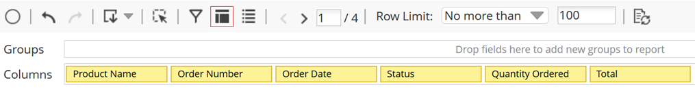
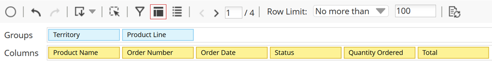
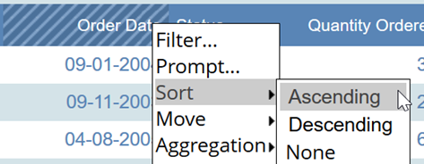
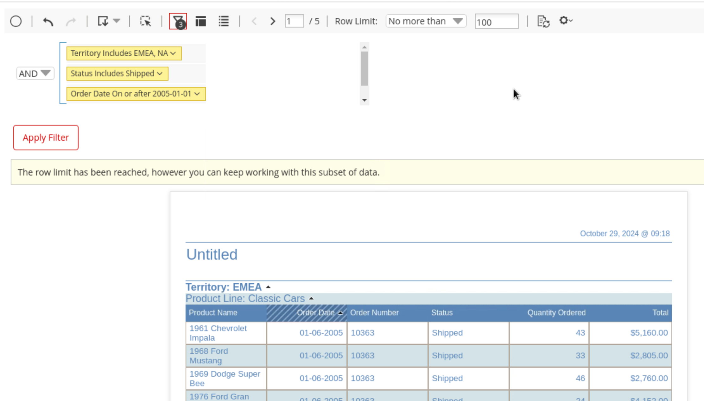
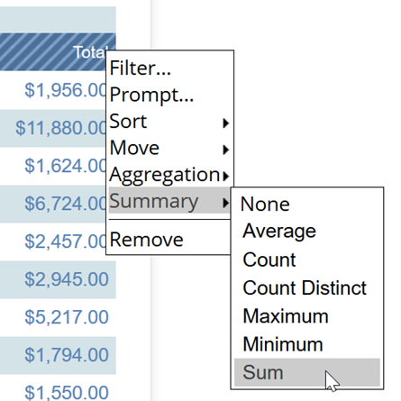
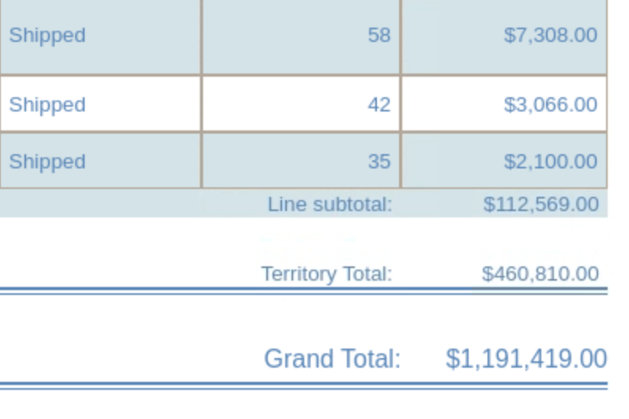
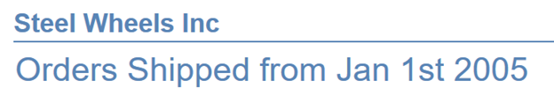
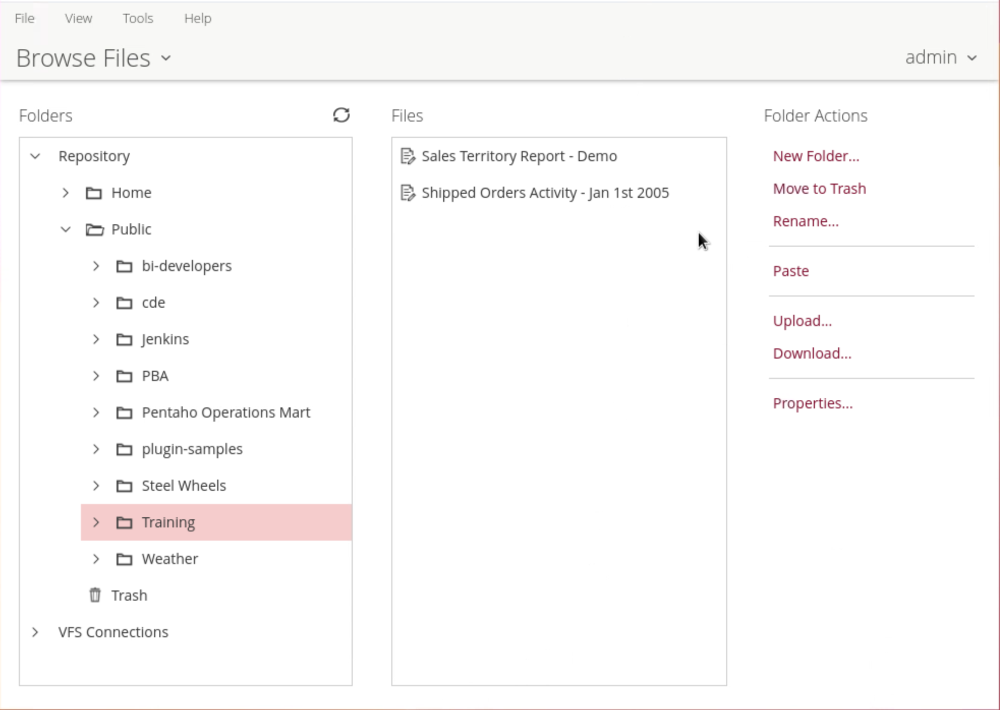

# Orders - NA & EMEA

> **Warning:**
>
> #### Workshop - NA & EMEA
>
> Business reporting often means filtering data to specific regions and time periods to support decision-making. In this advanced Interactive Reporting workshop, you build a filtered report for Steel Wheels showing order details for the EMEA and NA territories, focusing on orders shipped on or after January 1, 2005.
>
> In this workshop, you expand your Interactive Reporting skills with multiple filters, hierarchical groupings, and summary calculations at different levels.
>
> **What you'll do**
>
> * Select the Orders data source and apply the Left Aligned - Cobalt report template
> * Add essential data columns (Product Name, Order Date, Order Number, Status, Quantity Ordered, Total) and reorder them logically
> * Create hierarchical report groups with Territory as the primary group and Product Line as a subgroup
> * Apply ascending sort on Order Date to organize records chronologically
> * Implement multiple filters to display only Shipped orders from EMEA and NA territories on or after January 1, 2005
> * Add summary calculations (Sum) on the Total column with properly labeled subtotals and grand totals
> * Customize the report with a descriptive title and company header (Steel Wheels, Inc.)
> * Format numeric data with appropriate currency symbols and decimal places
> * Refine column headers and alignment for professional presentation
> * Save the completed report to the Public/Training repository folder with a descriptive filename
>
> **Prerequisites:** Pentaho Business Analytics Server with Orders sample data source configured.
>
> **Estimated time:** 15 minutes

<figure><figcaption>
Orders Shipped
</figcaption></figure>

***

::: tabs

### Data Source & Data

> **Note:** To select the Data Source and Report Template.

1. From the User Console Home Perspective, click Create New > Interactive Report.
2. In the Select Data Source window, click Orders, and then click OK.
3. In the Selection Pane, click the General tab, and then click Select.
4. Use the left and right arrow to scroll through the available templates, and then select: Left Aligned - Cobalt.
5. From the top Toolbar panel: In the Row Limit box, enter No more than 100.

***

> **Note:** To add Product Name, Order Number, Order Date, Status, Quantity Ordered, and Total to the report.

1. In the Selection Pane, click the Data tab.
2. Select Product Name from the Data panel, and drag it to the Report Canvas.
3. Select Order Number from the Data panel, , then drag it to the Report Canvas and drop it to the *right* of Product Name.
4. Add the following additional fields:

   &#x20; • Hold the Ctrl key

   &#x20; • Select Order Date, Status, Quantity Ordered, and Total.

   &#x20; • Right-click & Select Add to Columns.
5. In the Interactive Toolbar, click the Layout button.
6. Click Order Date and drag it between Product Name and Order Number.

<figure><figcaption>
Report layout
</figcaption></figure>

### Group, Sort & Filter

> **Note:** To add a report group for Territory and a subgroup for Product Line.

1. From the Data panel, drag Territory to the Report Canvas and place it *above* the column headers.
2. From the Data panel, drag Product Line to the canvas and place it *below* the Territory group.

<figure><figcaption>
Group - Territory &#x26; Product Line
</figcaption></figure>

***

> **Note:** To sort the Order Date column.

1. Click the drop-down arrow next to the Order Date column header, and then select Sort > Ascending.

<figure><figcaption>
Sort - Ascending on Order Date,
</figcaption></figure>

***

> **Note:** To filter the report to only show shipped orders on or after January 1, 2005 for EMEA and NA.

1. On the Interactive Toolbar, click the Filter button.
2. From the Data panel, select Territory and drag it to the Filters panel.
3. In the Filter on Territory dialog box:

   &#x20; • Select: Select from a list.

   &#x20; • From the list of values, hold the Ctrl key and click EMEA and NA.

   &#x20; • Click the right arrow to move EMEA and NA to the Currently Included list.

   &#x20; • Click OK.
4. In the report details, click the Status column header and drag it to the Filters panel.
5. In the Filter on Status dialog box:

   &#x20; • Select: Select from a list.

   &#x20; • From the list of values, click Shipped.

   &#x20; • Click the right arrow to move Shipped to the Currently Included list.

   &#x20; • Click OK.
6. In the report details, click the Order Date column header and drag it to the Filters panel.
7. In the Filter on Order Date dialog box:

   &#x20; • From the available constraints drop-down list, select On or after.

   &#x20; • Click the next drop-down arrow.

   &#x20; • Navigate to January 2005.

   &#x20; • Select January 1, 2005 (2005-01-01)

   &#x20; • Click OK.

<figure><figcaption>
Filters
</figcaption></figure>

### Totals

> **Note:** To add totals for the Total and add labels for the subtotal and grand total lines.

1. To add totals for the Total column, in the report details:

   &#x20; • Click the drop-down arrow next to the Total column header.

   &#x20; • Click Summary.

   &#x20; • Click Sum.

<figure><figcaption>
Sum - Totals
</figcaption></figure>

> **Note:** You may need to set the Row Limit to: Maximum

2. Edit the label for the Product Line subtotals: Page 4
3. Edit the label for the Territory subtotals: Page 10
4. Edit the label for the grand total: Page 15

<figure><figcaption>
Totals
</figcaption></figure>

### Refine Report & Save

> **Note:** Add a report title, add text to the report header, resize the columns, and reformat column headers and data:

1. Add a report title, in the title area: Orders Shipped from Jan 1st 2005.
2. Centre the report title.
3. Add text to the report header, in the header area: Steel Wheels, Inc.

<figure><figcaption>
Title
</figcaption></figure>

4. Resize columns.
5. Center align header text.
6. Format the decimal places from the Total column: $#,###
7. Change the column header for the Total column: Order Total

***

> **Note:** Save the report to the repository:

1. To save the report, on the toolbar click the Save icon.
2. To save the report:

   &#x20; • In the Filename field, type Shipped Orders Activity – Jan 1st 2005.

   &#x20; • For the location, click the Up One Level icon twice.

   &#x20; • In the list of folders, double-click Public.

   &#x20; • In the list of folders, double-click Training & Save.

<figure><figcaption>
Reports
</figcaption></figure>

:::

> **Success:** You've built a sophisticated business report that combines temporal and categorical filters, multi-level grouping, and summary calculations to professional standards.
