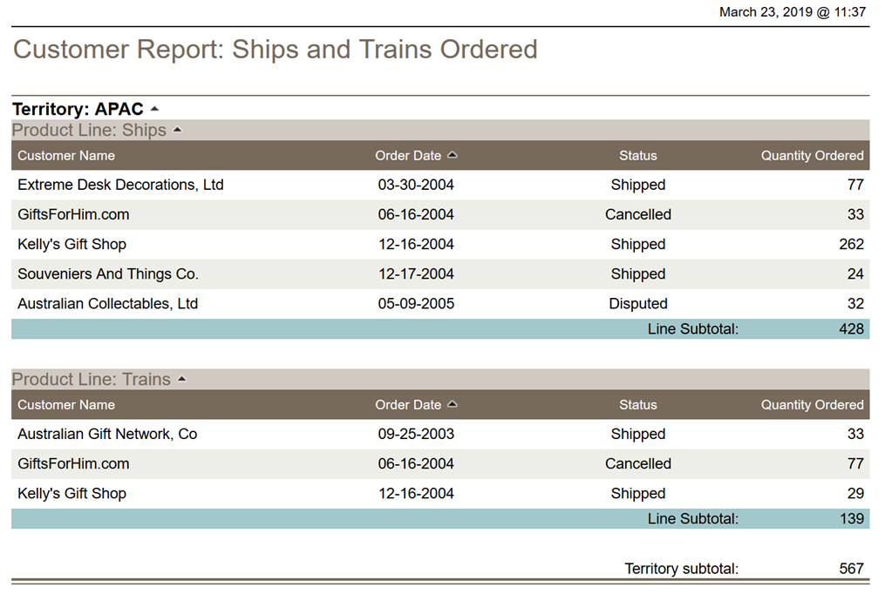

# Ships & Trains

> **Warning:**
>
> #### Workshop - Ships & Trains Ordered
> 
> The Steel Wheels sales manager needs visibility into the ships and trains product lines, so you'll build a filtered, grouped, and summarized Interactive Report independently from requirements rather than step-by-step instructions.
> 
> In this workshop, you build a business report that reveals ordering patterns for ships and trains across customers and territories, making your own decisions about data selection, grouping, sorting, and formatting while following guidelines that define the expected outcome.
> 
> **What you'll do**
> 
> * Select the Orders data source and apply the Left Aligned - Nickel report template
> * Add required data columns (Customer Name, Order Date, Status, Quantity Ordered)
> * Filter the report to display only Ships and Trains product lines
> * Create hierarchical groups with Territory as the primary group and Product Line as a subgroup
> * Sort the report by Order Date in ascending order
> * Add subtotals for Quantity Ordered at both the Product Line and Territory levels
> * Calculate and display a grand total for all orders
> * Customize page headers and footers with appropriate text
> * Adjust column widths and refine formatting for professional presentation
> * Save the completed report to the repository with a descriptive name
> 
> **Prerequisites:** Completion of previous Interactive Reports workshops (Sales Territory, Orders NA & EMEA)
> 
> **Estimated time:** 20 minutes

<figure><figcaption>
Report - Ships &#x26; Trains
</figcaption></figure>

> **Note:**
>
> #### Report Guidelines
> 
> The following guidelines may help you in creating your report:
> 
> &#x20; • Use the Orders data source and the Left Aligned - Nickel template
> 
> &#x20; • Add text to the page header and footer
> 
> &#x20; • Change the column sizes and refine the report format appropriately
> 
> &#x20; • The report should be sorted by Order Date and should show subtotals for each Product Line by Territory, as well as a grand total.&#x20;
