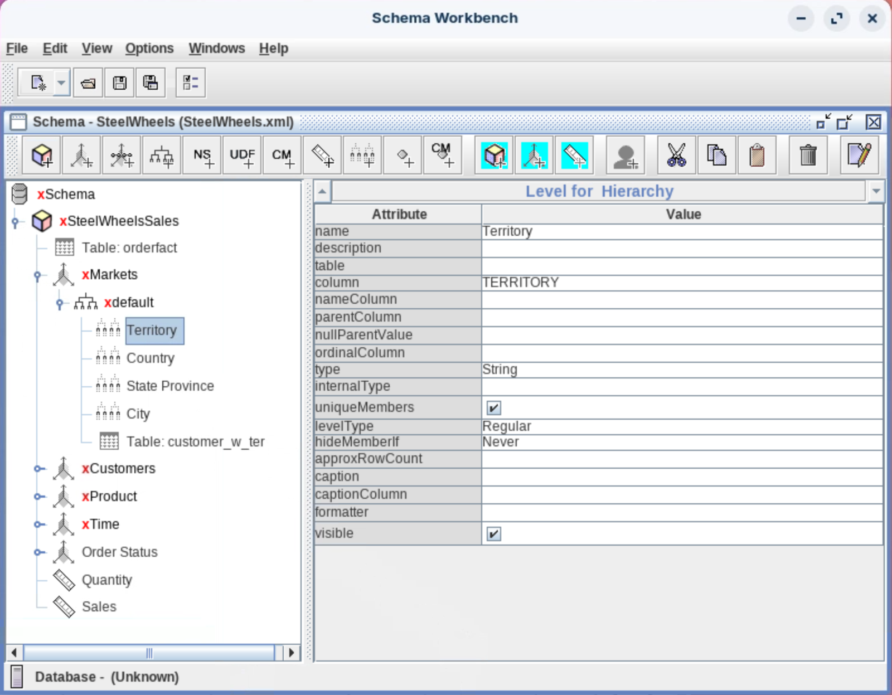

# Overview of Analyzer Reports

> **Note:**
>
> #### Introduction
> 
> Pentaho Analyzer is an interactive analysis tool that provides you with a rich Web-based, drag-and-drop user interface, which makes it easy for you to create reports based on your exploration of your data.&#x20;
> 
> You can also display Pentaho Analyzer reports in a dashboard. Unlike standard reports which tend to be static or minimally interactive after they are created, Pentaho Analyzer reports allow you to explore your data dynamically and to drill down into the data to discover previously hidden details.

**🎥 Embed:** [Analyzer](<https://www.loom.com/share/c6a12105d1bc486dbc60849a6bb30dd5?hideEmbedTopBar=true&hide_owner=true&hide_share=true&hide_title=true>)

> **Note:** Pentaho Analyzer presents data multi-dimensionally and lets you select what dimensions and measures you want to explore. Use Analyzer to drill, slice, dice, pivot, filter, chart data and create calculated fields. Users of Analyzer reports can query the data in a database without having to understand how the database is structured.

<figure><figcaption>
Schema Workbench - SteelWheels
</figcaption></figure>

> **Note:** Before you can create an Analyzer Report you must have access to a data source, (relational database table(s) or a CSV file) provided by an administrator or a user with create data source permission. The data source used for an Analyzer Report is based on a Mondrian schema (also referred to as an Analysis Model).&#x20;
> 
> Mondrian schemas are XML models that have cube-like structures which use fact and dimension tables found in a relational database (OLAP). A Mondrian schema is created using Schema Workbench or generated by the Data Source Wizard, (either through a manually entered SQL query, an auto-query written against one fact table, multiple database tables joined to a fact table, or a CSV file).

***

> **Note:**
>
> #### Use Cases
> 
> An Analysis Report answers the following reporting criteria:
> 
> * Analyze business data quickly in an interactive environment that focuses on the interaction, exploration, and visualization of data...
> * Perform advanced sorting and filtering on your data; you want to drill through reports into the underlying data...
> * You want to see chart visualizations that include conditional stop-lighting...
