# Sales Analysis

> **Warning:**
>
> #### Workshop - Sales Analysis
> 
> Pentaho Analyzer is the OLAP tool for building dynamic, drag-and-drop analyses that business users explore on demand, drilling from summary to detail without returning to IT.
> 
> In this workshop, you build interactive pivot table analyses on the Steel Wheels sample data, revealing sales patterns across territories, product lines, and time periods, then extend them with calculations, formatting, visualizations, and export.
> 
> **What you'll do**
> 
> * Understand the three fundamental field types in Analyzer (measures, dimensions, and properties) and how they work together
> * Build a pivot table analysis by dragging dimensions to rows and columns and measures to the data area
> * Apply multiple filters to restrict analysis to specific territories, time periods, and top performers
> * Implement sorting and hierarchical drilling to navigate from years to quarters to months to details
> * Add subtotals at multiple levels and grand totals for comprehensive summarization
> * Create conditional formatting using color scales, data bars, and trend arrows to highlight patterns
> * Build user-defined measures including percentage calculations and custom formulas (Sales plus Tax)
> * Enable drill-through links that allow users to view supporting transaction details from summary cells
> * Customize column headers, numeric formats, and presentation elements for professional output
> * Switch seamlessly between table and chart views (column charts, pie charts, heat grids)
> * Export analyses to multiple formats (PDF, Excel, CSV) for distribution and further analysis
> * Explore administrative options including XML configuration, MDX query logging, and cache management
> 
> **Prerequisites:** Pentaho Business Analytics Server with Steel Wheels sample data and configured OLAP schema\
> **Estimated time:** 30 minutes

<figure>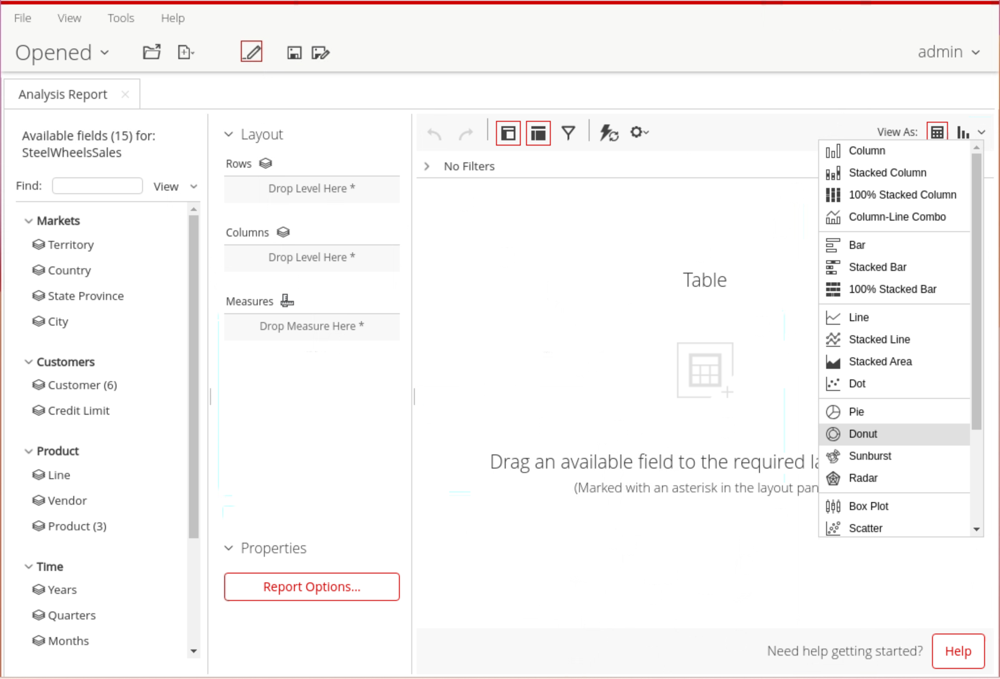<figcaption>
Analyzer Reports
</figcaption></figure>

***

:::: tabs

### Leading Product Lines

> **Note:**
>
> #### Leading Product Lines
> 
> The analysis shows the Sales, Quantity, and Unit Sales for each year by Territory and Line, and includes subtotal lines for each Territory, as well as a grand total line. The Quantity column includes data bars to quickly visualize and compare values.&#x20;
> 
> The background colour for the Unit Sales column is formatted using a colour scale range. The report values include hyperlinks allowing you to drill down to the supporting data for each value.

1. To open the Leading Product Lines Report, in the Folders pane, expand Public > Steel Wheels, and then in the Files pane, double-click Leading Product Lines (pivot table).

<figure>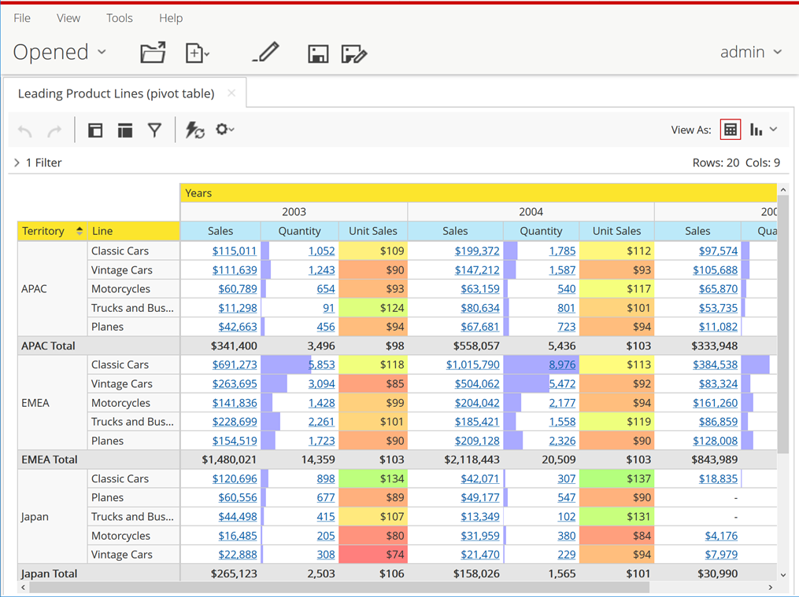<figcaption>
Leading Product Lines
</figcaption></figure>

> **Note:** The Interactive Toolbar includes toggle buttons to add more fields to the report, rearrange fields on the report, and show the filters in use. There are also buttons to undo or redo changes.
> 
> The More actions and options button provides export options, additional report and chart options, and reset options.

3. To view the available fields, on the interactive toolbar, click the Add more fields onto the report button.

<figure>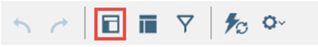<figcaption>
Available fields
</figcaption></figure>

> **Note:** The Available Fields pane shows the data source and the fields available. The fields are listed by category, but you can use the View drop-down list to view the fields by type, alphabetically, or schema.

4. To view the Layout panel, on the interactive toolbar, click the Rearrange fields on the report button.

<figure>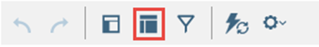<figcaption>
Layout
</figcaption></figure>

> **Note:** The Layout panel shows the rows, columns, and measures used in the report. At the bottom is the Report Options button.

5. To keep only the 2003 data, on the canvas, right-click the 2003 column header, and then click Keep Only 2003.

<figure>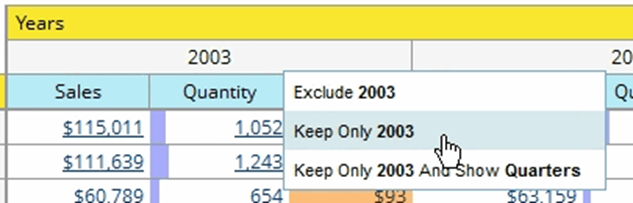<figcaption>
Filter - 2003
</figcaption></figure>

6. To drill down to show the Quarters, on the canvas, double-click the 2003 column header.

<figure>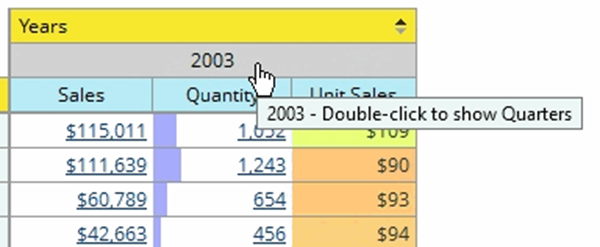<figcaption>
Drill down - Quarters
</figcaption></figure>

> **Under the hood:**
>
> #### Keep Only and drill-down rewrote an MDX query
>
> Analyzer never shows you SQL because its language is MDX. The report
> is a definition — measures, row and column attributes, filters, each
> stored as a schema formula such as `[Time].[Years]` — and every
> gesture edits it and sends a new MDX query to Mondrian, the server's
> OLAP engine. Keep Only 2003 narrowed the column axis to
> `{[Time].[2003]}`; double-clicking asked for `[Time].[2003].Children`,
> the quarters, which exist because the Time hierarchy in the
> SteelWheels schema is Years > Quarters > Months. Mondrian translates
> each MDX statement into SQL against the fact and dimension tables and
> hands back cells. Administration > Log shows exactly that MDX.
>
> **Why it matters:** the hierarchy in the schema is what makes
> drilling a double-click instead of a rebuilt query. Design the schema
> well once and every report inherits the navigation.

7. To view the analysis as a chart, on the interactive toolbar click the Choose chart type button, and then click Column.

<figure>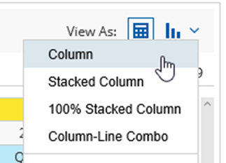<figcaption>
Chart options
</figcaption></figure>

8. To view the report in table format, on the interactive toolbar, click the Switch to table format button.

<figure>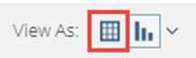<figcaption>
Switch to Table format
</figcaption></figure>

***

> **Note:**
>
> #### Chart Types

1. To open the Country Performance heat grid, on the main toolbar, click the Open button.

<figure>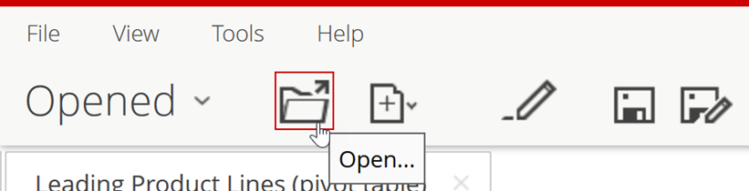<figcaption></figcaption></figure>

2. Navigate to the Public folder, click the Up One Level button twice, and then double-click the Public folder.
3. Double-click the Steel Wheels folder, then click Country Performance (heat grid), and then click Open.

<figure>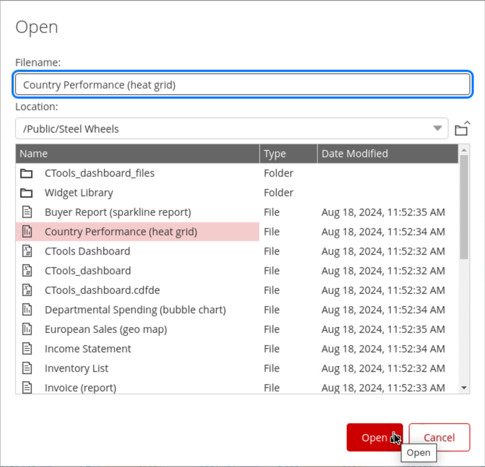<figcaption>
Report List
</figcaption></figure>

4. View the Country Performance heat grid.

<figure>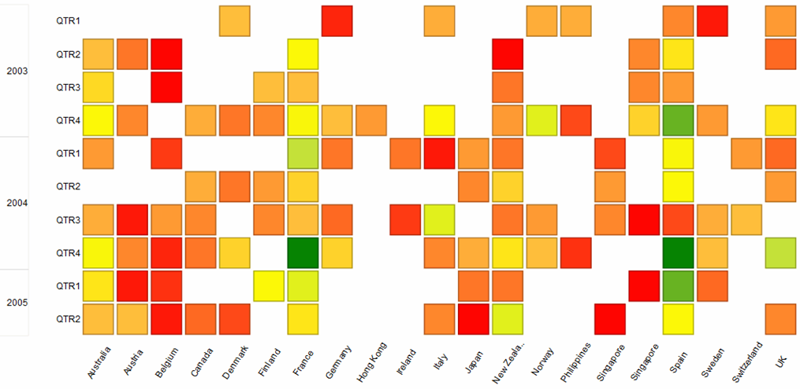<figcaption>
Heat Grid - Country Performance
</figcaption></figure>

> **Note:** The Country Performance heat grid shows Sales by Year and Quarter for each country. The colour coded squares provide a visual representation of the data.
> 
> The data for Belgium indicates sales have been consistently low, and sales for France have been fair. We can quickly see that France had a good fourth quarter in 2004, and Spain has had several good quarters.

5. To view the underlying details for a specific square, hover the cursor over the red square for Belgium, 2003, QTR2.

<figure>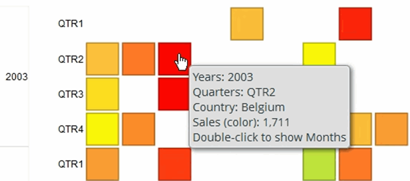<figcaption>
Belgium - 2003 - QTR2
</figcaption></figure>

6. Click the Spain label.

<figure>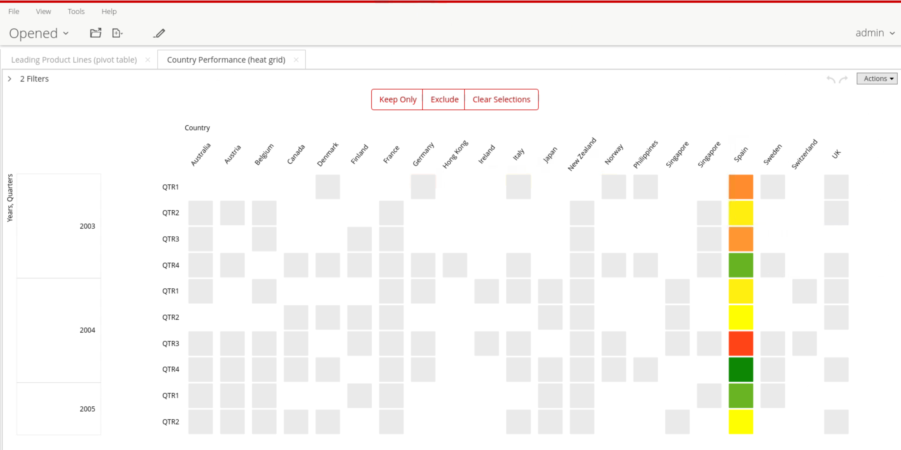<figcaption>
Spain data
</figcaption></figure>

> **Note:** The data for Spain is in colour, but the rest of the chart data is dimmed. The buttons to Keep Only, Exclude, and Clear Selections at the top of the heat grid enable you to include / exclude the data selected.

7. Drill into the data for Spain at the top of the heat grid, click the Keep Only button.
8. To view the Available Fields and Layout panels, on the interactive toolbar, click the Add more fields onto the report and Rearrange fields on the report buttons.

<figure><figcaption>
Fields &#x26; Layout
</figcaption></figure>

9. To see the sales data for specific product lines in Spain, from the Available Fields pane, select Line and drag it to the X Axis area in the Layout panel.

<figure>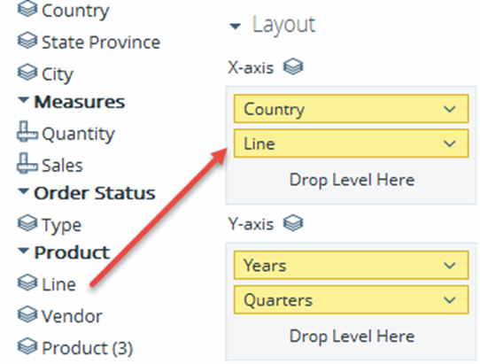<figcaption>
Add Line
</figcaption></figure>

> **Note:** Sales for classic cars were best in Q1 of 2005, but they began to improve in the Q4 of 2004.

<figure>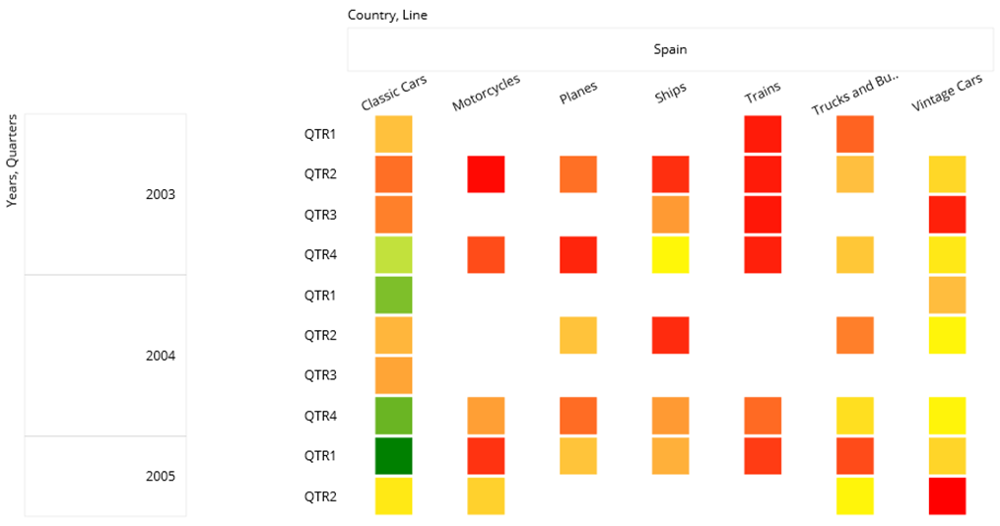<figcaption></figcaption></figure>

10. Drill down to the months, double-click the green square for Classic Cars, 2004, QTR4. December was the best month of the quarter.

<figure>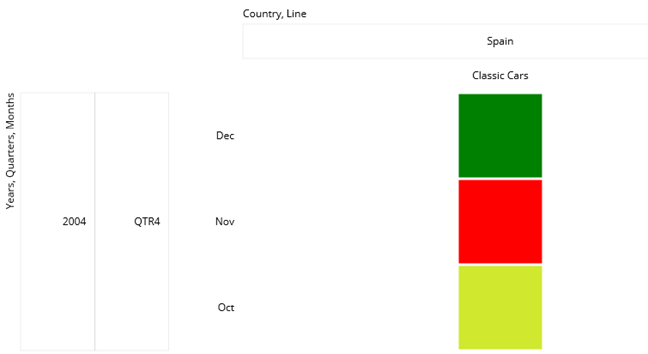<figcaption>
Drill down into Classic Cars, 2004, QTR4
</figcaption></figure>

11. Drill down to the Vendor, double-click the green square for December.

<figure>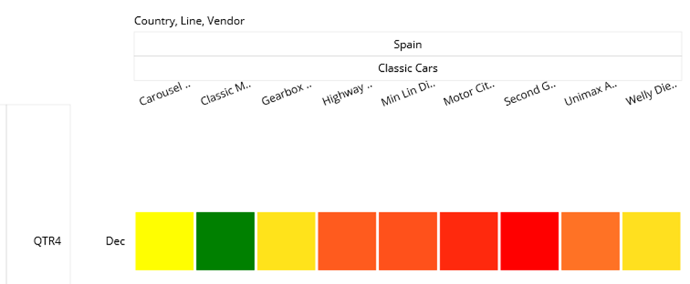<figcaption>
Drill down into December for Vendor
</figcaption></figure>

> **Under the hood:**
>
> #### The cells you had already seen were not fetched again
>
> Mondrian keeps a segment cache: blocks of cell values keyed by the
> measure and the members that identify them. When you kept only Spain
> and added Line, then drilled into 2004 QTR4 and into December, only
> the new coordinates — finer levels, this country — needed SQL; the
> coarser cells came from cache, which is why later drills feel faster
> than the first. Switching between heat grid, chart and table doesn't
> query at all: the visualisation is drawn in the browser from the same
> result.
>
> **Why it matters:** exploration is cheap after the first query, and
> the cache is shared across users, so the tenth analyst on the same
> cube mostly never touches the database — which is also why Clear
> Cache exists for the moment the data changes.

> **Note:** Classic Metal Creations was the highest performing vendor. You could continue drilling down, however, selecting Table will make sense for exporting the sales data.

12. On the report title bar, click the View As Table button.

<figure>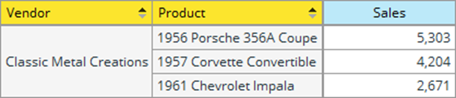<figcaption>
Table
</figcaption></figure>

13. On the report toolbar, click More actions and options > Export > To PDF, and then in the Export to PDF window, click Export.

<figure>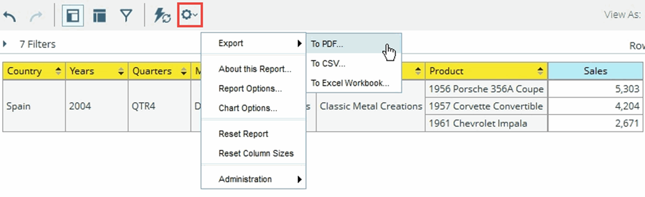<figcaption>
Export as PDF
</figcaption></figure>

> **Note:** Selecting PDF opens in a new browser window. You can save or print the PDF using the PDF toolbar.

14. Close the PDF browser window.
15. On the report toolbar click More actions and options > Reset.

### Sales Analysis

> **Note:**
>
> #### Sales Analysis
> 
> The report will display Sales Revenue grouped by Territory and Product Line over time.

<figure>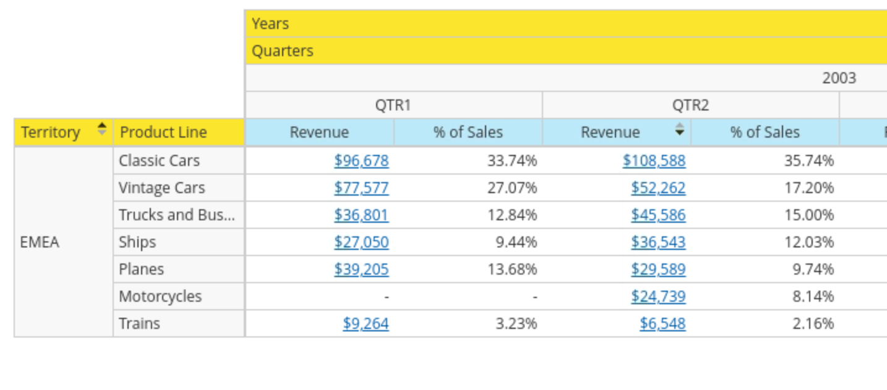<figcaption>
Final Table - EMEA: Revenue by Product Line Yr2003
</figcaption></figure>

::: tabs

### Data Source

> **Note:** 

1. From the User Console Home Perspective, click Create New > Analysis Report.
2. In the Select Data Source window, click Steel Wheels: SteelWheelsSales, and then click OK.

<figure>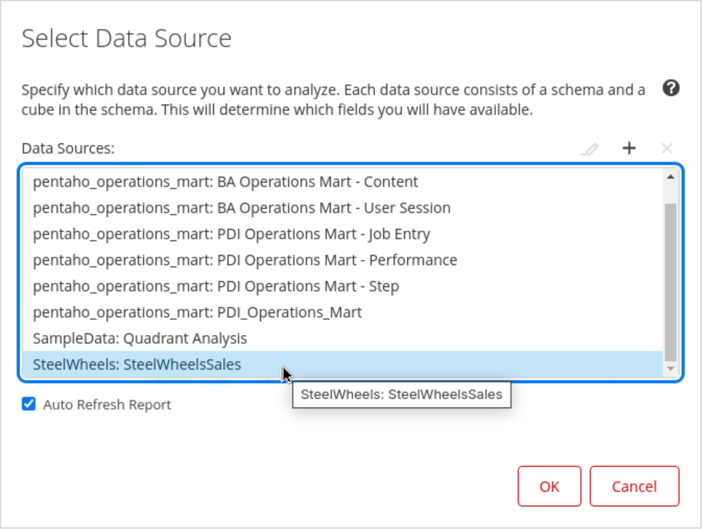<figcaption>
SteelWheels: SteelWheelsSales
</figcaption></figure>

***

> **Note:** **Data Types**
> 
> When you first open Analyzer, the available fields associated with the data source you select are displayed in the Available Fields panel.
> 
> The Available Fields panel consists of a list of measures and dimensions.
> 
> &#x20; • Measures: consist of the numeric data that can be calculated, and are depicted with the ruler icon.
> 
> &#x20; • Dimensions: are different aspects of the calculated data, and are depicted with the stacked squares icon. If a dimension has a number in parenthesis next to it, this indicates it has associated properties.
> 
> &#x20; • Properties: are single data items related to a database object. The database schema associates one or more properties with each database entity.  For example, the dimension ‘Product’ can have the properties: colour, shape, size, weight, etc..

<figure>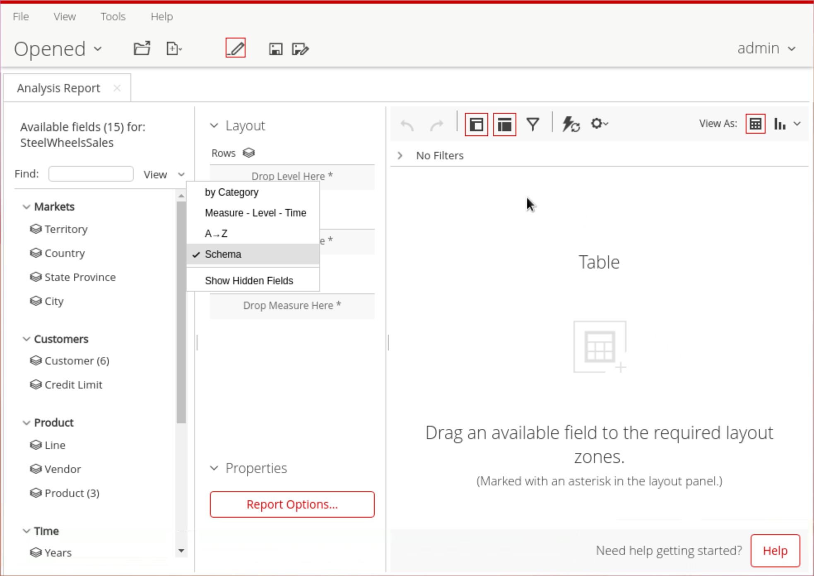<figcaption></figcaption></figure>

1. From the Available Fields panel, select Country and drag it to the Rows drop zone on the Layout panel.

<figure>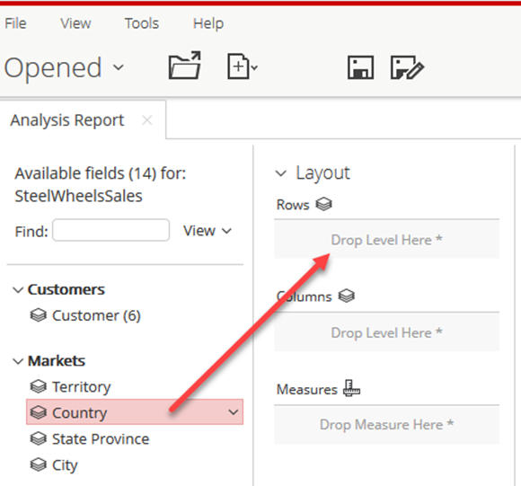<figcaption>
Add Country field
</figcaption></figure>

2. To remove Country, from the canvas:

   ·        Click the Country header.

   ·        Drag it to the lower right corner of the canvas.

   ·        Drop it in the trashcan.

<figure><figcaption></figcaption></figure>

3. Add Sales to the report by dragging it to the Measures drop zone on the Layout panel.
4. From the Available Fields panel, double-click Territory.
5. Select Years and drag it to the Columns drop zone on the Layout panel.
6. Select Quarters and drag it to the Columns drop zone on the Layout panel. Drop Quarters *below* Years.

<figure>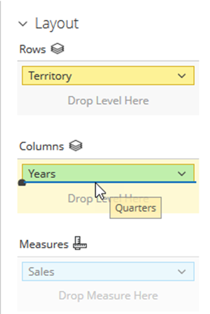<figcaption></figcaption></figure>

7. Select Line and drag it to the Rows drop zone on the Layout panel. Drop Line *above* Territory.

<figure>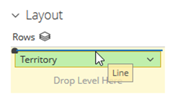<figcaption></figcaption></figure>

> **Note:** When you add columns and rows Analyzer dynamically aggregates the Measure to the required level.

8. To rearrange the fields, on the Layout panel, click Territory and drag it *above* Line.

<figure>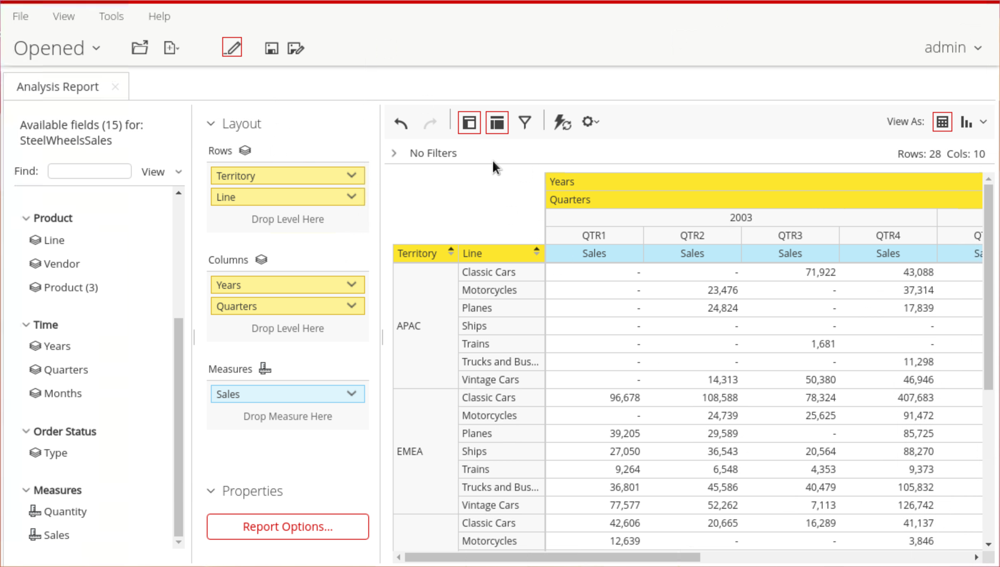<figcaption>
Report - Territory Sales Analysis
</figcaption></figure>

> **Under the hood:**
>
> #### Aggregation happens in the database, at exactly the levels on your axes
>
> Territory and Line on rows with Years and Quarters on columns
> produced MDX that Mondrian turned into one SQL statement: select
> territory, line, year and quarter with `SUM(total)`, grouped by all
> four, across the fact table and its dimension tables. `SUM` came from
> the measure's aggregator in the schema; the grain came from your
> layout. Moving Line above Territory changed only the axis order, not
> the SQL. That is what the note means by "dynamically aggregates": the
> cube defines what can be added up, the layout decides at which level,
> and the database does the arithmetic.
>
> **Why it matters:** a hundred-million-row fact table comes back as a
> few dozen cells. The analyst never pays for the rows, only for the
> answer.

### Filter & Conditional Formatting

> **Note:** Filters are used to restrict or limit the data that is presented in an analysis. When you create a filter for a text field you can select from a list of values or match a specific value by typing the value in the text box and specifying a constraint (Contains or Does not Contain).&#x20;
> 
> When you filter on time periods you can choose a commonly used time period, select from a list, or select a range.

1. On the Interactive Toolbar, click the Filter button.

<figure><figcaption>
Filter option
</figcaption></figure>

2. In the Available Fields panel, select Territory and drag it to the Filter panel.

<figure>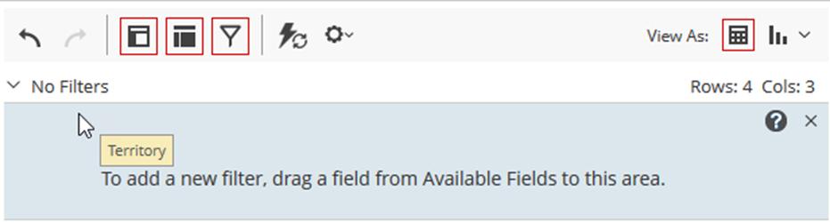<figcaption>
Filter Panel
</figcaption></figure>

3. To display only EMEA, in the Filter on Territory dialog box:

   &#x20; • Select: Select from a list.

   &#x20; • From the list of values, click EMEA.

   &#x20; • Click the right arrow to move EMEA to the Currently Included list.

   &#x20; • Click OK.

<figure>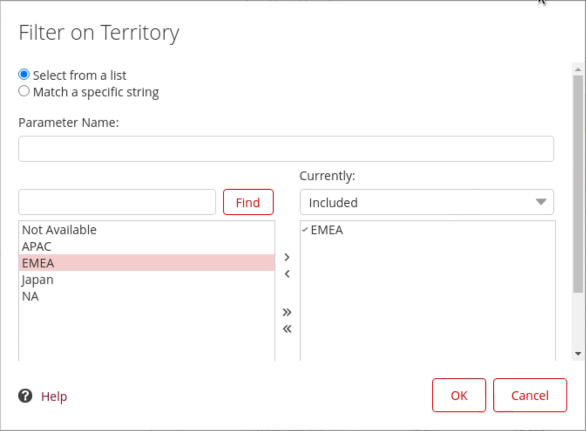<figcaption>
Filter - EMEA
</figcaption></figure>

> **Note:** The Parameter Name field enables you to define the filter as a prompt.&#x20;

4. In the Available Fields panel, right-click Years, and then select Filter.

<figure>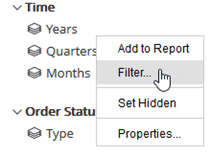<figcaption>
Filter - Years
</figcaption></figure>

5. To display only 2003, in the Filter on Years dialog box:

   &#x20; • Select: Select from a list.

   &#x20; • From the list of values, click 2003.

   &#x20; • Click the right arrow to move 2003 to the Currently Included list.

   &#x20; • Click OK.

<figure>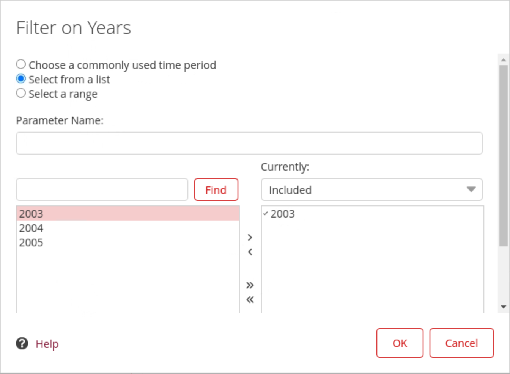<figcaption>
Filter - 2003
</figcaption></figure>

6. In the analysis canvas, right-click Quarters, and then select Filter.

<figure>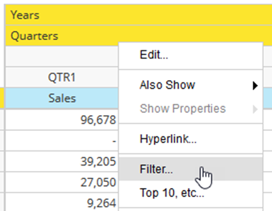<figcaption>
Filter - Quarters
</figcaption></figure>

7. To display only the second quarter, in the Filter on Quarters dialog box, select: Select from a list.

<figure>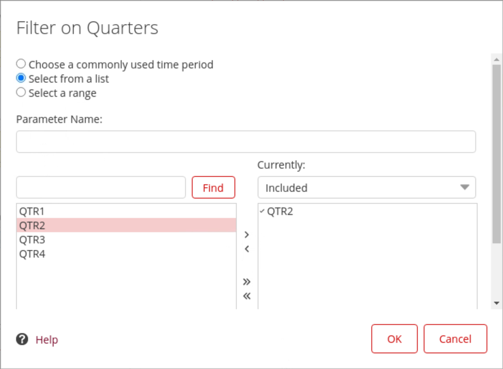<figcaption>
Filter - QTR 2
</figcaption></figure>

8. From the list of values, click QTR2, then click the right arrow to move QTR2 to the Currently Included list, and then click OK.

<figure>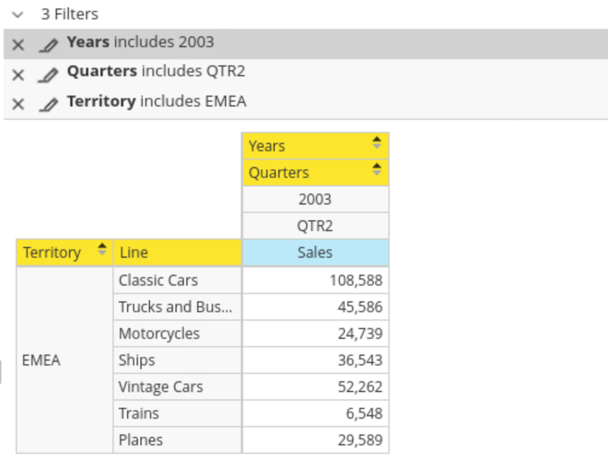<figcaption>
Filters
</figcaption></figure>

9. On the analysis canvas, click Sales and drag it *up* to the Filter panel.
10. To display the Top 5 Product Lines with Sales Greater Than 10,000 in the Filter on Sales dialog box:

    &#x20; • In the text box for Sales Greater Than, type: 10000.

    &#x20; • Click the Top 10, etc. check box..

    &#x20; • In the numeric value box, type 5.

    &#x20; • Click OK.

<figure>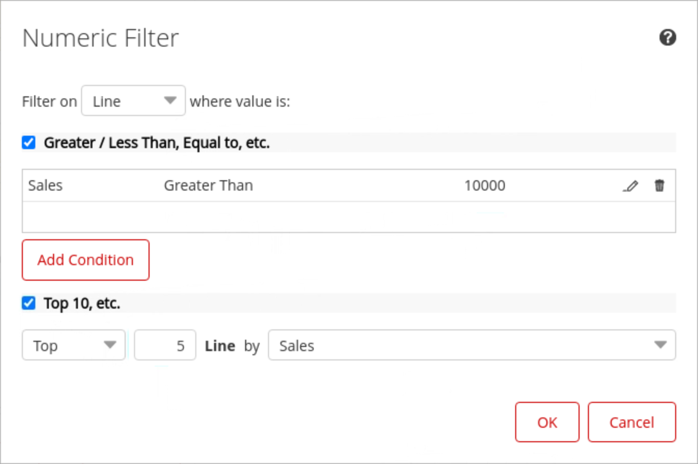<figcaption>
Numeric Filter - Top 5 Lines by Sales
</figcaption></figure>

<figure>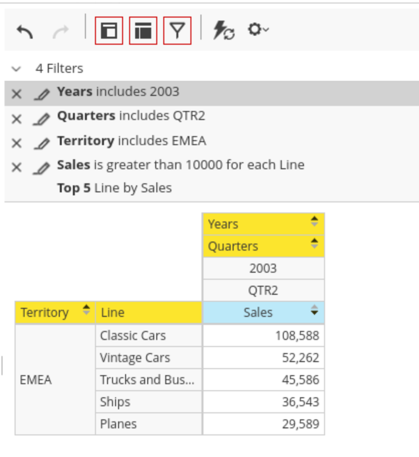<figcaption>
EMEA: Top 5 Product Lines by Sales 2003 QTR2
</figcaption></figure>

11. On the analysis canvas, right-click the QTR2 header for 2003, and then select Show All Quarters.
12. Remove the Sales is greater than 10000 filter.

<figure>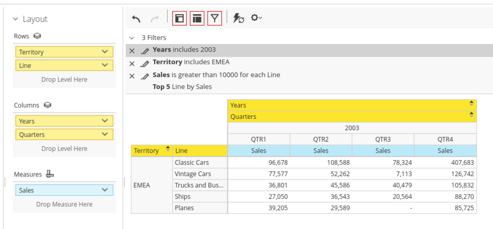<figcaption>
EMEA: Top 5 Product Line by Sales for 2003
</figcaption></figure>

> **Under the hood:**
>
> #### Top 5 is an MDX TopCount, evaluated after the slice
>
> A filter on a measure doesn't become a WHERE clause; it becomes MDX
> set functions — in effect `TopCount(Filter([Product].[Line].Members,
> [Measures].[Sales] > 10000), 5, [Measures].[Sales])`. Mondrian
> evaluates that in the current context — EMEA, 2003, QTR2 — so "top
> five lines" meant top five within that slice, ranked on cells that
> were already aggregated. Show All Quarters changed the context, and
> the same expression re-ranked against the whole year, which is why
> the members moved.
>
> **Why it matters:** rank-and-threshold questions are one dialog here
> and a subquery with a window function in SQL — and they re-evaluate
> correctly every time the surrounding filters change.

***

> **Note:** **Applying Conditional Formatting**
> 
> Conditional formatting means that cells within the analysis will be physically affected by the data they contain. The most common form of conditional formatting is stoplight reporting, where cell backgrounds are coloured red, green, or yellow depending on user-defined thresholds.
> 
> Analyzer provides the following methods for conditionally formatting numeric data:
> 
> &#x20; • Color Scale
> 
> &#x20; • Data Bar
> 
> &#x20; • Trend Arrow

1. Right-click one of the Sales headers, and then select Conditional Formatting > Color Scale: Green-Yellow-Red.

<figure>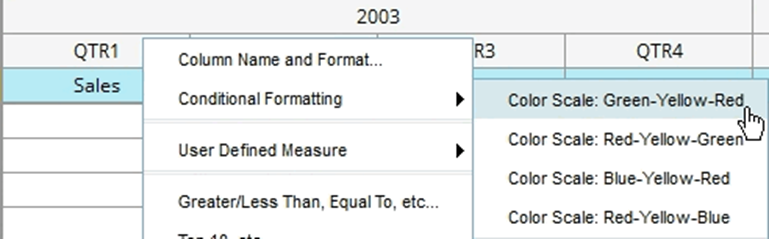<figcaption>
Apply Conditional Formatting
</figcaption></figure>

<figure>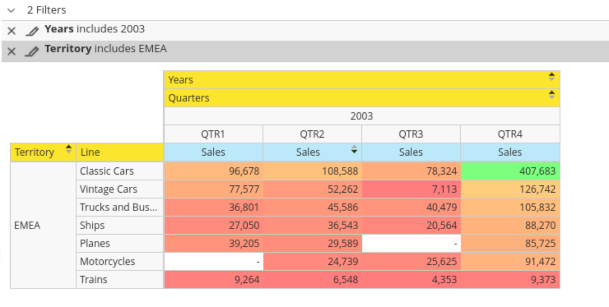<figcaption>
Conditional Formatting
</figcaption></figure>

2. Remove the conditional formatting, right-click one of the Sales headers, and then deselect Conditional Formatting >  Green-Yellow-Red.

### Calculations & Drill-Through

> **Note:** Grand totals and subtotals summarize detail row or column values. You can choose to summarize the data in the following ways:
> 
> &#x20; • Aggregate
> 
> &#x20; • Sum
> 
> &#x20; • Average
> 
> &#x20; • Max
> 
> &#x20; • Min

1. Remove all Filters.
2. In the analysis details, right-click one of the Sales headers, then select Subtotals (Sums, Averages, etc.).

<figure>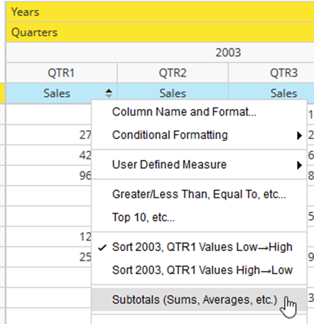<figcaption>
Subtotals
</figcaption></figure>

2. Select Average, and then click OK.

<figure>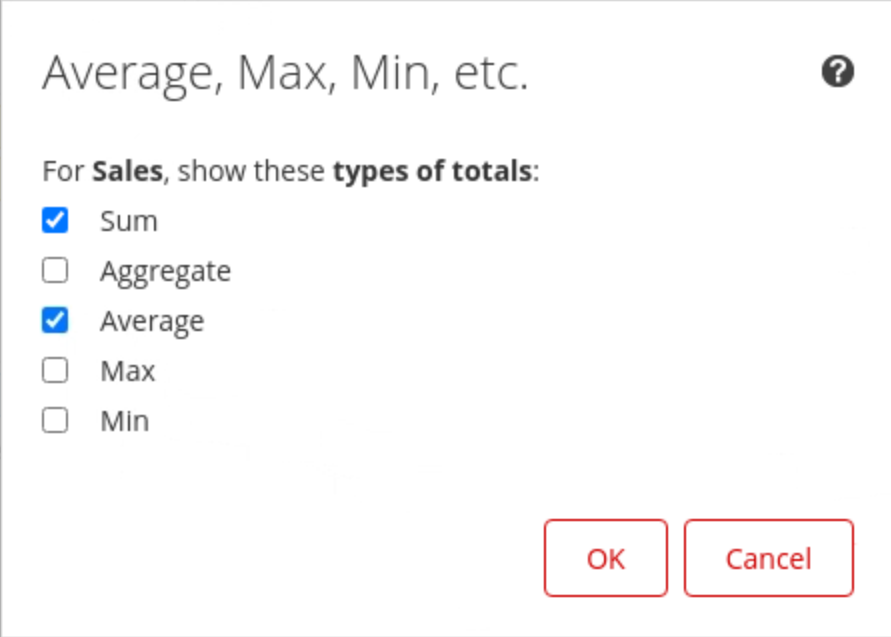<figcaption>
Calculations
</figcaption></figure>

3. In the analysis details, right-click the Territory header, and then select Show Subtotals.

<figure>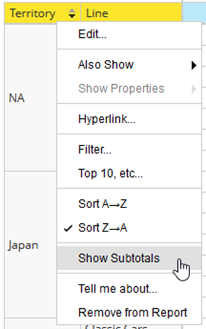<figcaption>
Show Subtotals
</figcaption></figure>

> **Note:** Subtotals do not appear in the analysis, until the dimension selected.

<figure>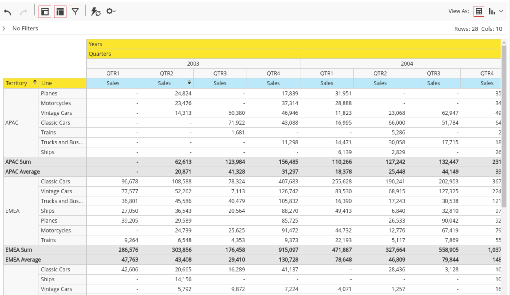<figcaption>
Subtotals &#x26; Averages
</figcaption></figure>

4. To show grand totals for columns and rows, from the Layout panel: Click Report Options.
5. In the Report Options window, select Show Grand Totals for Rows and Show Grand Totals for Columns.

<figure>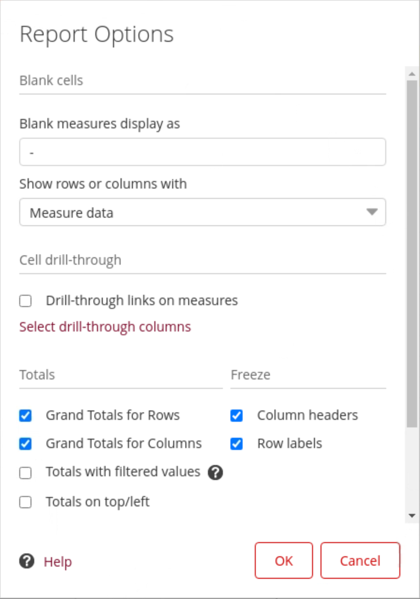<figcaption>
Grand Totals - Rows &#x26; Columns
</figcaption></figure>

4. Click OK.

<figure>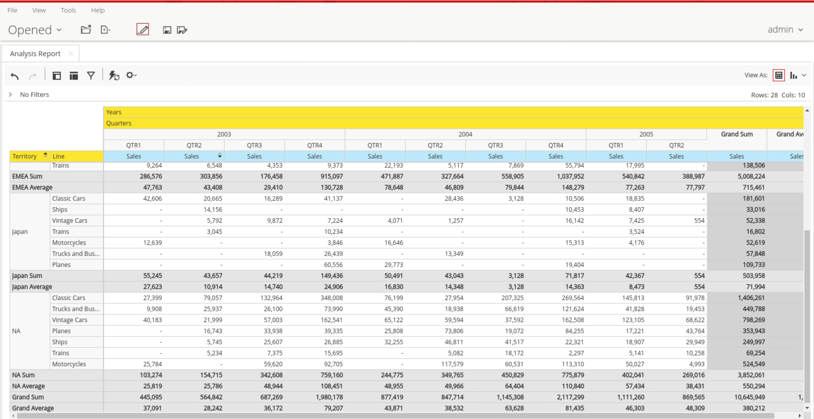<figcaption>
Grand Totals for Rows &#x26; Columns
</figcaption></figure>

> **Under the hood:**
>
> #### Aggregate and Sum are two different totals
>
> A subtotal has two possible sources. **Aggregate** asks Mondrian for
> the parent's own cell — `[Markets].[EMEA]` — computed from the fact
> rows with the measure's aggregator, which makes it right even for
> measures that don't add up, such as distinct counts. **Sum**,
> **Average**, **Max** and **Min** are Analyzer's own arithmetic over
> the cells you can see. Two consequences: Average is over displayed
> cells, so blank versus zero (Report Options) changes it; and by
> default Analyzer uses *visual* totals, so an Aggregate is recomputed
> over the members left after your filters — tick **Totals with
> filtered values** in Report Options and it becomes the cube's full
> parent value, filtered members included.
>
> **Why it matters:** choose Aggregate when the number must match the
> cube, the arithmetic options when it must match the page — and know
> which you chose before someone tries to reconcile the two.

***

#### User Defined Measure

> **Note:** Analyzer allows you to create three types of measures directly within an analysis:
> 
> &#x20; • Percent of, rank, running sum, or percent of running sum
> 
> &#x20; • Calculated Measures
> 
> &#x20; • Trend Measures
> 
> So we're going to display the percent of sales for each product line, and add a simple calculated measure to show the sales plus 6% tax.

1. Remove all Totals, Subtotals & Averages for rows & columns.
2. Apply 2 filters:

&#x20;      • Territory: EMEA&#x20;

&#x20;      • Year 2003

3. Right-click one of the Sales headers, then select User Defined Measure > % of, Rank, Running Sum….

<figure>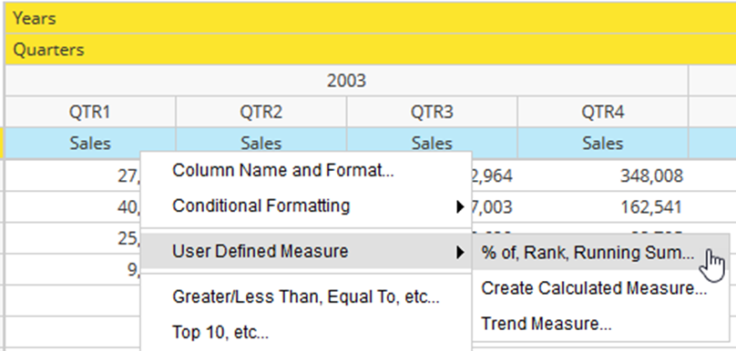<figcaption>
User Defined Measure
</figcaption></figure>

4. Select: % of Sales.

<figure>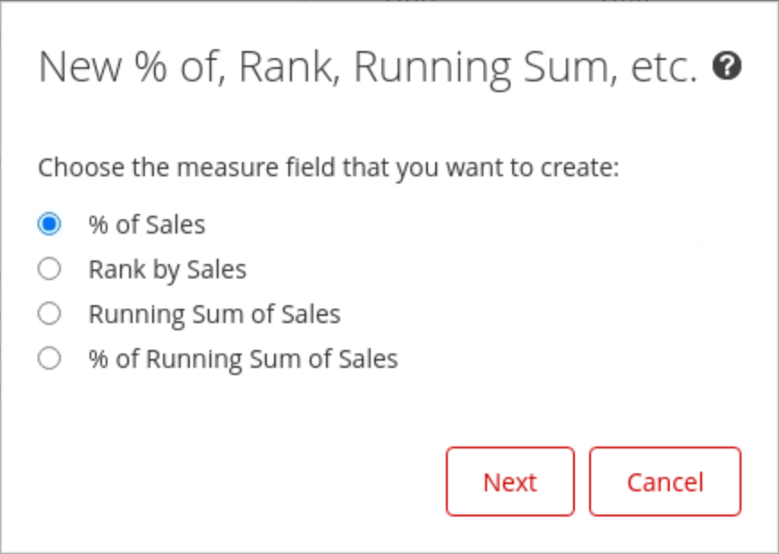<figcaption>
% of Sales
</figcaption></figure>

5. Click Next.
6. Click the drop-down arrow for Decimal Places, select 0.

<figure>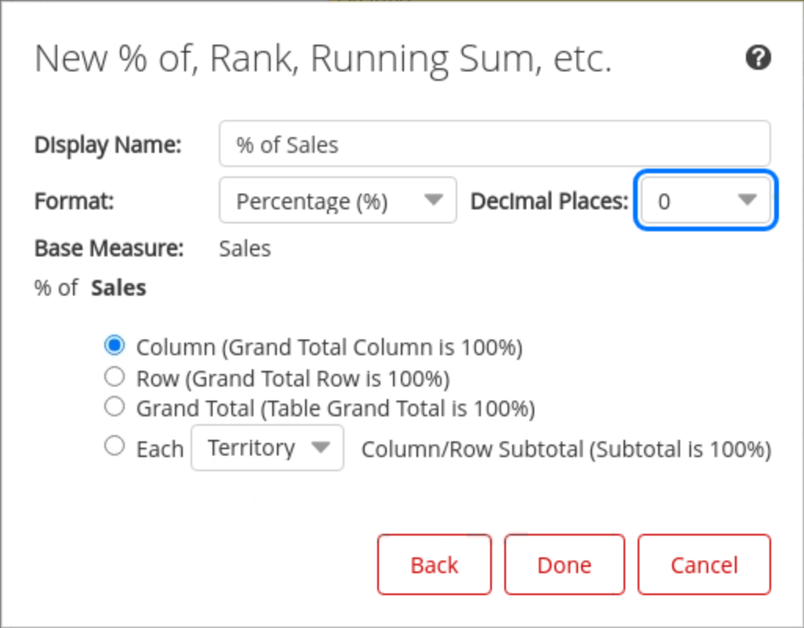<figcaption>
% of Sales
</figcaption></figure>

7. Click: Done.

<figure>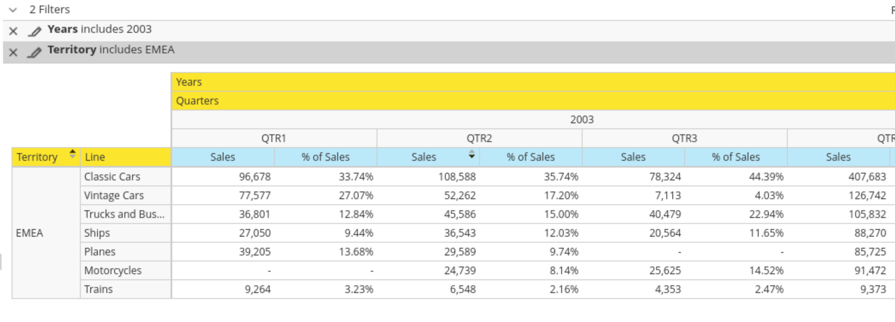<figcaption>
% of Sales
</figcaption></figure>

***

#### Calculated Measure

1. In the analysis details right-click one of the Sales headers, then select User Defined Measure > Create Calculated Measure.

<figure>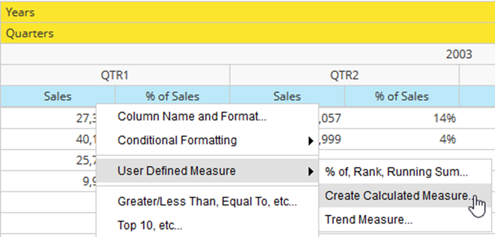<figcaption>
Calculated Measure
</figcaption></figure>

> **Note:** The left panel lists the measure fields available to use in the calculation. The Selection pane is where you write the MDX expression to calculate the new measure.

<figure>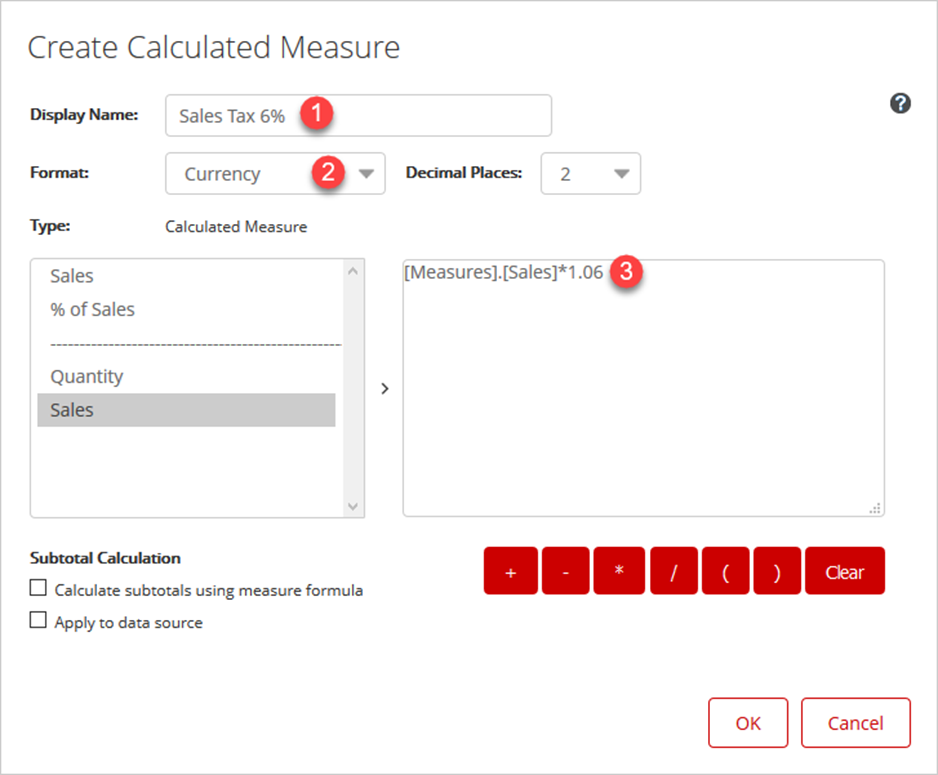<figcaption>
Calculated Measure - 6% Tax
</figcaption></figure>

2. In the Name text box, type Sales + 6% Tax.
3. To specify the numeric format:
4. Click the drop-down arrow for Format.

&#x20;      • Select Currency.

&#x20;      • Click the drop-down arrow for Decimal Places.

&#x20;      • Select 0.

5. To multiply Sales by 1.06, in the formula pane:

&#x20;      • Click to the right of sales.

&#x20;      • Type: \* 1.06.

&#x20;      • Click OK.

<figure>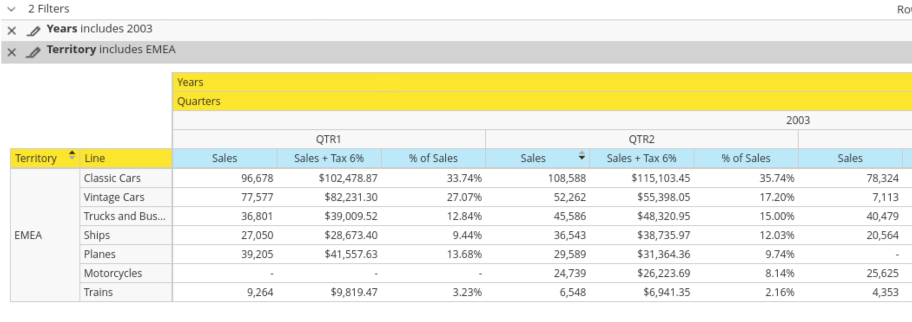<figcaption>
Sales + 6% Tax
</figcaption></figure>

> **Under the hood:**
>
> #### A calculated measure is an MDX calculated member
>
> Sales + 6% Tax went into the query as `WITH MEMBER [Measures].[Sales
> + 6% Tax] AS [Measures].[Sales] * 1.06`. Mondrian evaluates it per
> cell *after* aggregating Sales, so it is correct at every level —
> territory, line, quarter — and through every drill, with no extra
> SQL. % of Sales and Rank are generated the same way, as MDX over the
> axis set. The member lives in this report's definition; the same
> member declared in the Mondrian schema would be available to every
> report on the cube, with its own format.
>
> **Why it matters:** a derived measure costs one expression and stays
> right as the layout changes — the exact failure mode of a spreadsheet
> formula that breaks when a row moves.

***

#### Drill-Through

> **Note:** To create reports based on specific measure data, you can implement drill through links in Analyzer. This will turn all non-calculated measures into links which, when clicked, open a data table that enables you to quickly view more details for that data point.

1. Remove the following columns:

&#x20;       • Sales + Tax 6%

&#x20;       • % of Sales

2. Enable drill through links for Sales, from the Layout panel:

&#x20;       • Click Report Options.

&#x20;       • Select Show drill-through links on Measure cells.

&#x20;       • Click OK.

<figure>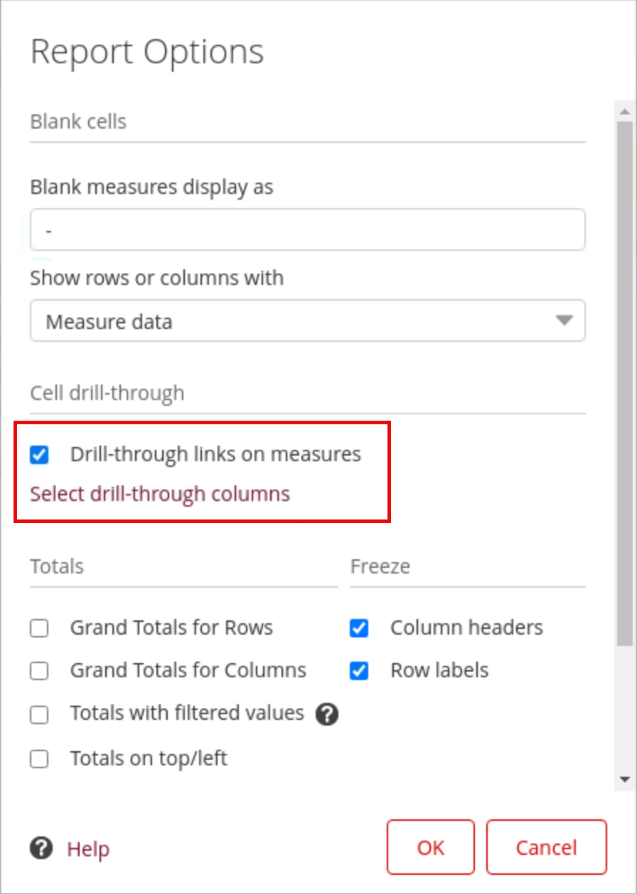<figcaption>
Drill-through on measures
</figcaption></figure>

3. Drill through to the supporting data, in the analysis details, click the value for EMEA, Classic Cars, 2003, QTR1 ($96,678).

<figure>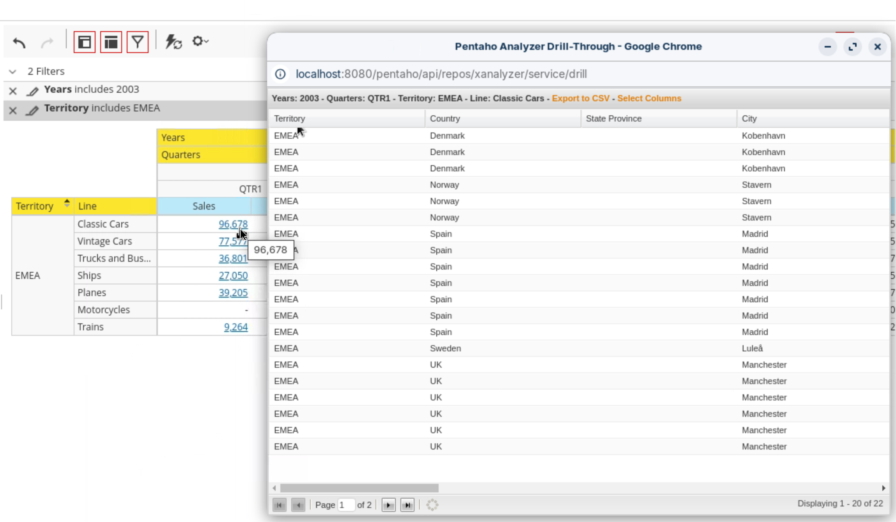<figcaption>
Drill-through - Classic Cars
</figcaption></figure>

> **Under the hood:**
>
> #### Drill-through is a SQL query Mondrian built from the cell's coordinates
>
> Clicking $96,678 asked Mondrian for the rows behind one cell. It took
> the cell's members — EMEA, Classic Cars, 2003, QTR1 — and generated a
> `SELECT` on the fact table joined to its dimension tables with a
> `WHERE` for each member, returning order-line rows rather than
> aggregates. That is why only non-calculated measures get links: a
> calculated member has no fact rows of its own to point at.
>
> **Why it matters:** the summary and its evidence are one click apart,
> and the evidence is live — there is no separate detail report to
> build or keep in sync.

### Formatting

> **Note:** You can resize columns, change the column or row header, and change data format.
> 
> To resize columns, click between the column headers and drag the resize icon to the left or right. You can reset all column sizes by clicking More > Reset Column Sizes from the Interactive Toolbar.
> 
> To change the column or row header for text and time period fields, right-click the column or row header and then select Edit
> 
> To format numeric data, right-click the column header and select Column Name and Format.

1. Right-click the column header for Line, then select Edit.

<figure>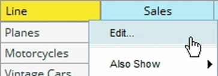<figcaption></figcaption></figure>

2. In the Name text box, type Product Line, and then click OK.

<figure>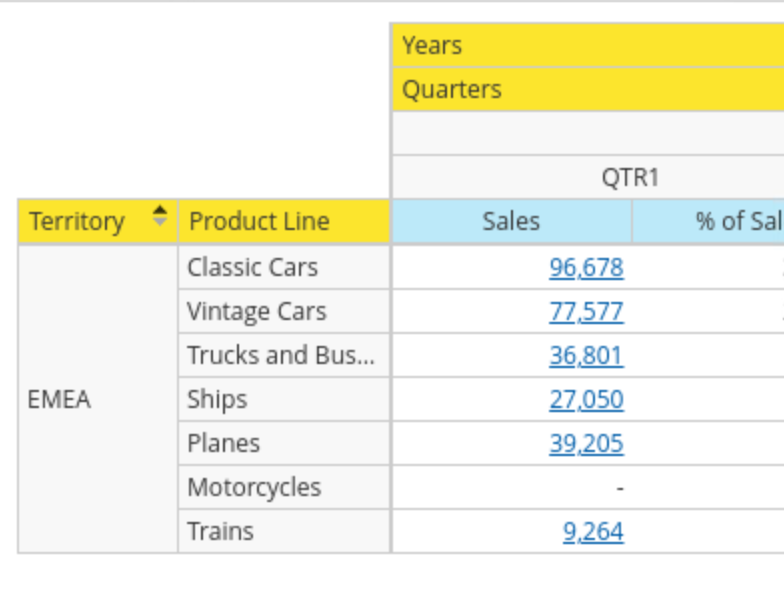<figcaption>
Edit header cells
</figcaption></figure>

3. To modify the Sales data as currency, in the analysis details, right-click one of the Sales headers, then select Column Name and Format.

<figure>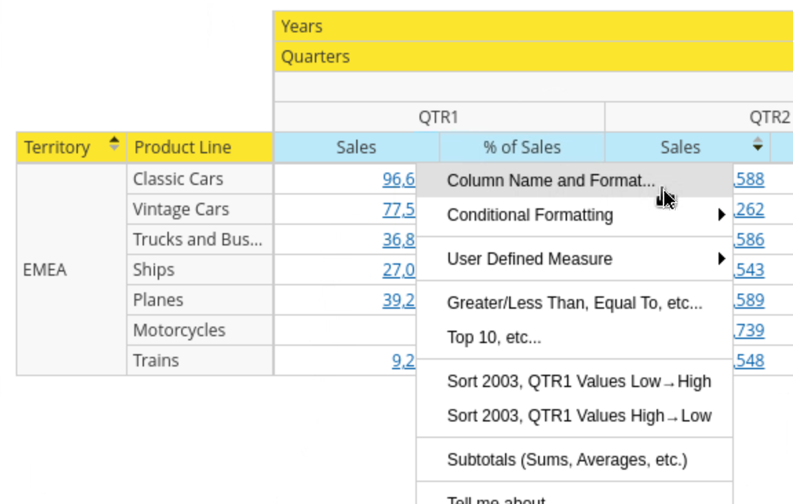<figcaption>
Format Column
</figcaption></figure>

4. Change the name: Revenue

<figure>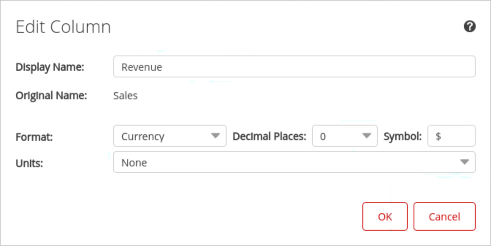<figcaption></figcaption></figure>

5. From the Format drop-down list, select Currency ($), and then click OK.

<figure><figcaption>
Formatting
</figcaption></figure>

***

#### Chart Options

> **Note:** At any point in time, an analysis can have only one format; however, it is easy to switch between formats.

1. To switch the analysis format, click the View As Table or View As Chart button in the analysis title bar.

<figure>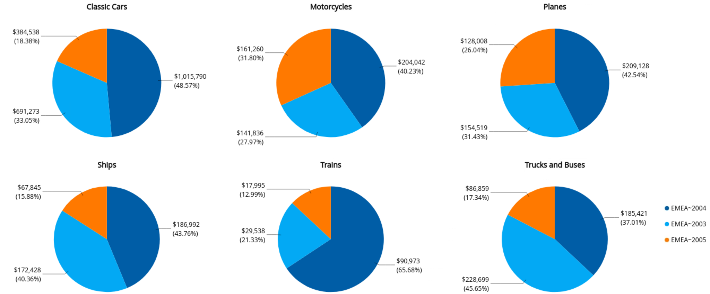<figcaption>
Pie Charts for each Product Line
</figcaption></figure>

:::

### Actions & Options

> **Note:**
>
> #### Actions & Options&#x20;

<figure><figcaption>
Actions &#x26; Options
</figcaption></figure>

::: tabs

### Export

> **Note:**
>
> #### Export Options
> 
> Analyzer provides several options for exporting your analysis. You can export the analysis as a PDF file which launches the analysis in a new window. From there you can save or print the PDF file. You can export the analysis to Excel, which opens the analysis in a new Excel window.
> 
> You can download the analysis data in CSV format. When you download data in the CSV format you get numbers with the full precision available. This way you avoid any rounding errors when you continue to work with your data in Excel. The export options are available from the Interactive Toolbar by clicking the More actions and options button.

<figure>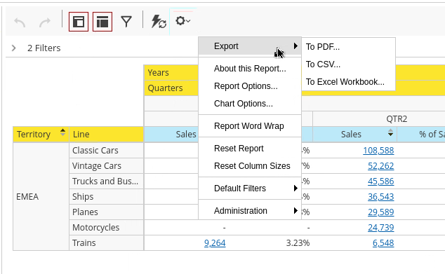<figcaption>
Export options
</figcaption></figure>

### Report Options

> **Note:**
>
> #### Report Options
> 
> In your report, you can modify how blank measures display, define drill-through columns, and show or hide totals for columns and rows.

1. Click on the 'cog-wheel'.
2. Select: Report Options.

<figure>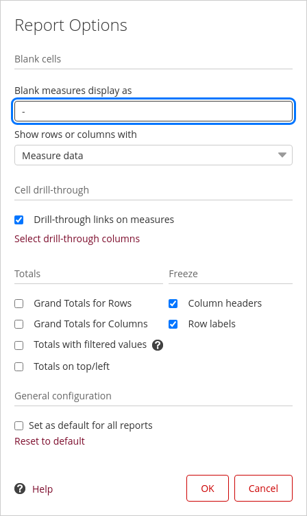<figcaption>
Report Options
</figcaption></figure>

> **Note:** You can control what to show when a cell contains a blank value in your Analyzer report. Analyzer reports are designed to break down number fields, such as 'Sales', by text fields such as 'Product Name'.&#x20;
> 
> If a product did not sell, it will appear either as zero dollars or as a blank or a dash ("-"). In some reporting situations, the absence of a value could mean the same as a zero, but in other cases, zero might have a different meaning.&#x20;
> 
> The report calculations in the background behave differently depending on whether a value is 'blank' or a 'zero'. For example, when the report calculates averages, zeroes are considered whereas blanks are not.

### Chart Options

> **Note:**
>
> #### Chart Options
> 
> As an administrator, you can add default chart options that are applied whenever a new chart is created. Adding default chart options does not apply the changes to existing charts.&#x20;
> 
> You can modify the options on charts without affecting the default option settings.&#x20;
> 
> You can also set an existing chart back to the default settings by clicking the Reset to default link on the Other tab of the Chart Options dialog box.

1. Click on the 'cog-wheel'.
2. Select: Chart Options.

<figure>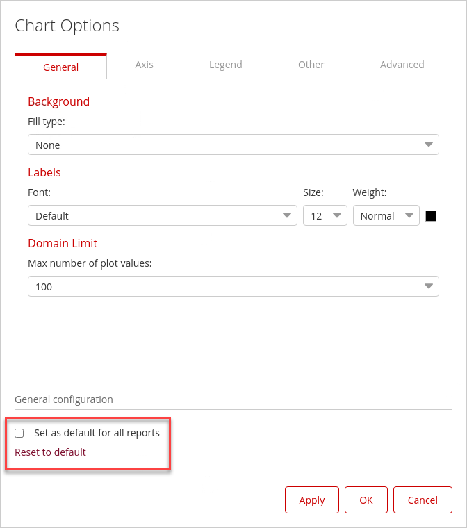<figcaption>
Chart Options
</figcaption></figure>

### Administration

> **Note:**
>
> #### Adminstration
> 
> If been assigned the Administrator role, then you'll have access to some options that will help troubleshoot and optimize your PAZ reports.

1. Click on the 'cog-wheel'.
2. Select: Chart Options.

<figure>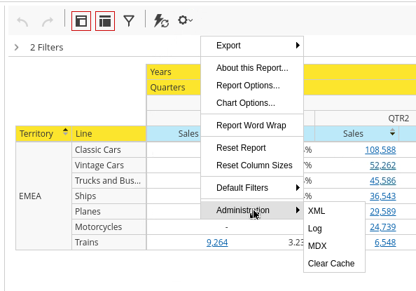<figcaption>
Administration options
</figcaption></figure>

***

> **Note:**
>
> #### XML
> 
> Administrators can configure the default value of non-standard properties of the current visualization, at the report-level. This is useful for properties that are hidden from the user interface using a global configuration.
> 
> To perform this configuration, set the corresponding JSON text in the field Visualization state JSON, in the Report Definition dialog (Administration » XML).
> 
> For example, the following JSON configuration would change the colors used by many of the standard visualizations, by changing the value of the palette property:
> 
> \[ { "palette": {"colors": \["red", "green", "blue"]} } ]

<figure>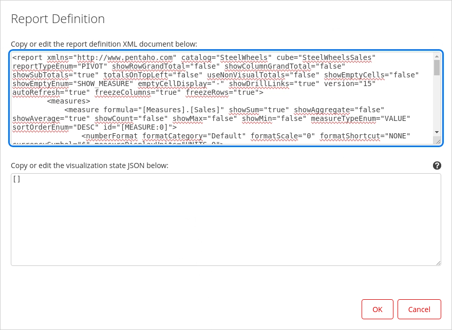<figcaption></figcaption></figure>

***

> **Note:**
>
> #### Log
> 
> Log option is useful for troubleshooting and optimizing your Analyzer reports. The first half of the log displays the xml of the report definition.
> 
> The second half display the MDX query and the times taken to execute the query.

<figure>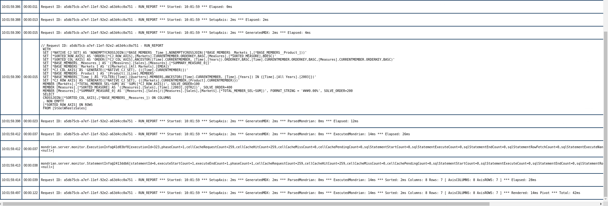<figcaption>
Log
</figcaption></figure>

***

> **Note:**
>
> #### MDX
> 
> From here you're able to open the log file, Clear the Cache, Check the Time dimension and Execute MDX queries.

<figure>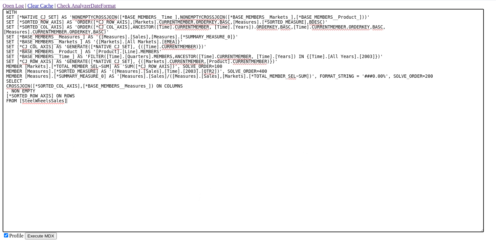<figcaption>
MDX
</figcaption></figure>

<figure>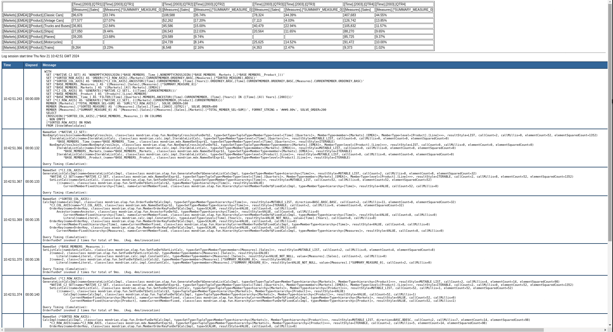<figcaption>
MDX - output
</figcaption></figure>

> **Under the hood:**
>
> #### The log is the whole pipeline in one place
>
> Administration shows the layers that produced the page: the report
> definition (the `.xanalyzer` XML, each field a schema formula), the
> MDX Analyzer generated from it, and the time Mondrian took to answer.
> Execute MDX runs your own statement against the same cube. Clear
> Cache flushes both Analyzer's and Mondrian's caches — the segment
> cache of cell values and the member cache — so fact rows loaded since
> the last query appear without a restart.
>
> **Why it matters:** when a report is slow or stale, this tab is where
> the answer is. Read the MDX for an accidental crossjoin, and clear the
> cache before blaming the ETL.

:::

::::

