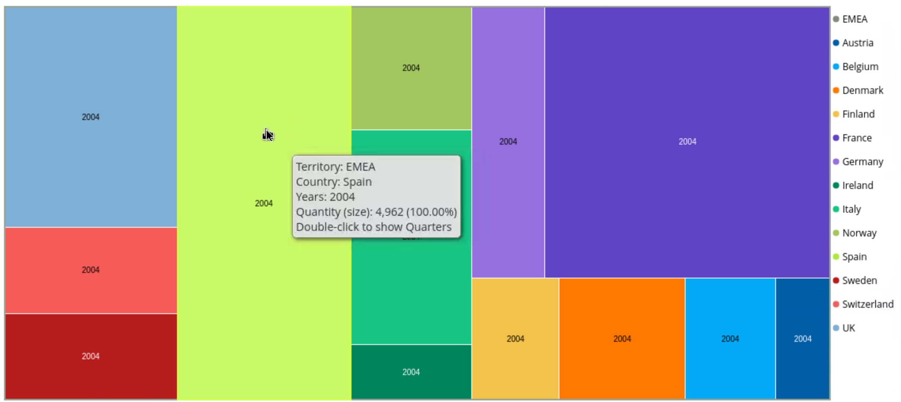

# EMEA Quantity

> **Warning:**
>
> #### Workshop - Quantity Sold
> 
> Steel Wheels management needs visibility into product quantity performance across the EMEA region for 2004. This workshop applies your Analyzer skills independently, with less step-by-step guidance, to build a complete report that reveals which countries drive volume in that territory.
> 
> In this workshop, you build an Analyzer report from scratch, making your own structure and formatting decisions while meeting specific business requirements.
> 
> **What you'll do**
> 
> * Select the SteelWheels:SteelWheelsSales data source to begin your analysis
> * Build the analysis structure by adding Quantity as a measure, Territory and Country as rows, and Years as columns
> * Apply filters to restrict the analysis to EMEA territory and the year 2004
> * Implement data bar conditional formatting (green) on the Quantity measure for visual impact
> * Add grand totals for columns to show overall quantity performance
> * Create a user-defined ranking measure to identify top-performing countries by quantity sold
> * Switch from table to chart format and experiment with multiple visualization types (tree map, bar chart, etc.)
> * Refine the analysis with appropriate formatting and presentation elements
> * Save the completed analysis to the Public/Training folder with a descriptive name (EMEA: Quantity Sold by Territory Yr2004)
> 
> **Prerequisites:** Completion of Sales Analysis workshop, Pentaho Business Analytics Server with Steel Wheels sample data
> 
> **Estimated time:** 25-30 minutes

<figure><figcaption>
EMEA: Quantity Sold by TerritoryYr004 -Tree Map
</figcaption></figure>

***

**Step 1.** **Data Source**

1. From the User Console Home Perspective, click Create New > Analysis Report.

> **Note:** If you have any other reports open, this same functionality can be accessed under the File menu on the menu bar.

2. In the Select Data Source window, click SteelWheels:SteelWheelsSales, and then click OK.
3. Switch to 'Schema View'.

**Step 2.** **Add Data Columns and Rows to the Analysis**

To add Quantity, Territory, Country, and Years to the analysis:

1. Select Quantity and drag it to the Measures drop zone on the Layout panel.
2. Select Territory and drag it to the Rows drop zone on the Layout panel.
3. Select Country and drag it to the Rows drop zone on the Layout panel. Drop Country *below* Territory.
4. Select Years and drag it to the Columns drop zone on the Layout panel.

**Step 3.** **Filter the Analysis Data**

To filter the analysis to only include EMEA and 2004:

1. To turn on the Filters panel, on the Toolbar, click the Filters button.
2. To filter on Territory, from the Available Fields, select Territory and drag it to the Filters panel.
3. To display only EMEA, in the Filter on Territory dialog box:

&#x20;       • Select Select from a list.

&#x20;       • From the list of values, click EMEA.

&#x20;       • Click the right arrow to move EMEA to the Currently Included list.

&#x20;       • Click OK.

4. To filter on Years, from the Available Fields, select Years and drag it to the Filters panel.

&#x20;5\.  To display only 2004, in the Filter on Years dialog box:

&#x20;      • Select Select from a list.

&#x20;      • From the list of values, click 2004.

&#x20;      • Click the right arrow to move 2004 to the Currently Included list.

&#x20;      • Click OK.

**Step 4.** **Apply Conditional Formatting**

To display a data bar background:

1. To apply data bar conditional formatting, in the analysis details, right-click the Quantity header, and then select Conditional Formatting > Data Bar: Green.

**Step 5.** **Add Totals**

To display totals for columns and rows:

1. To show grand totals for columns, from the Layout panel:

&#x20;       • Click Report Options.

&#x20;       • In the Report Options window, select Show Grand Totals for Columns.

&#x20;       • Click OK.

#### Rank

To create a column showing the rank for each country based on Quantity:

1. Right-click the Quantity header, then select User Defined Measure > % of, Rank, Running Sum.
2. In the New % of, Rank, Running Sum, etc. window:

&#x20;      • Select Rank by Quantity.

&#x20;      • Click Next.

&#x20;      • Click Done.

> **Under the hood:**
>
> #### Rank is an MDX Rank over the visible set
>
> Rank by Quantity added a calculated member built on MDX's `Rank`
> function: for each country, its position in the set of countries
> ordered by Quantity. Mondrian evaluates it in the report's filter
> context, so the ranks are within EMEA for 2004, and they recompute
> the moment either filter changes or a country is excluded.
>
> **Why it matters:** a ranking that follows the filters for free is
> the difference between an analysis tool and a spreadsheet export.

**Step 7.** **Switch to Chart Format**

To switch to chart format:

1. On the analysis title bar, click the View As Chart button.
2. Select a suitable Chart type - try out various types ..

#### Refine the Report

Refine the report by adding:&#x20;

**Step 9.** **Save the Report**

1. On the toolbar click the 'Save as' icon.
2. Add the following report details:

&#x20;      • In the Filename field, type: EMEA: Quantity Sold by Territory Yr2004.

&#x20;      • For the location, click the Up One Level icon twice.

&#x20;      • In the list of folders, double-click Public.

&#x20;      • In the list of folders, double-click Training.

&#x20;      • Click Save.

***
