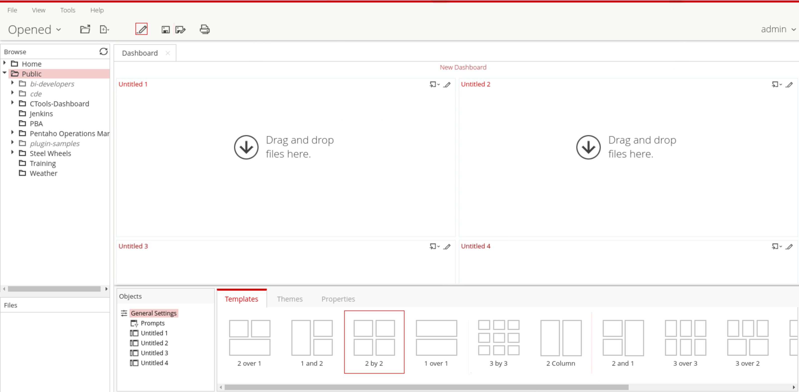

# Overview of Dashboard Designer

> **Note:** Creating a dashboard in Dashboard Designer is as simple as selecting a layout template, theme, and the content you want to display. In addition to displaying content generated from action sequences, Interactive Reporting, and Analyzer, Dashboard Designer can also include:
> 
> &#x20; • **Charts**: simple bar, line, area, pie, and dial charts created with Chart Designer.
> 
> &#x20; • **Data Tables**: tabular data.
> 
> &#x20; • **URLs**: Web sites that you want to display in a dashboard panel.

**🎥 Embed:** [Dashboard Designer](<https://www.loom.com/share/b7a6f8dbfa734c839cb1452d0905f2c7?hideEmbedTopBar=true&hide_owner=true&hide_share=true&hide_title=true>)

> **Note:** Dashboard Designer also has dynamic filter controls, which enables end-users to change a dashboard's details by selecting different values from a drop-down list, and to control the content in one dashboard panel by changing the options in another (content linking).

<figure><figcaption>
Dashboard Designer
</figcaption></figure>
