# Vendor Sales

> **Warning:**
>
> #### Workshop - Vendor Sales
> 
> Dashboards bring multiple reports, analyses, and visualizations together into a single, interactive business view. In this workshop you build a report-based dashboard with Pentaho Dashboard Designer, combining existing reports and adding dashboard prompts that filter them simultaneously.
> 
> In this workshop, you select a layout template and theme, add existing reports created in Interactive Reporting, Analyzer, and Report Designer to dashboard panels, and create cascading prompts that synchronize filtering across those reports.
> 
> **What you'll do**
> 
> * Select and apply dashboard layout templates (2 over 1 configuration) and themes (Ruby theme) to establish the visual foundation
> * Configure dashboard properties including title (Training Demo Dashboard) and panel sizing
> * Add existing reports to dashboard panels by selecting from the repository (European Sales geo map, Vendor Sales interactive report, Inventory List)
> * Resize dashboard panels to create balanced, functional layouts
> * Create interactive dashboard prompts with multiple control types (buttons for Territory selection)
> * Build metadata-driven prompts by querying the Orders data source for Territory values
> * Configure prompt properties including display orientation (horizontal), multiple selection capability, and null value exclusion
> * Associate dashboard prompts with report parameters to create synchronized filtering across reports
> * Create additional prompts for Product Line filtering following established patterns
> * Test dashboard interactivity by selecting different territories and product lines to verify prompt behavior
> 
> **Prerequisites:** Pentaho Business Analytics Server with sample reports (European Sales geo map, Vendor Sales interactive report, Inventory List) available in the Steel Wheels folder
> 
> **Estimated time:** 35-40 minutes

<figure>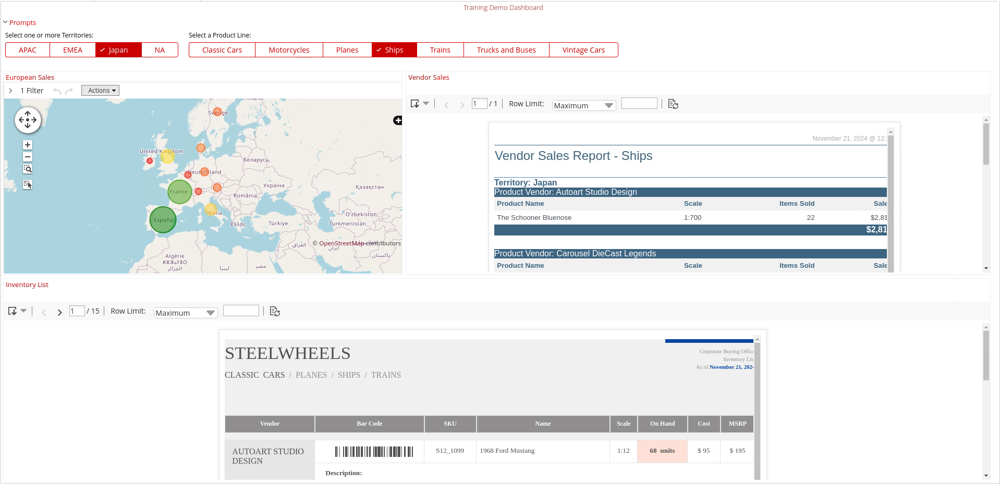<figcaption>
Vendor Sales - prompts
</figcaption></figure>

::: tabs

### Template

> **Note:**
>
> #### Dashboard Templates
> 
> Creating a dashboard in Dashboard Designer is as simple as choosing a layout template, theme, and the content you want to display.

1. From the User Console Home Perspective, click Create New -> Dashboard.

<figure>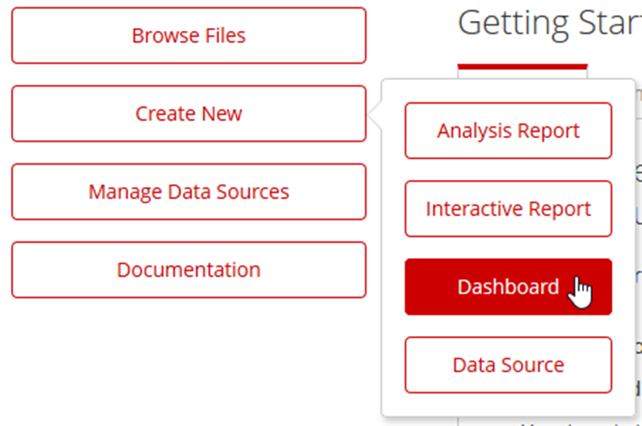<figcaption>
Dashboard Designer
</figcaption></figure>

&#x20;2\. To select the 2 over 1 template, on the Templates tab, click 2 over 1.

<figure>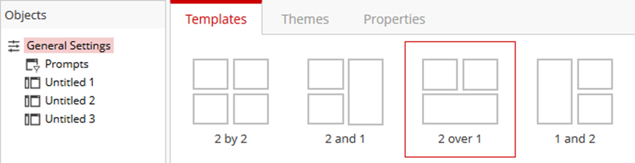<figcaption>
Dashboard Templates
</figcaption></figure>

3. To view the available themes, click the Themes tab.

<figure>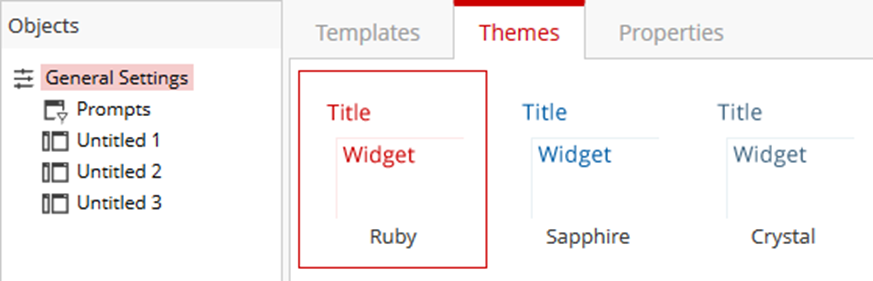<figcaption>
Themes
</figcaption></figure>

4. Keep the default Ruby theme.
5. Enter a title for the dashboard, click the Properties tab.
6. Type: Training Demo Dashboard.

<figure>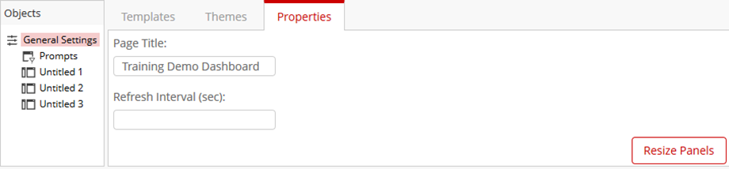<figcaption>
Dashboard Properties
</figcaption></figure>

> **Note:** Notice the button allowing you to resize the panels and the Refresh Interval field.

7. To resize the panels, click the Resize Panels button.
8. Drag the vertical line about an inch to the left to make the Untitled 1 panel smaller, and then in the lower right corner of the canvas.
9. Click Close.

> **Note:** The blue horizontal and vertical lines, allow you to resize the panels.

<figure>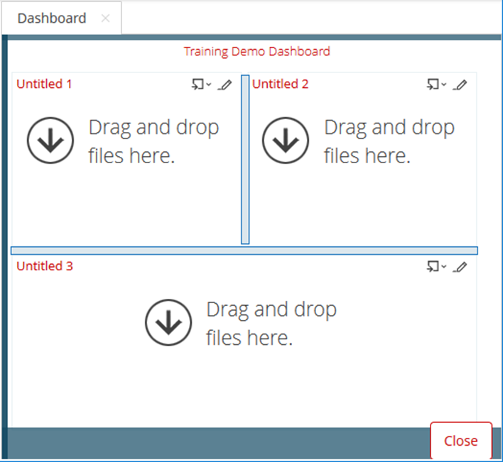<figcaption>
Resize Dashboard
</figcaption></figure>

### Content

> **Note:** You can easily add reports created with Interactive Reporting, Analyzer, and Report Designer to the dashboard by dragging content from the Files pane to a panel on the dashboard.&#x20;
> 
> Alternatively, you can click the Add Content icon on the panel title bar and then select File.

1. Highlight ‘Untitled1’ dashboard pane.
2. Click on the dropdown ‘Content’ icon in the top right, and select File.

<figure>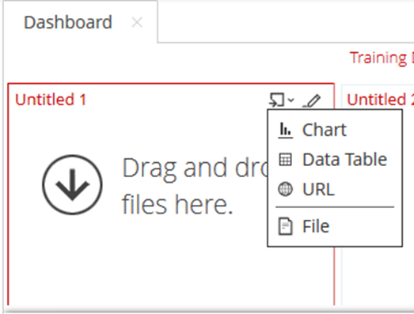<figcaption>
Add content from Repository
</figcaption></figure>

3. From the Files pane, Select: European Sales (geo map).

<figure>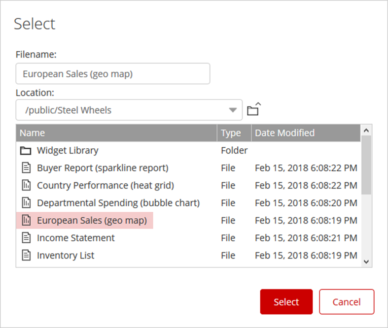<figcaption>
Add European Sales (geomap)
</figcaption></figure>

4. In the Title text box, type European Sales
5. Click Apply.

<figure>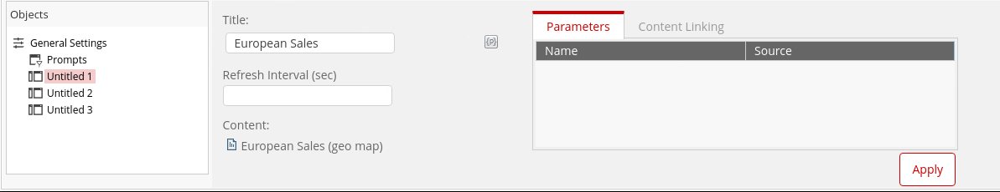<figcaption>
Title
</figcaption></figure>

6. To add a report created with Interactive Reporting to the dashboard, from the Browse pane:
7. Click the main Steel Wheels folder (Public -> Steel Wheels).
8. Select: Vendor Sales Report (interactive report).
9. In the Title text box, type Vendor Sales.
10. Click Apply.

<figure>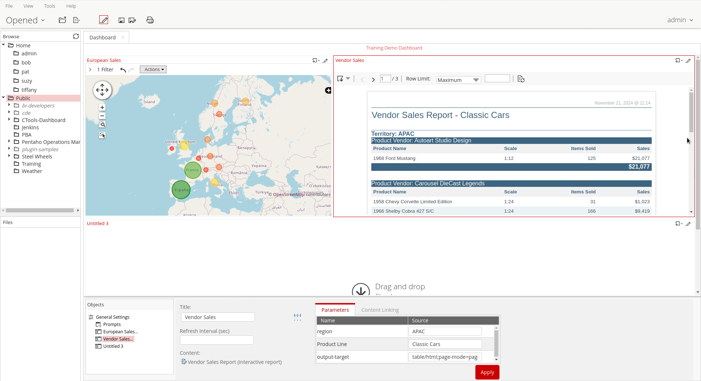<figcaption>
Vendor Sales
</figcaption></figure>

> **Note:** In the bottom pane display the parameters for region and Product Line used in the report.&#x20;
> 
> Later, we will use these parameters as dashboard prompts.

11. Add a report created with Report Designer to the dashboard, from the Files pane, click Inventory List.
12. In the Title text box, type Inventory List
13. Click Apply.

<figure>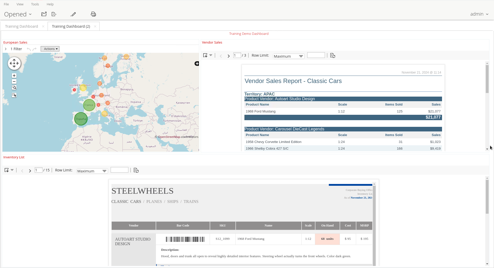<figcaption>
Training Demo Dashboard
</figcaption></figure>

### Prompts

> **Note:** You can create dashboard prompts to apply to the content within the entire dashboard. Dashboard prompts can only be applied to individual reports within the dashboard if the report filter is set up as a parameter.
> 
> So .. we're going to create dashboard prompts for Territory and Product Line, then apply the dashboard prompts to the Vendor Sales Report in the dashboard.

1. To display the Prompt toolbar, from the Objects list in the bottom pane, click Prompts, then click the checkbox for Show Prompt Toolbar.

<figure>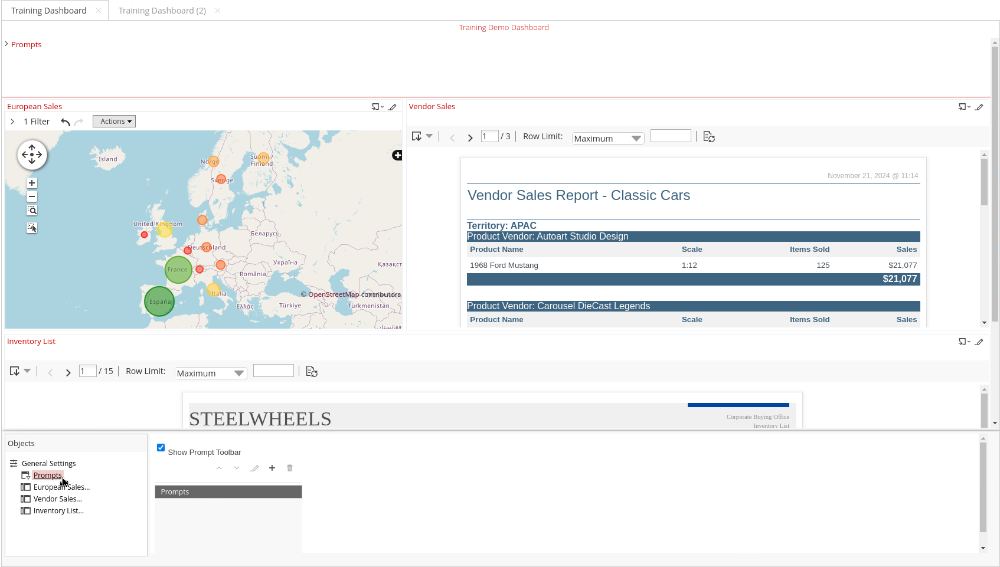<figcaption></figcaption></figure>

> **Note:** The Prompts pane appears at the top of the dashboard. You can resize the pane from the General Settings > Properties tab.

2. Add a prompt, in the bottom pane, click the + icon.

> **Note:** The Name field displays in the Prompt toolbar, therefore it is a good idea to use a prompt such as “Select one or more Territories:” for the Name.
> 
> The Control area shows the various types of prompts available: drop-down, list, radio button, checkbox, buttons, text field, or date picker.
> 
> The Data area identifies the values for the prompt. You can type a static list of values, create a SQL query to pull the values from a file, or use a metadata list from a defined data source.
> 
> The Control Properties area shows different options depending on the type of prompt.

<figure>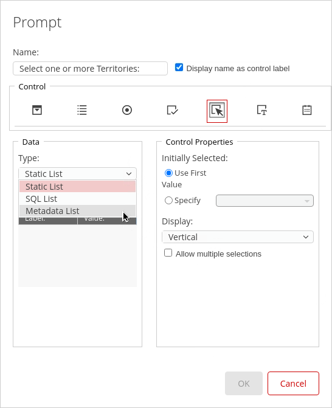<figcaption>
Orders - Metadata List
</figcaption></figure>

3. In the Name text box, type: Select one or more Territories:
4. To create a list of selection buttons, in the Control area, click the Buttons icon.
5. To use a metadata list for the prompt, in the Data area, from the Type drop-down list, select Metadata List, and then click Select.
6. To select the Orders data source, click Orders, and then click OK.

<figure>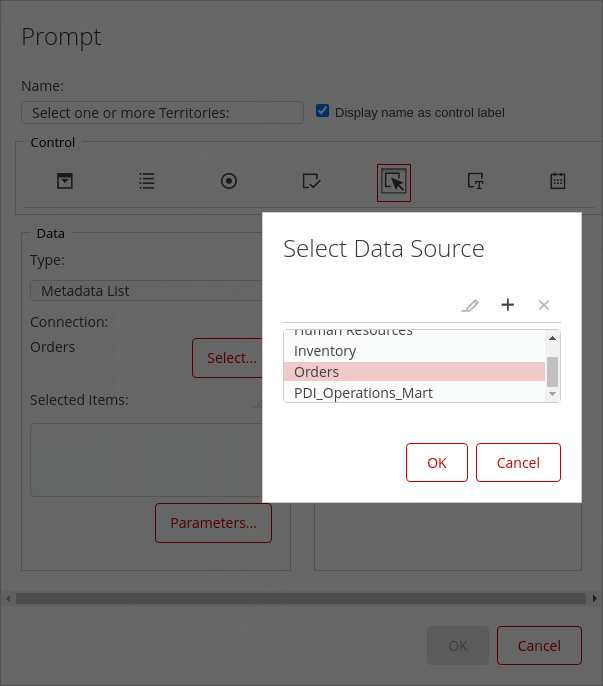<figcaption></figcaption></figure>

> **Note:** The Query Editor window opens.&#x20;
> 
> Create a simple query to pull the list of territories from the Customer table, excluding Null values. In other words, a statement to only return the territories that are not null.

<figure>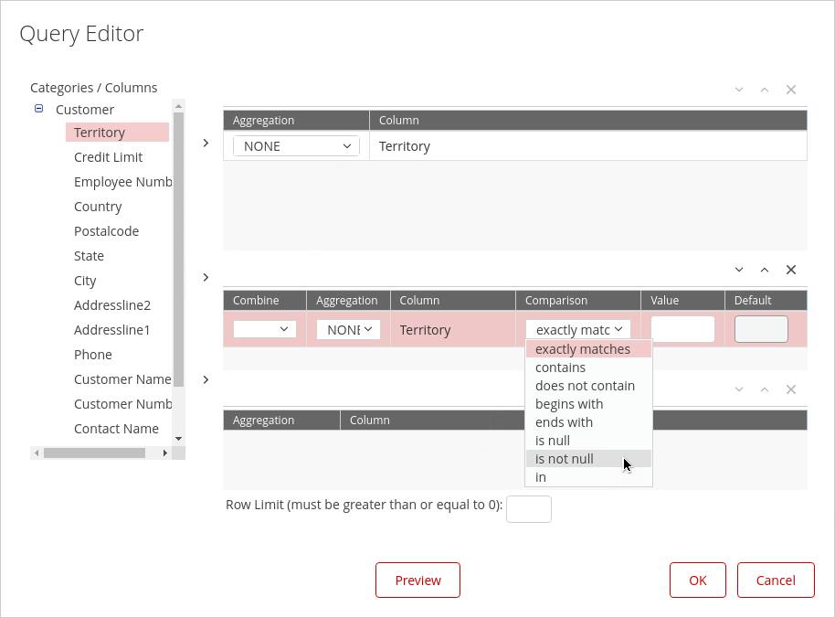<figcaption>
Metadata Query - Territory
</figcaption></figure>

7. Select: Territory, in the Categories/Columns list:

&#x20;      • Click the plus sign for Customer.

&#x20;      • Click Territory.

&#x20;      • Click the > arrow to move Territory to the Selected Columns.

8. Specify a condition to return Territory values that are not null:

&#x20;      • Click the middle arrow to move Territory to the Conditions.

&#x20;      • From the Comparison drop-down list, select is not null.

&#x20;      • Click OK.

9. Click Preview and check that the list is what you expect.

<figure>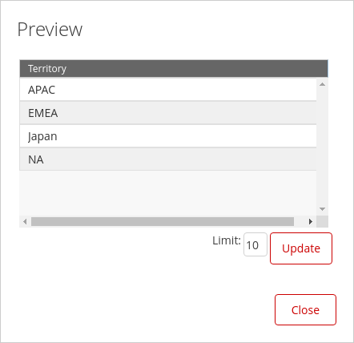<figcaption>
Preview List
</figcaption></figure>

10. Click Close.
11. In the Control Properties area:

&#x20;      • From the Display drop-down list, select Horizontal.

&#x20;      • Click the checkbox for Allow multiple selections.

&#x20;      • Click OK.

<figure>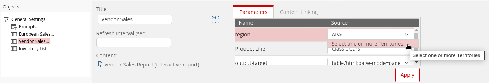<figcaption>
Associate the prompt with Vendor Sales report.
</figcaption></figure>

13. Apply the Territory prompt to the Vendor Sales Report, from the Objects list in the bottom pane:

&#x20;     • Click Vendor Sales Report.

&#x20;     • From the region Source drop-down list, select Select one or more territories:

&#x20;     • Click Apply.

14. Test the prompt, on the list of prompt buttons:

&#x20;     • Deselect APAC.

&#x20;     • Select: EMEA.

15. Repeat the workflow to create a prompt for: Product Line
16. View the results in the Vendor Sales Report.

<figure><figcaption>
Vendor Sales
</figcaption></figure>

:::

> **Success:** You've built an interactive report-based dashboard whose prompts cascade filtering across multiple reports, turning a static report collection into a synchronized, decision-support tool.

