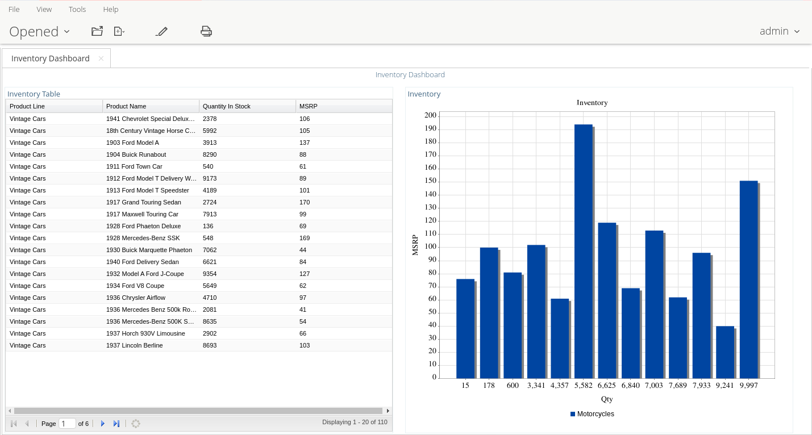
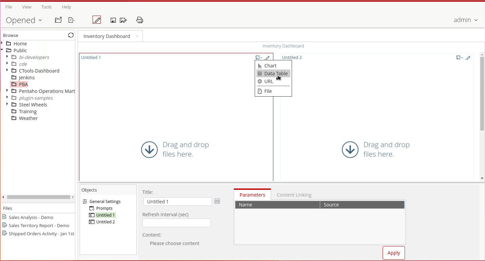
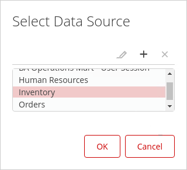
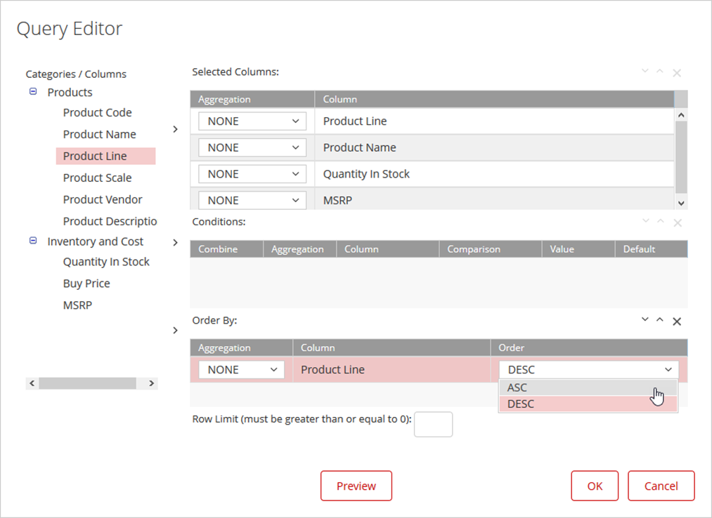
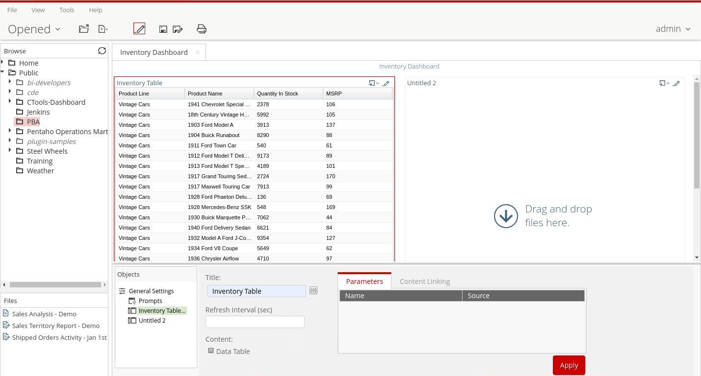
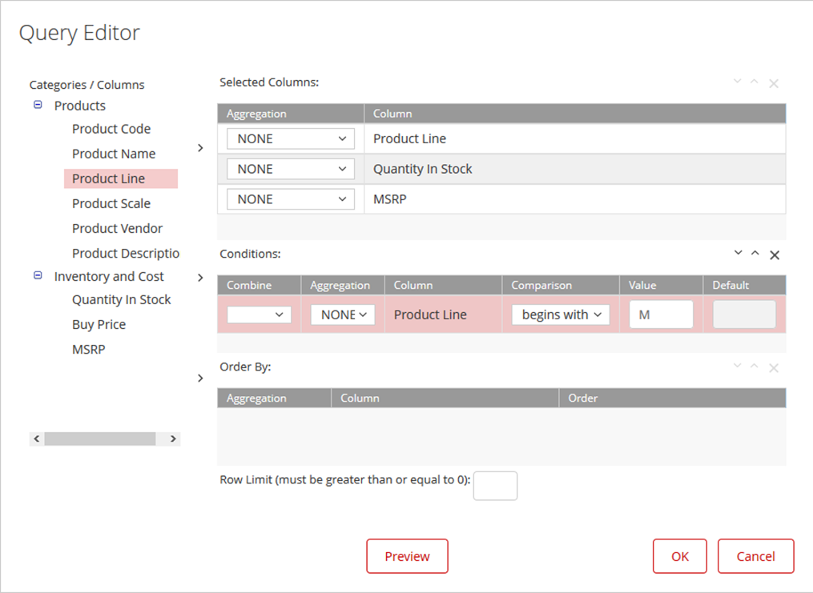
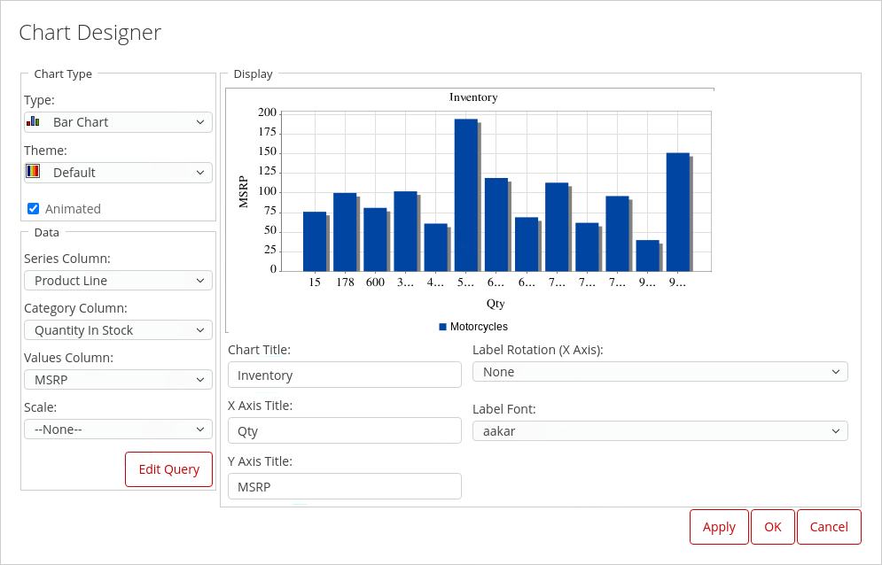

# Inventory

> **Warning:**
>
> #### Workshop - Inventory
> 
> Query-based dashboards in Dashboard Designer let you build data tables and charts directly from a data source, without pre-existing reports — ideal for custom data views or rapid prototyping.
> 
> In this workshop, you build a query-based Inventory dashboard in the Pentaho User Console, connecting to the Inventory data source and constructing metadata queries that you turn into a data table and a chart.
> 
> **What you'll do**
> 
> * Select and configure dashboard layout templates (2 Column) and themes (Crystal) for visual presentation
> * Set dashboard properties including title (Inventory Dashboard)
> * Connect to the Inventory data source using the metadata layer
> * Build a data table component by constructing a metadata query that selects Product Line, Product Name, Quantity in Stock, and MSRP
> * Apply sorting (ascending by Product Line) to organize tabular data logically
> * Configure data table properties and apply custom titles (Inventory Table)
> * Create a chart component using the same Inventory data source with a new query
> * Implement query filters by adding conditions (Product Line begins with "M") to focus on specific data subsets
> * Design a chart using the Chart Designer by mapping columns to chart elements (Series, Category, Values)
> * Configure chart properties including chart title, axis labels, and visual presentation
> 
> **Prerequisites:** Pentaho Business Analytics Server with Inventory metadata data source configured
> 
> **Estimated time:** 30 minutes

<figure><figcaption>
Inventory Dashboard
</figcaption></figure>

::: tabs

### Template & Data Source

> **Note:**
>
> #### Dashboard Templates
> 
> Creating a dashboard in Dashboard Designer is as simple as choosing a layout template, theme, and the content you want to display.

<figure><figcaption>
Template - 2 column
</figcaption></figure>

1. From the User Console Home Perspective, click Create New -> Dashboard.
2. On the Templates tab, click 2 Column.
3. On the Themes tab, select Crystal.
4. Click the Properties tab, and Enter: Inventory Dashboard as the title.
5. In the Untitled 1 header, click Insert Content, and then click Data Table.
6. From the Select Data Source dialog, click Inventory, and then click OK.

<figure><figcaption>
Inventory - data source
</figcaption></figure>

### Content

> **Note:** 

#### Data Table

<figure><figcaption>
Product Queries
</figcaption></figure>

1. Add Product Line to the Selected Columns:

&#x20;      • From the Categories/Columns list, expand Products.

&#x20;      • Click Product Line.

&#x20;      • Click the top arrow to move Product Line to the Selected Columns area.

2. Repeat the previous step to add Products -> Product Name, Inventory and Cost > Quantity In Stock, and Inventory and Cost -> MSRP to the Selected Columns area.
3. To ASC Sort by Product Line and create the table:

&#x20;      • From the Categories/Columns list, click Product Line.

&#x20;      • Click the bottom arrow to move Product Line to the Order By area.

&#x20;      • Click OK.

4. In the Title text box, type Inventory Table, and then click Apply.

<figure><figcaption>
Inventory Table
</figcaption></figure>

> **Under the hood:**
>
> #### The query editor wrote MQL, and the metadata layer wrote SQL
>
> Selected Columns became MQL `<selections>` and Order By an `<orders>`
> entry, and the metadata layer resolved the join between Products and
> Inventory and Cost from the model's relationships — you never named
> a key. The generated SQL ran on the Inventory model's connection and
> the data table rendered the rows it returned.
>
> **Why it matters:** a business user joined two tables correctly by
> clicking, because the join was decided once, by the model's author.

***

#### Chart

> **Note:** 

1. In the Untitled 2 header, click Insert Content, and then click Chart.
2. From the Select Data Source dialog, click Inventory, and then click OK.

<figure><figcaption>
Condition: Product Line begins with M
</figcaption></figure>

3. Add columns to the Selected Columns:

&#x20;      • From the Categories/Columns list expand Products.

&#x20;      • Click Product Line.

&#x20;      • Click the top arrow to move Product Line to the Selected Columns area.

&#x20;      • Expand Inventory and Cost.

&#x20;      • Click Quantity in Stock.

&#x20;      • Click the top arrow to move Quantity in Stock to the Selected Columns area.

&#x20;      • Click MSRP.

&#x20;      • Click the top arrow to move MSRP to the Selected Columns area.

4. Add a condition for Product Line and open the Chart Designer:

&#x20;      • From the Categories/Columns list, click Product Line.

&#x20;      • Click the middle arrow to move Product Line to the Conditions area.

&#x20;      • From the Comparison drop-down list, select begins with.

&#x20;      • In the Value column, type M.

&#x20;      • Click OK.

5. To create the chart, complete the following fields in the Chart Designer window, and then click OK:

<figure><figcaption>
Chart
</figcaption></figure>

| Field           | Entry             |
| --------------- | ----------------- |
| Series Column   | Product Line      |
| Category Column | Quantity in Stock |
| Values Column   | MSRP              |
| Chart Title     | Inventory         |
| X Axis Title    | Qty               |
| Y Axis Title    | MSRP              |

> **Under the hood:**
>
> #### The condition ran in the database; the chart only saw matching rows
>
> "Product Line begins with M" became an MQL `<constraint>`, rendered
> as `LIKE 'M%'` in the generated WHERE clause, so non-matching rows
> were never returned. The Chart Designer then mapped the three result
> columns onto series, category and value — no second query, no
> filtering in the browser.
>
> **Why it matters:** filters here are query filters, not chart
> filters. Put the selective condition in the query and the chart stays
> fast however large the table grows.

:::

