# Product Performance

> **Warning:**
>
> #### Workshop - Product Performance
> 
> Content linking connects multiple Dashboard Designer panels so a selection in one component dynamically filters and updates the others.
> 
> In this workshop, you build a three-panel dashboard in the Pentaho User Console that connects an analysis report, a pie chart, and a bar chart through parameter passing, creating cascading filters where clicking a product updates a territory sales chart and clicking a territory refines an order status summary.
> 
> **What you'll do**
> 
> * Select and configure the 1 and 2 dashboard layout template with Ruby theme
> * Set dashboard properties including page title (Product Performance Dashboard)
> * Add the Product Sales by Year analysis report to the primary panel with a custom title (Product Sales Analysis)
> * Enable content linking on the Product field to allow user selections to drive other components
> * Create a pie chart component by building a metadata query against the Orders data source
> * Implement parameterized filtering by adding a Product Name condition using the {PRODUCT} parameter with a default value
> * Configure the pie chart to display Territory sales totals with appropriate chart properties
> * Add dynamic parameter references to panel titles to show current selections
> * Map parameters between components by linking the chart's PRODUCT parameter to the analysis report's Product output
> * Enable content linking on the Territory field in the pie chart to drive downstream filtering
> * Build a bar chart showing order status distribution using COUNT\_DISTINCT aggregation on Order Number
> * Implement multi-parameter filtering with both {PRODUCT} and {TERRITORY} parameters with appropriate defaults
> * Create cascading parameter mappings where the bar chart receives PRODUCT from the analysis report and TERRITORY from the pie chart
> * Test the complete interactive experience by clicking through product selections and territory segments
> 
> **Prerequisites:** Pentaho Business Analytics Server with Orders data source, Steel Wheels Widget Library containing Product Sales by Year analysis report
> 
> **Estimated time:** 45 minutes

<figure>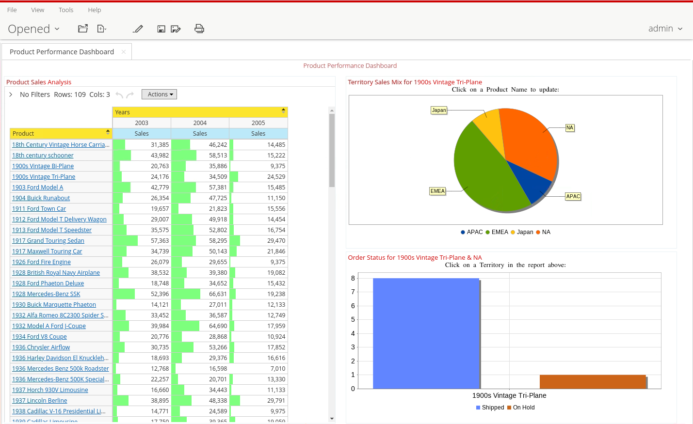<figcaption>
Content Linking
</figcaption></figure>

::: tabs

### Template & Reports

> **Note:**
>
> #### Dashboard Templates
> 
> Creating a dashboard in Dashboard Designer is as simple as choosing a layout template, theme, and the content you want to display.

<figure>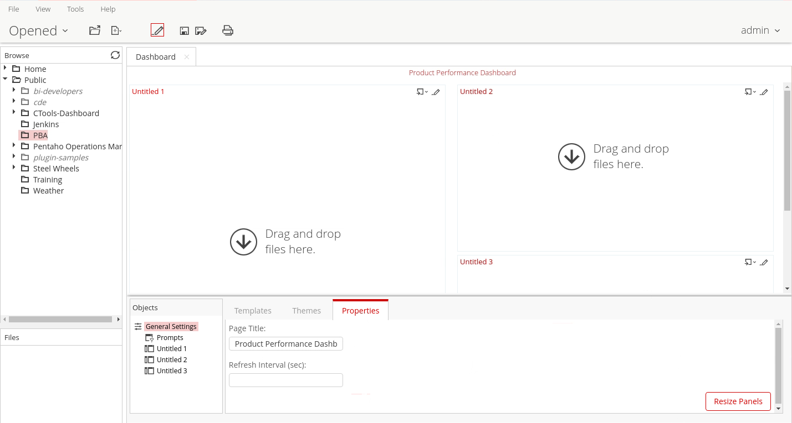<figcaption>
Template - 1 and 2
</figcaption></figure>

1. From the User Console Home Perspective, click Create New -> Dashboard.
2. Select the 1 and 2 template, on the Templates tab, click 1 and 2.
3. To view the available themes, click the Themes tab.
4. Select: Ruby theme.
5. In the Page Title text box, type: Product Performance Dashboard.

***

Product Sales by Year

<figure>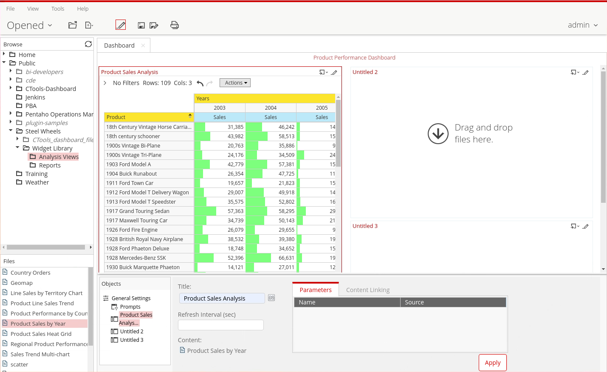<figcaption>
Product Sales Analysis
</figcaption></figure>

1. To add the Product Sales by Year report to the dashboard, from the Browse pane:
2. Expand the Steel Wheels -> Widget Library -> Analysis Views folder.
3. From the Files pane, drag: 'Product Sales by Year' to the Untitled 1 panel on the dashboard.
4. To add a panel title, in the Title text box, type: 'Product Sales Analysis'.

> **Note:** To enable dashboard viewers to click a Product Name in the report and have the chart on the right update with the values associated with that product, you must enable content linking.

5. To enable content linking for the Product Name field:

&#x20;      • In the bottom pane, click the Content Linking tab.

&#x20;      • Click the Enabled checkbox for Product.

&#x20;      • Click Apply.

<figure>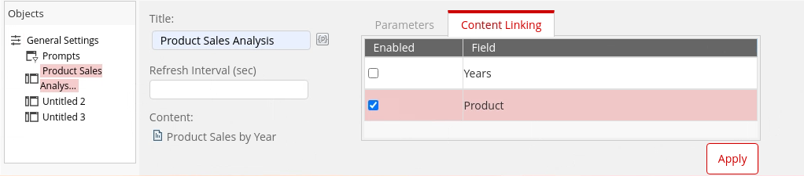<figcaption>
Content Linking - Product
</figcaption></figure>

### Content Linking

#### Territory Sales Mix

> **Note:** To allow dashboard users click a 'Product Name' in the report and have the chart on the right update with the values associated with that product, enable content linking.

<figure>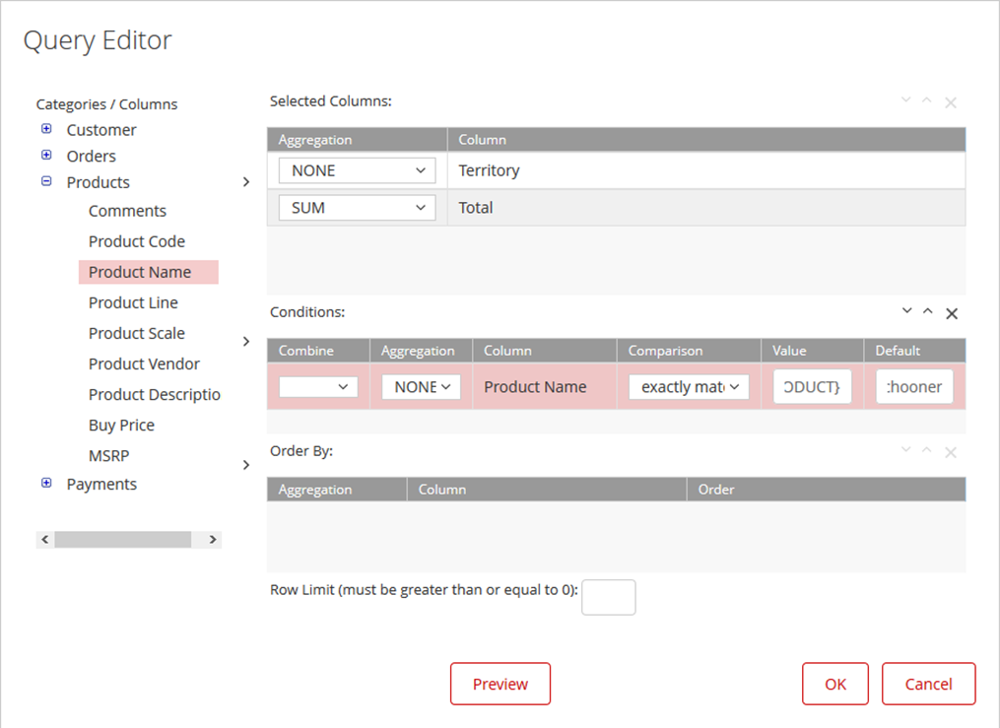<figcaption></figcaption></figure>

1. In the Untitled 2 header, click Insert Content, and then click Chart.
2. From the Select Data Source dialog, click Orders, and then click OK.
3. Add columns to the Selected Columns:

&#x20;      • From the Categories/Columns click Customer > Territory.

&#x20;      • Click the top arrow to move Territory to the Selected Columns area.

&#x20;      • From the Categories/Columns click Orders -> Total.

&#x20;      • Click the top arrow to move Total to the Selected Columns area.

4. Add a condition for Product Name:

&#x20;      • From the Categories / Columns list, click Products > Product Name.

&#x20;      • Click the middle arrow to move Product Name to the Conditions area.

&#x20;      • In the Value field, type {PRODUCT}.

&#x20;      • In the Default field, type: 18th century schooner.

&#x20;      • Click OK.

5. To create the pie chart, complete the following fields in the Chart Designer window, and then click OK.

<figure>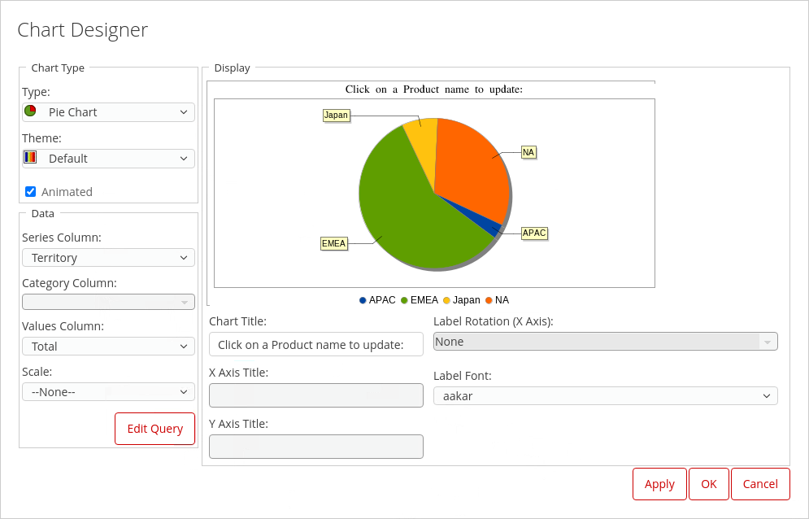<figcaption>
Pie Chart - Territory Sales
</figcaption></figure>

| Field         | Entry                              |
| ------------- | ---------------------------------- |
| Chart Type    | Pie Chart                          |
| Theme         | Legacy                             |
| Series Column | Territory                          |
| Values Column | Total                              |
| Chart Title   | Click on a Product Name to update: |

6. To add a panel title with the parameter, in the **Title** text box, type **Territory Sales Mix for**, and then click the **Add parameters to title** icon.

<figure>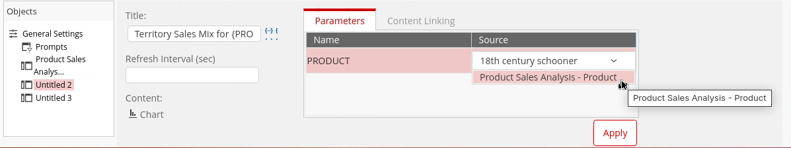<figcaption>
Add {PRODUCT} param to Title &#x26; pickup for Pie Chart.
</figcaption></figure>

7. To create a parameter that obtains the Product Name from the Product Sales Analysis report:

&#x20;      • In the bottom pane, click the **Parameters** tab.

&#x20;      • From the **Source** drop-down list, select **Product Sales Analysis – Product**.

8. To enable content linking for the Territory field:

&#x20;      • In the bottom pane, click the **Content Linking** tab.

&#x20;      • Click the **Enabled** checkbox for **Territory**.

&#x20;      • Click **Apply**.

<figure>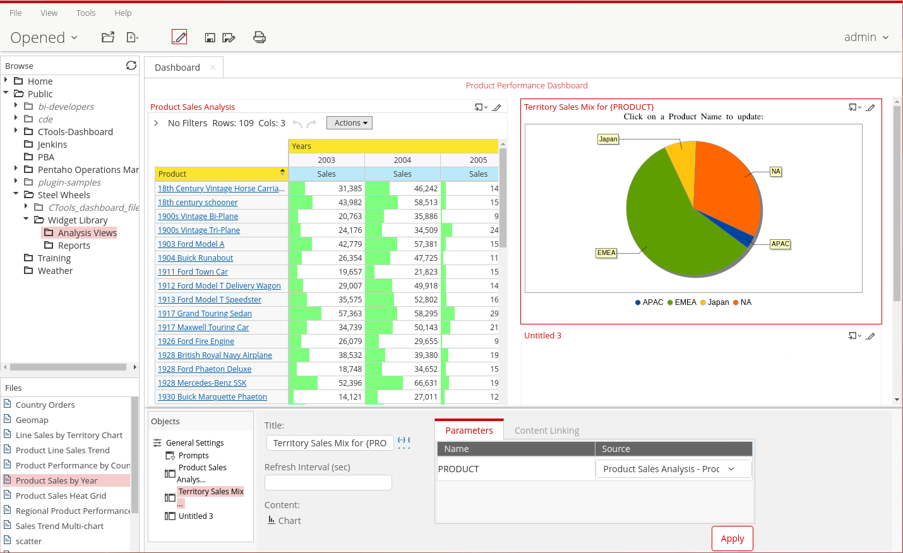<figcaption>
Pass {PRODUCT} and content link {TERRITORY}
</figcaption></figure>

***

#### Bar Chart

> **Note:** Finally .. create a bar chart showing the number of orders for the product selected on the Product Sales by Year report and the Territory.&#x20;

1. In the **Untitled 3** header, click **Insert Content**, and then click **Chart**.
2. From the **Select Data Source** dialog, click **Orders**, and then click **OK**.

<figure>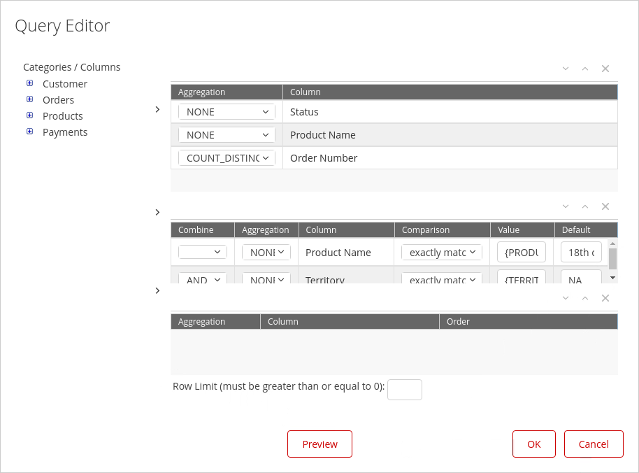<figcaption>
Query - Order Status
</figcaption></figure>

3. Add columns to the Selected Columns:

&#x20;      • From the **Categories / Columns** click **Orders -> Status**.

&#x20;      • Click the **top arrow** to move **Status** to the **Selected Columns** area.

&#x20;      • From the **Categories / Columns** click **Products > Product Name**.

&#x20;      • Click the **top arrow** to move **Product Name** to the **Selected Columns** area.

&#x20;      • From the **Categories/Columns** click **Orders > Order Number**.

&#x20;      • Click the **top arrow** to move **Order Number** to the **Selected Columns** area.

4. To count the number of distinct orders, from the **Aggregation** drop-down list for **Order Number**, select **COUNT\_DISTINCT**.
5. Add conditions for Product Name and Territory:

&#x20;      • From the **Categories / Columns** list, click **Products -> Product Name**.

&#x20;      • Click the **middle arrow** to move **Product Name** to the **Conditions** area.

&#x20;      • In the **Value** field, type **{PRODUCT}**.

&#x20;      • In the **Default** field, type **18th century schooner**.

&#x20;      • From the **Categories/Columns** list, click **Customer ->Territory**.

&#x20;      • Click the **middle arrow** to move **Territory** to the **Conditions** area.

&#x20;      • In the Value field, type **{TERRITORY}**.

&#x20;      • In the **Default** field, type **NA**.

&#x20;      • Click **OK**.

6. Complete the following fields in the **Chart Designer** window, and then click **OK**.

<figure>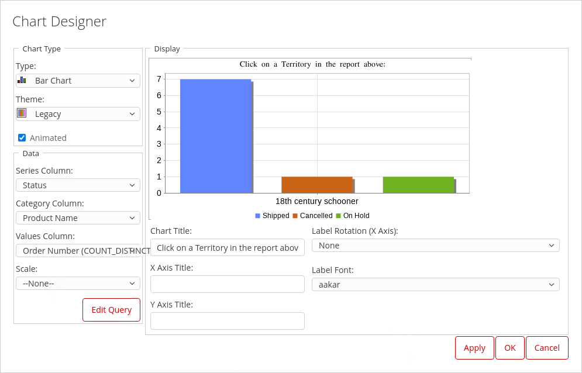<figcaption></figcaption></figure>

| Field           | Entry                                     |
| --------------- | ----------------------------------------- |
| Chart Type      | Bar Chart                                 |
| Theme           | Legacy                                    |
| Series Column   | Status                                    |
| Category Column | Product Name                              |
| Values Column   | Order Number (COUNT\_DISTINCT)            |
| Chart Title     | Click on a Territory in the report above: |

<figure>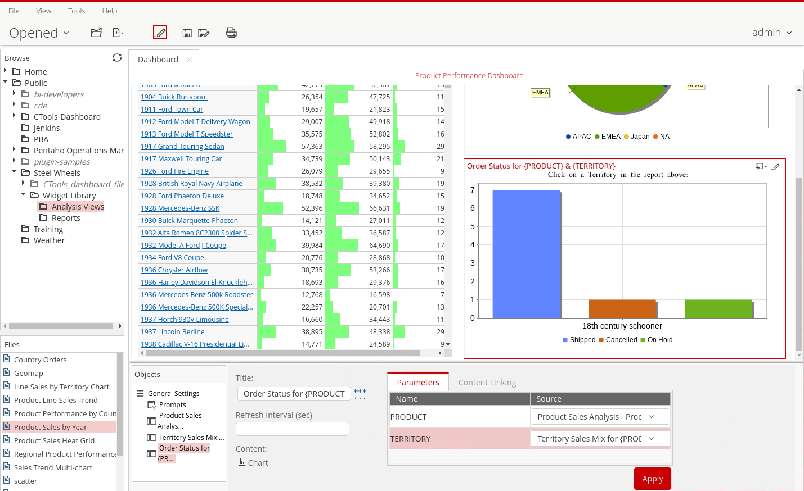<figcaption></figcaption></figure>

7. In the **Title** text box, type **Order Status Summary for**, and then click the **Add parameters to title** icon.
8. To create parameters that obtain the Product Name from the Product Sales Analysis report and the Territory from the Territory Sales Mix chart:

&#x20;      • In the bottom pane, click the **Parameters** tab.

&#x20;      • From the **Source** drop-down list for **PRODUCT**, select **Product Sales Analysis – Product**.

&#x20;      • In the bottom pane, click the **Parameters** tab.

&#x20;      • From the **Source** drop-down list for **TERRITORY**, select **Territory Sales Mix**.

&#x20;      • Click **Apply**.

***

> **Note:** The Content Linking will only work once you have saved your dashboard.
> 
> On the main toolbar, click the **Edit Content** button.
> 
> From the Product Sales Analysis report, click **1900s Vintage Tri-Plane**.
> 
> From the **Territory Sales Mix** chart, click **NA**.

<figure><figcaption></figcaption></figure>

:::

