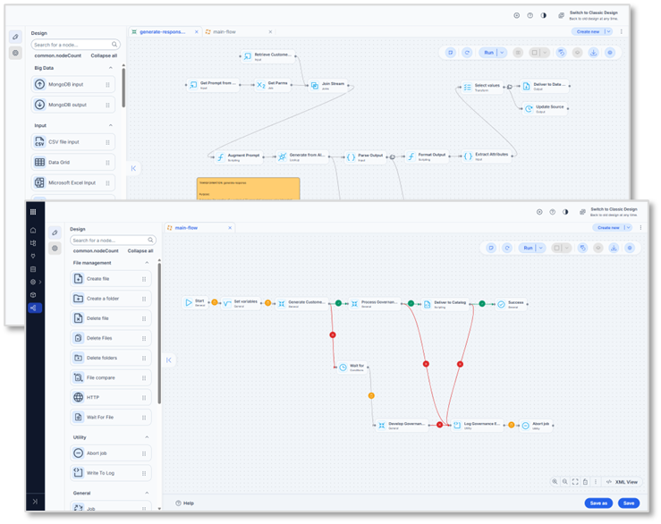
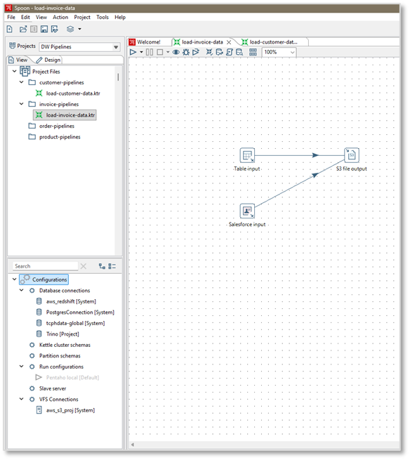
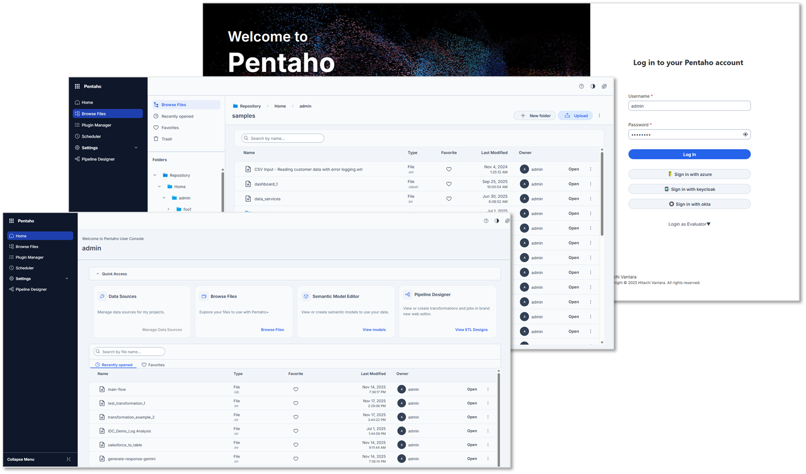
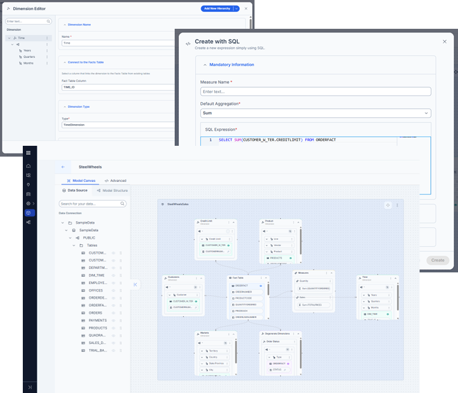
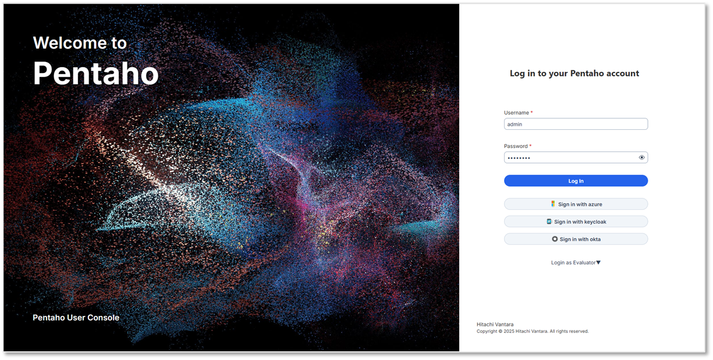
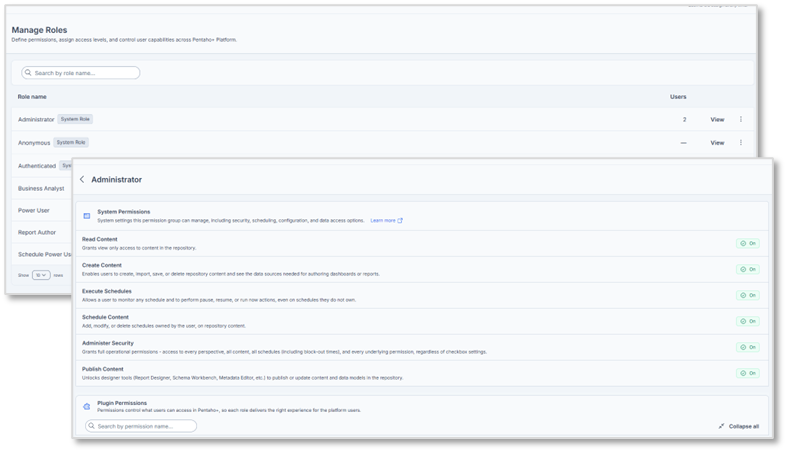
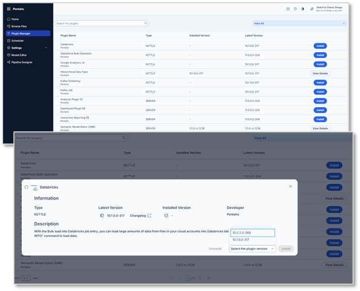

# What's New

Pentaho Data Integration (PDI) 11.0 and Pentaho Business Analytics (PBA) 11.0 deliver major updates. This release focuses on a modern UI, stronger security, and simpler deployments.

11.0 is a long-term support (LTS) release. For service pack and update schedules, see the [Pentaho Support Lifecycle page](https://support.pentaho.com/hc/en-us/articles/205789159-Pentaho-Product-Lifecycle-Overview).

For the full change list, see the [11.0 release notes](https://docs.pentaho.com/whats-new/release-notes-11.0).

### Highlights

* Author ETL pipelines in a browser with Pipeline Designer.
* Organize and deploy ETL assets with project-based lifecycle management.
* Preview the redesigned Pentaho User Console (PUC).
* Build Mondrian models in the browser with Semantic Model Editor (SME).
* Enable SSO with built-in OpenID Connect (OIDC) and OAuth 2.0.
* Simplify container deployments with standardized, prebuilt images.
* Run on Java 21 and Tomcat 10.
* Manage features as plugins with Plugin Manager.
* Monitor ETL runs with OpenTelemetry-based observability.

### Pipeline Designer

Pipeline Designer is a browser-based UI for authoring ETL pipelines. Build PDI transformations and jobs in a web browser. Use Spoon only for legacy tooling.

It is similar to Spoon. The UI uses a modern framework. It remains compatible with transformations and jobs created in Spoon.

Learn more about [Pipeline Designer](https://docs.pentaho.com/pba/11.0-pba/pipeline-designer).

### Project-based lifecycle management

Before 11.0, PDI had no defined structure for organizing transformations, jobs, and configuration. That made collaboration and environment promotion harder for ETL and DevOps teams.

Configuration resolution could also feel inconsistent.

Project-based lifecycle management addresses these gaps.

Learn more about [configuring ETL with Projects](https://docs.pentaho.com/pdia-data-integration/pdia-11.0-data-integration/organizing-etl-with-projects#manageability).

### Modern Pentaho User Console (preview)

> **Note:** This feature is in preview. Behavior and UI might change in later updates.

11.0 introduces a redesigned user experience (UX) for Pentaho User Console (PUC). It aligns with the broader Pentaho platform UX. It addresses pain points in PUC 10.2 and earlier.

The existing PUC stays available until feature parity.

Learn more about [Modern PUC](https://docs.pentaho.com/pba/11.0-pba/pentaho-user-console/modern-design).

### Semantic Model Editor (SME)

11.0 introduces a new tool for building and managing Mondrian data models. Previously, customers used Schema Workbench or Data Source Wizard. Semantic Model Editor (SME) provides a modern, web-based workflow.

SME works for both new and advanced users. It improves the modeling experience in PBA, especially Analyzer. It supports existing Mondrian models and adds new capabilities.

Learn more about [Semantic Model Editor](https://docs.pentaho.com/pba/11.0-pba/semantic-model-editor).

### Built-in OIDC and OAuth 2.0

11.0 supports OpenID Connect (OIDC) and OAuth 2.0 authentication for Pentaho Server. This enables single sign-on (SSO) with identity providers such as Google, Okta, and Azure. It supports any OIDC-compliant identity provider (IdP).

Learn more about [OIDC and OAuth 2.0](https://docs.pentaho.com/pdia-admin/pdia-11.0-admin/administer/secure-the-pentaho-system/user-security/advanced-security-providers/oidc-oauth-2.0).

### Granular permissions for Pentaho Server

11.0 adds more granular and flexible access control across the platform. This addresses long-standing challenges:

* Permissions were not fine-grained enough. For example, **Read Content** lets users see content from any plugin. File and folder permissions can still block access.
* Permissions could not cleanly allow or block individual plugins.
* Permissions were too broad for data sources and similar assets.
* Execute permissions were too broad.

11.0 addresses these issues in Pentaho Server. Combined with OIDC and OAuth 2.0, it provides a stronger authentication and authorization model.

Learn more about [granular permissions](https://docs.pentaho.com/pba/11.0-pba/semantic-model-editor/sharing-a-semantic-model/permissions-for-semantic-models).

### Simplified container deployment

11.0 simplifies Docker-based deployments. It introduces optimized, prebuilt images for on-premises deployments and major Kubernetes platforms.

This includes plain Docker, Kubernetes, EKS, AKS, and GKE. Images use standardized installation paths and variables. Entrypoint scripts support runtime overrides for configuration files and licenses.

Learn more about [Docker deployment](https://docs.pentaho.com/install/pdia-11.0-installation/pentaho-installation-overview-cp/docker-container-deployment-of-pentaho-installation-cp).

### Java 21 and Tomcat 10 support

Java 21 is supported in 11.0. You can use Oracle JDK, OpenJDK, or other supported JVMs.

Pentaho Server 11.0 ships with Tomcat 10. This addresses vulnerabilities and defects associated with Tomcat 9.

Learn more in the [Components reference](https://docs.pentaho.com/install/pdia-11.0-installation/components-reference).

### Plugin Manager

11.0 introduces a Plugin Manager for both PDI and PBA plugins. Pentaho will ship more functionality as plugins over time. This makes it easier to identify, deploy, and update plugins.

Learn more about [Plugin Manager](https://docs.pentaho.com/pba/11.0-pba/pentaho-user-console/modern-design/plugin-manager).

### Karaf and OSGi removed, big data plugins delivered separately

In 11.0, Karaf and OSGi are removed from PDI. Big data components are now delivered as plugins. There is no separate PDI distribution for big data add-ons. Deploy big data components the same way as other PDI plugins.

This reduces both the PDI client and Pentaho Server deployment size by more than 1 GB.

Learn more about [Plugin Manager](https://docs.pentaho.com/pba/11.0-pba/pentaho-user-console/modern-design/plugin-manager).

### OpenTelemetry-based observability

[OpenTelemetry](https://opentelemetry.io/docs/languages/java/) (OTel) is an open standard for sharing telemetry data such as traces, metrics, and logs. Many tools can consume OpenTelemetry data, including Datadog, Splunk, Elastic, Amazon CloudWatch, and Azure Monitor.

With the OTel plugin, you can monitor Pentaho ETL processes with:

* Logs that are consolidated in a single place and represented hierarchically
* Traces to view task timing, execution hierarchy, and variables during execution
* Metrics to track data flow trends at specified points of interest

Learn more about [Plugin Manager](https://docs.pentaho.com/pba/11.0-pba/pentaho-user-console/modern-design/plugin-manager).

### Other enhancements

11.0 also includes smaller enhancements and defect fixes. See the [11.0 release notes](https://docs.pentaho.com/whats-new/release-notes-11.0) for details.
