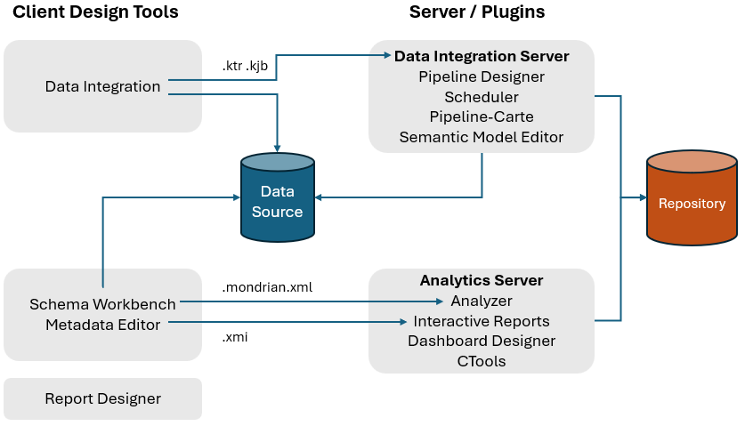
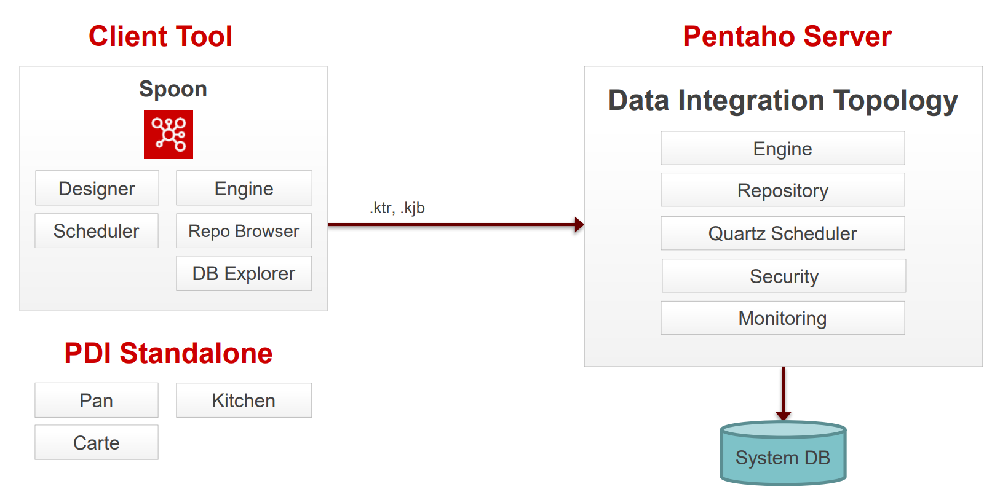
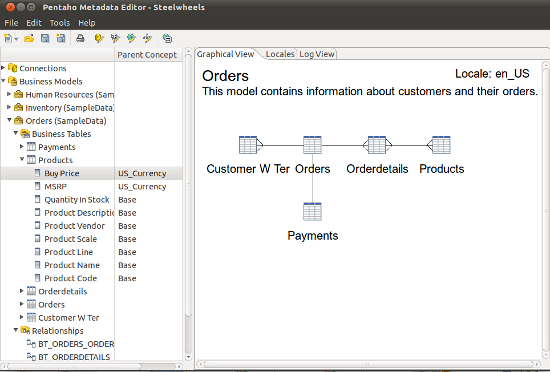
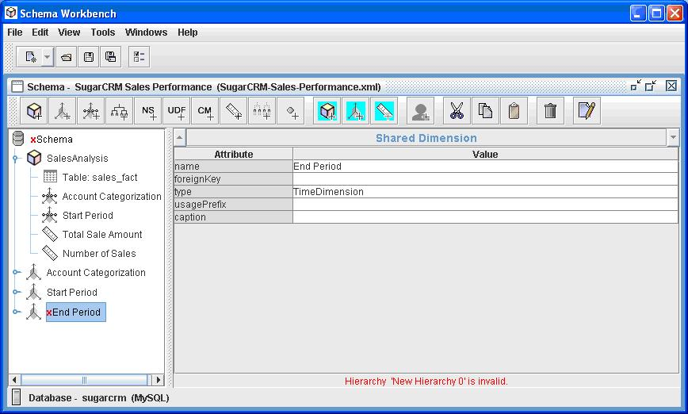
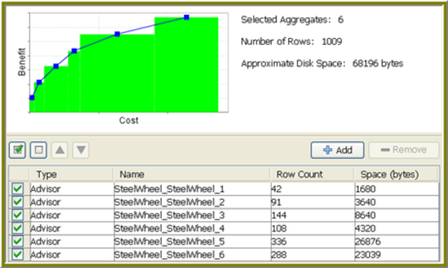
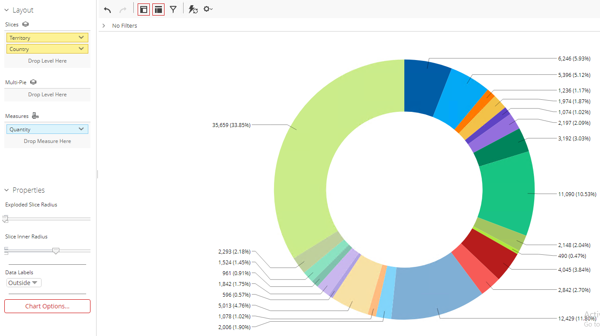
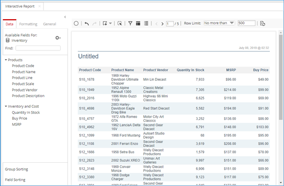
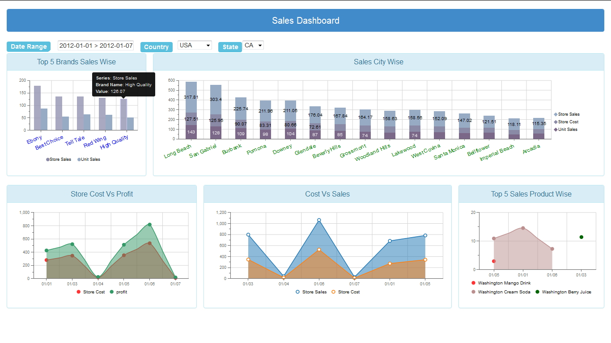
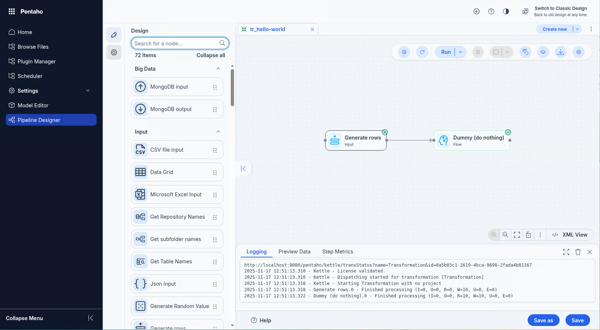
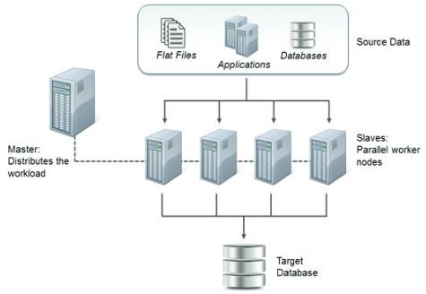

# Components

> **Note:**
>
> #### Pentaho Client / Server Architecture
> 
> Pentaho's client/server architecture forms the basis of its data integration and business analytics suite, providing a flexible and scalable platform for enterprise data management and analysis. The architecture is designed to support various data integration, reporting, and analytics needs across an organization.

<figure><figcaption><p>Pentaho Architecture</p></figcaption></figure>

<table><thead><tr><th width="186">Port Number</th><th>Description</th></tr></thead><tbody><tr><td>5432</td><td>PostgreSQL Server</td></tr><tr><td>8080</td><td>Pentaho Server Tomcat Web Server Startup Port</td></tr><tr><td>8012</td><td>Pentaho Server Shutdown Port</td></tr><tr><td>9001</td><td>HSQL Server Port</td></tr><tr><td>9092</td><td>Embedded H2 Database</td></tr></tbody></table>

Key components include:

:::: tabs

### Pentaho Client Tools

> **Note:**
>
> #### **Pentaho Client Tools**
> 
> The Pentaho Client, a key component of the Pentaho suite, encompasses several user-facing tools designed for data management and analytics. These include the Data Integration tool (PDI), which is central to extracting, transforming, and loading (ETL) operations; Spoon, a graphical user interface for designing ETL processes; Designer for convenient pipeline design; Scheduler linked to Quartz for job scheduling; Repository Browser for managing ETL assets; and Database Explorer for database operations.
> 
> Additionally, it offers tools like Metadata Editor and Schema Workbench for advanced data manipulation. Together, these tools empower users to efficiently process and analyze data within the Pentaho ecosystem.

::: tabs

### Data Integration

> **Note:**
>
> #### **Data Integration**
> 
> Pentaho Data Integration (PDI), also known as Kettle, is an open-source data integration tool that allows the extraction, transformation, and loading (ETL) of data into databases, data warehouses, and business applications. It is designed to handle a wide variety of data sources including traditional relational databases, unstructured data formats, and cloud-based storage. PDI is composed of several key components that work together to provide a comprehensive ETL solution.

<figure><figcaption><p>Pentaho Client / Server Architecture</p></figcaption></figure>

> **Note:** **Spoon**
> 
> Spoon is the graphical user interface (GUI) for designing and testing PDI jobs and transformations. It allows users to visually create, edit, and manage ETL processes without writing code.
> 
> **Designer**
> 
> Drag & Drop 'objects' to design your pipelines and workflows.
> 
> **Scheduler**
> 
> Connects to Quartz scheduler on server. Jobs and transformations must be uploaded to Repository.
> 
> **Repository Browser**
> 
> The repository is a central storage area for PDI resources such as jobs, transformations, and database connections. It facilitates collaboration among team members by allowing them to share and manage ETL assets efficiently.
> 
> These components collectively make PDI a powerful tool for data integration, enabling businesses to cleanse, integrate, and analyze data from diverse sources more effectively.
> 
> Connects to Apache Jackrabbit content Repository, pointing to a supported database:
> 
> * PostgreSQL
> * MSSQL Server
> * Oracle
> * MySQL
> * MariaDB
> 
> **DB Explorer**
> 
> Database Explorer that enables you to conduct minimal database operations.

### Metadata Editor

> **Note:**
>
> #### **Metadata Editor**
> 
> The Pentaho Metadata Editor is a tool within the Pentaho suite that facilitates the creation and management of business models. These models form the foundation for reporting and analysis, making it easier for end-users to interact with data without needing a deep understanding of the underlying database structures.
> 
> Key features include:
> 
> **User-friendly Interface:** Offers a graphical environment where users can define business models, relationships, and metadata concepts, simplifying complex data structures into more understandable terms.
> 
> **Data Source Connection:** Allows connection to various data sources, enabling the extraction of metadata from relational databases, OLAP sources, and more.
> 
> **Security Settings:** Supports the definition of security constraints at the model level, ensuring that sensitive data remains protected and access is controlled.
> 
> **Localization and Internationalization:** Models can be localized, allowing the presentation of metadata in different languages to support global deployments.
> 
> The Metadata Editor plays a crucial role in the Pentaho Business Analytics suite, streamlining the creation of complex reports and analyses by offering a simplified view of data for business users.

<figure><figcaption><p>Metadata Editor</p></figcaption></figure>

### Schema Workbench

> **Note:**
>
> #### **Schema Workbench**
> 
> The Pentaho Schema Workbench is an essential tool within the Pentaho suite designed for developers and data architects to create and edit OLAP (Online Analytical Processing) schemas. It provides a graphical interface for defining the multidimensional models needed for complex analytical queries, enabling the efficient organization and visualization of large data sets.
> 
> With its user-friendly interface, users can easily design OLAP cubes that form the foundation of advanced analytics and business intelligence applications, making data more actionable and insights more accessible.

<figure><figcaption><p>Schema Workbench</p></figcaption></figure>

### Aggregation Designer

> **Note:**
>
> #### **Aggregation Designer**
> 
> The Pentaho Aggregation Designer is a pivotal tool aimed at improving query performance by simplifying the creation and management of aggregate tables in a star schema database. This graphical tool assists users in defining, generating, and deploying SQL-based aggregation tables that summarily condense detailed data into summarized formats, making data retrieval processes significantly more efficient for analytical queries.
> 
> This capability is critical for enhancing the performance of OLAP cubes, facilitating faster data analysis, and providing a more streamlined user experience in the Pentaho Business Analytics suite.

<figure><figcaption><p>Aggregation Designer</p></figcaption></figure>

:::

### Pentaho Server

> **Note:** **Pentaho Server**
> 
> Pentaho Server acts as the central platform for hosting and managing all Pentaho applications and services. It provides a secure, scalable environment for deploying and executing Pentaho's analytics and data integration solutions. Key components include:
> 
> * **BI Server:** Facilitates interactive reporting, analytics, dashboarding, and data exploration.
> * **Data Integration Server:** Supports the orchestration and scheduling of ETL (Extract, Transform, Load) processes.
> * **User Console:** Offers a web-based interface for accessing, creating, and managing content within the Pentaho suite.
> * **Security:** Integrates with enterprise security systems to provide authentication, authorization, and secure access.
> * **Repository:** Centralizes the storage of all Pentaho assets, including reports, dashboards, and ETL scripts, ensuring collaboration and version control.
> 
> The server enables organizations to leverage the full potential of the Pentaho suite by providing a comprehensive platform for business intelligence and data management activities.

**Pentaho Server Reporting Suite**

::: tabs

### Analyzer

> **Note:**
>
> #### **Analyzer**
> 
> Pentaho Analyzer is an interactive analytics and data visualization tool that is part of the Pentaho Business Analytics suite. It enables users to explore and analyze data through an intuitive web-based interface, providing rich graphical representations of data including charts, tables, and heat maps. Users can create and customize reports and dashboards without the need for in-depth technical knowledge, making it accessible to a wide range of users. Key features include:
> 
> * **Ad-hoc analysis:** Empowers users to quickly create and modify reports based on their specific questions and needs.
> * **Drag-and-drop interface:** Simplifies the process of designing reports by allowing users to easily select and arrange data elements.
> * **Rich visualizations:** Supports a wide array of visualization options to help users uncover insights from their data.
> * **Collaboration and sharing:** Enables sharing of reports and dashboards with other users to facilitate decision-making across teams and departments.
> 
> Pentaho Analyzer is designed to work seamlessly with the Pentaho suite, integrating directly with Pentaho's data integration, ETL, and data warehousing capabilities. This allows users to leverage the full power of the suite for comprehensive data analysis and business intelligence solutions.

<figure><figcaption><p>Analyzer Report</p></figcaption></figure>

### Interactive Reports

> **Note:**
>
> #### **Interactive Reports**
> 
> Pentaho Interactive Reports offer a highly user-friendly interface for creating, editing, and viewing ad-hoc reports. This feature is designed for business users who need to generate reports quickly without in-depth technical knowledge of the underlying data structure.
> 
> * **User-Friendly Interface:** Provides a drag-and-drop interface, making it easy for users to select, organize, and present data without any SQL knowledge.
> * **Real-Time Data Exploration:** Enables users to interact with their data in real-time, allowing for instant filtering, sorting, and aggregation to identify trends and insights.
> * **Customizable Layouts:** Users can customize the layout of their reports by adjusting columns, rows, and summaries to meet their specific reporting needs.
> * **Export and Share:** Reports can be exported to various formats (e.g., PDF, Excel, CSV) and shared with stakeholders to support data-driven decision-making.
> 
> Interactive Reports are part of the larger Pentaho Business Analytics suite, offering seamless integration with Pentaho's ETL and data analysis tools, ensuring businesses have a comprehensive solution for their data integration and reporting needs.

<figure><figcaption><p>Interactive Report</p></figcaption></figure>

### Dashboard Designer

> **Note:**
>
> #### **Dashboard Designer**
> 
> Pentaho Dashboard Designer is a feature-rich tool within the Pentaho Business Analytics suite, designed for creating interactive and visually appealing dashboards. These dashboards aggregate and display data from various sources, providing users with insights at a glance. Here's a quick overview:
> 
> * **Intuitive Design Interface**: Offers a drag-and-drop interface, making it accessible for non-technical users to create and customize dashboards.
> * **Data Integration**: Seamlessly integrates with Pentaho Data Integration (PDI), allowing it to pull data from a wide range of sources for real-time analytics.
> * **Interactive Widgets**: Supports various types of widgets including charts, tables, and filters, enabling interactive data exploration.
> * **Customization and Branding**: Allows for the customization of layout and design, enabling alignment with company branding.
> * **Collaboration Features**: Facilitates sharing and collaboration by allowing users to publish dashboards within the organization or to a broader audience.
> * **Security**: Integrates with existing security frameworks, ensuring data protection and controlled access based on roles and permissions.
> 
> Pentaho Dashboard Designer plays a crucial role in transforming data into actionable insights, driving informed decision-making across organizations.

<figure><figcaption><p>Dashboard</p></figcaption></figure>

### Pipeline Designer

> **Note:**
>
> #### Pipeline Designer

<figure><figcaption><p>Pipeline Designer</p></figcaption></figure>

### Semantic Model Editor

> **Note:**
>
> #### Semantic Model Editor

x

:::

### Carte Server

> **Note:** **Carte Server**
> 
> Pentaho Carte is a lightweight web server for remote execution and monitoring of ETL processes created in Pentaho Data Integration (PDI/Kettle).
> 
> Carte is built on Java and uses the embedded Jetty web server. It relies on XML-based configuration and exposes functionality through a REST API, with a simple browser-based interface for monitoring.
> 
> The server enables remote execution of transformations and jobs, supports clustering for load balancing, provides real-time monitoring, and allows scheduling of ETL processes.
> 
> Carte can be deployed as a standalone server, in a master-slave cluster setup, or in a load-balanced environment for high availability. It's typically launched via command line with a configuration file containing server settings.
> 
> This component is crucial for Pentaho's distributed processing architecture, allowing organizations to scale data integration processes across multiple machines.

<figure><figcaption><p>Carte Cluster</p></figcaption></figure>

### APIs

> **Note:** **Kitchen**
> 
> Kitchen is a command-line tool that enables the execution of PDI jobs. It supports batch processing and can be integrated into automated workflows, allowing for efficient data processing.

```
kitchen.sh -file=/PRD/updateWarehouse.kjb -level=Minimal
kitchen.bat /file:D:\Jobs\updateWarehouse.kjb /level:Basic
```

> **Note:** **Pan**
> 
> Similar to Kitchen, Pan is a command-line tool but is specifically designed for executing PDI transformations. It provides flexibility in running ETL transformations from shell scripts or scheduling systems.

```
pan.sh -file="/PRD/Customer Dimension.ktr" -level=Minimal
pan.bat /file:"D:\Transformations\Customer Dimension.ktr" /level:Basic
```

<div class="pcm-embed-card" data-href="https://docs.pentaho.com/pentaho-rest-api" data-title="docs.pentaho.com"></div>

::::

