# Prepare Environment

> **Note:**
>
> #### Prepare Environment
> 
> Prepare your Ubuntu server for an Archive installation of the Pentaho Server.
> 
> This process will:
> 
> * Create a `pentaho` installation user (with sudo)
> * Set Pentaho paths - `$PENTAHO_BASE`
> * Install Java 21 (OpenJDK)
> * Set `PENTAHO_JAVA_HOME`
> * Install PostgreSQL 17 (15 supported for Pentaho 11)
> * Create repository database user - `pentaho` for setup
> * Install pgAdmin 4 (desktop)

> **Warning:** Supported Linux baseline for Pentaho 11.x: Ubuntu 24.04 LTS.
> 
> For versions and compatibility, see [Components Reference](https://docs.pentaho.com/install/pdia-11.0-installation/components-reference).

**Step 1.** **Prerequisites**

1. Ensure unzip is installed.

```bash
unzip --version
```

2. Set the Pentaho path variables.

> **Note:** Use these variables to simplify commands and avoid path mistakes. Consider adding them to your shell profile for convenience.

* Edit the /etc/environment file.

```bash
cd
cd /etc/
sudo nano environment
```

* Add the following paths.

```bash
# Pentaho paths
PENTAHO_BASE=/opt/pentaho
PENTAHO_SERVER=/opt/pentaho/server/pentaho-server
TOMCAT_HOME=/opt/pentaho/server/pentaho-server/tomcat
```

> **Warning:** If you add these to `~/.bashrc` or `/etc/environment`, re-open your shell or `source` the file to apply.

<figure>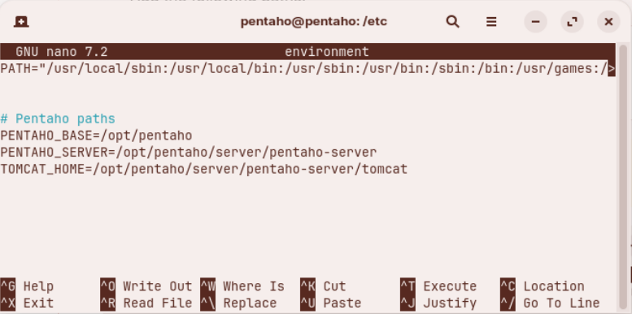<figcaption><p>Pentaho paths</p></figcaption></figure>

**Step 2.** **Create a Pentaho installation user**

> **Danger:** For production, use a dedicated installation account with only the required privileges and avoid sharing credentials.

1. Update packages (run once):

```bash
sudo apt update -y && sudo apt upgrade -y
```

2. Add the user and set a password:

```bash
sudo adduser pentaho
```

3. Grant sudo privileges:

```bash
sudo usermod -aG sudo pentaho
```

4. Validate access:

```bash
su - pentaho
groups
sudo -v
```

**Step 3.** **Install Java 21 (OpenJDK)**

> **Note:** Pentaho 11.x is certified with Java 21.

<details>

<summary>What's the difference bewteen Oracle JDK &#x26; OpenJDK?</summary>

Oracle JDK and OpenJDK are both implementations of the Java Platform, but they have some important differences:

**Licensing and Cost:**

* **OpenJDK** is completely free and open source under the GPL license. You can use it for any purpose without restrictions.
* **Oracle JDK** changed its licensing model in 2019. It's now free for development and personal use, but requires a paid subscription for commercial production use (Oracle Java SE Subscription).

**Source and Development:**

* **OpenJDK** is the reference implementation of Java and serves as the base for most JDK distributions. Oracle actually contributes significantly to OpenJDK development.
* **Oracle JDK** is built from the OpenJDK source code but includes some additional proprietary components and commercial features.

**Performance and Features:**

* In modern versions (Java 11+), the performance differences are negligible. Oracle has contributed most of its performance improvements back to OpenJDK.
* Oracle JDK historically included some additional tools and features (like Java Flight Recorder and Java Mission Control), but many of these have been open-sourced and are now available in OpenJDK.

**Support and Updates:**

* **OpenJDK** receives community support and updates for about 6 months per release (except for LTS versions maintained by various vendors).
* **Oracle JDK** offers Long Term Support (LTS) with commercial subscriptions, providing updates and security patches for extended periods.

**Other Distributions:** Many vendors offer their own builds of OpenJDK with long-term support, including Amazon Corretto, Azul Zulu, Eclipse Temurin (formerly AdoptOpenJDK), and Red Hat OpenJDK.

For most developers and organizations, OpenJDK or vendor-supported OpenJDK distributions are the go-to choice unless you specifically need Oracle's commercial support.

</details>

1. Install Java 21:

```bash
sudo apt install -y openjdk-21-jre-headless
```

2. Verify Java:

```bash
java -version
which java
readlink -f $(which java)
```

<figure>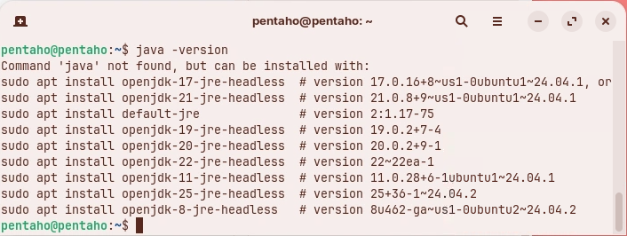<figcaption><p>OpenJDK versions</p></figcaption></figure>

<figure><figcaption><p>Java 21</p></figcaption></figure>

> **Note:** If multiple Java versions are installed, select the default:
> 
> ```bash
> sudo update-alternatives --config java
> ```

**Step 4.** **Set `PENTAHO_JAVA_HOME`**

Set `PENTAHO_JAVA_HOME` globally so the Pentaho Server consistently uses Java 21.

1. Edit `/etc/environment`:

```bash
sudo nano /etc/environment
```

2. Add (or update) the following line:

```bash
# set PENTAHO_JAVA_HOME
PENTAHO_JAVA_HOME=/usr/lib/jvm/java-21-openjdk-amd64
```

<figure>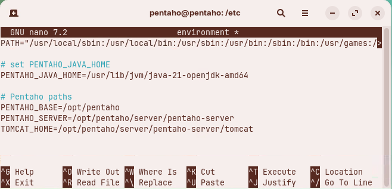<figcaption><p>Set PENTAHO_JAVA_HOME</p></figcaption></figure>

3. Save and reload the environment (or log out/in):

```bash
source /etc/environment
```

4. Verify:

```bash
echo $PENTAHO_JAVA_HOME
```

***

> **Note:** Alternative: set for a single user only in `~/.bashrc`.

1. Edit:

```bash
nano ~/.bashrc
```

2. Append and apply:

```bash
export PENTAHO_JAVA_HOME=/usr/lib/jvm/java-21-openjdk-amd64
. ~/.bashrc
```

**Step 5.** **Install PostgreSQL 17**

> **Note:** Ubuntu 24.04’s default repository provides a newer PostgreSQL 16. To install 17, add the official PostgreSQL (PGDG) repository.
> 
> If a different PostgreSQL is already present, purge it first to avoid port and package conflicts (see the optional "Clean previous installs" tab).
> 
> **Prerequisites**\
> Ubuntu 24.04\
> Root privileges or sudo access\
> use `sudo su` to get into root instead of pentaho (default user)

::: tabs

### Install PostgreSQL 17

1. Before installing PostgreSQL, ensure your system is up to date.

```bash
sudo apt update && sudo apt upgrade -y
```

2. Install prerequisite packages.

```bash
sudo apt install -y wget ca-certificates
```

3. Import PostgreSQL GPG Key.

```bash
wget --quiet -O - https://www.postgresql.org/media/keys/ACCC4CF8.asc | sudo apt-key add -
```

4. Add PostgreSQL Repository

```bash
sudo sh -c 'echo "deb http://apt.postgresql.org/pub/repos/apt $(lsb_release -cs)-pgdg main" > /etc/apt/sources.list.d/pgdg.list'
```

5. Update Package List.

```bash
sudo apt update
```

6. Install PostgreSQL 17 server and client packages.

```bash
sudo apt update -y && sudo apt upgrade -y
sudo apt install -y postgresql-17 postgresql-contrib-17
```

> **Note:** **What gets installed:**
> 
> * `postgresql-17`: Main database server
> * `postgresql-contrib-17`: Additional utilities and extensions

7. Check service and version:

```bash
sudo systemctl status postgresql --no-pager
psql --version
```

<figure>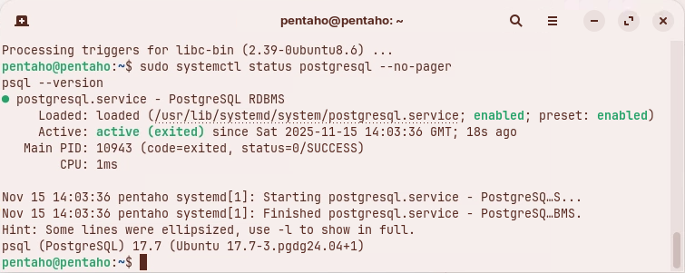<figcaption><p>PostgreSQL 17.7</p></figcaption></figure>

8. Optional tidy up:

```bash
sudo apt autoremove -y
```

### Optional: Install PostgreSQL 16

1. Ensure your Ubuntu system is up-to-date.

```bash
sudo apt update && sudo apt upgrade
```

2. To assist in installing the database software, install the following packages.

```bash
sudo apt install dirmngr ca-certificates software-properties-common apt-transport-https lsb-release curl -y
```

3. Import the repository signing key.

```bash
sudo apt install curl ca-certificates gnupg
curl https://www.postgresql.org/media/keys/ACCC4CF8.asc | sudo gpg --dearmor | sudo tee /etc/apt/trusted.gpg.d/apt.postgresql.org.gpg >/dev/null
```

4. Create the repository configuration file.

```bash
echo "deb [signed-by=/etc/apt/trusted.gpg.d/apt.postgresql.org.gpg] http://apt.postgresql.org/pub/repos/apt/ noble-pgdg main" | sudo tee /etc/apt/sources.list.d/pgdg.list
```

5. Update your package list again to include the new repository.

```bash
sudo apt update
```

6. Now, install the PostgreSQL 16 server package.

```bash
sudo apt install -y postgresql-16 postgresql-client-16
psql --version
```

### Optional: Clean previous installs

If an unsupported PostgreSQL is installed, purge it first. Run each command separately and review output:

```bash
sudo apt-get --purge remove postgresql
sudo apt-get purge postgresql*
sudo apt-get --purge remove postgresql postgresql-doc postgresql-common
sudo apt autoremove -y
```

Check residual packages:

```bash
dpkg -l | grep -i postgres
```

:::

> **Note:** Validation:
> 
> ```bash
> sudo systemctl is-enabled postgresql
> sudo ss -ltnp | grep 5432 || true
> sudo -u postgres psql -c "SELECT version();"
> ```

**Step 6.** **Create database user - pentaho**

> **Note:** During install, PostgreSQL creates a local superuser `postgres`. Set its password and (optionally) creates a dedicated `pentaho` role.

> **Danger:** For production, avoid a permanent superuser for application use. Use least-privilege roles and grant only what is needed. The workshop path below elevates privileges to simplify setup.

1. Switch to the postgres system user.

```bash
sudo -i -u postgres
```

2. Enter the PostgreSQL interactive terminal.

```bash
psql
```

3. You should see the PostgreSQL prompt:

```
postgres=#
```

4. View current databases.

```
\l
```

> **Note:** This lists all databases. You should see three default databases: postgres, template0, and template1.

5. Exit.

```sql
q
```

6. Check PostgreSQL Version from SQL.

```sql
SELECT version();
```

7. Exit PostgreSQL Prompt.

<pre class="language-sql"><code class="lang-sql"><strong>\q
</strong></code></pre>

8. And Exit psql.

```sql
exit
```

***

**Create pentaho user**

<figure>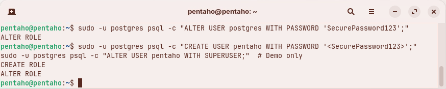<figcaption></figcaption></figure>

1. Set `postgres` password:

```bash
sudo -u postgres psql -c "ALTER USER postgres WITH PASSWORD 'SecurePassword123';"
```

2. Create a `pentaho` user and grant `SUPERUSER` privileges:

```sql
sudo -u postgres psql -c "CREATE USER pentaho WITH PASSWORD 'SecurePassword123';"
sudo -u postgres psql -c "ALTER USER pentaho WITH SUPERUSER;" # Demo only
```

> **Note:** * `sudo -u postgres` - Run the command as the Linux system user `postgres` (who has local access to PostgreSQL without a password)
> * `psql -c` - Execute a single SQL command and exit
> * `CREATE USER pentaho` - Creates a new PostgreSQL role/user named `pentaho`
> * `WITH PASSWORD 'SecurePassword123'` - Sets the password for this user
> 
> ***
> 
> * `ALTER USER pentaho` - Modifies the existing `pentaho` user
> * `WITH SUPERUSER` - Grants full superuser privileges (can do anything: create databases, create users, bypass all permissions, etc.)
> * `# Demo only` - **Warning comment** indicating this is dangerous for production

3. Test connection as `pentaho`:

```bash
sudo -u pentaho psql -d postgres -c "\conninfo"
```

**Step 7.** **Optional: Allow remote connections**

> **Note:** <mark style="color:green;">For reference only as connecting to Postgresql via localhost</mark>
> 
> By default, PostgreSQL accepts only local connections. For localhost setups, you do not need this step.

1. Back up configs and edit `postgresql.conf` (PostgreSQL 17):

```bash
sudo cp /etc/postgresql/17/main/postgresql.conf{,.bak}
sudo nano /etc/postgresql/17/main/postgresql.conf
```

2. Set: `listen_addresses = '*'` (a specific interface/IP in production)

<figure>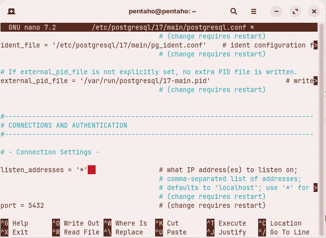<figcaption><p>Set listener</p></figcaption></figure>

3. Save:

```
Ctrl + o
Enter
Ctrl + x
```

**Step 8.** **Configure pg\_hba.conf**

> **Note:** The **pg\_hba.conf** file (PostgreSQL Host-Based Authentication configuration) controls who can connect to your PostgreSQL database and how they authenticate. You configure it during installation to define security rules for database access.
> 
> In production you would modify the settings to only allow the required users access to the databases on Server IPs.

1. Configure PostgreSQL to use md5 password authentication `pg_hba.conf` .

```bash
sudo cp /etc/postgresql/17/main/pg_hba.conf{,.bak}
sudo nano /etc/postgresql/17/main/pg_hba.conf
```

2. Manually edit the file:

<figure>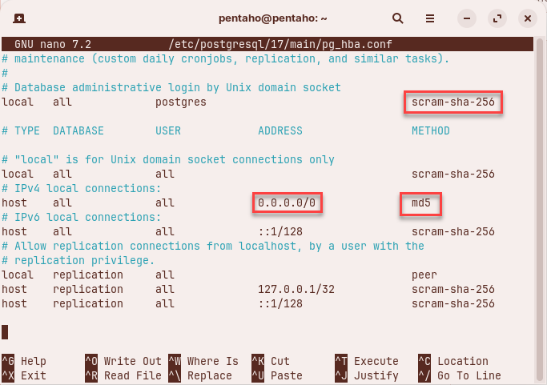<figcaption></figcaption></figure>

<mark style="color:$primary;">Or</mark>

2. Run the following script.&#x20;

```bash
# Use the exact path
PG_HBA_PATH=/etc/postgresql/17/main/pg_hba.conf

# Verify the file exists
ls -la "$PG_HBA_PATH"

# If that works, then run:
sudo cp "$PG_HBA_PATH" "${PG_HBA_PATH}.backup"
sudo sed -i 's/^local[[:space:]]\+all[[:space:]]\+postgres[[:space:]]\+peer$/local   all             postgres                                scram-sha-256/' "$PG_HBA_PATH"
sudo sed -i 's/^local[[:space:]]\+all[[:space:]]\+all[[:space:]]\+peer$/local   all             all                                     scram-sha-256/' "$PG_HBA_PATH"
sudo sed -i '0,/^host[[:space:]]\+all[[:space:]]\+all[[:space:]]\+127\.0\.0\.1\/32[[:space:]]\+scram-sha-256$/s//host    all             all             0.0.0.0\/0               md5/' "$PG_HBA_PATH"

# Verify
sudo cat "$PG_HBA_PATH" | grep -E "^(local|host)[[:space:]]+(all|replication)"
```

<figure>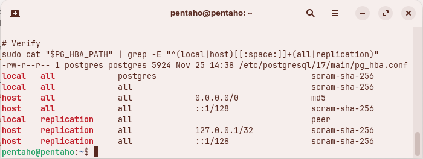<figcaption><p>SED: pg_hba.conf</p></figcaption></figure>

> **Note:** Prefer `scram-sha-256` over `md5` in `pg_hba.conf` for stronger password hashing on modern PostgreSQL versions.
> 
> Ensure your JDBC driver supports SCRAM (e.g., recent PostgreSQL drivers). If compatibility issues arise, use `md5` as a fallback.

3. Restart the PostgreSQL service.

```bash
cd
systemctl restart postgresql
# Password: password
```

4. Allow firewall (if enabled) and restart:

```bash
sudo ufw allow 5432/tcp || true
sudo systemctl restart postgresql
sudo ss -ltnp | grep 5432
```

**Step 9.** **Install pgAdmin 4 (desktop)**

Install the pgAdmin 4 desktop client using the official repository.

1. Add repo and key:

```bash
sudo install -d -m 0755 /etc/apt/keyrings
curl -fsS https://www.pgadmin.org/static/packages_pgadmin_org.pub | gpg --dearmor | sudo tee /etc/apt/keyrings/packages-pgadmin-org.gpg > /dev/null
source /etc/os-release
echo "deb [signed-by=/etc/apt/keyrings/packages-pgadmin-org.gpg] https://ftp.postgresql.org/pub/pgadmin/pgadmin4/apt/${UBUNTU_CODENAME} pgadmin4 main" | sudo tee /etc/apt/sources.list.d/pgadmin4.list
```

2. Install pgAdmin 4 (desktop):

```bash
sudo apt update -y && sudo apt upgrade -y
sudo apt install -y pgadmin4-desktop
```

3. Optional: verify repo entry

```bash
cat /etc/apt/sources.list.d/pgadmin4.list
```

4. Add a server connection in pgAdmin:

* Right‑click Servers → Register → Server
* Name: `Pentaho`
* Connection: host, port `5432`, user `pentaho`, password `SecurePassword123` (do not save in production)

<figure>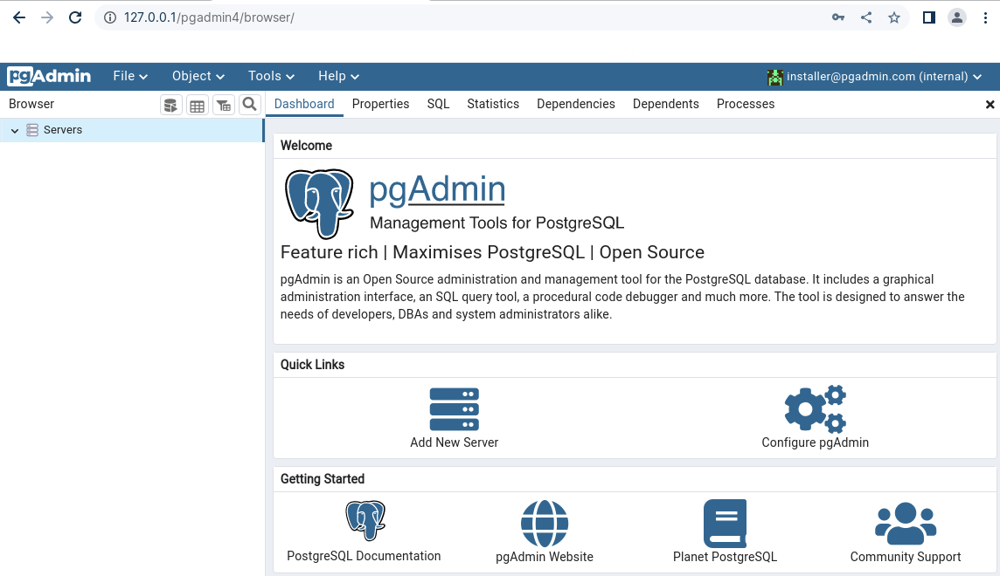<figcaption><p>Create server group</p></figcaption></figure>

<figure>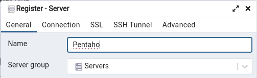<figcaption><p>Server group</p></figcaption></figure>

<figure>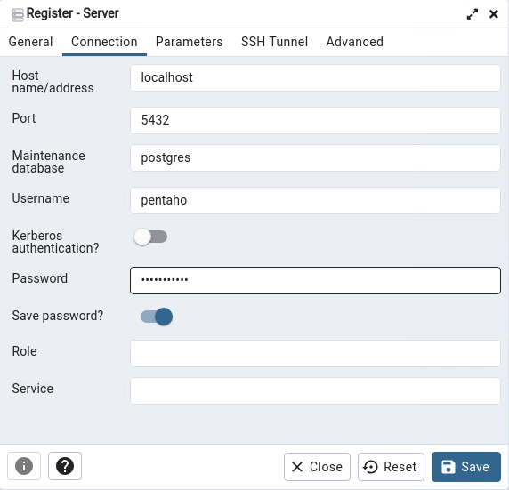<figcaption><p>Connection details</p></figcaption></figure>

> **Danger:** Do not save passwords in production. Prefer OS‑level keyrings or secure vaults.

<figure>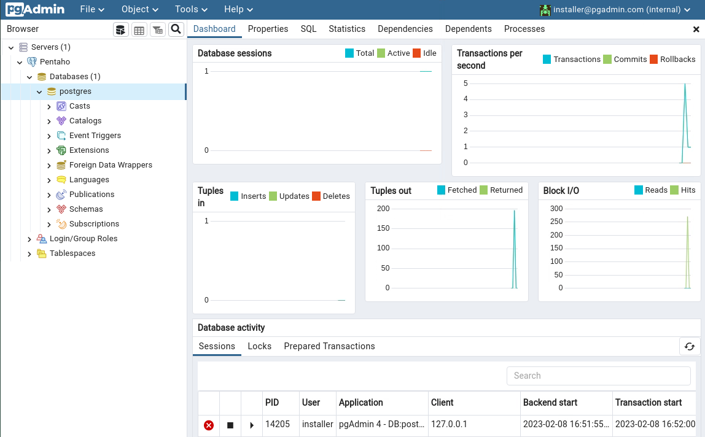<figcaption><p>pgAdmin 4 UI</p></figcaption></figure>

**Step 10.** **Validate the environment**

1. Quick checks to confirm everything is ready for the next step.

```bash
# Java
java -version
[ "$PENTAHO_JAVA_HOME" = "/usr/lib/jvm/java-21-openjdk-amd64" ] && echo OK || echo "Check PENTAHO_JAVA_HOME"

# PostgreSQL
sudo -u postgres psql -c "SELECT version();"
sudo systemctl status postgresql --no-pager | sed -n '1,5p'

```

<figure>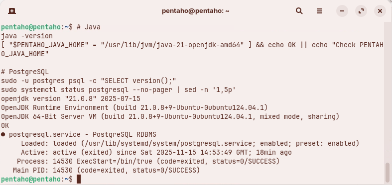<figcaption><p>Validate PostgreSQL 17 service ..</p></figcaption></figure>

***
