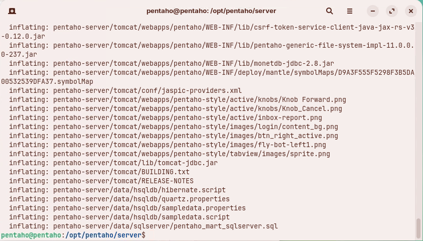
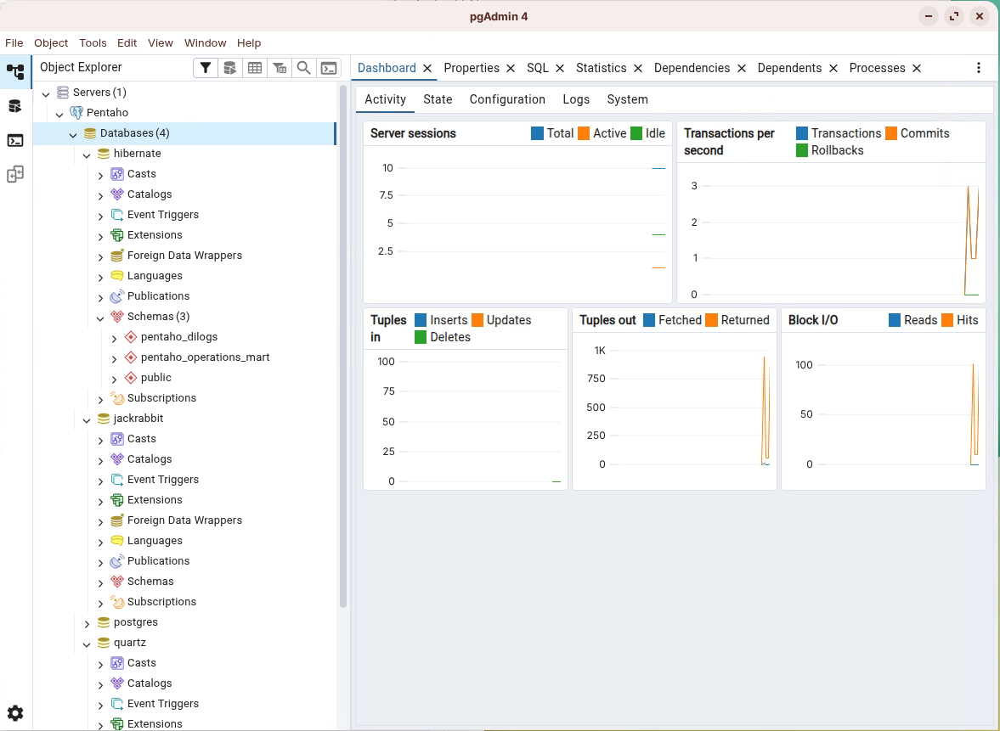
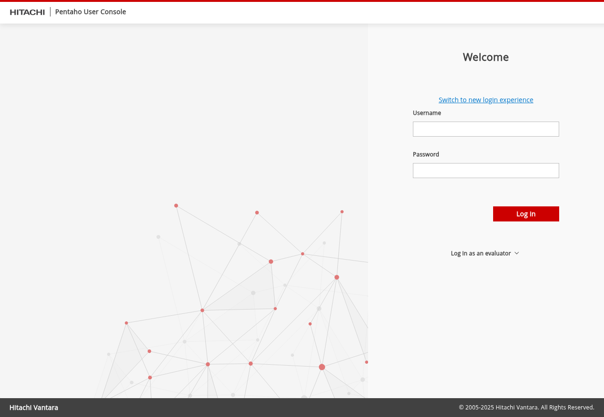
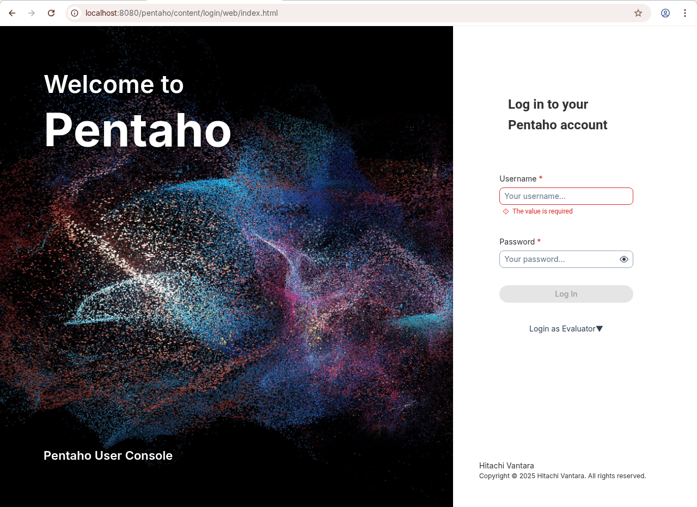
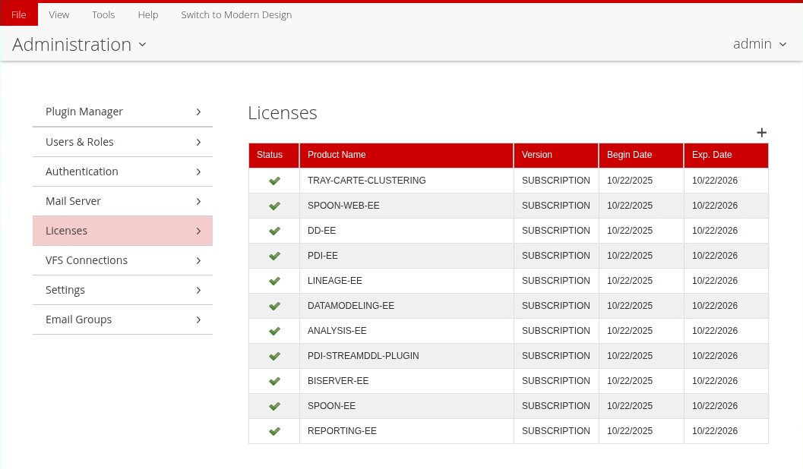
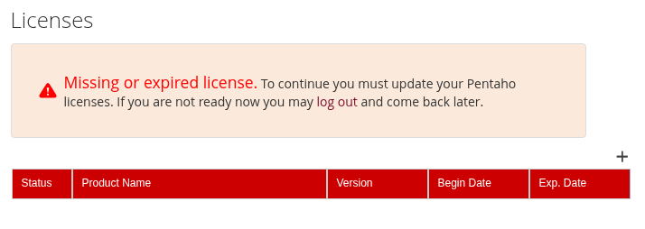
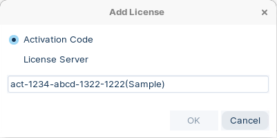

# Install Pentaho Server

> **Note:**
>
> #### Pentaho Server
> 
> This section guides you through installing and starting the Pentaho Server on Ubuntu.
> 
> You will:
> 
> * Create installation directories
> * Prepare the Pentaho Repository databases
> * Configure JDBC/JNDI connections
> * Start the Pentaho Server (and optionally set up systemd)
> * Configure the License Manager

> **Warning:** Tested baseline: Ubuntu 24.04 LTS with Java 21 (OpenJDK) and PostgreSQL 17.
> 
> Make sure you have completed [Prepare Environment](/pentaho-11-installation-en/installation/archive-installation/prepare-environment.md) first.&#x20;
> 
> For compatibility details, see [Components Reference](https://docs.pentaho.com/install/components-reference).

> **Note:** **Prerequisites**
> 
> * Ubuntu 24.04 LTS server
> * Java 21 installed and `PENTAHO_JAVA_HOME` set
> * PostgreSQL 17 installed and running
> * A non‑root `pentaho` user with sudo
> * `unzip` package installed
> * Archive ZIPs and JDBC drivers downloaded

<figure><figcaption><p>Pentaho Pro Suite</p></figcaption></figure>

:::: tabs

### 1. Pentaho Server

> **Note:**
>
> #### **Pentaho Server Directories**
> 
> The Pentaho Server is a web application running in a Apache Tomcat servlet container.

1. Create base directories under `/opt/pentaho`.

```bash
cd
sudo mkdir -p /opt/pentaho/{server,software}
```

```
/opt/pentaho
├── server      # Unpacked server runtime (tomcat, pentaho-solutions, scripts)
└── software    # Installers, ZIPs, drivers (staging area)
```

2. Create sub-directories in `/opt/pentaho/software`.

```bash
cd /opt/pentaho/software
sudo mkdir -p {db-drivers,docker,ee-client,ee-plugins,ops-mart,sdk,server,shims}
```

```
db-drivers   - JDBC drivers
docker       - Pentaho on-prem config & dockerfiles
ee-client    - Pentaho EE client plugins
ee-plugins   - Pentaho EE server plugins
ops-mart     - Operations Mart scripts
sdk          - Pentaho SDK kit
server       - Pentaho server
shims        - Hadoop shims collections
```

***

> **Note:** **Unpack Pentaho Server Package (ZIP)**
> 
> Use `unzip` to extract the server ZIP into the runtime directory. This avoids requiring the full JDK (the JRE does not include the `jar` tool).
> 
> * `pentaho-server-ee-11.0.0.0-2xx.zip` - Pentaho Server (Archive - incl Tomcat 10)

1. Ensure `unzip` is available and copy the server ZIPs into staging.

```bash
cd
sudo apt update -y && sudo apt install -y unzip
sudo cp ~/Downloads/'Archive Build (Suggested Installation Method)'/* /opt/pentaho/software/server
```

2. Extract the Pentaho Server ZIP into `$PENTAHO_BASE/server`.

```bash
cd
cd "$PENTAHO_BASE/server"

# Replace <version> with the exact file name you downloaded
sudo unzip /opt/pentaho/software/server/pentaho-server-ee-11.0.0.0-2xx.zip
```

<figure><figcaption><p>Unzip Pentaho Server</p></figcaption></figure>

3. Make all `.sh` files executable.

```bash
cd
cd "$PENTAHO_BASE/server"
sudo find . -iname "*.sh" -exec chmod +x {} \;
```

4. Set ownership and sensible permissions to run 'pentaho' as a non-root user.

```bash
cd
sudo chown -R pentaho:pentaho /opt/pentaho
sudo find /opt/pentaho -type d -exec chmod 755 {} \;
sudo find /opt/pentaho -type f -exec chmod 644 {} \;
sudo find /opt/pentaho -name "*.sh" -exec chmod 755 {} \;
```

> **Note:** 755 means you can do anything with the file or directory, and other users can read and execute it but not alter it. Suitable for programs and directories you want to make publicly available.&#x20;
> 
> 644 means you can read and write the file or directory and other users can only read it.

5. Verify the server directory structure.

> **Note:** /opt/pentaho/
> 
> ```
>   server/
>     pentaho-server/
>       pentaho-solutions/
>         system/
> ```
> 
> Server plugins are installed into the `pentaho-solutions/system` folder.

### 2. Pentaho Repository

> **Note:**
>
> #### **Pentaho Repository components**
> 
> The Pentaho Repository (on PostgreSQL by default) consists of:
> 
> * Jackrabbit: solution repository, security and content metadata
> * Quartz: scheduler data
> * Hibernate: audit logging
> * Pentaho Operations Mart: usage and performance reporting

**Step 1.** **Review default passwords in SQL scripts**

1. Inspect the PostgreSQL scripts shipped with the server.

```bash
cd
cd "$PENTAHO_SERVER/data/postgresql"
ls -1
```

You should see files similar to:

```
alter_script_postgresql_BISERVER-13674.sql
create_jcr_postgresql.sql
create_quartz_postgresql.sql
create_repository_postgresql.sql
migrate_old_quartz_data_postgresql.sql
pentaho_logging_postgresql.sql
pentaho_mart_drop_postgresql.sql
pentaho_mart_postgresql.sql
pentaho_mart_upgrade_audit_postgresql.sql
pentaho_mart_upgrade_postgresql.sql

```

2. Open a script to review default users/passwords (change for production).

```bash
sed -n '1,120p' create_jcr_postgresql.sql
```

> **Danger:** Production guidance: use unique, strong passwords, rotate them regularly, store them in a secure vault, and never commit secrets to source control.
> 
> Do not keep workshop password defaults in production.

**Step 2.** **Run SQL scripts to create Repository databases**

1. Confirm PostgreSQL is running and locate the scripts.

```bash
sudo systemctl status postgresql --no-pager
cd
cd "$PENTAHO_SERVER/data/postgresql"
ls -l
```

2. Connect as a `pentaho` superuser.

&#x20;      Password: `SecurePassword123`

```bash
sudo -u pentaho psql -d postgres
```

3. Execute the commands step-by-step - not as a single script block. Provide passwords if prompted - see below.

```plsql
\i create_jcr_postgresql.sql
\i create_quartz_postgresql.sql
\q quit after Quartz and log back in ..
ensure your in the "$PENTAHO_SERVER/data/postgresql" directory
sudo -u pentaho psql -d postgres
\i create_repository_postgresql.sql
\i pentaho_mart_postgresql.sql
\q quit after hibernate and log back in ..
ensure your in the "$PENTAHO_SERVER/data/postgresql" directory
sudo -u pentaho psql -d postgres
\i pentaho_logging_postgresql.sql
\q
```

| User          | Password          |
| ------------- | ----------------- |
| postgres      | SecurePassword123 |
| pentaho       | SecurePassword123 |
| jcr\_user     | password          |
| pentaho\_user | password          |
| hibuser       | password          |

4. Quick validation (CLI) - list created databases and connect - hit q to scroll through list.

```sql
\l+ jackrabbit
\l+ quartz
\l+ hibuser
\l+ opsmart
\c jackrabbit
\dt
\c quartz
\dt
```

> **Warning:** Tables for Hibernate and Jackrabbit may be created later by the Pentaho Server on first start. Seeing empty schemas at this stage can be expected.

5. Optional: verify in pgAdmin (GUI).

<figure><figcaption><p>Pentaho databases</p></figcaption></figure>

**Step 3.** **Configure Pentaho to use PostgreSQL**

> **Note:** PostgreSQL is the default. If you kept the default passwords and port (`5432`), only verify the settings below; otherwise, adjust host/port/user/password to match your environment.

***

> **Note:** Quartz - set PostgreSQL delegate and JNDI data source.

1. Open the Quartz configuration.

```bash
cd "$PENTAHO_SERVER/pentaho-solutions/system/scheduler-plugin/quartz"
sudo nano -c quartz.properties
```

2. Check these values (line numbers may differ):

**quartz.properties — required entries**

```
org.quartz.jobStore.driverDelegateClass=org.quartz.impl.jdbcjobstore.PostgreSQLDelegate
org.quartz.dataSource.myDS.jndiURL=Quartz
```

***

> **Note:** Hibernate — point to the PostgreSQL configuration file.

1. Open Hibernate settings.

```bash
cd "$PENTAHO_SERVER/pentaho-solutions/system/hibernate"
sudo nano -c hibernate-settings.xml
```

2. Confirm the config file reference:

**hibernate-settings.xml**

```
<config-file>system/hibernate/postgresql.hibernate.cfg.xml</config-file>
```

3. Optionally review `postgresql.hibernate.cfg.xml` for datasource name and dialect.

```bash
sudo nano -c postgresql.hibernate.cfg.xml
```

Ensure:

**postgresql.hibernate.cfg.xml — key properties**

```
<property name="connection.driver_class">org.postgresql.Driver</property>
<property name="dialect">org.hibernate.dialect.PostgreSQLDialect</property>
<property name="hibernate.connection.datasource">java:comp/env/jdbc/Hibernate</property>
```

***

> **Note:** Jackrabbit — verify PostgreSQL storage in `repository.xml`.

1. Open Jackrabbit configuration.

```bash
cd "$PENTAHO_SERVER/pentaho-solutions/system/jackrabbit"
sudo nano -c repository.xml
```

2. Check that PostgreSQL sections are active (others commented out), for example:

> **Note:** * Filesystem schema: `postgresql`
> * Datastore `databaseType="postgresql"`
> * PersistenceManager schema: `postgresql`
> * Database Journal: `postgresql`

> **Warning:** Cross‑check JNDI names and ports across Quartz, Hibernate, Jackrabbit, and Tomcat `context.xml` to ensure consistency (same host, port 5432 unless changed, and matching JNDI resource names).
> 
> Expected JNDI names:
> 
> * Quartz: `Quartz`
> * Hibernate: `java:comp/env/jdbc/Hibernate`
> * Jackrabbit: as referenced in `repository.xml`

### 3. Tomcat

> **Note:**
>
> #### **Tomcat**
> 
> After configuring the Repository, configure the web application server (Tomcat 10) to connect to the Repository using JDBC/JNDI.

::: tabs

### 1. Database Drivers

> **Warning:**
>
> #### **JDBC Drivers**
> 
> To connect to databases (including the Repository), install the appropriate JDBC drivers. Due to licensing restrictions, some drivers must be downloaded manually.

<div class="pcm-embed-card" data-href="https://docs.pentaho.com/install/jdbc-drivers-reference" data-title="docs.pentaho.com"></div>

<div class="pcm-embed-card" data-href="https://jdbc.postgresql.org/download/postgresql-42.7.8.jar" data-title="jdbc.postgresql.org"></div>

1. Verify the PostgreSQL JDBC driver is present in Tomcat lib (required for the Repository):

```bash
ls -1 "$TOMCAT_HOME/lib" | grep -i postgresql || echo "PostgreSQL driver not found"
```

> **Note:** If not found, download the PostgreSQL JDBC driver (e.g., `postgresql-42.7.8.jar`) and distribute it using the helper script:

```bash
sudo cp ~/Downloads/'Database Drivers'/postgresql-*.jar /opt/pentaho/server/jdbc-distribution
cd /opt/pentaho/server/jdbc-distribution
sudo ./distribute-files.sh "$TOMCAT_HOME/lib"
```

2. Copy any additional JDBC drivers to the staging folder and distribute.

```bash
sudo cp ~/Downloads/'Database Drivers'/* /opt/pentaho/software/db-drivers
cd /opt/pentaho/software/db-drivers
sudo cp mysql-connector-j-9.0.0.jar /opt/pentaho/server/jdbc-distribution
```

3. Distribute the drivers to Tomcat.

```bash
cd /opt/pentaho/server/jdbc-distribution
sudo ./distribute-files.sh "$TOMCAT_HOME/lib"
```

4. Verify the JARs are present in Tomcat lib.

```bash
ls -1 "$TOMCAT_HOME/lib" | grep -Ei 'mysql|postgresql' || echo "Not found"
```

> **Danger:** You must restart the Pentaho Server (and client tools, if running) to load new JDBC drivers. A full system reboot is not required.

### 2. context.xml

> **Note:**
>
> #### **context.xml**
> 
> Database connection information for JNDI resources used by Pentaho is stored in `context.xml`.

1. Open the file and review JNDI resources and credentials.

```bash
cd "$TOMCAT_HOME/webapps/pentaho/META-INF"
sudo nano -c context.xml
```

> **Warning:** In production, verify username, password, driver class, host/IP, and port match your environment. Ensure JNDI names align with Quartz, Hibernate, and Jackrabbit configurations.

:::

### 4. Start Server

> **Note:**
>
> #### **Start Pentaho Server**
> 
> Run the server as the `pentaho` user to avoid permission issues.

1. Start the server.

```bash
cd
cd "$PENTAHO_SERVER"
./start-pentaho.sh
```

2. Tail the Tomcat log (robust pattern).

```bash
tail -f "$TOMCAT_HOME/logs/catalina."*.log
```

Expected messages include:

```
... Starting ProtocolHandler ["http-nio-8080"]
... Server startup in [xxxxx] milliseconds
```

***

> **Note:** **Pentaho User Console (PUC)**
> 
> The Pentaho User Console (PUC) is the web UI for creating and viewing content.

<div class="pcm-embed-card" data-href="http://localhost:8080/pentaho" data-title="localhost"></div>

Default credentials (change immediately after first login):

```
Username: admin
Password: password
```

<figure><figcaption><p>Pentaho User Console</p></figcaption></figure>

3. You also have the option to switch to the new login screen.

<div class="pcm-embed-card" data-href="http://localhost:8080/pentaho/content/login/web/index.html" data-title="localhost"></div>

<figure><figcaption><p>NEW - Pentaho User Console</p></figcaption></figure>

> **Note:** If you have already entered your licensing details, then you will be redirected to the new User Console.

***

> **Success:** **Quick validations**

* Check HTTP is responding:

```bash
curl -I http://localhost:8080/pentaho/ | head -n 1
```

* Optional (remote access): open firewall and test from a client machine (adjust to your network policy):

```bash
sudo ufw allow 8080/tcp || true
```

***

<details>

<summary>Validate Repository after first run (click to expand)</summary>

```sql
-- Quartz example
\c quartz
SELECT COUNT(*) FROM qrtz_scheduler_state;

-- Hibernate example (expect many tables after first start)
\c hibuser
\dt
```

</details>

***

> **Note:** **Systemd (optional)**
> 
> Create a systemd service to manage Pentaho at boot and on failure.

1. Save the unit file as `/etc/systemd/system/pentaho-server.service`.

**/etc/systemd/system/pentaho-server.service**

```ini
[Unit]
Description=Pentaho Server
After=network-online.target
Wants=network-online.target

[Service]
Type=forking
User=pentaho
Group=pentaho
EnvironmentFile=-/etc/environment
# Optional fallback if not using PENTAHO_JAVA_HOME in /etc/environment
# Environment="JAVA_HOME=/usr/lib/jvm/java-21-openjdk-amd64"
WorkingDirectory=/opt/pentaho/server/pentaho-server
ExecStart=/opt/pentaho/server/pentaho-server/start-pentaho.sh
ExecStop=/opt/pentaho/server/pentaho-server/stop-pentaho.sh
TimeoutSec=500
Restart=on-failure
RestartSec=5
SuccessExitStatus=5 6
LimitNOFILE=65535

[Install]
WantedBy=multi-user.target
```

2. Reload and start.

```bash
sudo systemctl daemon-reload
sudo systemctl start pentaho-server
sudo systemctl enable pentaho-server
```

Manage the service:

```bash
sudo systemctl status pentaho-server
sudo systemctl restart pentaho-server
sudo systemctl stop pentaho-server
```

***

<details>

<summary>Troubleshooting (click to expand)</summary>

* HTTP 404 on `/pentaho` after startup: confirm `"$TOMCAT_HOME/webapps/pentaho"` exists, check `catalina.*.log` for deployment errors, and verify file permissions under `$PENTAHO_SERVER`.
* Port 8080 already in use: change Tomcat port in `server.xml` or stop the conflicting service.
* JDBC driver not found: verify the driver JARs (e.g., `postgresql-*.jar`, `mysql-*.jar`) exist in `"$TOMCAT_HOME/lib"`.
* Authentication to PostgreSQL fails: prefer `scram-sha-256`; review `pg_hba.conf`, restart PostgreSQL, and test `psql -h 127.0.0.1` with the target user.
* Jackrabbit schema issues: re-check `repository.xml` sections are set to `postgresql`.
* License activation errors: check Tomcat logs in `tomcat/logs/` for `license`/`elm` messages.

</details>

***

### 5. License Manager

> **Note:**
>
> #### **Licensing Manager**
> 
> Pentaho Pro Suite 11.x uses a License Manager (cloud or local) to manage PDI & BA entitlements and verify EE plugins.

<figure><figcaption><p>Licenses</p></figcaption></figure>

::: tabs

### License Manager

> **Note:**
>
> #### **Trial license**
> 
> A 30-day trial license is included if you have downloaded from:  [Pentaho 30-day Trial](https://pentaho.com/download/)
> 
> If you have dowwnloaded the GA binaries from: [Pentaho Customer Portal](https://support.pentaho.com/hc/en-us), then you will require an Activation ID or your LIcensing URL.
> 
> If you have installed in an air-gapped envirnoment, you will need to request an offline license.

1. Launch Pentaho Server > Administration > Licenses to open the Add License dialog.
2. Click the + sign.

<figure><figcaption><p>Add license</p></figcaption></figure>

5. Enter Activation code or your licensing URL:

<figure><figcaption><p>License Manager</p></figcaption></figure>

> **Warning:** **Enterprise licenses**
> 
> If upgrading from 9.x or earlier, install the new product version before activating licenses. Do not start the server before upgrading the licenses.

### Set ENV License Path

> **Note:** **Set license path environment variable**
> 
> Create a `PENTAHO_LICENSE_INFORMATION_PATH` environment variable so the Pentaho Server consistently finds your license file.

1. Ensure the target directory exists and is secured.

```bash
sudo -u pentaho mkdir -p /home/pentaho/.pentaho
sudo chown -R pentaho:pentaho /home/pentaho/.pentaho
chmod 700 /home/pentaho/.pentaho
```

2. Edit `/etc/environment` and add the line below (no `export`).

```bash
sudo nano /etc/environment
```

Append (or update) the following:

```
PENTAHO_LICENSE_INFORMATION_PATH=/home/pentaho/.pentaho/.elmLicInfo.plt
```

3. Log out/log in or reload the environment and verify.

```bash
source /etc/environment
env | grep PENTAHO_LICENSE_INFORMATION_PATH
```

The `PENTAHO_LICENSE_INFORMATION_PATH` variable is now set.

:::

::::

