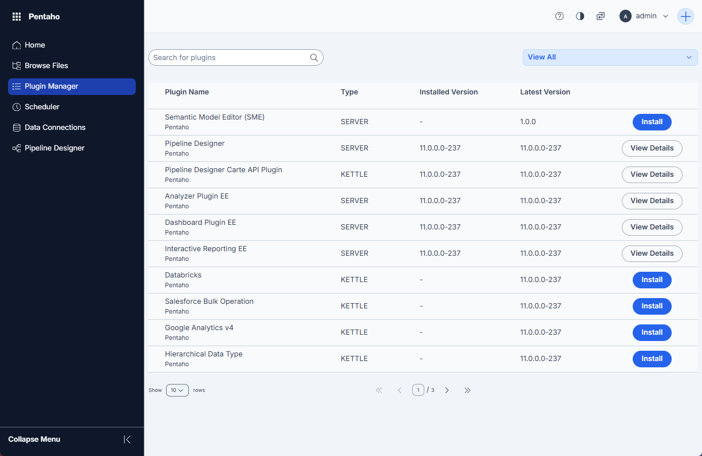
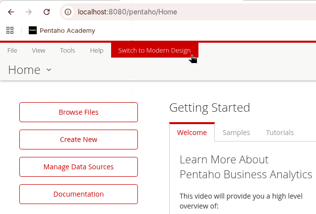

# Server Plugins

> **Note:**
>
> #### Plugin Manager
> 
> To make deployment of the Pentaho Server plugins easier there's a modern PUC with a built-in Plugin Manager.&#x20;
> 
> From the Plugin Manager UI you can now manage your plugin lifecycle:
> 
> * Update Available - check for updates
> * Installed - list installed plugins
> * Not Installed - list plugins not installed
> 
> for both Server and Client side EE plugins.

***

1. Log in:

**🎥 Embed:** [View external resource](<https://localhost:8080/pentaho/content/login/web/index.html>)

2. Select Plugin Manager.

<figure><figcaption>
Plugin Manager
</figcaption></figure>

Or

1. Log in & Switch to Modern Design.

<figure><figcaption>
Switch to Modern Design
</figcaption></figure>

<div class="pcm-tabs-widget" data-tabs="%5B%7B%22title%22%3A%221.%20Plugin%20Manager%22%2C%22body%22%3A%22%3E%20**Note%3A**%5Cn%3E%5Cn%3E%20%23%23%23%23%20**NEW%20-%20Pentaho%20User%20Console**%5Cn%3E%20%5Cn%3E%20The%20left%20panel%20displays%20the%20main%20navigation%20options%20including%20Home%20(currently%20active)%2C%20Browse%20Files%2C%20Plugin%20Manager%2C%20Scheduler%2C%20Data%20Connections%2C%20Settings%2C%20Semantic%20Model%20Editor%2C%20and%20Pipeline%20Designer.%5Cn%3E%20%5Cn%3E%20The%20Home%20page%20features%20a%20Quick%20Access%20section%20with%20four%20tiles%3A%20Data%20Sources%20for%20managing%20project%20data%20sources%2C%20Browse%20Files%20for%20exploring%20files%20to%20use%20with%20Pentaho%2C%20Semantic%20Model%20Editor%20for%20viewing%20or%20creating%20semantic%20models%2C%20and%20Pipeline%20Designer%20for%20creating%20transformations%20and%20jobs%20in%20the%20new%20web-based%20editor.%5Cn%3E%20%5Cn%3E%20At%20the%20bottom%2C%20the%20Recently%20Opened%20section%20displays%20two%20.ktr%20files%E2%80%94tr%5C%5C_write%5C%5C_output%20and%20tr%5C%5C_hello%5C%5C_world%20(marked%20as%20favorite)%20-%20both%20last%20modified%20on%20December%2012%2C%202025%2C%20and%20owned%20by%20the%20admin%20user.%5Cn%5Cn%3Cfigure%3E%3Cimg%20src%3D%5C%22..%2F_assets%2Fimages%2Fpentaho_user_console_new.png%5C%22%20alt%3D%5C%22%5C%22%3E%3Cfigcaption%3E%3Cp%3ENEW%20-%20Pentaho%20User%20Console%3C%2Fp%3E%3C%2Ffigcaption%3E%3C%2Ffigure%3E%5Cn%5Cn%5Cn%5Cn%3Cdiv%20class%3D%5C%22pcm-tabs-widget%5C%22%20data-tabs%3D%5C%22%255B%257B%2522title%2522%253A%2522Analytic%2520Plugins%2522%252C%2522body%2522%253A%2522%253E%2520**Note%253A**%255Cn%253E%255Cn%253E%2520%2523%2523%2523%2523%2520Analytic%2520Plugins%255Cn%253E%2520%255Cn%253E%2520Plugin%2520Manager%2520-%2520The%2520recommended%2520method%2520for%2520managing%2520the%2520lifecycle%2520of%2520your%2520plugins.%255Cn%255Cn%255Cn%255Cn%253Cdiv%2520class%253D%255C%2522pcm-tabs-widget%255C%2522%2520data-tabs%253D%255C%2522%25255B%25257B%252522title%252522%25253A%2525221.%252520Analyzer%252522%25252C%252522body%252522%25253A%252522%25253E%252520**Note%25253A**%25255Cn%25253E%25255Cn%25253E%252520%252523%252523%252523%252523%252520**Analyzer**%25255Cn%25253E%252520%25255Cn%25253E%252520Pentaho%252520Analyzer%252520is%252520a%252520web-based%252520business%252520intelligence%252520tool%252520that's%252520part%252520of%252520the%252520Pentaho%252520Business%252520Analytics%252520platform.%252520It%252520provides%252520an%252520interactive%25252C%252520drag-and-drop%252520interface%252520for%252520analyzing%252520data%252520and%252520creating%252520visualizations%252520without%252520requiring%252520SQL%252520or%252520technical%252520coding%252520knowledge.%25255Cn%25253E%252520%25255Cn%25253E%252520The%252520tool%252520allows%252520users%252520to%252520explore%252520data%252520through%252520OLAP%252520(Online%252520Analytical%252520Processing)%252520cubes%25252C%252520enabling%252520multidimensional%252520analysis%252520with%252520features%252520like%252520drill-down%25252C%252520slice-and-dice%25252C%252520and%252520pivot%252520operations.%252520Users%252520can%252520quickly%252520create%252520charts%25252C%252520graphs%25252C%252520and%252520reports%252520by%252520dragging%252520dimensions%252520and%252520measures%252520onto%252520a%252520canvas%25252C%252520making%252520it%252520accessible%252520for%252520business%252520users%252520who%252520need%252520to%252520perform%252520ad-hoc%252520analysis.%25255Cn%25253E%252520%25255Cn%25253E%252520Pentaho%252520Analyzer%252520supports%252520various%252520visualization%252520types%252520including%252520bar%252520charts%25252C%252520line%252520graphs%25252C%252520pie%252520charts%25252C%252520and%252520heat%252520grids%25252C%252520and%252520integrates%252520with%252520the%252520broader%252520Pentaho%252520platform%252520for%252520sharing%252520reports%252520and%252520embedding%252520analytics%252520into%252520dashboards.%252520It's%252520particularly%252520useful%252520for%252520organizations%252520that%252520want%252520to%252520empower%252520business%252520users%252520to%252520independently%252520explore%252520and%252520visualize%252520their%252520data%252520warehouse%252520or%252520mart%252520information.%25255Cn%25255Cn1.%252520Select%25253A%252520Analyzer%25255Cn%25255Cn%25253Cfigure%25253E%25253Cimg%252520src%25253D%25255C%252522..%25252F_assets%25252Fimages%25252Fanalyzer.png%25255C%252522%252520alt%25253D%25255C%252522%25255C%252522%25253E%25253Cfigcaption%25253E%25253Cp%25253EAnalyzer%25253C%25252Fp%25253E%25253C%25252Ffigcaption%25253E%25253C%25252Ffigure%25253E%25255Cn%25255Cn2.%252520From%252520the%252520drop-down%252520box%25252C%252520select%252520%25253A%252520Version%25255Cn%25255Cn%25253Cfigure%25253E%25253Cimg%252520src%25253D%25255C%252522..%25252F_assets%25252Fimages%25252Fanalyzer_plugin.png%25255C%252522%252520alt%25253D%25255C%252522%25255C%252522%25253E%25253Cfigcaption%25253E%25253Cp%25253EAnalyzer%252520Plugin%25253C%25252Fp%25253E%25253C%25252Ffigcaption%25253E%25253C%25252Ffigure%25253E%25255Cn%25255Cn3.%252520Click%252520Install.%25255Cn4.%252520Optional%25253A%252520Verify%252520Analyzer%252520is%252520installed.%25255Cn%25255Cn%252560%252560%252560bash%25255Cn%25255B%252520-d%252520analyzer%252520%25255D%252520%252526%252526%252520echo%252520OK%252520%25257C%25257C%252520echo%252520%25255C%252522Analyzer%252520directory%252520missing%25255C%252522%25255Cn%252560%252560%252560%25255Cn%25255Cn5.%252520Restart%252520Pentaho%252520Server%252520and%252520verify%252520in%252520the%252520UI.%25255Cn%25255Cn%252560%252560%252560bash%25255Cncd%25255Cncd%252520%25255C%252522%252524PENTAHO_SERVER%25255C%252522%25255Cn.%25252Fstop-pentaho.sh%25255Cn%252560%252560%252560%25255Cn%25255Cn%252560%252560%252560bash%25255Cncd%25255Cncd%252520%25255C%252522%252524PENTAHO_SERVER%25255C%252522%25255Cn.%25252Fstart-pentaho.sh%25255Cn%252560%252560%252560%25255Cn%25255Cn%25253Cdiv%252520class%25253D%25255C%252522pcm-embed-card%25255C%252522%252520data-href%25253D%25255C%252522http%25253A%25252F%25252Flocalhost%25253A8080%25252Fpentaho%25255C%252522%252520data-title%25253D%25255C%252522localhost%25255C%252522%25253E%25253C%25252Fdiv%25253E%252522%25257D%25252C%25257B%252522title%252522%25253A%2525222.%252520Interactive%252520Reporting%252522%25252C%252522body%252522%25253A%252522%25253E%252520**Note%25253A**%25255Cn%25253E%25255Cn%25253E%252520%252523%252523%252523%252523%252520**Interactive%252520Reporting**%25255Cn%25253E%252520%25255Cn%25253E%252520Pentaho%252520Interactive%252520Reporting%252520(PIR)%252520is%252520a%252520web-based%252520ad-hoc%252520reporting%252520tool%252520within%252520the%252520Pentaho%252520Business%252520Analytics%252520platform%252520that%252520enables%252520users%252520to%252520create%252520and%252520customize%252520reports%252520through%252520an%252520intuitive%252520interface%252520without%252520requiring%252520technical%252520expertise.%25255Cn%25253E%252520%25255Cn%25253E%252520The%252520tool%252520provides%252520a%252520WYSIWYG%252520(What%252520You%252520See%252520Is%252520What%252520You%252520Get)%252520drag-and-drop%252520environment%252520where%252520users%252520can%252520build%252520reports%252520by%252520selecting%252520data%252520sources%25252C%252520adding%252520fields%25252C%252520applying%252520filters%25252C%252520and%252520formatting%252520output.%252520Unlike%252520traditional%252520report%252520design%252520tools%252520that%252520require%252520developer%252520skills%25252C%252520PIR%252520is%252520designed%252520for%252520business%252520users%252520who%252520need%252520to%252520quickly%252520generate%252520operational%252520reports%252520and%252520answer%252520specific%252520business%252520questions.%25255Cn%25253E%252520%25255Cn%25253E%252520Key%252520capabilities%252520include%252520the%252520ability%252520to%252520create%252520tabular%252520reports%252520with%252520grouping%25252C%252520sorting%25252C%252520filtering%25252C%252520and%252520calculated%252520fields.%252520Users%252520can%252520add%252520charts%25252C%252520apply%252520conditional%252520formatting%25252C%252520and%252520create%252520prompts%252520for%252520parameterized%252520reports.%252520The%252520tool%252520supports%252520various%252520output%252520formats%252520including%252520HTML%25252C%252520PDF%25252C%252520Excel%25252C%252520and%252520CSV%25252C%252520making%252520it%252520easy%252520to%252520distribute%252520reports%252520across%252520the%252520organization.%25255Cn%25253E%252520%25255Cn%25253E%252520PIR%252520connects%252520to%252520relational%252520databases%252520and%252520Pentaho%252520data%252520sources%25252C%252520allowing%252520users%252520to%252520work%252520with%252520live%252520data.%252520It's%252520particularly%252520valuable%252520for%252520organizations%252520that%252520want%252520to%252520democratize%252520reporting%252520capabilities%252520and%252520reduce%252520the%252520bottleneck%252520of%252520relying%252520solely%252520on%252520IT%252520or%252520developers%252520to%252520create%252520standard%252520operational%252520reports.%25255Cn%25255Cn1.%252520Select%25253A%252520Interactive%252520Reporting.%25255Cn%25255Cn%25253Cfigure%25253E%25253Cimg%252520src%25253D%25255C%252522..%25252F_assets%25252Fimages%25252Finteractive_reporting_step.png%25255C%252522%252520alt%25253D%25255C%252522%25255C%252522%25253E%25253Cfigcaption%25253E%25253Cp%25253EInteractive%252520Reporting%25253C%25252Fp%25253E%25253C%25252Ffigcaption%25253E%25253C%25252Ffigure%25253E%25255Cn%25255Cn%25253Cfigure%25253E%25253Cimg%252520src%25253D%25255C%252522..%25252F_assets%25252Fimages%25252Finteractive_reporting.png%25255C%252522%252520alt%25253D%25255C%252522%25255C%252522%25253E%25253Cfigcaption%25253E%25253Cp%25253EInteractive%252520Reporting%25253C%25252Fp%25253E%25253C%25252Ffigcaption%25253E%25253C%25252Ffigure%25253E%25255Cn%25255Cn2.%252520From%252520the%252520drop-down%252520box%25252C%252520select%252520%25253A%252520Version%25255Cn%25255Cn%25253Cfigure%25253E%25253Cimg%252520src%25253D%25255C%252522..%25252F_assets%25252Fimages%25252Finteractive_reporting_plugin.png%25255C%252522%252520alt%25253D%25255C%252522%25255C%252522%25253E%25253Cfigcaption%25253E%25253Cp%25253EInteractive%252520Reporting%252520Plugin%25253C%25252Fp%25253E%25253C%25252Ffigcaption%25253E%25253C%25252Ffigure%25253E%25255Cn%25255Cn2.%252520Click%252520Install.%25255Cn3.%252520Optional%25253A%252520Verify%252520Interactive%252520Reporting%252520is%252520installed.%25255Cn%25255Cn%252560%252560%252560bash%25255Cn%25255B%252520-d%252520pentaho-interactive%252520%25255D%252520%252526%252526%252520echo%252520OK%252520%25257C%25257C%252520echo%252520%25255C%252522Interactive%252520Reporting%252520directory%252520missing%25255C%252522%25255Cn%252560%252560%252560%25255Cn%25255Cn5.%252520Restart%252520Pentaho%252520Server%252520and%252520verify%252520in%252520the%252520UI.%25255Cn%25255Cn%252560%252560%252560bash%25255Cncd%25255Cncd%252520%25255C%252522%252524PENTAHO_SERVER%25255C%252522%25255Cn.%25252Fstop-pentaho.sh%25255Cn%252560%252560%252560%25255Cn%25255Cn%252560%252560%252560bash%25255Cncd%25255Cncd%252520%25255C%252522%252524PENTAHO_SERVER%25255C%252522%25255Cn.%25252Fstart-pentaho.sh%25255Cn%252560%252560%252560%25255Cn%25255Cn%25253Cdiv%252520class%25253D%25255C%252522pcm-embed-card%25255C%252522%252520data-href%25253D%25255C%252522http%25253A%25252F%25252Flocalhost%25253A8080%25252Fpentaho%25255C%252522%252520data-title%25253D%25255C%252522localhost%25255C%252522%25253E%25253C%25252Fdiv%25253E%252522%25257D%25252C%25257B%252522title%252522%25253A%2525223.%252520Dashboard%252520Designer%252522%25252C%252522body%252522%25253A%252522%25253E%252520**Note%25253A**%25255Cn%25253E%25255Cn%25253E%252520%252523%252523%252523%252523%252520**Dashboard%252520Designer**%25255Cn%25253E%252520%25255Cn%25253E%252520Pentaho%252520Dashboard%252520Designer%252520(also%252520known%252520as%252520CDE%252520-%252520Community%252520Dashboard%252520Editor%252520in%252520the%252520community%252520edition)%252520is%252520a%252520web-based%252520tool%252520for%252520creating%252520interactive%25252C%252520customizable%252520dashboards%252520within%252520the%252520Pentaho%252520Business%252520Analytics%252520platform.%25255Cn%25253E%252520%25255Cn%25253E%252520The%252520tool%252520provides%252520a%252520comprehensive%252520environment%252520for%252520building%252520dashboards%252520that%252520combine%252520multiple%252520visualizations%25252C%252520reports%25252C%252520and%252520interactive%252520components%252520into%252520a%252520single%252520unified%252520interface.%252520Users%252520can%252520create%252520dashboards%252520by%252520assembling%252520various%252520elements%252520including%252520charts%25252C%252520tables%25252C%252520filters%25252C%252520selectors%25252C%252520and%252520other%252520widgets%252520that%252520work%252520together%252520to%252520provide%252520a%252520complete%252520analytical%252520experience.%25255Cn%25253E%252520%25255Cn%25253E%252520Dashboard%252520Designer%252520uses%252520a%252520three-panel%252520approach%25253A%252520Layout%252520(for%252520defining%252520the%252520dashboard%252520structure%252520using%252520HTML%25252FCSS)%25252C%252520Components%252520(for%252520adding%252520data-driven%252520elements%252520like%252520charts%252520and%252520tables)%25252C%252520and%252520Data%252520Sources%252520(for%252520connecting%252520to%252520queries%252520and%252520data).%252520This%252520architecture%252520allows%252520for%252520significant%252520flexibility%252520and%252520customization%25252C%252520though%252520it%252520does%252520require%252520some%252520technical%252520knowledge%25252C%252520particularly%252520for%252520advanced%252520layouts%252520and%252520styling.%25255Cn%25253E%252520%25255Cn%25253E%252520Key%252520features%252520include%252520interactivity%252520through%252520parameter%252520passing%252520between%252520components%25252C%252520allowing%252520filters%252520and%252520selectors%252520to%252520dynamically%252520update%252520multiple%252520visualizations%252520simultaneously.%252520The%252520tool%252520supports%252520various%252520charting%252520libraries%252520(CCC%252520-%252520Community%252520Chart%252520Components%252520being%252520the%252520most%252520common)%25252C%252520and%252520can%252520integrate%252520content%252520from%252520other%252520Pentaho%252520tools%252520like%252520Analyzer%252520and%252520Interactive%252520Reporting.%25255Cn%25253E%252520%25255Cn%25253E%252520Pentaho%252520Dashboard%252520Designer%252520is%252520particularly%252520useful%252520for%252520creating%252520executive%252520dashboards%25252C%252520operational%252520monitoring%252520screens%25252C%252520and%252520analytical%252520applications%252520where%252520users%252520need%252520to%252520see%252520multiple%252520related%252520metrics%252520and%252520visualizations%252520in%252520context%25252C%252520with%252520the%252520ability%252520to%252520drill%252520down%252520and%252520filter%252520data%252520interactively.%25255Cn%25255Cn1.%252520Select%25253A%252520Dashboard%252520Designer.%25255Cn%25255Cn%25253Cfigure%25253E%25253Cimg%252520src%25253D%25255C%252522..%25252F_assets%25252Fimages%25252Fdashboard_designer.png%25255C%252522%252520alt%25253D%25255C%252522%25255C%252522%25253E%25253Cfigcaption%25253E%25253Cp%25253EDashboard%252520Designer%25253C%25252Fp%25253E%25253C%25252Ffigcaption%25253E%25253C%25252Ffigure%25253E%25255Cn%25255Cn2.%252520From%252520the%252520drop-down%252520box%25252C%252520select%252520%25253A%252520Version%25255Cn%25255Cn%25253Cfigure%25253E%25253Cimg%252520src%25253D%25255C%252522..%25252F_assets%25252Fimages%25252Fdashboard_designer_plugin.png%25255C%252522%252520alt%25253D%25255C%252522%25255C%252522%25253E%25253Cfigcaption%25253E%25253Cp%25253EDashboard%252520Designer%252520Plugin%25253C%25252Fp%25253E%25253C%25252Ffigcaption%25253E%25253C%25252Ffigure%25253E%25255Cn%25255Cn3.%252520Click%252520Install.%25255Cn4.%252520Optional%25253A%252520Verify%252520Dashboard%252520Designer%252520is%252520installed.%25255Cn%25255Cn%252560%252560%252560bash%25255Cn%25255B%252520-d%252520dashboards%252520%25255D%252520%252526%252526%252520echo%252520OK%252520%25257C%25257C%252520echo%252520%25255C%252522Dashboard%252520Designer%252520directory%252520missing%25255C%252522%25255Cn%252560%252560%252560%25255Cn%25255Cn5.%252520Restart%252520Pentaho%252520Server%252520and%252520verify%252520in%252520the%252520UI.%25255Cn%25255Cn%252560%252560%252560bash%25255Cncd%25255Cncd%252520%25255C%252522%252524PENTAHO_SERVER%25255C%252522%25255Cn.%25252Fstop-pentaho.sh%25255Cn%252560%252560%252560%25255Cn%25255Cn%252560%252560%252560bash%25255Cncd%25255Cncd%252520%25255C%252522%252524PENTAHO_SERVER%25255C%252522%25255Cn.%25252Fstart-pentaho.sh%25255Cn%252560%252560%252560%25255Cn%25255Cn%25253Cdiv%252520class%25253D%25255C%252522pcm-embed-card%25255C%252522%252520data-href%25253D%25255C%252522http%25253A%25252F%25252Flocalhost%25253A8080%25252Fpentaho%25255C%252522%252520data-title%25253D%25255C%252522localhost%25255C%252522%25253E%25253C%25252Fdiv%25253E%252522%25257D%25255D%255C%2522%253E%253C%252Fdiv%253E%2522%257D%252C%257B%2522title%2522%253A%2522NEW%2520Plugins%2522%252C%2522body%2522%253A%2522%253E%2520**Note%253A**%255Cn%253E%255Cn%253E%2520%2523%2523%2523%2523%2520Pentaho%252011%2520Server%2520Plugins%255Cn%255CnBrowse%2520the%2520various%2520plugins%253A%255Cn%255Cn%255Cn%255Cn%253Cdiv%2520class%253D%255C%2522pcm-tabs-widget%255C%2522%2520data-tabs%253D%255C%2522%25255B%25257B%252522title%252522%25253A%2525221.%252520Pipeline%252520Designer%252522%25252C%252522body%252522%25253A%252522%25253E%252520**Note%25253A**%25255Cn%25253E%25255Cn%25253E%252520%252523%252523%252523%252523%252520**Pipeline%252520Designer**%25255Cn%25253E%252520%25255Cn%25253E%252520The%252520**Pentaho%252520Pipeline%252520Designer**%252520is%252520a%252520visual%252520tool%252520that%252520lets%252520you%252520build%252520data%252520transformation%252520workflows%252520through%252520a%252520drag-and-drop%252520interface.%252520The%252520left%252520panel%252520contains%252520a%252520searchable%252520library%252520of%252520pre-built%252520components%252520(like%252520CSV%252520inputs%25252C%252520MongoDB%252520operations%25252C%252520data%252520generators)%25252C%252520the%252520center%252520canvas%252520is%252520where%252520you%252520visually%252520connect%252520these%252520components%252520into%252520a%252520flow%252520diagram%252520to%252520create%252520your%252520pipeline%25252C%252520and%252520the%252520bottom%252520logging%252520console%252520shows%252520real-time%252520execution%252520details%252520and%252520performance%252520metrics%252520when%252520you%252520run%252520the%252520transformation.%252526%252523x20%25253B%25255Cn%25253E%252520%25255Cn%25253E%252520It's%252520essentially%252520a%252520no-code%252520environment%252520for%252520designing%252520data%252520pipelines%25252C%252520and%252520it's%252520one%252520of%252520the%252520plugin%252520components%252520that%252520gets%252520deployed%252520in%252520your%252520Pentaho%252520Server%252520setup.%25255Cn%25255Cn1.%252520Select%25253A%252520Pipeline%252520Designer.%25255Cn%25255Cn%25253Cfigure%25253E%25253Cimg%252520src%25253D%25255C%252522..%25252F_assets%25252Fimages%25252Fpipeline_designer.png%25255C%252522%252520alt%25253D%25255C%252522%25255C%252522%25253E%25253Cfigcaption%25253E%25253Cp%25253EPipeline%252520Designer%25253C%25252Fp%25253E%25253C%25252Ffigcaption%25253E%25253C%25252Ffigure%25253E%25255Cn%25255Cn2.%252520From%252520the%252520drop-down%252520box%25252C%252520select%252520%25253A%252520Version%25255Cn%25255Cn%25253Cfigure%25253E%25253Cimg%252520src%25253D%25255C%252522..%25252F_assets%25252Fimages%25252Fpipeline_designer_plugin.png%25255C%252522%252520alt%25253D%25255C%252522%25255C%252522%25253E%25253Cfigcaption%25253E%25253Cp%25253EPipeline%252520Designer%252520Plugin%25253C%25252Fp%25253E%25253C%25252Ffigcaption%25253E%25253C%25252Ffigure%25253E%25255Cn%25255Cn3.%252520Click%252520Install.%25255Cn4.%252520Optional%25253A%252520Verify%252520Pipeline%252520Designer%252520is%252520installed.%25255Cn%25255Cn%252560%252560%252560bash%25255Cn%25255B%252520-d%252520pentaho-webttle%252520%25255D%252520%252526%252526%252520echo%252520OK%252520%25257C%25257C%252520echo%252520%25255C%252522Pipeline%252520Designer%252520directory%252520missing%25255C%252522%25255Cn%252560%252560%252560%25255Cn%25255Cn5.%252520Restart%252520Pentaho%252520Server%252520and%252520verify%252520in%252520the%252520UI.%25255Cn%25255Cn%252560%252560%252560bash%25255Cncd%25255Cncd%252520%25255C%252522%252524PENTAHO_SERVER%25255C%252522%25255Cn.%25252Fstop-pentaho.sh%25255Cn%252560%252560%252560%25255Cn%25255Cn%252560%252560%252560bash%25255Cncd%25255Cncd%252520%25255C%252522%252524PENTAHO_SERVER%25255C%252522%25255Cn.%25252Fstart-pentaho.sh%25255Cn%252560%252560%252560%25255Cn%25255Cn6.%252520Log%252520in%25253A%25255Cn%25255Cn%25253Cdiv%252520class%25253D%25255C%252522pcm-embed-card%25255C%252522%252520data-href%25253D%25255C%252522https%25253A%25252F%25252Flocalhost%25253A8080%25252Fpentaho%25252Fcontent%25252Flogin%25252Fweb%25252Findex.html%25255C%252522%252520data-title%25253D%25255C%252522localhost%25255C%252522%25253E%25253C%25252Fdiv%25253E%25255Cn%25255Cn7.%252520Select%25253A%252520Pipeline%252520Designer.%25255Cn%25255Cn%25253Cfigure%25253E%25253Cimg%252520src%25253D%25255C%252522..%25252F_assets%25252Fimages%25252Fpipeline_designer_step.png%25255C%252522%252520alt%25253D%25255C%252522%25255C%252522%25253E%25253Cfigcaption%25253E%25253Cp%25253EPiopeline%252520Designer%25253C%25252Fp%25253E%25253C%25252Ffigcaption%25253E%25253C%25252Ffigure%25253E%25255Cn%25255Cn8.%252520Create%252520a%252520test%252520Transformation.%25255Cn%25255Cn%25253Cfigure%25253E%25253Cimg%252520src%25253D%25255C%252522..%25252F_assets%25252Fimages%25252Fpipeline_designer_hello_world.png%25255C%252522%252520alt%25253D%25255C%252522%25255C%252522%25253E%25253Cfigcaption%25253E%25253Cp%25253ETransformation%252520-%252520Hello%252520World%25253C%25252Fp%25253E%25253C%25252Ffigcaption%25253E%25253C%25252Ffigure%25253E%252522%25257D%25252C%25257B%252522title%252522%25253A%2525222.%252520Semantic%252520Model%252520Editor%252522%25252C%252522body%252522%25253A%252522%25253E%252520**Note%25253A**%25255Cn%25253E%25255Cn%25253E%252520%252523%252523%252523%252523%252520**Semantic%252520Model%252520Editor**%25255Cn%25253E%252520%25255Cn%25253E%252520The%252520Semantic%252520Model%252520Editor%252520(SME)%252520helps%252520you%252520create%252520data%252520models%252520that%252520define%252520how%252520your%252520data%252520should%252520be%252520organized%252520and%252520analyzed%252520for%252520business%252520intelligence.%252520It%252520defines%252520a%252520semantic%252520layer%252520between%252520your%252520raw%252520data%252520and%252520your%252520reports%25252C%252520ensuring%252520everyone%252520in%252520your%252520organization%252520uses%252520consistent%252520business%252520logic%252520and%252520definitions.%25255Cn%25255Cn1.%252520Select%25253A%252520Semantic%252520Model%252520Editor.%25255Cn%25255Cn%25253Cfigure%25253E%25253Cimg%252520src%25253D%25255C%252522..%25252F_assets%25252Fimages%25252Fsemantic_model_editor_plugin.png%25255C%252522%252520alt%25253D%25255C%252522%25255C%252522%25253E%25253Cfigcaption%25253E%25253Cp%25253ESemantic%252520Model%252520Editor%25253C%25252Fp%25253E%25253C%25252Ffigcaption%25253E%25253C%25252Ffigure%25253E%25255Cn%25255Cn2.%252520From%252520the%252520drop-down%252520box%25252C%252520select%252520%25253A%252520Version%25255Cn%25255Cn%25253Cfigure%25253E%25253Cimg%252520src%25253D%25255C%252522..%25252F_assets%25252Fimages%25252Fsemantic_model_editor_step.png%25255C%252522%252520alt%25253D%25255C%252522%25255C%252522%25253E%25253Cfigcaption%25253E%25253C%25252Ffigcaption%25253E%25253C%25252Ffigure%25253E%25255Cn%25255Cn3.%252520Click%252520Install.%25255Cn4.%252520Optional%25253A%252520Verify%252520semantic%252520model%252520editor%252520is%252520installed.%25255Cn%25255Cn%252560%252560%252560bash%25255Cn%25255B%252520-d%252520semantic-model-editor%252520%25255D%252520%252526%252526%252520echo%252520OK%252520%25257C%25257C%252520echo%252520%25255C%252522semantic-model-editor%252520directory%252520missing%25255C%252522%25255Cn%252560%252560%252560%25255Cn%25255Cn5.%252520Restart%252520Pentaho%252520Server%252520and%252520verify%252520in%252520the%252520UI.%25255Cn%25255Cn%252560%252560%252560bash%25255Cncd%25255Cncd%252520%25255C%252522%252524PENTAHO_SERVER%25255C%252522%25255Cn.%25252Fstop-pentaho.sh%25255Cn%252560%252560%252560%25255Cn%25255Cn%252560%252560%252560bash%25255Cncd%25255Cncd%252520%25255C%252522%252524PENTAHO_SERVER%25255C%252522%25255Cn.%25252Fstart-pentaho.sh%25255Cn%252560%252560%252560%25255Cn%25255Cn6.%252520Log%252520in%25253A%25255Cn%25255Cn%25253Cdiv%252520class%25253D%25255C%252522pcm-embed-card%25255C%252522%252520data-href%25253D%25255C%252522https%25253A%25252F%25252Flocalhost%25253A8080%25252Fpentaho%25252Fcontent%25252Flogin%25252Fweb%25252Findex.html%25255C%252522%252520data-title%25253D%25255C%252522localhost%25255C%252522%25253E%25253C%25252Fdiv%25253E%25255Cn%25255Cn7.%252520Select%25253A%252520Model%252520Editor.%25255Cn%25255Cn%25253Cfigure%25253E%25253Cimg%252520src%25253D%25255C%252522..%25252F_assets%25252Fimages%25252Fsemantic_model_editor.png%25255C%252522%252520alt%25253D%25255C%252522%25255C%252522%25253E%25253Cfigcaption%25253E%25253Cp%25253ESemantic%252520Model%252520Editor%25253C%25252Fp%25253E%25253C%25252Ffigcaption%25253E%25253C%25252Ffigure%25253E%25255Cn%25255Cn%25253Cfigure%25253E%25253Cimg%252520src%25253D%25255C%252522..%25252F_assets%25252Fimages%25252Fsemantic_model_steelwheels.png%25255C%252522%252520alt%25253D%25255C%252522%25255C%252522%25253E%25253Cfigcaption%25253E%25253Cp%25253ESteelWheels%252520Model%25253C%25252Fp%25253E%25253C%25252Ffigcaption%25253E%25253C%25252Ffigure%25253E%252522%25257D%25252C%25257B%252522title%252522%25253A%2525223.%252520Scheduler%252522%25252C%252522body%252522%25253A%252522%25253E%252520**Note%25253A**%25255Cn%25253E%25255Cn%25253E%252520%252523%252523%252523%252523%252520**Scheduler**%25255Cn%25253E%252520%25255Cn%25253E%252520The%252520**Pentaho%252520Scheduler**%252520provides%252520centralized%252520management%252520and%252520automation%252520of%252520scheduled%252520tasks%252520across%252520your%252520Pentaho%252520system.%252520It%252520displays%252520a%252520table%252520of%252520all%252520scheduled%252520jobs%252520showing%252520their%252520source%252520files%25252C%252520execution%252520frequency%252520(like%252520%25255C%252522Every%252520day%252520at%2525203%25253A15%252520PM%25255C%252522)%25252C%252520current%252520status%252520(active%25252Fpaused)%25252C%252520last%252520run%252520times%25252C%252520and%252520output%252520locations.%252526%252523x20%25253B%25255Cn%25253E%252520%25255Cn%25253E%252520You%252520can%252520view%252520all%252520schedules%252520or%252520filter%252520by%252520active%25252Fpaused%252520status%25252C%252520manually%252520execute%252520jobs%252520on-demand%25252C%252520set%252520blockout%252520times%252520when%252520jobs%252520shouldn't%252520run%25252C%252520and%252520pause%25252Fresume%252520the%252520entire%252520scheduler%252520-%252520essentially%252520giving%252520you%252520complete%252520visibility%252520and%252520control%252520over%252520automated%252520data%252520transformation%252520workflows%252520and%252520their%252520execution%252520timing.%25255Cn%25255Cn1.%252520Stop%252520Pentaho%252520Server.%25255Cn%25255Cn%252560%252560%252560bash%25255Cncd%25255Cncd%252520%25255C%252522%252524PENTAHO_SERVER%25255C%252522%25255Cn.%25252Fstop-pentaho.sh%25255Cn%252560%252560%252560%25255Cn%25255Cn2.%252520Confirm%252520the%252520plugin%252520archive%252520exists.%25255Cn%25255Cn%252560%252560%252560bash%25255Cnls%252520-1%252520%25255C%252522%252524PENTAHO_BASE%25252Fsoftware%25252Fee-plugins%25255C%252522%252520%25257C%252520grep%252520-i%252520pas-scheduler%252520%25257C%25257C%252520echo%252520%25255C%252522Pipeline%252520Scheduler%252520plugin%252520ZIP%252520not%252520found%25255C%252522%25255Cn%252560%252560%252560%25255Cn%25255Cn3.%252520Extract%252520%252560pas-scheduler-*.zip%252560%252520into%252520the%252520%252560system%252560%252520folder.%25255Cn%25255Cn%252560%252560%252560bash%25255Cncd%25255Cncd%252520%25255C%252522%252524PENTAHO_SERVER%25252Fpentaho-solutions%25252Fsystem%25255C%252522%25255Cnunzip%252520%25255C%252522%252524PENTAHO_BASE%25252Fsoftware%25252Fee-plugins%25252Fpas-scheduler-11.0.0.0-204.zip%25255C%252522%25255Cn%252560%252560%252560%25255Cn%25255Cn4.%252520Verify%252520directory%252520structure.%25255Cn%25255Cn%252560%252560%252560bash%25255Cn%25255B%252520-d%252520semantic%252520%25255D%252520%252526%252526%252520echo%252520OK%252520%25257C%25257C%252520echo%252520%25255C%252522pas-scheduler%252520directory%252520missing%25255C%252522%25255Cn%252560%252560%252560%25255Cn%25255Cn5.%252520Start%252520Pentaho%252520Server%252520and%252520verify%252520in%252520the%252520UI.%25255Cn%25255Cn%252560%252560%252560bash%25255Cncd%25255Cncd%252520%25255C%252522%252524PENTAHO_SERVER%25255C%252522%25255Cn.%25252Fstart-pentaho.sh%25255Cn%252560%252560%252560%25255Cn%25255Cn6.%252520Log%252520in%25253A%25255Cn%25255Cn%25253Cdiv%252520class%25253D%25255C%252522pcm-embed-card%25255C%252522%252520data-href%25253D%25255C%252522https%25253A%25252F%25252Flocalhost%25253A8080%25252Fpentaho%25252Fcontent%25252Flogin%25252Fweb%25252Findex.html%25255C%252522%252520data-title%25253D%25255C%252522localhost%25255C%252522%25253E%25253C%25252Fdiv%25253E%25255Cn%25255Cn7.%252520Select%25253A%252520Scheduler%25255Cn%25255Cn%25253Cfigure%25253E%25253Cimg%252520src%25253D%25255C%252522..%25252F_assets%25252Fimages%25252Fscheduler_plugin.png%25255C%252522%252520alt%25253D%25255C%252522%25255C%252522%25253E%25253Cfigcaption%25253E%25253Cp%25253EScheduler%25253C%25252Fp%25253E%25253C%25252Ffigcaption%25253E%25253C%25252Ffigure%25253E%252522%25257D%25252C%25257B%252522title%252522%25253A%2525224.%252520Carte%252522%25252C%252522body%252522%25253A%252522%25253E%252520**Note%25253A**%25255Cn%25253E%25255Cn%25253E%252520%252523%252523%252523%252523%252520**Pipeline%252520Carte%252520Server**%25255Cn%25253E%252520%25255Cn%25253E%252520The%252520**Pentaho%252520Carte%252520Server**%252520is%252520the%252520execution%252520engine%252520that%252520runs%252520and%252520monitors%252520Pentaho%252520transformations%252520and%252520jobs.%252520It%252520provides%252520a%252520web-based%252520status%252520dashboard%252520showing%252520all%252520running%252520and%252520completed%252520transformations%25252Fjobs%252520with%252520their%252520execution%252520details%252520(status%25252C%252520timestamps%25252C%252520unique%252520IDs)%25252C%252520detailed%252520step-by-step%252520performance%252520metrics%252520(rows%252520read%25252Fwritten%25252C%252520processing%252520speed%25252C%252520errors)%25252C%252520and%252520configuration%252520settings%252520for%252520log%252520management%252520and%252520object%252520lifecycle.%252520The%252520server%252520tracks%252520real-time%252520execution%252520stats%252520for%252520each%252520transformation%252520step%25252C%252520displays%252520visual%252520canvas%252520previews%252520of%252520the%252520pipeline%252520flow%25252C%252520and%252520maintains%252520comprehensive%252520execution%252520logs%252520-%252520essentially%252520serving%252520as%252520both%252520the%252520runtime%252520engine%252520and%252520monitoring%252520console%252520for%252520your%252520workflows.%25255Cn%25255Cn1.%252520Verify%252520directory%252520structure.%25255Cn%25255Cn%252560%252560%252560bash%25255Cn%25255B%252520-d%252520webttle-carte-api-plugin%252520%25255D%252520%252526%252526%252520echo%252520OK%252520%25257C%25257C%252520echo%252520%25255C%252522%252520directory%252520missing%25255C%252522%25255Cn%252560%252560%252560%25255Cn%25255Cn5.%252520Restart%252520Pentaho%252520Server%252520and%252520verify%252520in%252520the%252520UI.%25255Cn%25255Cn%252560%252560%252560bash%25255Cncd%25255Cncd%252520%25255C%252522%252524PENTAHO_SERVER%25255C%252522%25255Cn.%25252Fstop-pentaho.sh%25255Cn%252560%252560%252560%25255Cn%25255Cn%252560%252560%252560bash%25255Cncd%25255Cncd%252520%25255C%252522%252524PENTAHO_SERVER%25255C%252522%25255Cn.%25252Fstart-pentaho.sh%25255Cn%252560%252560%252560%25255Cn%25255Cn%25253Cdiv%252520class%25253D%25255C%252522pcm-embed-card%25255C%252522%252520data-href%25253D%25255C%252522http%25253A%25252F%25252Flocalhost%25253A8080%25252Fpentaho%25255C%252522%252520data-title%25253D%25255C%252522localhost%25255C%252522%25253E%25253C%25252Fdiv%25253E%25255Cn%25255Cn6.%252520RUN%252520your%252520test%252520Transformation%252520-%252520see%252520Pipeline%252520Designer.%25255Cn%25255Cn%25253Cfigure%25253E%25253Cimg%252520src%25253D%25255C%252522..%25252F_assets%25252Fimages%25252Fcarte_status.png%25255C%252522%252520alt%25253D%25255C%252522%25255C%252522%25253E%25253Cfigcaption%25253E%25253Cp%25253ECarte%252520Status%25253C%25252Fp%25253E%25253C%25252Ffigcaption%25253E%25253C%25252Ffigure%25253E%25255Cn%25255Cn%25253Cfigure%25253E%25253Cimg%252520src%25253D%25255C%252522..%25252F_assets%25252Fimages%25252Fcarte_details.png%25255C%252522%252520alt%25253D%25255C%252522%25255C%252522%25253E%25253Cfigcaption%25253E%25253Cp%25253ECarte%252520details%25253C%25252Fp%25253E%25253C%25252Ffigcaption%25253E%25253C%25252Ffigure%25253E%252522%25257D%25255D%255C%2522%253E%253C%252Fdiv%253E%2522%257D%252C%257B%2522title%2522%253A%2522Data%2520Connections%2522%252C%2522body%2522%253A%2522%253E%2520**Note%253A**%255Cn%253E%255Cn%253E%2520%2523%2523%2523%2523%2520Data%2520Connections%255Cn%253E%2520%255Cn%253E%2520**Data%2520Connections**%2520manages%2520data%2520sources%2520for%2520the%2520system.%2526%2523x20%253B%255Cn%253E%2520%255Cn%253E%2520The%2520interface%2520features%2520a%2520search%2520bar%2520for%2520filtering%2520data%2520sources%2520by%2520name%2520and%2520an%2520%255C%2522Add%2520connection%255C%2522%2520button%2520in%2520the%2520upper%2520right%2520corner%2520for%2520configuring%2520new%2520data%2520sources.%2526%2523x20%253B%255Cn%253E%2520%255Cn%253E%2520Each%2520data%2520source%2520entry%2520includes%2520a%2520checkbox%2520for%2520selection%252C%2520displays%2520the%2520source%2520name%2520with%2520an%2520icon%2520indicating%2520the%2520database%2520type%252C%2520and%2520provides%2520an%2520%255C%2522Open%255C%2522%2520button%2520for%2520accessing%2520the%2520data%2520source%2520along%2520with%2520additional%2520configuration%2520options%2520accessible%2520via%2520a%2520menu.%2526%2523x20%253B%255Cn%255Cn1.%2520To%2520view%2520the%2520connection%2520details%252C%2520Click%253A%2520Open%255Cn%255Cn%253Cfigure%253E%253Cimg%2520src%253D%255C%2522..%252F_assets%252Fimages%252Fdata_connection_sampledata.png%255C%2522%2520alt%253D%255C%2522%255C%2522%253E%253Cfigcaption%253E%253Cp%253ESampleData%2520connection%253C%252Fp%253E%253C%252Ffigcaption%253E%253C%252Ffigure%253E%255Cn%255Cn2.%2520The%2520connection%2520details%2520panel%2520enables%2520you%2520to%2520'tune'%2520the%2520connection.%255Cn%255Cn%253Cfigure%253E%253Cimg%2520src%253D%255C%2522..%252F_assets%252Fimages%252Fdata_connection_sampledata_details.png%255C%2522%2520alt%253D%255C%2522%255C%2522%253E%253Cfigcaption%253E%253Cp%253ESampleData%2520connection%2520details%253C%252Fp%253E%253C%252Ffigcaption%253E%253C%252Ffigure%253E%255Cn%255Cn3.%2520Create%2520new%2520will%2520enable%2520you%2520to%2520create%2520a%2520new%2520database%2520connection%2520-%2520in%2520this%2520example%252C%2520Hypersonic.%255Cn%255Cn%253Cfigure%253E%253Cimg%2520src%253D%255C%2522..%252F_assets%252Fimages%252Fdata_connection_create.png%255C%2522%2520alt%253D%255C%2522%255C%2522%253E%253Cfigcaption%253E%253Cp%253ECreate%2520new%2520database%2520connection%253C%252Fp%253E%253C%252Ffigcaption%253E%253C%252Ffigure%253E%255Cn%255Cn***%255Cn%255Cn**Add%2520Connection**%255Cn%255Cn1.%2520Click%253A%2520Add%2520Connection%2520-%2520in%2520the%2520main%2520panel%255Cn%255Cn%253Cfigure%253E%253Cimg%2520src%253D%255C%2522..%252F_assets%252Fimages%252Fdata_connection_add.png%255C%2522%2520alt%253D%255C%2522%255C%2522%253E%253Cfigcaption%253E%253Cp%253EAdd%2520Connection%253C%252Fp%253E%253C%252Ffigcaption%253E%253C%252Ffigure%253E%255Cn%255Cn2.%2520Click%253A%2520Connect%2520%2520-%2520to%2520configure%2520the%2520connection.%255Cn%255Cn%253Cfigure%253E%253Cimg%2520src%253D%255C%2522..%252F_assets%252Fimages%252Fdata_connection_configure.png%255C%2522%2520alt%253D%255C%2522%255C%2522%253E%253Cfigcaption%253E%253Cp%253EConfigure%2520connection%253C%252Fp%253E%253C%252Ffigcaption%253E%253C%252Ffigure%253E%255Cn%255Cn%253E%2520**Danger%253A**%2520Remember%2520to%2520copy%2520over%2520the%2520supported%2520JDBC%2520driver%2520to%253A%255Cn%253E%2520%255Cn%253E%2520%252Fopt%252Fpentaho%252Fserver%252Fpentaho-server%252Ftomcat%252Flib%2520directory%2520%2526%2520restart%2520the%2520Pentaho%2520server.%2522%257D%255D%5C%22%3E%3C%2Fdiv%3E%22%7D%2C%7B%22title%22%3A%22Plugin%20Matrix%22%2C%22body%22%3A%22%3Ctable%3E%3Cthead%3E%3Ctr%3E%3Cth%20width%3D%5C%22217%5C%22%3EPlugin%3C%2Fth%3E%3Cth%3EDescription%3C%2Fth%3E%3C%2Ftr%3E%3C%2Fthead%3E%3Ctbody%3E%3Ctr%3E%3Ctd%3EAnalyzer%3C%2Ftd%3E%3Ctd%3E%3C%2Ftd%3E%3C%2Ftr%3E%3Ctr%3E%3Ctd%3EInteractive%20Reporting%3C%2Ftd%3E%3Ctd%3E%3C%2Ftd%3E%3C%2Ftr%3E%3Ctr%3E%3Ctd%3EDashboard%3C%2Ftd%3E%3Ctd%3E%3C%2Ftd%3E%3C%2Ftr%3E%3Ctr%3E%3Ctd%3EPipeline%20Designer%3C%2Ftd%3E%3Ctd%3E%3C%2Ftd%3E%3C%2Ftr%3E%3Ctr%3E%3Ctd%3ESemantic%20Model%20Editor%3C%2Ftd%3E%3Ctd%3E%3C%2Ftd%3E%3C%2Ftr%3E%3Ctr%3E%3Ctd%3EPipeline%20Designer%3C%2Ftd%3E%3Ctd%3E%3C%2Ftd%3E%3C%2Ftr%3E%3Ctr%3E%3Ctd%3EPipeline%20Designer%20Carte%3C%2Ftd%3E%3Ctd%3E%3C%2Ftd%3E%3C%2Ftr%3E%3Ctr%3E%3Ctd%3EElastic%20MapReduce%3C%2Ftd%3E%3Ctd%3E%3C%2Ftd%3E%3C%2Ftr%3E%3C%2Ftbody%3E%3C%2Ftable%3E%5Cn%5Cnx%22%7D%5D">

