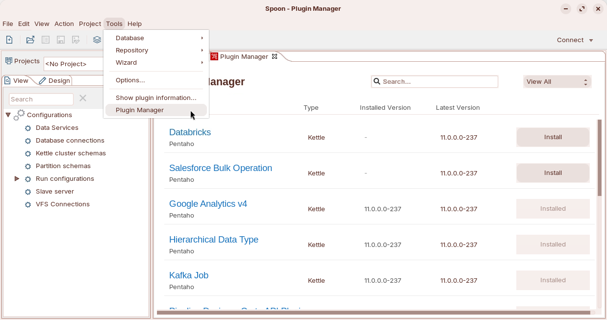
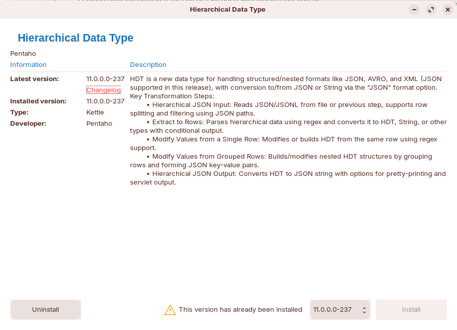

# Kettle Plugins

x

::: tabs

### NEW - PDI Plugin Manager

> **Note:**
>
> #### PDI Plugin Manager
> 
> Pentaho Data Integration (PDI) can be extended with plugins that add new steps, job entries, and other functionality. The best way to manage these plugins is through the Plugin Manager, which you'll find in both the PDI client and Pentaho User Console (PUC).
> 
> The Plugin Manager handles all your plugin needs: installing new ones, updating existing ones to their latest versions, and removing plugins you no longer use.
> 
> While you can install plugins manually, this approach isn't recommended. Manually installed plugins won't show up in the Plugin Manager, which means you'll have to handle all future updates and removals yourself.

1. In the top toolbar Select: Tools > Plugin Manager.

<figure><figcaption>
PDI Plugin Manager
</figcaption></figure>

**Installing a Plugin:** Find the plugin you want to install by searching or browsing the available options.

**For the latest version:** Simply click Install.

<figure><figcaption></figcaption></figure>

**For an earlier version:** Click on the plugin's table row to open the Plugin name dialog box. Select your desired version from the dropdown list and click Install. Confirm the installation if prompted.

**Restart to activate:** After installation, restart both Pentaho Server & PDI client. This step is essential - newly installed plugins won't work until you restart.

**Verify the installation:** Log into the PDI client and navigate to Tools > Plugin Manager. Search for or browse to your newly installed plugin. Check the Installed Version column to confirm the correct version is listed.

### Plugin Matrix

<table><thead><tr><th width="225">Plugin</th><th>Description</th></tr></thead><tbody><tr><td>Databricks</td><td>The Bulk load into Databricks entry loads large volumes of data from cloud storage files directly into Databricks tables. <strong>How it works:</strong> It accomplishes this by using Databricks' <a href="https://docs.databricks.com/aws/en/sql/language-manual/delta-copy-into">COPY INTO</a> command behind the scenes.</td></tr><tr><td>Salesforce Bulk Operation</td><td>
The Salesforce bulk operation step performs large-scale data operations (insert, update, upsert, and delete) on Salesforce objects using the Salesforce Bulk API 2.0.

<strong>How it works:</strong> The step reads data from an input stream, creates a CSV file of the changes, and executes the bulk job against Salesforce. After the job completes, you can optionally route three types of results to separate output streams: successful records, unprocessed records, and failed records.

<strong>Requirements:</strong> You must have a Salesforce Client ID and Client Secret to use this step.
</td></tr><tr><td>Google Analytics v4</td><td>
The Google Analytics v4 step retrieves data from your Google Analytics account for reporting or data warehousing purposes.

<strong>How it works:</strong> The step queries Google Analytics properties through the <a href="https://developers.google.com/analytics/devguides/reporting/data/v1">Google Analytics API v4</a> and sends the resulting dimension and metric values to the output stream.
</td></tr><tr><td><a href="https://academy.pentaho.com/pentaho-data-integration/data-integration/ee-plugins/hierarchical-data-type">Hierarchical Data Type</a></td><td>
Pentaho supports a hierarchical data type (HDT) through the Pentaho EE Marketplace plugin. This plugin adds the HDT data type and includes five specialized steps for working with it.

<strong>What it does:</strong> These steps simplify working with complex, nested data structures. They can convert between HDT fields and formatted strings, and let you directly access or modify nested array indices and keys.

<strong>Performance benefits:</strong> The steps significantly improve performance compared to handling hierarchical data as plain strings.

<strong>Data structure:</strong> HDT can store nested or complex data built from objects and arrays, as well as single elements. It's compatible with any PDI step that processes hierarchical data.
</td></tr><tr><td>Kafka Job</td><td></td></tr><tr><td></td><td></td></tr></tbody></table>

:::

x
