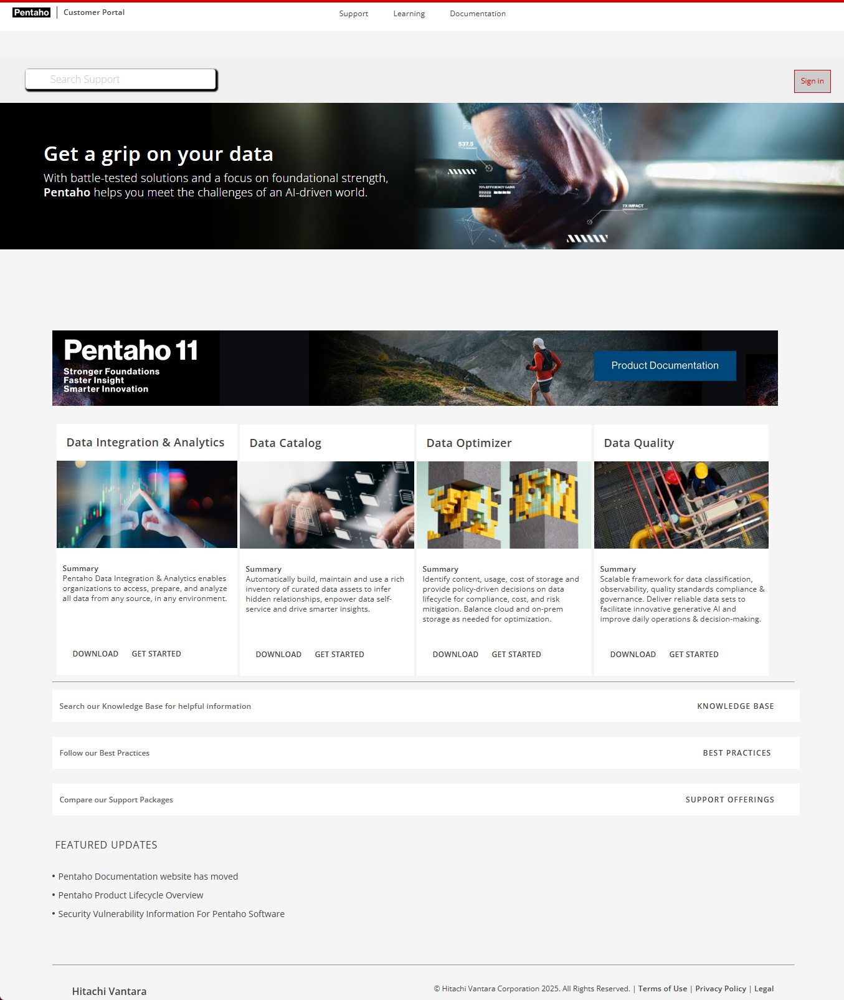
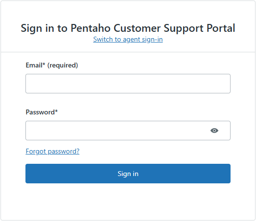
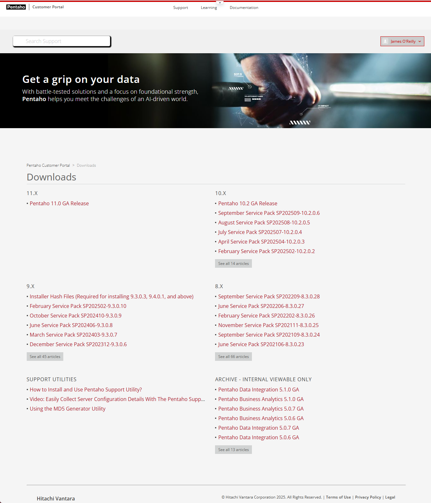
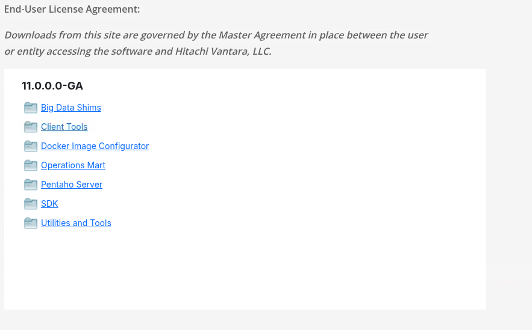

# Pentaho Support Portal

> **Note:** **Pentaho Customer Portal (EE)**
>
> Access Pentaho Enterprise downloads with your principal account credentials.

1. Log into Pentaho Customer Portal.

<figure><figcaption>
Pentaho Support Portal
</figcaption></figure>

2. Click Pentaho > DOWNLOAD.
3. Sign In to Pentaho Customer Portal.

<figure><figcaption>
Pentaho Customer Support Portal - Log In
</figcaption></figure>

4. Select your Pentaho version: Pentaho 11.0 GA Release

<figure><figcaption></figcaption></figure>

5. Select the required Pentaho packages to download.

<figure><figcaption>
Packages
</figcaption></figure>

> **Note:** **Pentaho packages used in this lab:**
>
> **Big Data Shims**
>
> * `pentaho-server-ee-11.0.0.0-237.zip`
>
> **Pentaho Server**
>
> * `pentaho-server-ee-11.0.0.0-237.zip`
> * `paz-plugin-ee-11.0.0.0-237.zip`
> * `pir-plugin-ee-11.0.0.0-237.zip`
> * `pdd-plugin-ee-11.0.0.0-237.zip`
> * `webttle-plugin-ee-11.0.0.0-237.zip`
> * `semantic-model-editor-plugin-assembly-1.0.0.zip`
> * `pas-scheduler-11.0.0.0-237.zip`
> * `webttle-carte-api-plugin-11.0.0.0-237.zip`
>
> **Client Tools**
>
> * `pdi-ee-11.0.0.0-237.zip`
> * `pad-ee-11.0.0.0-237.zip`
> * `psw-ee-11.0.0.0-237.zip`
> * `pme-ee-11.0.0.0-237.zip`
> * `prd-ee-11.0.0.0-237.zip`
>
> **Operations Mart**
>
> * `pentaho-operations-mart-11.0.0.0-237.zip`
>
> **Docker Image Configurator**
>
> * `on-prem-11.0.0.0-237.zip`
>
> Note: Additional EE plugins, if required for your use case, will be installed later in **Server Plugins** (later in this course).
