# Server Plugins

> **Note:**
>
> #### Plugin Manager
> 
> To make deployment of the Pentaho Server plugins easier there's a modern PUC with a built-in Plugin Manager.&#x20;
> 
> From the Plugin Manager UI you can now manage your plugin lifecycle:
> 
> * Update Available - check for updates
> * Installed - list installed plugins
> * Not Installed - list plugins not installed
> 
> for both Server and Client side EE plugins.

> **Warning:** The Plugin Manager downloads from `download.pentaho.com`, so the server needs outbound HTTPS.

***

1. Log in:

<div class="pcm-embed-card" data-href="http://localhost:8080/pentaho/content/login/web/index.html" data-title="localhost"></div>

2. Select Plugin Manager.

<figure>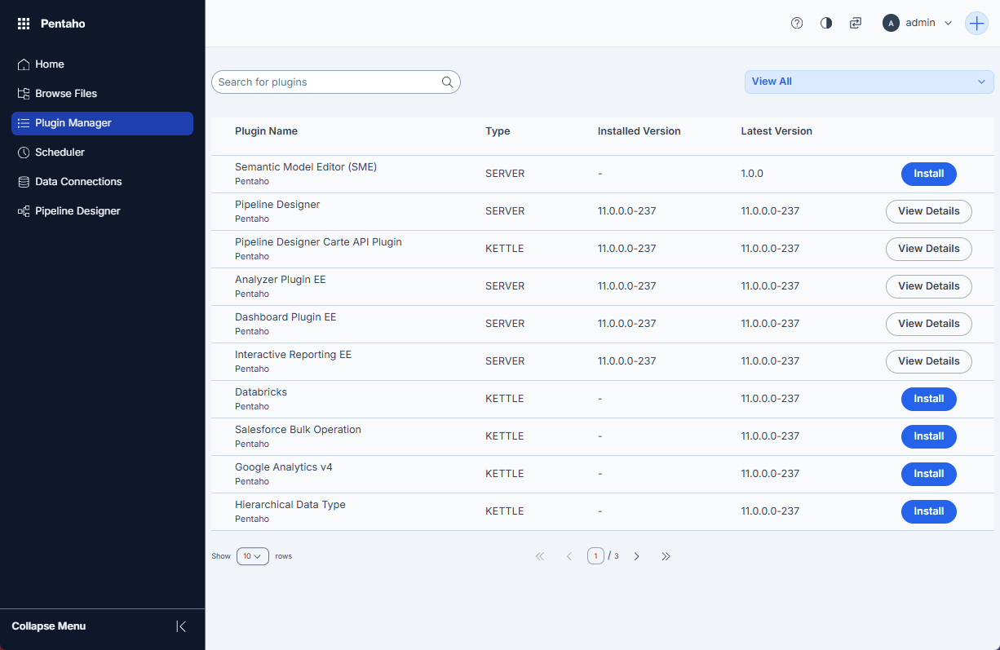<figcaption><p>Plugin Manager</p></figcaption></figure>

Or

1. Log in & Switch to Modern Design.

<figure>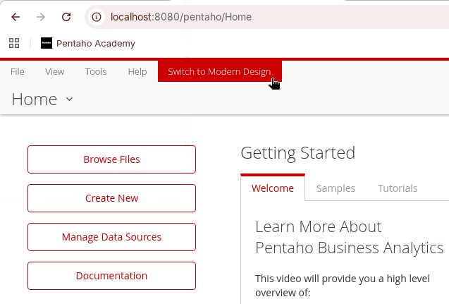<figcaption><p>Switch to Modern Design</p></figcaption></figure>

::::: tabs

### 1. Plugin Manager

> **Note:**
>
> #### **NEW - Pentaho User Console**
> 
> The left panel displays the main navigation options including Home (currently active), Browse Files, Plugin Manager, Scheduler, Data Connections, Settings, Semantic Model Editor, and Pipeline Designer.
> 
> The Home page features a Quick Access section with four tiles: Data Sources for managing project data sources, Browse Files for exploring files to use with Pentaho, Semantic Model Editor for viewing or creating semantic models, and Pipeline Designer for creating transformations and jobs in the new web-based editor.
> 
> At the bottom, the Recently Opened section displays two .ktr files—tr\_write\_output and tr\_hello\_world (marked as favorite) - both last modified on December 12, 2025, and owned by the admin user.

<figure>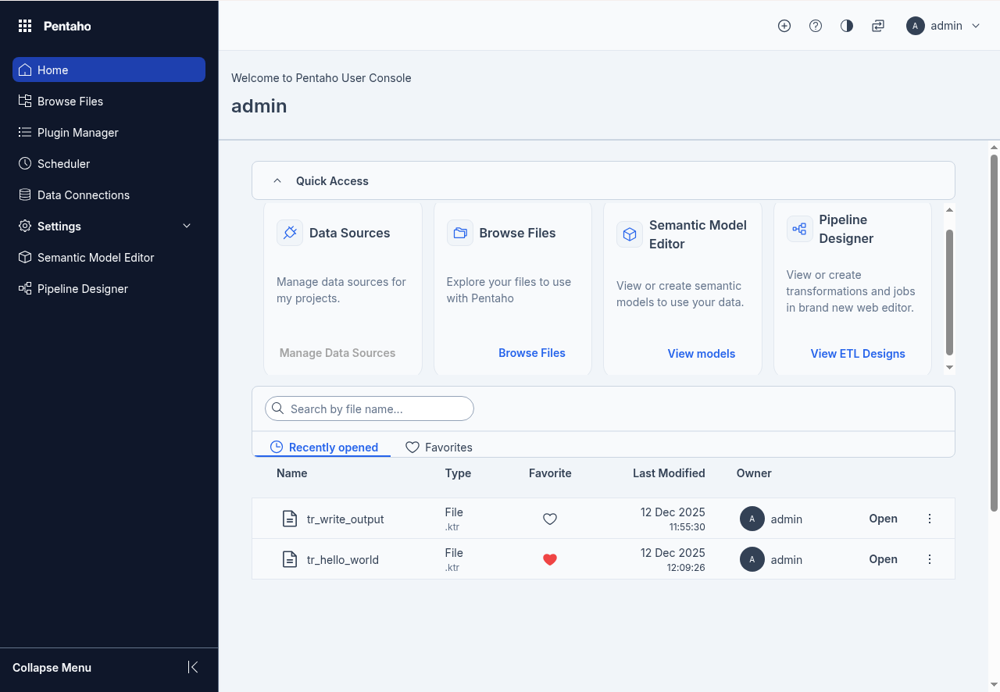<figcaption><p>NEW - Pentaho User Console</p></figcaption></figure>

:::: tabs

### Analytic Plugins

> **Note:**
>
> #### Analytic Plugins
> 
> Plugin Manager - The recommended method for managing the lifecycle of your plugins.

::: tabs

### 1. Analyzer

> **Note:**
>
> #### **Analyzer**
> 
> Pentaho Analyzer is a web-based business intelligence tool that's part of the Pentaho Business Analytics platform. It provides an interactive, drag-and-drop interface for analyzing data and creating visualizations without requiring SQL or technical coding knowledge.
> 
> The tool allows users to explore data through OLAP (Online Analytical Processing) cubes, enabling multidimensional analysis with features like drill-down, slice-and-dice, and pivot operations. Users can quickly create charts, graphs, and reports by dragging dimensions and measures onto a canvas, making it accessible for business users who need to perform ad-hoc analysis.
> 
> Pentaho Analyzer supports various visualization types including bar charts, line graphs, pie charts, and heat grids, and integrates with the broader Pentaho platform for sharing reports and embedding analytics into dashboards. It's particularly useful for organizations that want to empower business users to independently explore and visualize their data warehouse or mart information.

1. Select: Analyzer

<figure>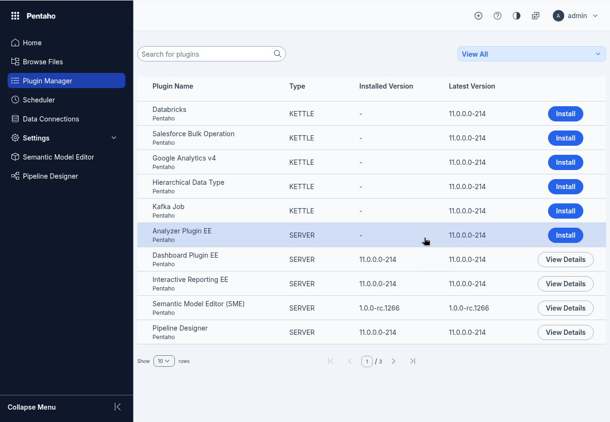<figcaption><p>Analyzer</p></figcaption></figure>

2. From the drop-down box, select : Version

<figure>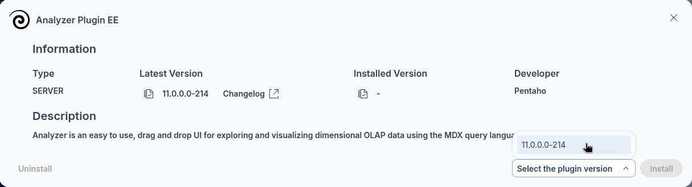<figcaption><p>Analyzer Plugin</p></figcaption></figure>

3. Click Install.
4. Optional: Verify Analyzer is installed.

```bash
[ -d "$PENTAHO_SERVER/pentaho-solutions/system/analyzer" ] && echo OK || echo "Analyzer directory missing"
```

5. Restart Pentaho Server and verify in the UI.

```bash
cd
cd "$PENTAHO_SERVER"
./stop-pentaho.sh
```

```bash
cd
cd "$PENTAHO_SERVER"
./start-pentaho.sh
```

<div class="pcm-embed-card" data-href="http://localhost:8080/pentaho" data-title="localhost"></div>

### 2. Interactive Reporting

> **Note:**
>
> #### **Interactive Reporting**
> 
> Pentaho Interactive Reporting (PIR) is a web-based ad-hoc reporting tool within the Pentaho Business Analytics platform that enables users to create and customize reports through an intuitive interface without requiring technical expertise.
> 
> The tool provides a WYSIWYG (What You See Is What You Get) drag-and-drop environment where users can build reports by selecting data sources, adding fields, applying filters, and formatting output. Unlike traditional report design tools that require developer skills, PIR is designed for business users who need to quickly generate operational reports and answer specific business questions.
> 
> Key capabilities include the ability to create tabular reports with grouping, sorting, filtering, and calculated fields. Users can add charts, apply conditional formatting, and create prompts for parameterized reports. The tool supports various output formats including HTML, PDF, Excel, and CSV, making it easy to distribute reports across the organization.
> 
> PIR connects to relational databases and Pentaho data sources, allowing users to work with live data. It's particularly valuable for organizations that want to democratize reporting capabilities and reduce the bottleneck of relying solely on IT or developers to create standard operational reports.

1. Select: Interactive Reporting.

<figure>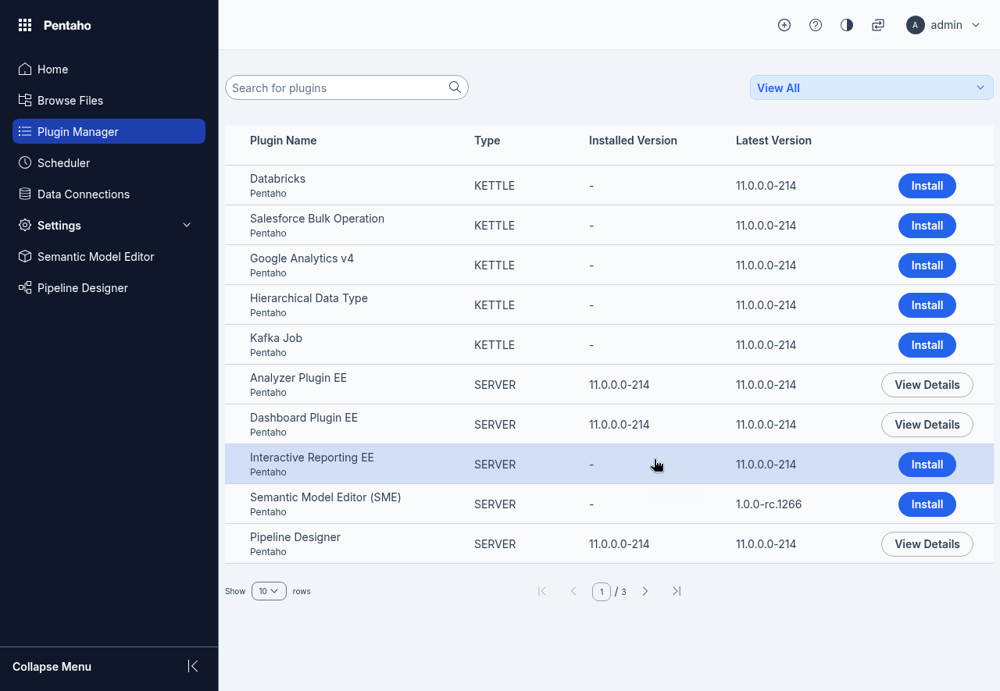<figcaption><p>Interactive Reporting</p></figcaption></figure>

<figure>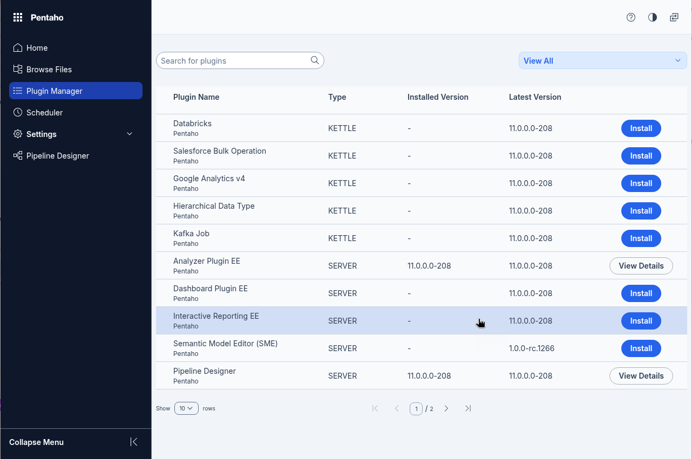<figcaption><p>Interactive Reporting</p></figcaption></figure>

2. From the drop-down box, select : Version

<figure>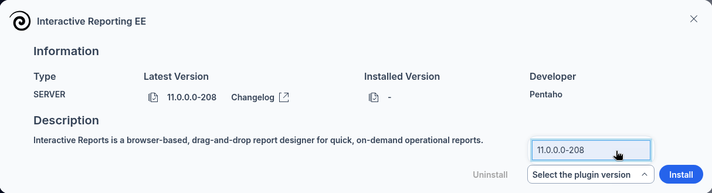<figcaption><p>Interactive Reporting Plugin</p></figcaption></figure>

3. Click Install.
4. Optional: Verify Interactive Reporting is installed.

```bash
[ -d "$PENTAHO_SERVER/pentaho-solutions/system/pentaho-interactive-reporting" ] && echo OK || echo "Interactive Reporting directory missing"
```

5. Restart Pentaho Server and verify in the UI.

```bash
cd
cd "$PENTAHO_SERVER"
./stop-pentaho.sh
```

```bash
cd
cd "$PENTAHO_SERVER"
./start-pentaho.sh
```

<div class="pcm-embed-card" data-href="http://localhost:8080/pentaho" data-title="localhost"></div>

### 3. Dashboard Designer

> **Note:**
>
> #### **Dashboard Designer**
> 
> Pentaho Dashboard Designer (PDD) builds dashboards in the User Console without code. You choose a layout template and a theme, then fill each panel with existing Interactive Reporting, Analyzer or Report Designer content, a chart built in Chart Designer, a data table, or a web page by its URL.
> 
> Dashboard prompts filter every report whose filter is defined as a parameter, so one selection drives several panels, and content linking lets a click in one panel update another.
> 
> It is a different product from CDE, the Community Dashboard Editor, which builds dashboards from HTML layouts, components and data sources and needs development skills.
> 
> Dashboard Designer suits executive and operational dashboards: several related reports and charts on one page, filtered together, with detail a click away.

1. Select: Dashboard Designer.

<figure>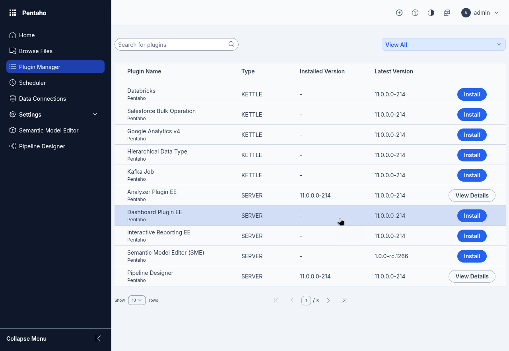<figcaption><p>Dashboard Designer</p></figcaption></figure>

2. From the drop-down box, select : Version

<figure>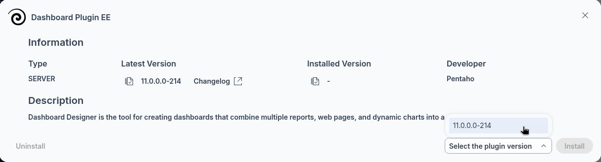<figcaption><p>Dashboard Designer Plugin</p></figcaption></figure>

3. Click Install.
4. Optional: Verify Dashboard Designer is installed.

```bash
[ -d "$PENTAHO_SERVER/pentaho-solutions/system/dashboards" ] && echo OK || echo "Dashboard Designer directory missing"
```

5. Restart Pentaho Server and verify in the UI.

```bash
cd
cd "$PENTAHO_SERVER"
./stop-pentaho.sh
```

```bash
cd
cd "$PENTAHO_SERVER"
./start-pentaho.sh
```

<div class="pcm-embed-card" data-href="http://localhost:8080/pentaho" data-title="localhost"></div>

:::

### NEW Plugins

> **Note:**
>
> #### Pentaho 11 Server Plugins

Browse the various plugins:

::: tabs

### 1. Pipeline Designer

> **Note:**
>
> #### **Pipeline Designer**
> 
> The **Pentaho Pipeline Designer** is a visual tool that lets you build data transformation workflows through a drag-and-drop interface. The left panel contains a searchable library of pre-built components (like CSV inputs, MongoDB operations, data generators), the center canvas is where you visually connect these components into a flow diagram to create your pipeline, and the bottom logging console shows real-time execution details and performance metrics when you run the transformation.&#x20;
> 
> It's essentially a no-code environment for designing data pipelines, and it's one of the plugin components that gets deployed in your Pentaho Server setup.

> **Note:** The 11.0 server archive already contains Pipeline Designer (`pentaho-webttle`), so the check in step 4 can pass before you install anything. Use the Plugin Manager to update it.

1. Select: Pipeline Designer.

<figure>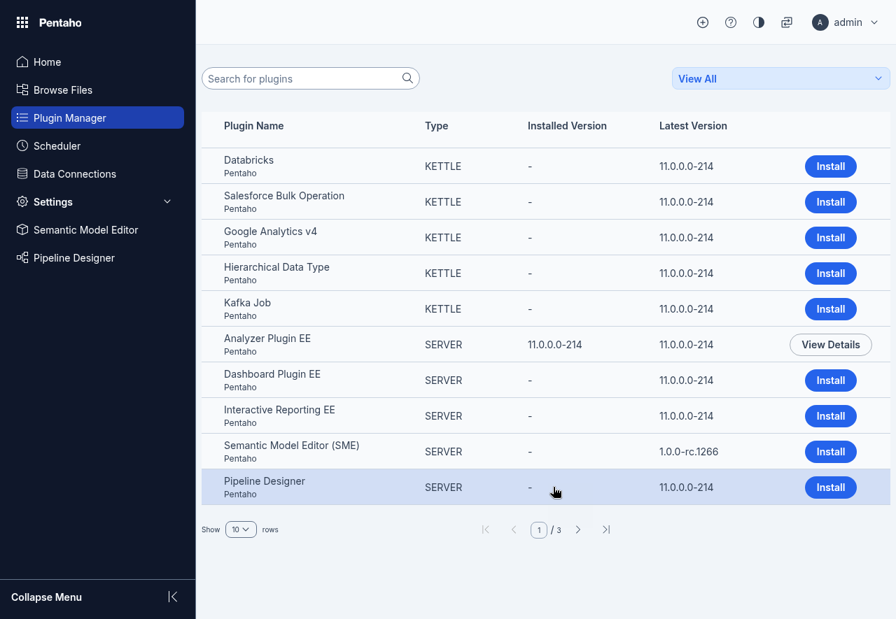<figcaption><p>Pipeline Designer</p></figcaption></figure>

2. From the drop-down box, select : Version

<figure>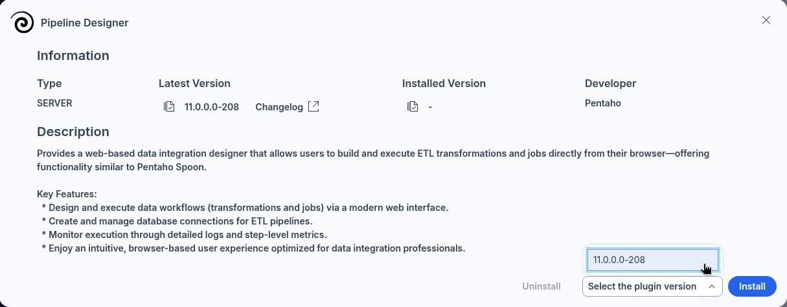<figcaption><p>Pipeline Designer Plugin</p></figcaption></figure>

3. Click Install.
4. Optional: Verify Pipeline Designer is installed.

```bash
[ -d "$PENTAHO_SERVER/pentaho-solutions/system/pentaho-webttle" ] && echo OK || echo "Pipeline Designer directory missing"
```

5. Restart Pentaho Server and verify in the UI.

```bash
cd
cd "$PENTAHO_SERVER"
./stop-pentaho.sh
```

```bash
cd
cd "$PENTAHO_SERVER"
./start-pentaho.sh
```

6. Log in:

<div class="pcm-embed-card" data-href="http://localhost:8080/pentaho/content/login/web/index.html" data-title="localhost"></div>

7. Select: Pipeline Designer.

<figure>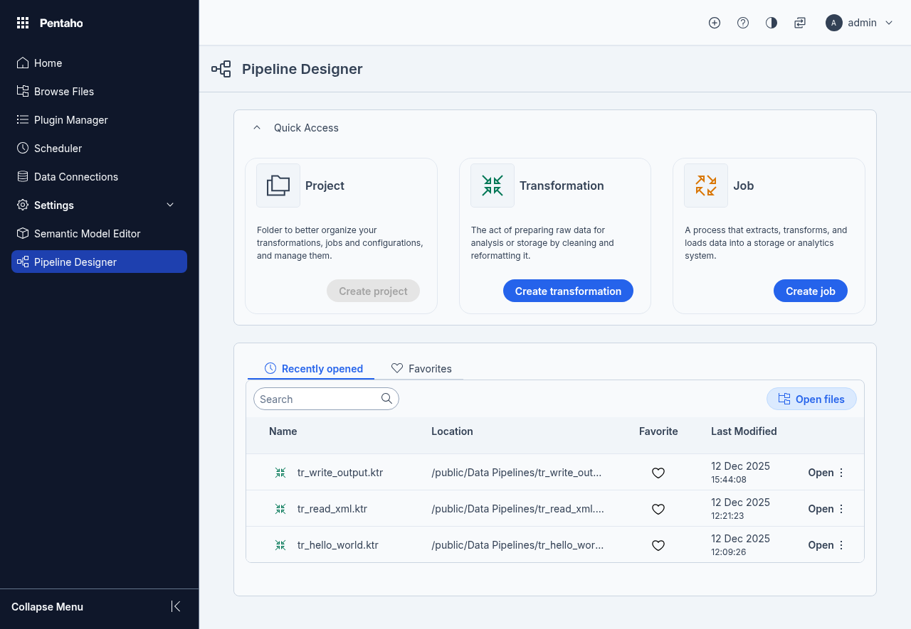<figcaption><p>Pipeline Designer</p></figcaption></figure>

8. Create a test Transformation.

<figure>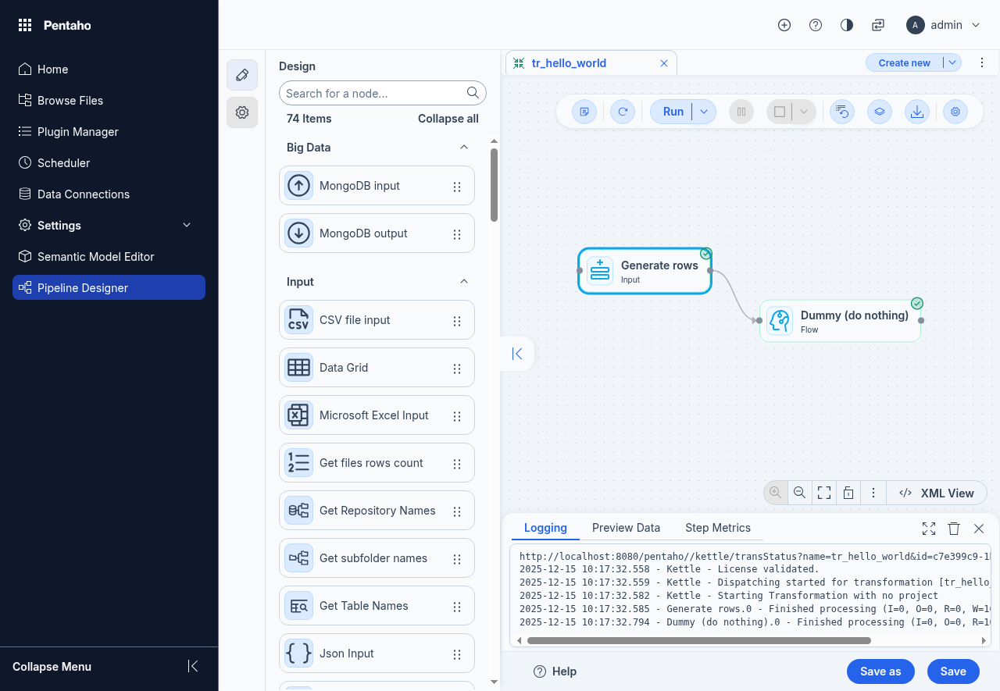<figcaption><p>Transformation - Hello World</p></figcaption></figure>

### 2. Semantic Model Editor

> **Note:**
>
> #### **Semantic Model Editor**
> 
> The Semantic Model Editor (SME) helps you create data models that define how your data should be organized and analyzed for business intelligence. It defines a semantic layer between your raw data and your reports, ensuring everyone in your organization uses consistent business logic and definitions.

1. Select: Semantic Model Editor.

<figure>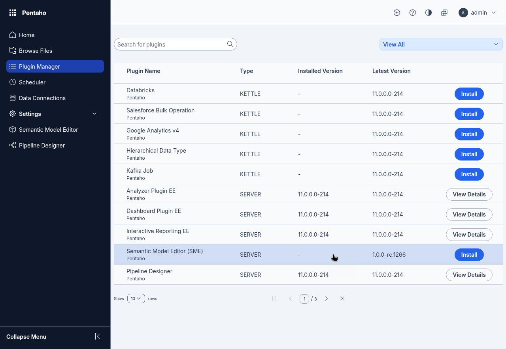<figcaption><p>Semantic Model Editor</p></figcaption></figure>

2. From the drop-down box, select : Version

<figure>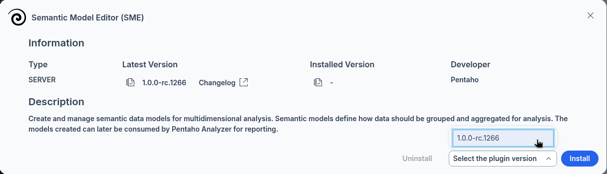<figcaption></figcaption></figure>

3. Click Install.
4. Optional: Verify the Semantic Model Editor is installed: its folder is among the newest in `system`.

```bash
ls -1t "$PENTAHO_SERVER/pentaho-solutions/system" | head -3
```

5. Restart Pentaho Server and verify in the UI.

```bash
cd
cd "$PENTAHO_SERVER"
./stop-pentaho.sh
```

```bash
cd
cd "$PENTAHO_SERVER"
./start-pentaho.sh
```

6. Log in:

<div class="pcm-embed-card" data-href="http://localhost:8080/pentaho/content/login/web/index.html" data-title="localhost"></div>

7. Select: Model Editor.

<figure>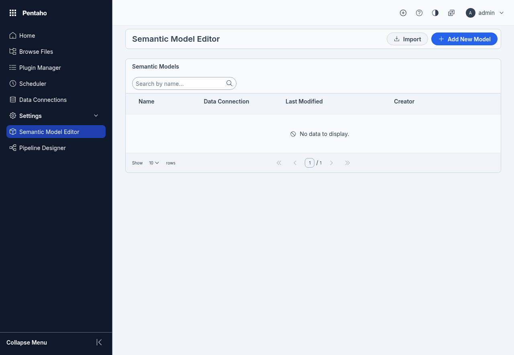<figcaption><p>Semantic Model Editor</p></figcaption></figure>

<figure>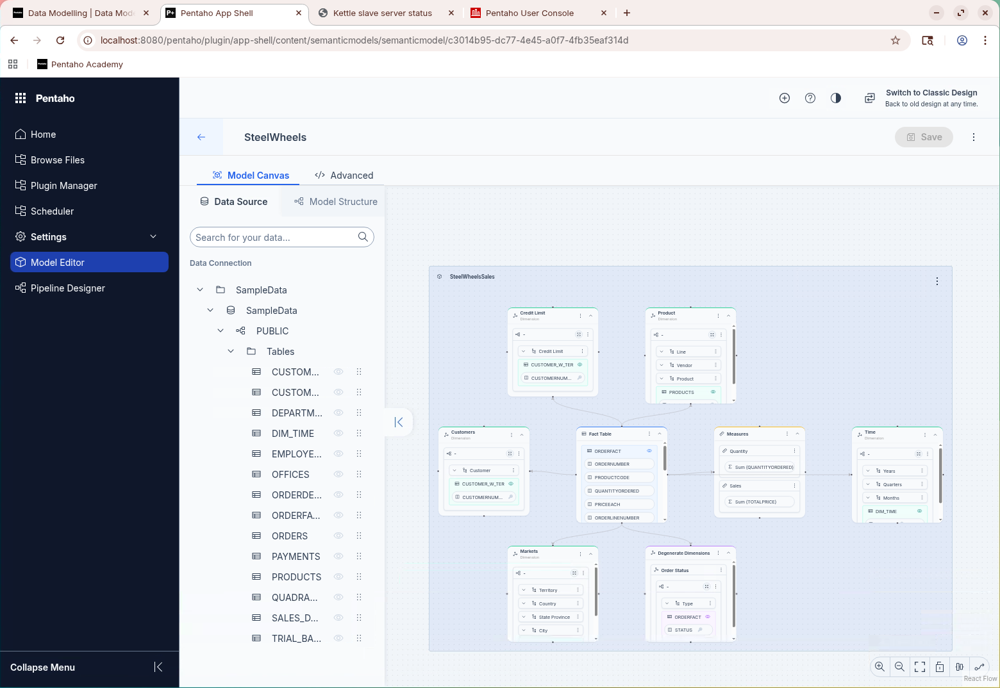<figcaption><p>SteelWheels Model</p></figcaption></figure>

### 3. Scheduler

> **Note:**
>
> #### **Scheduler**
> 
> The **Pentaho Scheduler** provides centralized management and automation of scheduled tasks across your Pentaho system. It displays a table of all scheduled jobs showing their source files, execution frequency (like "Every day at 3:15 PM"), current status (active/paused), last run times, and output locations.&#x20;
> 
> You can view all schedules or filter by active/paused status, manually execute jobs on-demand, set blockout times when jobs shouldn't run, and pause/resume the entire scheduler - essentially giving you complete visibility and control over automated data transformation workflows and their execution timing.

1. Check whether the Scheduler is already installed: the 11.0 server archive ships it as `pas-scheduler`. If this prints OK, go straight to step 7.

```bash
[ -d "$PENTAHO_SERVER/pentaho-solutions/system/pas-scheduler" ] && echo OK || echo "Scheduler plugin directory missing"
```

2. Otherwise, in the Plugin Manager select **Not Installed** and search for Scheduler. The Plugin Manager lists it as **Modern Pentaho User Console – Scheduler**.
3. From the drop-down box, select : Version
4. Click Install.
5. Optional: Verify the Scheduler is installed.

```bash
[ -d "$PENTAHO_SERVER/pentaho-solutions/system/pas-scheduler" ] && echo OK || echo "Scheduler plugin directory missing"
```

6. Restart Pentaho Server and verify in the UI.

```bash
cd
cd "$PENTAHO_SERVER"
./stop-pentaho.sh
```

```bash
cd
cd "$PENTAHO_SERVER"
./start-pentaho.sh
```

7. Log in:

<div class="pcm-embed-card" data-href="http://localhost:8080/pentaho/content/login/web/index.html" data-title="localhost"></div>

8. Select: Scheduler

<figure>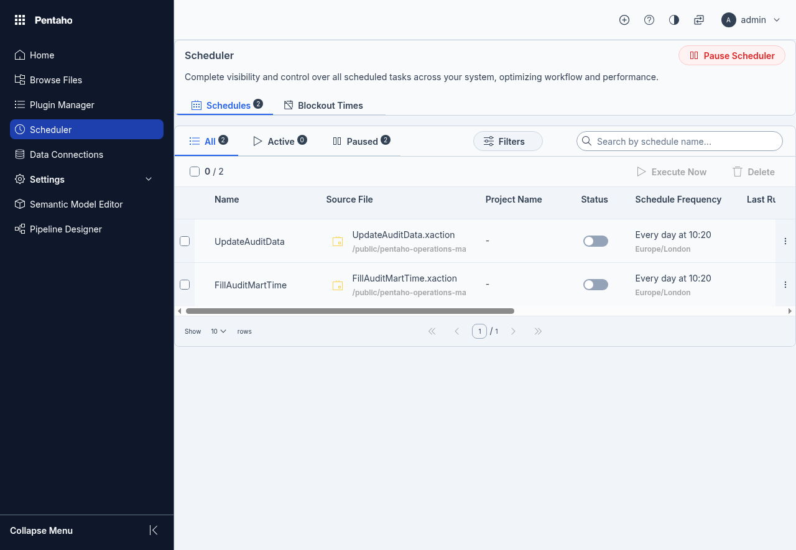<figcaption><p>Scheduler</p></figcaption></figure>

### 4. Carte

> **Note:**
>
> #### **Pipeline Carte Server**
> 
> The **Pentaho Carte Server** is the execution engine that runs and monitors Pentaho transformations and jobs. It provides a web-based status dashboard showing all running and completed transformations/jobs with their execution details (status, timestamps, unique IDs), detailed step-by-step performance metrics (rows read/written, processing speed, errors), and configuration settings for log management and object lifecycle. The server tracks real-time execution stats for each transformation step, displays visual canvas previews of the pipeline flow, and maintains comprehensive execution logs - essentially serving as both the runtime engine and monitoring console for your workflows.

1. Verify the Carte API plugin is there. It ships in the 11.0 server archive, under the server's PDI plugins rather than `system`; if it is missing, install **Pipeline Designer Carte API Plugin** from the Plugin Manager.

```bash
[ -d "$PENTAHO_SERVER/pentaho-solutions/system/kettle/plugins/webttle-carte-api-plugin" ] && echo OK || echo "Carte API plugin directory missing"
```

2. Restart Pentaho Server and verify in the UI.

```bash
cd
cd "$PENTAHO_SERVER"
./stop-pentaho.sh
```

```bash
cd
cd "$PENTAHO_SERVER"
./start-pentaho.sh
```

<div class="pcm-embed-card" data-href="http://localhost:8080/pentaho" data-title="localhost"></div>

3. Run your test transformation (see the Pipeline Designer tab).

<figure>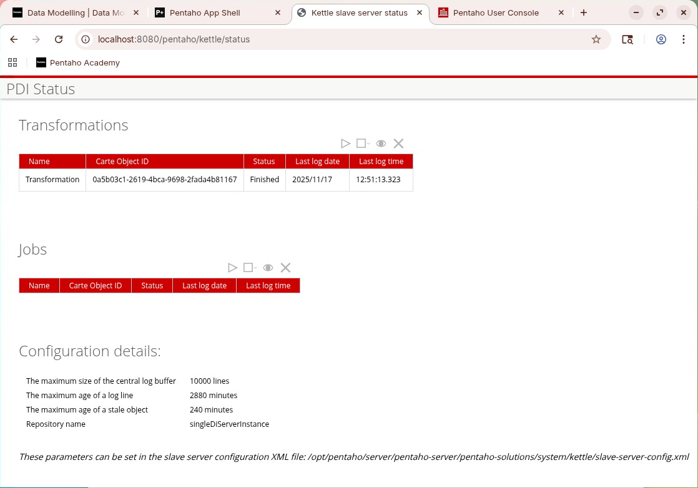<figcaption><p>Carte Status</p></figcaption></figure>

<figure>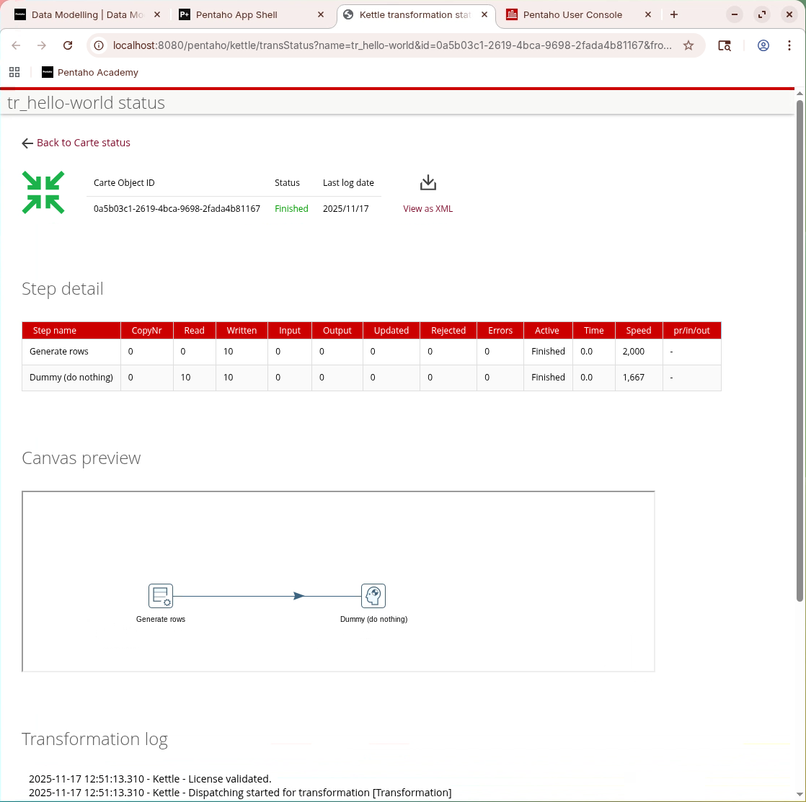<figcaption><p>Carte details</p></figcaption></figure>

:::

### Data Connections

> **Note:**
>
> #### Data Connections
> 
> **Data Connections** manages data sources for the system.&#x20;
> 
> The interface features a search bar for filtering data sources by name and an "Add connection" button in the upper right corner for configuring new data sources.&#x20;
> 
> Each data source entry includes a checkbox for selection, displays the source name with an icon indicating the database type, and provides an "Open" button for accessing the data source along with additional configuration options accessible via a menu.&#x20;

1. To view the connection details, Click: Open

<figure>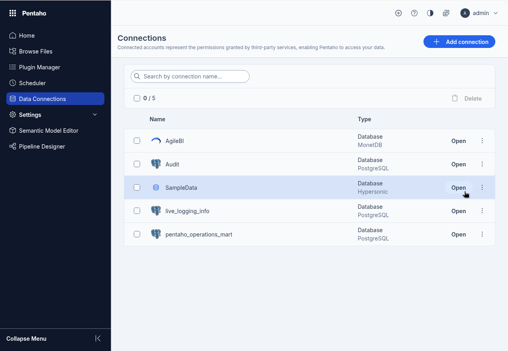<figcaption><p>SampleData connection</p></figcaption></figure>

2. The connection details panel enables you to 'tune' the connection.

<figure>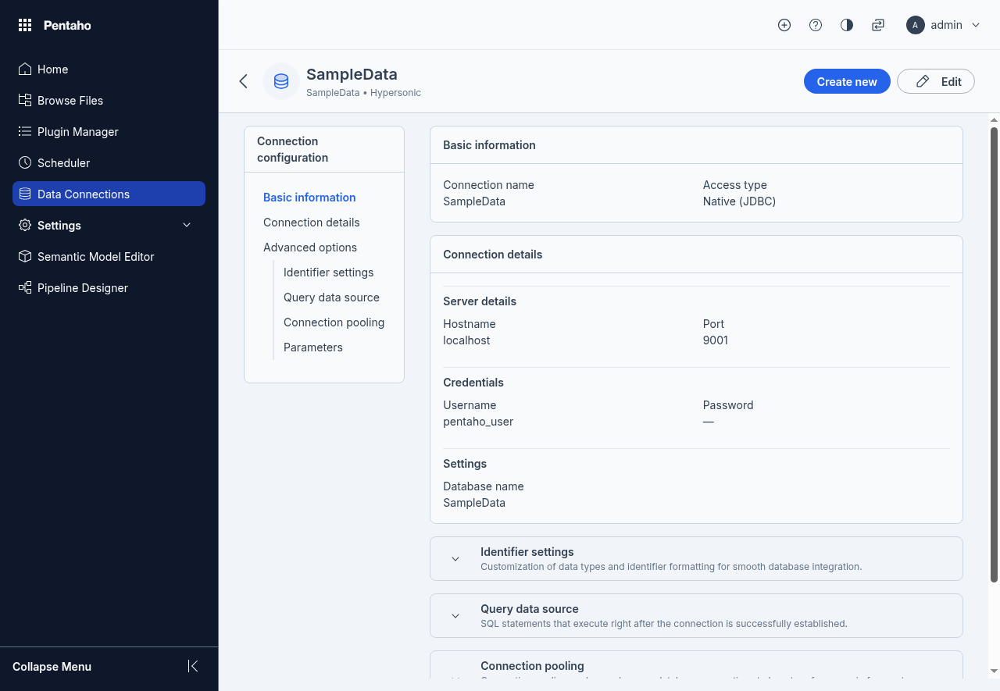<figcaption><p>SampleData connection details</p></figcaption></figure>

3. Create new will enable you to create a new database connection - in this example, Hypersonic.

<figure>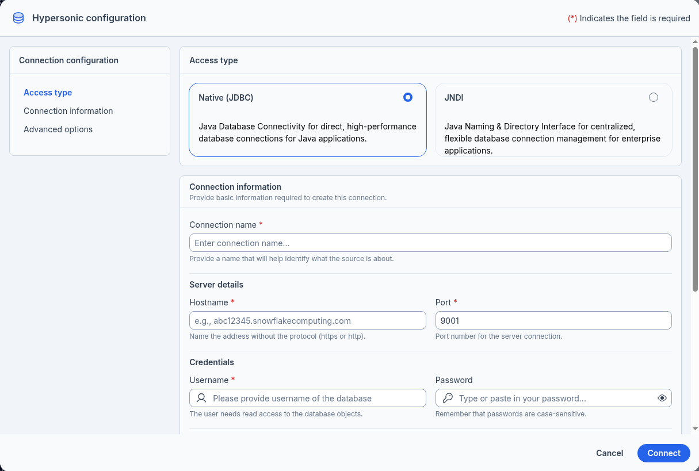<figcaption><p>Create new database connection</p></figcaption></figure>

***

**Add Connection**

1. Click: Add Connection - in the main panel

<figure>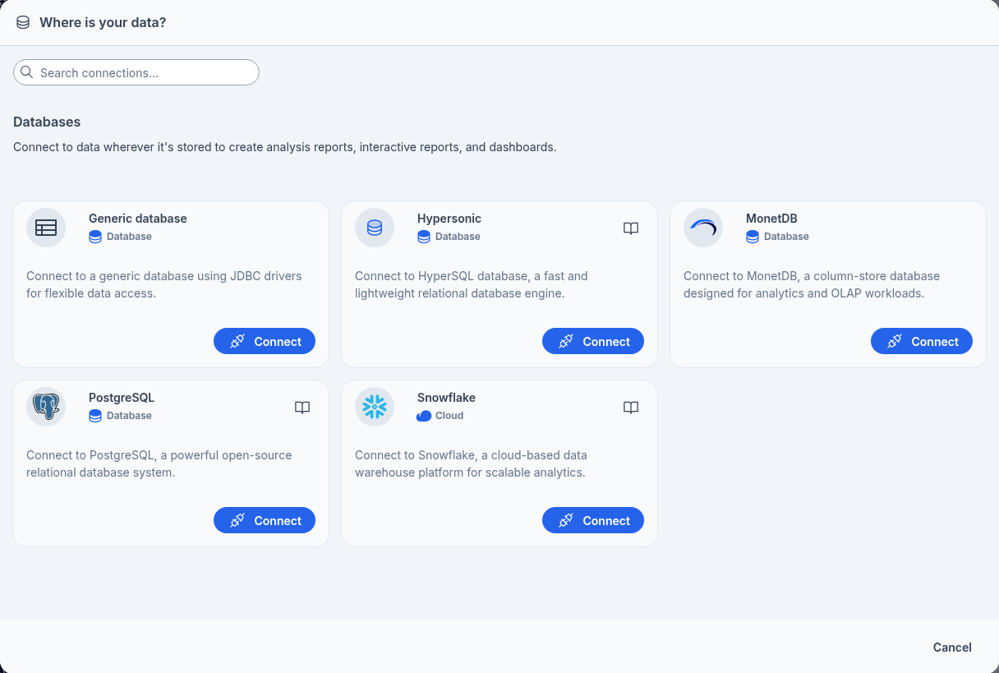<figcaption><p>Add Connection</p></figcaption></figure>

2. Click: Connect  - to configure the connection.

<figure>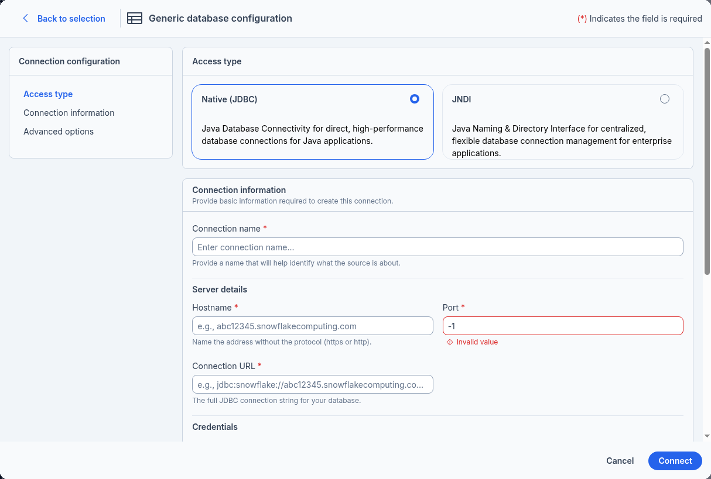<figcaption><p>Configure connection</p></figcaption></figure>

> **Danger:** Remember to copy over the supported JDBC driver to:
> 
> /opt/pentaho/server/pentaho-server/tomcat/lib directory & restart the Pentaho server.

::::

### Plugin Matrix

<table><thead><tr><th width="217">Plugin</th><th>Description</th></tr></thead><tbody><tr><td>Analyzer<br><code>paz-plugin</code></td><td>Interactive OLAP analysis: drill, slice, pivot and chart Mondrian cubes in the browser.</td></tr><tr><td>Interactive Reporting<br><code>pir-plugin</code></td><td>Ad-hoc tabular reports built from metadata models, exported to HTML, PDF, CSV or Excel.</td></tr><tr><td>Dashboard Designer<br><code>pdd-plugin</code></td><td>Dashboards of reports, analyses and charts, filtered together by shared prompts and content linking.</td></tr><tr><td>Pipeline Designer<br><code>webttle-plugin</code></td><td>Builds PDI transformations and jobs in the browser; compatible with those made in Spoon.</td></tr><tr><td>Pipeline Designer Carte<br><code>webttle-carte-api-plugin</code></td><td>Runs and monitors the transformations and jobs launched from Pipeline Designer.</td></tr><tr><td>Semantic Model Editor</td><td>Builds and manages Mondrian models in the browser, including existing ones.</td></tr><tr><td>Scheduler<br><code>pas-scheduler</code></td><td>Manages schedules: run now, pause and resume, and blockout times.</td></tr><tr><td>Elastic MapReduce</td><td>Amazon EMR support, one of the big data components 11.0 delivers as plugins.</td></tr></tbody></table>

:::::

