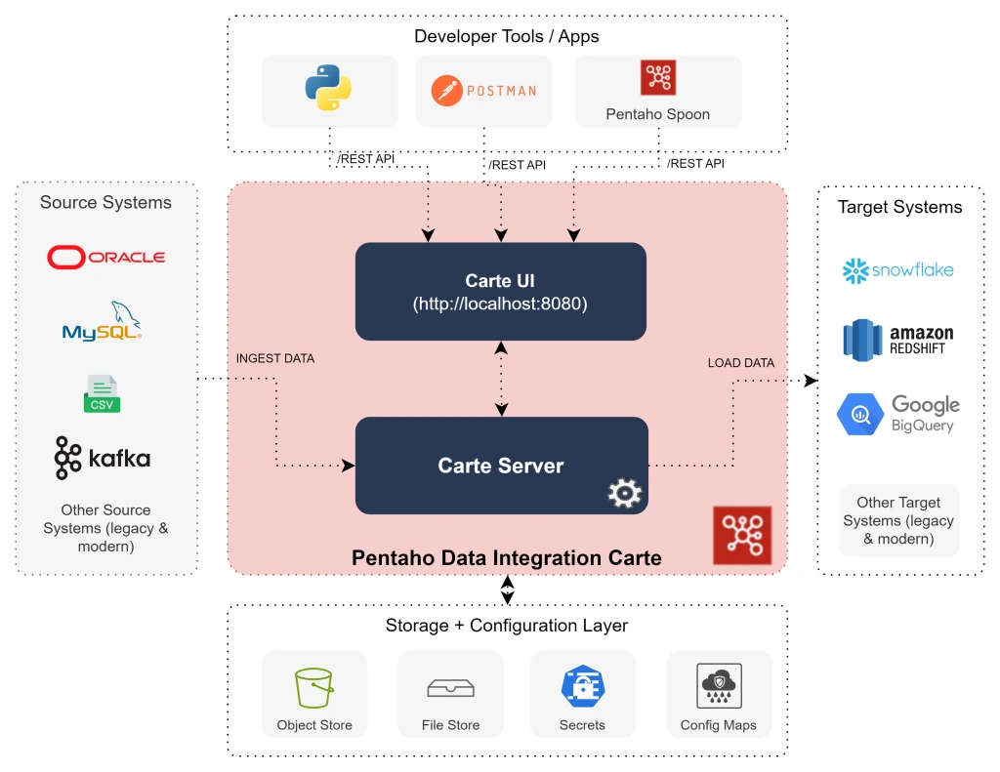
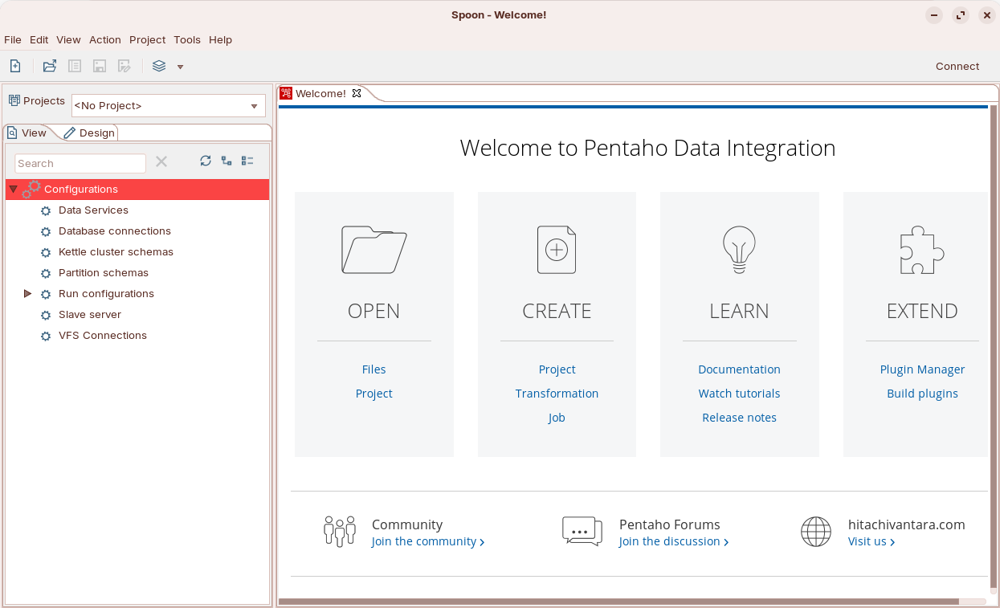
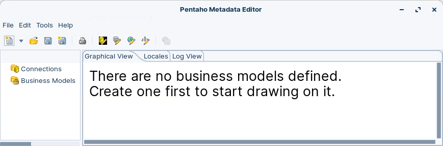
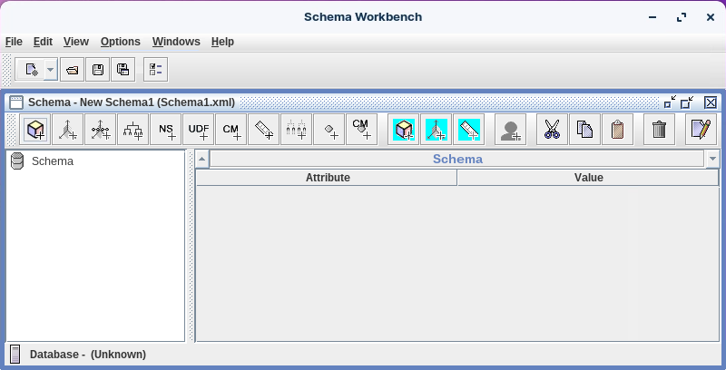
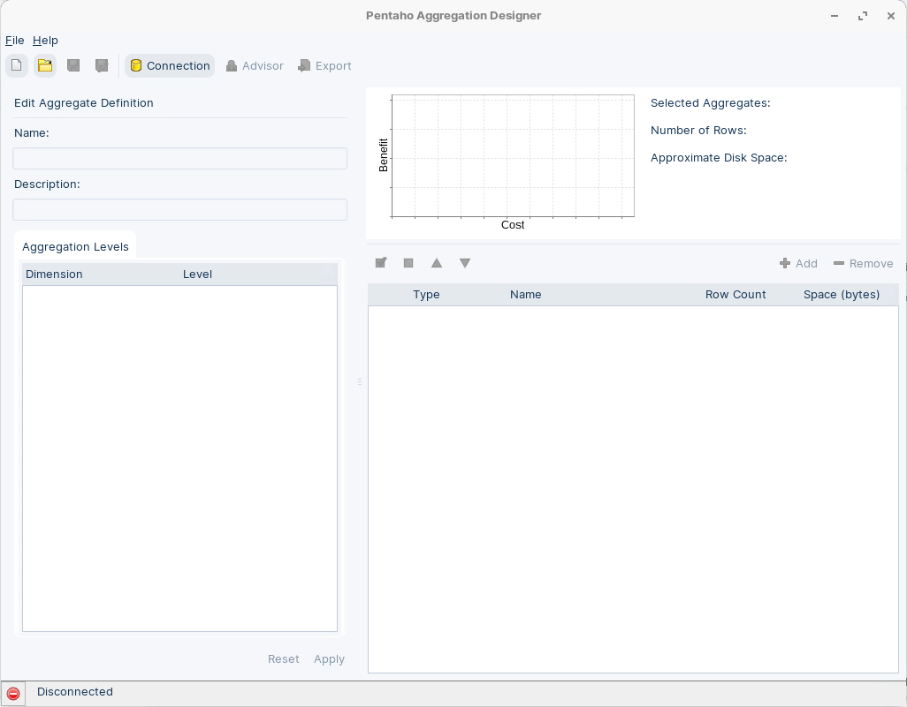

# Client Plugins

> **Note:**
>
> #### Pentaho Client Tools
> 
> There are two methods for installing the Business Analytics (BA) design tools. You can use either of these methods:
> 
> * Pentaho Business Analytics Evaluation Wizard — Windows Desktop
> * Install each tool manually — Linux / Windows Desktop
> 
> The Evaluation Wizard is the easiest way to install design tools, utilities, or plugins on client workstations. Manual installation lets you place design tool files wherever needed. Choose a deployment that matches your DevOps and desktop constraints.

> **Warning:** Baseline: Ubuntu 24.04 LTS with Java 21 (OpenJDK). For Windows, see: the **Windows evaluation installation** in the Pentaho docs.

<figure><figcaption><p>Pentaho Pro Suite</p></figcaption></figure>

The following steps install the client tools on a Linux Desktop. ZIP filenames shown are examples; use your actual versions.

> **Note:** **Unpack Pentaho Client Package (ZIP)**
> 
> Use `unzip` to extract the server ZIP into the runtime directory. This avoids requiring the full JDK (the JRE does not include the `jar` tool).
> 
> * `pdi-ee-11.0.0.0-237.zip` - Pentaho Data Integration
> 
> * `pad-ee-11.0.0.0-237.zip`   - Pentaho Aggregation Designer
> 
> * `psw-ee-11.0.0.0-237.zip`   - Pentaho Schema Workbench
> 
> * `pme-ee-11.0.0.0-237.zip`   - Pentaho Metadata Editor
> 
> * `prd-ee-11.0.0.0-237.zip`   - Pentaho Report Designer

* Ensure `unzip` is installed:

```bash
sudo apt update -y && sudo apt install -y unzip
```

1. Create base Pentaho directory: \~`/Pentaho/design-tools`.

```bash
cd
mkdir -p ~/Pentaho/design-tools
```

<pre><code>~/Pentaho/design-tools
├── design-tools             
    └── data-integration  
    └── metadata-editor   
<strong>    └── schema-workbench      
</strong></code></pre>

::: tabs

### 1. Data Integration

> **Note:**
>
> #### **Pentaho Data Integration (PDI)**
> 
> Pentaho Data Integration (PDI) provides ETL capabilities for capturing, cleansing, and transforming data.

1. Locate `pdi-ee-11.0.0.0-237.zip`.

```bash
ls -1 ~/Downloads/'Client Tools'/'PDI (Spoon)'
```

3. Extract `pdi-ee-11.0.0.0-237.zip`

```bash
cd
cd ~/Pentaho/design-tools

# Replace <version> with the exact file name you downloaded.
unzip ~/Downloads/'Client Tools'/'PDI (Spoon)'/pdi-ee-11.0.0.0-2xx.zip
# You may need to adjust the path.
```

4. Make `.sh` files executable.

```bash
cd
cd ~/Pentaho/design-tools
find . -iname "*.sh" -exec chmod +x {} \;
```

5. Verify structure:

> **Note:** \~/Pentaho/design-tools/
> 
> * data-integration
> * jdbc-distribution
> * license-installer

***

> **Warning:** **Ubuntu 24.04 desktop UI notes**
> 
> Some legacy UI components in Spoon may require GTK/WebKit libraries that vary by desktop flavor. On Ubuntu 24.04, if Spoon reports missing GTK/WebKit modules, follow the instructions: [Missing GTK/WebKit modules](#missing-gtk-webkit-modules)

6. Start PDI (Spoon):

```bash
cd
cd ~/Pentaho/design-tools/data-integration
./spoon.sh
```

<figure><figcaption><p>Spoon UI</p></figcaption></figure>

### 2. Metadata Editor

> **Note:**
>
> #### **Pentaho Metadata Editor (PME)**
> 
> Pentaho Metadata Editor creates and manages business-friendly semantic models.

1. Locate `pme-ee-11.0.0.0-237.zip`.

```bash
ls -1 ~/Downloads/'Client Tools'/'Metadata Editor'
```

2. Extract `pme-ee-11.0.0.0-237.zip`.

```bash
cd
cd ~/Pentaho/design-tools

# Replace <version> with the exact file name you downloaded.
unzip ~/Downloads/'Client Tools'/'Metadata Editor'/pme-ee-11.0.0.0-2xx.zip
# You may need to adjust the path.
```

3. Make `.sh` files executable.

```bash
cd
cd ~/Pentaho/design-tools
find . -iname "*.sh" -exec chmod +x {} \;
```

4. Verify structure:

> **Note:** \~/Pentaho/design-tools/
> 
> * data-integration
> * jdbc-distribution
> * license-installer
> * metadata-editor

5. Start PME:

```bash
cd
cd ~/Pentaho/design-tools/metadata-editor
./metadata-editor.sh
```

<figure><figcaption><p>Pentaho Metadata Editor</p></figcaption></figure>

### 3. Schema Workbench

> **Note:**
>
> #### **Schema Workbench (PSW)**
> 
> Schema Workbench is used to create and test Mondrian OLAP cube schemas.

1. Locate `psw-ee-11.0.0.0-237.zip`.

```bash
ls -1 ~/Downloads/'Client Tools'/'Schema Workbench'
```

2. Extract `psw-ee-11.0.0.0-237.zip`.

```bash
cd
cd ~/Pentaho/design-tools

# Replace <version> with the exact file name you downloaded.
unzip ~/Downloads/'Client Tools'/'Schema Workbench'/psw-ee-10.2.0.0-2xx.zip
# You may need to adjust the path.
```

2. Make `.sh` files executable.

```bash
cd
cd ~/Pentaho/design-tools
find . -iname "*.sh" -exec chmod +x {} \;
```

3. Verify structure:

> **Note:** \~/Pentaho/design-tools/
> 
> * data-integration
> * jdbc-distribution
> * license-installer
> * metadata-editor
> * schema-workbench

4. Start PSW:

```bash
cd
cd ~/Pentaho/design-tools/schema-workbench
./workbench.sh
```

<figure><figcaption><p>Schema Workbench</p></figcaption></figure>

### 4. Aggregation Designer

> **Note:**
>
> #### **Aggregation Designer (PAD)**
> 
> Aggregation Designer recommends and builds aggregate tables to optimize Analyzer queries.

1. Extract `pad-ee-*.zip`.

```bash
cd ~/Pentaho/design-tools
unzip ~/Downloads/'Client Tools'/'Aggregation Designer'/pad-ee-10.2.0.0-222.zip
```

2. Make `.sh` files executable.

```bash
cd ~/Pentaho/design-tools
find . -iname "*.sh" -exec chmod +x {} \;
```

3. Verify structure:

> **Note:** \~/Pentaho/design-tools/
> 
> * data-integration
> * jdbc-distribution
> * license-installer
> * metadata-editor
> * schema-workbench
> * aggregation-designer

4. Start PAD:

```bash
cd ~/Pentaho/design-tools/aggregation-designer
./startaggregationdesigner.sh
```

<figure><figcaption><p>Aggregation Designer</p></figcaption></figure>

:::

<details>

<summary>General Troubleshooting (click to expand)</summary>

* Spoon fails to start or shows GTK/WebKit errors:
  * Install GTK/WebKit libs (see the note below) and try again.
  * Launch with additional SWT/GTK flags if needed, or test on a different desktop flavor.
* Fonts/UI rendering issues on HiDPI displays:
  * Try `GDK_SCALE=2 ./spoon.sh` or adjust your desktop scaling.
* Missing JDBC drivers in clients:
  * Copy the required driver JARs into the tool‑specific folders (see driver locations in the Server page) and restart the tool.
* License prompts or feature disabled:
  * Ensure the License Manager has activated client entitlements; verify `PENTAHO_LICENSE_INFORMATION_PATH` if required.
* Slow startup or out‑of‑memory errors:
  * Increase `-Xms`/`-Xmx` in the tool’s `*.ini` or startup script.

</details>

<details>

<summary>Missing GTK/WebKit modules</summary>

You will need to add a version from previous Jammy release:

1. Add package repository.

```bash
sudo apt-get install -qq software-properties-common
```

2. Add repository entry.

```bash
sudo apt-key adv --keyserver keyserver.ubuntu.com --recv-keys 3B4FE6ACC0B21F32
sudo add-apt-repository 'deb [trusted=yes] http://cz.archive.ubuntu.com/ubuntu bionic main universe'
```

3. Update repositories.

```bash
sudo apt-get update
```

5. Install package.

```bash
sudo apt-get install -qq libwebkitgtk-1.0-0
```

```bash
sudo apt-get install libcanberra-gtk-module
```

6. Start PDI.

```bash
cd
cd ~/Pentaho/design-tools/data-integration
./spoon.sh
```

</details>

***
