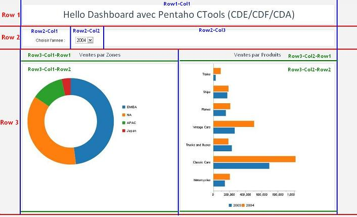
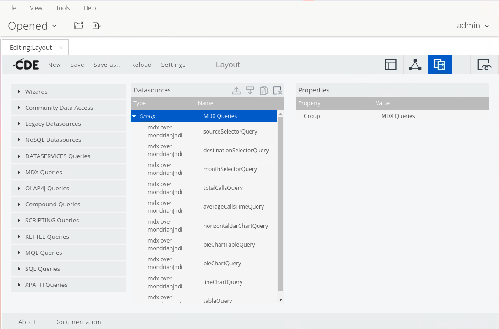
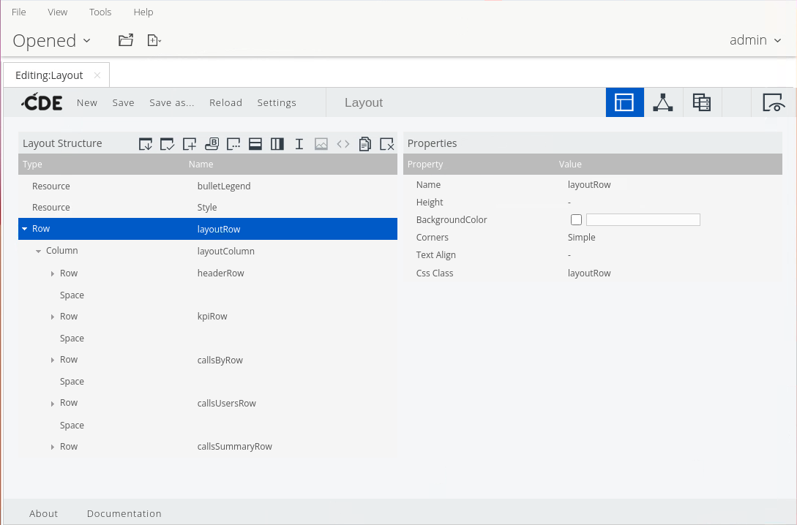
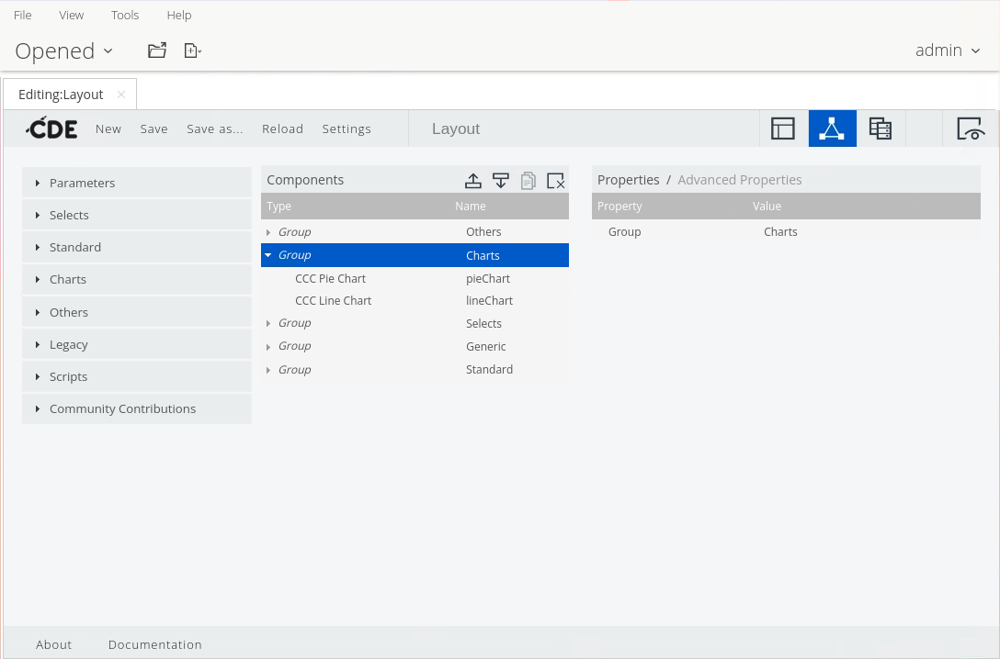
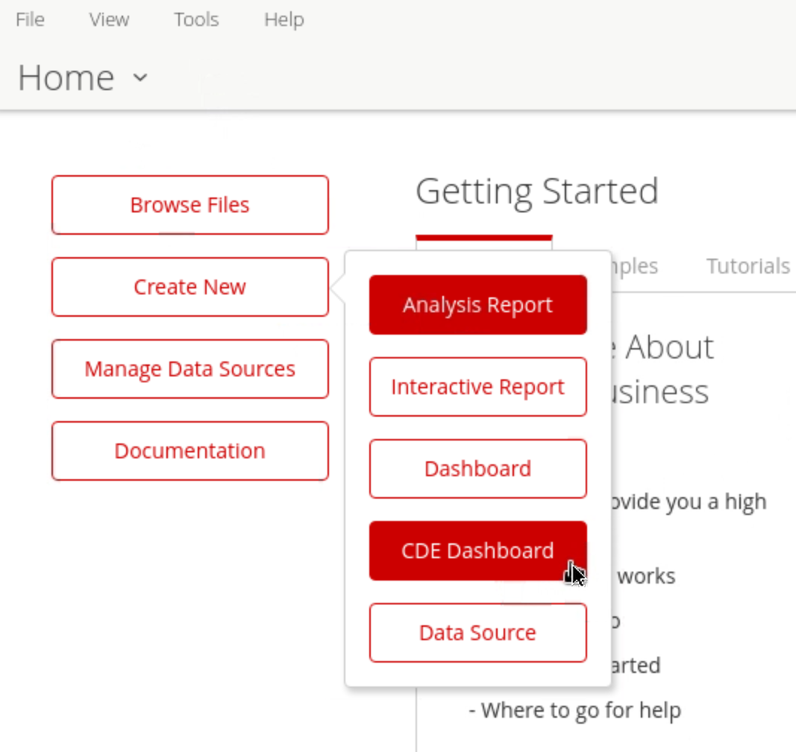

# Getting Started

<div class="pcm-intro">

Pentaho **Community Tools (CTools)** are a stack of open-source tools installed on top of the **Pentaho Server**. The stack covers the full dashboard lifecycle: **CDA** unifies access to your data sources, **CDF** and **CDE** build the dashboards (framework and graphical editor), **CCC** renders the charts, and **CGG** exports those charts as server-side images. This page introduces each component and walks through enabling CDE & CDA on the server.

</div>

> **Note:** Pentaho Community Tools is a stack of open-source tools, installed on top of the Pentaho Server and are commonly referred to as CTools.

<figure><figcaption><p>Component breakdown of a Pentaho CTools dashboard.</p></figcaption></figure>

## Components

:::: tabs

### CDA

> **Note:**
>
> [**Community Data Access (CDA)**](/pentaho-ctools/c-tools/community-data-access)
>
> Enables you to gather and combine data from several data sources into a single structure, which you can then use in dashboards. Driven by the need to unify access to the Pentaho data layer, CDA was developed to create an abstraction layer between a CTools dashboard and the physical connections to different databases.
>
> CDA has three main objectives:
>
> - Combine data from several sources
> - Ensure security while accessing the data (avoiding, for instance, SQL injection problems)
> - Ease data exports

<figure><figcaption><p>CDA data sources</p></figcaption></figure>

### CDF

> **Note:**
>
> [**Community Dashboard Framework (CDF)**](/pentaho-ctools/c-tools/community-dashboard-framework)
>
> Allows BA developers to quickly and easily create dynamic dashboards. Users can explore and understand large amounts of data using a variety of charts, tables, and other components and then "drill down" to the exact data they want.
>
> The framework creates dashboards leveraging web technologies such as JavaScript, CSS, and HTML; allowing the dashboard designer to control the dashboard's whole lifecycle without resorting to Java coding.
>
> CDF has five main advantages:
>
> - Based in open source technology
> - Uses popular web technologies, such as Ajax, HTML, and CSS3
> - Manages the components' lifecycles and interactions between them
> - Separates the HTML design from the component definition
> - Allows for extensibility

`.xcdf` file that calls `myFirstDashboard.html`:

```xml
<?xml version="1.0" encoding="UTF-8"?>
<cdf>
  <title>My first dashboard!</title>
  <author>My Name</author>
  <description>My first dashboard!</description>
  <icon></icon>
  <template>myFirstDashboard.html</template>
  <style>clean</style>
  <require>true</require>
</cdf>
```

### CDE

> **Note:**
>
> #### [Community Dashboard Editor (CDE)](/pentaho-ctools/c-tools/community-dashboard-editor)
>
> Whereas CDF is a development framework directed at users with JavaScript and HTML skills, Community Dashboard Editor (CDE) is a graphical dashboard editor which provides access to the dashboard components in CDF.
>
> This tool uses a grid for the layout which enables users to create their own dashboards without needing a lot of JavaScript or HTML expertise. CDE aims to simplify the creation and addition of CTools dashboards.

<figure><figcaption><p>Layout Structure</p></figcaption></figure>

### CCC

> **Note:**
>
> [Community Chart Components (CCC)](/pentaho-ctools/c-tools/community-dashboard-editor)
>
> Allows dashboard designers to create powerful and custom charts for their dashboards. Essentially, it is a visualization library built on top of [Protovis](http://mbostock.github.com/protovis), a powerful open source data visualization library based in scalable vector graphics (SVG).
>
> The included default options can be bolstered with features in CDE, or an advanced user can pass extension points via Protovis commands to enhance chart components in dashboards.

<figure><figcaption><p>Chart Components</p></figcaption></figure>

### CGG

> **Note:**
>
> [Community Graphics Generator (CGG)](/pentaho-ctools/c-tools/community-graphics-generator)
>
> Allows you to export CCC charts as images which are then available for Pentaho reports. Additionally, this plugin renders the CCC charts in browsers which might have limited capacity for rendering SVG images. In summary, this component is able to draw, within the server, exactly the same chart which is shown in the CTools dashboard using your web browser.
>
> CGG has three main features:
>
> - Fully integrated with CDE
> - Rendering charts via a URL
> - Running SVG-based charts and then converting them into images

<figure><figcaption><p>CCG</p></figcaption></figure>

### Enable CDE & CDA

> **Note:** To activate the Community Dashboard Editor (CDE) plugin, you will need to change the configuration of several `.xml` files in the Pentaho solutions folder as described below. Verify that you have the appropriate permissions to read, write, and execute commands in the specified directories in the instructions.

1. Ensure the Pentaho Server is stopped.

```bash
cd
cd /opt/pentaho/server/pentaho-server
sudo ./stop-pentaho.sh
```

2. Uncomment the following lines:

`/opt/pentaho/server/pentaho-server/pentaho-solutions/system/pentaho-cdf-dd/plugin.xml`

```bash
cd
cd /opt/pentaho/server/pentaho-server/pentaho-solutions/system/pentaho-cdf-dd
sudo nano plugin.xml
```

3. Locate the following two commented blocks in this file and remove the comment tags from these blocks.

```xml
<operation>
    <id>EDIT</id>
    <perspective>wcdf.edit</perspective>
</operation>
```

```xml
<overlays>
    <overlay id="launch" resourcebundle="content/pentaho-cdf-dd/lang/messages">
        <button id="launch_new_cde" label="${Launcher.CDE}" command="Home.openFile('${Launcher.CDE}', '${Launcher.CDE_TOOLTIP}', 'api/repos/wcdf/new');$('#btnCreateNew').popover('hide');"/>
    </overlay>
    <overlay id="startup.cde_dashboard"  resourcebundle="content/pentaho-cdf-dd/lang/messages" priority="1">
        <menubar id="newmenu">
            <menuitem id="new-cde_dashboard" label="${Launcher.CDE}" command="mantleXulHandler.openUrl('${Launcher.CDE}','${Launcher.CDE_TOOLTIP}','api/repos/wcdf/new')" />
        </menubar>
    </overlay>
</overlays>
```

4. Save.

```text
CTRL + O
Enter
CTRL + X
```

5. Uncomment the following lines:

`/opt/pentaho/server/pentaho-server/pentaho-solutions/system/pentaho-cdf-dd/settings.xml`

```bash
cd
cd /opt/pentaho/server/pentaho-server/pentaho-solutions/system/pentaho-cdf-dd
sudo nano settings.xml
```

6. Locate the block at end of the file, 'Defining the new-toolbar-button' and remove the comment tags from this block.

```xml
<new-toolbar-button>1,New CDE Dashboard,CDE Dashboard,api/repos/wcdf/new</new-toolbar-button>
```

7. Locate the block at end of the file, 'Defining the new-toolbar-button' and remove the comment tags from this block.
8. Save.

```text
CTRL + O
Enter
CTRL + X
```

9. Restart the Pentaho Server.

```bash
cd
cd /opt/pentaho/server/pentaho-server
sudo ./start-pentaho.sh
```

#### Community Dashboard Editor (CDE)

To verify CDE is activated, do the following.

1. Log on to the [Pentaho User Console](https://help.pentaho.com/Documentation/8.0/Setup/Evaluation/Tutorials/0D0/020).
2. From the Home page, click the **Create New** button.
3. From the menu that displays, select the **New CDE Dashboard** option. You can now begin creating your first CDE dashboard.

<button data-launch="puc">Open Pentaho User Console</button>

<figure><figcaption><p>CDE Dashboard option</p></figcaption></figure>

::::
