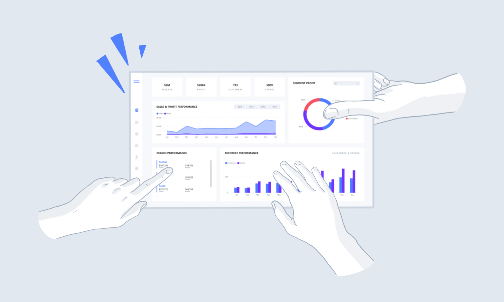
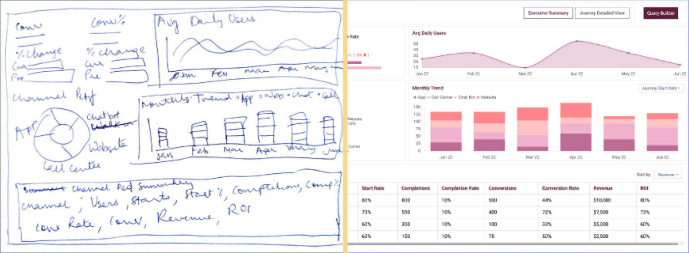
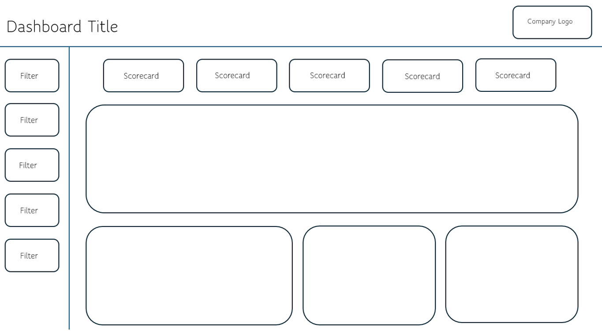

# First Steps

> **Warning:**
>
> #### Workshop - First Steps
>
> Before diving into dashboard development, several preparatory steps are essential. Begin by gathering comprehensive requirements from stakeholders. Next, analyze which visualization methods will most effectively communicate the data. Then, create detailed mockups to establish the dashboard's design. Following this, break down the necessary components and identify relevant data sources.
>
> Only after completing these preliminary phases should you proceed with the actual dashboard development. This workshop walks you through that groundwork - requirements gathering, mock-up design, and functional breakdown - so you build exactly what stakeholders need before writing a single line of dashboard code.
>
> **What you'll do**
>
> * Gather comprehensive requirements from stakeholders and identify their pain points
> * Understand how different stakeholder groups require different levels of information
> * Evaluate data visualization options and select the right charts for the story
> * Create wireframes and mock-ups that preview the final dashboard
> * Produce a functional breakdown document detailing components, queries, and parameters
>
> **Prerequisites:** Access to the Pentaho User Console; a modern web browser; basic familiarity with dashboards and business reporting concepts
>
> **Estimated time:** 30 minutes

<figure><figcaption></figcaption></figure>

***

Follow the guide below to work through the preparatory steps before building a dashboard:

:::: tabs

### 1. Requirements

> **Note:**
>
> Building an effective dashboard starts with a strong foundation. First, sit down with stakeholders to understand their exact needs and pain points. Then, carefully evaluate your data visualization options - whether charts, graphs, or other displays will tell the story best.
>
> Create wireframes and mockups to give everyone a concrete preview of the final product. Map out the technical architecture by defining your components and confirming your data sources are reliable and accessible. With this thorough groundwork in place, you can confidently move forward with development, knowing you're building exactly what's needed.

Consider the following points:

#### Target Audience

> **Note:**
>
> Different stakeholders require different levels of information:
>
> * **Executives**: Need high-level metrics and trend analysis for quick decision-making
> * **Department Managers**: Want both company-wide insights and detailed data for their specific areas
> * **Technical Staff**: Require granular, detailed information for operational tasks

#### User Expectations

> **Note:**
>
> Success depends on delivering the right information to the right people. Key questions to consider:
>
> * What specific metrics matter most to each user group?
> * How will they use this information in their daily work?
> * What format and level of detail best serves their needs?

#### Existing Systems

> **Note:**
>
> #### Existing Systems
>
> When replacing current reporting tools:
>
> * Obtain copies of existing reports and dashboards
> * Analyze their format, content, and usage patterns
> * Identify opportunities for improvement
> * Use current reports as a baseline for understanding data requirements

#### Dashboard Design

> **Note:**
>
> #### Key Dashboard Design Considerations
>
> * **UI Consistency** - Adhere to existing company UI guidelines for colours, fonts, and layouts when possible. This approach maintains visual consistency and allows users to focus on data rather than adjusting to new design elements, while still following fundamental UI design principles.
> * **Content Strategy** - Prioritize displaying essential KPIs, insights, and trends that enable quick information access. The dashboard should serve as an efficient overview of critical metrics while maintaining clarity and purpose.
> * **Data Granularity and Interaction**
>   * Determine appropriate levels of data detail
>   * Enable drill-down capabilities for deeper analysis (e.g., investigating declining sales)
>   * Consider performance implications when deciding detail levels
>   * Implement intuitive click-through functionality for accessing additional information
> * **Filtering Framework**
>   * Implement dashboard-wide filters for consistent data views
>   * Create section-specific filters where necessary
>   * Include essential time range controls (e.g., last hour, 7 days, 30 days)
>   * Ensure filters align with available data granularity
> * **Visualization Selection** - Choose visualizations based on:
>   * Data volume and complexity
>   * Intended message and insights
>   * User comprehension speed
>   * Information density requirements
>   * Data to be displayed to users with different roles

> **Note:** The key is creating an intuitive interface where users can quickly understand and act on the presented data without requiring extensive training or explanation.

### 2. Mock-up

> **Note:**
>
> Dashboard mockups are visual representations of how a data dashboard will look and function before actual development begins. They help stakeholders visualize the final product, arrange UI elements effectively, and iterate on design decisions without investing development resources.
>
> A good dashboard mockup considers data visualization placement, user workflow, information hierarchy, and interactive elements while maintaining clean, intuitive design principles.

<figure><figcaption>
Dashboard - Mock up
</figcaption></figure>

Popular tools for creating dashboard mockups include:

* [Figma](https://www.figma.com/) - Industry-standard design tool with real-time collaboration
* [PowerMockup](https://www.powermockup.com/) - PowerPoint add-in
* [Balsamiq](https://balsamiq.com/) - Great for quick, low-fidelity wireframes

There are also quite a few AI tools emerging.

### 3. Functional Breakdown

> **Note:**
>
> After completing the dashboard design, the next step is creating a functional breakdown document. This document details each dashboard section's components, queries, and parameters, along with estimated development time for each task.
>
> The functional breakdown serves multiple purposes: it helps track planned versus completed work, provides a comprehensive overview of technical requirements, and specifies query structures including column names and data types. While creating this documentation requires initial investment, it streamlines development by clarifying requirements, identifying potential issues early, and surfacing important questions.
>
> This approach is particularly valuable for team projects, as it provides clear direction and ensures all team members understand their responsibilities and implementation requirements.

<figure><figcaption>
Functional breakdown
</figcaption></figure>

::::

<button data-launch="puc">Open Pentaho User Console</button>
