# My First Dashboard

> **Warning:**
>
> #### Workshop - My First Dashboard
>
> Building effective dashboards is both an art and a science, requiring the ability to transform complex data into clear, actionable insights through compelling visualizations. In this comprehensive workshop, you'll master the Community Dashboard Editor (CDE), learning how to create professional, interactive dashboards that leverage Pentaho's powerful OLAP capabilities and the flexibility of CTools components. Using the SteelWheels sample dataset, you'll build a complete dashboard from the ground up, gaining hands-on experience with layout design, chart creation, and component configuration that forms the foundation for all enterprise dashboard development.
>
> In this hands-on workshop, you'll experience the complete dashboard development lifecycle, starting with template selection and progressing through layout customization, data connection configuration, and chart component implementation. You'll learn how to work with CDE's three core perspectives - Layout, Components, and Data Sources - to create a cohesive, visually appealing dashboard that presents sales data across multiple dimensions including territory, product line, and time.
>
> As you work through the exercises, you'll master essential techniques for customizing headers and footers with HTML, configuring OLAP connections to Mondrian cubes, and fine-tuning chart properties to create polished, professional visualizations. You'll also gain practical experience with database connectivity, learning how to establish and test JDBC connections that power your dashboard's data queries.
>
> **What you'll do**
>
> * Launch the Community Dashboard Editor and select an appropriate dashboard template
> * Customize dashboard layout structure including rows, columns, and panel containers
> * Design professional headers and footers with HTML content and corporate branding
> * Configure color schemes and styling to create visually consistent dashboards
> * Connect to OLAP data sources using the SteelWheels Mondrian schema
> * Understand the relationship between OLAP cubes, dimensions, levels, and measures
> * Create multiple chart types using the OLAP Chart Wizard (pie, line, and bar charts)
> * Configure chart component properties including titles, legends, and dimensions
> * Adjust panel heights and alignments for optimal visual presentation
> * Establish JDBC database connections for direct SQL query access
> * Install and configure JDBC drivers for MariaDB connectivity
> * Test and validate database connections through the Pentaho User Console
> * Save and publish completed dashboards to the Pentaho repository
> * Preview and iterate on dashboard design to achieve professional results
>
> **Prerequisites:** Pentaho Business Analytics Server with CTools installed; SteelWheels sample data and Mondrian schema configured; MySQL JDBC driver available for download
>
> **Estimated time:** 30 minutes

<figure>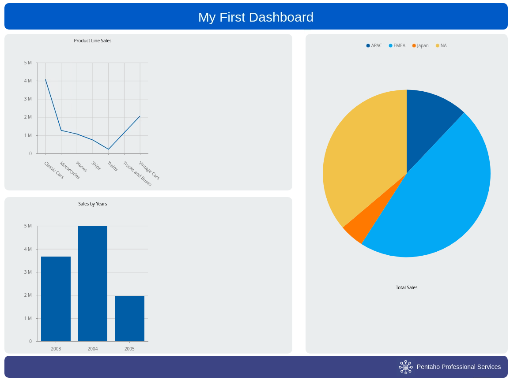<figcaption><p>My First dashboard</p></figcaption></figure>

***

Before you begin, start the Pentaho Server and open the Pentaho User Console.

> **Note:**
>
> #### Linux
>
> ```bash
> cd
> cd /opt/pentaho/server/pentaho-server/
> sudo ./start-pentaho.sh
> ```

<button data-launch="puc">Open Pentaho User Console</button>

***

Follow the guide below to build your first dashboard:

:::: tabs

### 1. CDE - Layout

> **Note:**
>
> #### To create a New Dashboard
>
> Don't worry about all the features & options .. We'll be diving into each perspective in the next set of workshops.

1. Log in to Pentaho Server -> Create New -> CDE Dashboard.

<figure>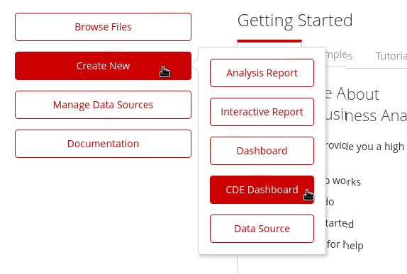<figcaption><p>New CDE Dashboard</p></figcaption></figure>

2. Click on the Template option.

<figure>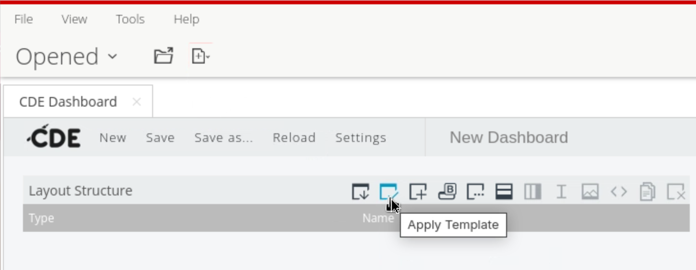<figcaption><p>Apply a Template</p></figcaption></figure>

3. Select: Two x One Template.

<figure>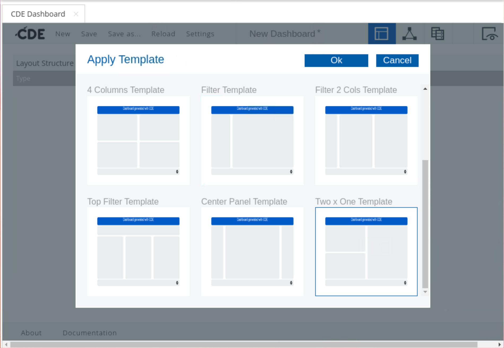<figcaption><p>Apply a Template - Two x One</p></figcaption></figure>

> **Note:**
>
> The resulting Dashboard is composed of:
>
> * 5 main rows
> * body row is split into 2 columns
> * the first column is split into a further 3 rows
> * the first & third rows have columns which hold Panel_1 & Panel_2
> * Panel_3 is held in the second column
> * further rows define header, footer and spacers

<figure>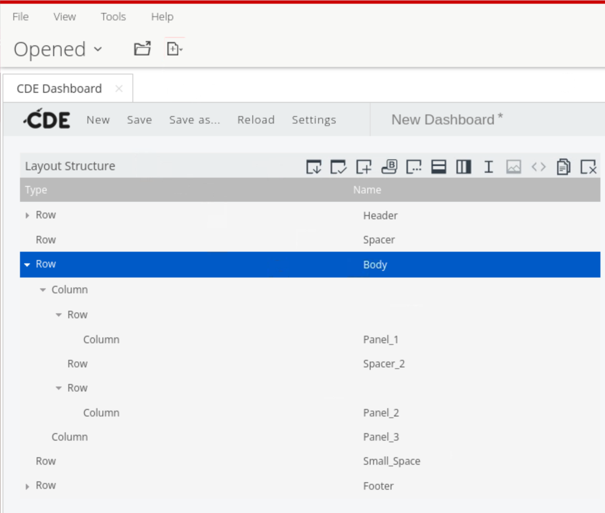<figcaption><p>CDE Layout - Two x One</p></figcaption></figure>

4. Click on 'Save as ..' in the toolbar & enter the required details.

<figure>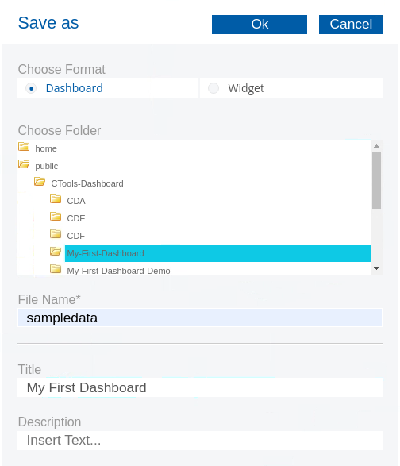<figcaption><p>Save as ..</p></figcaption></figure>

5. Preview the dashboard (eye icon - top right).

<figure>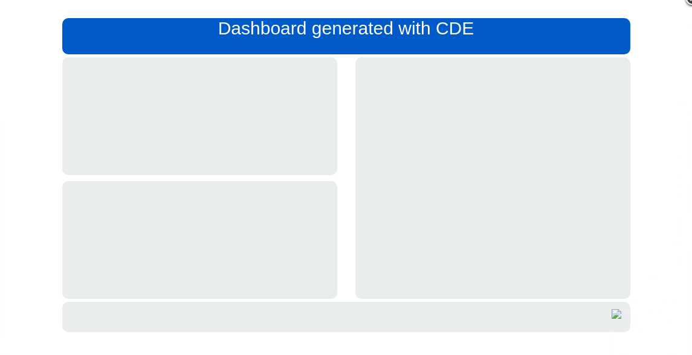<figcaption><p>Dashboard template - preview</p></figcaption></figure>

### 2. Header & Footer rows

> **Note:**
>
> #### Header & Footer rows
>
> Let's start with the Header & Footer rows..

#### Header Row

1. Expand the Header row until you reach the HTML Property.
2. Click on the ... and edit the HTML - we're going to enter some padding to align the text.

```html
<h2 style="color:#FFFFFF; padding: 15px 0">My First Dashboard</h2>
```

3. Click on the Preview icon - last one in toolbar.

<figure>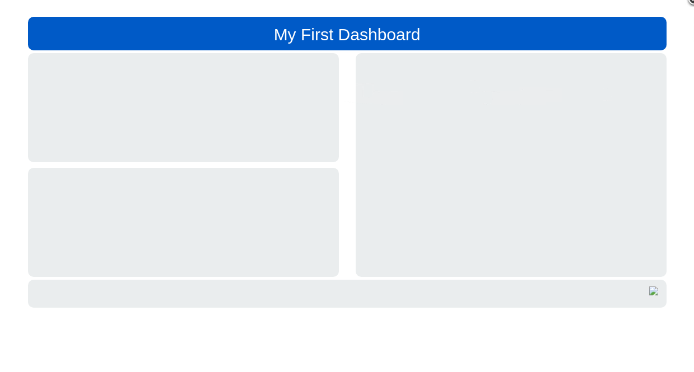<figcaption><p>Preview dashboard</p></figcaption></figure>

***

#### Footer

1. Create a folder: /resources/img
2. Upload: logo_pentaho.png
3. Expand the Footer row until you reach the HTML property.
4. Edit the HTML.

```html
<a style="position:relative;top:5px; right:15px; float:right; color:#FFFFFF;" border="0" title="Pentaho Professional Services" href="https://pentaho.com/pentaho-professional-services/">
    Pentaho Professional Services</a>
```

5. Change the Footer column color to match the logo.

<figure>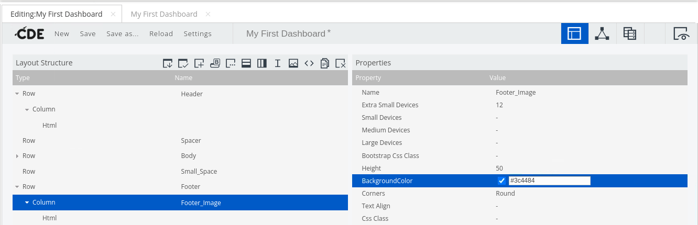<figcaption></figcaption></figure>

```
BackgroundColor: #3c4484
```

> **Warning:** Don't forget to click on the color wheel ..

<figure>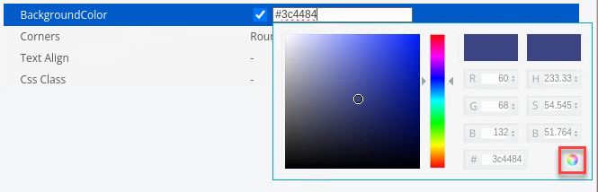<figcaption><p>Color picker</p></figcaption></figure>

6. Save & Preview the dashboard.

<figure>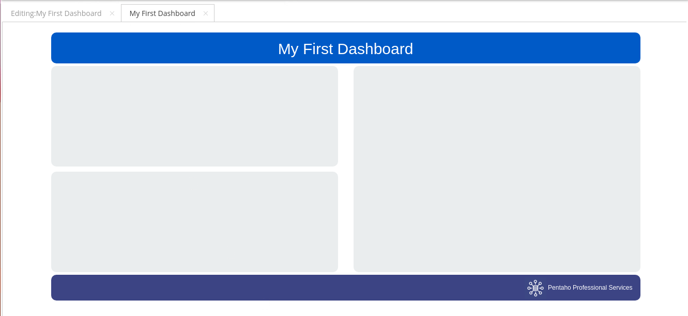<figcaption><p>Dashboard Layout - Header & Footer</p></figcaption></figure>

### 3. Charts

> **Note:**
>
> #### Charts
>
> Bit of background info ..
>
> Schema Workbench is a Pentaho Design Tool used to define a multidimensional MDX schema.
>
> * Cube - is the FACT table in a STAR schema.
> * Dimensions - map to the database tables.
> * Levels - map to the database columns in the table. The order defines the 'paths' you can take to 'slice & dice' the data.

<figure>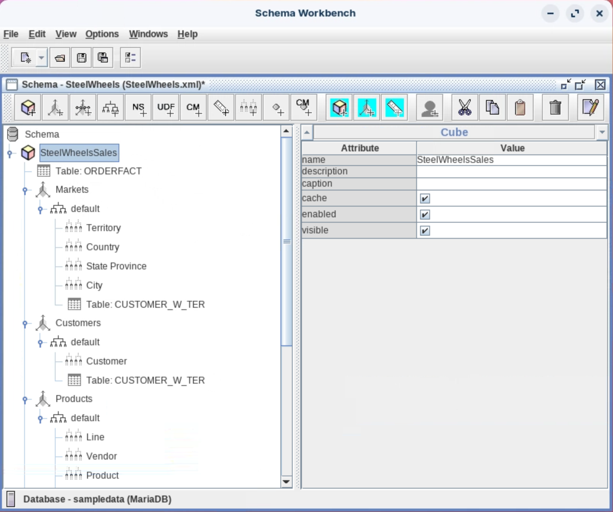<figcaption><p>SteelWheelsSales OLAP Schema</p></figcaption></figure>

> **Note:**
>
> If you need to 'slice & dice' your data, then you will have spent many hours in Schema Workbench, defining your OLAP reporting cubes.
>
> CTools - OLAP Chart Wizard - can leverage the schema.xml that connects to the underlying sampledata database tables.
>
> You can test MDX queries against your cubes..

<figure>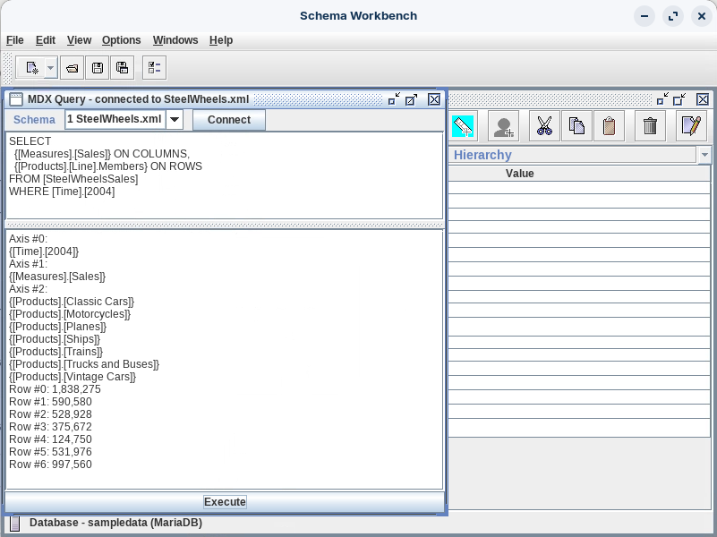<figcaption><p>MDX Query</p></figcaption></figure>

***

#### Add a Chart

1. Select: Connection Perspective.

<figure>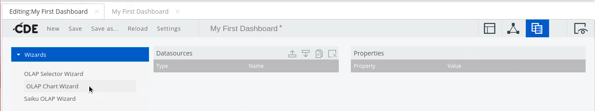<figcaption><p>Connection Perspective</p></figcaption></figure>

2. Click on OLAP Chart Wizard & enter the following details:

<figure>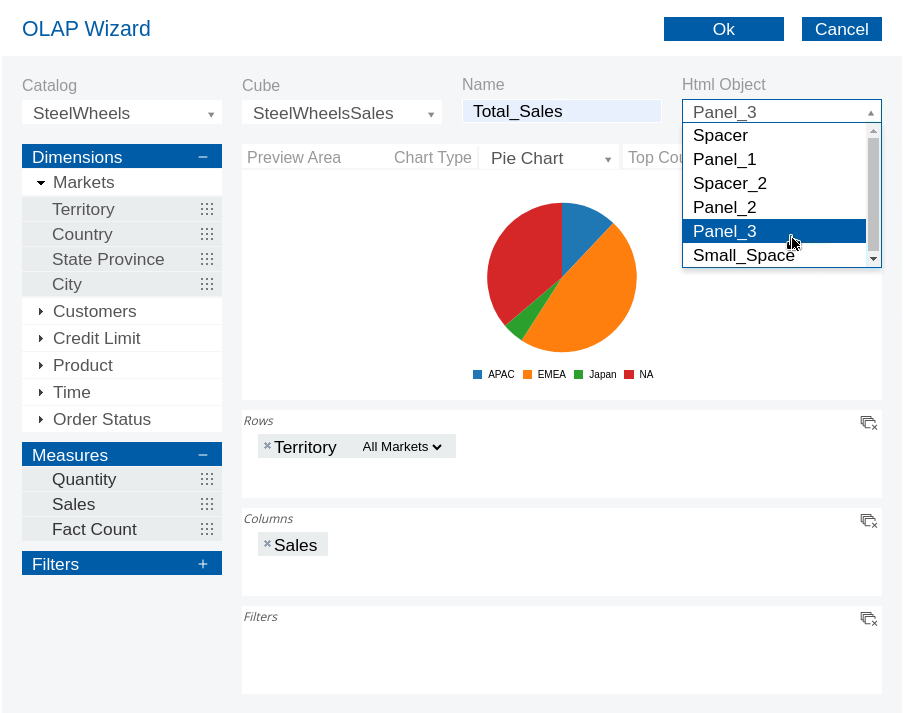<figcaption><p>Pie Chart - Total Sales</p></figcaption></figure>

| Property | Value |
| --- | --- |
| Name | Total_Sales |
| Html Object | Panel_3 |
| Catalog | SteelWheels |
| Cube | SteelWheelsSales |
| Dimensions | Territory |
| Measures | Sales |

3. Click OK.
4. Save & Preview dashboard.

<figure>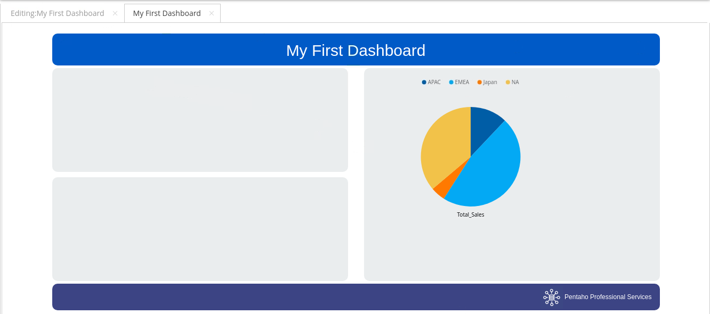<figcaption><p>Panel_3 - Total sales</p></figcaption></figure>

> **Note:**
>
> Looks like we may need to apply a few tweaks to align and so on ..
>
> Let's add our other Charts and then take a look at the Chart Components.

5. Again .. Click on the OLAP Chart Wizard & enter the following details:

<figure>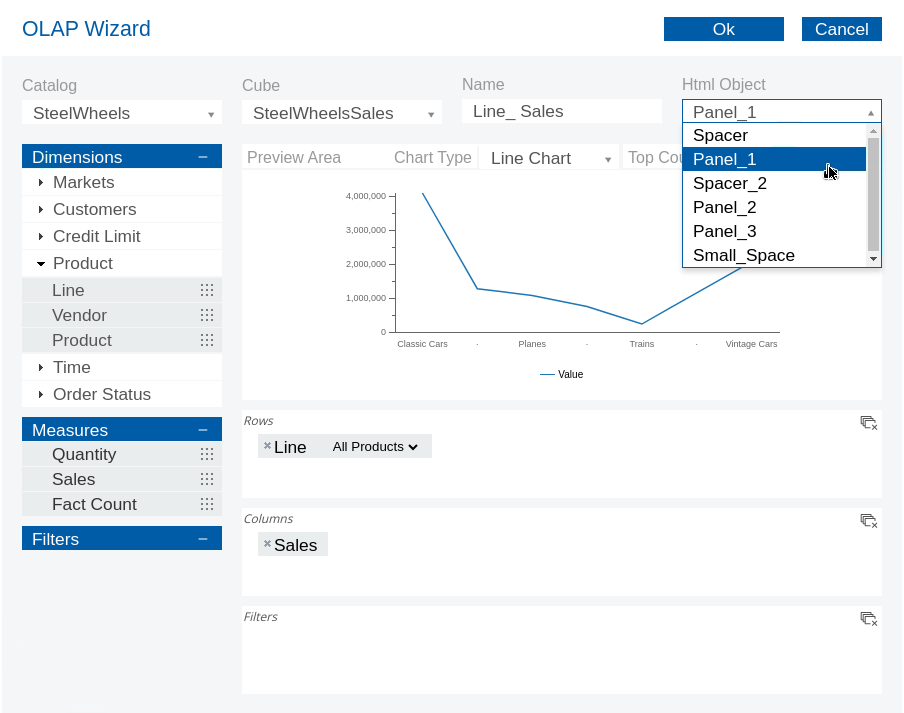<figcaption><p>Line Chart - Line sales</p></figcaption></figure>

| Setting | Value |
| --- | --- |
| Name | Line_Sales |
| Html Object | Panel_1 |
| Catalog | SteelWheels |
| Cube | SteelWheelsSales |
| Dimensions | Line |
| Measures | Sales |

6. Click OK.
7. Save.
8. Again .. Click on the OLAP Chart Wizard & enter the following details:

| Property | Value |
| --- | --- |
| Name | Years_Sales |
| Html Object | Years_Sales |
| Catalog | SteelWheels |
| Cube | SteelWheelsSales |
| Dimensions | Years |
| Measures | Sales |

9. Save and Render.

<figure>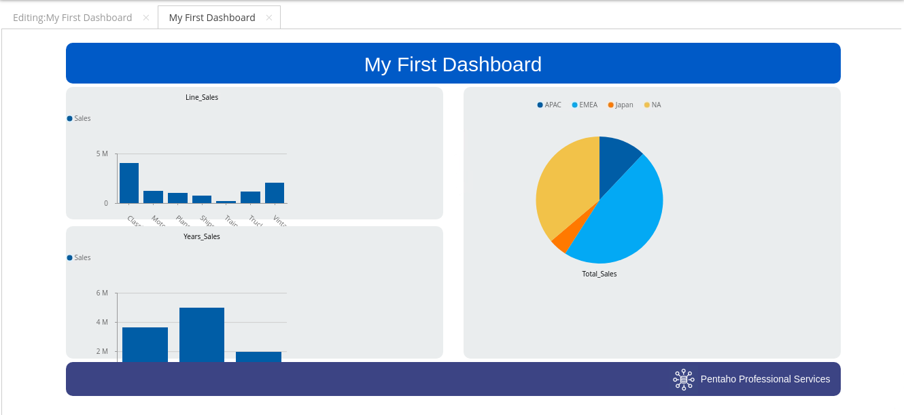<figcaption><p>My First Dashboard</p></figcaption></figure>

***

> **Note:** These components are configured with a set of Properties.

#### Chart Component

1. Click on the Components option in the toolbar.

<figure>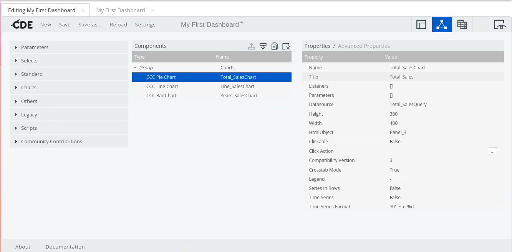<figcaption><p>Chart Components</p></figcaption></figure>

> **Note:** As you can see .. the Wizard has automatically added 3 Chart components with their associated properties.

2. Highlight the CCC Pie Chart Component.
3. Edit the following property values:

| Property | Value |
| --- | --- |
| Title | Total Sales |
| Height | 400 |

4. Highlight the CCC Line Chart Component.
5. Edit the following property values:

| Property | Value |
| --- | --- |
| Title | Product Line Sales |
| Legend | False |

6. Highlight the CCC Bar Chart Component.

| Property | Value |
| --- | --- |
| Title | Yearly Sales |
| Legend | False |

7. Again Save & Preview the dashboard.

### 4. Final Layout

> **Note:**
>
> #### Final Layout
>
> Unless you have previously created the Charts, you will need to make some adjustments to the Layout.

1. Click on the Layout option and enter the following details:

| Layout Structure | Property | Value |
| --- | --- | --- |
| Row 3 Body | Height | 720 |
| Column 1-1 Row 1 | Height | 360 |
| Column Panel_1 | Height | 355 |
| Row 3-3 | Height | 360 |
| Column 1-2 Panel_2 | Height | 355 |
| Column 2 Panel_3 | Height | 725 |
|  | Text Align | Center |

### 5. JDBC Connection

> **Note:**
>
> #### JDBC Connection
>
> The Steel Wheels Inc sampledata dataset resides on a MariaDB.
>
> Based on the ER diagram, we can build our SQL Query, restricting to YR 2004.

<figure>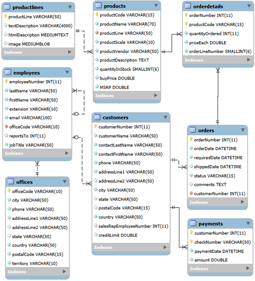<figcaption><p>ER - sampledata</p></figcaption></figure>

1. Download the MariaDB JDBC driver.

<div class="pcm-embed-card" data-href="https://dbschema.com/databases.html" data-title="DbSchema Supported Databases" data-description="Explore all SQL and NoSQL databases supported by DbSchema. Visually design schemas, create ER diagrams, synchronize changes, and document your database — for any database engine." data-thumb="../_assets/embeds/6c6ef7a1bcc8.png"></div>
2. Stop the Pentaho Server.

> **Danger:**
>
> ```bash
> cd
> cd /opt/pentaho/server/pentaho-server/
> sudo ./stop-pentaho.sh
> ```

3. Copy the driver to the `~/opt/pentaho/server/pentaho-server/tomcat/lib/` directory.
4. Restart the Pentaho Server.

> **Note:**
>
> ```bash
> cd
> cd /opt/pentaho/server/pentaho-server/
> sudo ./start-pentaho.sh
> ```

<button data-launch="puc">Open Pentaho User Console</button>

5. Once logged in select: Manage Data Sources.
6. Click on the Cog wheel and from the drop-down menu, select: New Connection.

<figure>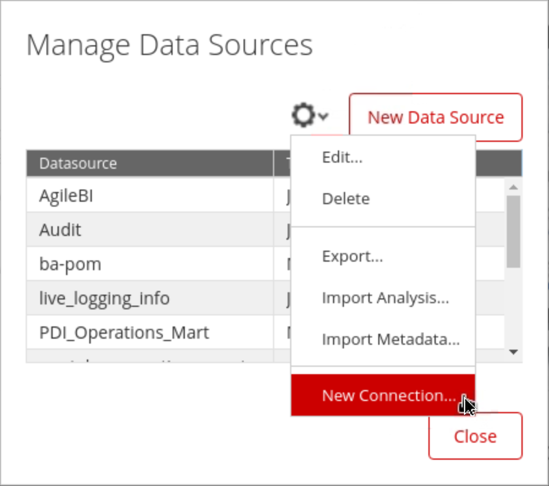<figcaption><p>New Connection</p></figcaption></figure>

7. Enter your connection details in the selected database panel.

<figure>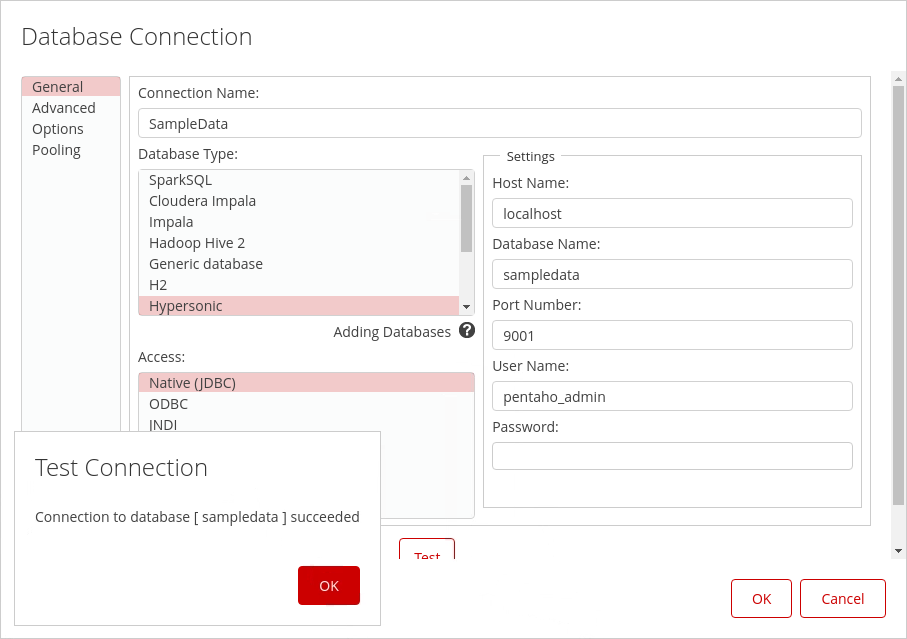<figcaption><p>Database connection - SampleData</p></figcaption></figure>

8. Test the database connection.

> **Success:** Your dashboard is built and your JDBC connection is verified in the Pentaho User Console. You now have a complete SteelWheels sales dashboard with layout, OLAP charts, and a working database connection.

> **Warning:** If connecting to a Mondrian schema, ensure the connection name is the same as the schema connection name.

::::
