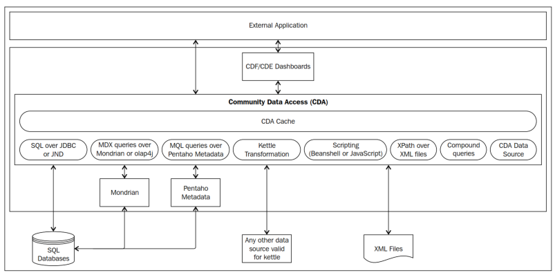
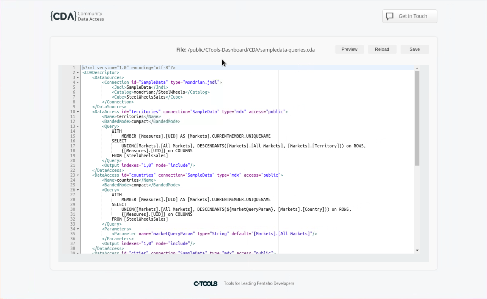

# Creating a CDA

> **Warning:**
>
> #### Workshop - Creating a CDA
>
> CDA (Community Data Access) is a CTools component that provides data abstraction for diverse data sources through web services. While it was initially developed to serve as a bridge between data connections and the Community Dashboard Framework (CDF), its functionality has expanded. Now, it can also be integrated with Report Designer to incorporate data into third-party applications.
>
> In this hands-on workshop, you'll learn how a CDA file is structured, how to author one by hand, and how to wire up each of the supported data source types - from SQL and Mondrian through to Kettle transformations, scripting, XPath and compound queries. You'll then make your queries dynamic with parameters and learn how to call them directly over the CDA Web API, so that any external application can consume the data without CDF or CDE.
>
> By the end of this workshop, you'll understand the anatomy of a `.cda` descriptor, the mandatory connection and data access attributes, how caching and output ordering work, and how to expose your queries as web service endpoints.
>
> **What you'll do**
>
> * Understand the CDA data flow and its supported data sources
> * Author a `.cda` file by hand, defining connections and data access blocks
> * Configure SQL (JDBC/JNDI), Mondrian, Metadata, Kettle, Scripting, XPath and Compound queries
> * Parameterise queries with the `${parameter}` syntax and the available parameter types
> * Call CDA queries over the Web API (`doQuery`, `listQueries`, `listParameters`, and more)
>
> **Prerequisites:** A running Pentaho Server with the CTools plugins installed; basic familiarity with SQL/MDX; access to the SampleData / SteelWheels sample database.
>
> **Estimated time:** 45 minutes

<figure><figcaption><p>Community Data Access</p></figcaption></figure>

> **Note:**
>
> CDA's data flow works as follows. When a dashboard (CDF/CDE) or external application requests data through CDA's endpoints:
>
> * CDA first checks if caching is enabled.
> * If enabled, it verifies whether results for this specific query and parameters exist in cache, whether cached results are still valid (not expired), and if cache keys match.
> * Only if no valid cached data is found does CDA query the underlying data sources.
>
> This architecture makes CDA an efficient middleware layer that minimizes unnecessary database queries while providing flexible data access to various front-end applications.

> **Note:**
>
> As we can see in the diagram, the available data sources for CDA are:
>
> * SQL over JDBC or JNDI.
> * MDX queries over Mondrian or olap4j.
> * MQL queries over a Pentaho metadata connection.
> * Kettle transformations.
> * Scripting (only Beanshell and JavaScript are currently supported).
> * XPath over XML files.
> * Compound queries.
>
> CDA examples: **/public/CTools-Dashboard/CDA**

> **Note:** There are multiple ways to create CDA data sources. One way is to use CDE, where no code or XML is needed - we cover this later in the CDE workshop. There is another way, the hard way, which is editing the file by hand.

> **Note:**
>
> #### Start Pentaho Server
>
> Make sure the Pentaho Server is running before you preview or edit CDA files.
>
> #### Windows (PowerShell)
>
> ```powershell
> cd \
> cd Pentaho/server/pentaho-server/
> ./start-pentaho.bat
> ```
>
> #### Linux
>
> ```bash
> cd
> cd Pentaho/server/pentaho-server/
> ./start-pentaho.sh
> ```

<button data-launch="puc">Open Pentaho User Console</button>

***

Follow the guide below to author and use a **CDA** file:

:::: tabs

### 1. Create the CDA

> **Note:**
>
> #### Create the CDA
>
> The CDA files are XML files with a `.cda` extension. This way, Pentaho will recognize the file extension and will provide the capability to preview the results or edit the file. The main structure of a CDA file is the following:

```xml
<?xml version="1.0" encoding="UTF-8"?>
<CDADescriptor>
   <DataSources>
      <!-- HERE LIVES EACH ONE OF <Connection> -->
   </DataSources>
   <!-- HERE LIVES EACH ONE OF <DataAccess> -->
</CDADescriptor>
```

> **Note:**
>
> `xml` files begin with an XML declaration, followed by structured elements that define connections and data access configurations. The primary element is `CDADescriptor`, which contains data source definitions that can be shared across multiple queries.
>
> Rather than repeatedly defining database connections within individual queries, we centralize connection settings in the data source element. This makes sense since multiple queries often use the same connection parameters.
>
> Each data access definition requires specific attributes to be set:
>
> * XML declaration at the top
> * `CDADescriptor` as the root element
> * Data source elements containing shared connection settings
> * Individual data access configurations with their required attributes

#### Mandatory Connection Attributes

> **Note:**
>
> **ID**
>
> * Defines a unique identifier
> * Used to reference specific connections in queries
> * Must be unique across all connections
>
> **Type**
>
> * Specifies the connection type
> * Determines required internal elements
> * In CDE: Automatically configured based on selected data source

#### Creating Data Access

Once connections are established, proceed to create data access queries. Each query should follow this structure:

```xml
<DataAccess id="1" connection="1" type="sql" access="private"
            cache="true" cacheDuration="300">
   ...
</DataAccess>
```

| Attribute | Description |
| --- | --- |
| id | This is used to define the data access identifier that will be used in the components. |
| connection | This is the identifier of the connection created previously. Different DataAccess id can share the same connection id. |
| access | This defines whether the data access is visible. Here we can have one of two values: private or public. Private will say that the data access will not be visible, and public says the opposite. You may want to define that a data source is private when it is just to be used inside compound queries to create unions or joins between queries. |
| cache | This defines whether the results of the query will be cached. Possible values are true and false. You should set it to true if you want your query to be cached. The default value is true. |
| cacheDuration | This defines the cache duration in seconds. The query will be executed again after the specified seconds have passed, and the results cached again. This attribute will be ignored when the cache is set to false. The default value is 3600, the same as one hour expressed in seconds. |
| type | We have the same goal when defining a connection and a Data Access, but they have different purposes, so we also need to specify the query type. |

Here's an outline of a connection and data access using a JSON query:

```xml
<?xml version="1.0" encoding="UTF-8"?>
<CDADescriptor>
   <DataSources>
      <Connection id="query" type="scripting.scripting">
         <Initscript></Initscript>
         <Language>beanshell</Language>
      </Connection>
   </DataSources>
   <DataAccess access="public" connection="query"
               id="query" type="jsonScriptable">
      <Cache duration="3600" enabled="true"/>
      <Columns/>
      <Parameters/>
      <Query>{
            "resultset":[["row1", 0]],
            "metadata":[
               {"colIndex":0,"colType":"String","colName":"value"},
               {"colIndex":1,"colType":"Integer","colName":"name2"}
            ]}
      </Query>
   </DataAccess>
</CDADescriptor>
```

#### SQL

> **Note:**
>
> SQL databases. You can use this type of connection to get data from any source that uses Structured Query Language (SQL) and that can be reached using a JNDI connection or a JDBC driver.
>
> You can use one of these two kinds:
>
> * `sql.jdbc`: To be utilized when using SQL over JDBC
> * `sql.jndi`: To be utilized when using SQL over JNDI

> **Note:**
>
> When creating a connection of the `sql.jdbc` type, we should also specify the following properties:
>
> * Driver: The Java class name to use (for example, org.postgresql.Driver)
> * URL: The URL to connect to (for example, jdbc:postgresql://localhost:5432/database)
> * User: The username to use
> * Pass: The user's password

```xml
<?xml version="1.0" encoding="utf-8"?>
<CDADescriptor>
    <DataSources>
        <Connection id="1" type="sql.jdbc">
            <Driver>org.hsqldb.jdbcDriver</Driver>
            <Url>jdbc:hsqldb:mem:SampleData</Url>
            <User>sa</User>
            <Pass></Pass>
        </Connection>
    </DataSources>
    <DataAccess id="1" connection="1" type="sql" access="public" cache="true" cacheDuration="300">
        <Name>Sql Query on SampleData - Jdbc</Name>
        <Query>
            select o.YEAR_ID, o.STATUS, sum(o.TOTALPRICE) as price from orderfact o
            where o.STATUS = ${status} and o.ORDERDATE &gt; ${orderDate}
            group by o.YEAR_ID, o.STATUS
        </Query>
        <Parameters>
            <Parameter name="status" type="String" default="Shipped"/>
            <Parameter name="orderDate" type="Date" pattern="yyyy-MM-dd" default="2003-03-01"/>
        </Parameters>
        <Columns>
            <Column idx="0">
                <Name>Year</Name>
            </Column>
            <CalculatedColumn>
                <Name>PriceInK</Name>
                <Formula>=[PRICE]/1000000</Formula>
            </CalculatedColumn>
        </Columns>
        <Settings>
            <Export type="csv" includeTotals="true">
                <Column idx="0" aggregator="None"/>
                <Column idx="1" aggregator="Average"/>
            </Export>
        </Settings>
        <Output indexes="1,0,2,3"/>
    </DataAccess>
</CDADescriptor>
```

> **Note:** When defining the connection for a `sql.jndi` connection, you would need to set the following property: `jndi` - the connection's name as defined in the context.xml file.

```xml
<?xml version="1.0" encoding="utf-8"?>
<CDADescriptor>
    <DataSources>
        <Connection id="1" type="sql.jndi">
            <Jndi>SampleData</Jndi>
        </Connection>
    </DataSources>
    <DataAccess id="1" connection="1" type="sql" access="public" cache="true" cacheDuration="3600">
        <Name>Sql Query on SampleData - Jndi</Name>
        <Query>
            select o.YEAR_ID, o.STATUS, sum(o.TOTALPRICE) as price from orderfact o
            where o.STATUS = ${status} and o.ORDERDATE &gt; ${orderDate}
            group by o.YEAR_ID, o.STATUS
        </Query>
        <Parameters>
            <Parameter name="status" type="String" default="Shipped"/>
            <Parameter name="orderDate" type="Date" pattern="yyyy-MM-dd" default="2004-03-01"/>
        </Parameters>
        <Columns>
            <Column idx="0">
                <Name>Year</Name>
            </Column>
            <CalculatedColumn>
                <Name>PriceInK</Name>
                <Formula>=[PRICE]/1000000</Formula>
            </CalculatedColumn>
        </Columns>
        <Settings>
            <Export type="csv" includeTotals="true">
                <Column idx="0" aggregator="None"/>
                <Column idx="1" aggregator="Average"/>
            </Export>
        </Settings>
        <Output indexes="1,0,2,3"/>
        <Output id="2" indexes="0,1,3"/>
        <Output id="3" indexes="1,0,2"/>
    </DataAccess>
</CDADescriptor>
```

#### Mondrian

> **Note:**
>
> When specifying the type for an MDX connection, we have the following available types:
>
> * `mondrian.jdbc`: To be utilized when using MDX over JDBC
> * `mondrian.jndi`: To be utilized when using MDX over JNDI
> * `olap4j.defaultolap4j`: To be utilized when using MDX over olap4j

> **Note:**
>
> To set a connection of a `mondrian.jdbc` type, the following properties must be defined:
>
> * Driver: The Java class name to use (for example, org.postgresql.Driver)
> * URL: The URL to connect to (for example, jdbc:postgresql://localhost:5432/database)
> * User: The username to use
> * Pass: The user's password
> * Catalog: The Mondrian schema to use

```xml
<?xml version="1.0" encoding="utf-8"?>
<CDADescriptor>
    <DataSources>
        <Connection id="1" type="mondrian.jdbc">
            <Driver>org.hsqldb.jdbcDriver</Driver>
            <Url>jdbc:hsqldb:mem:SampleData</Url>
            <User>sa</User>
            <Pass></Pass>
            <Catalog>mondrian:/SteelWheels</Catalog>
            <Cube>SteelWheelsSales</Cube>
        </Connection>
    </DataSources>
    <DataAccess id="1" connection="1" type="mdx" access="public">
        <Name>Mdx Query on SampleData - Jdbc</Name>
        <Query>
            select {[Measures].[Sales], [Measures].[Quantity]} ON COLUMNS,
            NON EMPTY  [Time].Children ON ROWS
            from [SteelWheelsSales]
            where ([Order Status].[${status}])
        </Query>
        <Parameters>
            <Parameter name="status" type="String" default="Shipped"/>
        </Parameters>
    </DataAccess>
</CDADescriptor>
```

> **Note:**
>
> When creating a connection of the `mondrian.jndi` type, use the following properties:
>
> * jndi: The jndi identifier
> * Catalog: The Mondrian schema to use

```xml
<?xml version="1.0" encoding="utf-8"?>
<CDADescriptor>
    <DataSources>
        <Connection id="1" type="mondrian.jndi">
            <Jndi>SampleData</Jndi>
            <Catalog>mondrian:/SteelWheels</Catalog>
            <Cube>SteelWheelsSales</Cube>
        </Connection>
    </DataSources>
    <DataAccess id="1" connection="1" type="mdx" access="public">
        <Name>Mdx Query on SampleData - Jndi</Name>
        <Query>
            select {[Measures].[Sales]} ON COLUMNS,
            NON EMPTY  [Time].Children ON ROWS
            from [SteelWheelsSales]
            where ([Order Status].[${status}])
        </Query>
        <Parameters>
            <Parameter name="status" type="String" default="Shipped"/>
        </Parameters>
        <Columns>
            <Column idx="1">
                <Name>Year</Name>
            </Column>
            <Column idx="2">
                <Name>price</Name>
            </Column>
            <CalculatedColumn>
                <Name>PriceInK</Name>
                <Formula>=[price]/1000000</Formula>
            </CalculatedColumn>
        </Columns>
    </DataAccess>
</CDADescriptor>
```

> **Note:**
>
> When creating a connection of the `olap4j.defaultolap4j` type, you should use:
>
> * Driver: The Java class name to use (for example, mondrian.olap4j.MondrianOlap4jDriver)
> * URL: The URL used to call the driver class (for example, jdbc:mondrian:)
> * JDBCUser: The username for the connection to the database (for example, pentaho_user)
> * JDBCPassword: The password to verify authentication on the database (for example, password)
> * JDBCDriver: The driver for the connection to the database (for example, org.hsqldb.jdbcDriver)
> * JDBC: The URL to connect to the database (for example, jdbc:hsqldb:hsql://localhost:9001/Sampledata)
> * Catalog: The path to the Mondrian schema (for example, mondrian:/SteelWheels)

#### Metadata

> **Note:**
>
> The Pentaho metadata data sources are used when acquiring data using a Pentaho Metadata Schema. When specifying a metadata query, we need to set the `metadata.metadata` type. This allows Pentaho metadata to be accessed from a dashboard through an MQL query.
>
> When defining the connection, we should provide the following properties:
>
> * DomainId: The domain used when creating the metadata schema
> * XmiFile: The path and name of the file of the metadata schema
>
> When creating the Data Access, we also need to specify:
>
> * Query: A valid metadata query to be used to get data to the dashboard

```xml
<?xml version="1.0" encoding="utf-8"?>
<CDADescriptor>
    <DataSources>
        <Connection id="1" type="metadata.metadata">
            <DomainId>steel-wheels</DomainId>
            <XmiFile>metadata.xml</XmiFile>
        </Connection>
    </DataSources>
    <DataAccess id="1" connection="1" type="mql" access="public">
        <Name>Mql on SampleData - Metadata</Name>
        <Query><![CDATA[<?xml version="1.0" encoding="UTF-8"?>
            <mql>
                <domain_type>relational</domain_type>
                <domain_id>steel-wheels</domain_id>
                <model_id>BV_ORDERS</model_id>
                <model_name>Orders</model_name>
                <selections>
                    <selection>
                        <view>CAT_ORDERS</view>
                        <column>BC_ORDERS_ORDERDATE</column>
                    </selection>
                    <selection>
                        <view>CAT_ORDERS</view>
                        <column>BC_ORDERS_ORDERNUMBER</column>
                    </selection>
                    <selection>
                        <view>CAT_ORDERS</view>
                        <column>BC_ORDER_DETAILS_QUANTITYORDERED</column>
                    </selection>
                </selections>
                <constraints>
                    <constraint>
                        <operator>AND</operator>
                        <condition>[CAT_ORDERS.BC_ORDERDETAILS_QUANTITYORDERED] &gt;70</condition>
                    </constraint>
                    <constraint>
                        <operator>AND</operator>
                        <condition>[CAT_ORDERS.BC_ORDERS_ORDERDATE] &gt; "2003-12-31 00:00:00.0"</condition>
                    </constraint>
                </constraints>
                <orders/>
            </mql>]]>
        </Query>
        <Parameters>
            <Parameter name="status" type="String" default="Shipped"/>
        </Parameters>
    </DataAccess>
</CDADescriptor>
```

#### Transformations

> **Note:**
>
> Kettle transformations serve as a versatile ETL (Extract, Transform, and Load) data source tool that simplifies working with complex data ecosystems. Through its coding-free GUI interface, users can easily connect and transform data from multiple sources, run jobs within transformations, and even incorporate predictive analytics.
>
> The system, which uses the `kettle.TransFromFile` attribute type, requires only two main properties - KtrFile for specifying transformation paths and Variables for parameter mapping between Kettle and dashboards.
>
> This flexibility allows seamless integration with various tools like MongoDB, Weka, and R, while maintaining ease of use through its graphical interface and parameter customization capabilities.

```xml
<?xml version="1.0" encoding="utf-8"?>
<CDADescriptor>
    <DataSources>
      <Connection id="1" type="kettle.TransFromFile">
        <KtrFile>sample-trans.ktr</KtrFile>
        <variables datarow-name="myRadius"/>
        <variables datarow-name="ZipCode" variable-name="myZip"/>
      </Connection>
    </DataSources>
    <DataAccess id="1" connection="1" type="kettle" access="public" cache="true">
        <Name>Sample query on SteelWheelsSales</Name>
        <Query>Report Columns</Query>
        <Parameters>
          <Parameter name="myRadius" type="Integer" default="30"/>
          <Parameter name="ZipCode" type="Integer" default="32771"/>
        </Parameters>
    </DataAccess>
</CDADescriptor>
```

#### Scripting

> **Note:**
>
> Scriptable data sources provide a valuable solution for dashboard development when actual queries aren't yet available, which often happens in team environments where front-end and back-end development occurs simultaneously. In cases where MDX queries are planned but require time-consuming prerequisites like Mondrian schemas, data warehouses, and ETL processes, these scriptable sources allow development to begin with dummy data.
>
> CDA supports scriptable queries through a connection configuration that requires setting the attribute type to `scripting.scripting` and specifying either `beanshell` or `JavaScript` as the language. This flexibility enables developers to start building and testing dashboards while waiting for the actual data infrastructure to be completed.

```xml
<?xml version="1.0" encoding="utf-8"?>
<CDADescriptor>
    <DataSources>
        <Connection id="1" type="scripting.scripting">
            <Language>beanshell</Language>
            <InitScript/>
        </Connection>
    </DataSources>
    <DataAccess id="1" connection="1" type="scriptable" access="public">
        <Name>Sample query on SteelWheelsSales</Name>
        <Query>
import org.pentaho.reporting.engine.classic.core.util.TypedTableModel;

String[] columnNames = new String[5];
columnNames[0] = "Region";
columnNames[1] = "Q1";
columnNames[2] = "Q2";
columnNames[3] = "Q3";
columnNames[4] = "Q4";
Class[] columnTypes = new Class[5];
columnTypes[0] = String.class;
columnTypes[1] = Integer.class;
columnTypes[2] = Integer.class;
columnTypes[3] = Integer.class;
columnTypes[4] = Integer.class;

TypedTableModel model = new TypedTableModel(columnNames, columnTypes);
model.addRow(new Object[]{ new String("East"), new Integer(10), new Integer(10), new Integer(14), new Integer(21)});
model.addRow(new Object[]{ new String("West"), new Integer(14), new Integer(34), new Integer(10), new Integer(12)});
model.addRow(new Object[]{ new String("South"), new Integer(10), new Integer(11), new Integer(14), new Integer(15)});
model.addRow(new Object[]{ dataRow.get("status"), new Integer(10), new Integer(11), new Integer(14), new Integer(15)});
return model;
        </Query>
        <Parameters>
            <Parameter name="status" type="String" default="In Process"/>
        </Parameters>
    </DataAccess>
</CDADescriptor>
```

> **Warning:**
>
> Scripting data sources should be used cautiously for two key reasons.
>
> First, they execute extremely quickly, which can mask potential performance issues in your dashboard that would be apparent with real data sources. This could lead to overlooking important optimization opportunities.
>
> Second, scripting data sources typically return static results, unlike real queries that respond dynamically to parameter changes. This makes it difficult to test how your dashboard will behave with varying data conditions. Therefore, it's recommended to primarily work with real data sources to ensure your dashboards are properly optimized and functioning as intended.

#### XPath

> **Note:** Another type of data source is XPath over XML. This will allow you to grab specific nodes from a specified XML file. When defining the connection, the type should be `xpath.xPath`.

```xml
<?xml version="1.0" encoding="utf-8"?>
<CDADescriptor>
  <DataSources>
    <Connection id="1" type="xpath.xPath">
      <DataFile>customer.xml</DataFile>
    </Connection>
  </DataSources>
  <DataAccess id="1" connection="1" type="xPath" access="public">
    <Name>Sample query on SteelWheelsSales</Name>
    <Query>/*/*[CUSTOMERS_CUSTOMERNUMBER=103]</Query>
    <Parameters>
      <Parameter name="status" type="String" default="In Process"/>
    </Parameters>
  </DataAccess>
</CDADescriptor>
```

#### Compound Queries

> **Note:**
>
> Compound queries allow you to combine results from multiple queries through either joins or unions. When using compound queries, you don't need to create new database connections since they utilize existing Data Access definitions. Since these data sources are specifically created for use within compound queries, they can be set with private access attributes. This means they won't be visible in the previewer but remain accessible within the compound queries themselves.
>
> When creating a Data Access, you must specify either a `joins` or `union` attribute type. For joins, you need to define three key properties: JoinType (Inner, Left Outer, Right Outer, or Full Outer), Left (specifying the data source ID and keys), and Right (similar to Left).
>
> For unions, you need to specify two properties: Top (the query for the top part) and Bottom (the query for the bottom part). When using unions, both queries must have the same number of columns.
>
> You also have the option to use Kettle (Pentaho Data Integration) transformations for more complex operations with data from multiple sources before returning the results to CDA.

**Compound Join**

```xml
<?xml version="1.0" encoding="utf-8"?>
<CDADescriptor>
    <DataSources>
        <Connection id="1" type="sql.jdbc">
            <Driver>org.hsqldb.jdbcDriver</Driver>
            <Url>jdbc:hsqldb:mem:SampleData</Url>
            <User>sa</User>
            <Pass></Pass>
        </Connection>
    </DataSources>
    <DataAccess id="1" connection="1" type="sql" access="private" cache="true" cacheDuration="300">
        <Name>Sql Query on SampleData - Jdbc</Name>
        <Query>
            select o.YEAR_ID, o.STATUS as status, sum(o.TOTALPRICE) as totalprice from orderfact o
            group by o.YEAR_ID, o.STATUS
        </Query>
        <Settings>
            <Export type="csv" includeTotals="true">
                <Column idx="0" aggregator="None"/>
                <Column idx="1" aggregator="Average"/>
            </Export>
        </Settings>
        <Output indexes="0,1,2"/>
    </DataAccess>
    <DataAccess id="2" connection="1" type="sql" access="public" cache="true" cacheDuration="5">
        <Name>Sql Query on SampleData</Name>
        <Query>
            select o.YEAR_ID, o.status, sum(o.TOTALPRICE * 3) as tripleprice from orderfact o
            where o.STATUS = ${status} and o.ORDERDATE &gt; ${orderDate}
            group by o.YEAR_ID, o.STATUS
            order by o.YEAR_ID DESC, o.STATUS
        </Query>
        <Parameters>
            <Parameter name="status" type="String" default="Shipped"/>
            <Parameter name="orderDate" type="Date" pattern="yyyy-MM-dd" default="2003-03-01"/>
        </Parameters>
        <Columns>
            <Column idx="0">
                <Name>Year</Name>
            </Column>
        </Columns>
    </DataAccess>
    <CompoundDataAccess id="3" type="join">
        <Left id="1" keys="0,1"/>
        <Right id="2" keys="0,1"/>
        <Columns>
            <CalculatedColumn>
                <Name>PriceDiff</Name>
                <Formula>=[TRIPLEPRICE]-[TOTALPRICE]</Formula>
            </CalculatedColumn>
        </Columns>
        <Parameters>
            <Parameter name="status" type="String" default="Shipped"/>
            <Parameter name="orderDate" type="Date" pattern="yyyy-MM-dd" default="2003-03-01"/>
        </Parameters>
        <Output indexes="0,1,2,5,6"/>
    </CompoundDataAccess>
</CDADescriptor>
```

**Compound Union**

```xml
<?xml version="1.0" encoding="utf-8"?>
<CDADescriptor>
    <DataSources>
        <Connection id="1" type="sql.jdbc">
            <Driver>org.hsqldb.jdbcDriver</Driver>
            <Url>jdbc:hsqldb:mem:SampleData</Url>
            <User>sa</User>
            <Pass/>
        </Connection>
    </DataSources>
    <DataAccess id="1" connection="1" type="sql" access="private" cache="true" cacheDuration="300">
        <Name>Sql Query on SampleData - Jdbc</Name>
        <Query>
            select o.YEAR_ID, sum(o.TOTALPRICE/1000) as totalprice from orderfact o
            where o.YEAR_ID = ${year}
            group by o.YEAR_ID
        </Query>
        <Parameters>
            <Parameter name="year" type="Numeric" default="2003"/>
        </Parameters>
        <Settings>
            <Export type="csv" includeTotals="true">
                <Column idx="0" aggregator="None"/>
                <Column idx="1" aggregator="Average"/>
            </Export>
        </Settings>
        <Output indexes="0,1"/>
    </DataAccess>
    <DataAccess id="2" connection="1" type="sql" access="public" cache="true" cacheDuration="5">
        <Name>Sql Query on SampleData</Name>
        <Query>
            select o.YEAR_ID, sum(o.TOTALPRICE/500) as price from orderfact o
            group by o.YEAR_ID
            order by o.YEAR_ID DESC
        </Query>
        <Parameters>
            <Parameter name="orderDate" type="Date" pattern="yyyy-MM-dd" default="2003-03-01"/>
        </Parameters>
        <Columns>
            <Column idx="0">
                <Name>Year</Name>
            </Column>
            <CalculatedColumn>
                <Name>PriceInK</Name>
                <Formula>=[PRICE]/1000000</Formula>
            </CalculatedColumn>
        </Columns>
        <Output indexes="0,2"/>
    </DataAccess>
    <CompoundDataAccess id="3" type="union">
        <Top id="2"/>
        <Bottom id="1"/>
        <Parameters>
            <Parameter name="year" type="Numeric" default="2004"/>
        </Parameters>
    </CompoundDataAccess>
</CDADescriptor>
```

#### Common Properties

> **Note:**
>
> There are some common properties that should or can be used when defining a Data Access:
>
> * **Cache**: The cache can also be defined as an element when defining a Data Access. When defining the cache as an element, we should specify the two attributes, duration and enabled. The first is used to define the time that the query will be cached since the last execution. The enabled attribute is set to true or false depending on whether you want to enable or disable it.
> * **Name**: This is the friendly name of the data access being defined.
> * **Columns**: This element can create a different output by changing the name of a column or by adding new ones using calculated columns. To change the name of columns, specify the columns' idx, starting from 0, and the desired name.

```xml
<Column idx="0">
   <Name>Region</Name>
</Column>
<Column idx="1">
   <Name>Quantity</Name>
</Column>
<Column idx="2">
   <Name>TotalPrice</Name>
</Column>
```

> **Note:** To create a calculated column, we need to specify the name of the new column and the formula to be used. The formulas should match the open formula specification.

```xml
<CalculatedColumn idx="0">
   <Name>Unit Price</Name>
   <Formula>=[TotalPrice]/[Quantity]</Formula>
</CalculatedColumn>
```

> **Note:**
>
> * **Query**: Almost all Data Access makes use of this element. Refer to each of the data source types referred to earlier to get more information.
> * **Parameters**: These are the parameters to be sent/used in the query. This element lets us define a different output other than the one defined in the queries.

### 2. Parameters

> **Note:**
>
> #### Parameters
>
> Dynamic queries are essential for flexible data retrieval. By using variable criteria instead of hard-coded values, you can filter records differently each time without modifying the query structure. This makes your queries more reusable and adaptable to changing requirements.

#### SQL

```sql
select {[Measures].[Sales], [Measures].[Quantity]} ON COLUMNS,
NON EMPTY [Time].Children ON ROWS
from [SteelWheelsSales]
where ([Order Status].[${status}])
```

> **Note:**
>
> A parameter acts as a dynamic variable in your queries, allowing you to change values without modifying the query structure itself.
>
> Instead of using fixed values in your queries, you can use parameters that change based on user input or other conditions. Parameters use the syntax: `${parameterName}`.

```sql
-- Static query
select * from customers where country in ('USA');

-- Parameterized query
select * from customers where country in (${country});
```

> **Note:** In CDA, parameters are defined using XML syntax under a Parameters element:

```xml
<Parameters>
    <Parameter default="USA" name="country" type="String"/>
</Parameters>
```

> **Note:** When defined in the CDA, the Query attribute needs to match the name in the parameter:

```xml
<?xml version="1.0" encoding="UTF-8"?>
<CDADescriptor>
   <DataSources>
      <Connection id="sqlSample" type="sql.jndi">
         <Jndi>SampleData</Jndi>
      </Connection>
   </DataSources>
   <DataAccess access="public" connection="sqlSample" id="sqlSample" type="sql">
      <Cache duration="3600" enabled="true"/>
      <Columns/>
      <Parameters>
         <Parameter default="USA" name="country" type="StringArray"/>
      </Parameters>
      <Query>select * from customers where country in (${country})</Query>
   </DataAccess>
</CDADescriptor>
```

> **Note:**
>
> Prepared statements in SQL are a security and performance feature where query parameters are replaced by placeholders. When the JDBC driver supports it, these queries are precompiled in the database during preparation; otherwise, precompilation happens at execution time.
>
> The key benefits are twofold. First, the database can reuse the access plan for similar queries, making execution significantly faster than regular statement objects. Second, prepared statements automatically protect against SQL injection attacks by properly escaping and handling input parameters.

##### Defining Multiple Parameters in a Query

> **Note:**
>
> You can define several parameters within a single query using the `Parameters` tag. Each parameter needs its own `Parameter` element with three key attributes:
>
> * Name - Must match the parameter reference in your query
> * Default Value - Used when no specific value is provided
> * Type - Determines what kind of data the parameter accepts
>
> **Available Parameter Types:**
>
> Single Value Types:
>
> * `String`: Text values
> * `Integer`: Whole numbers only (e.g., 10, 365)
> * `Numeric`: Numbers with decimals (e.g., 15.39)
> * `Date`: Date values
>
> Array Types (for IN conditions):
>
> * `StringArray`: Multiple text values
> * `IntegerArray`: Multiple whole numbers
> * `NumericArray`: Multiple decimal numbers
> * `DateArray`: Multiple date values

#### MDX

```sql
SELECT
NON EMPTY {[Measures].[Quantity]} ON COLUMNS,
NON EMPTY {[Markets].[${markets}].Members} ON ROWS
FROM [SteelWheelsSales]
```

> **Note:**
>
> MDX query parameterization in Mondrian offers a robust and secure approach to handling dynamic queries. Unlike SQL, where parameter handling requires careful sanitization to prevent injection attacks, MDX parameters can be used freely anywhere in the query structure. This flexibility extends to allowing parameters to represent either portions of a query or entire queries themselves, without compromising security.
>
> The security model in Mondrian operates at a fundamental level - it evaluates permissions before returning any data. This means that even if a user attempts to craft a query to access unauthorized data, Mondrian's security layer will automatically filter out any results they don't have permission to view.

```xml
<Parameters>
    <Parameter name="markets" default="Territory" type="String"/>
</Parameters>
<Query>
SELECT
NON EMPTY {[Measures].[Quantity]} ON COLUMNS,
NON EMPTY {[Markets].[${markets}].Members} ON ROWS
FROM [SteelWheelsSales]
</Query>
</DataAccess>
</CDADescriptor>
```

> **Note:**
>
> The MDX query is configured with a parameter named "markets" (default value: "Territory"). The query structure retrieves:
>
> * Quantity measures on the COLUMNS axis
> * Market members based on the parameter value on the ROWS axis
> * Data is sourced from the "SteelWheelsSales" cube
>
> The parameterization is particularly powerful because the "markets" parameter can be dynamically set to different geographic levels (Territory, Country, State, Province, or City), allowing the same query to provide different levels of detail without requiring separate query definitions.

```xml
<DataAccess access="public" connection="mk" id="mk" type="mdx">
<BandedMode>compact</BandedMode>
<Parameters>
      <Parameter name="myQuery" default="SELECT {[Measures].[Sales]} ON COLUMNS FROM [SteelWheelsSales]" type="String"/>
</Parameters>
<Query>
    ${myQuery}
</Query>
</DataAccess>
```

> **Note:** The query system uses parameters to control data aggregation levels. By default, it shows sales quantities by Territory, but you can change this parameter to view data by Country, State, Province, or City instead. Parameters are flexible and can be placed anywhere within a query, or the entire query itself can be parameterized.

#### Kettle

> **Note:** When working with Kettle queries in CDA, you don't need to define a query explicitly for CDA, though you may need one within the transformation itself. Instead, you can pass parameters directly to the Kettle transformation.

```xml
<?xml version="1.0" encoding="utf-8"?>
<CDADescriptor>
<DataSources>
      <Connection id="1" type="kettle.TransformFile">
        <KtrFile>sample-trans.ktr</KtrFile>
        <variables datarow-name="myRadius"/>
        <variables datarow-name="ZipCode" variable-name="myZip"/>
      </Connection>
    </DataSources>
<DataAccess id="1" connection="1" type="kettle" access="public" cache="true">
    <Name>Sample query on SteelWheelsSales</Name>
        <Query>Report Columns</Query>
        <Parameters>
          <Parameter name="myRadius" type="Integer" default="30"/>
          <Parameter name="ZipCode" type="Integer" default="32771"/>
        </Parameters>
    </DataAccess>
</CDADescriptor>
```

> **Note:**
>
> The key feature is parameter mapping between CDA and Kettle transformations. When parameter names differ between CDA and the Kettle transformation, you must map them using the `datarow-name` and `variable-name` attributes in the connection definition. If parameter names are identical in both CDA and Kettle, no mapping is needed - CDA will pass these parameters directly to the transformation.
>
> For example, if a Kettle transformation uses a parameter named `myZip` but your CDA component refers to it as `ZipCode`, you would map them in the XML configuration using `<variables datarow-name="ZipCode" variable-name="myZip"/>`. Both parameter definitions must also be included in the DataAccess section of the CDA descriptor.

#### Private

> **Note:**
>
> Private parameters in SQL queries are server-side values that cannot be overridden by client-side inputs. This is particularly useful for security purposes, especially when handling sensitive data like user identities. For example, when using `${[security:principalName]}` as a private parameter, the system will automatically use the logged-in user's username, regardless of any attempts to modify this value from the client side.
>
> This prevents potential security breaches where a user might try to impersonate another user by manipulating parameter values. The parameter is defined with `access="private"` in the XML configuration, ensuring that only the server-side value is used in the SQL query.

```xml
<Parameters>
    <Parameter default="${[security:principalName]}" name="username" type="String" access="private"/>
</Parameters>
<Query>SELECT * from Employee where id=${username}</Query>
```

### 3. CDA API

> **Note:**
>
> #### CDA API
>
> Understanding the API allows you to leverage CDA (Community Data Access) to integrate data with external applications. This capability is particularly valuable when you're not using CDE (Community Dashboard Editor) or CDF (Community Dashboard Framework) for dashboard development.
>
> The API integration with CTools provides enhanced functionality through CDA's Web API interface. To make requests, use this base URL structure:

```
$BASE_URL/$WEBAPP/plugin/cda/api/
```

> **Note:**
>
> Where:
>
> * `$BASE_URL` represents the protocol, hostname, and port
> * `$WEBAPP` is the Apache Tomcat web application name (default is 'pentaho')

> **Note:** Here's a sample URL demonstrating a query to the pentaho webapp:

<div class="pcm-embed-card" data-href="http://localhost:8080/pentaho/plugin/cda/api/doQuery?dataAccessId=top50Customers&amp;path=/public/CTools-Dashboard/CDA/sampledata-queries.cda" data-title="doQuery sample"></div>
<button data-launch="puc">Open Pentaho User Console</button>

***

#### getCdaList

> **Note:** The getCdaList endpoint will get a list of all the CDA files available inside the repository. There is no need to specify the parameters for this endpoint.

<div class="pcm-embed-card" data-href="http://localhost:8080/pentaho/plugin/cda/api/getCdaList" data-title="getCdaList"></div>
#### listQueries

> **Note:**
>
> To retrieve all available queries from a CDA file, use the listQueries endpoint.
>
> Parameters:
>
> `path` (required): Specifies the location of the CDA file to analyze
>
> `outputType` (optional): Sets the response format - Default: `json`, Alternative: `xml`

```url
http://localhost:8080/pentaho/plugin/cda/api/listQueries?path=/public/CTools-Dashboard/CDA/sampledata-queries.cda
```

#### listParameters

> **Note:**
>
> This endpoint retrieves all parameters defined within a specified query.
>
> Required Parameters:
>
> `path`: The location of the CDA file containing the query definitions
>
> `dataAccessId`: The identifier of the specific query to examine
>
> Optional Parameters:
>
> `outputType`: The desired format for the response - Default: `json`, Alternative: `xml`

<div class="pcm-embed-card" data-href="http://localhost:8080/pentaho/plugin/cda/api/listParameters?dataAccessId=top50Customers&amp;path=/public/CTools-Dashboard/CDA/sampledata-queries.cda" data-title="listParameters"></div>
#### doQuery

> **Note:**
>
> The method executes a query and returns its results. It requires two mandatory parameters:
>
> `path`: Specifies which file contains both the connection settings and the query to be executed.
>
> `dataAccessId`: Identifies which data access definition from the CDA file should be used. This definition links to a connection that was previously configured.
>
> When using parameters in your query, include them in the URL as `paramParameter`, where "Parameter" is replaced with the actual parameter name.
>
> Optional Parameters:
>
> `outputType`: Controls the format of the returned results - Default: `json`, Other formats: `xml`, `csv`, `xls`, `html`

> **Note:**
>
> **Query Pagination and Parameters in CDA**
>
> Basic Pagination - to implement pagination in your queries, use these parameters:
>
> * `paginateQuery` (Boolean): Enable/disable pagination
> * `pageStart`: Starting row number
> * `pageSize`: Number of rows per page
>
> Additional Query Parameters:
>
> * `bypassCache` (Boolean): When set to true, forces a fresh database request instead of using cached data
> * `sortBy`: Specify column(s) for sorting results

#### previewQuery

> **Note:** This method will open the CDA previewer.

<div class="pcm-embed-card" data-href="http://localhost:8080/pentaho/plugin/cda/api/previewQuery?dataAccessId=top50Customers&amp;path=/public/CTools-Dashboard/CDA/sampledata-queries.cda" data-title="previewQuery"></div>
#### editFile

> **Note:** This method will open the CDA editor for a particular query. We should define a parameter with the path to the CDA file. The parameter is `path`.

<div class="pcm-embed-card" data-href="http://localhost:8080/pentaho/plugin/cda/api/editFile?path=/public/CTools-Dashboard/CDA/sampledata-queries.cda" data-title="editFile"></div>
<figure><figcaption><p>Edit CDA</p></figcaption></figure>

::::

<button data-launch="puc">Open Pentaho User Console</button>

