# CDA Data Sources

> **Warning:**
>
> #### Workshop - CDA Data Sources
>
> Data access is the foundation of every effective dashboard and analytical application, requiring a robust abstraction layer that separates business logic from underlying data sources while providing performance optimization and query management. In this workshop you'll work with Community Data Access (CDA) — XML-based configuration files that define data sources, manage query execution, implement caching strategies, and expose data through RESTful APIs.
>
> Using the SteelWheels sample dataset, you'll review a pre-built CDA file, study its MDX queries against the Mondrian OLAP cube, preview results, call CDA's API endpoints, and enable query caching with scheduled cache warming.
>
> **What you'll do**
>
> * Navigate to and explore pre-built CDA sample files in the Pentaho repository
> * Understand the structure and purpose of CDA XML configuration files
> * Review MDX queries that retrieve unique members from OLAP dimension hierarchies
> * Analyse queries that filter geographical hierarchies (territories, countries, cities)
> * Examine top-N analytical queries that return ranked customer sales data
> * Configure query parameters for dynamic filtering using `${parameterName}` syntax
> * Preview query results using CDA's web-based data access interface
> * Access CDA queries through RESTful API endpoints with proper URL construction
> * Launch the CDA file editor (`editFile`) and use its three-button interface
> * Enable query caching with `cache="true"` and `cacheDuration`
> * Schedule automated cache refreshes and access the CDA Cache Manager
>
> **Prerequisites:** Pentaho Business Analytics Server with CTools and the CDA plugin installed; SteelWheels sample data and Mondrian schema configured; administrative access to Pentaho User Console
>
> **Estimated time:** 25 minutes

<figure>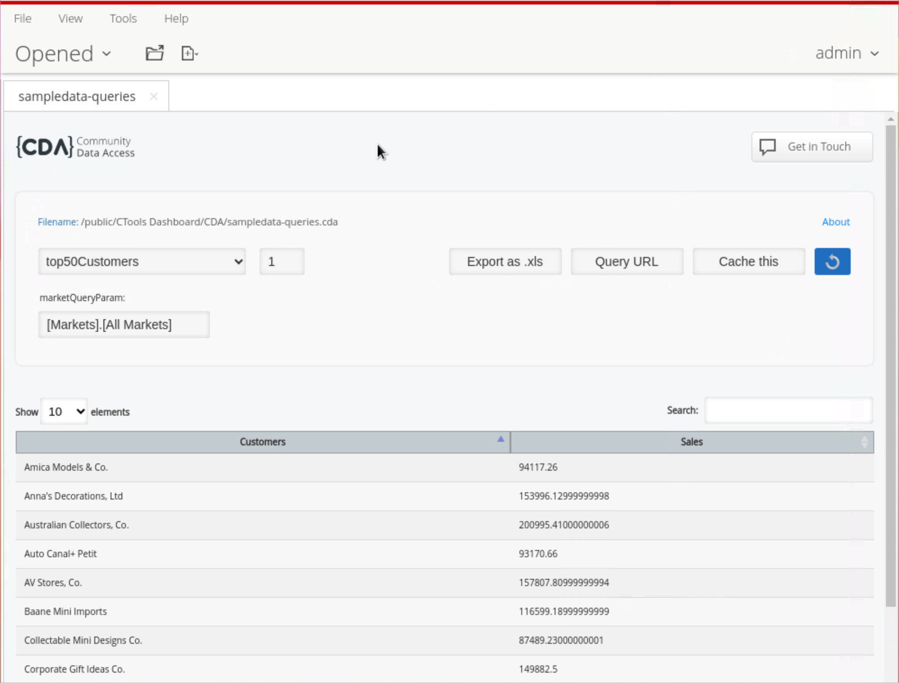<figcaption><p>CDA Dashboard - Top 50 customers</p></figcaption></figure>

***

> **Note:**
>
> #### Start Pentaho Server
>
> The CDA samples are served from the Pentaho Business Analytics Server. Make sure the server is running before you begin.

> **Note:**
>
> #### Windows (PowerShell)
>
> ```powershell
> cd \
> cd Pentaho/server/pentaho-server/
> ./start-pentaho.bat
> ```

> **Note:**
>
> #### Linux
>
> ```bash
> cd
> cd Pentaho/server/pentaho-server/
> ./start-pentaho.sh
> ```

<button data-launch="puc">Open Pentaho User Console</button>

***

Follow the guide below to review and work with **CDA Data Sources**:

:::: tabs

### 1. CDA

> **Note:** Before we begin our CTools journey, let's review some CDA samples.

1. Log into Pentaho User Console as Administrator.

<div class="pcm-embed-card" data-href="http://localhost:8080/pentaho/Home" data-title="Link to Pentaho Repository."></div>
<button data-launch="puc">Open Pentaho User Console</button>

2. Select **Browse Files**.
3. Navigate to: **Public - CTools Dashboard - CDA** folder.
4. Highlight the **CDA** folder.

<figure>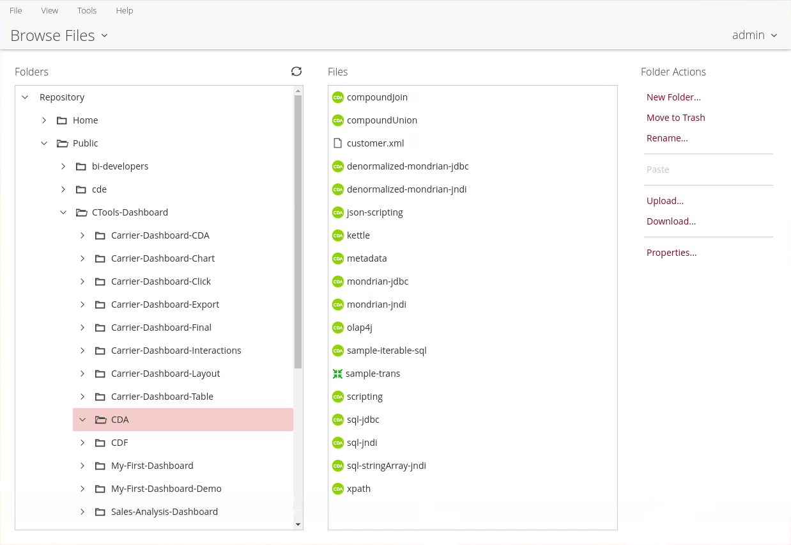<figcaption><p>CDA samples</p></figcaption></figure>

### 2. CDA - sampledata

> **Note:**
>
> We are defining a data source that points to the sample data source created during the Pentaho installation.
>
> We also have four MDX queries: in the first three the MDX query returns unique members for territories, countries and cities - filtering out undesired values. The order of the columns is changed from 0, 1 to 1, 0.
>
> The last MDX query returns the top 50 customers based on Sales across all the geographical markets. The query passes a parameter - `${marketQueryParam}` - which returns All Markets, but could be used to filter for a specific Market.

```xml
<?xml version="1.0" encoding="utf-8"?>
<CDADescriptor>
    <DataSources>
        <Connection id="SampleData" type="mondrian.jndi">
            <Jndi>SampleData</Jndi>
            <Catalog>mondrian:/SteelWheels</Catalog>
            <Cube>SteelWheelsSales</Cube>
        </Connection>
    </DataSources>
    <DataAccess id="territories" connection="SampleData" type="mdx" access="public">
        <Name>territories</Name>
        <BandedMode>compact</BandedMode>
        <Query>
            WITH 
                MEMBER [Measures].[UID] AS [Markets].CURRENTMEMBER.UNIQUENAME
            SELECT 
                UNION([Markets].[All Markets], DESCENDANTS([Markets].[All Markets], [Markets].[Territory])) on ROWS,
                {[Measures].[UID]} on COLUMNS
            FROM [SteelWheelsSales]
        </Query>
        <Output indexes="1,0" mode="include"/>
    </DataAccess>   
    <DataAccess id="countries" connection="SampleData" type="mdx" access="public">
        <Name>countries</Name>
        <BandedMode>compact</BandedMode>
        <Query>
            WITH 
                MEMBER [Measures].[UID] AS [Markets].CURRENTMEMBER.UNIQUENAME
            SELECT 
                UNION([Markets].[All Markets], DESCENDANTS(${marketQueryParam}, [Markets].[Country])) on ROWS,
                {[Measures].[UID]} on COLUMNS
            FROM [SteelWheelsSales]
        </Query>
        <Parameters>
            <Parameter name="marketQueryParam" type="String" default="[Markets].[All Markets]"/>
        </Parameters>
        <Output indexes="1,0" mode="include"/>
    </DataAccess>   
    <DataAccess id="cities" connection="SampleData" type="mdx" access="public">
        <Name>cities</Name>
        <BandedMode>compact</BandedMode>
        <Query>
            WITH 
                MEMBER [Measures].[UID] AS [Markets].CURRENTMEMBER.UNIQUENAME
            SELECT 
                UNION([Markets].[All Markets], DESCENDANTS(${marketQueryParam}, [Markets].[City])) on ROWS,
                {[Measures].[UID]} on COLUMNS
            FROM [SteelWheelsSales]
        </Query>
        <Parameters>
            <Parameter name="marketQueryParam" type="String" default="[Markets].[All Markets]"/>
        </Parameters>
        <Output indexes="1,0" mode="include"/>
    </DataAccess>   
    <DataAccess id="top50Customers" connection="SampleData" type="mdx" access="public">
        <Name>top50Customers</Name>
        <BandedMode>compact</BandedMode>
        <Query>
            WITH 
                SET CUSTOMERS AS TopCount([Customers].Children, 50.0, [Measures].[Sales])
            SELECT 
                NON EMPTY {[Measures].[Sales]} ON COLUMNS,
                NON EMPTY CUSTOMERS ON ROWS 
            FROM [SteelWheelsSales]
            WHERE ${marketQueryParam}
        </Query>
        <Parameters>
            <Parameter name="marketQueryParam" type="String" default="[Markets].[All Markets]"/>
        </Parameters>
    </DataAccess>

</CDADescriptor>
```

> **Note:** This example will be used in some samples during the next set of workshops. Don't forget to preview the results and confirm that you are able to return the results for both queries.

***

#### Preview Results

1. Highlight the **sampledata-queries.cda**.
2. Under **File Actions** click on **Open**.

<figure>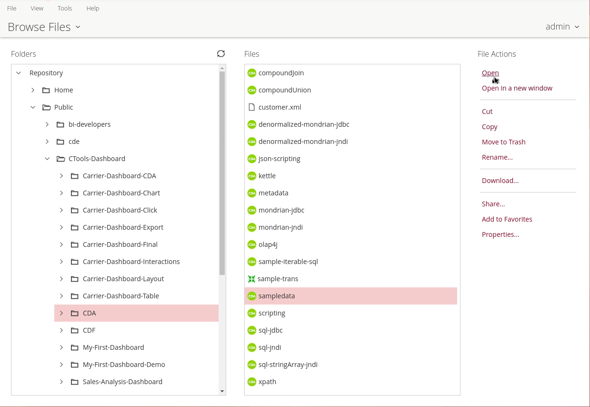<figcaption><p>sampledata.cda</p></figcaption></figure>

3. Select a Data Access ID in the CDA dashboard.

<figure>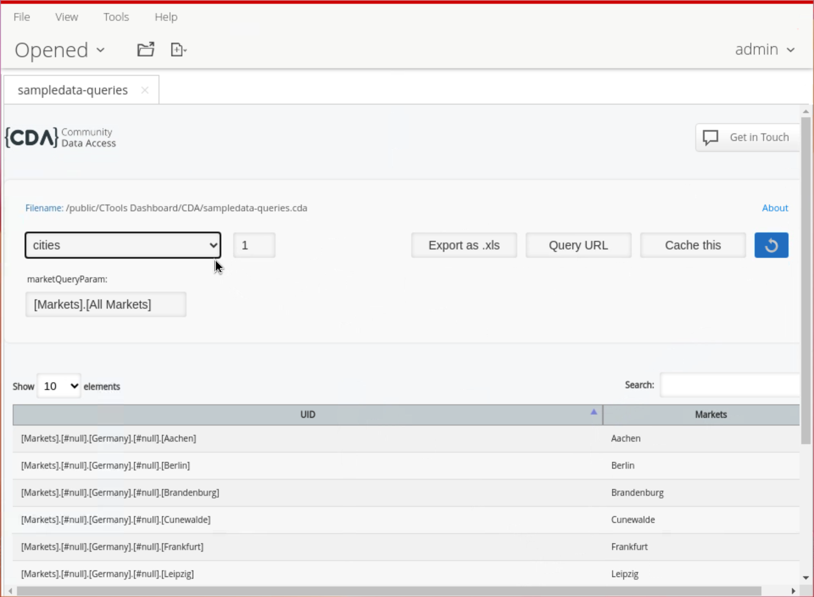<figcaption><p>sampledata.cda - cities query</p></figcaption></figure>

***

#### Previewer

> **Note:** Let's test a few of the APIs.

1. Click on the **Query URL** to retrieve the API call.

<figure>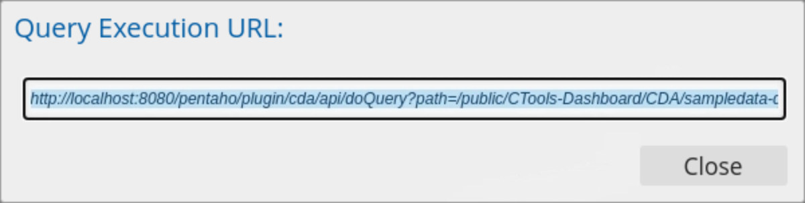<figcaption></figcaption></figure>

2. Copy & edit the URL to access the previewer - `editFile`:

```
http://localhost:8080/pentaho/plugin/cda/api/editFile?path=/public/CTools-Dashboard/CDA/sampledata-queries.cda
```

<figure>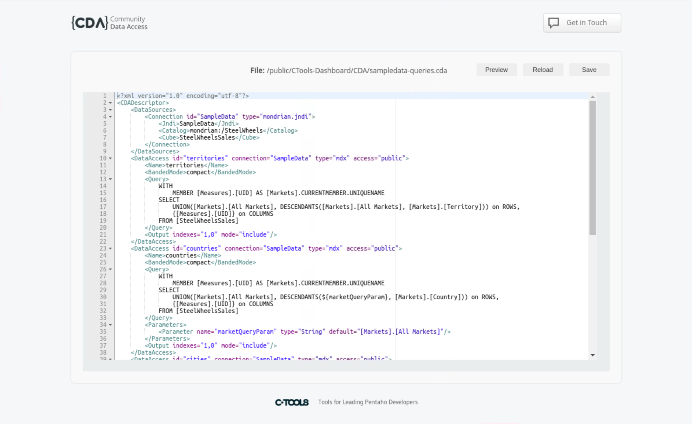<figcaption><p>Previewer</p></figcaption></figure>

> **Note:**
>
> #### The Editor Interface
>
> The interface consists of a central editor pane with three action buttons positioned above it on the right side:
>
> **Save** - Preserves any changes made to the XML file
>
> **Reload** - Refreshes the file content to its latest saved state
>
> **Preview** - Opens a preview window to view data source execution results

### 3. CDA - Cache

> **Note:**
>
> We're going to come back to this topic — Optimization.
>
> CDA is able to cache the queries that have been executed. Every query that runs will be cached or not, by the time defined in the Cache property element when defining the Data Access.
>
> You can also set the interval of time to grab results from the cache, avoiding new requests to the server.

1. If you still have your Query open, then click the **Cache this** button.

<figure>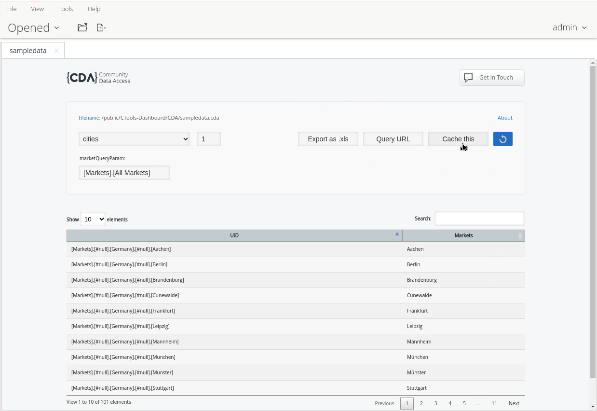<figcaption></figcaption></figure>

To enable caching for a query in your CDA file, add cache-related settings to your `DataAccess` element. Here are the key cache parameters:

```xml
<DataAccess id="your_query_id" cache="true" cacheDuration="3600">
```

> **Note:**
>
> The main cache parameters are:
>
> `cache="true"` - Enables caching
>
> `cacheDuration="3600"` - Sets cache duration in seconds (3600 = 1 hour)
>
> You can also use these additional cache parameters:
>
> `cacheKeys` - Defines specific keys for parameterized queries
>
> `outputIndexId` - Sets a unique identifier for the cached output
>
> `executeAtStart` - Pre-loads the cache when the server starts

Example of a complete cached query configuration:

```xml
<CDADescriptor>
  <DataAccess id="myQuery" 
              connection="myConnection"
              type="sql" 
              cache="true"
              cacheDuration="3600"
              executeAtStart="false">
    <Name>My Cached Query</Name>
    <Query>
      SELECT * FROM my_table
    </Query>
  </DataAccess>
</CDADescriptor>
```

2. Set your schedule.

<figure>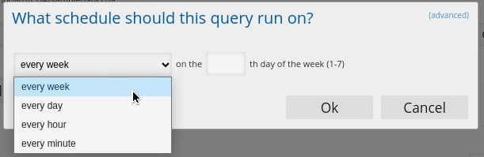<figcaption><p>Set a schedule</p></figcaption></figure>

> **Note:** If you prefer to use CRON, click on the **(advanced)** link (top right).

<figure>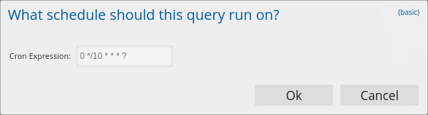<figcaption><p>CRON</p></figcaption></figure>

<figure>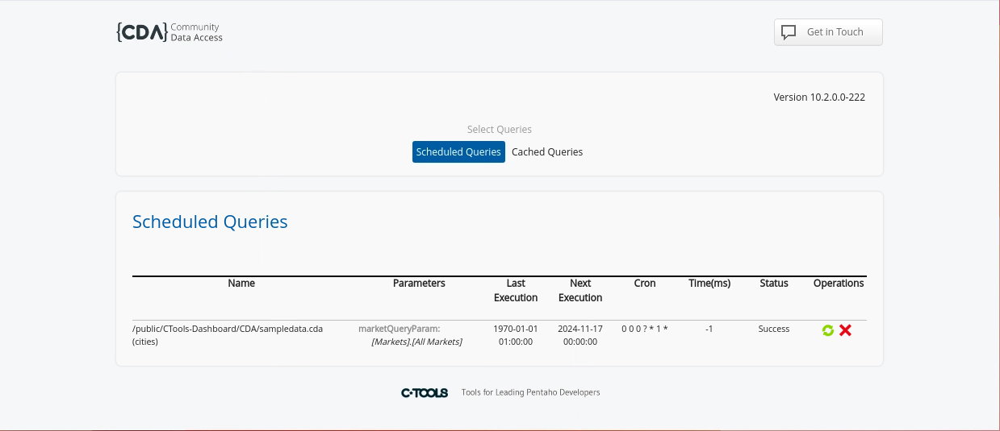<figcaption><p>Cache Manager</p></figcaption></figure>

3. Click **Cached Queries**.

<figure>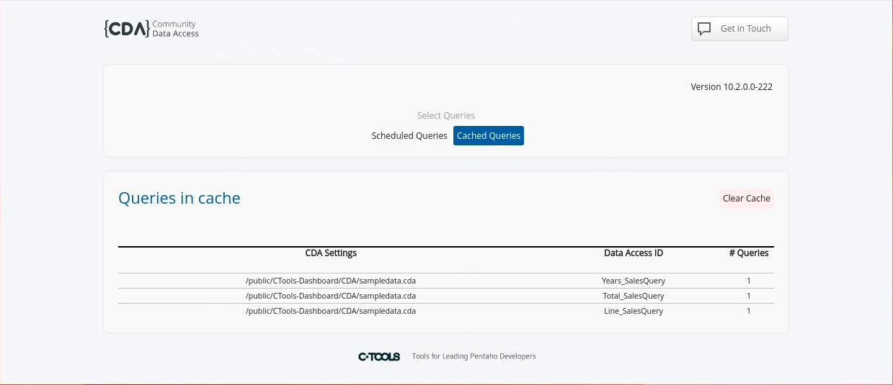<figcaption><p>Cached Queries</p></figcaption></figure>

> **Note:** Notice all the Queries are executed / cached.

***

> **Note:** Click on the link below to access the Cache Manager.

<div class="pcm-embed-card" data-href="http://localhost:8080/pentaho/plugin/cda/api/manageCache" data-title="Cache Manager"></div>
<figure>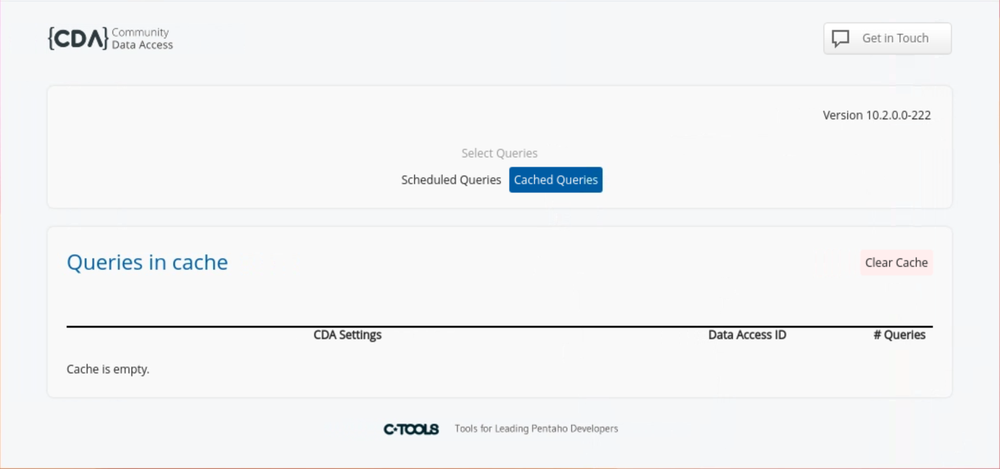<figcaption><p>Schedule Queries &#x26; Cache Manager</p></figcaption></figure>

::::

<button data-launch="puc">Open Pentaho User Console</button>
