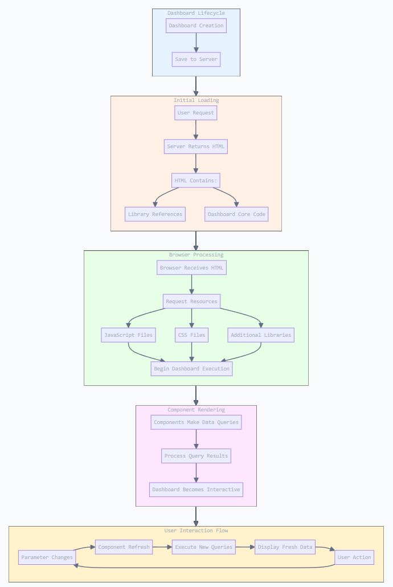

# Overview of Community Dashboard Editor

The **Community Dashboard Editor (CDE)** is a graphical dashboard editor that sits on top of CDF. Instead of hand-coding the framework, you build dashboards through a guided **Layout → Components → Data Sources** workflow — designing responsive layouts, wiring up charts and selectors, and connecting them to live data, all from a visual interface.

While the previous **Community Dashboard Framework (CDF)** covered creating dashboards through code, this chapter introduces a faster, more user-friendly approach using **CDE**. CDE is a Pentaho server plugin that simplifies dashboard creation through its graphical interface, eliminating the need for extensive manual coding.

## What this chapter covers

This chapter focuses on:

- Creating dashboards using a graphical user interface
- Building responsive layouts
- Adding and configuring components
- Incorporating custom code and resources (JavaScript/CSS)
- Managing data sources through the interface

> **Note:**
>
> #### CDF still matters
>
> Although CDE builds on the **CDF** foundation covered previously, you don't need to write CDF code directly. However, understanding CDF's core concepts — especially dashboard and component **lifecycles** — remains crucial for maximizing CDE's potential. This knowledge will help you create more sophisticated dashboards even when using the graphical interface exclusively.

Through CDE, you'll significantly reduce development time while maintaining full control over your dashboard's functionality. The visual approach makes dashboard creation more accessible without sacrificing the power and flexibility of the underlying framework.

<figure><figcaption>
Dashboard Lifecycle
</figcaption></figure>
