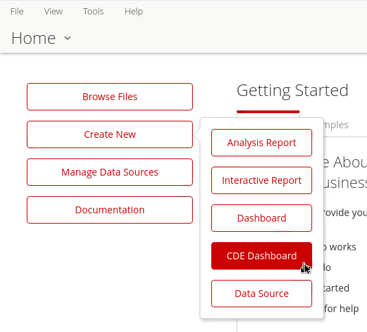
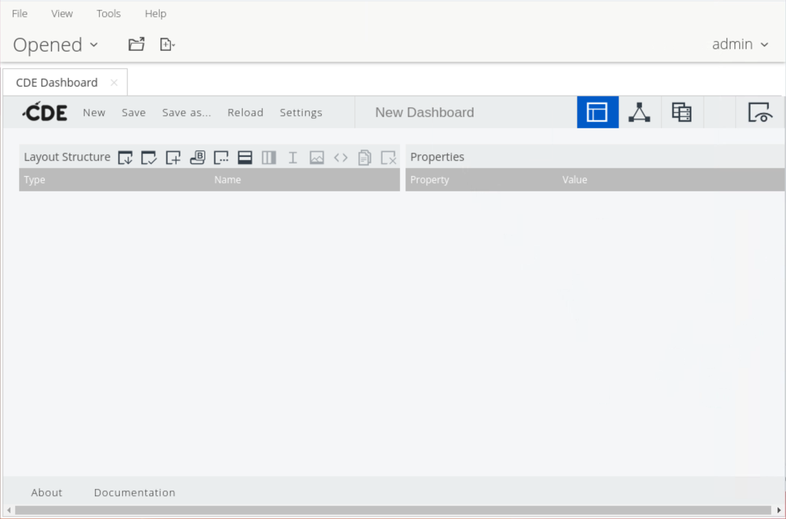
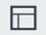
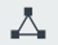
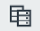
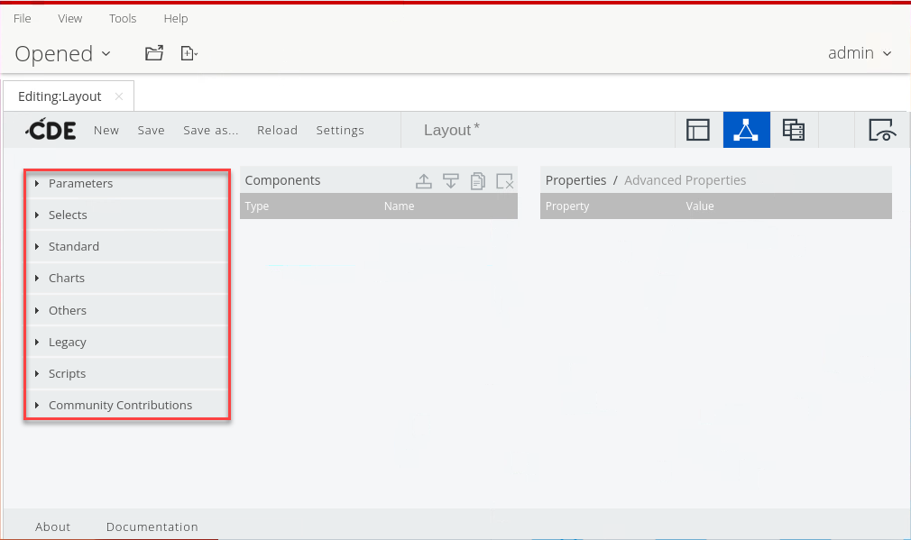

# UI Overview

The **Community Dashboard Editor** (CDE) is a web-based dashboard design tool that's part of the Pentaho CTools family. It lets you build interactive, data-driven dashboards without extensive programming, though some familiarity with web technologies (HTML, CSS, JavaScript) helps. CDE follows a **layout → components → data sources** architecture: the **layout** defines structure and appearance with HTML and CSS, **components** are the interactive elements (charts, tables, filters) that display data and react to the user, and **data sources** define how data is retrieved. You can mix pre-built CTools components (CCC charts, selects, filters) with custom ones, pass parameters between components, and drive complex behaviour through the JavaScript API.

## Create a new dashboard

1. Log into the Pentaho Server.
2. In the Pentaho User Console (PUC), select from the menu: **File → New → CDE Dashboard**.

<figure><figcaption>
Create a New CDE Dashboard
</figcaption></figure>

<figure><figcaption>
Community Dashboard Editor
</figcaption></figure>

## The menu

| Menu | Description |
| --- | --- |
| New | Create a new CDE dashboard. When clicked, a blank dashboard appears. |
| Save | Save the CDE dashboard you are currently editing. It is recommended you continuously save your work. If you have not previously saved this dashboard, the **Save as** dialog box displays — choose a location and enter a file name. |
| Save as | Save the current CDE dashboard in a new location and/or rename it. You can also modify the title and description. When clicked, the **Save as** dialog box displays. You can choose to save as a **Dashboard** or as a **Widget**; for now keep the default option of Dashboard. |
| Reload | Refresh the CDE interface to the last saved state. Useful when changes aren't immediately reflected after saving, or to discard your most recent changes and return to the last saved state. |
| Settings | Define dashboard settings such as metadata, HTML templates, and dashboard type. You can: add/modify the **Title** and **Description**; set the **Author**; select the **Style** (HTML template — *Clean* by default); select the **Dashboard Type** (*Bootstrap* by default); and tick the **RequireJS Support** check box (cleared by default). |

## The Perspectives toolbar

> **Note:** The CDE Perspectives toolbar displays in the top-right of the window. Use it to switch between the **Layout**, **Components**, and **Data Sources** perspectives, and to **Preview** your dashboard.

| Icon | Name | Description |
| --- | --- | --- |
| <figure></figure> | Layout | Design the layout of your dashboard from scratch or from a CDE template. While defining the layout you can apply styles and add HTML elements as text or images. |
| <figure></figure> | Components | Add and set up the components that make up your dashboard. Components are the central elements — they link the layout elements with the data sources. |
| <figure></figure> | Data Sources | Find the various types of data sources you can employ in a dashboard. These let you access the data you want to display. |
| <figure></figure> | Preview | Test the look, feel, and behaviour of your dashboard as you work. When selected, your dashboard opens in the Preview window. |

## The perspectives

:::: tabs

### Layout

> **Note:**
>
> #### Bootstrap layout rules
>
> Thanks to the bundled **Bootstrap** libraries, configuring columns is simple. The columns in a row must occupy **12 spans**. So in a single row you could use, for example:
>
> - Twelve columns of size 1 (12 × 1)
> - Two columns of size 6 (2 × 6)
> - Three columns of size 4 (3 × 4)
> - One column of size 8 and one column of size 4 (8 + 4)
>
> Whatever the configuration, the spans must add up to **12** for Bootstrap. Other CSS libraries may have different rules — for instance, the Blueprint library totals **24** spans per column.

You can assign the width of a column across multiple devices — where you'll draw the components — through these properties:

| Category | Suggested Device | Width (in pixels) |
| --- | --- | --- |
| Extra Small Devices | Phones | <768 |
| Small Devices | Tablets | 768–992 |
| Medium Devices | Desktops | 992–1200 |
| Large Devices | Desktops | >1200 |

### Components

> **Note:** In the **Components** perspective you add and set up the different components that make up your dashboard. These are the central elements — they link the layout elements with the data sources.

There are three types of components:

#### Visual and Data Components

Components displayed in your dashboard, including text boxes, tables, charts (such as pie, bar, and line), selectors (such as radio buttons and date pickers), OLAP views, and reports.

#### Parameters

Parameters represent values shared by the components. These are essential for the various types of component interaction.

#### Scripts

Pieces of JavaScript code that let you customize the look and feel or behaviour of other components.

> **Note:** A component is a simple JavaScript object that encapsulates all the object's properties and behaviours, allowing fine control of the dashboard. For example, a component can adjust its behaviour when reacting to changes in dashboard parameters that affect it. These adjustments can be defined **before, during, and after** the component's execution, which lets components interact with each other.

**Component property reference**

| Property | Description |
| --- | --- |
| Type | Assumes values such as `ComponentsParameter`, `ComponentsSelect`, and `ComponentscccBarChart`. You cannot edit this property through the CDE interface — it is set on the backend. |
| Name | The identifier of the component. It is recommended you use camel case when naming a component. |
| Parameter | For components such as the Select component, the Filter component, and others where user input is required, this field is where the input is stored for later use throughout the dashboard. |
| Listeners | The dashboard parameters that may trigger a component's reaction. These allow interaction between components, letting you control when and in what order components execute. For example, a component may only execute after a change to a parameter it is listening to. A component can have more than one parameter in Listeners, and a parameter can be listened to by more than one component. Every time the parameter changes, all components listening to it are updated. |
| Parameters | For xAction components, PRPT components, Query components, and others, some parameters may be passed by specifying the desired value in an array of arrays. |
| HtmlObject | The ID of the HTML object the component will be appended to. This corresponds to the name you gave the HTML column element onto which you want to place the component. |
| Priority | Controls the order in which dashboard elements execute. By default a component's priority is 5. The lower the number, the higher the priority. Components with the same priority value may not execute at the same time, so if order of execution is critical, assign priority. |
| Execute at Start | Controls whether the component executes when the dashboard loads. By default this is `True`. When set to `False`, the component only executes when a change occurs in one of the parameters it is listening to. |
| Pre Execution / Post Execution | Functions executed before/after the component is initialized, updated, or presented to the user. If `preExecution` returns false, the component is not updated. |
| Pre Change / Post Change | For component selectors. Executed before/after the input value is updated. Useful for validating user input. |
| Post Fetch | Involved if the update stage calls queries. Once the query executes, the returned data is passed to `postFetch`. The component is rendered only after this function runs. |

**Component categories**

The Components perspective groups the available components into categories, including:

#### Parameters

Parameters act as shared values across components and are essential for dashboard interactivity:

- Function as data containers accessible by multiple components.
- Enable component communication and updates.
- Configuration: set in input components as sources; configured as listeners in components that need updating; trigger updates when values change.

#### Selects

Selector components (radio buttons, date pickers, drop-downs, filters, and similar) that capture user input and store it in a parameter for use across the dashboard.

#### Standard

The standard library of visual and data components — text boxes, tables, OLAP views, reports, and the other building blocks of a dashboard.

#### Charts

CCC stands for **Community Charting Components**, the CTools charting library, built on top of **Protovis** — a powerful, free, open-source visualization toolkit. CCC was updated to provide a larger set of out-of-the-box properties for direct customization, and is now referred to as **CCC2**. CCC2 charts look great, are flexible, allow interaction, and expose roughly **200 advanced properties**, with further customization via extension points.

CCC2 charts are added via the Components perspective and all begin with the prefix **CCC**. All other charts are legacy and are not supported. About Protovis:

- Free and open-source, provided under the BSD License.
- Written in JavaScript; runs in the browser with no plugins.
- Requires a modern browser (recent Safari, Chrome, Firefox, Opera, or IE) and is viewable on a selected list of mobile devices.
- Composes custom views by combining simple graphical primitives, allowing standard chart types — areas, bars, scatterplots, pies, donuts, lines, and step charts.

Because you work with CCC2 (not Protovis directly), you may use **extension points** to customize charts beyond the basic and advanced properties exposed in the Components perspective. Extension points let you implement any property not defined in CCC2. The format is `<extension_point>_<Protovis_property_name>` — for example, `xAxisLabel_textAngle`. A CCC2 component can have as many extension points as you need.

#### Others

Additional specialized components that don't fall into the categories above.

#### Scripts

JavaScript code segments that enhance dashboard functionality:

- Customize component appearance.
- Modify component behaviour.
- Execute custom logic at specific times — pre-dashboard execution and post-dashboard execution.
- Enable advanced customization and automation.

### Data Sources

> **Note:** In the **Data Sources** perspective you find connections to various types of data sources. This is the list of all the available data sources, grouped in the left pane.

| Data Source | Description |
| --- | --- |
| Wizards | A setup assistant to guide you through the steps of creating an OLAP selector or chart. |
| Community Data Access (CDA) | CDA allows data to be retrieved from multiple data sources and combined in a single output that can easily be passed on to dashboard components. |
| Legacy Datasources | Legacy data sources include PDI/Kettle transformations, OLAP MDX queries, SQL queries, and Xaction result sets. |
| MDX Queries | Retrieve data from a Mondrian cube via an [MDX](http://mondrian.pentaho.org/documentation/mdx.php) query. |
| OLAP4J Queries | Execute queries using the olap4j specification. |
| Compound Queries | Combine the result of two distinct queries. Compound queries can be either JOIN or UNION. |
| Scripting Queries | Create ad hoc result sets for prototyping purposes using [Beanshell](http://www.beanshell.org/) scripts. |
| Kettle Queries | Define a Kettle transformation file to fetch data. |
| MQL Queries | Pentaho Metadata defines a business model and query implementation so business users can query data sources using Pentaho reporting tools. |
| SQL Queries | Access data from SQL databases if you have a JNDI connection or a JDBC driver setup. |
| XPath Queries | Read data from any type of XML file using XPath specifications. |

### Preview

> **Note:** Select **Preview** to test the look, feel, and behaviour of your dashboard as you work. When selected, your dashboard opens in the Preview window so you can validate the layout, the wiring between components and data sources, and parameter interactions before saving and publishing.

Use Preview iteratively: build a slice of the layout, add the components that bind to it, then preview to confirm the data flows and the parameters react as expected.

::::

> **Note:** When you have the layout of the dashboard and the queries ready to get data using parameters, it's time to set the components.

<figure><figcaption>
CTools Components
</figcaption></figure>
