# Carrier Dashboard

> **Warning:**
>
> #### Workshop - Carrier Dashboard
>
> Enterprise dashboards demand sophisticated analytical capabilities that seamlessly integrate multidimensional data analysis with intuitive user interfaces, enabling business users to explore complex telecommunications metrics through interactive visualizations and dynamic filtering. In this comprehensive workshop, you'll build a complete Wireless Carrier analytics dashboard from the ground up — first constructing the **Layout** (rows, columns, headers, KPIs, charts, tables, CSS styling, and CDA data sources), then adding the **Components** (tables, CCC charts, parameters, listeners, selectors, click actions, exports, and expandable rows) that make it interactive.
>
> Working with a real-world telecommunications dataset, you'll transform raw call traffic data into a polished, production-ready dashboard that tracks regional calling patterns, platform usage metrics, and month-over-month performance trends across multiple analytical dimensions. You'll master critical techniques including crafting MDX queries with `WITH` clauses that define calculated members for month-over-month comparisons, implementing parameter substitution using `${parameterName}` syntax for dynamic filtering, configuring output column ordering and renaming, handling null values with `IIf(IsEmpty())` logic, building responsive nested layouts, applying external CSS stylesheets, and structuring CDA data sources that support interactive component behavior.
>
> **What you'll do**
>
> * Review the `baseline_demo` PostgreSQL star schema and the Wireless Carrier Mondrian schema in Schema Workbench
> * Define a JDBC connection and import the Mondrian analysis schema in the Pentaho User Console
> * Build a multi-level CDE layout (rows, columns, headers, KPI panels, chart and table containers)
> * Apply an external `dashstyle.css` stylesheet via the Add Resource option
> * Create CDA MDX data sources (`sourceSelectorQuery`, `tableQuery`, `lineChartQuery`) with parameters and column configuration
> * Add a Table Component (`mainTable`) with trend arrows, data bars, sprintf formatting, and sort order
> * Create CCC Pie, Line, and Bar charts with colors, extension points, and a custom `bulletLegend` resource
> * Wire interactivity with parameters, listeners, Filter selectors, and a pie-chart `clickAction`
> * Add Export Button and Export Popup components for CSV/PNG output
> * Enable expandable table rows that reveal a Calls by Platform bar chart
>
> **Prerequisites:** Pentaho Business Analytics Server with CTools and CDA plugins installed; PostgreSQL with the `baseline_demo` database configured; Schema Workbench with the PostgreSQL JDBC driver; the Wireless Carrier Mondrian schema XML available; administrative access to the Pentaho User Console; familiarity with JavaScript for pre-execution and click-action functions.
>
> **Estimated time:** ~90 minutes

<figure>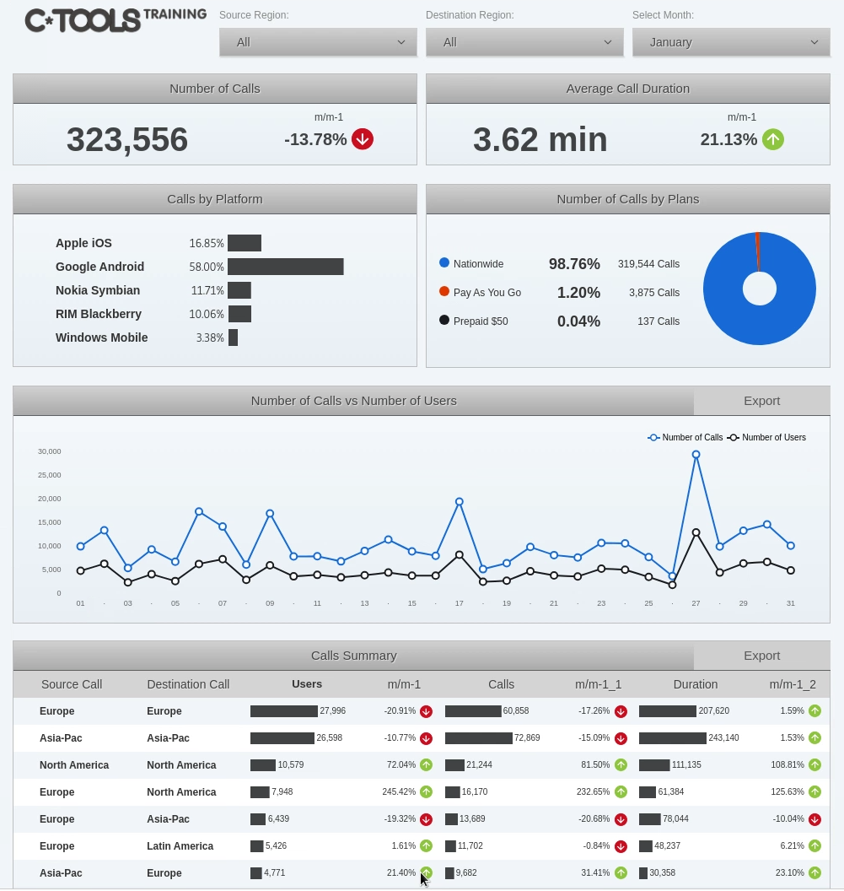<figcaption><p>Wireless Carrier Dashboard</p></figcaption></figure>

***

Start the Pentaho Server (not required if using Pentaho Labs):

> **Note:**
>
> #### Windows (PowerShell)
>
> ```powershell
> cd \
> cd Pentaho/server/pentaho-server
> ./start-pentaho.bat
> ```

> **Danger:**
>
> #### Linux
>
> ```bash
> cd
> cd /opt/pentaho/server/pentaho-server
> sudo ./start-pentaho.sh
> ```

Community Dashboard Editor (CDE) runs inside the Pentaho User Console (PUC):

<button data-launch="puc">Open Pentaho User Console</button>

Follow the guide to build the Carrier Dashboard:

:::: tabs

### 1. Layout

> **Note:**
>
> Before we begin our dashboard journey, we need to understand our OLAP Mondrian datasource, configure it on the Pentaho Server, then construct the layout and apply CSS styling.

#### Prerequisites

> **Note:**
>
> Before we begin our dashboard journey, we need to understand our OLAP Mondrian datasource.

<figure>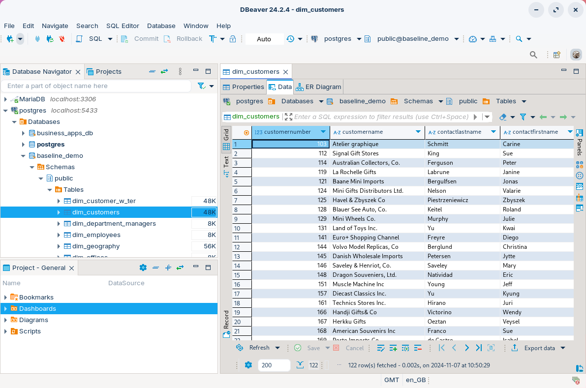<figcaption><p>baseline_demo database</p></figcaption></figure>

1. Log into the Postgres baseline\_demo database.

> **Note:**
>
> The baseline\_demo database has a number of key features:
>
> * Centralized Fact Tables
> * Dimension Tables (sometimes called lookup tables)
> * Simple Join Paths
> * Denormalized Structure
> * Query Optimization Features
>
> These tables have been 'mapped' using Pentaho Schema Workbench.

> **Warning:**
>
> You will need to copy over the Postgres database driver to: /schema-workbench/lib

2. Start Schema Workbench.

```bash
cd
cd /Pentaho/design-tools/schema-workbench
./workbench.sh
```

3. Open: Workshop--Ctools/Carrier/schema/Wireless carrier.mondrian.xml
4. Expand: Retail Sales & Call Corridor cubes - our datasources.

<figure>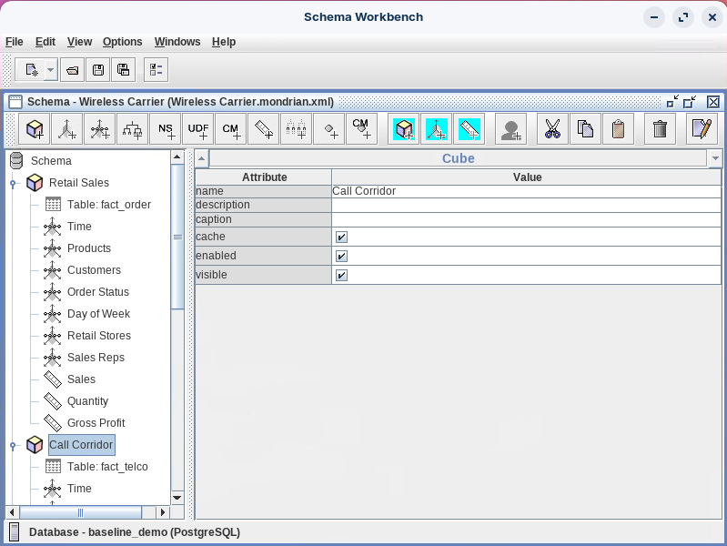<figcaption><p>Wireless Carrier Mondrian Schema</p></figcaption></figure>

> **Note:**
>
> You can test your MDX queries that will be used to populate the dashboard.

5. Open the MDX query panel: File -> New -> MDX Query
6. Copy & paste the following MDX query. Execute.

```
WITH 
 MEMBER [Measures].[Source Member Name] AS [Call Source].currentmember.uniquename
SELECT 
 [Measures].[Source Member Name]  ON 0,
 {[Call Source].[All], [Call Source].[Source Region].Members} ON 1
FROM 
 [Call Corridor]
```

<figure>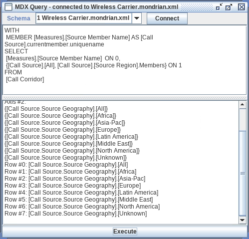<figcaption><p>MDX query - All Call Regions</p></figcaption></figure>

***

> **Note:**
>
> The last step is to, from the Pentaho Server - PUC:
>
> * define a connection to the baseline\_demo database
> * upload the Wireless carrier Mondrian Schema

1. In the PUC select: Manage Data Sources.
2. Click on the cog wheel & select: New Connection.

<figure>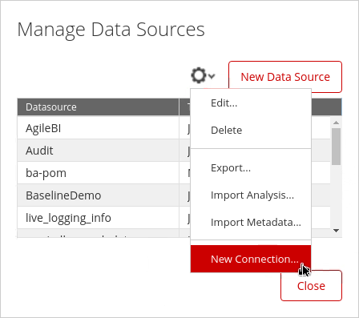<figcaption><p>New JDBC connection</p></figcaption></figure>

3. Select Postgres and enter the following details:

<figure>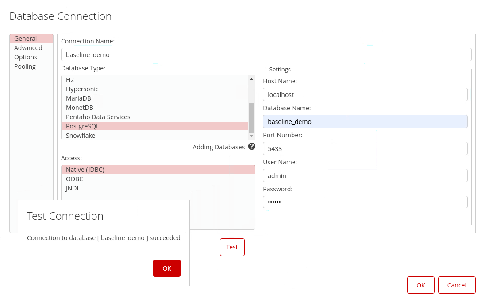<figcaption><p>baseline_demo connection details</p></figcaption></figure>

4. The Manage Data Sources also has the option to: Import Analysis
5. Browse to: Workshop--CTools/schemas/Wireless Carrier.Mondian.xml and associate with baseline\_demo datasource.

<figure>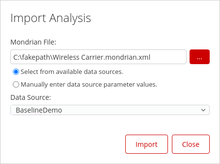<figcaption></figcaption></figure>

6. Click: Import & check the xml schema has been successfully imported.

<figure>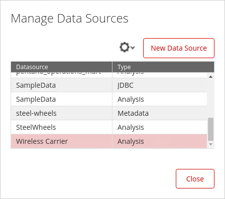<figcaption><p>Wireless Carrier schema</p></figcaption></figure>

> **Note:**
>
> The schema can now be referenced to create the dashboard mdx.mondrian.jndi queries.

#### Layout & Style

> **Note:**
>
> We're going to make a few assumptions here:
>
> * connections tested
> * the layout has been confirmed
> * chart content & types agreed
> * dashboard functions included - export graphs & tables

<figure>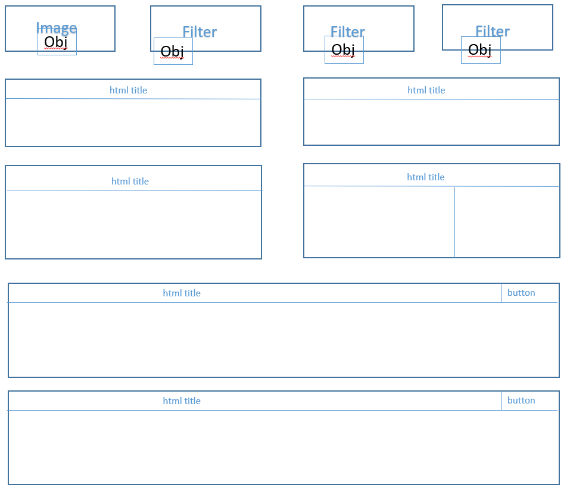<figcaption><p>Dashboard layout</p></figcaption></figure>

> **Note:**
>
> There are five "main" rows:
>
> The first row contains four columns: one with the logo, and three with the selectors.
>
> The second row contains two columns with the main KPIs: Number of Calls and Average Call Duration. Each column contains two rows: one for the header, and another for the data.
>
> The third row has two columns, each with two rows.
>
> The fourth and fifth rows have one column which contains two rows, but notice that the first row is split into two columns because there is a title and an Export button.

1. Highlight: /Public/CTools-Dashboard/Carrier-Dashboard-Layout/Layout.
2. Select: Edit from the Folder Actions.

<figure>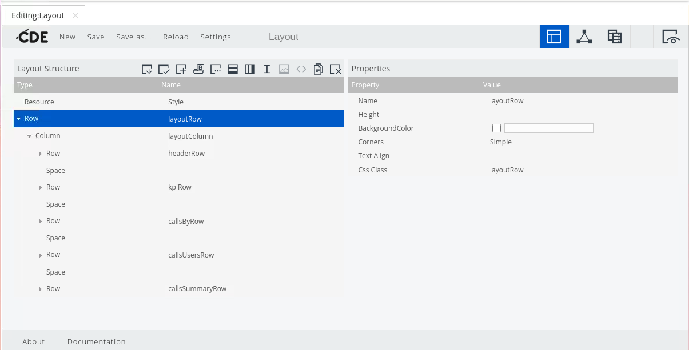<figcaption></figcaption></figure>

> **Note:**
>
> Keep the Layout dashboard open in its own tab.
>
> You will need to refer to each Layout entity to apply the Property Values.

```
Root Container
│
└── Layout Row (id: layoutRow)
    └── Layout Column (id: layoutColumn span:12)
        └── Header Row (id: headerRow)
            ├── CTools Logo Column (id: ctoolsLogo span:3)
            ├── sourceObj Column (id: sourceOBj span:3)
            ├── destinationObj Column (id: destinationObj span:3)
            └── monthObj Column (id: monthObj span:3)
    Space
        └── KPI Row (id: kpiRow)
            └── Total Calls Column (id: totalCallsCol span:6)
                └── Total Calls Title Row (id: totalCallsTitle)
                    └── Total Calls Title Column (id: totalCallsTitle span:12)
                        └── HTML Number of Calls
                    Total Calls Row (id: totalCallsRow)
                    └── Total Calls Obj Column (id: totalCallsObj span:12)
                    
             └── Average Calls Time Column (id: totalCallsCol span:6)
                 └── Average Calls Total Title Row (id: averageCallsTimeTitleRow)
                     └── Average Calls Time Title Column (id: averageCallsTimeTitle span:12)
                         └── HTML Call Duration
                     Average Calls Time Row (id: averageCallsTimeRow)
                     └── Total Calls Time Obj Column (id: averageCallsTimeObj span:12)
    Space
        └── Calls By Row (id: callsByRow)
            └── Horizontal Bar Chart Column (id: horizontalBarChartCol span:6)
                └── Horizontal Bar Chart Title Row (id: horizontalBarChartTitleRow)
                    └── Horizontal Bar Chart Title Column (id: horizontalBarChartTitle span:12)
                        └── HTML Calls by Platform
                    Horizontal Bar Chart Row (id: horizontalBarChartRow)
                    └── Horizontal Bar Chart Obj Column (id: horizontalBarChartObj span:12)

            └── Pie Chart Title Column (id: pieChartTitleCol span:6)
                └── Pie Chart Total Title Row (id: pieChartTitleRow)
                    └── Pie Chart Title Column (id: averageCallsTimeTitle span:12)
                        └── HTML Number of Calls
                    Pie Chart Row (id: pieChartRow)
                    └── Pie Chart Table Obj Column (id: pieChartTableObj span:8)
                    └── Pie Chart Obj Column (id: pieChartObj span:4)
    Space
        └── Calls Summary Row (id: callsSummaryRow)
            └── Calls Summary Column (id: callsSummaryCol span:12)
                └──Table Title Row (id: tableTitleRow)
                   └── Table Title Column (id: tableTitle span:10)
                       └── HTML Calls Summary
                   └── Export Table Button Obj (id: exportTableButtonObj span:2)
                   Main Table Row (id: mainTableRow)
                   └── Main Table Obj Column (id: mainTableObj span:12)
```

3. Create a Layout folder in the PUC .. give it a go ..!

***

> **Note:**
>
> Most modern day layouts are controlled by Cascading Style Sheets (CSS).

<figure>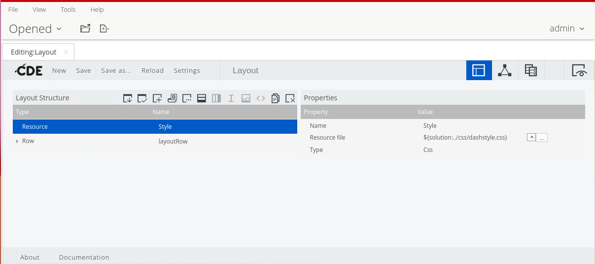<figcaption><p>Add a Resource - CSS</p></figcaption></figure>

1. Click on the Add Resource option in the Layout Structure toolbar.

<figure>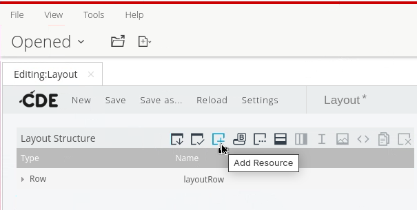<figcaption><p>Add Resource</p></figcaption></figure>

2. Enter the following options:

<figure>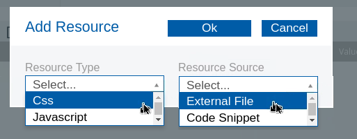<figcaption><p>CSS External File</p></figcaption></figure>

3. Click on the ^ button and browse for the file.

<figure>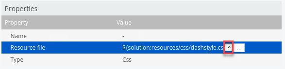<figcaption><p>Add dashstyle.css</p></figcaption></figure>

<figure>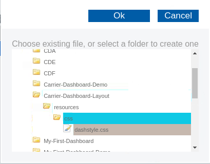<figcaption><p>dashstyle.css</p></figcaption></figure>

4. Finally check the CSS has been applied.
5. Save & Preview the dashboard.

<figure>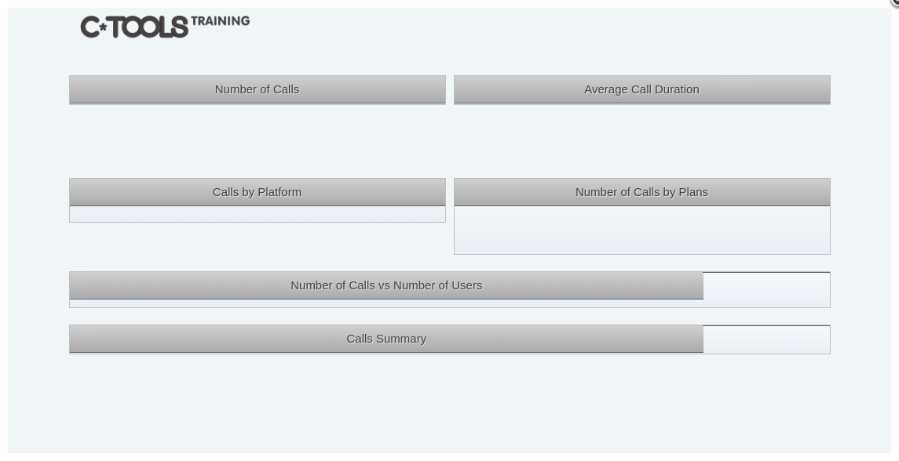<figcaption><p>Layout</p></figcaption></figure>

> **Note:**
>
> The completed workshop:
>
> /Public/CTools-Dashboard/Carrier-Dashboard-Layout/Layout

#### CDA - sourceSelectorQuery

> **Note:**
>
> Now that the Layout is complete, time to turn our attention to CDA data sources.
>
> All the data in this dashboard comes from ten MDX queries.
>
> The three selectors:
>
> * Source Region
> * Destination Region
> * Month
>
> are all populated via MDX queries, as are each of the tables and charts in the dashboard.
>
> We're going to add two MDX queries to the dashboard.
>
> * First query returns the values for the Source Selector.
> * Second query returns the results for the main dashboard table that includes several defined parameters.

<figure>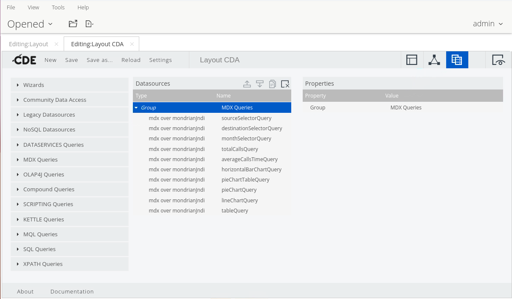<figcaption><p>MDX Data Sources</p></figcaption></figure>

> **Note:**
>
> Let's start with the MDX query that retrieves the list of Regions. Start with the Layout dashboard.

1. Browse to: /Public/CTools Dashboard/Carrier-Dashboard-CDA/Layout
2. Click Edit under File Actions.

<figure>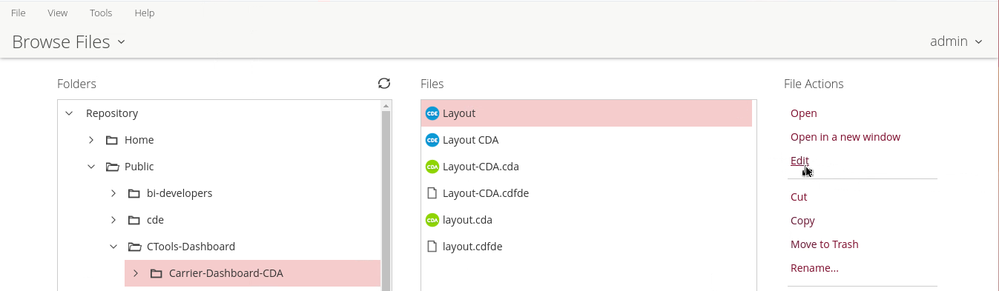<figcaption><p>Layout Dashboard</p></figcaption></figure>

3. On the CDE Perspectives Toolbar, click the Data Sources Panel icon.

<figure>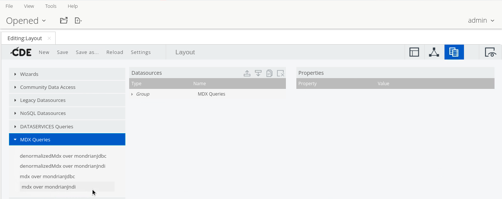<figcaption><p>mdx over mondrianjndi</p></figcaption></figure>

4. From the Data Source list, expand MDX Queries, and then click mdx over mondrianjndi.
5. To name this data source, in the Properties pane:
   * Click in the Value for the Name property.
   * Type sourceSelectorQuery.
   * Press Tab or Enter.

> **Note:**
>
> Its BP to add the suffix "Query" to the data source name.

6. In the Properties pane:
   * Click in the Value for the Jndi property.
   * On the keyboard, press the down arrow.
   * Select the BaselineDemo connection.

7. In the Properties pane:
   * Click in the Value for the Mondrian schema property.
   * On the keyboard, press the down arrow.
   * Select the Wireless Carrier schema.

8. To enter the MDX query:
   * In the Properties pane, click the ellipsis icon to the right of the Query property.
   * In the MDX Editor window, enter the following MDX query, and then click OK:

```xml
WITH 
 MEMBER [Measures].[Source Member Name] AS [Call Source].currentmember.uniquename
SELECT 
 [Measures].[Source Member Name]  ON 0,
 {[Call Source].[All], [Call Source].[Source Region].Members} ON 1
FROM 
 [Call Corridor]
```

> **Note:**
>
> The query creates a calculated member (Source Member Name) and obtains the list of Source Regions from the Call Source dimension.

<figure>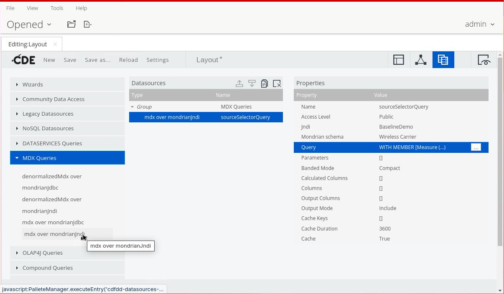<figcaption><p>sourceSelectorQuery</p></figcaption></figure>

9. Save & Test the Layout.cda

<figure>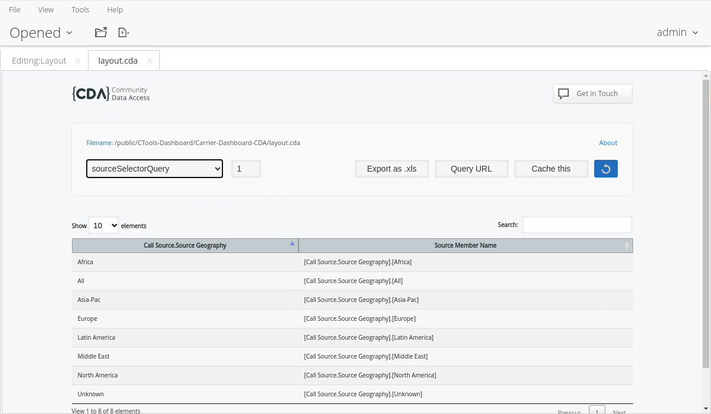<figcaption><p>Layout.cda</p></figcaption></figure>

> **Warning:**
>
> OOOOps the columns are the wrong way around ..

10. To change the order of the columns:
    * In the Properties pane, click in the Value for the Output Columns property.
    * In the new window, click the Add button once to add another field.
    * In the first Index field, type 1.
    * In the second Index field, type 0.
    * Click OK.

<figure>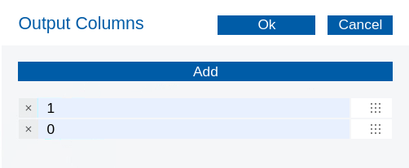<figcaption><p>Change the column order</p></figcaption></figure>

11. Save the dashboard and try again .. Refresh the layout.cda

<figure>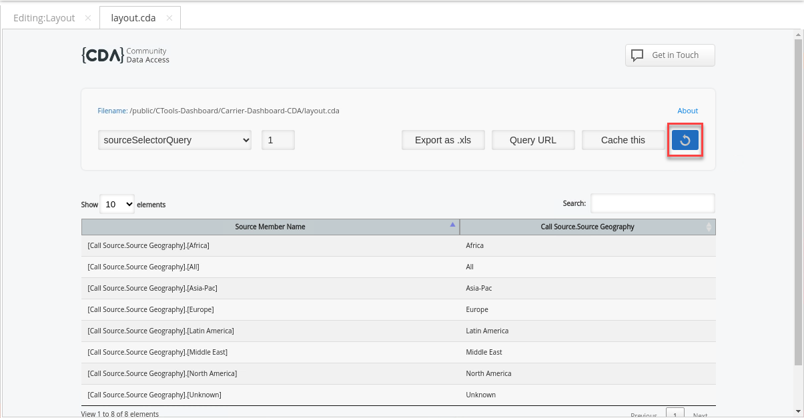<figcaption><p>Refresh CDA Dashboard</p></figcaption></figure>

> **Warning:**
>
> Notice the Query has also returned an 'Unknown' Geography value .. This indicates that the Geography table in the baseline\_demo database contains errors.

#### CDA - tableQuery

> **Note:**
>
> Next MDX query populates the main dashboard table. This query is a bit trickier as it includes parameters.

1. Duplicate the sourceSelectorQuery and change the name to tableQuery.

<figure>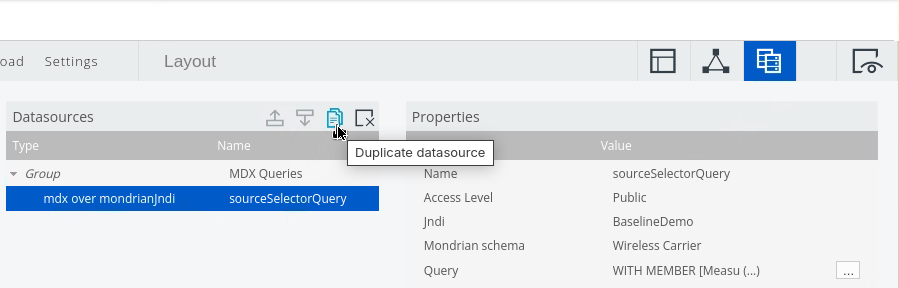<figcaption><p>Duplicate Query</p></figcaption></figure>

2. Delete the Output columns.

<figure>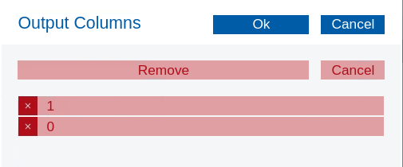<figcaption><p>Delete Output Columns</p></figcaption></figure>

3. Add the MDX Query.

```
WITH
 MEMBER [Measures].[usersCurrentMonth] AS '([Measures].[Users], ${monthParameter})'
 MEMBER [Measures].[usersLastMonth] AS '([Measures].[Users], ${monthParameter}.Lag(1))'
 MEMBER [Measures].[usersDifference] AS 'IIf(IsEmpty([Measures].[usersCurrentMonth]), NULL, (([Measures].[usersCurrentMonth] / [Measures].[usersLastMonth])-1)*100)'
 MEMBER [Measures].[callsCurrentMonth] AS '([Measures].[Calls], ${monthParameter})'
 MEMBER [Measures].[callsLastMonth] AS '([Measures].[Calls], ${monthParameter}.LAG(1))'
 MEMBER [Measures].[callsDifference] AS 'IIf(IsEmpty([Measures].[callsCurrentMonth]), NULL, (([Measures].[callsCurrentMonth] / [Measures].[callsLastMonth])-1)*100)'
 MEMBER [Measures].[timeCurrentMonth] AS '([Measures].[Duration in Minutes], ${monthParameter})'
 MEMBER [Measures].[timeLastMonth] AS '([Measures].[Duration in Minutes],${monthParameter}.LAG(1))'
 MEMBER [Measures].[timeDifference] AS 'IIf(IsEmpty([Measures].[timeCurrentMonth]), NULL, (([Measures].[timeCurrentMonth] / [Measures].[timeLastMonth])-1)*100)'

SELECT {[Measures].[usersCurrentMonth], [Measures].[usersDifference], [Measures].[callsCurrentMonth], [Measures].[callsDifference], [Measures].[timeCurrentMonth],[Measures].[timeDifference]} ON COLUMNS,
 CROSSJOIN(${sourceCallParameter}${sourceChildren}, ${destinationCallParameter}${destinationChildren}) ON ROWS

FROM 
 [Call Corridor]
```

> **Note:**
>
> It's out of scope to explain how MDX queries work, however, let's break this Query down into the various parts to help explain what's happening behind the scenes.
>
> **Calculated Members Definition**: The query starts by defining several calculated members in three groups (users, calls, and time), each following the same pattern.

#### Users:

```
- [usersCurrentMonth]: Gets the Users measure for the current month (specified by monthParameter)
- [usersLastMonth]: Gets the Users measure for the previous month using LAG(1)
- [usersDifference]: Calculates the percentage change between current and last month ((current/last - 1) * 100)
```

#### Calls:

```
- [callsCurrentMonth]: Gets the Calls measure for current month
- [callsLastMonth]: Gets the Calls measure for previous month
- [callsDifference]: Calculates percentage change in calls
```

#### Duration:

```
- [timeCurrentMonth]: Gets Duration in Minutes for current month
- [timeLastMonth]: Gets Duration for previous month
- [timeDifference]: Calculates percentage change in duration
```

> **Note:**
>
> **The IIf Logic**: Each "difference" measure uses `IIf(IsEmpty())` to handle null cases. This prevents division by zero errors and returns NULL if current month data is empty.

```
IIf(IsEmpty([Measures].[currentMonth]), NULL, (([currentMonth] / [lastMonth])-1)*100)
```

> **Note:**
>
> **SELECT Statement**:
>
> On COLUMNS: Shows the current values and their percentage differences for users, calls, and duration
>
> On ROWS: Uses CROSSJOIN to combine two dimensions:
>
> ${sourceCallParameter}${sourceChildren} (likely source locations/departments)
>
> ${destinationCallParameter}${destinationChildren} (likely destination locations/departments)

> **Note:**
>
> **Template Parameters**: The query uses several parameters (denoted by ${...}):
>
> ${monthParameter}: Specifies the current month
>
> ${sourceCallParameter}: Source dimension
>
> ${sourceChildren}: Additional source hierarchy members
>
> ${destinationCallParameter}: Destination dimension
>
> ${destinationChildren}: Additional destination hierarchy members

> **Note:**
>
> **From Clause**: The data comes from a cube named [Call Corridor], which tracks call metrics between different locations.

> **Note:**
>
> The query is designed to display month-over-month comparisons of:
>
> * Number of users
> * Number of calls
> * Total call duration
>
> Each with their corresponding percentage changes, broken down by source and destination locations.

4. To specify default values for the parameters:
   * In the Properties pane, click in the Value column for the Parameters property.
   * In the new window, click the Add button four times.
   * In the Name and Value columns, type the following:

| Parameter | MDX |
| --- | --- |
| destinationCallParameter | [Call Destination.Destination Geography].[All] |
| sourceCallParameter | [Call Source.Source Geography].[All] |
| monthParameter | [Time.Standard Time].[2011].[Q1 2011].[January] |
| sourceChildren | .Children |
| destinationChildren | .Children |

> **Note:**
>
> .Children returns all the direct child members of a given member in a hierarchy. When used with crossjoined tables, it returns the immediate descendants of the specified level or member.

5. To see the new results in CDA:
   * From the Opened perspective, click the layout.cda tab.
   * Right-click the layout.cda tab.
   * From the menu, select Reload Tab.
   * In the Confirm Reload dialog, click Yes.

<figure>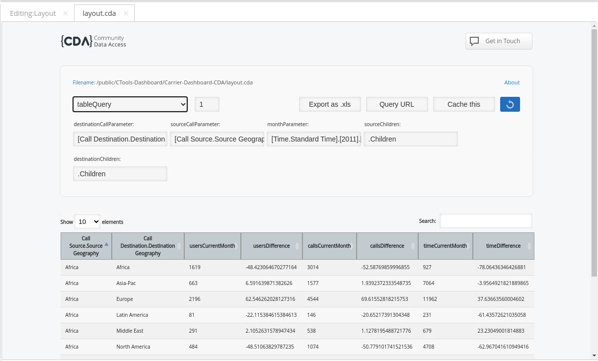<figcaption><p>tableQuery</p></figcaption></figure>

> **Note:**
>
> The column names and data formats are not ideal. We will improve the appearance of the data when we create the table later. For now let's modify the column names for the tableQuery.

6. To specify column names for the query output:
   * In the Properties pane, click in the Value column for the Columns property.
   * In the new window, click the Add button seven times.
   * In the Index and Name columns type the following, and then press OK.

| Index | Name |
| --- | --- |
| 0 | Source Call |
| 1 | Destination Call |
| 2 | Users |
| 3 | m/m-1 |
| 4 | Calls |
| 5 | m/m-1 |
| 6 | Duration |
| 7 | m/m-1 |

<figure>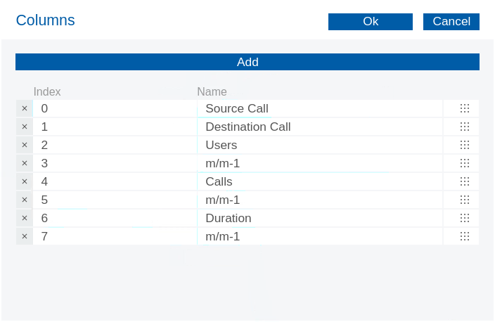<figcaption><p>Rename Columns</p></figcaption></figure>

7. Save and again check in CDA dashboard.

<figure>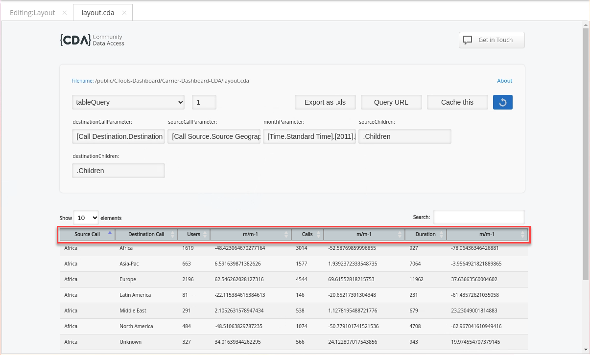<figcaption><p>Column Names</p></figcaption></figure>

#### CDA - lineChartQuery

> **Note:**
>
> The lineChartQuery.

1. Duplicate the tableQuery and rename to: lineChartQuery.

<figure>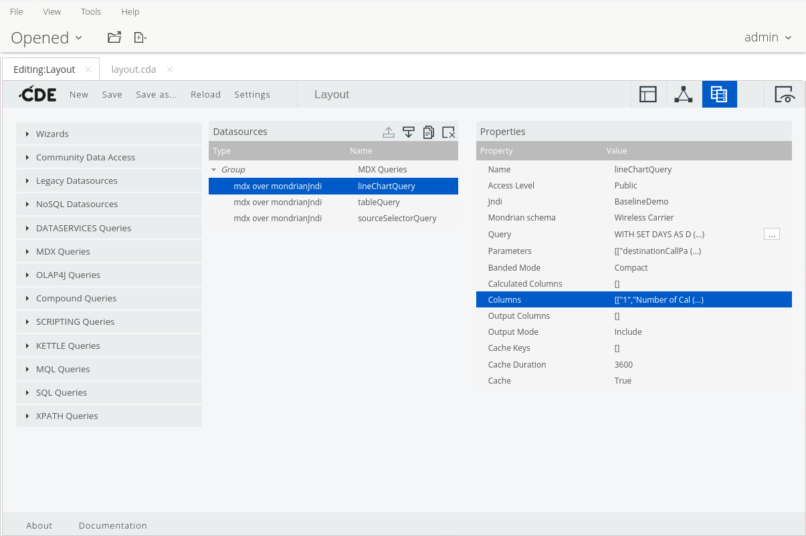<figcaption><p>lineChartQuery</p></figcaption></figure>

2. Replace the existing MDX query:

```
WITH 
 SET DAYS AS DESCENDANTS(${monthParameter}, 1) 
SELECT
 DAYS ON 1,
 {[Measures].[Calls], [Measures].[Users]} ON 0
FROM 
 [Call Corridor]
WHERE 
 (${sourceCallParameter}, ${destinationCallParameter})
```

3. To edit/delete the column names:
   * Click in the Value column for the Columns property.
   * To the left of Index 0, click the delete icon.
   * Click Remove.
   * Change Index 1 to Number of Calls.
   * Change Index 2 to Number of Users.
   * Delete the remaining column names.
   * Click OK.

<figure>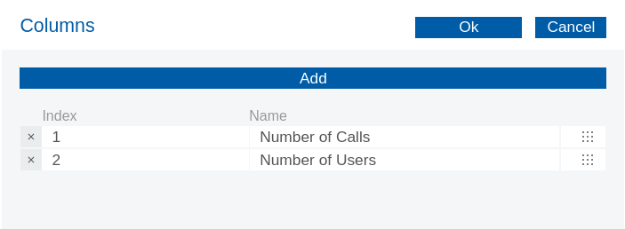<figcaption><p>Change column names</p></figcaption></figure>

4. Save and view in CDA Dashboard.

<figure>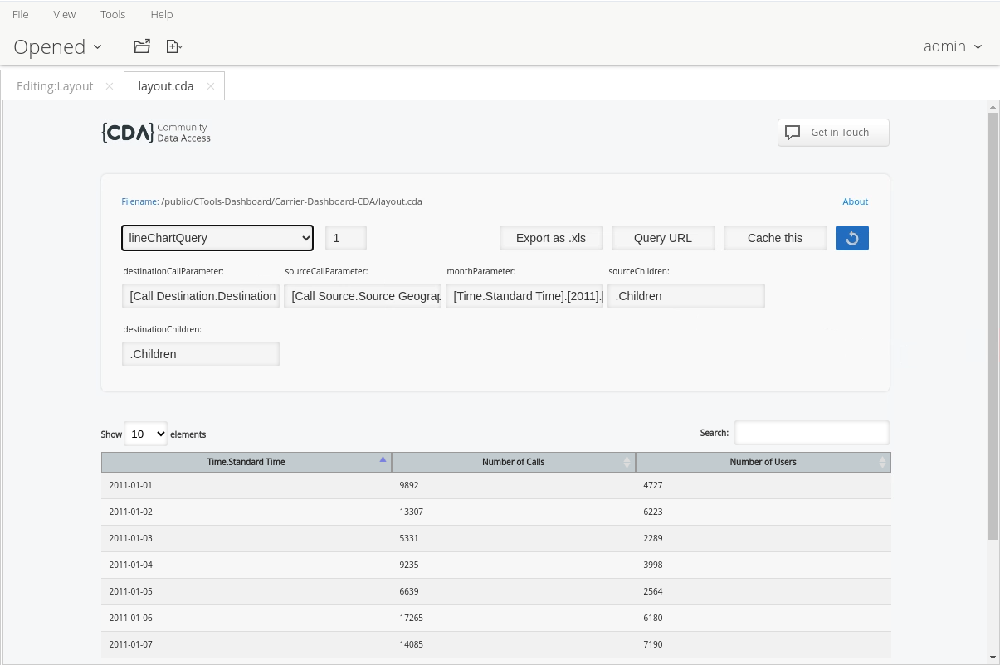<figcaption><p>lineChartQuery</p></figcaption></figure>

> **Note:**
>
> The completed workshop:
>
> /Public/CTools-Dashboard/Carrier-Dashboard-Layout/Layout CDA

### 2. Components

> **Note:**
>
> Interactive dashboard components are the bridge between raw data and actionable business insights. In this section you'll add the Table, Charts, Interactions (parameters, listeners, selectors, click actions), Exports, and Expandable rows that transform the static layout into a fully interactive analytical application.

<figure><figcaption><p>Wireless Carrier Dashboard</p></figcaption></figure>

#### Table - mainTable

> **Note:**
>
> Let's start by adding the Table components to the dashboard.

<figure><figcaption><p>mainTable</p></figcaption></figure>

1. Browse to: /Public/CTools Dashboard/Carrier-Dashboard-CDA/Layout
2. Click Edit under File Actions.

<figure>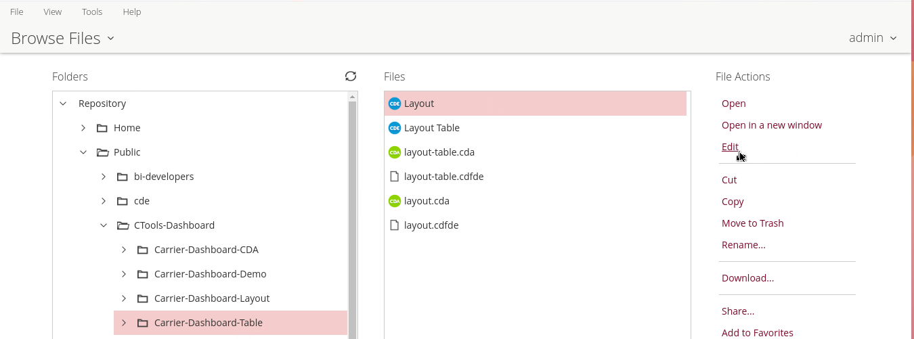<figcaption></figcaption></figure>

3. Click the Components Panel icon.
4. From the Components list, expand Standard, and then click Table Component.
5. Name this table component, in the Properties pane:
   * Click in the Value for the Name property.
   * Enter: mainTable.
   * Press Tab or Enter.

6. Specify the data source, in the Properties pane:
   * Click in the Value for the Datasource property.
   * On the keyboard, press the down arrow.
   * Select: tableQuery.

<figure>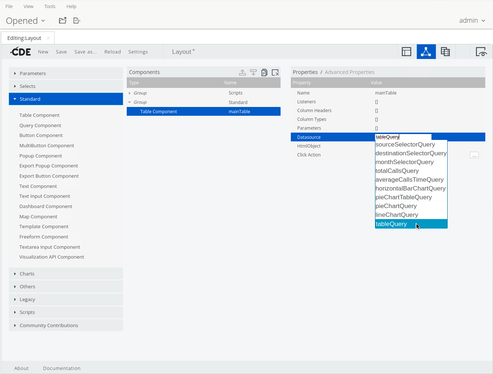<figcaption><p>Select tableQuery as Datasource</p></figcaption></figure>

7. Specify the HTML object, in the Properties pane:
   * Click in the Value for the HtmlObject property.
   * On the keyboard, press the down arrow.
   * Select: mainTableObj.

<figure>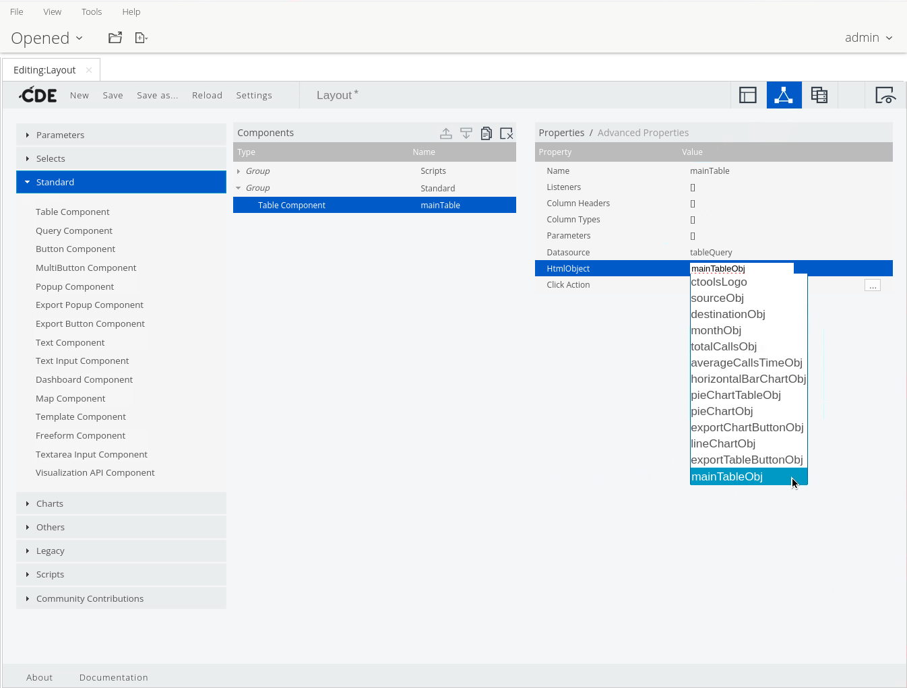<figcaption><p>Select mainTableObj</p></figcaption></figure>

8. Save & Preview the dashboard.

<figure>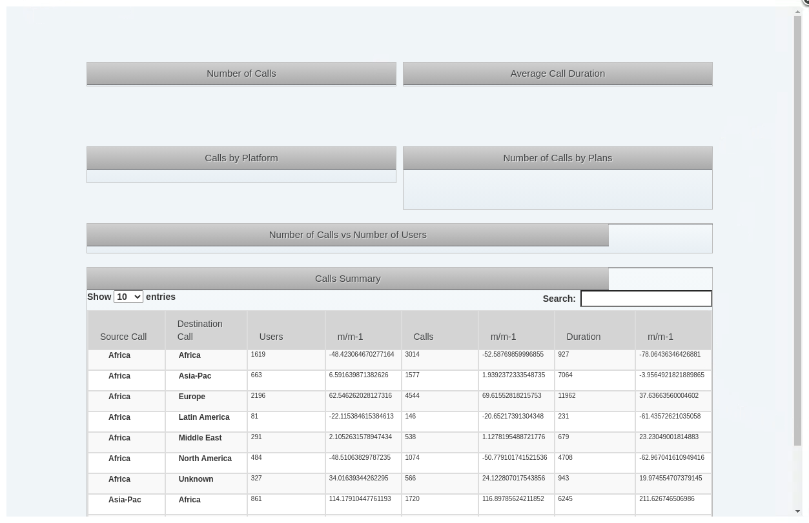<figcaption><p>Save &#x26; Preview</p></figcaption></figure>

> **Note:**
>
> The table doesn't look exactly like the one in the sample dashboard. In the next several steps we will specify some of the display options, set the page length, add trend arrows and data bars, and format the columns.

***

#### Advanced Properties

> **Note:**
>
> Advanced Properties extend the functionality of the component with features, such as:
>
> * dynamic parameter passing between components
> * custom JavaScript functions for complex calculations
> * cross-component communication through PostExecution functions
> * parameterized queries using variables and JavaScript expressions

1. To view the advanced properties, in the Properties pane, click Advanced Properties.

<figure>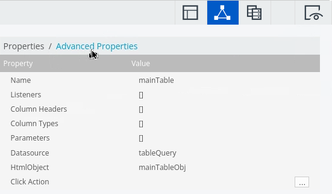<figcaption><p>Advanced Properties</p></figcaption></figure>

2. Change or set the following properties:

| Property | Value |
| --- | --- |
| Show Filter | False |
| Info Filter | False |
| Page Length | 7 |
| Length Change | False |
| Pagination Type | Simple |

<figure>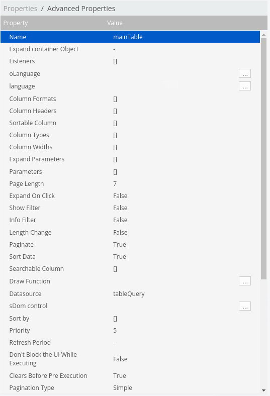<figcaption><p>Advanced Properties</p></figcaption></figure>

3. Specify the data types for the columns:
   * In the Properties pane, click in the Value column for the Column Types property.
   * In the new window, click the Add button seven times.
   * In the Value columns, enter the following:

<figure>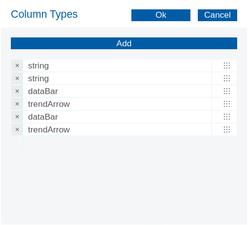<figcaption></figcaption></figure>

> **Note:**
>
> When entering the values just type the first few letters ..

4. Save & Preview the dashboard.

<figure>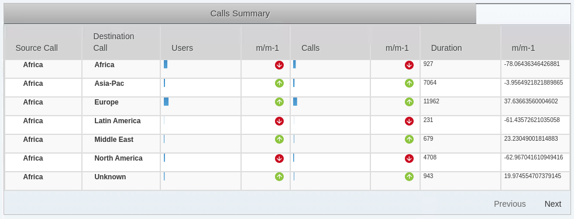<figcaption><p>Summary table - would be nice to have values next to Bar Chart ..</p></figcaption></figure>

> **Note:**
>
> The data bar and trend arrow columns do not show the data values. We must add pre-execution code to display these values.

5. Add pre-execution code to display the data values next to the data bars:
   * In the Properties pane, click the ellipsis icon to the right of the Pre-Execution property.
   * In the Javascript Wizard window, enter the following code, and then click OK:

```javascript
function f() {

    this.setAddInOptions("colType","trendArrow",   
    {
        includeValue: true,
        good: true
    });
    
    this.setAddInOptions("colType","dataBar",   
    {
        includeValue: true,
        width: 80,
        startColor: "#414344",
        endColor: "#414344" 
    });
}
```

<figure>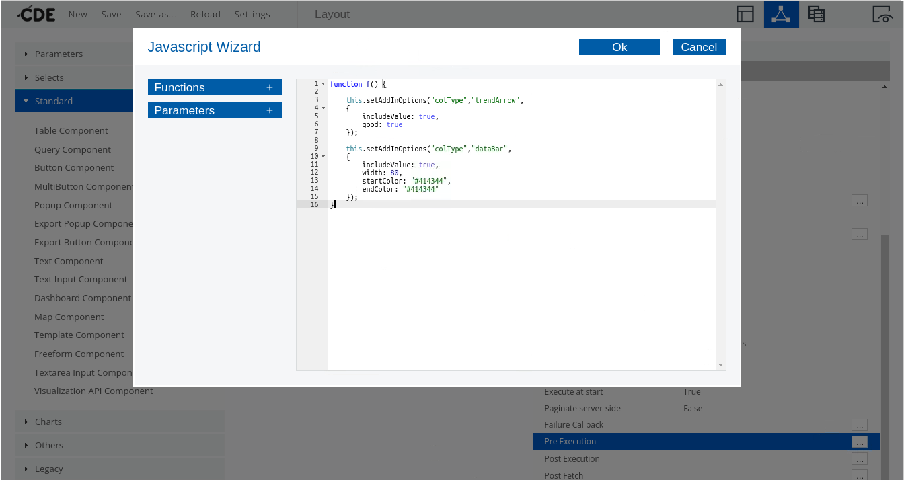<figcaption><p>Javascript</p></figcaption></figure>

6. Save & Preview the dashboard.

<figure>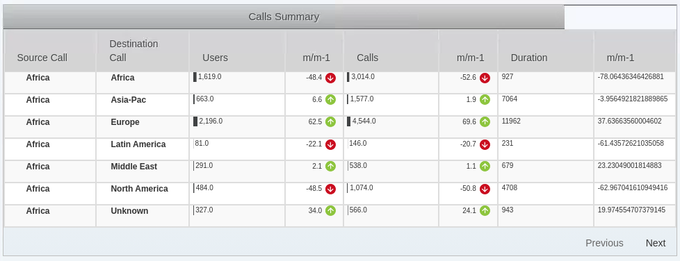<figcaption><p>Bar Chart data</p></figcaption></figure>

> **Note:**
>
> Great .. the data is now displayed .. however, it does need to be formatted. Also take a look at Africa .. may wish to address unknown values.

7. Specify the column formats using sprintf functions:
   * In the Properties pane, click in the Value column for the Column Formats property.
   * In the new window, click the Add button seven times.
   * In the text fields, enter the following:

<figure>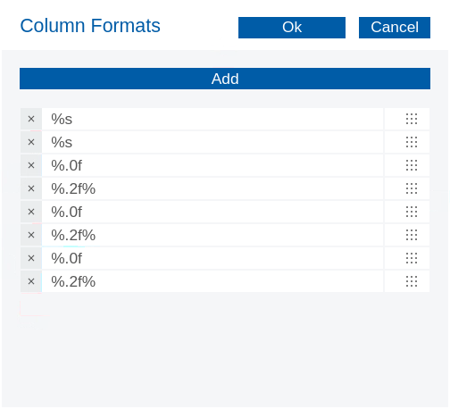<figcaption><p>Format Columns</p></figcaption></figure>

8. Specify the sort order:
   * In the Properties pane, click in the Value column for the Sort by property.
   * In the Index and Order fields, type the following, and then click OK:

<figure>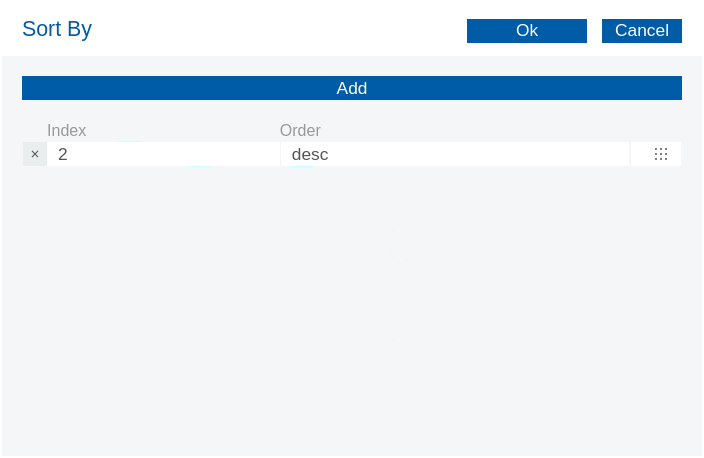<figcaption><p>Sort By</p></figcaption></figure>

9. Save & Preview the dashboard.

<figure>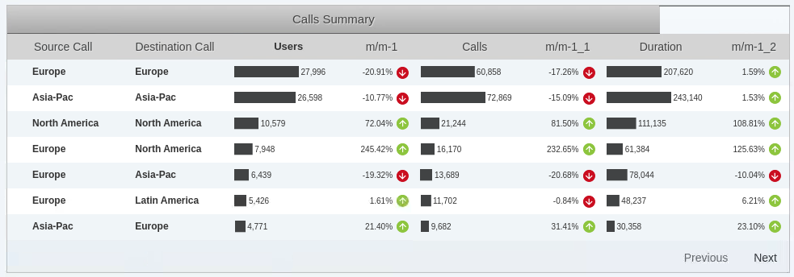<figcaption><p>Numbers - Formatted</p></figcaption></figure>

#### Charts - Pie Chart

> **Note:**
>
> Time for some Charts ..
>
> * connections tested
> * the layout has been confirmed
> * chart content & types agreed
> * dashboard functions included - export graphs & tables, buttons, downloads, etc ..

> **Note:**
>
> Let's start with the Pie Chart.

<figure><figcaption></figcaption></figure>

1. From the Components list, expand Charts, and then click CCC Pie Chart.
2. To name the pie chart, in the Properties pane:
   * Click in the Value for the Name property.
   * Type pieChart.
   * Press Tab or Enter.

3. To specify the data source, in the Properties pane:
   * Click in the Value for the Datasource property.
   * On the keyboard, press the down arrow.
   * Select pieChartQuery.

4. To specify the HTML object, in the Properties pane:
   * Click in the Value for the HtmlObject property.
   * On the keyboard, press the down arrow.
   * Select pieChartObj.

5. To specify the width and height for the pie chart, in the Properties pane:
   * Click in the Value for the Width property.
   * Type 140 and press Enter.
   * Click in the Value for the Height property.
   * Type 140 and press Enter.

6. Specify the CCC version, in the Properties pane:
   * Click in the Value for the Compatibility version property.
   * Type 2.
   * Press Tab or Enter.

> **Note:**
>
> The Compatibility version must be set because the latest version of CCC includes a different set of default properties.

7. Click on Advanced Properties
8. To specify the colors for the pie chart:
   * In the Properties pane, click in the Value column for the colors property.
   * In the new window, click the Add button two times.
   * In the text fields, type the following and then click OK:

```
#176ad6
#de3700
#191b1e
```

<figure>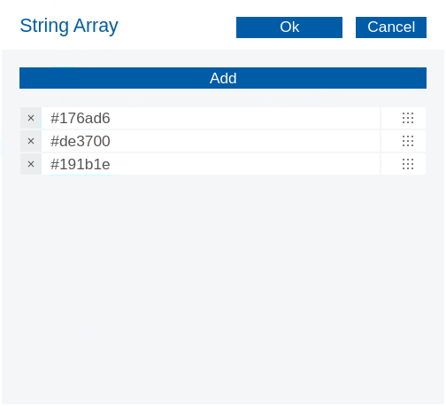<figcaption><p>Pie Chart colours</p></figcaption></figure>

9. To hide the values, in the Properties pane:
   * Click in the Value for the valuesVisible property.
   * On the keyboard, press the down arrow.
   * Click False.

***

#### Extension Points

> **Note:**
>
> Extension points in Pentaho CTools are predefined locations in the CTools framework where developers can add custom functionality without modifying the core code. They act as hooks that allow you to extend and customize dashboards and components.
>
> The main types of extension points in CTools include:
>
> 1. Component Extension Points: Allow you to extend existing components or create new components. These let you add custom properties, modify behavior, or create entirely new visualization types.
> 2. Dashboard Layout Extension Points: Enable modifications to the dashboard structure and layout system. You can add custom layout types or modify how components are arranged.
> 3. Lifecycle Extension Points: Hook into different phases of the dashboard lifecycle, such as initialization, refresh, or cleanup. These are particularly useful for adding custom logic that needs to run at specific times.

1. Customize the pie chart with extension points:
   * In the Properties pane, click in the Value column for the Extension Points property.
   * In the new window, click the Add button.
   * Complete the Arg and Value columns with the following, and then click OK:

<figure>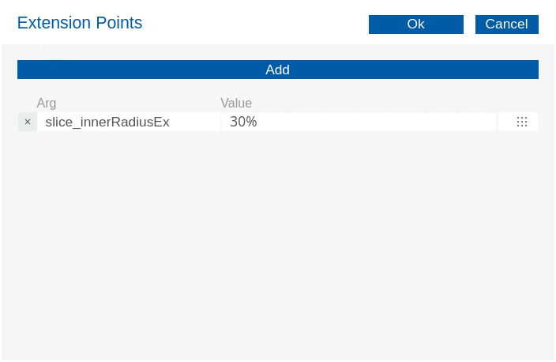<figcaption><p>Slice Pie Chart - Donut</p></figcaption></figure>

| Property | Value |
| --- | --- |
| slice\_innerRadiusEx | 30% |

***

#### Resources

> **Note:**
>
> Finally we need to add a script that picks up the chart colors and adds them before the Legend.

1. To add a bulletLegend script, click Resources.
2. In the Properties pane, enter: bulletLegend.
3. Copy & paste the following script.
4. Save & Reload the dashboard.

```javascript
 require([
    'cdf/AddIn',
    'cdf/Logger',
    'cdf/Dashboard.Clean',
    'cdf/lib/jquery',
], function(AddIn,Logger, Dashboard, $) {
    var bulletLegend = {
        name:"bulletLegend",
        label:"Bullet Legend",
        defaults: {
            /* default colors, replace in preExecution */
            colors: ["#F00", "#0F0", "#00F"] 
        },
        implementation: function(tgt,st,opt){
            
            Logger.log("Starting addin");
            
            var color = opt.colors[ st.rowIdx % opt.colors.length ],
                container = $('<div/>').addClass('bulletContainer'),
                bullet = $('<div/>').addClass('bullet').css('background-color' , color),
                //text = opt.textFormat.call(this, st.value, st, opt);
                text = st.value;
                container.append(bullet).append(text);
                $(tgt).empty().append(container);            
                        
        }
                
    };    
    Dashboard.registerGlobalAddIn("Table", "colType", new AddIn(bulletLegend));
});
```

> **Note:**
>
> The function calls inbuilt CDF libraries to add the bulletLegend in a \<div> container. If you have changed the default table colors then you will need to update.

5. Preview the dashboard.

<figure>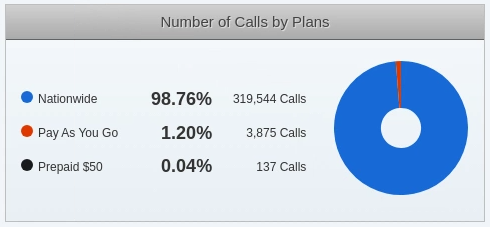<figcaption><p>Bullet Legend added</p></figcaption></figure>

#### Charts - Line Chart

<figure><figcaption><p>Line Chart with extensions</p></figcaption></figure>

1. From the Components list, expand Charts, and then click CCC Line Chart.
2. Name the line chart, in the Properties pane:
   * Click in the Value for the Name property.
   * Enter: lineChart.
   * Press Tab or Enter.

3. Specify the data source, in the Properties pane:
   * Click in the Value for the Datasource property.
   * On the keyboard, press the down arrow.
   * Select: lineChartQuery.

4. Specify the HTML object, in the Properties pane:
   * Click in the Value for the HtmlObject property.
   * On the keyboard, press the down arrow.
   * Select: lineChartObj.

5. Specify the height for the line chart, in the Properties pane:
   * Click in the Value for the Height property.
   * Type 220 and press Enter.

6. Delete the width for the line chart, in the Properties pane:
   * Click in the Value for the Width property.
   * Delete the value and press Enter.

> **Note:**
>
> Deleting the width does not affect the chart on the dashboard, but it does affect other renderings of it.

7. Specify the CCC version, in the Properties pane:
   * Click in the Value for the Compatibility version property.
   * Type 2 and press Tab or Enter.

8. Save & Preview the dashboard.

<figure>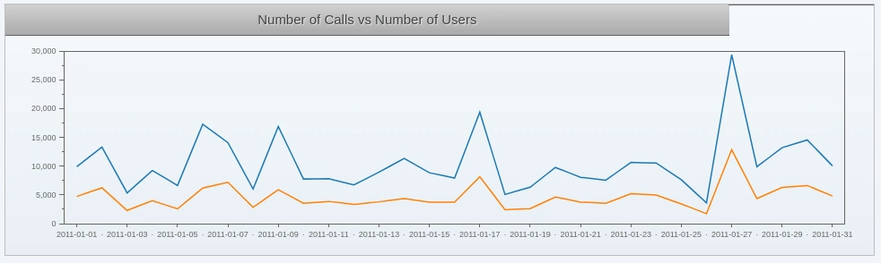<figcaption><p>Line Chart</p></figcaption></figure>

9. Click on Advanced Properties.
10. Specify the colors for the line chart:
    * In the Properties pane, click in the Value column for the colors property.
    * In the new window, click the Add button.
    * In the text fields, type the following and then click OK:

```
#176ad6
#191b1e
```

<figure>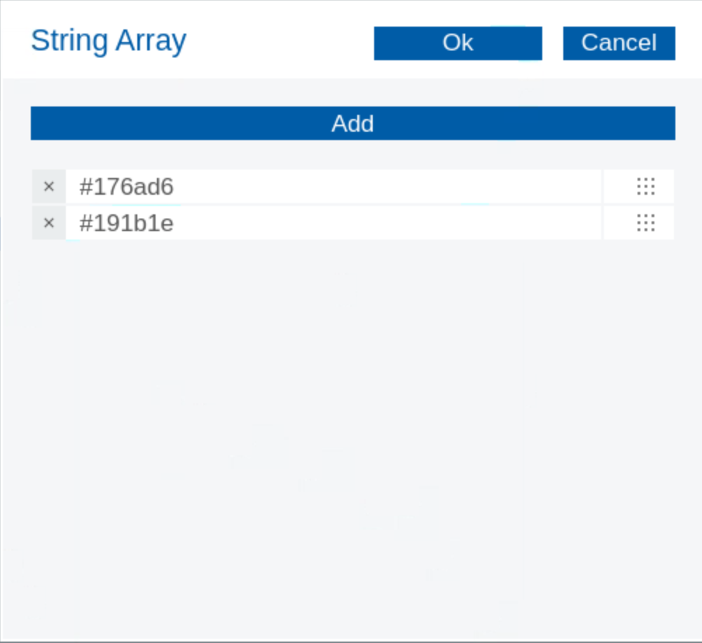<figcaption><p>Line Chart colours</p></figcaption></figure>

11. Change or set the following advanced properties:

| Property | Value |
| --- | --- |
| dotsVisible | True |
| legend | True |
| legendAlign | Right |
| legendPosition | Top |
| plotFrameVisible | False |

12. Save & Preview the dashboard.

<figure>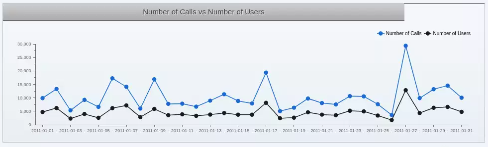<figcaption><p>Advanced Properties</p></figcaption></figure>

***

#### Extension Point

> **Note:**
>
> Extension points in Pentaho CTools are predefined locations in the CTools framework where developers can add custom functionality without modifying the core code. They act as hooks that allow you to extend and customize dashboards and components.

1. Customize the line chart with extension points:
   * In the Properties pane, click in the Value column for the Extension Points property.
   * In the new window, click the Add button six times.
   * Complete the Arg and Value columns with the following, and then click OK:

<figure>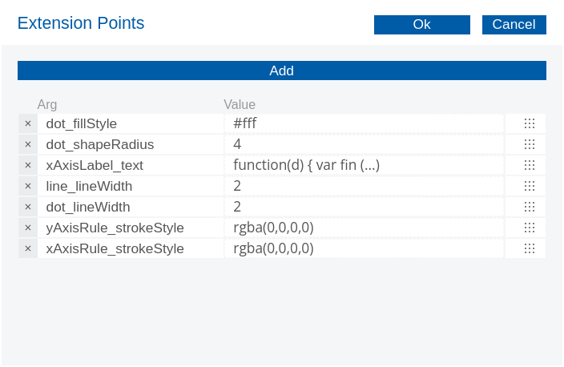<figcaption><p>Call-out box</p></figcaption></figure>

| Arg | Value |
| --- | --- |
| dot\_fillStyle | #fff |
| dot\_shapeRadius | 4 |
| xAxisLabel\_text | see code block below .. |
| line\_lineWidth | 2 |
| dot\_lineWidth | 2 |
| yAxisRule\_strokeStyle | rgba(0,0,0,0) |
| xAxisRule\_strokeStyle | rgba(0,0,0,0) |

```
function(d) {
    var fin = pv.Format.date('%y-%m-%d'), 
        fout = pv.Format.date('%d');
    
    return fout.format( fin.parse(d.vars.tick.value) );
}
```

2. Save & Preview the dashboard.

<figure>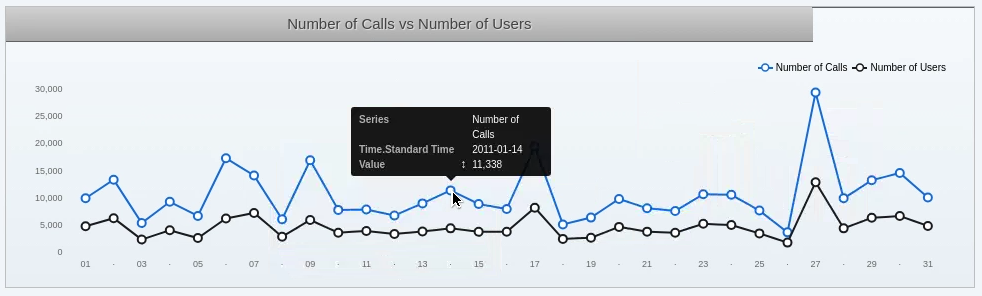<figcaption><p>Line Chart with extensions</p></figcaption></figure>

#### Interactions - Parameters & Listeners

> **Note:**
>
> Our dashboard is a bit static ..
>
> Users need to be able to perform drill-downs, select parameter-driven filters, and perform real-time data updates.
>
> Let's say we have a list of Regions that when selected updates the table data based on the Region selected. In CDF language, a parameter which holds the Region values is passed to a Component listener - in this case for a Table Component - which is then updated.

> **Note:**
>
> A component can have more than one parameter in the Listeners property, and a Parameter can be listened by more than one component. Every time the parameter changes, all components that listen to it are updated.

> **Note:**
>
> So we're going to:
>
> * Add parameter components to a dashboard.
> * Specify the parameters and listeners for dashboard components.
> * Add select (filter) components to a dashboard.

> **Note:**
>
> Let's add some parameters to: pieChartQuery datasource.

1. Click on the Datasources Panel perspective.
2. Expand the MDX Queries group & select: pieChartQuery.

<figure>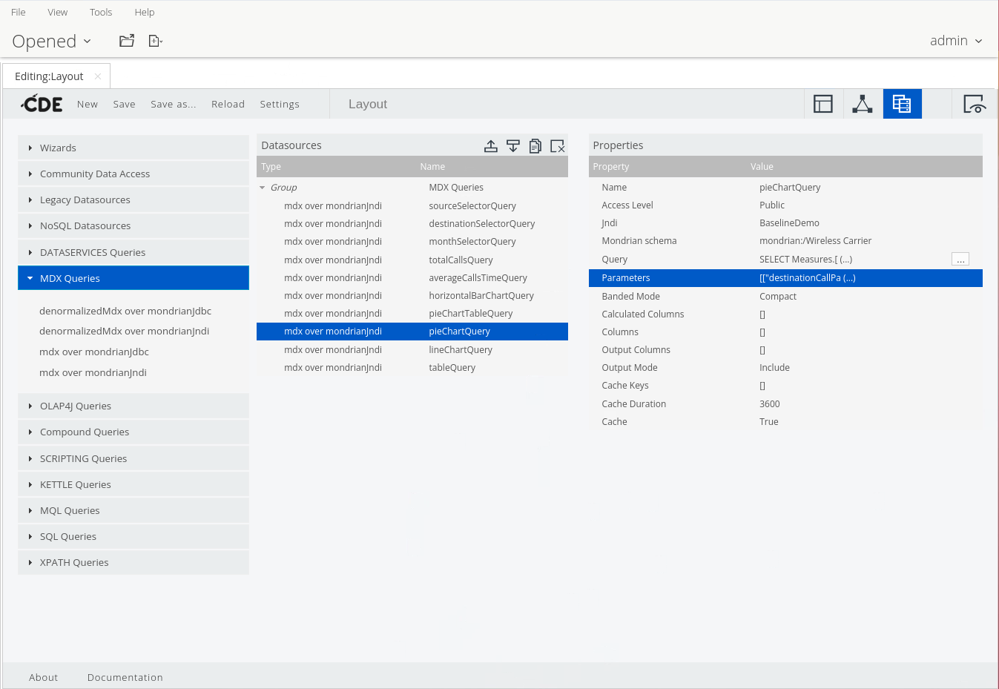<figcaption><p>pieChartQuery</p></figcaption></figure>

3. View the parameters used in the pieChartQuery, in the Properties pane:
   * Click in the Value for the Parameters property.
   * Take note of the three parameters.
   * Click OK.

<figure>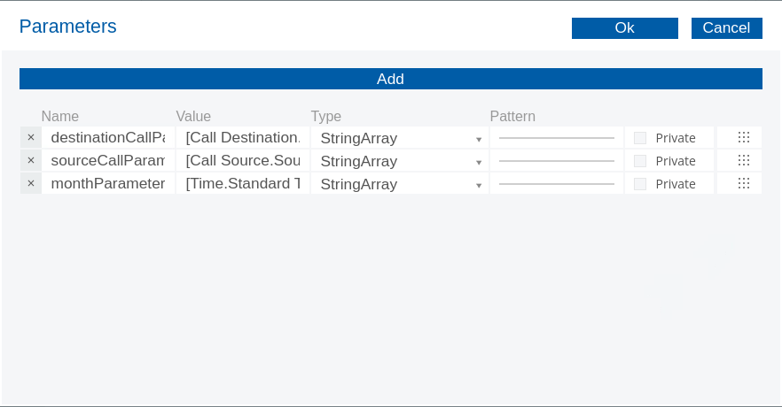<figcaption><p>pieChartQuery - parameters</p></figcaption></figure>

4. Add the sourceCallParameter:
   * From the Components list, expand Parameters.
   * Click: Custom Parameter.

<figure>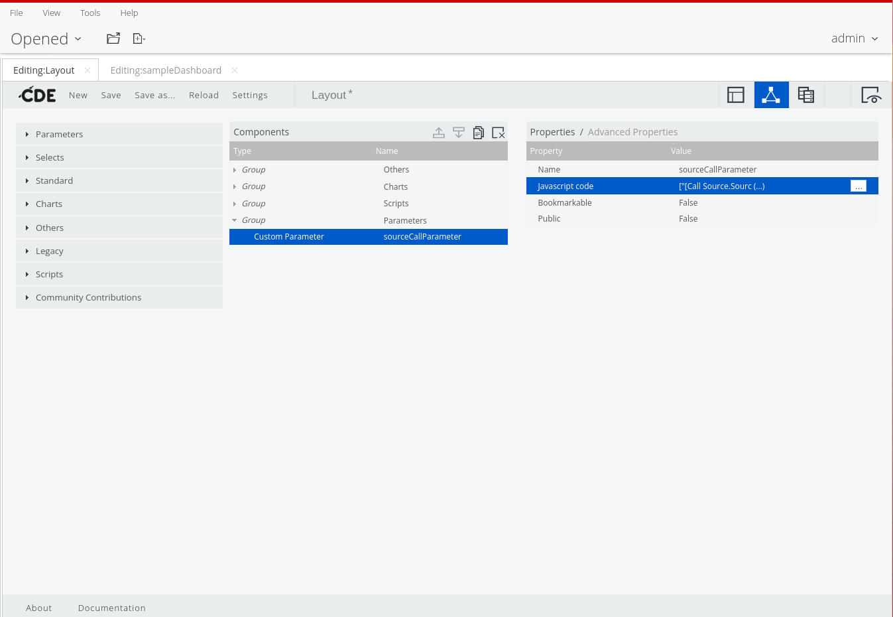<figcaption></figcaption></figure>

5. To set the default value, in the Properties pane:
   * Click in the JavaScript for the Property value property.
   * Type the following.
   * Press Tab or Enter.

```
["[Call Source.Source Geography].[All]"] 
```

<figure>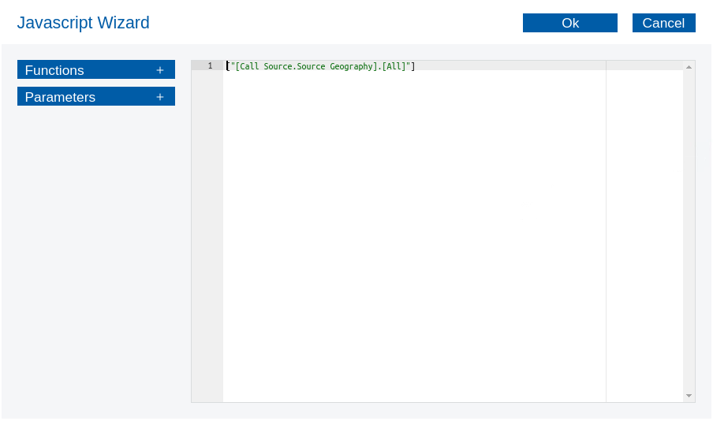<figcaption></figcaption></figure>

6. Add the destinationCallParameter and monthParameter, repeat the previous steps using the following values:

destinationCallParameter

```
["[Call Destination.Destination Geography].[All]"] 
```

monthParameter

```
["[Time.Standard Time].[2011].[Q1 2011].[January]"] 
```

***

#### Listener

> **Note:**
>
> Set the parameters and listeners for the pieChart component ..

1. In the Components pane, click to expand the Charts group
2. Click: pieChart.

<figure>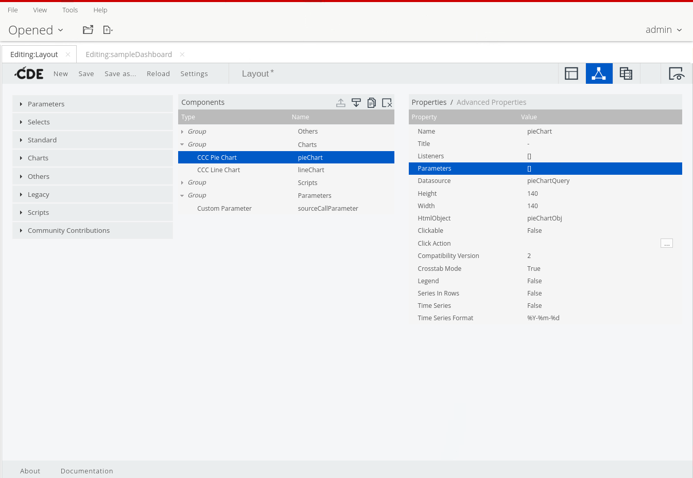<figcaption><p>Add parameters to pieChart component</p></figcaption></figure>

3. To specify the parameters for the pieChart:
   * In the Properties pane, click in the Value column for the Parameters property.
   * In the new window, click the Add button twice.
   * In the first Arg columns, enter: monthParameter.
   * Enter the first few letters to select monthParameter.
   * Repeat the steps to add the destinationCallParameter and sourceCallParameter, and then click OK.

4. Specify the listeners for the pieChart:
   * In the Properties pane, click in the Value column for the Listeners property.
   * Click the drop-down arrow.
   * Click to select the Select All checkbox.
   * Click OK.

<figure>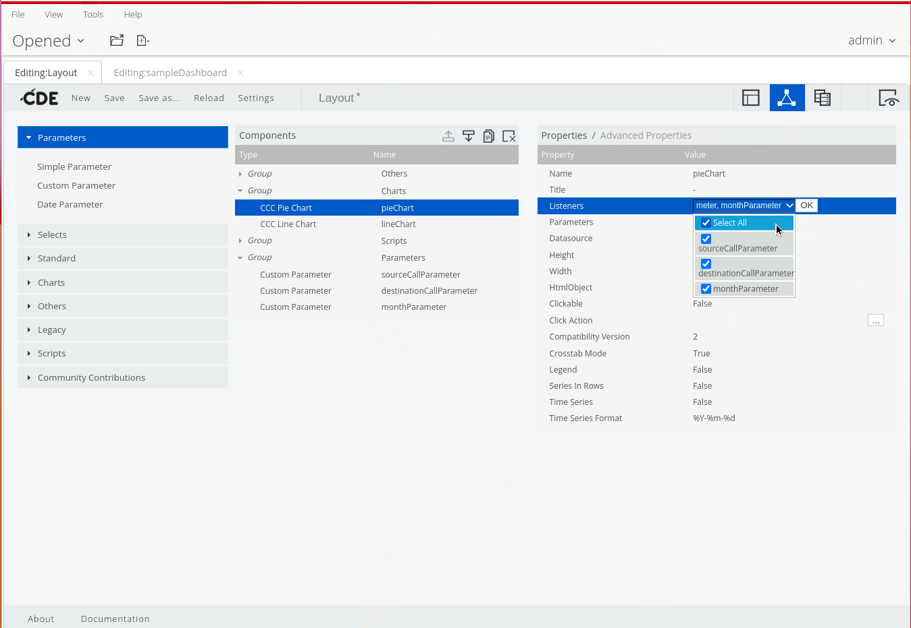<figcaption><p>Add Listeners</p></figcaption></figure>

#### Interactions - Selectors

> **Note:**
>
> CTools selectors are interactive UI components that allow users to filter and manipulate dashboard data dynamically. They act as user input controls (like dropdown menus, checkboxes, or radio buttons) that can be connected to other dashboard components through parameter bindings.
>
> When a user interacts with a selector, it triggers updates in connected charts, tables, or other visualizations based on the selected values. This provides a way to create interactive, drill-down capable dashboards where users can explore data through different dimensions and filters.
>
> A selector can be a simple textbox where a user type free text, or more elaborated as a select list, a radio button or a date picker.

<figure>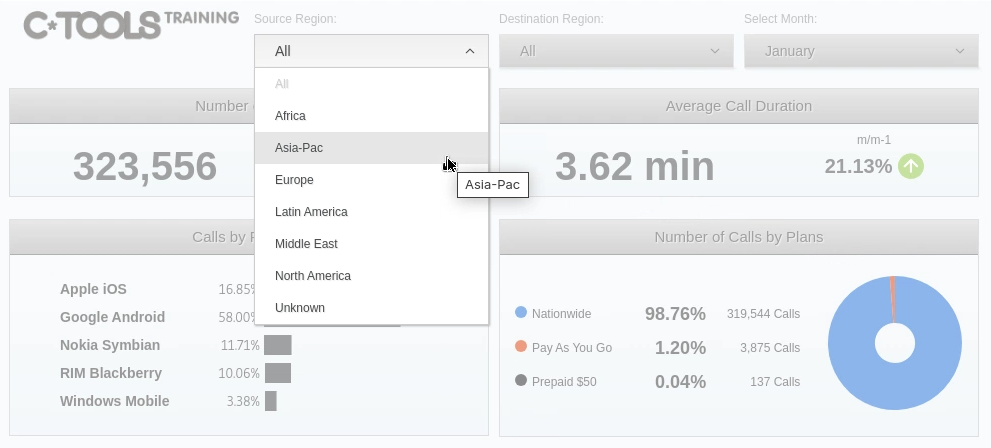<figcaption><p>Selectors</p></figcaption></figure>

1. Add the sourceSelector, from the Components list, expand Selects, and then click Filter Component.
2. Customize the Selector with the following Advanced Properties:

| Property | Value |
| --- | --- |
| Name | sourceSelector |
| Title | Source Region: |
| Parameter | sourceCallParameter |
| Value as ID | False |
| Datasource | sourceSelectorQuery |
| Show Icons | False |
| Show "Only" Button | False |
| Show Search Filter | False |
| HtmlObject | sourceObj |
| Execute at Start | True |
| Pre Change | see code block below .. |

sourceSelector

```javascript
 function f(selectedItem) {
    // Get ".children" on MDX if member "All" is selected 
    if (selectedItem.toString() ===  "[Call Source.Source Geography].[All]")
        this.dashboard.setParameter('sourceChildren', '.Children');
    else
        this.dashboard.setParameter('sourceChildren', '');
}
```

destinationSelector

```javascript
function f(selectedItem) {
    if (selectedItem.toString() === "[Call Destination.Destination Geography].[All]")
        this.dashboard.setParameter('destinationChildren', '.Children');
    else
        this.dashboard.setParameter('destinationChildren', '');
}
```

Month

| Property | Value |
| --- | --- |
| Name | monthSelector |
| Title | Select Month: |
| Datasource | monthSelectorQuery |
| HtmlObject | monthObj |

3. Save & Preview dashboard.

<figure>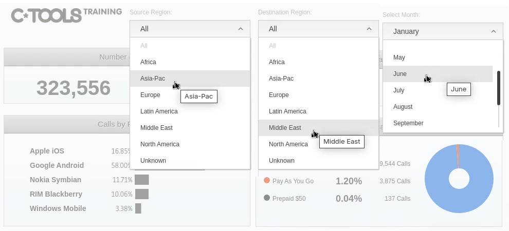<figcaption><p>Selectors</p></figcaption></figure>

#### Interactions - clickAction

> **Note:**
>
> We're going to use the clickAction function on the pieChart to set the value of one parameter (planTypeParameter), to trigger the update of another component (lineChart).

<figure>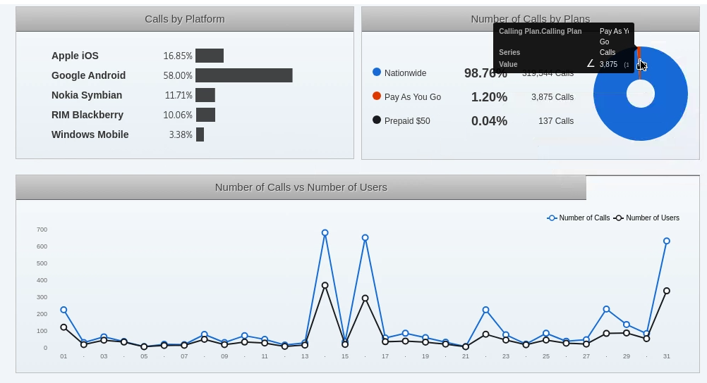<figcaption><p>Click pieChart to update lineChart</p></figcaption></figure>

1. From the Components list, expand the Generic group, and then click Simple Parameter.
2. Name the parameter, in the Properties panel:
   * Click in the Value field for the Name property.
   * Enter: planTypeParameter.
   * Press Tab or Enter.

3. To set the default value, in the Properties panel:
   * Click in the Value field for the Property value property.
   * Type: All.
   * Press Tab or Enter.

4. Save the dashboard.

<figure>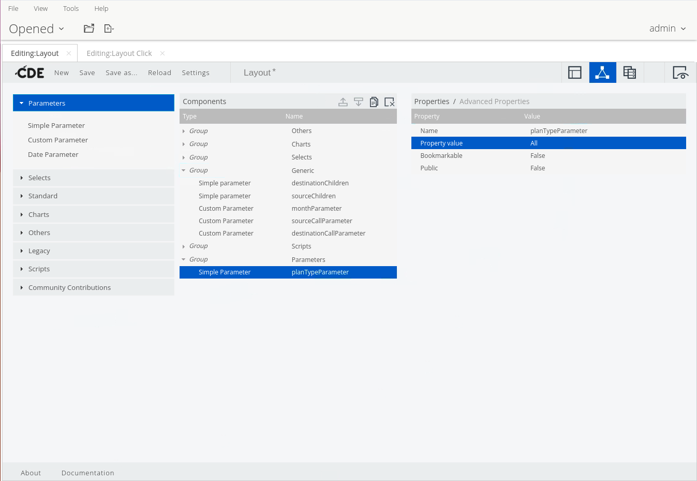<figcaption><p>Add planTypeParameter</p></figcaption></figure>

> **Note:**
>
> Now we need to add the parameter - PlanTypeParameter - to the lineChartQuery.

5. In the Datasources pane, expand the MDX Queries group, and then click to select the lineChartQuery.
6. To change the MDX query:
   * In the Properties pane, click the ellipsis icon to the right of the Query property.
   * In the Sql Editor window, replace the existing text with the following MDX query, and then click Ok.

```sql
WITH 
 SET DAYS AS DESCENDANTS(${monthParameter}, 1) 
MEMBER [Calling Plan].[Selected Plan Type] as Aggregate( [Calling Plan].[${planTypeParameter}] )
SELECT
 DAYS ON 1,
 {[Measures].[Calls], [Measures].[Users]} ON 0
FROM 
 [Call Corridor]
WHERE 
(${sourceCallParameter}, ${destinationCallParameter}, [Calling Plan].[Selected Plan Type])
```

> **Note:**
>
> Last few steps:
>
> Add the planTypeParameter to the datasource
>
> Enable - True - Clickable in pieChart component
>
> Add listener

7. Add the new parameter and specify its default value:
   * In the Properties pane, click in the Value field for the Parameters property.
   * In the new window, click the Add button once.
   * In the Name column, enter: planTypeParameter.
   * In the Value column, enter: All.
   * Click Ok.

8. In the Components pane, expand the Charts group, and then click to select the pieChart component.
9. Enable the clickable functionality, in the Properties pane:
   * Click in the Value field for the clickable property.
   * On the keyboard, press the down arrow.
   * Select True.

<figure>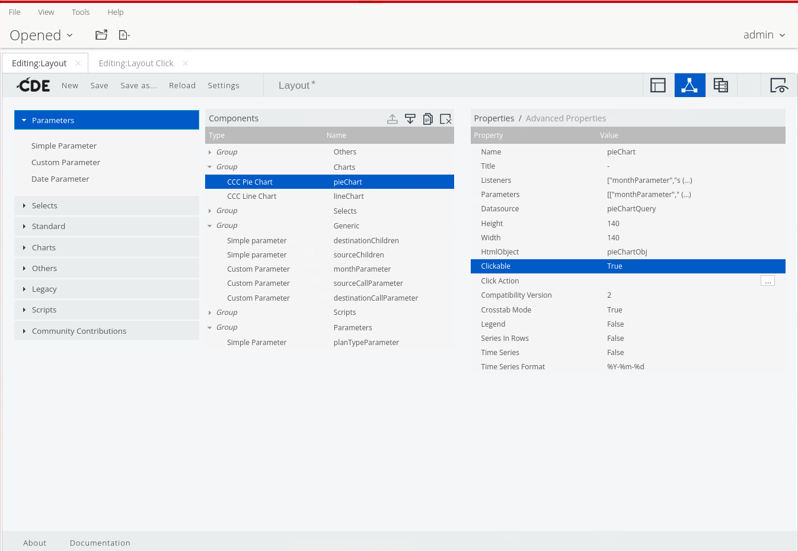<figcaption><p>Clickable</p></figcaption></figure>

10. To specify the clickAction function that will trigger the update:
    * Click the ellipsis icon to the right of the clickAction property.
    * In the Javascript Wizard window, enter the following code, and then click OK:

```javascript
function f(scene) {
    var vars = scene.vars;
    var c = vars.category.value;
    var v = vars.value.value;
    Logger.log("Clicked on Category '" + c + "' , which has a Value of: " + v);
    dashboard.fireChange('${p:planTypeParameter}', c);
}
```

> **Note:**
>
> Inside the clickAction function we call dashboard.fireChange (param, value) with the name of the parameter to change and the new value for that parameter.
>
> When a user clicks on a mark (a slice of pie, in this case), the above function is triggered (which triggers the update of all the components that listen to that parameter).

11. In the Components pane, expand the Charts group, and then click to select the lineChart component.
12. Add the extra listener for the lineChart:
    * In the Properties pane, click in the Value column for the Listeners property.
    * Click the drop-down arrow.
    * Click to select the planTypeParameter checkbox.
    * Click OK.

<figure>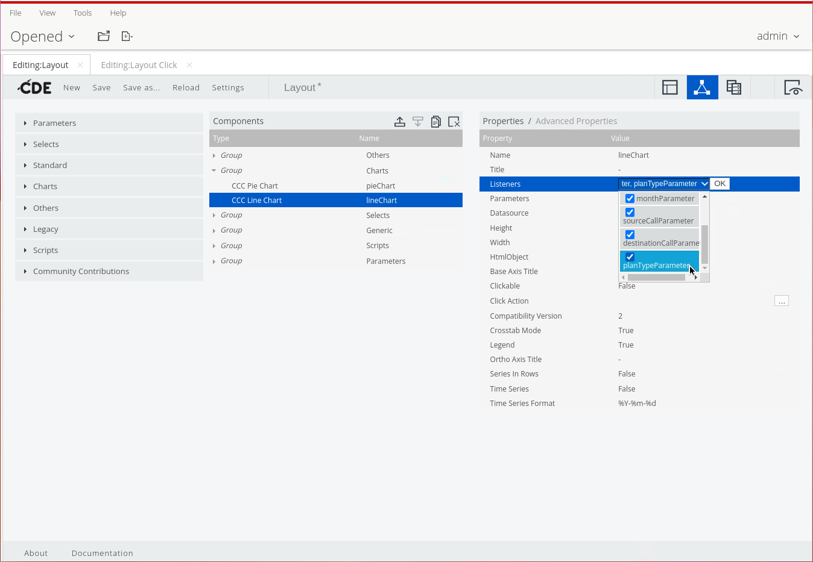<figcaption><p>Add planTypeParameter listener.</p></figcaption></figure>

13. Select the extra parameter for the lineChart:
    * In the Properties pane, click in the Value for the Parameters property.
    * In the new window, click the Add button once.
    * In the Arg column, type planTypeParameter.
    * Click the ellipsis, and then from the Choose Parameter window, click to select planTypeParameter.
    * Click Ok.

<figure>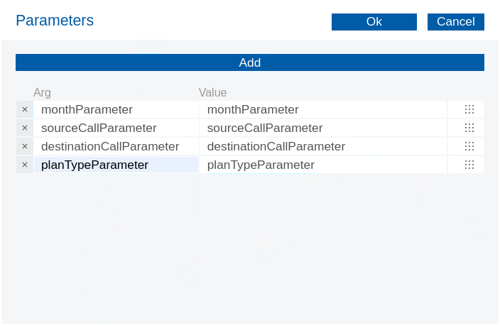<figcaption><p>Add planTypeParameter to lineChart</p></figcaption></figure>

14. Save & preview the dashboard.

<figure>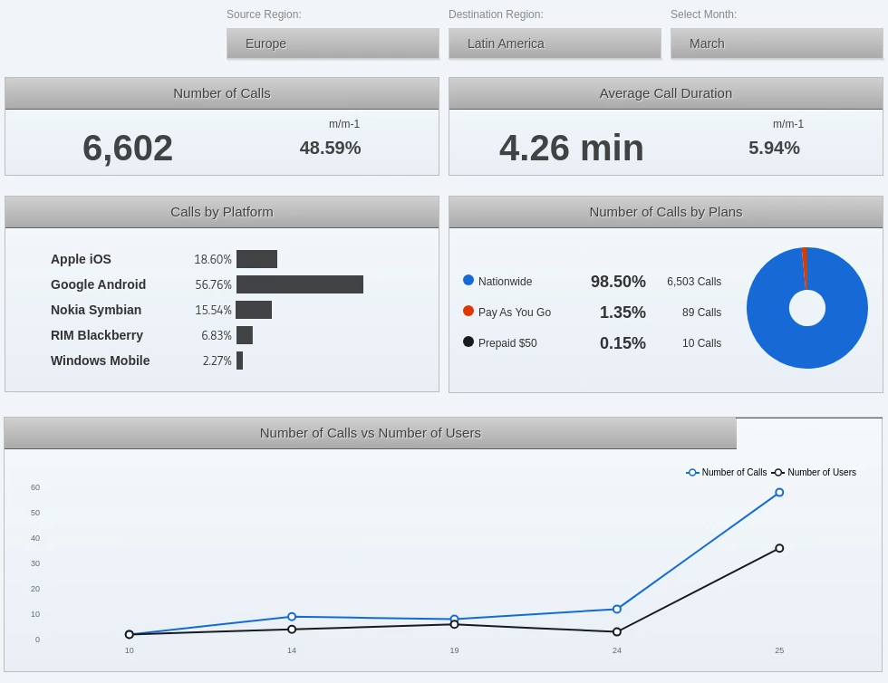<figcaption><p>Interactive pieChart</p></figcaption></figure>

#### Export - Button & Popup

> **Note:**
>
> The final part is to leverage CDE export functionality to export charts and the main table.
>
> The data can be exported in several formats, like CSV, XLS, XML and JSON (through CDA API calls done in the background).
>
> If we have CDE/CCC chart components on our dashboard, we can also export the charts as PNG and SVG files (through CGG).
>
> There's two components to add:
>
> * Export Button Component – use this when you only need to export the data in one specific format (CSV, XLS, XML or JSON).
> * Export Popup Component – use this when you need to export chart images (PNG and/or SVG format) or when you want to export the data in more than one format (CSV, XLS, XML and/or JSON).

<figure><figcaption><p>Export Options</p></figcaption></figure>

1. To add the exportTableButton, from the Components list, expand Standard.
2. Select: Export Button Component.

<figure>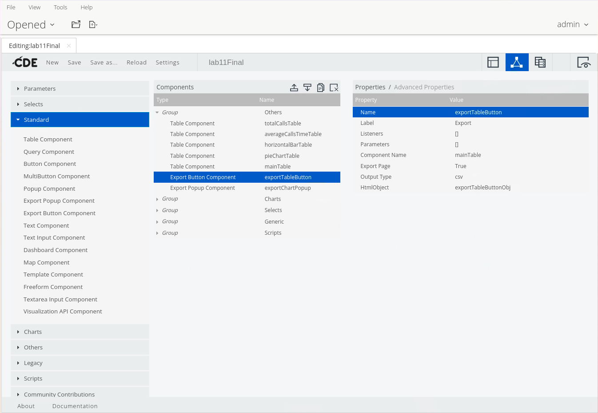<figcaption><p>Export Button Component</p></figcaption></figure>

3. Name the export button, in the Properties pane:
   * Click in the Value for the Name property.
   * Enter: exportTableButton.
   * Press Tab or Enter.

4. To set the label of the export button, in the Properties pane:
   * Click in the Value for the Label property.
   * Enter: Export.
   * Press Tab or Enter.

5. To define from which component we want to export the data, in the Properties pane:
   * Click in the Value for the Component Name property.
   * Enter: mainTable.
   * Press Tab or Enter.

6. To select the HTML object, in the Properties pane:
   * Click in the Value for the HTML Object property.
   * On the keyboard, press the down arrow.
   * Select: exportTableButtonObj.

7. Save & preview the dashboard.

<figure>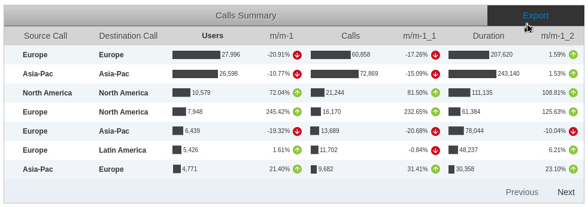<figcaption><p>Export table - CSV</p></figcaption></figure>

***

Export Popup

> **Note:**
>
> In the final part of this workshop we're going to add an ExportPopupComponent to export the Number of Calls vs Number of Users chart (lineChart) data in CSV and PNG.

1. To add the exportChartPopup, from the Components list, expand Standard.
2. Select: ExportPopupComponent.

<figure>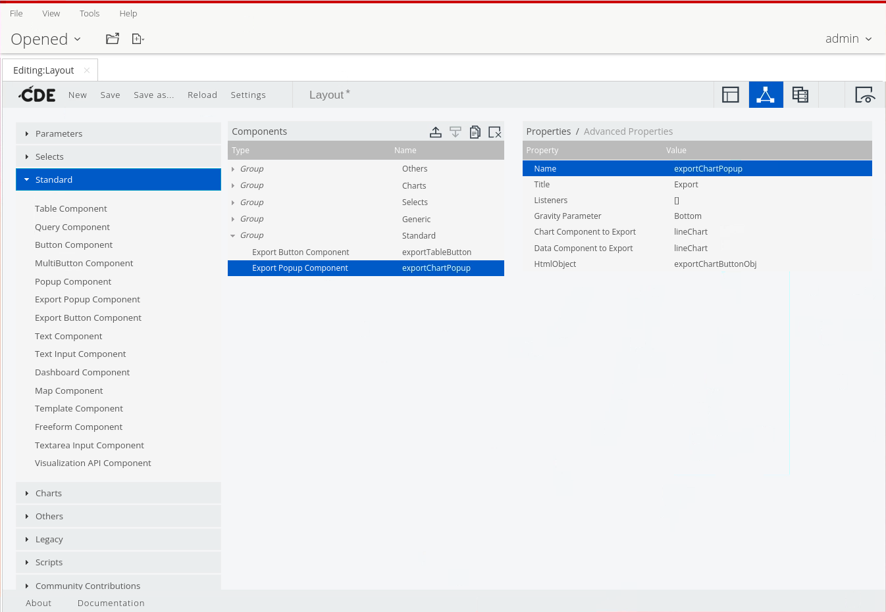<figcaption><p>exportChartPopup Component</p></figcaption></figure>

3. To name the export button, in the Properties pane:
   * Click in the Value for the Name property.
   * Enter: exportChartPopup.
   * Press Tab or Enter.

4. Set the label of the export button, in the Properties pane:
   * Click in the Value for the Title property.
   * Enter: Export.
   * Press Tab or Enter.

5. Define from which chart component we want to export the image, in the Properties pane:
   * Click in the Value for the Chart Component to Export property.
   * Enter: lineChart.
   * Press Tab or Enter.

6. Define from which component we want to export the data, in the Properties pane:
   * Click in the Value for the Data Component to Export property.
   * Enter: lineChart.
   * Press Tab or Enter.

7. Select the HTML object, in the Properties pane:
   * Click in the Value for the HTML Object property.
   * On the keyboard, press the down arrow.
   * Select exportChartButtonObj.

8. Save the dashboard.

> **Note:**
>
> To use the export popup, we must view the dashboard (not Preview).

9. Open the dashboard, from the Browse Files perspective - Carrier-Dashboard-Export

<figure>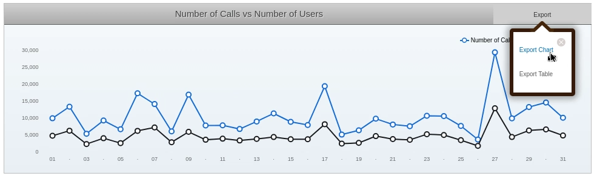<figcaption><p>Export - Chart or Table</p></figcaption></figure>

<figure>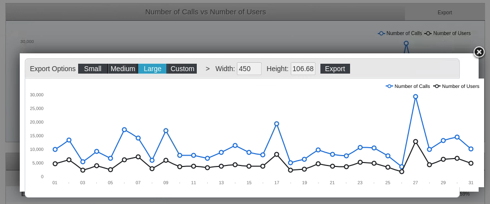<figcaption><p>Export Chart</p></figcaption></figure>

> **Note:**
>
> The Table is currently being exported as .xls. Let's change this to .csv

10. Change or set the following advanced properties:

| Property | Value |
| --- | --- |
| Chart Export Label | Export PNG |
| Data Export Type | csv |
| Data Export Label | Export CSV |
| Name for Data Export attachment | NrofCallsVsUsers |
| Post Execution | see code block below |

```javascript
function f() {
  // Remove the arrow element
$('.popupComponent div.arrow').remove();
}
```

11. Save and open dashboard in Browser.

<figure>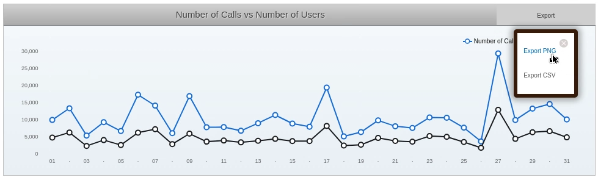<figcaption><p>Export - PNG &#x26; CSV</p></figcaption></figure>

#### Expand - Expandable Rows

> **Note:**
>
> One of the neat features that can be added is .. expanding rows.
>
> So if you click on a row in the mainTable, the record will expand and display a barChart - Calls by Platform.
>
> The barChart has 3 parameters & listeners - monthParameter, tableSourceParameter, tableDestinationParameter.

<figure>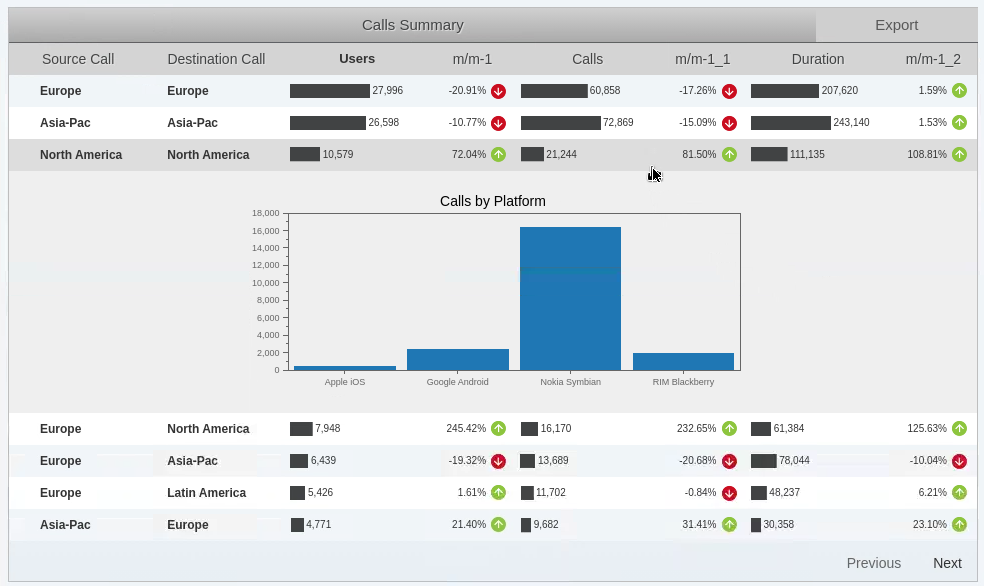<figcaption><p>Expand a record</p></figcaption></figure>

1. To add a main row that will encapsulate the content to be displayed on the expanded row, in the Layout Structure panel:
   * Select the layoutColumn column under the layoutRow row.
   * Click in the Add Row icon.

2. Name the row, in the Properties panel:
   * Click in the Value field for the Name property.
   * Enter: expandedContent.
   * Press Tab or Enter.

<figure>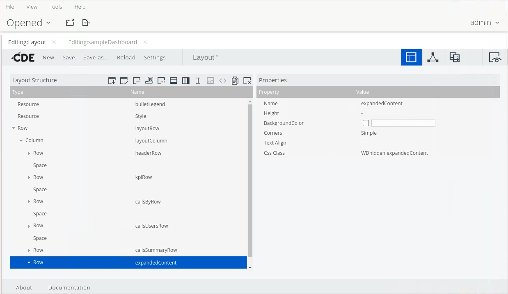<figcaption><p>Add row - expandedContent</p></figcaption></figure>

3. Assign CSS classes to the expandedContent row, in the Properties panel:
   * Click in the Value field for the Css Class property.
   * Enter: WDhidden expandedContent.
   * Press Tab or Enter.

4. Add a column for the displayed bar chart, with the expandedContent row selected, click the Add Columns icon.
5. Name the column, in the Properties panel:
   * Click in the Value field for the Name property.
   * Enter: barChartObj.
   * Press Tab or Enter.

***

#### Data Source

> **Note:**
>
> Need to create a barChartQuery to populate the barChart ..

<figure>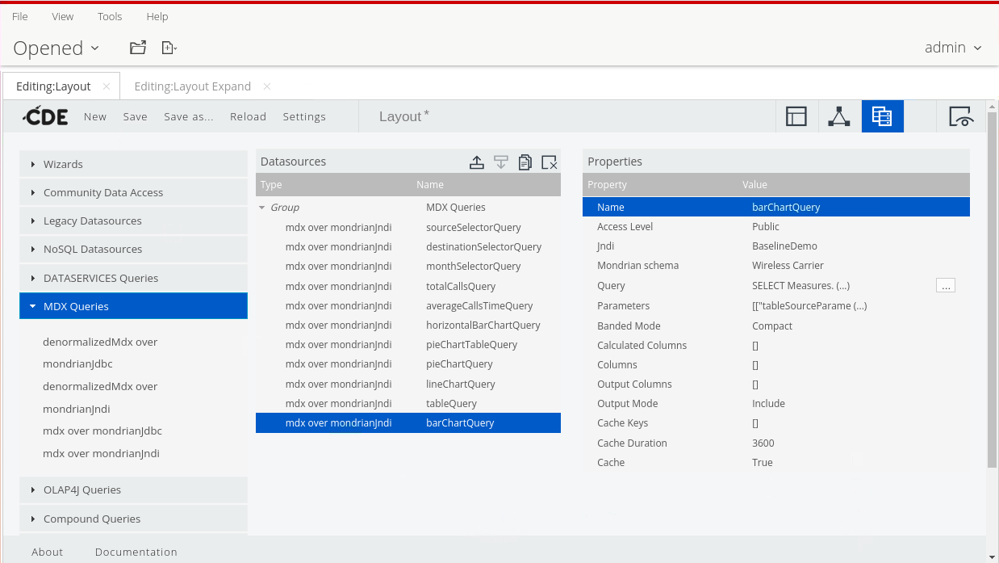<figcaption><p>barChartQuery</p></figcaption></figure>

1. Click the Datasources Panel icon.
2. Expand MDX Queries, and select: mdx over mondrianJndi.
3. Name this data source, in the Properties pane:
   * Click in the Value for the Name property.
   * Enter: barChartQuery.
   * Press Tab or Enter.

4. Select the BaselineDemo jndi connection, in the Properties pane:
   * Click in the Value for the Jndi property.
   * On the keyboard, press the down arrow.
   * Select: BaselineDemo connection.

5. Select the Wireless Carrier Mondrian schema, in the Properties pane:
   * Click in the Value for the Mondrian schema property.
   * On the keyboard, press the down arrow.
   * Select: Wireless Carrier schema.

6. Enter the MDX query:
   * In the Properties pane, click the ellipsis icon to the right of the Query property.
   * In the MDX Editor window, enter the following MDX query, and then click Ok.

```
SELECT
	Measures.[Calls] on 0, 
	[Platform].[Platform].members on 1  
FROM [Call Corridor]
WHERE 
(
${monthParameter}, 
	[Call Source.Source Geography].[${tableSourceParameter}], 
	[Call Destination.Destination Geography].[${tableDestinationParameter}]
)
```

7. Save the dashboard.

***

Parameters

> **Note:**
>
> Finally we need to pass some parameters - filters - based on:
>
> Source
>
> Destination
>
> Month

1. Add the parameters and specify default values:
   * In the Properties pane, click in the Value column for the Parameters property.
   * In the new window, click the Add button twice.
   * In the Name and Value columns, type the following, and then click Ok.

<figure>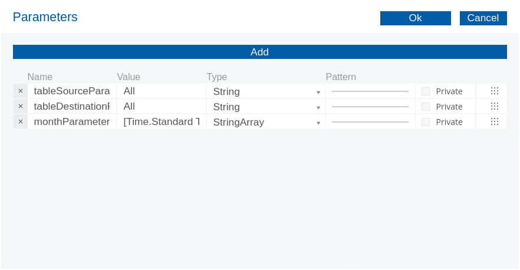<figcaption><p>Parameters - barChart</p></figcaption></figure>

| Name | Value |
| --- | --- |
| tableSourceParameter | All |
| tableDestinationParameter | All |
| monthParameter | [Time.Standard Time]. [2011].[Q1 2011].[January] |

2. From the Components list, expand Parameters, and then click Simple Parameter.

<figure>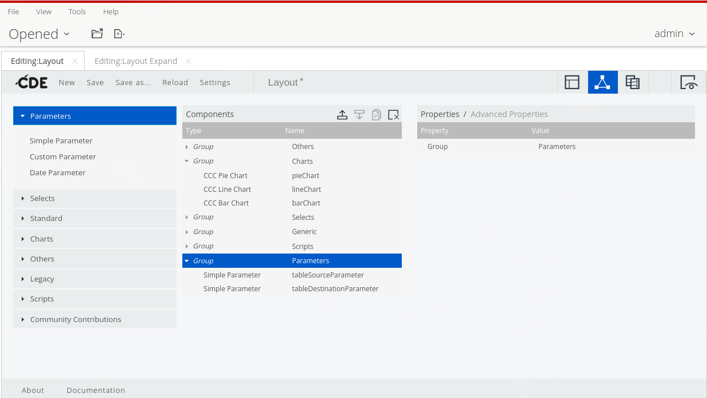<figcaption><p>Listeners</p></figcaption></figure>

3. Name the parameter, in the Properties pane:
   * Click in the Value for the Name property.
   * Enter: tableSourceParameter.
   * Press Tab or Enter.

4. Set the default value, in the Properties pane:
   * Click in the Value for the Property value property.
   * Enter: All.
   * Press Tab or Enter.

5. Repeat the previous three steps to add: tableDestinationParameter and set the default value to All.
6. Save the dashboard.

***

#### Chart

> **Note:**
>
> Finally .. configure the Chart & Listener components.

1. Click the Components Panel icon.
2. From the Components list, expand Charts, and then click CCC Bar Chart.

<figure>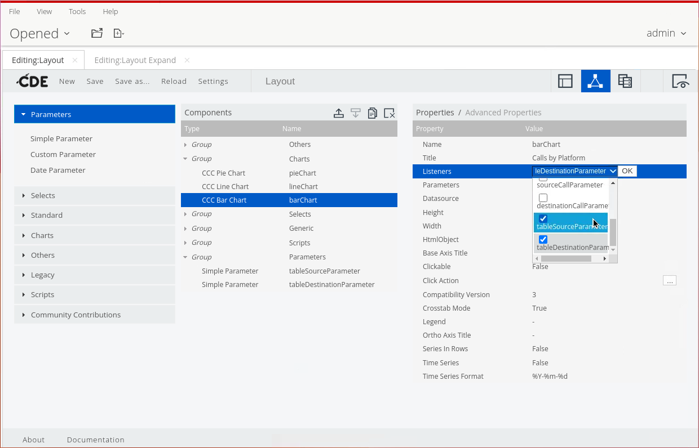<figcaption><p>Add Listeners</p></figcaption></figure>

3. Name the bar chart, in the Properties pane:
   * Click in the Value for the Name property.
   * Enter: barChart.
   * Press Tab or Enter.

4. Add a title for the bar chart, in the Properties pane:
   * Click in the Value for the Title property.
   * Type Calls by Platform.
   * Press Tab or Enter.

<figure>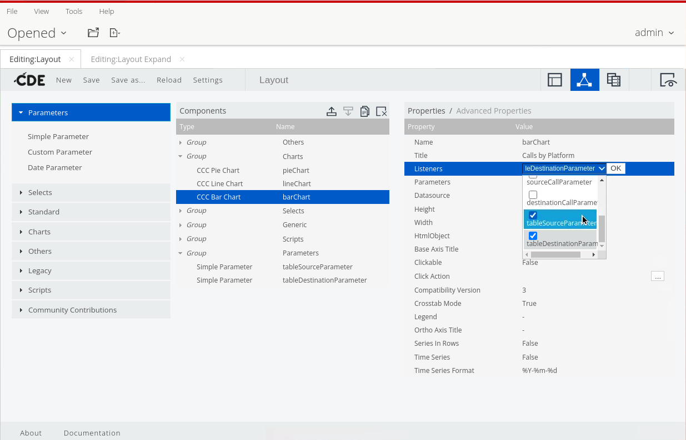<figcaption><p>Add Listeners</p></figcaption></figure>

5. Specify the listeners for the barChart:
   * In the Properties pane, click in the Value column for the Listeners property.
   * Click the drop-down arrow.
   * Click to select: monthParameter, tableSourceParameter, and tableDestinationParameter checkboxes.
   * Click OK.

6. Specify the parameters for the barChart:
   * In the Properties pane, click in the Value column for the Parameters property.
   * In the new window, click the Add button twice.
   * In the first Arg columns, type monthParameter.
   * Enter the first few letters of monthParameter.
   * Repeat the steps to add the tableSourceParameter and tableDestinationParameter, and then click OK.

<figure>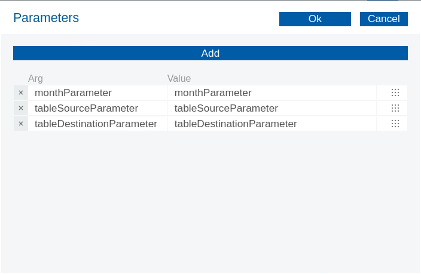<figcaption><p>Parameters to pass to datasource</p></figcaption></figure>

7. Specify the data source, in the Properties pane:
   * Click in the Value for the Datasource property.
   * On the keyboard, press the down arrow.
   * Select: barChartQuery.

8. Specify the width and height for the bar chart, in the Properties pane:
   * Click in the Value for the Height property.
   * Type: 200 and press Enter.
   * Click in the Value for the Width property.
   * Type: 500 and press Enter.

9. Specify the CCC version, in the Properties pane:
   * Click in the Value for the Compatibility version property.
   * Type: 2.
   * Press Tab or Enter.

10. Specify the HTML object, in the Properties pane:
    * Click in the Value for the HtmlObject property.
    * On the keyboard, press the down arrow.
    * Select: barChartObj.

11. Disable the legend, in the Properties pane:
    * Click in the Value for the Legend property.
    * On the keyboard, press the down arrow.
    * Select: False.

<figure>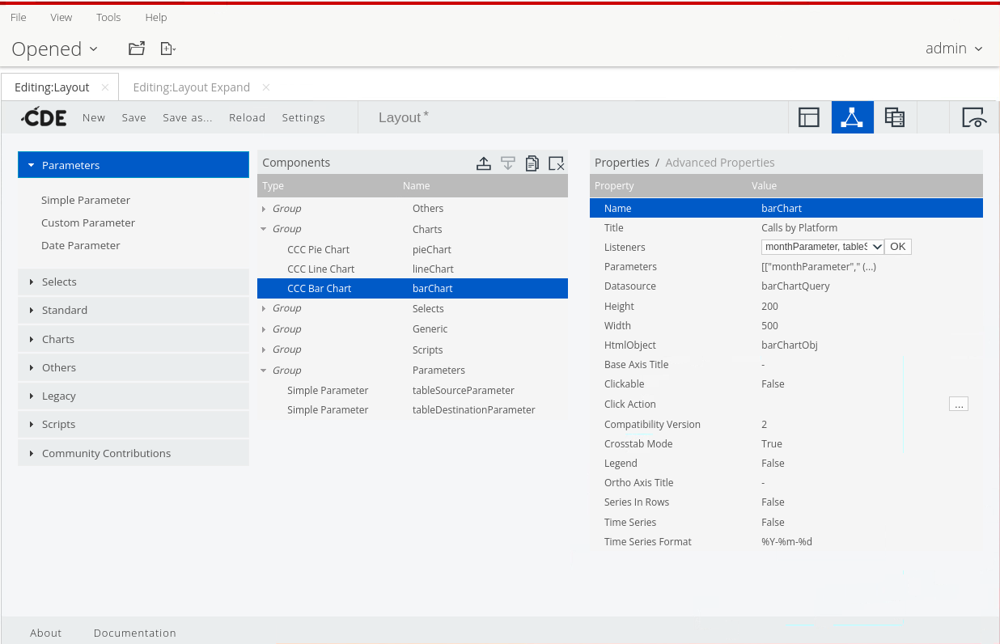<figcaption><p>Properties</p></figcaption></figure>

***

#### Advanced Properties

1. Click Advanced Properties.
2. Set the execute at start flag, in the Properties pane:
   * Click in the Value for the Execute at start property.
   * On the keyboard, press the down arrow.
   * Select: False.

> **Note:**
>
> When a dashboard is loaded all its components are instantiated. The Execute at start property determines for each component if it should be executed or not at that moment. If the Execute at start flag of a component is False, the component will not be rendered.

3. Save the dashboard.

***

#### Enable mainTable

> **Note:**
>
> Finally .. enable the Expand option in the mainTable.

<figure>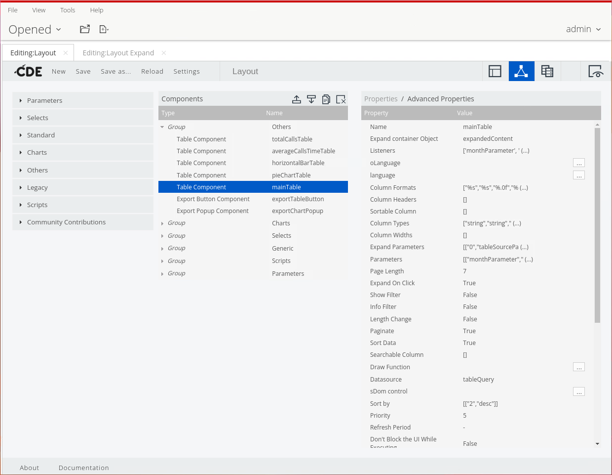<figcaption><p>Enable mainTable</p></figcaption></figure>

1. From the Components list, expand Others, and then click the mainTable component.
2. In the Properties pane, click Advanced Properties.
3. Set the expand on click property, in the Properties pane:
   * Click in the Value for the Expand on Click property.
   * On the keyboard, press the down arrow.
   * Select: True.

4. Specify the object that encapsulates the content on the expand row, in the Properties pane:
   * Click in the Value for: Expand container Object property.
   * Enter: expandedContent.
   * Press Tab or Enter.

5. Specify the parameters that will carry the column values to be passed to the expanded content:
   * In the Properties pane, click in the Value column for the Expand Parameters property.
   * In the new window, click the Add button.
   * In the first Arg column, type 0.
   * Enter the first few letters to select: tableSourceParameter.
   * In the second Arg column, type 1.
   * Enter the first few letters to select: tableDestinationParameter.
   * Click OK.

<figure>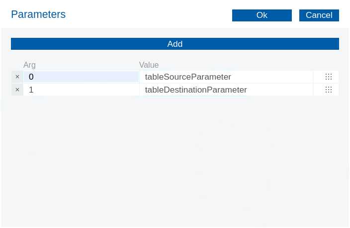<figcaption></figcaption></figure>

> **Note:**
>
> The Arg column contains the column index and the Value column refers to the name of the parameter that stores its values.

6. Save & Preview the dashboard.

<figure>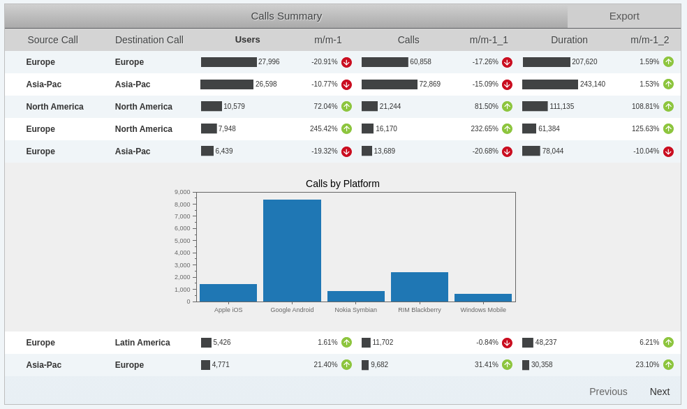<figcaption><p>Calls by Platform</p></figcaption></figure>

### 3. Preview

> **Note:**
>
> With the layout built, CDA data sources wired, all components configured, and interactivity in place, open the completed dashboard to confirm everything works end to end.

<figure><figcaption><p>Wireless Carrier Dashboard</p></figcaption></figure>

> **Note:**
>
> Validate the finished Carrier Dashboard:
>
> * The three selectors (Source Region, Destination Region, Month) filter the data dynamically.
> * The KPI panels show Number of Calls and Average Call Duration.
> * The Pie Chart (donut) is clickable and drives the Line Chart via planTypeParameter.
> * The Line Chart shows Number of Calls vs Number of Users with the styled extension points.
> * The mainTable shows trend arrows and data bars; clicking a row expands it to reveal the Calls by Platform bar chart.
> * The Export Button exports the table as CSV; the Export Popup exports the line chart as PNG and its data as CSV.

> **Note:**
>
> The completed workshop:
>
> /Public/CTools-Dashboard/Carrier-Dashboard-Export

> **Success:** You've built the complete Wireless Carrier dashboard in CDE — layout and CSS, CDA MDX data sources, interactive CCC charts, selectors, click actions, exports, and expandable rows — all rendering and filtering end to end in the Pentaho User Console.

::::
