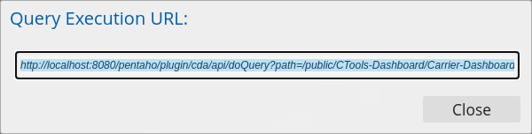

# Overview of Community Graphics Generator

<div class="pcm-intro">

The **Community Graphics Generator (CGG)** renders CCC charts **server-side** as static images. It's the right tool when you need a chart as a picture rather than an interactive widget — for **email reports and PDF exports**, for **browsers with limited SVG support**, and for **on-demand generation via URL**. CGG is fully integrated with **CDE** and reads its data through **CDA**.

</div>

> **Note:**
>
> #### What CGG is for
>
> CGG generates static images from charts and visualizations. It's primarily used when you need a static snapshot of a dashboard visualization — particularly useful for **email reports, PDF exports, or scheduled report generation**.
>
> CGG works by rendering charts **server-side**, supporting output formats including **PNG, JPG, and SVG**. It integrates seamlessly with other Pentaho components like **CDA** for data access and **CDE** for dashboard integration. You can trigger CGG through **URL parameters**, making it flexible for different use cases such as scheduled reports or on-demand generation.

<figure><figcaption><p>URL for tableQuery</p></figcaption></figure>

> **Note:**
>
> #### When to reach for CGG
>
> The tool is especially valuable in scenarios where interactive visualizations aren't practical, or when you need to distribute reports to users without direct access to Pentaho dashboards. It supports **batch processing**, **high-resolution outputs**, and can be **automated through scheduling**. This makes it an essential component for enterprise reporting scenarios where static image generation of charts and graphs is required.
>
> Key technical capabilities include:
>
> - Server-side processing with memory and resource management
> - Multiple output formats (PNG, JPG, SVG) with customizable DPI settings
> - Integration with CDA for data access and query handling
> - Support for automated report generation and batch processing
> - Advanced security features including authentication and access control
> - Performance optimization through caching and resource allocation
> - Custom scripting support and conditional formatting options

To export a CGG chart, call the URL:

```http
http://<pentaho server url>/pentaho/plugin/cgg/api/services/draw?script=<path to the script>
```

> **Note:**
>
> #### Enterprise applications
>
> Common enterprise applications include **automated PDF report generation**, **email distribution of visualizations**, **dashboard exports**, and **document embedding**. The tool's ability to handle complex visualizations while maintaining high-quality output makes it particularly valuable in business intelligence and reporting environments where consistent, automated visual reporting is essential.
