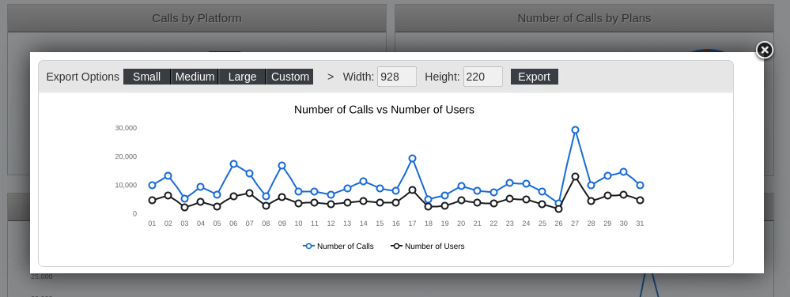

# Carrier Dashboard Charts

> **Warning:**
>
> #### Workshop - Carrier Dashboard CGG Charts
>
> Professional business intelligence applications require more than interactive dashboard displays—they demand the ability to export high-quality chart visualizations optimized for presentations, reports, and executive distribution where formatting requirements differ from on-screen display. In this focused workshop, you'll master Community Graphics Generator (CGG), learning how to create dual-rendering chart components that display one way in interactive dashboards while exporting with different formatting optimized for static image distribution.
>
> Working with the completed Wireless Carrier dashboard from previous workshops, you'll implement advanced postFetch functions that detect the rendering context, apply conditional formatting logic, and customize chart properties including dimensions, titles, legends, padding, and axis labels specifically for PNG and SVG exports that maintain professional presentation standards.
>
> In this hands-on workshop, you'll experience the complete CGG customization workflow, beginning with understanding the CGG context detection mechanism that distinguishes between dashboard rendering and export generation, progressing through postFetch function implementation that applies conditional formatting rules, and culminating in the creation of export-optimized chart configurations that deliver publication-ready visualizations. You'll learn how to leverage the CGG object to detect export context using typeof checks, implement conditional code blocks that execute only during dashboard display versus export generation, and configure chart definition properties that override dashboard settings to produce properly formatted export images.
>
> As you work through the exercises, you'll master critical techniques including passing CDE parameters to CGG exports through query parameter syntax, accessing parameter values in postFetch functions using params.get() method for dynamic content customization, and configuring chart properties like width for optimal page layout, title and titlePaddings for clear labeling, legendAlign and legendPosition for effective legend placement, and baseAxisOverlappedLabelsMode for proper axis label rendering in exported formats.
>
> In this workshop, you add a postFetch script to the Carrier Dashboard's lineChart so it renders one way on screen and exports with different, presentation-optimized formatting through CGG.
>
> **What you'll do**
>
> * Understand CGG context detection — use `typeof cgg` checks to tell dashboard rendering apart from CGG export generation
> * Implement postFetch functions for dual rendering — apply different chart definitions per context from a single component definition
> * Pass CDE parameters to CGG exports — use the underscore-prefixed query parameter convention and `params.get()`
> * Customize export chart properties — width, title and titlePaddings, legend alignment and padding, and baseAxisOverlappedLabelsMode
> * Validate the export customization — generate a PNG preview and compare it with the dashboard rendering
>
> By the end of this workshop, you'll have mastered CGG's dual-rendering capabilities that enable dashboard components to serve both interactive exploration and professional distribution requirements. You'll understand how to architect chart components that optimize user experience in web dashboards while generating publication-ready exports for presentations, reports, and executive briefings.
>
> **Prerequisites:** Completion of Carrier Dashboard Layout, CDA, and Components workshops with working dashboard including lineChart component and Export Popup functionality; understanding of JavaScript and CCC chart properties; Pentaho Business Analytics Server with CTools and CGG installed
>
> **Estimated time:** 20 minutes

***

> **Note:**
>
> #### Start Pentaho Server
>
> Before you begin, make sure the Pentaho Server is running so you can open the Pentaho User Console.

> **Note:**
>
> #### Windows (PowerShell)
>
> ```powershell
> cd \
> cd Pentaho/server/pentaho-server/
> ./start-pentaho.bat
> ```

> **Note:**
>
> #### Linux
>
> ```bash
> cd
> cd /opt/pentaho/server/pentaho-server
> sudo ./start-pentaho.sh
> ```

<button data-launch="puc">Open Pentaho User Console</button>

***

> **Note:**
>
> #### Dashboard vs. Export Visualization:
>
> You can create different versions of chart visualizations for dashboard display versus export by using conditional code blocks in the postFetch function. The code checks for the presence of the CGG object to determine the context - if CGG is undefined, the code runs in the dashboard, otherwise it runs during export.

```javascript
if ( typeof cgg == 'undefined' ){
  
// ... This block only runs in the dashboard ... 

 } else {
  
// ... This block only runs in CGG (export) ... 

}

// ... This block runs everywhere ... 
```

> **Note:**
>
> #### Handling Parameters in Exports:
>
> Since CGG export scripts can't directly access CDE parameters or CDF functions like Dashboards.getParameterValue, you can pass these values through query parameters. This allows you to maintain rendering options based on parameter values during export. To implement this, add the parameter to the component parameters by either setting the 'arg' and 'value' properties directly, or by configuring them in the preExecution function.
>
> For example, to append a date parameter value to a chart title, you would set:
>
> arg: '\_date' value: 'dateParam'
>
> in the component Parameters property, or by doing the same but in preExecution function, using the following code:

```javascript
var objParams = Dashboards.propertiesArrayToObject( this.parameters );

objParams['_date'] = 'dateParam';

this.parameters = Dashboards.objectToPropertiesArray( objParams ); 
```

> **Note:** Note we used the syntax \_date (with an underscore prefix) to denote a query parameter that will not actually be used by the query, but that's just a personal preference.
>
> After that we need to change the title in postFetch using the parameter value:

```javascript
var titleDate = ( typeof cgg == 'undefined' ) ?
Dashboards.getParameterValue('dateParam') : params.get('_date');

this.chartDefinition.title = "Chart rendered on " + titleDate; 
```

> **Note:** Its obvious, the date value rendered in the export will be the one stored as a parameter when the component was executed and will not reflect any changes made to dateParam in the meantime.

:::: tabs

### 1. lineChart

> **Note:**
>
> #### lineChart
>
> Let's give this a go ..
>
> So .. we're going to add a postFetch script to lineChart when exported. The Chart definitions ensure the Chart correctly renders:
>
> * width
> * title
> * legend alignment
> * padding

<figure><figcaption><p>Export lineChart</p></figcaption></figure>

1. Edit: /Public/CTools Dashboard/Carrier-Dashboard-Expand/Layout ( providing you've completed all the workshops..!)
2. In the Components pane, click to expand the Charts group, and then click to select the lineChart.
3. Click Advanced Properties.
4. Specify the postFetch function

   • Click the ellipsis icon to the right of the postFetch property.

5. Copy & paste the following:

```javascript
function f(data){

    // This block only runs in CGG (export)
    if ( typeof cgg != 'undefined' ){
        
        // Change or set some chart properties to look differently from what we see on the dashboard       
        this.chartDefinition.width = 700;
        this.chartDefinition.title = "Number of Calls vs Number of Users";
        this.chartDefinition.titlePaddings = "10";
        
        this.chartDefinition.legendAlign = "center";
        this.chartDefinition.legendPosition = "bottom";
        this.chartDefinition.legendPaddings = "15 5";
        this.chartDefinition.legendItemPadding = "10";
        
        this.chartDefinition.baseAxisOverlappedLabelsMode = "leave";
        
    }
  
}
```

6. Save the dashboard.
7. Check the visualization differences between the lineChart component displayed in the dashboard and the exported chart image:

   • Click on the Number of Calls vs Number of Users Export link.

   • Click on the Export PNG popup option.

   • Check the preview of the lineChart export

> **Note:**
>
> Notice the layout differences:
>
> − there is a title on the top
>
> − the legend is now bottom & centred
>
> − the baseAxis labels are visible.

<figure><figcaption><p>Export Chart</p></figcaption></figure>

> **Success:** The lineChart now renders one way in the dashboard and exports through CGG with its own title, bottom-centred legend, and visible base-axis labels.

::::

<button data-launch="puc">Open Pentaho User Console</button>
