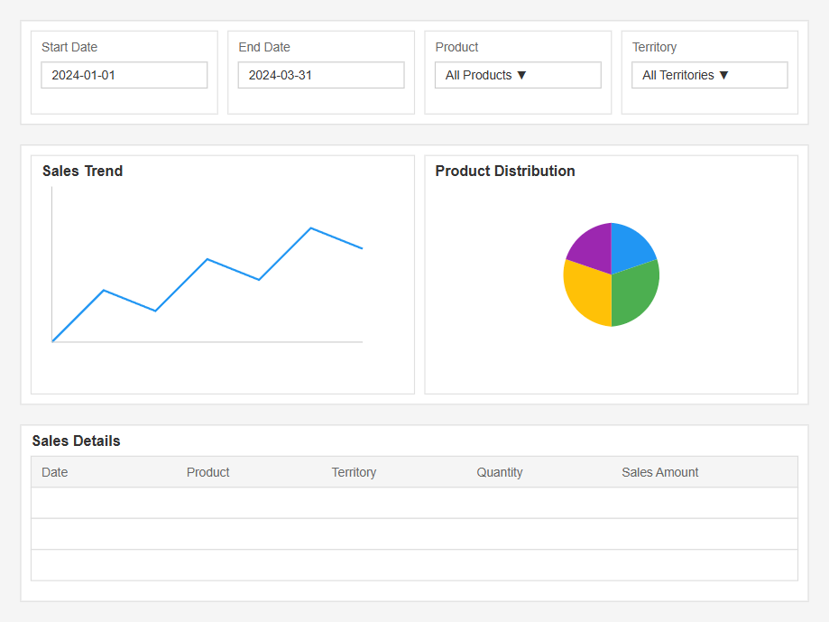
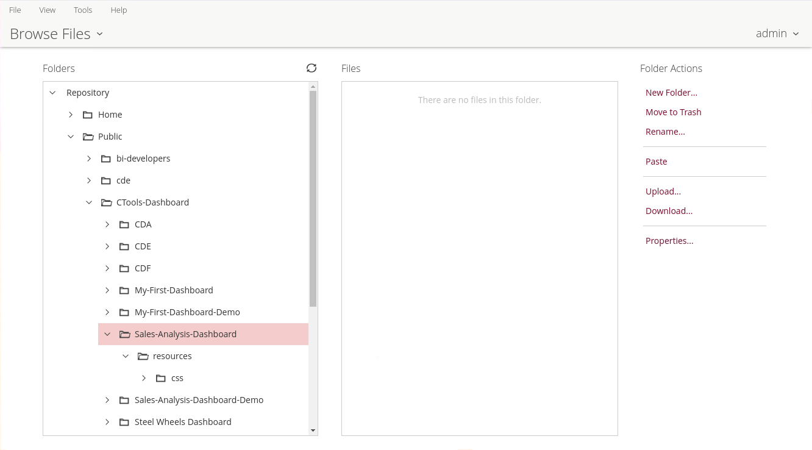
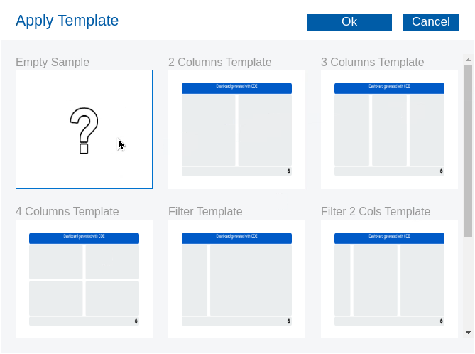
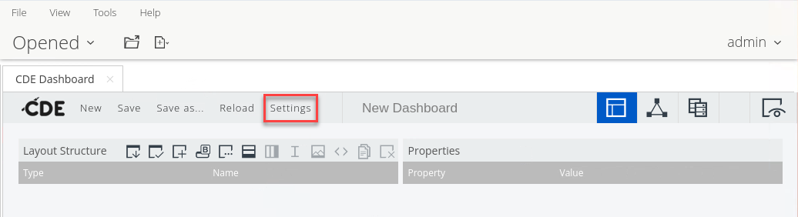
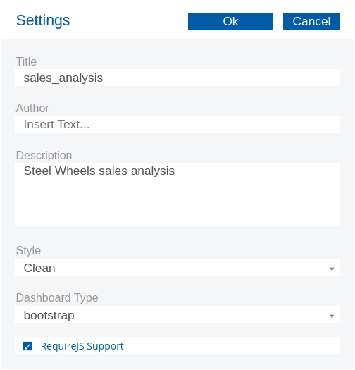

# Sales Analysis Dashboard

> **Warning:**
>
> #### Workshop - Sales Analysis Dashboard
>
> With all the building blocks now in place, it's time to bring everything together in an end-to-end workshop that builds on the concepts learnt in 'My First Dashboard'. In this hands-on use case you'll assemble a complete Retail Sales analysis dashboard, combining a CDA data source, a CDE Bootstrap layout, and CCC chart components into a single, interactive solution.
>
> You'll work through the full dashboard development lifecycle - mapping a signed-off mock-up onto a CDE layout, wiring up an SQL-backed CDA data source against the sampledata database, and laying out the rows and columns that hold your filters, charts, and data table. Along the way you'll see how the Layout, Data Sources, and Components perspectives combine to produce a cohesive dashboard whose components auto-update as filters change.
>
> **What you'll do**
>
> * In the Layout tab, create the row and column structure and name your HTML objects
> * In the Data Sources tab, create your SQL queries and test them to ensure they work
> * In the Components tab, add and configure all components, link them to HTML objects, and set up listeners
> * Build interactive date range, product line, and country filters
> * Add a trend analysis chart, a product distribution pie chart, and a paginated data table
> * Preview and test the dashboard - exercising all filters and verifying chart interactions
>
> **Prerequisites:** Pentaho Business Analytics Server with CTools installed; completion of the 'My First Dashboard' workshop; the sampledata database available via MariaDB JDBC; basic familiarity with SQL and the CDE Layout, Data Sources, and Components perspectives
>
> **Estimated time:** 45 minutes

> **Note:**
>
> So we have the building blocks in place .. time to start bringing it all together with a Workshop that builds on the concepts learnt in 'My First Dashboard'.
>
> * In Layout tab:
>   * Create the row and column structure
>   * Name your HTML objects
> * In Data Sources tab:
>   * Create your SQL queries
>   * Test them to ensure they work
> * In Components tab:
>   * Add all components
>   * Configure their properties
>   * Link to HTML objects
>   * Set up listeners
> * Preview and test:
>   * Use the preview button
>   * Test all filters
>   * Verify chart interactions

***

Before you begin, start the Pentaho Server and open the Pentaho User Console.

> **Note:**
>
> #### Windows (PowerShell)
>
> ```powershell
> cd \
> cd Pentaho/server/pentaho-server/
> ./start-pentaho.bat
> ```

> **Note:**
>
> #### Linux
>
> ```bash
> cd
> cd Pentaho/server/pentaho-server/
> ./start-pentaho.sh
> ```

<button data-launch="puc">Open Pentaho User Console</button>

***

:::: tabs

### 1. Mock-up

> **Note:**
>
> #### Mock-up
>
> We're going to assume that the discovery phase has been completed and after iteration the initial dashboard design has been completed and signed off.
>
> Key Features:
>
> * Interactive date range selection
> * Multi-select product line and country filters
> * Trend analysis chart
> * Product distribution pie chart
> * Detailed data table with pagination
> * Auto-updating components when filters change

<figure><figcaption><p>Sales Analysis Dashboard - mock-up</p></figcaption></figure>

1. Log into the Pentaho Server.
2. Select: Browse Files.
3. Create the following folders.

<figure><figcaption><p>Sales Analysis Dashboard - Folders</p></figcaption></figure>

4. In the Pentaho User Console (PUC) select from the menu: **File -> New -> CDE Dashboard**.
5. Click on the Template option.
6. Select: **Empty Sample**.

<figure><figcaption><p>Empty sample</p></figcaption></figure>

7. Click on: **Settings** and enter the following details:

<figure><figcaption></figcaption></figure>

8. Enter the following details:

<figure><figcaption></figcaption></figure>

9. Click **Ok**.

### 2. Layout

> **Note:**
>
> #### Layout
>
> The mock-up now needs to be 'mapped' to CDE Layout.
>
> We'll be using the 'Bootstrap' template.

```
Root Container
│
├── Filter Row (id: filterRow)
│   ├── Date Filters Column (span: 4)
│   ├── Product Filters Column (span: 4)
│   └── Additional Filters Column (span: 4)
│
├── Charts Row (id: chartsRow)
│   ├── Trend Chart Column (span: 8)
│   └── Pie Chart Column (span: 4)
│
└── Table Row (id: tableRow)
    └── Data Table Column (span: 12)
```

### 3. Data Source

> **Note:**
>
> #### Data Source
>
> Following the CDA structure for a datasource type = sql.jdbc

1. Define the CDA connection to: sampledata database.

```xml
<User>pentaho_admin</User>
<Pass>password</Pass>
```

2. Upload the sampledata.cda file to: /Public/CTools-Dashboards/5min-Dashboard directory on the Pentaho Server.

```xml
<?xml version="1.0" encoding="UTF-8"?>
<CDADescriptor>
    <DataSources>
        <Connection id="mariadb_connection" type="sql.jdbc">
            <Driver>org.mariadb.jdbc.Driver</Driver>
            <Url>jdbc:mariadb://localhost:3306/sampledata</Url>
            <User>your_username</User>
            <Pass>your_password</Pass>
        </Connection>
    </DataSources>

    <DataAccess id="allYearsQuery" connection="mariadb_connection" type="sql" access="public" cache="true" cacheDuration="3600">
        <Name>Sales Data All Years</Name>
        <Query>
            SELECT 
                YEAR(o.ORDERDATE) as YEAR,
                MONTH(o.ORDERDATE) as MONTH,
                o.ORDERNUMBER,
                o.ORDERDATE,
                o.STATUS,
                o.CUSTOMERNUMBER,
                c.CUSTOMERNAME,
                c.COUNTRY,
                p.PRODUCTCODE,
                p.PRODUCTNAME,
                p.PRODUCTLINE,
                od.QUANTITYORDERED,
                od.PRICEEACH,
                (od.QUANTITYORDERED * od.PRICEEACH) as TOTAL_AMOUNT
            FROM 
                ORDERS o
                JOIN ORDERDETAILS od ON o.ORDERNUMBER = od.ORDERNUMBER
                JOIN PRODUCTS p ON od.PRODUCTCODE = p.PRODUCTCODE
                JOIN CUSTOMERS c ON o.CUSTOMERNUMBER = c.CUSTOMERNUMBER
            ORDER BY 
                o.ORDERDATE, o.ORDERNUMBER
        </Query>
        <Parameters></Parameters>
        <Columns></Columns>
    </DataAccess>
</CDADescriptor>
```

> **Note:** Further details on the SQL Query.

```sql
SELECT 
    -- Time-based columns for analysis
    YEAR(o.ORDERDATE) as YEAR,          -- Extracts just the year from date (e.g., 2004)
    MONTH(o.ORDERDATE) as MONTH,        -- Extracts month number (1-12)
    
    -- Order information
    o.ORDERNUMBER,                      -- Unique order identifier
    o.ORDERDATE,                        -- Full date of the order
    o.STATUS,                           -- Order status (e.g., Shipped, Delivered)
    
    -- Customer information
    o.CUSTOMERNUMBER,                   -- Unique customer identifier
    c.CUSTOMERNAME,                     -- Name of the customer
    c.COUNTRY,                          -- Customer's country
    
    -- Product information
    p.PRODUCTCODE,                      -- Unique product identifier
    p.PRODUCTNAME,                      -- Name of the product
    p.PRODUCTLINE,                      -- Product category (e.g., Classic Cars)
    
    -- Order details and calculations
    od.QUANTITYORDERED,                 -- Number of items ordered
    od.PRICEEACH,                       -- Price per unit
    (od.QUANTITYORDERED * od.PRICEEACH) as TOTAL_AMOUNT  -- Calculated total for line item
```

**FROM and JOIN Clauses**:

```sql
FROM 
    ORDERS o                                    -- Main orders table with alias 'o'
    JOIN ORDERDETAILS od                        -- Table containing line items for each order
        ON o.ORDERNUMBER = od.ORDERNUMBER       -- Links orders to their details
    JOIN PRODUCTS p                             -- Product information table
        ON od.PRODUCTCODE = p.PRODUCTCODE       -- Links order details to specific products
    JOIN CUSTOMERS c                            -- Customer information table
        ON o.CUSTOMERNUMBER = c.CUSTOMERNUMBER  -- Links orders to customer info
```

**Table Relationships**:

> **Note:**
>
> * `ORDERS` (o): Main table containing order headers
>   * Primary Key: ORDERNUMBER
>   * Contains: ORDERDATE, STATUS, CUSTOMERNUMBER
> * `ORDERDETAILS` (od): Contains individual line items
>   * Composite Key: ORDERNUMBER, PRODUCTCODE
>   * Contains: QUANTITYORDERED, PRICEEACH
> * `PRODUCTS` (p): Product catalog
>   * Primary Key: PRODUCTCODE
>   * Contains: PRODUCTNAME, PRODUCTLINE
> * `CUSTOMERS` (c): Customer information
>   * Primary Key: CUSTOMERNUMBER
>   * Contains: CUSTOMERNAME, COUNTRY

**Ordering**:

> **Note:**
>
> * Sorts results first by date
> * Then by order number for orders on the same date

```sql
ORDER BY 
    o.ORDERDATE, o.ORDERNUMBER
```

***

> **Note:** And finally .. test the sampledata.cda connection.

> **Success:** With the layout mapped, the SQL-backed CDA data source defined, and the sampledata.cda connection tested, your Sales Analysis Dashboard is ready to assemble in the Pentaho User Console.

::::
