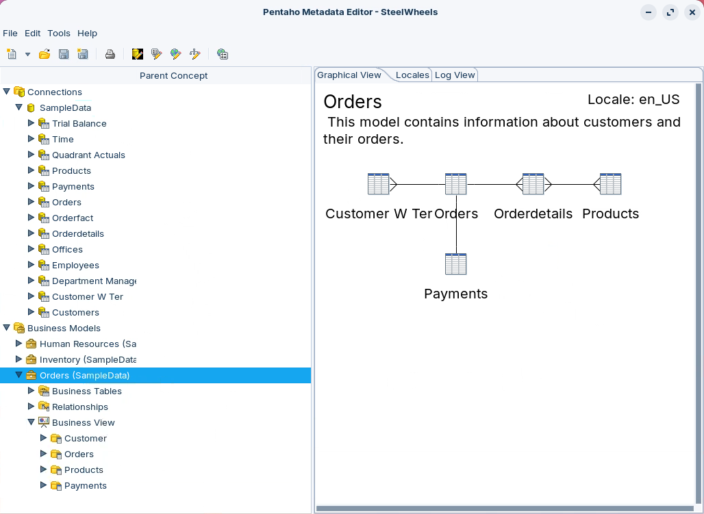

# Components

The Pentaho **Metadata Editor (PME)** bridges the gap between raw database structures and business-friendly data models. It builds a **metadata domain** — a logical map of your database that speaks the language of business — stored in a central repository and consumed by reporting and analysis tools. The domain has two layers: a **physical layer** holding the technical database definitions, and a **business model layer** giving an abstracted, business-oriented view of that data.

> **Note:**
>
> #### Metadata Editor
>
> The Pentaho Metadata Editor (PME) is a powerful tool that bridges the gap between raw database structures and business-friendly data models. At its core, PME helps organizations create metadata domains that transform complex database architectures into intuitive business models.
>
> When you create a metadata model in PME, you're essentially building a logical map of your database that speaks the language of business. This model is stored in a central repository, giving administrators several valuable capabilities:
>
> First, they can translate technical database terminology into clear, business-friendly language that makes sense to end users. This makes reporting and analysis more accessible to non-technical staff.
>
> Second, when database changes occur at the technical level, the metadata layer acts as a buffer, minimizing disruption to business users and reducing maintenance costs.

<figure><figcaption></figcaption></figure>

> **Note:**
>
> The tool also enhances data governance through security controls that precisely manage user access to specific data elements in reports. Additionally, PME streamlines report maintenance by establishing consistent formatting rules for text, dates, and numbers across the organization.
>
> For global organizations, PME supports localization, automatically adjusting how information is presented based on users' regional settings.
>
> The metadata domain created by PME consists of two key components: the physical layer, which contains the technical database structure definitions, and the business model layer, which provides an abstracted, business-oriented view of that data. Together, these layers create a comprehensive framework that makes complex data structures more accessible and manageable.
>
> The primary purpose of PME is to create a semantic layer that makes complex database structures more accessible to business users while maintaining data consistency and security across the organization.
