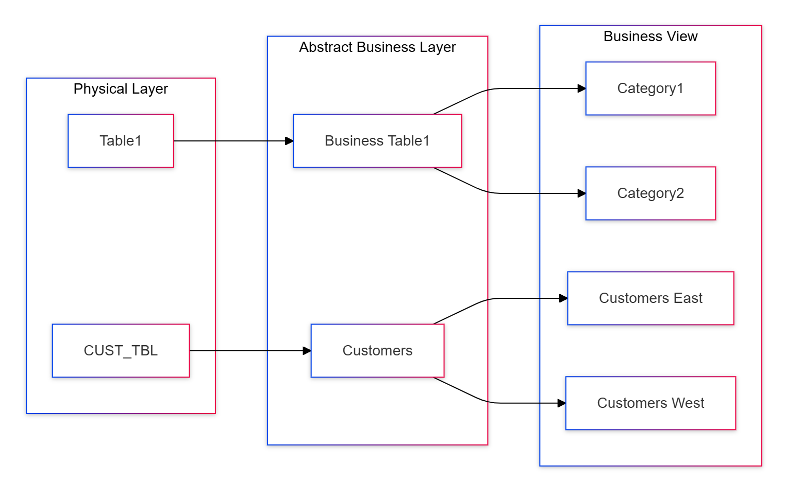
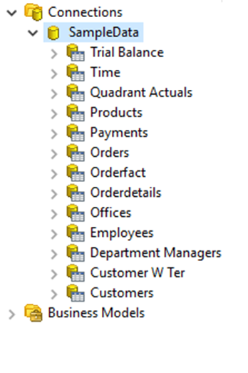
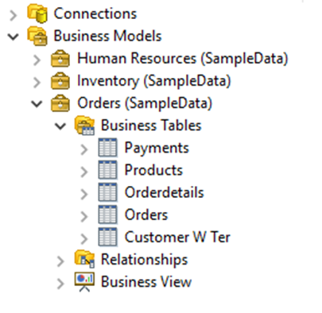
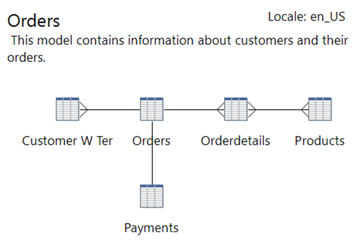
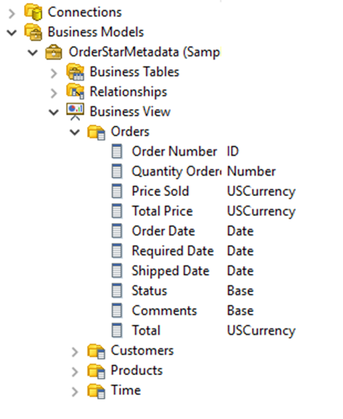

# Overview of Domains & Models

Pentaho Metadata Editor (PME) builds Pentaho metadata **domains** and **models**. A metadata model maps the **physical structure** of your database onto a **logical business model** — business-language definitions layered over raw tables and columns. These mappings live in a centralized metadata repository so that reports speak the language of the business, not the database.

> **Note:**
>
> #### Domains & Models
>
> A Pentaho metadata model maps the physical structure of your database into a logical business model. These mappings are stored in a centralized metadata repository and allow administrators to:
>
> - create business-language definitions for complex database tables
> - decrease the cost and impact associated with low-level database changes
> - set security parameters limiting a user's report access to data
> - drive formatting on text, date, and numeric data, improving report maintenance
> - localize the information depending on the user's regional settings
>
> The **domain** encapsulates all of the business objects created, stored, and used in the metadata layer. A domain may consist of one or more connections, one or more models, security information, business tables, business views, categories, columns, and concepts.

<figure><figcaption>
Metadata Editor
</figcaption></figure>

This page is your **reference** for how a metadata domain is structured. A Metadata Editor domain is composed of three layers — the **Physical Layer**, the **Business Layer**, and the **Business View** — described below. The labs that follow — **SteelWheels**, **OrdersME**, and **Query Builder** — put them to work.

## The three layers

:::: tabs

### 1. Physical Layer

> **Note:**
>
> #### Physical Layer
>
> The Physical Layer of a Pentaho domain encompasses **connections, physical tables, and physical columns**. These objects represent the database(s) you are trying to model and enrich with metadata. The Physical Layer is not considered part of the business model, because not all connections defined in the Physical Layer will be used in every business model.

<figure><figcaption>
Physical Layer
</figcaption></figure>

> **Note:** Today, multiple business models can be created in one domain, but those models must have one and only one connection reference. This means that you cannot mix and match physical tables from two different connections in the same model.
>
> This prevents the model from supporting multiple data sources, and severely limits the Pentaho Metadata Editor's ability to allow table changes across connections — a feature necessary for moving from dev to production databases, for example. Fortunately, you can get around the latter with a bit of hand-editing XML.

### 2. Business Layer

> **Note:**
>
> #### Business Layer
>
> The Abstract Business Layer is the heavy lifter in the metadata business model. The business model encompasses the **Abstract Business Layer** and the **Business View**.
>
> In the Abstract Business Layer, you have **business tables, business columns, and business relationships**.

<figure><figcaption>
Business Tables
</figcaption></figure>

> **Note:** You can create business tables for any physical table you have defined in the Physical Layer. You can also create more than one business table to reference the same physical table. The same rules apply for business columns. This can be useful in a multitude of scenarios — filtering security, or even data at this level, being one example.
>
> The business table keeps a reference to the physical table that it models, and this allows a metadata **inheritance** relationship between physical tables and business tables. If you define metadata on a physical table, the business table will inherit that metadata, unless and until the business table itself has overridden the inherited metadata. This concept operates on a metadata property-to-property basis, meaning that each property can be overridden individually.
>
> The same relationship exists between physical columns and business columns. If you define metadata on a physical column, the business column will inherit that metadata, unless and until the business column itself has overridden the inherited metadata.

<figure><figcaption>
Relationship - Joins
</figcaption></figure>

> **Note:** Then there are **relationships**. These relationships are mappings that you define to describe the relational (or other) bonds between your business tables. One example may be a one-to-many relationship between a customer table and an orders table.
>
> The strength in metadata relationships is that you can identify relationships between columns or tables in the Abstract Business Layer that may not be obvious in the Physical Layer. An example would be to compare budget, actual, and sales numbers using a formula-derived business column that is specific to your business rules.

### 3. Business View

> **Note:**
>
> #### Business Views
>
> The Business View is the part of the business model that applications will operate against, and that end users will see. The Business View is nothing more than "buckets" (called **categories**) for you to re-arrange and re-organize your business columns in a fashion that makes sense to the consumers of the data.
>
> In the Business View, you can create any number of categories and arrange your business columns in those categories however best suits your business — mixing and matching columns that derive from different business tables, even adding business columns more than once to different categories. The only restriction to the Business View is that you cannot add the same business column more than once to a single category.

<figure><figcaption>
Business View
</figcaption></figure>

::::

Continue to **SteelWheels** to see these three layers come together in a complete, real-world metadata domain.
