# SteelWheels

> **Warning:**
>
> #### Workshop - Overview of SteelWheels Domain
>
> Creating effective business intelligence solutions requires more than just connecting to databases—it demands a semantic layer that translates technical database structures into business-friendly concepts that analysts and report builders can understand. Pentaho Metadata Editor enables you to build this critical abstraction layer, organizing raw tables and columns into logical business models with meaningful names, relationships, and categories that mirror how your organization thinks about data.
>
> In this hands-on workshop, you'll explore the SteelWheels domain - a comprehensive metadata model built on Pentaho's sample database that represents a fictional toy company's complete operations. By examining this fully-realized example spanning customers, products, orders, employees, and financial data across 13 interconnected tables, you'll learn the fundamental architecture of metadata domains and how each layer builds upon the previous one to create an intuitive, business-focused data access layer.
>
> By the end of this workshop, you'll understand how Pentaho Metadata Editor transforms raw database schemas into organized, documented, business-aligned data models. You'll see how physical tables become business tables with friendly names, how relationships enable cross-table analysis, and how categories group related fields into logical collections that match business thinking. This foundational knowledge prepares you to build your own metadata domains that empower business users to create reports and analyses without needing to understand underlying database complexity.
>
> **What you'll do**
>
> * Import and explore an existing metadata domain using the XMI file format
> * Examine the Physical Layer including database connections, tables, and column definitions
> * Navigate Business Models and understand how they organize tables for specific analytical purposes
> * Explore Business Tables and Business Columns with their enhanced metadata properties
> * Understand Relationships and how they define connections between tables for accurate query generation
> * Discover Business Views and Categories that expose the semantic layer to end users
> * Learn the complete metadata architecture from physical structures to business-friendly presentations
>
> **Prerequisites:** Basic understanding of relational database concepts (tables, columns, relationships); Pentaho Metadata Editor installed and configured; Access to SteelWheels sample database
>
> **Estimated time:** 45 minutes

<figure>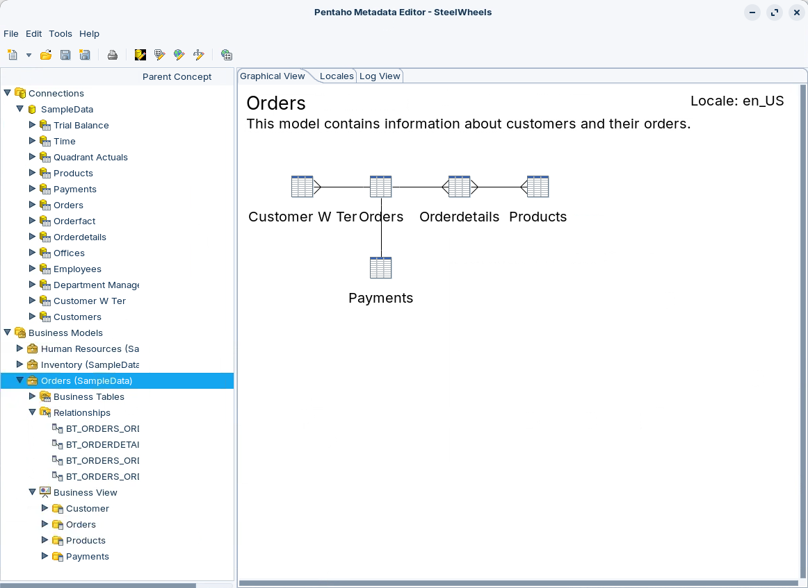<figcaption><p>SteelWheels Domain</p></figcaption></figure>

***

Follow the guide below to understand how a **Domain** is defined:

:::: tabs

### 1. Import

> **Note:**
>
> #### SteelWheels Domain
>
> The following steps show you how to use an example metadata model in Pentaho Metadata Editor to create an Interactive Reports.

<figure>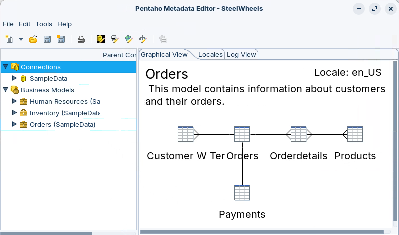<figcaption><p>Orders Business Model</p></figcaption></figure>

***

1. Start Metadata Editor:

> **Note:**
>
> #### Windows (PowerShell)
>
> ```powershell
> cd \
> cd Pentaho/design-tools/metadata-editor/
> ./metadata-editor.bat
> ```

> **Note:**
>
> #### Linux
>
> ```bash
> cd
> cd Pentaho/design-tools/metadata-editor/
> ./metadata-editor.sh
> ```

<button data-launch="metadata-editor">Open Metadata Editor</button>

2. Import (open) an existing metadata domain.
3. From the menu, select: **File > Import from XMI File**.

<figure>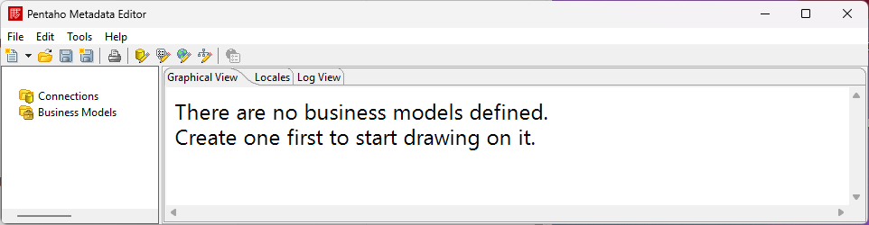<figcaption><p>PME UI</p></figcaption></figure>

4. Navigate to:

> **Note:**
>
> #### Windows (PowerShell)
>
> ```powershell
> C:\Pentaho\design-tools\metadata-editor\samples
> ```

> **Note:**
>
> #### Linux
>
> ```bash
> ~/Pentaho/design-tools/metadata-editor/samples
> ```

5. Double-click: **steel-wheels.xmi**.
6. In the Save Model dialog, type: **SteelWheels**.
7. Click **OK**.

> **Danger:** Note a domain can only have 1 database connection.

### 2. Physical Layer

> **Note:**
>
> #### Physical Layer
>
> The physical layer of a Pentaho domain encompasses connections, physical tables and physical columns. These objects represent the database(s) you are trying to model and enrich with metadata. The physical layer is not considered part of the business model, because not all connections defined in the physical layer will be used in every business model.
>
> Once imported you will see that:
>
> * Physical Layer includes 13 tables.

<figure>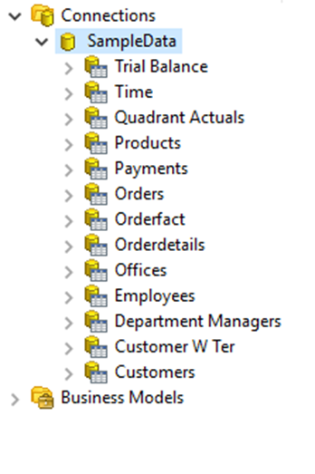<figcaption><p>Physical Layer</p></figcaption></figure>

1. In the left pane, expand **Connections > SampleData**.
2. Expand **Products** and notice the list of columns.

<figure>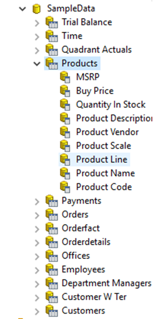<figcaption><p>Products Table</p></figcaption></figure>

3. Double-click on **Product Line**.

> **Note:**
>
> A Properties Editor opens, which displays the metadata properties for each object (prefix):
>
> PT - Physical Table
>
> PC - Physical Column
>
> BT - Business Tables
>
> BC - Business Columns
>
> CT - Categories

<figure>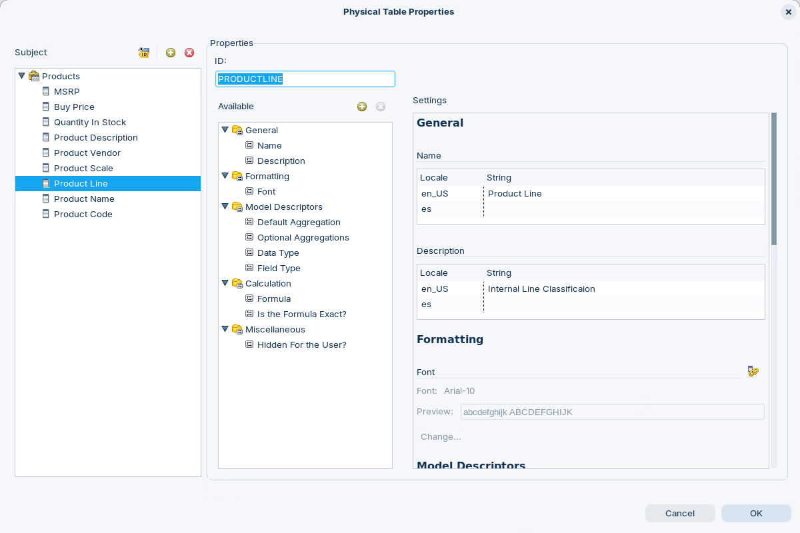<figcaption><p>Product Line Base Metadata Properties</p></figcaption></figure>

4. Scroll through the Base settings - Parent Concepts.

> **Note:** Notice most of the Base metadata settings can be overridden. The property - Parent Concept - will be inherited in the Business Models and Business Views Layers.

5. Expand **Orderdetails** table.
6. Double-click on **Total**.

<figure>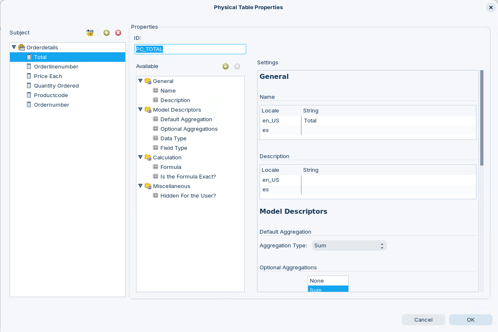<figcaption><p>PC_TOTAL</p></figcaption></figure>

> **Note:** If you have a requirement to create dimensions / measures for Interactive Reports that doesn't exist in the Physical tables, then you can easily create the column based on existing columns.

7. Scroll through the Base settings.

<figure>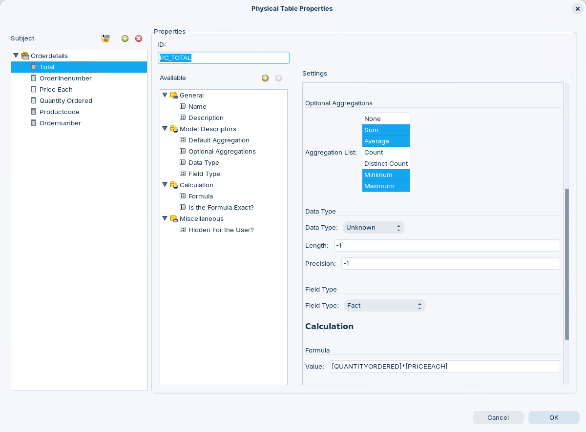<figcaption><p>TOTAL - settings</p></figcaption></figure>

> **Note:**
>
> Notice the column is based on the calculation:
>
> [QUANTITYORDERED]*[PRICEEACH]
>
> The columns are referenced with [COLUMN]
>
> This can be aggregated to: Sum, Average, Minimum & Maximum.

### 3. Business Models

> **Note:**
>
> #### Business Models
>
> There are three Business Models within this metadata domain. Each model uses one or more tables from the physical layer.

1. Collapse **Connections** and expand: **Business Models**.
2. Expand: **Orders Business Model**.

<figure>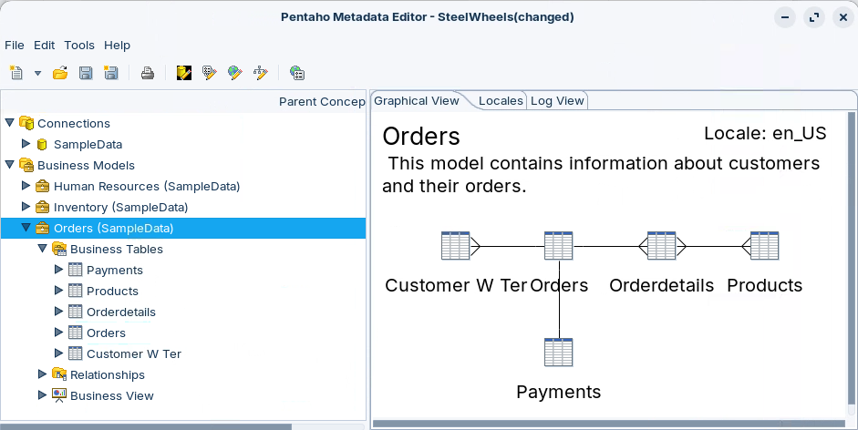<figcaption><p>Business Models</p></figcaption></figure>

> **Note:**
>
> The Orders Business Model includes five Business Tables:
>
> * Customer W Ter
> * Orders
> * Orderdetails
> * Products
> * Payments
>
> The Business Model Layer is where you override and set the Parent Concept to be inherited in the Business View Layer.

3. Expand: **Orderdetails** Business Table.

<figure>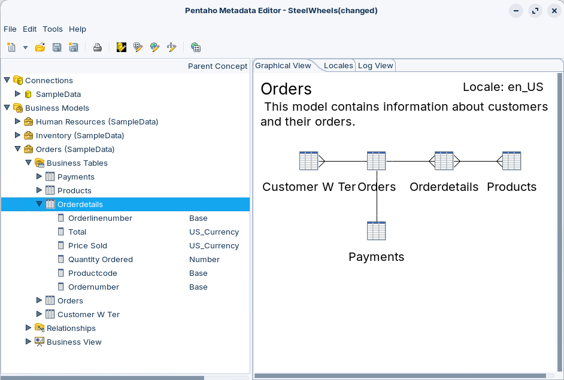<figcaption><p>Orderdetails Business Table</p></figcaption></figure>

4. Double-click: **Price Sold**.

<figure>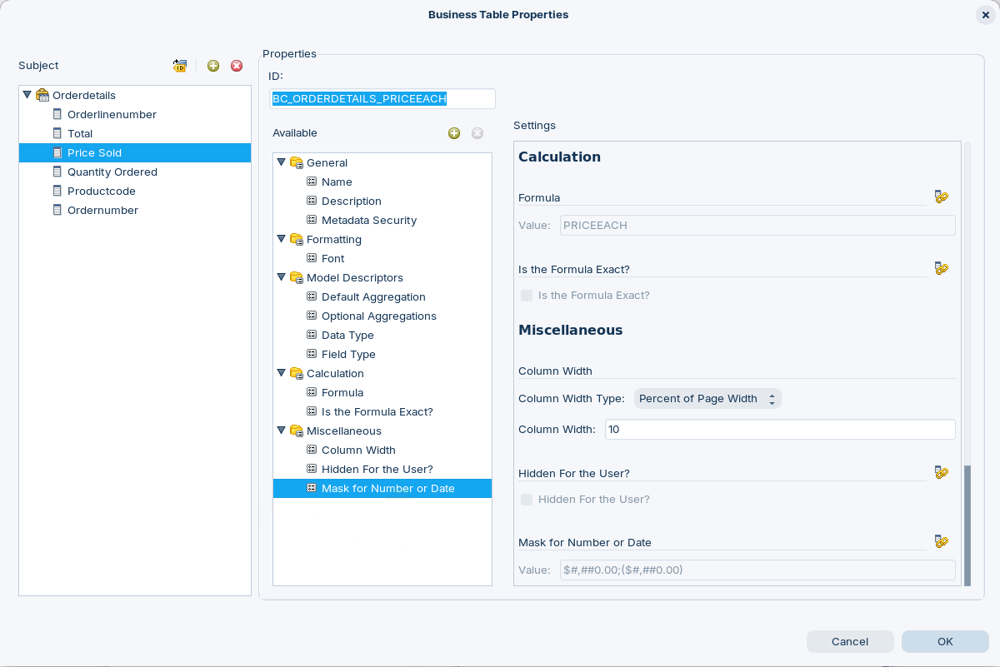<figcaption><p>Price Sold - Properties</p></figcaption></figure>

> **Note:** Notice a 'Mask for Number or Date' has been added and the value set as a Parent Concept. The Mask - $#,##0.00 format - will be inherited in the Business View Layer.

### 4. Relationships

> **Note:**
>
> #### Relationships
>
> Once you have all your Business Tables created, you will need to create relationships between the tables, so that the query generators and SQL generators that work with Pentaho metadata can create the data queries correctly.
>
> This is very much like drawing a relational diagram to show primary and foreign key relationships. Although relational links are not the only relationships that can be modelled. You can create a relationship between any two tables, link any two columns between them and dictate what the relationship is (one to many, many to many, etc.).
>
> The important pieces of information to know before you try to create a relationship is:
>
> * what two Business Tables would you like to associate with this relationship?
> * what columns in the business tables identify the relationship?
> * and what kind of relationship is it - one to one, one to many, many to one, etc?

<figure>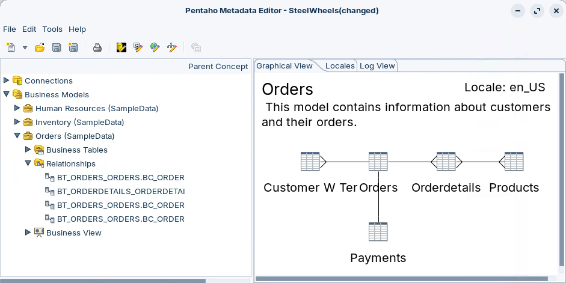<figcaption><p>Relationships</p></figcaption></figure>

1. Expand: **Business Models > Orders > Relationships**.
2. Double-click:

```
BT_ORDERS_ORDERS.BC_ORDERS_CUSTOMER_NUMBER - BT_PAYMENTS_PAYMENTS.BC_PAYMENTS_CUSTOMERNUMBER
```

<figure>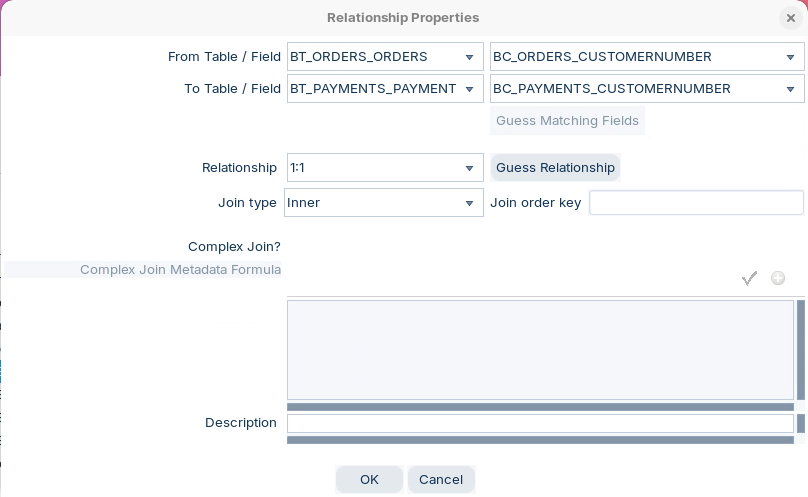<figcaption><p>Relationship Properties</p></figcaption></figure>

> **Note:**
>
> The relationship defines the Inner JOIN with the constraint 1 order has 1 payment.
>
> The SQL is generated from references the unique keys in the Tables using the following metadata syntax:
>
> ```
> [BT_ORDERS_ORDERS].[BC_ORDERS_CUSTOMER_NUMBER]
> ```

### 5. Business Views

> **Note:**
>
> #### Business Views
>
> Business Views acts as 'buckets - categories' that enable you to define the semantic layer that is exposed to the end user. Each Category can contain any column(s) that have been defined in the Business tables.

<figure>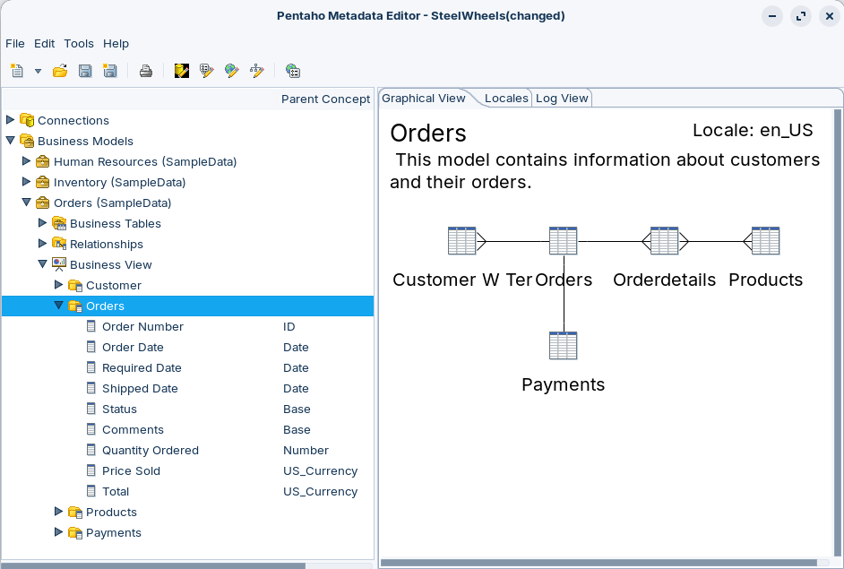<figcaption><p>Business View - Orders category</p></figcaption></figure>

1. Expand: **Business View > Orders**.
2. Highlight **Orders** category.
3. Right-mouse click and select the option: **Manage Categories**.

<figure>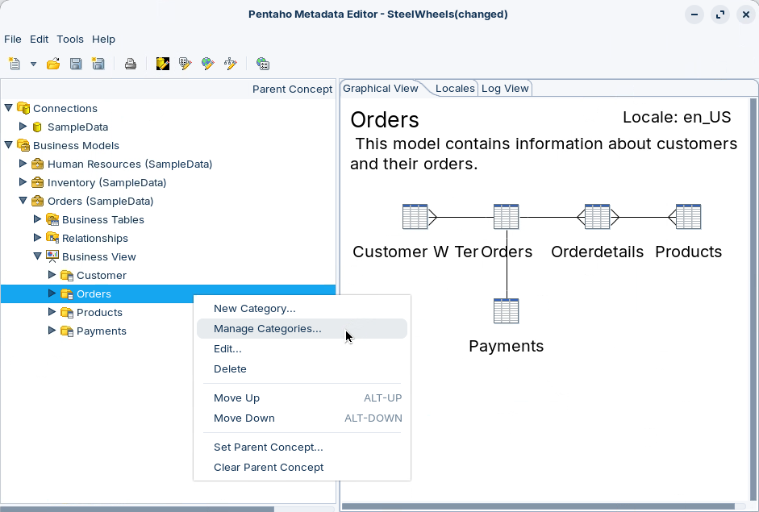<figcaption><p>Categories</p></figcaption></figure>

4. The Panel enables you to associate the Business Column(s) with the Category.

<figure>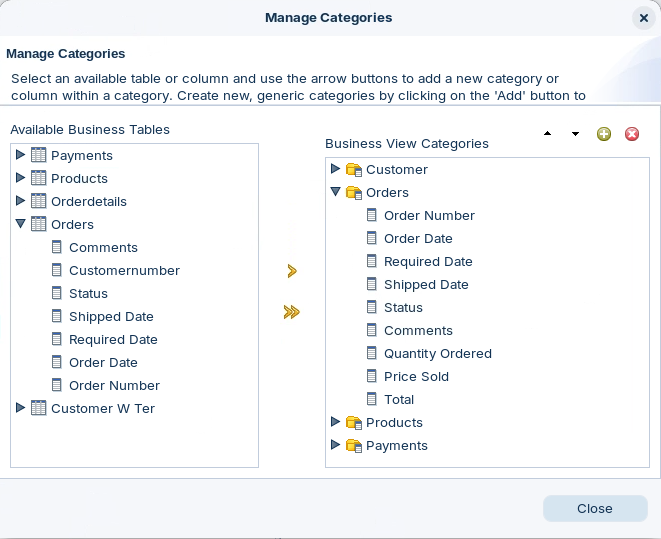<figcaption><p>Manage Categories</p></figcaption></figure>

::::

<button data-launch="puc">Open Pentaho User Console</button>

## Lab Files

Download the reference files for this lab:

* [steel-wheels.xmi](../_assets/files/steel-wheels.xmi)
