# OrdersME

> **Warning:**
>
> #### Workshop - OrdersME
>
> While exploring pre-built metadata domains helps you understand the architecture, the real learning comes from building one yourself from the ground up. Creating a metadata domain requires understanding how each layer - from physical database connections through business models to semantic categories - works together to transform raw database schemas into business-friendly data access layers that empower non-technical users to create their own reports and analyses.
>
> In this hands-on workshop, you'll construct a complete metadata domain called OrdersME from scratch using the Steel Wheels sampledata database. Starting with a blank canvas, you'll establish database connectivity, import physical tables, design a star schema business model, define relationships that enable accurate query generation, and create an intuitive business view organized into logical categories. Finally, you'll publish your completed domain to the Pentaho Server and validate it by building an Interactive Report - experiencing the full lifecycle from metadata design to end-user consumption.
>
> **What you'll do**
>
> * Install JDBC drivers and establish database connections in Pentaho Metadata Editor
> * Import physical tables and columns from a database into your metadata domain
> * Create a business model based on star schema design principles
> * Define business tables and map them to physical tables with enhanced metadata
> * Create relationships between tables using both one-to-many and many-to-one cardinalities
> * Build business views with logically organized categories that reflect business terminology
> * Use multiple techniques (Tree Navigator and Editor Graph) to create relationships
> * Understand complex join scenarios for multi-column relationships
> * Publish your metadata domain to the Pentaho Server as an XMI file
> * Test your domain by creating an Interactive Report that leverages your semantic layer
>
> **Prerequisites:** Pentaho Metadata Editor installed; Access to SteelWheels sampledata database; JDBC driver for your database; Basic understanding of relational database concepts and star schema design
>
> **Estimated time:** 90 minutes

<figure>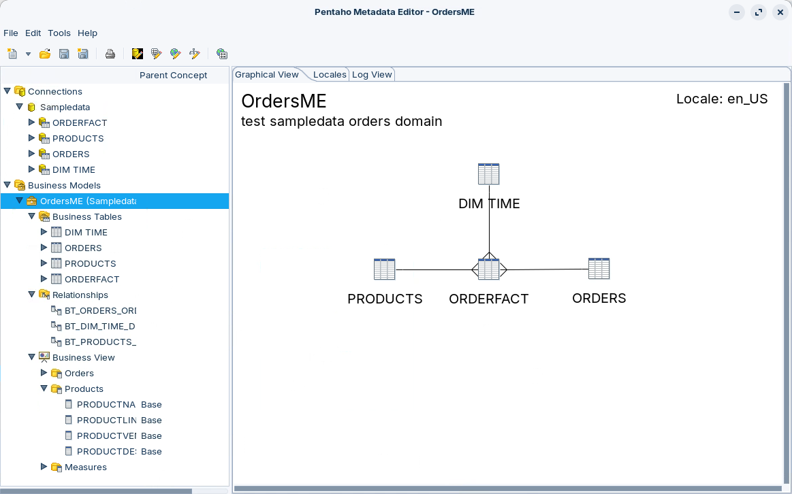<figcaption><p>OrdersME Domain</p></figcaption></figure>

***

1. Start Metadata Editor:

> **Note:**
>
> #### Windows (PowerShell)
>
> ```powershell
> cd \
> cd Pentaho/design-tools/metadata-editor/
> ./metadata-editor.bat
> ```

> **Note:**
>
> #### Linux
>
> ```bash
> cd
> cd Pentaho/design-tools/metadata-editor/
> ./metadata-editor.sh
> ```

2. Start the Pentaho Server (not required if using Pentaho Labs):

> **Note:**
>
> #### Windows (PowerShell)
>
> ```powershell
> cd \
> cd Pentaho/server/pentaho-server
> ./start-pentaho.bat
> ```

> **Danger:** Ensure that the Pentaho Server is up and running (automatically started in Pentaho Lab):
>
> ```bash
> cd
> cd /opt/pentaho/server/pentaho-server
> sudo ./start-pentaho.sh
> ```

<button data-launch="metadata-editor">Open Metadata Editor</button>

<figure>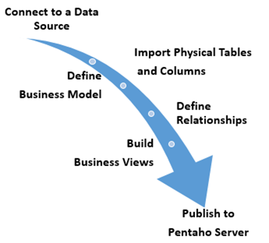<figcaption><p>Creating a Pentaho Metadata Domain</p></figcaption></figure>

Follow the guide below to create your OrdersME domain:

:::: tabs

### 1. JDBC Connection

> **Note:**
>
> #### Connect to the Database
>
> A connection represents connection information of a specific database, and acts as the parent in the hierarchy for all physical tables and physical columns that are defined for that database.
>
> Pentaho metadata models can connect to most common relational databases using JDBC. The Pentaho Metadata Editor (and the Pentaho Metadata Architecture) supports a vast and rich set of data sources. Before you begin defining your business model, you must first describe the database or data source that you would like to model. You do this by defining one or more connections in the editor.

> **Danger:** If you're using the Pentaho Lab then the driver has already been copied to the `/lib` directory.
>
> To create a JDBC connection you will need to copy the JDBC driver for your database into the PME install directory `...\metadata-editor\lib`.
>
> To resolve MariaDB issues, it is advised to use the **MySQL** JDBC driver.
>
> Restart the Pentaho Metadata Editor, to register the driver.

<div class="pcm-embed-card" data-href="https://www.loom.com/share/b5057eb6659e4a0691745914aa9e5403?hideEmbedTopBar=true&amp;hide_share=true&amp;hide_title=true&amp;sid=b4432731-d471-426d-92ec-874768a7a1be?hide_owner=true" data-title="Creating a Metadata Domain with SteelWheels Database" data-description="In this video, I demonstrate how to create a metadata domain by connecting to the SteelWheels sample database. I walk you through the initial steps, including launching the Metadata Editor and creating a new domain file. You'll see how to add a database connection by right-clicking and selecting the appropriate options. I specifically name the connection &amp;#34;SampleData&amp;#34; to keep things organized. I encourage you to follow along and practice these steps to familiarize yourself with the process." data-thumb="../_assets/embeds/125979ecbc12.png"></div>
***

> **Note:**
>
> #### Define a Domain & JDBC Connection
>
> Before you begin defining your business model, you must first describe the database or data source that you would like to model.

1. To define a new domain, select: **File > New > Domain File** from the main menu.

<figure>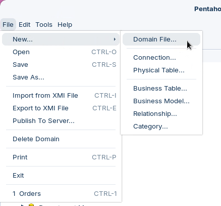<figcaption><p>New Domain - OrdersME</p></figcaption></figure>

2. Right-mouse click on **Connections** or: **File > New > Connection**

<figure>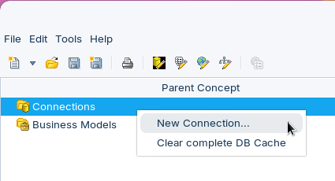<figcaption><p>New Database Connection</p></figcaption></figure>

3. Select the installation environment and enter the connection settings:

:::: tabs

#### Windows: Enterprise Edition

> **Note:**
>
> #### Enterprise Edition
>
> If you've downloaded & installed the on-prem Windows 30-day Enterprise Edition then configure the connection with the following settings:

| Field | Parameter |
| --- | --- |
| Connection name | hsqldb:sampledata |
| Connection Type | Hypersonic |
| Access | JNDI |
| JNDI name | SampleData |

> **Note:** JNDI (Java Naming and Directory Interface) is a Java API that allows applications to look up and access resources - like databases, message queues, or LDAP directories - from a central naming or directory service. Instead of hardcoding resource details into your application, you reference a JNDI name (like `java:/comp/env/jdbc/MyDB`), and the application server manages the actual connection details, making applications more portable and flexible.

<figure>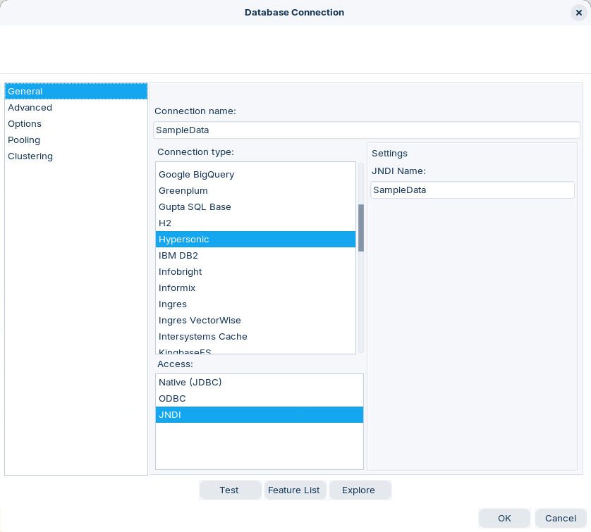<figcaption><p>JNDI Connection</p></figcaption></figure>

#### Linux: Pentaho Lab

> **Note:**
>
> #### Pentaho Lab
>
> If you're using the Pentaho Lab, enter the following settings:

| Field | Parameter |
| --- | --- |
| Connection name | mysql:sampledata |
| Connection Type | **MySQL** |
| Access | Native (JDBC) |
| Host name | localhost |
| Database Name | sampledata |
| Port Number | 3306 |
| User Name | pentaho_admin |
| Password | password |

<figure>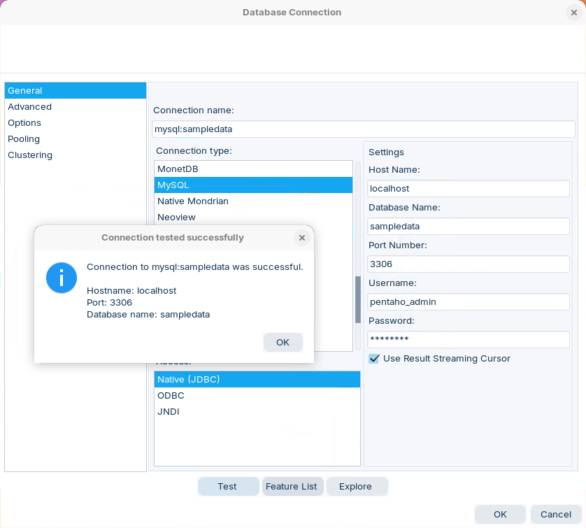<figcaption><p>Database Connection</p></figcaption></figure>

::::

***

> **Note:**
>
> #### Adding JDBC driver
>
> Before you can connect to a data source in any Pentaho server or client tool, you must first install the appropriate database driver.
>
> Before copying a new JDBC driver, ensure that there is not a different version of the same JAR in the destination directory. If there is, you must remove the old JAR to avoid version conflicts.

1. Copy the JDBC driver to:

```
~/Pentaho/design-tools/metadata-editor/lib/JDBC/
```

2. Once the driver JAR is in place, you must restart the server or client tool.

### 2. Import Tables

> **Note:**
>
> #### Import Tables
>
> Fortunately, when you import a physical table, all the table's columns come with it, so the import is a one-step exercise instead of two. You can later remove those columns that you do not want in the connection or the model.

<div class="pcm-embed-card" data-href="https://www.loom.com/share/8d79403521b24e9493d61f3269b2ce46?hideEmbedTopBar=true&amp;hide_share=true&amp;hide_title=true&amp;sid=3ccd5701-5ff6-4f5a-9bf1-414a6fa30296?hide_owner=true" data-title="Creating the Physical Layer in Data Modeling 📊" data-description="In this video, I demonstrate how to import tables to create the physical layer for our project. I specifically import the Order Fact, Products, and Orders tables, highlighting the process of selecting multiple tables using the Control key. It's important to note that we are importing metadata, not the actual tables, and I show the columns in the Products table, which are currently labeled in all upper case. I also explain the concept of base columns and their significance in our data model. There is no specific action requested from viewers in this segment, but I encourage you to familiarize yourself with the concepts as we move forward to creating the abstract business layer in the next demonstration." data-thumb="../_assets/embeds/125979ecbc12.png"></div>
***

> **Note:**
>
> #### Schema
>
> In this workshop we're going to model a Star Schema - a [database design pattern](https://www.geeksforgeeks.org/dbms/database-schemas/) used in data warehousing where a central fact table containing quantitative business metrics (like sales amounts or quantities) is surrounded by dimension tables that provide descriptive context such as customers, products, time, and geography.

1. Hold down the **Ctrl** key and use the mouse to select the following:

<figure>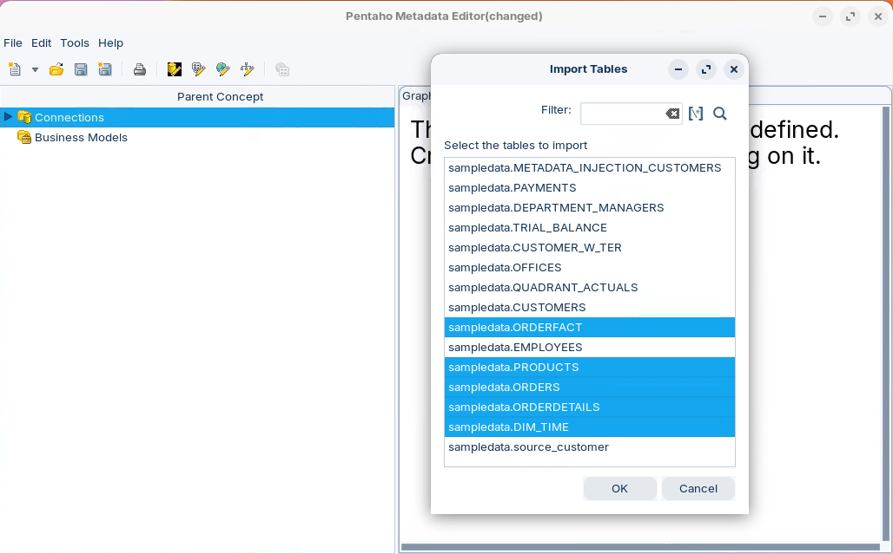<figcaption><p>Import tables</p></figcaption></figure>

| Table | Description |
| --- | --- |
| ORDERFACT | (2,996 rows) - A fact table for OLAP analysis containing order transaction data linked to customers and other dimensional tables |
| PRODUCTS | (110 rows) - Contains product catalog information including product line, vendor, code, name, scale, description, quantity in stock, buy price, and MSRP |
| ORDERS | (330 rows) - Records customer orders placed with the company, containing order-level information like order dates and customer references. |
| ORDERDETAILS | (3,001 rows) - Stores line-item details for each order, breaking down individual products and quantities within each order. |
| DIM_TIME | (265 rows) - A time dimension table for temporal analysis, supporting date-based reporting and analytics. |

***

To remove extraneous columns from your physical tables:

1. Right-click (or `<CTRL+click>`) on the physical table node you wish to edit in the Tree Navigator. Select the **Edit** option from the popup menu.

> **Note:** You can also get to the Physical Table Properties dialog by double-clicking the physical table node.

2. The Physical Table Properties dialog displays. In the dialog's Tree Navigator, select a column you wish to remove.

<figure>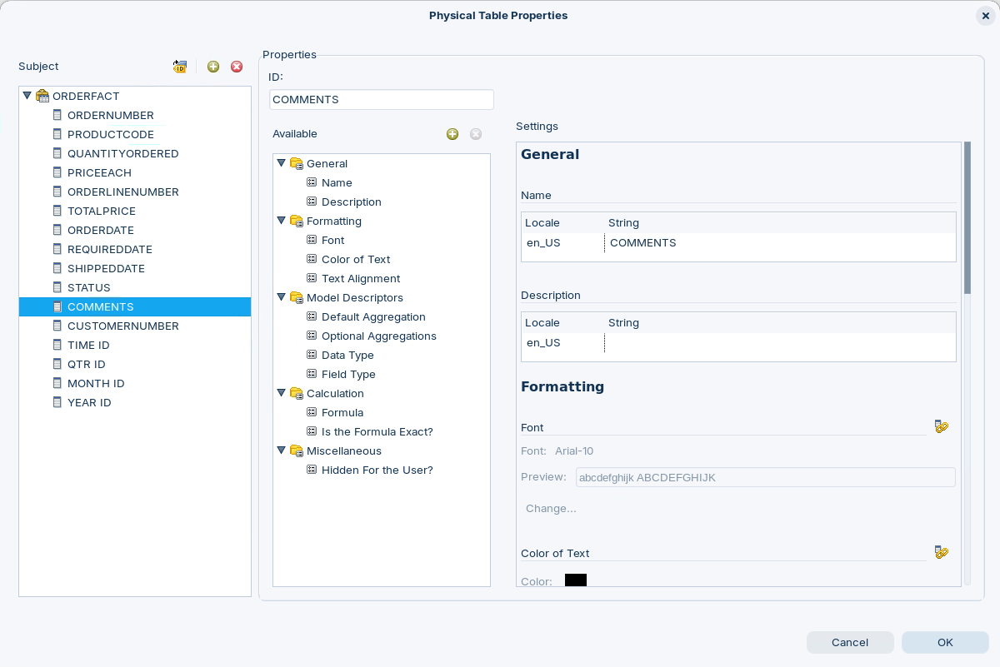<figcaption><p>Delete Columns</p></figcaption></figure>

3. Click the delete icon (the one with the red circle), to the right of the word **Subject** above the dialog's Tree Navigator.
4. Repeat with any remaining columns that you want to remove. Click **OK** when you are done.

<figure>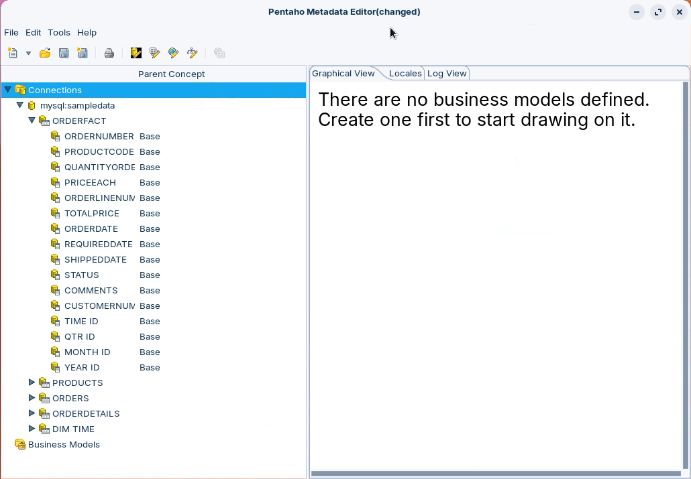<figcaption><p>PT_Tables</p></figcaption></figure>

> **Note:** Each table / column has a Base set of Parent Concepts, which will be inherited - unless explicitly broken - by the defined Business Models.

### 3. Business Model

> **Note:**
>
> #### Business Models
>
> Metadata in Pentaho is based on relational data modeling, which maps the physical structure of your database into a logical business model. The goal of the relational data modeling in Pentaho is to simplify the experience of business users when they are creating reports.

Follow the guide to define: OrdersME Business Model

#### 1. Business Model

> **Note:**
>
> #### Business Model
>
> We're basically going to define a Product Order business model.

<div class="pcm-embed-card" data-href="https://www.loom.com/share/ac0b3d9fe136405ba8dbc5aab3874e33?hideEmbedTopBar=true&amp;hide_share=true&amp;hide_title=true&amp;sid=2f51b6d5-f11d-49a1-a5e5-427e29f2580d?hide_owner=true" data-title="Building the Abstract Business Layer for Data Models 📊" data-description="In this video, I walk you through the process of building the abstract business layer after establishing the physical layer. I demonstrate how to create a new business model, including setting its properties such as name and description. I specifically name this model &amp;#34;Orders Me for Metadata Editor&amp;#34; to differentiate it from an existing model. I also note that I skipped setting a database connection, which we will address shortly. There are no specific action requests from viewers in this segment, but I encourage you to follow along as we add tables and define relationships in the next steps." data-thumb="../_assets/embeds/125979ecbc12.png"></div>
***

Create Business Model:

1. Right-mouse click the **Business Models** node in the Tree Navigator.
2. Select **New Business Model**.

<figure>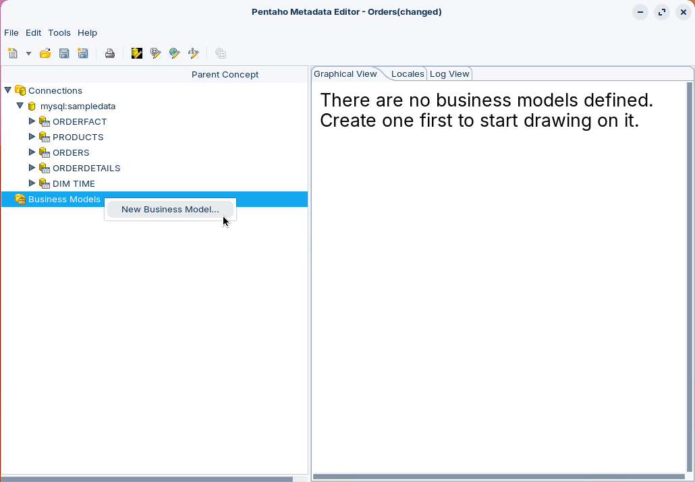<figcaption><p>New Business Model</p></figcaption></figure>

> **Note:** The Model Properties dialog displays.
>
> At the top of the dialog, there is an ID text field, pre-populated with a value. We recommend you accept the pre-populated value as this value MUST be unique across all models that you define.

3. To name your new model, enter: **OrdersME** in the Name property text box on the right.

<figure>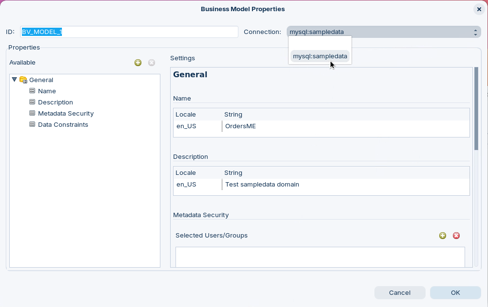<figcaption><p>OrdersME - Business Model</p></figcaption></figure>

4. From the Connection drop-down box, select: **mysql:sampledata**.
5. Click the **OK** button to close the dialog.

> **Note:** Your business model will show up in the Navigator Tree. All business models by default are created with a place to hold business tables, relationships and a business view. These are the next items you will want to define.

#### 2. Business Tables

> **Note:**
>
> #### Business Tables
>
> After creating the business model, the next step is to add the business tables and business columns, then create the relationships between our business tables.

<div class="pcm-embed-card" data-href="https://www.loom.com/share/4fa2959893424879b8720be246d37235?hideEmbedTopBar=true&amp;hide_owner=true&amp;hide_share=true&amp;hide_title=true" data-title="Building an Abstract Business Layer: Adding Tables and Defining Relationships" data-description="In this video, I demonstrate how to add tables from the physical layer to the abstract business layer of our model, specifically focusing on the orders ME model. I show you how to drag and drop the order fact table, products, and orders tables into the business tables folder, and I rearrange the icons in the graphical view for clarity. We will define the relationships between these tables in the next demonstration, so please pay attention to the steps I've outlined here. No changes to the table properties are necessary at this stage; just ensure you follow along as we build our model." data-thumb="../_assets/embeds/125979ecbc12.png"></div>
***

Select Tables:

1. Right-click (or ALT-click) on the **Business Tables** branch in the Navigator Tree.
2. Select: **New Business Table**.

<figure>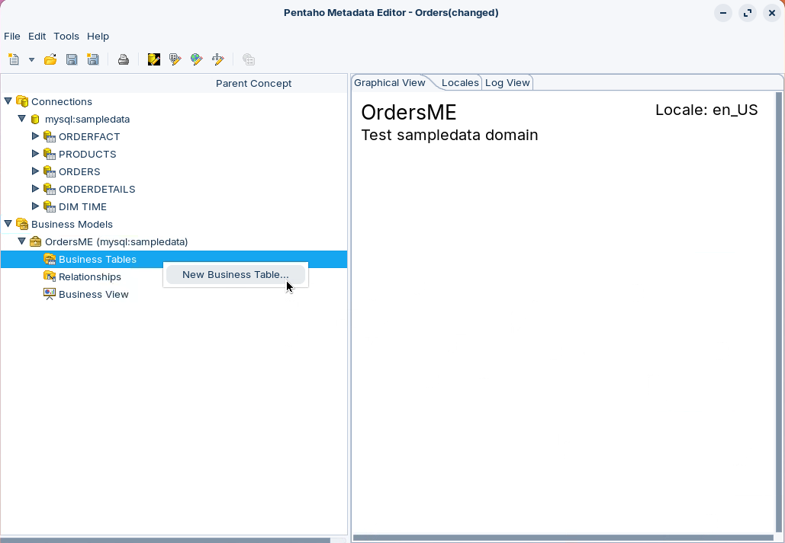<figcaption></figcaption></figure>

3. Select the physical table you want to associate with this new business table.

<figure>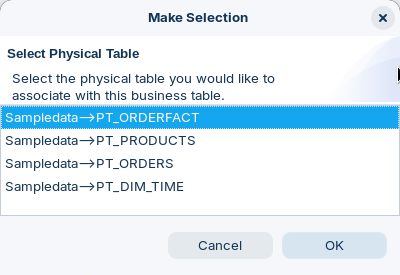<figcaption><p>Add tables</p></figcaption></figure>

> **Note:** Another method is to drag and drop the required tables onto the canvas.
>
> * Drag & drop PT_PRODUCTS
> * Drag & drop PT_ORDERS
> * Drag & drop PT_DIM_TABLE

<figure>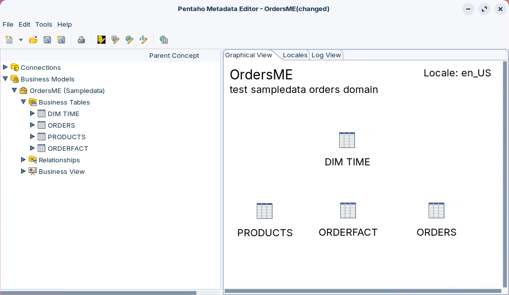<figcaption><p>Business tables - OrdersME</p></figcaption></figure>

#### 3. Relationships

> **Note:**
>
> #### Relationships
>
> Once you have all your business tables created, you will need to define the relationships between the tables, so that the query generators and SQL generators that work with Pentaho metadata can create the data queries correctly.
>
> This is very much like drawing a relational diagram to show primary and foreign key relationships. Although relational links are not the only relationships that can be modelled. You can create a relationship between any two tables, link any two columns between them and dictate what the relationship is (one to many, many to many, etc.).
>
> The important pieces of information to know before you try to create a relationship is:
>
> * what two business tables would you like to associate with this relationship
> * what columns in the business tables identify the relationship
> * and what kind of relationship is it - one to one, one to many, many to one, etc.

<div class="pcm-embed-card" data-href="https://www.loom.com/share/a4f250cd10f24e2fb9bd4eaa742781e0?hideEmbedTopBar=true&amp;hide_share=true&amp;hide_title=true&amp;sid=d2e5c9f9-854f-4027-936c-0717b20d234b?hide_owner=true" data-title="Building Relationships in the Abstract Business Layer" data-description="In this video, I demonstrate how to define relationships between tables in the abstract business layer, specifically joining the orders table to the order fact table using the order number column. I explain the importance of being deliberate when defining these relationships, as they significantly impact the queries created based on this model. I also highlight the one-to-many relationship type we are using and the default inner join. Finally, I encourage viewers to consult with their data warehouse team if they are uncertain about how to join tables. Please follow along as we will repeat similar steps to join the order fact table to the products table in the next demonstration." data-thumb="../_assets/embeds/125979ecbc12.png"></div>
***

Follow the guide to create the required Relationships:

> **Note:**
>
> #### Define Relationships
>
> To create a new relationship between business tables using the Tree Navigator, first make sure that the model you want to add this relationship to is selected, and the Relationships node is visible (lives under the business model name node).

1. Right-click (or ALT-click) on the **Relationships** branch in the Navigator Tree.
2. Select the **New Relationship...** option from the popup menu. The 'Relationship Properties' dialog displays.
3. Select from the: From Table / Field list the business table that you would like to start the relationship from:

| From Table / Field | To Table / Field |
| --- | --- |
| BT_DIM_TIME_DIM_TIME / BC_DIM_TIME_TIME_ID | BT_ORDERFACT_ORDERFACT / BC_ORDERFACT_TIME_ID |

> **Note:** In the Relationship Properties dialog, in From Table / Field, choose BT_DIM_TIME_DIM_TIME as the source table and BC_DIM_TIME_TIME_ID as the source field.

4. Select the To Table / Field list the business table that you would like the relationship to go to:

> **Note:** In To Table / Field, choose BT_ORDERFACT_ORDERFACT as the destination table and BC_ORDERFACT_TIME_ID as the destination field.

<figure>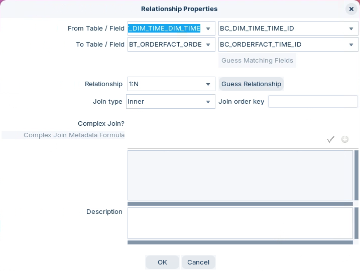<figcaption><p>Relationship Properties</p></figcaption></figure>

> **Note:** You must also specify the business columns (from the adjacent lists) from each business table that identify this relationship. An alternative, if the business column names are similar, is to click the **Guess Matching Fields** button, and let the dialog attempt to determine the columns for you.

5. Next step, define the relationship from the Relationship drop down list. For Relationship, choose **1:N** (1 to many), and then click **OK**.
6. If the relationship requires a complex join, select the complex join checkbox, and enter a formula in the text box provided.
7. Click **OK**.

> **Note:** You should see a new relationship line drawn between the two tables on the Editor Graph, and the relationship represented in the tree.

<figure>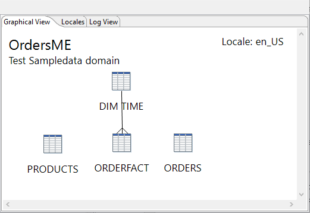<figcaption><p>DIM_TIME Relationship</p></figcaption></figure>

> **Note:**
>
> #### Editor Graph
>
> In the Editor Graph, creating a new relationship is simplified a bit, because you select the two business tables on the canvas, and the Relationship Properties dialog is pre-populated with your selections.

1. Select the two business tables you want to include in the new relationship, either by click and dragging a marquee around the tables, or by holding the SHIFT+CTRL keys, then clicking on the tables.
2. Once your business tables are selected in the Graph, right-click (or CTRL-click) on the selection.
3. Click: **Add Relationship**.

<figure>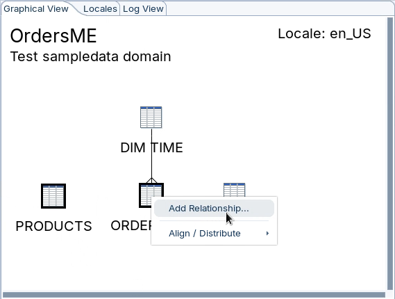<figcaption><p>Add Relationship</p></figcaption></figure>

4. In the Relationship Properties dialog, in From Table / Field, choose BT_ORDERFACT_ORDERFACT as the source table and BC_ORDERFACT_PRODUCTCODE as the source field.
5. In To Table / Field, choose BT_PRODUCTS_PRODUCTS as the destination table and BC_PRODUCTS_PRODUCTCODE as the destination field.

<figure>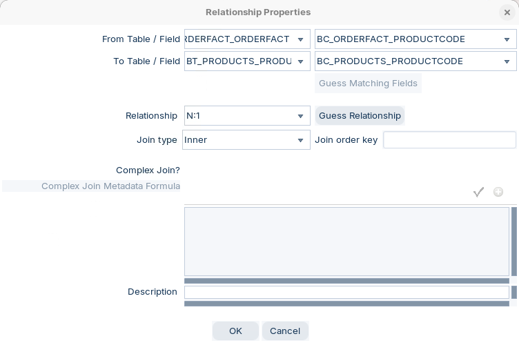<figcaption><p>Relation Properties</p></figcaption></figure>

6. For Relationship, choose **N:1** (many to 1) and then click **OK**.

<figure>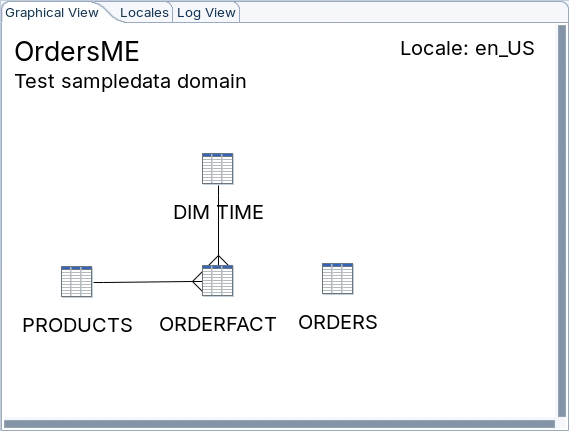<figcaption><p>Relationship - OrderFact (N) Product (1)</p></figcaption></figure>

7. Repeat the workflow for Orders.

<figure>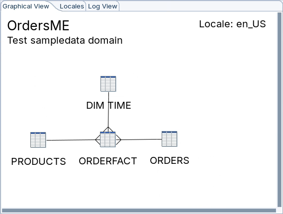<figcaption></figcaption></figure>

> **Note:** Quick recap: The OrdersME model is a Star schema. ORDERFACT is the FACT Table with a N:1 relationship with the Dimension tables: TIME, PRODUCTS & ORDERS.

> **Note:**
>
> #### Complex Joins
>
> Complex joins appear in the `WHERE` clause of the SQL statement, so currently any joining that takes place in the `FROM` clause of the SQL statement is not supported.
>
> An example of a complex join might be `TABLE_A.COL_A=TABLE_B.COL_A AND TABLE_A.COL_B=TABLE_B.COL_B`.
>
> This represents a join of two tables based on two key columns versus a single join column. Also note, the complex join expression provided must use the names of the physical tables and physical columns, not business tables and business column names.

> **Note:**
>
> #### Relationship Reference
>
> The following table describes the possible table relationships:

| Relationship | Description |
| --- | --- |
| 1:N | A one-to-many mandatory relationship is the most common relationship in databases. The primary key table contains only one record that relates to none, one, or many records in the related table. This relationship is similar to the one between you and one of your parents. You have one mother, but your mother may have several children. |
| N:1 | A many-to-one is opposite of one to many (1:N) relationship. |
| 1:1 | In a one-to-one relationship, both tables are limited to one record only on either side of the relationship. Each primary key value relates to a single record, or no record, in the associated table. They are like spouses — you may be married, or not; however, if you are married, both you and your spouse can have only one partner. Most one-to-one relationships are forced by business rules. If you do not have a business rule, you can, in most cases, combine both tables into one table without breaking normalization rules. |
| 0:N | A zero to many optional relationship indicates that a person may have no phone, one phone, or many phones, and that the phone may not be "owned," but can only be owned by a maximum of one person. |
| N:0 | Opposite of a zero to many relationship |
| 0:1 | A zero to one relationship might indicate that a person may be a programmer, but a programmer must be a person. It is assumed that the mandatory side of the relationship is the dominant. |
| 1:0 | Opposite of a zero to one relationship |
| N:N | In a many to many relationship each record in both tables can relate to an unlimited number of records (or no records) in the other table. For example, if you have many siblings, your siblings also have many siblings. Many-to-many relationships must have a third table, referred to as an associate or linking table, because relational systems cannot accommodate the relationship directly. |
| 0:0 | A zero to zero optional relationship indicates that a person may occupy one parking space, but that a person is not necessary to have a space and a space does not need to have a person. |

#### 4. Views

> **Note:**
>
> #### Building Business Views
>
> The Business View is a collection of business categories that represents the "view" of your model, typically consumed by your end users. Each model can have one and only one business view. Business Views are made up of a logically (logically relevant to your organization or end-users) organized business categories and business columns.

<div class="pcm-embed-card" data-href="https://www.loom.com/share/1a17c64882d04dd8a3aae0a4e5d9a4b4?hideEmbedTopBar=true&amp;hide_share=true&amp;hide_title=true&amp;sid=826e3356-bc75-40c3-9feb-6e8396645a0f?hide_owner=true" data-title="Building a Business View with Abstract Layers 📊" data-description="In this video, I demonstrate how to build a business view by adding columns from the abstract business layer into the Orders category. I start by selecting columns from the order fact table, including quantity ordered, price sold, total price, order date, and total, and then move them to the right. I also add product-related columns from the products table and a comments column from the orders table. While I focus on a single category for this example, I mention that additional categories can be created if needed. Please take note of the steps I outlined, as I will be applying metadata concepts to format these columns in the next demonstrations." data-thumb="../_assets/embeds/125979ecbc12.png"></div>
***

Follow the guide to create the required Business Views:

> **Note:**
>
> #### Categories
>
> A business category is just a named bucket for you to group and re-group your business columns in. They can mimic your business table names or be based on business terminology. Categories do not have metadata associated with them, have no tie back to any business table (although our Editor will give you the impression this relationship exists - don't be fooled), and have the simple purpose of allowing you to bucket the business columns in your model as intuitively as possibly for your data consumers.
>
> Today, categories are a single level entity. We hope in the future to support nested categories.
>
> Building a business view consists of creating your categories, then moving your business columns from the business tables into the categories. You can move columns from different business tables into the same category, and even duplicate the same business column into two different categories.
>
> The Editor Graph only represents the business tables portion of the business model, so we use the Tree Navigator and the Category Editor to create a business view.

1. Right-click (or ALT-click) on the **Business View** branch in the Navigator Tree.
2. Select the **New Category...** option from the popup menu.

<figure>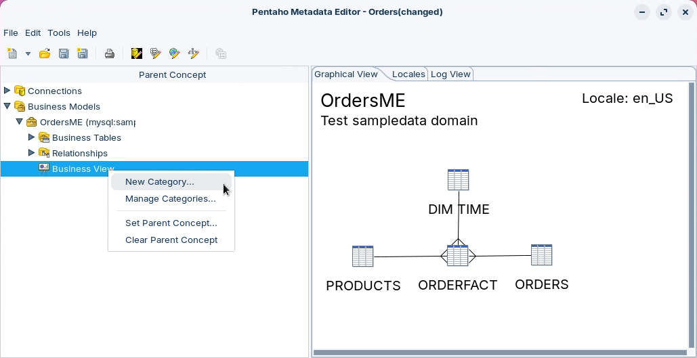<figcaption><p>New Category</p></figcaption></figure>

3. In the Business Category Properties dialog, in the ID field, type: **CT_ORDERS**.
4. In the General section, for Name, type: **Orders** in the String column, and then click **OK**.

<figure>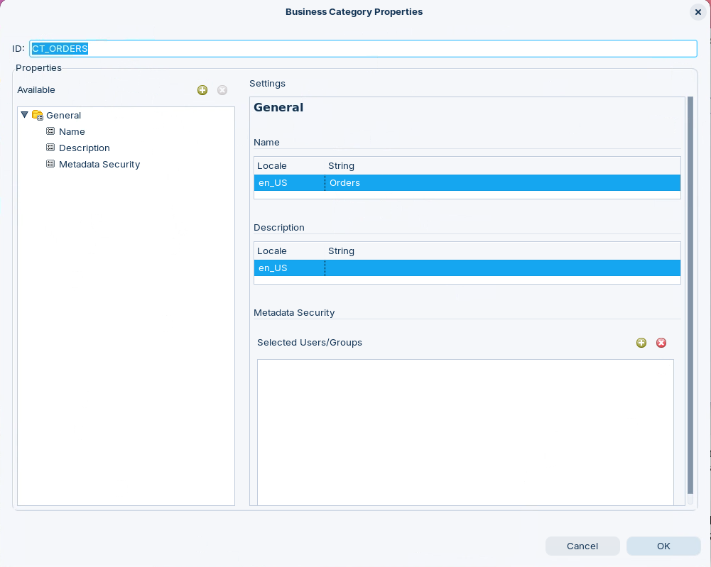<figcaption><p>CT_ORDERS Properties</p></figcaption></figure>

> **Note:**
>
> #### Manage Categories
>
> Arranging Business Columns in Categories. Now that you have a category, let's add some business columns to that category.

1. In the Navigator Tree, make sure that the business tables branch, and the business view branch of your model are both expanded.
2. Under Business Tables, expand the table whose columns you want to move.

<figure>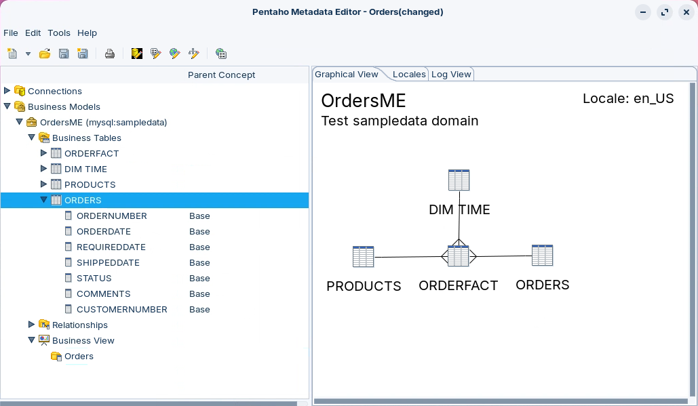<figcaption><p>ORDERS Table & Columns</p></figcaption></figure>

3. Click on a column under the Business Table and drag it to the category branch where you want it to reside.

***

1. Either double-click on the **Business View** branch in the Navigator Tree or choose the **Manage Categories** option from either the main menu or the main toolbar.
2. The Category Editor dialog displays.

<figure>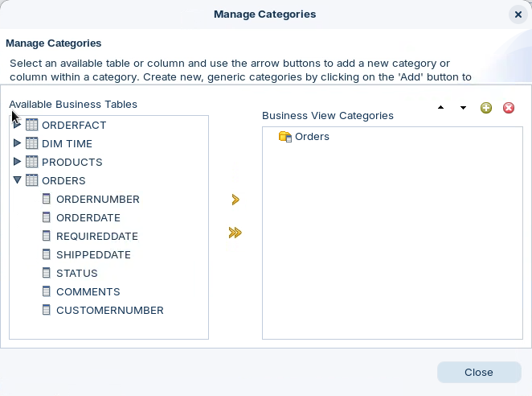<figcaption><p>Manage Categories</p></figcaption></figure>

3. In the Manage Categories dialog, in the Available Business Tables pane, expand **ORDERS**.
4. In the Available Business Tables pane, select the **ORDERNUMBER** column, then in the Business View Categories pane, click **Orders**, and then click the **Add** button.

<figure>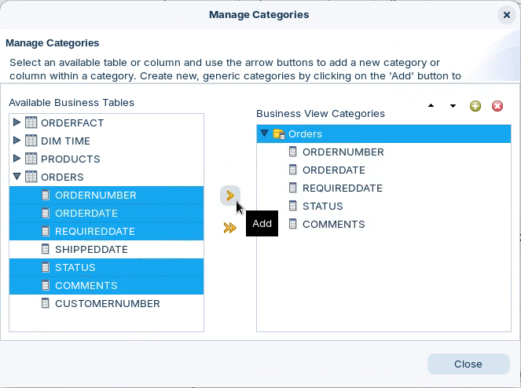<figcaption><p>Add Columns</p></figcaption></figure>

> **Note:** An item in the Available Business Tables and Business View Categories panes must be selected before clicking Add.

5. Repeat the previous step to add the following columns from the ORDERS table to the Orders category:

> **Note:**
> ORDERDATE
> REQUIREDDATE
> STATUS
> COMMENTS

6. Repeat the previous steps to add the following columns from the PRODUCTS table to the Products category:

> **Note:**
> PRODUCTNAME
> PRODUCTLINE
> PRODUCTVENDOR
> PRODUCTDESCRIPTION

7. Repeat the previous steps to add the following columns from the ORDERFACT table to the Measures category:

> **Note:**
> QUANTITYINSTOCK – located in PRODUCTS
> QUANTITYORDERED
> TOTALPRICE
> PRICEEACH

<figure>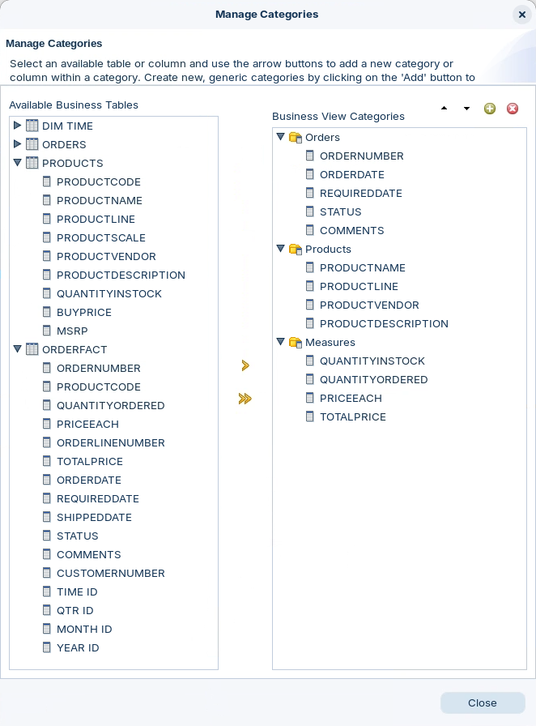<figcaption><p>Populate Categories</p></figcaption></figure>

### 4. Publish Model

> **Note:**
>
> #### Publish Model
>
> The final step is to publish the metadata domain to the BI server for use as a data source in the reporting tools.

<div class="pcm-embed-card" data-href="https://www.loom.com/share/e727cdebd0d745bbae38cdcde0327e30?hideEmbedTopBar=true&amp;hide_share=true&amp;hide_title=true&amp;sid=57f9ea8d-bec6-49a3-a3f5-13f3b90ff54e?hide_owner=true" data-title="Publishing a Domain File to the Pentaho Server" data-description="In this video, I walk you through the process of publishing a meta-data domain file to the Pentaho server, which is essential for using it as a data source in various tools like Interactive Reports and Report Designer. After creating the domain file, I demonstrate how to save it within the Metadata Editor and publish it by navigating to the File menu and selecting &amp;#34;Publish to Server.&amp;#34; I also highlight the importance of using the correct web publish URL and server credentials, which in this example are admin and password. While I chose not to rename the domain file during publication, I advise you to ensure that the stored domain name matches the published name if you decide to change it. Please follow these steps to successfully make your domain file available for use in Pentaho tools." data-thumb="../_assets/embeds/125979ecbc12.png"></div>
***

> **Danger:** Before you publish, ensure the Pentaho Server is up and running ..!

1. Save the metadata domain by choose **File > Save** from the menu options or by clicking the Save icon.
2. In the Save Domain dialog, type **Order Info** and click **OK**.
3. From the menu, choose **File > Publish To Server**.

<figure>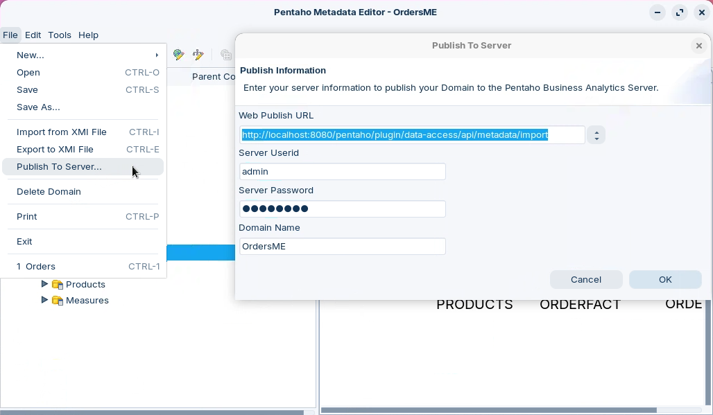<figcaption><p>Publish to Pentaho Server</p></figcaption></figure>

4. In the Publish To Server dialog, type or choose the following, and then click **OK**.

| Field | Value |
| --- | --- |
| Web Publish URL | http://localhost:8080/pentaho/plugin/dataaccess/api/metadata/import |
| Server UserID | admin |
| Server Password | password |
| Domain Name | OrdersME |

<figure>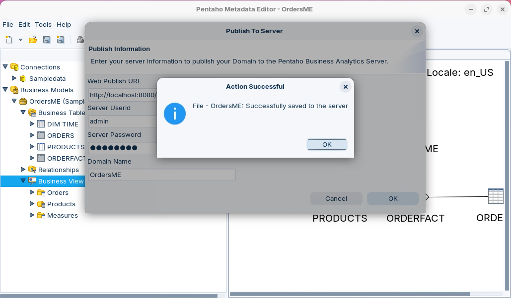<figcaption><p>Publish - OrdersME</p></figcaption></figure>

> **Warning:** You may have to wait a short while as the API request is satisfied ..

### 5. Test

> **Note:**
>
> #### Test - Interactive Report
>
> Finally, we will use the published metadata domain as a data source to create a report using Interactive Reporting.

<div class="pcm-embed-card" data-href="https://www.loom.com/share/47071741b2d649d08081fd3c07016049?hideEmbedTopBar=true&amp;hide_share=true&amp;hide_title=true&amp;sid=4a71737b-378d-486c-ad2f-7b252600ceee?hide_owner=true" data-title="Testing Business Models with Interactive Reports 📊" data-description="In this video, I walk you through the process of testing our newly published metadata domain within the Orders ME data model. I demonstrate how to create an interactive report, ensuring that all calculated columns, formatting, and aggregations are functioning correctly. I specifically verify the total column's calculations using quantity ordered and price sold, and I check the relationships between the order fact table, products table, and orders table. Please make sure to replicate these steps and confirm that everything is working as expected in your reports. Thank you!" data-thumb="../_assets/embeds/125979ecbc12.png"></div>
***

<button data-launch="puc">Open Pentaho User Console</button>

1. Log into the Pentaho User Console.
2. From the Home Perspective, click **Create New > Interactive Report**.
3. In the Select Data Source dialog, choose **OrdersME** and click **OK**.

<figure>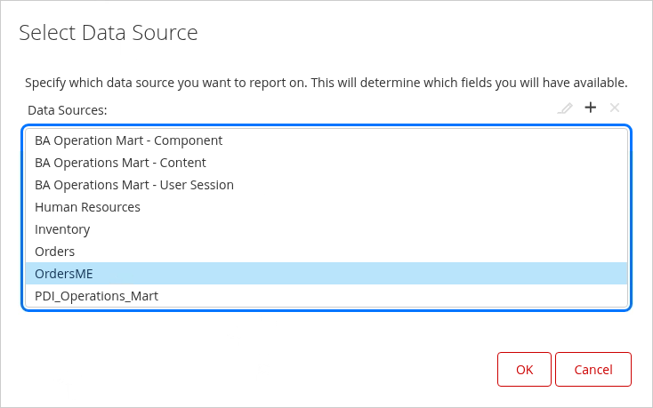<figcaption><p>Data Source - OrdersME</p></figcaption></figure>

4. Create the following report:

<figure>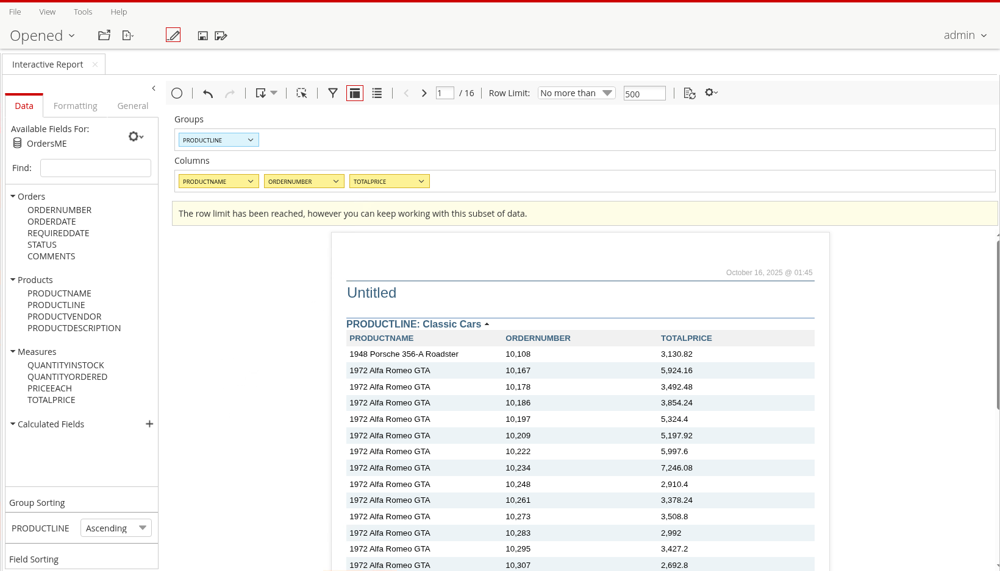<figcaption><p>Test Interactive Report</p></figcaption></figure>

5. From the menu, choose **File > Save**.

> **Success:** You have built the OrdersME metadata domain from scratch, published it to the Pentaho Server as an XMI file, and validated it by creating an Interactive Report against your semantic layer.

::::

## Lab Files

Download the reference files for this lab:

- [OrdersME Domain](../_assets/files/4u4huq.xmi)
