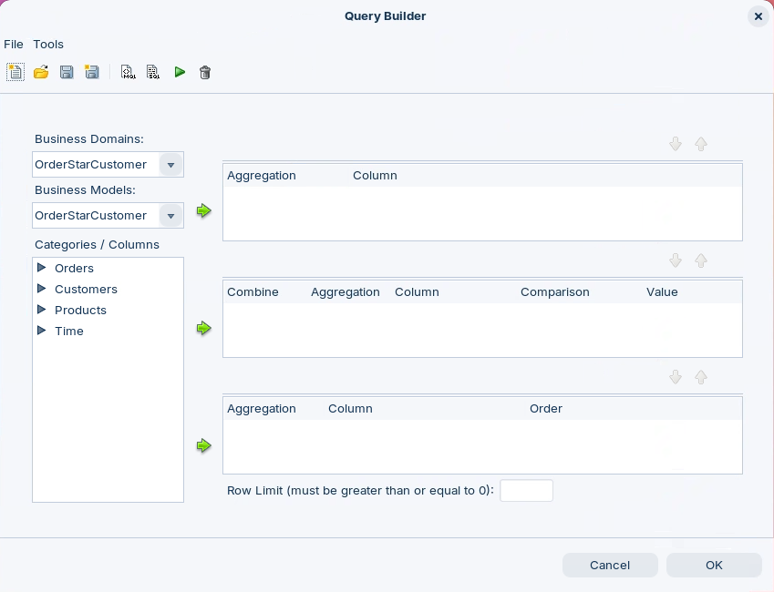
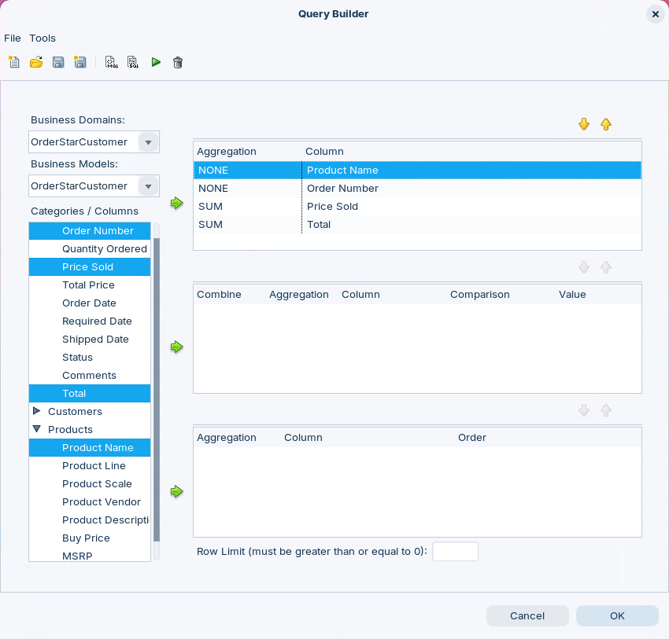
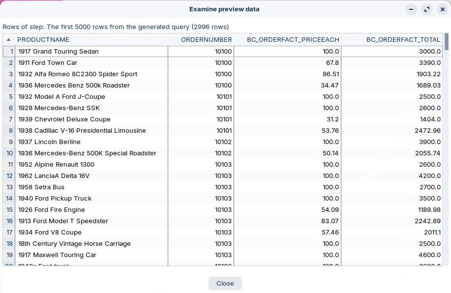

# Query Builder

> **Warning:**
>
> #### Workshop - Query Editor
>
> Once you've built a metadata domain with tables, relationships, and business views, you need to validate that the semantic layer works before publishing it. The Query Editor in Pentaho Metadata Editor lets you construct queries from business-friendly categories and columns, then see the generated SQL and resulting data.
>
> In this workshop, you'll use the Metadata Query Editor to test and validate the OrderStarCustomer domain, catching issues with relationships, aggregations, or column definitions before deployment — using the same intuitive interface business users will experience when building reports.
>
> **What you'll do**
>
> * Open an existing metadata domain in the Metadata Editor
> * Launch the Query Editor from the domain workspace
> * Navigate the Categories/Columns pane to explore available business fields
> * Select multiple columns from business categories for query construction
> * Execute metadata queries and review the preview data
> * Understand how the Query Editor translates business selections into SQL
> * Validate that relationships and joins work correctly across tables
>
> **Prerequisites:** Completion of the OrdersME workshop or access to the OrderStarCustomer.xmi domain file; Pentaho Metadata Editor installed and configured
>
> **Estimated time:** 15 minutes

***

1. Start Pentaho Metadata Editor:

> **Note:**
>
> #### Windows (PowerShell)
>
> ```powershell
> cd \
> cd Pentaho/design-tools/metadata-editor/
> ./metadata-editor.bat
> ```

> **Note:**
>
> #### Linux
>
> ```bash
> cd
> cd Pentaho/design-tools/metadata-editor/
> ./metadata-editor.sh
> ```

<button data-launch="metadata-editor">Open Metadata Editor</button>

<div class="pcm-embed-card" data-href="https://www.loom.com/share/fb31dbf09b494e71bd03a3ca905b0e58?hideEmbedTopBar=true&amp;hide_share=true&amp;hide_title=true&amp;sid=c17f1cdc-2507-463d-82ff-ff04702f3edd?hide_owner=true" data-title="Testing and Validating Data Models in Metadata Editor" data-description="In this video, I demonstrate how to use the Metadata Editor's query tool to test the order's ME model we built earlier. I walk you through selecting columns, setting a row limit of 100, and executing queries to validate our calculations and relationships within the data model. It's crucial to thoroughly test the model using various queries to ensure everything functions correctly. After reviewing the results, I conclude by saving and preparing to publish the metadata domain for use in interactive reports. Please make sure to apply these testing methods to your own models as well." data-thumb="../_assets/embeds/311c2e87415a.png"></div>
***

1. From the menu options, select **File > Open**, then select: **OrderStarCustomer**.
2. Click: **OK**.
3. To open the Query Editor, in the top toolbar, click the **Query Editor** button. <figure><figcaption></figcaption></figure>

<figure><figcaption><p>Query Builder</p></figcaption></figure>

4. In the Query Builder window, in the **Categories / Columns** pane, click to expand the **Orders** category.
5. Hold down the **Ctrl** key and in the **Categories / Columns** pane, select:

> **Note:**
>
> * Product Name
> * Order Number
> * Price Sold
> * Total Price

6. Click the top green arrow to move the columns to the **Selected Columns** pane.

<figure><figcaption><p>Query Builder - OrderStarCustomer Model</p></figcaption></figure>

7. To execute the query, on the toolbar, click: **Run** (green arrow head).
8. Review the preview data and then click: **Close**.

<figure><figcaption><p>Preview data</p></figcaption></figure>

9. Close the Query Builder, click: **OK**.

> **Note:** To define a parameter, specify the parameter's name by using curly brackets, `{Parameter Name}` for example. The parameter name must reference the parameter you created in your report. The **Default** value column is used to preview data in the Metadata Data Source Editor, only.

***

> **Success:** You've used the Query Editor to test and validate the OrderStarCustomer domain — selecting business columns, running a query, and reviewing the preview data to confirm your relationships and joins work correctly before publishing.
