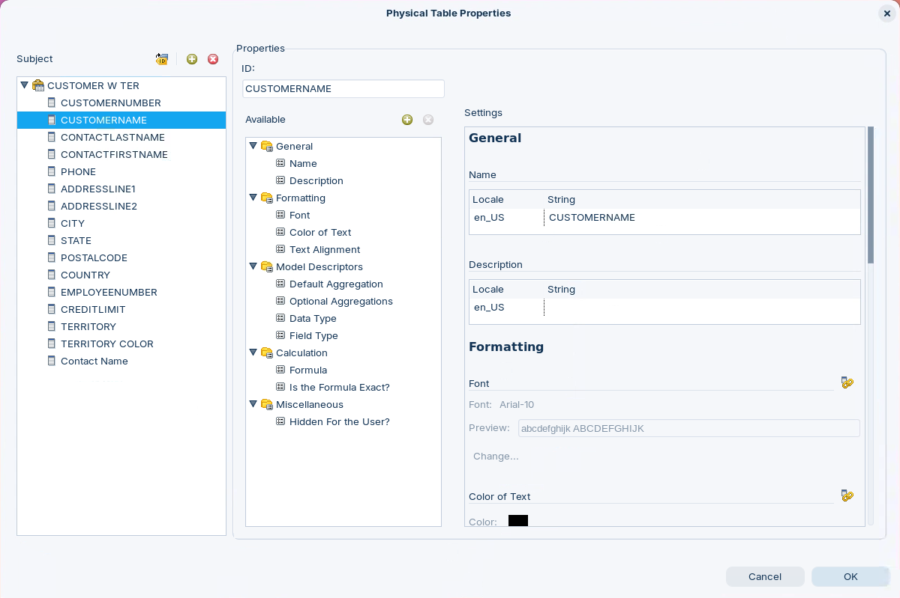

# Overview of Properties

In the Pentaho Metadata Editor, **properties** are the descriptive metadata attached to your data objects. They control how data is formatted, secured, and presented — letting users and applications interact with the model consistently. This page is your **reference** for what properties are, why some are mandatory, and how each one is structured as a simple key/value pair.

> **Note:**
>
> #### Properties
>
> The Pentaho Metadata Editor allows you to define and manage properties that describe your data model. These properties serve as metadata — descriptive information about your data objects — enabling users and applications to interact with data more effectively through consistent formatting, security rules, and custom attributes.
>
> **Required Properties**
>
> All physical objects (like tables) and many business objects have **mandatory properties** that are automatically created and cannot be deleted. These exist for a critical reason: they prevent users from accidentally removing properties that are essential for SQL generation to work properly. For example, a physical table must always have a "Target Table" property defined; without it, the SQL generator would fail and produce errors. Think of required properties as safeguards that maintain system integrity.
>
> **How Properties work?**
>
> A property consists of two parts: an identifier (a key) and a value. Together, these form a collection — essentially a map of attributes assigned to specific business objects like business columns or business tables.

<figure><figcaption>
Property Editor
</figcaption></figure>
