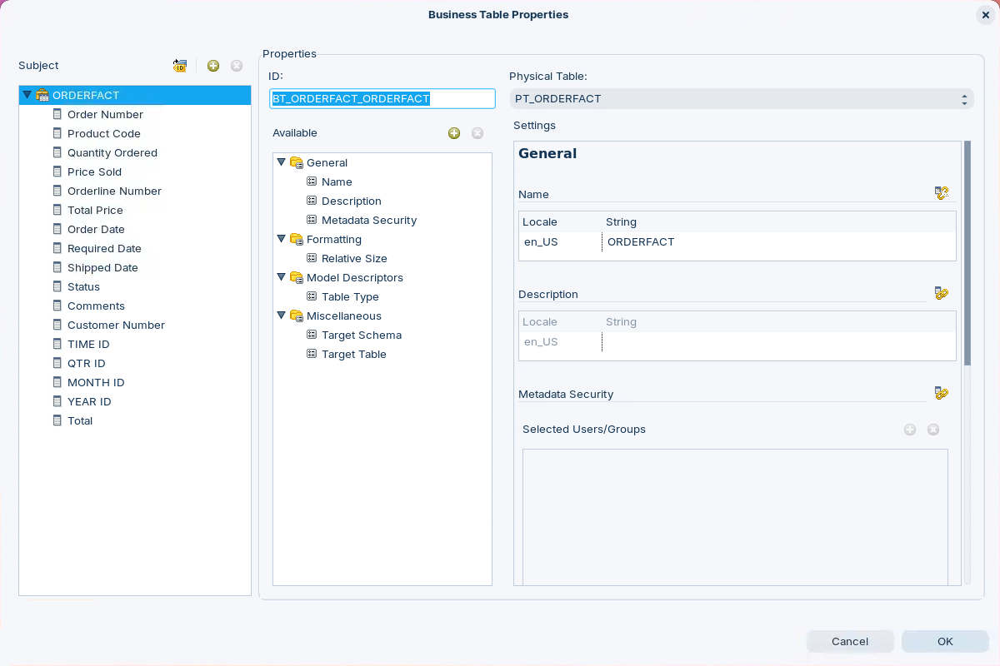
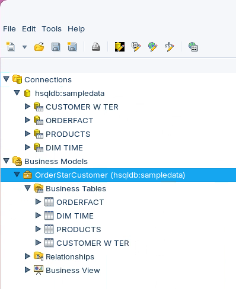
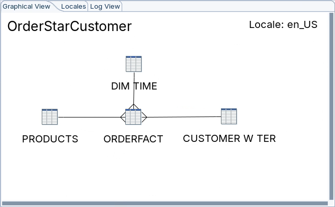
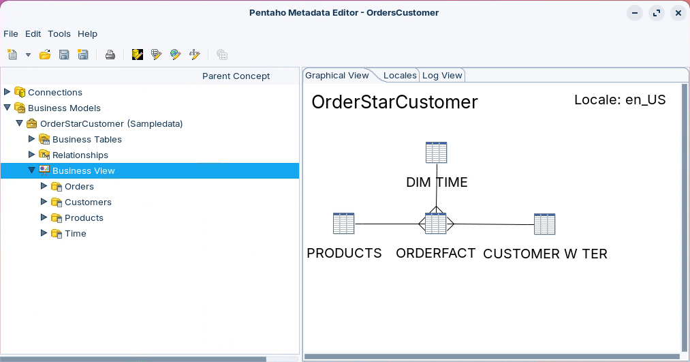
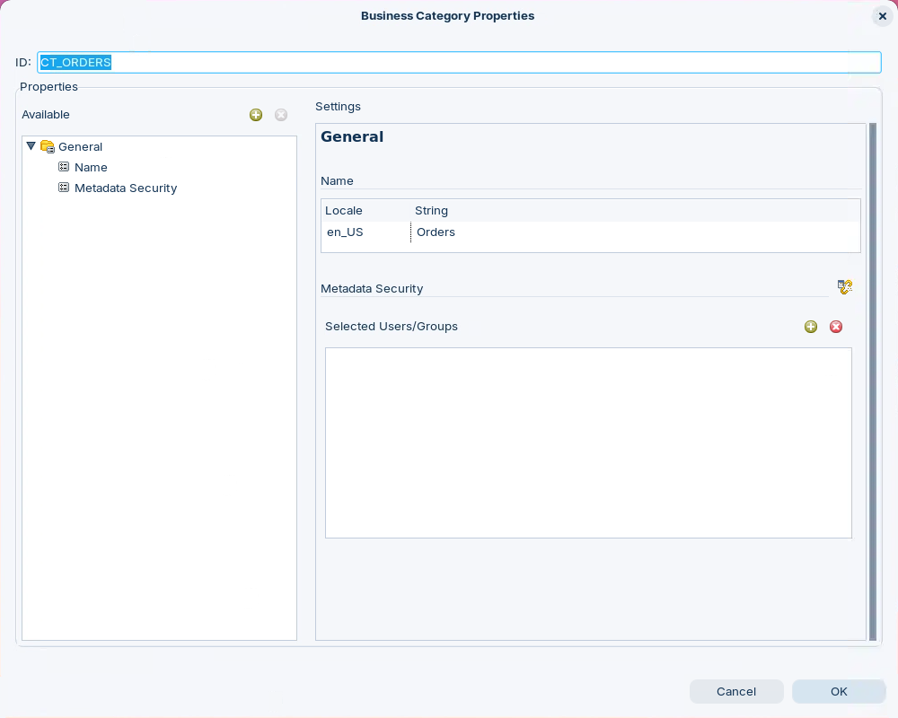

# OrderStarCustomer

> **Warning:**
>
> #### Workshop - OrderStarCustomer
>
> Building effective business intelligence solutions begins with creating a semantic layer that shields business users from technical database complexity while ensuring consistent, accurate data access across the organization. In this comprehensive workshop, you'll master the Pentaho Metadata Editor by constructing a complete metadata domain from scratch, transforming a raw star schema database into a business-friendly semantic model that enables self-service reporting. You'll learn how to bridge the gap between technical database structures and business terminology, creating a metadata layer that translates technical column names into meaningful business concepts while automatically generating proper SQL joins and aggregations.
>
> In this hands-on workshop, you'll experience the complete metadata modeling lifecycle, from establishing database connections and importing physical tables through creating business models with relationships and culminating in user-facing business views organized into logical categories. You'll master the essential techniques for configuring properties that control data types, aggregations, and display formatting, while learning to create calculated fields using formulas that extend your data model beyond what exists in the physical database. You'll discover how to build a three-layer architecture consisting of physical tables, business tables with enriched properties, and business views that present intuitive category-based navigation to report designers. You'll also develop the critical understanding of how metadata properties drive SQL generation, ensure data consistency, and create the foundation for enterprise-wide self-service analytics.
>
> **What you'll do**
>
> * Start Pentaho Metadata Editor and create a new domain file for the OrderStarCustomer model
> * Establish a JDBC connection to the hsqldb:sampledata Hypersonic database with proper authentication
> * Import four physical tables (PRODUCTS, ORDERFACT, CUSTOMER_W_TER, DIM_TIME) that form the star schema foundation
> * Create the OrderStarCustomer business model with a unique system identifier and database connection reference
> * Add business tables by dragging physical tables into the business layer to expose inherited metadata properties
> * Define three N:1 (many-to-one) relationships with Inner joins to establish the star schema structure connecting ORDERFACT to CUSTOMER_W_TER via CUSTOMERNUMBER, to PRODUCTS via PRODUCTCODE, and to DIM_TIME via TIME_ID
> * Override inherited Name properties across all business table columns to transform technical names into business-friendly labels (PRODUCTCODE becomes Product Code, CUSTOMERNUMBER becomes Customer Number)
> * Configure Model Descriptor properties including Data Type (setting Order Date to Date type) and Default Aggregation (setting Price Sold to Sum with optional aggregations for Average, Minimum, Maximum)
> * Create calculated columns using formulas including PC_TOTAL (QUANTITYORDERED multiplied by PRICEEACH) in the physical layer and BC_TOTAL in the business layer
> * Build a concatenated Contact Name field using the formula CONTACTLASTNAME comma CONTACTFIRSTNAME to combine customer contact information
> * Organize business columns into four logical Business View categories (CT_ORDERS for Orders, CT_CUSTOMERS for Customers, CT_PRODUCTS for Products, CT_TIME for Time)
> * Populate the Orders category with nine columns including Order Number, Order Date, Status, Price Sold, Quantity Ordered, and the calculated Total field
> * Populate the Customers category with thirteen columns including Customer Number, Customer Name, Contact Name, complete address details, Territory, Employee Number, Credit Limit, and Phone
> * Populate the Products category with nine columns including Product Code, Product Name, Product Line, Product Scale, Product Vendor, Product Description, Quantity In Stock, Buy Price, and MSRP
> * Populate the Time category with seven temporal attributes including Time ID, Year ID, Month Name, Month Description, Quarter Name, and Quarter Description
> * Save the completed OrderStarCustomer domain file ready for publishing to the Pentaho Server
>
> By the end of this workshop, you'll have created a production-ready metadata domain that demonstrates best practices in semantic layer design. You'll understand how the three-layer architecture (physical tables, business model, business views) separates technical implementation from business presentation, how properties control SQL generation and data formatting, and how formulas extend the data model with calculated fields. You'll have mastered the relationship modeling that enables automatic join generation, the property configuration that ensures consistent aggregations and data types, and the business view organization that creates intuitive, category-based navigation for report designers. These skills form the foundation of enterprise metadata modeling, enabling you to create semantic layers that democratize data access, ensure consistency across reports, and shield business users from database complexity while maintaining data integrity and performance.
>
> **Prerequisites:** Pentaho Metadata Editor installed; Pentaho Server running with hsqldb:sampledata database accessible
>
> **Estimated time:** 45 minutes

<figure><figcaption><p>Metadata Properties</p></figcaption></figure>

***

1. Start Metadata Editor:

> **Note:**
>
> #### Windows (PowerShell)
>
> ```powershell
> cd \
> cd Pentaho/design-tools/metadata-editor/
> ./metadata-editor.bat
> ```

> **Note:**
>
> #### Linux
>
> ```bash
> cd
> cd Pentaho/design-tools/metadata-editor/
> ./metadata-editor.sh
> ```

2. Start the Pentaho Server (not required if using Pentaho Labs):

> **Note:**
>
> #### Windows (PowerShell)
>
> ```powershell
> cd \
> cd Pentaho/server/pentaho-server
> ./start-pentaho.bat
> ```

> **Note:**
>
> #### Linux
>
> ```bash
> cd
> cd /opt/pentaho/server/pentaho-server
> sudo ./start-pentaho.sh
> ```

<button data-launch="metadata-editor">Open Metadata Editor</button>

Follow the guide below to create your OrderStarCustomer domain:

:::: tabs

### 1. Connection & Tables

> **Note:**
>
> #### Define a Domain & JDBC Connection
>
> In the OrderStarCustomer workshop, the foundational step involves creating a new domain file and establishing a JDBC database connection that links the Pentaho Metadata Editor to the physical data source. The connection named "hsqldb:sampledata" is configured as a Hypersonic database type using Native JDBC access, pointing to localhost on port 9001 with the database name "sampledata" and credentials (pentaho_admin/password).
>
> After successfully testing the connection, four physical tables are imported from the database into the metadata domain's physical layer: PRODUCTS (product dimension), ORDERFACT (fact table containing transactional order data), CUSTOMER_W_TER (customer dimension with territory information), and DIM_TIME (time dimension).
>
> These imported tables form the physical foundation of the metadata model and can be verified in the Connections tree under hsqldb:sampledata, representing the raw database structures that will later be transformed into business-friendly abstractions through the Business Model and Business View layers.

1. To define a new domain, select: **File > New > Domain File** from the main menu.
2. Right-mouse click on **Connections** or: **File > New > Connection**:

| Field | Parameter |
| --- | --- |
| Connection name | hsqldb:sampledata |
| Connection Type | Hypersonic |
| Access | Native (JDBC) |
| Host name | localhost |
| Database Name | sampledata |
| Port Number | 9001 |
| User Name | pentaho_admin |
| Password | password |

3. Click **Test**.
4. Click **OK** to dismiss the Database Connection Test dialog, and then click **OK** to close the Database Connection dialog.
5. Leave the Metadata Editor and the Import Tables dialog open.

***

> **Note:**
>
> #### Import Tables
>
> The next step is to import table metadata from your data source into the physical layer and then add the table metadata to the abstract business layer.

1. If the Import Tables dialog is not open, right-click **hsqldb:sampledata** and choose **Import Tables**.
2. In the Import Tables dialog, press and hold the **Ctrl** key and use the mouse to select the following tables:

> **Note:**
>
> PRODUCTS
>
> ORDERFACT
>
> DIM_TIME
>
> CUSTOMER_W_TER
>
> The ORDERFACT table is the FACT table for the star schema.

3. Click **OK** to import the table metadata.
4. Expand **Connections > hsqldb:sampledata** and verify each of the tables appears in the physical layer.

### 2. Business Model

> **Note:**
>
> #### Business Model
>
> In the OrderStarCustomer workshop, the Business Model serves as the central container that connects physical database tables to business-friendly abstractions and defines the relationships that enable proper SQL generation. The model is created with the name "OrderStarCustomer" and assigned a system-generated unique ID (BV_MODEL_1) that Pentaho uses internally to reference the correct model when generating SQL statements.
>
> It is linked to the hsqldb:sampledata database connection and contains a description identifying it as a "Business model for Steel Wheels star schema." Four business tables (PRODUCTS, ORDERFACT, CUSTOMER_W_TER, and DIM_TIME) are added by dragging them from the physical layer, exposing their inherited metadata properties for enrichment. Three N:1 (many-to-one) relationships are then defined with Inner joins to establish the star schema structure: ORDERFACT connects to CUSTOMER_W_TER via CUSTOMERNUMBER, to PRODUCTS via PRODUCTCODE, and to DIM_TIME via TIME_ID.
>
> These relationships appear visually in the Graphical View and enable the metadata layer to automatically generate proper table joins when users create reports.

1. Right-click **Business Models** and choose **New Business Model**.
2. In the Business Model Properties dialog, in the General section, for **Name**, replace the existing value in the String column by typing: `OrderStarCustomer`.

> **Danger:**
>
> The model's unique ID, BV_MODEL_1, appears at the top of the Business Model Properties dialog.
>
> Do not change this value. It's used internally to reference the correct model when generating SQL statements.
>
> Optional: Type a description in the String column in the Description section such as: `Business model for Steel Wheels star schema`.

3. In the upper right corner of the dialog, for **Connection**, choose: **hsqldb:sampledata**.
4. Click **OK** to close the 'Business Model Properties' dialog.

<figure><figcaption><p>Business Model - OrderStarCustomer</p></figcaption></figure>

***

> **Note:**
>
> #### Business Tables
>
> Tables that represent the model. These expose the inherited BASE metadata Properties that can be edited / enriched to ensure consistency for your business users.

1. Expand **Business Models > OrderStarCustomer**.
2. Drag the **PRODUCTS** table from **Connections > hsqldb:sampledata** to **Business Models > Business Tables** to add the table (and columns) to the abstract business layer.

> **Note:**
>
> The tables cannot be dragged into the 'Business Tables' view as a group. They must be added individually. When you receive the Business Model Properties dialog, note the table 'ID,' BT_PRODUCTS_PRODUCTS, and the 'Physical Table' name, PT_PRODUCTS.

3. Click **OK** to dismiss the properties dialog. Using the Business Model Properties dialog, you can (optionally) remove columns from the tables before adding them to the business model.
4. Repeat the previous steps to add:

> **Note:**
>
> ORDERFACT
>
> DIM_TIME
>
> CUSTOMER_W_TER

5. Save.

### 3. Relationships

> **Note:**
>
> #### Relationships
>
> Database table relationships define how data in one table connects to data in another table, establishing logical associations that reflect real-world business rules and enable efficient data retrieval through joins. Relationships are implemented using primary keys (unique identifiers in a table) and foreign keys (columns that reference primary keys in related tables), ensuring referential integrity and eliminating data redundancy.
>
> The three fundamental relationship types are one-to-one (1:1), where each record in one table corresponds to exactly one record in another table; one-to-many (1:N or N:1), the most common type where a single record in a parent table can relate to multiple records in a child table (such as one customer having many orders); and many-to-many (N:M), where multiple records in one table can relate to multiple records in another table, typically implemented through an intermediary junction table.
>
> These relationships form the backbone of relational database design, enabling complex queries across multiple tables while maintaining data consistency, reducing storage redundancy, and supporting business logic through enforced constraints that prevent orphaned records and maintain data quality across the entire database schema.

<figure><figcaption><p>Relationships - OrdersStarCustomer</p></figcaption></figure>

Follow the guide to define the Relationships:

#### 1. ORDERFACT - CUSTOMER_W_TER

1. Expand **Business Models > OrderStarCustomer** (if necessary), right-click **Relationships** and choose **New Relationship**.
2. In the Relationship Properties dialog, in **From Table / Field**, choose **BT_ORDERFACT_ORDERFACT** as the source table.
3. In the field to the right of **From Table / Field**, choose source key value **BC_ORDERFACT_CUSTOMERNUMBER**.

> **Note:**
>
> This creates the relationship between the ORDERFACT and CUSTOMER_W_TER tables. The editor defines logical relationships based on a key value. A complex join (with multiple keys) can be specified, but a well-structured data warehouse should rarely use complex joins.

4. In **To Table / Field**, choose **BT_CUSTOMER_W_TER_CUSTOMER_W_TER** as the destination table.
5. In the field to the right of **To Table / Field**, choose destination key value **BC_CUSTOMER_W_TER_CUSTOMERNUMBER**. You may also use **Guess Matching Fields** to try to automatically determine the relevant key values.
6. For **Relationship**, choose **N:1** (many to 1).
7. For **Join type**, choose **Inner**. An inner join produces a result set when there is at least one row in each table that matches the join condition.
8. Accept the remaining default options and click **OK**. A visual representation of the relationship appears in the Graphical View.

#### 2. ORDERFACT - PRODUCTS

1. Right-click **Relationships** and choose **New Relationship**.
2. In the Relationship Properties dialog, in **From Table / Field**, choose **BT_ORDERFACT_ORDERFACT** as the source table.
3. In the field to the right of **From Table / Field**, choose source key value **BC_ORDERFACT_PRODUCTCODE**. This creates the relationship between ORDERFACT and PRODUCTS.
4. In **To Table / Field**, choose **BT_PRODUCTS_PRODUCTS** as the destination table.
5. In the field to the right of **To Table / Field**, choose destination key value **BC_PRODUCTS_PRODUCTCODE**.
6. For **Relationship**, choose **N:1** (many to 1).
7. For **Join type**, choose **Inner**.
8. Accept the remaining default options and click **OK**. A visual representation of the relationships will appear in the Graphical View.

#### 3. ORDERFACT - TIME

1. Right-click **Relationships**, and choose: **New Relationship**.
2. In the Relationship Properties dialog, in **From Table / Field**, choose **BT_ORDERFACT_ORDERFACT** as the source table.
3. In the field to the right of **From Table / Field**, choose source key value **BC_ORDERFACT_TIME_ID**.
4. In **To Table / Field**, choose **BT_DIM_TIME_DIM_TIME** as the destination table. This creates the relationship between ORDERFACT and DIM_TIME.
5. In the field to the right of **To Table / Field**, choose destination key value **BC_DIM_TIME_TIME_ID**.
6. For **Relationship**, choose **N:1** (many to 1).
7. For **Join type**, choose **Inner**.
8. Accept the remaining default options and click **OK**. A visual representation of the relationships will appear in the Graphical View.
9. Save the OrderStarCustomer domain.

### 4. Properties

> **Note:**
>
> #### Properties
>
> In the OrderStarCustomer workshop, Properties are the configurable attributes that transform technical database column names into business-friendly terms and control how data is processed and displayed to end users. After importing physical tables into the Business Model, developers systematically override the inherited Name properties for each column across all business tables (PRODUCTS, ORDERFACT, DIM_TIME, and CUSTOMER_W_TER).
>
> This converts technical names like PRODUCTCODE and CUSTOMERNUMBER into readable labels like "Product Code" and "Customer Number" that business analysts can easily understand. Model Descriptor properties such as Data Type and Default Aggregation are also configured to control SQL generation behavior. For example, Order Date is set to Date type for proper formatting, and Price Sold is configured with Sum as the default aggregation plus optional aggregation methods.
>
> These property configurations ensure that when users build reports, the metadata layer automatically applies correct data types, aggregation functions, and business terminology without requiring users to understand the underlying database structure or write SQL code.

#### 1. PRODUCTS

1. Right-click **PRODUCTS** and choose: **Edit**.
2. In the Business Table Properties dialog, in the Subject pane, select: **PRODUCTCODE**.
3. In the Available pane, click: **General > Name**.
4. In the Settings section, click: the **Override** button.
5. In the String column, type: `Product Code`.
6. In the Subject pane, select: **PRODUCTNAME**.
7. Repeat the previous steps to change the Name string to: `Product Name`.
8. Repeat the previous steps to change the names of the remaining columns to the following:

> **Note:**
>
> Product Line
>
> Product Scale
>
> Product Vendor
>
> Product Description
>
> Quantity In Stock
>
> Buy Price - There is no need to edit the MSRP name.

9. Click **OK** and save your work.

#### 2. ORDERFACT

1. Expand **Business Models > OrderStarCustomer > Business Tables**.
2. In the Business Tables view, right-click **ORDERFACT** and choose: **Edit**.
3. In the Settings section, click: the **Override** button.
4. Repeat the previous steps to change these column names to the following:

> **Note:**
>
> Order Number
>
> Product Code
>
> Quantity Ordered
>
> Order Line Number
>
> Total Price
>
> Order Date
>
> Required Date
>
> Shipped Date
>
> Status
>
> Comments
>
> Customer Number

5. Click **OK** and save your work.

#### 3. DIM_TIME

1. In the Business Tables view, right-click **DIM_TIME** and choose: **Edit**.
2. In the Subject pane, select: **TIME_ID**.
3. In the Available pane, click: **General > Name**, click **Override**, and change the String value to: `Time ID`.
4. Repeat the previous steps to change the remaining column names to the following:

> **Note:**
>
> Year ID
>
> Month Name
>
> Month Description
>
> Qtr Name
>
> Qtr Description

5. Click **OK** and save your work.

#### 4. CUSTOMER_W_TER

1. In the Business Tables view, right-click **CUSTOMER_W_TER** and choose: **Edit**.
2. In the Business Table Properties dialog, in the Subject pane, click: **CUSTOMERNUMBER**.
3. In the Available pane, click **General > Name**, click: **Override** icon, and change the String column value to: `Customer Number`.
4. Repeat the previous steps to change the remaining columns to the following:

> **Note:**
>
> Customer Name
>
> Contact Last Name
>
> Contact First Name
>
> Phone
>
> Addressline1
>
> Addressline2
>
> City
>
> State
>
> Postal Code
>
> Country
>
> Employee Number
>
> Credit Limit
>
> Territory
>
> Territory Colour

5. Click **OK** and save your work.

#### 5. Calculated Values

> **Note:**
>
> #### Calculated Values & Formulas
>
> Formulas serve four critical functions in Pentaho metadata: they define constraints in Metadata Queries to filter data subsets, enable physical table columns to combine multiple database columns or perform complex aggregate calculations, support sophisticated multi-key joins and logic in business model relationships, and enforce row-level security.
>
> Pentaho uses JFreeReport's libFormula package to interpret formulas in OpenFormula syntax, then automatically converts them into database-native SQL, providing flexibility and power across your metadata layer.

<div class="pcm-embed-card" data-href="https://www.loom.com/share/91b0ceedd4ef475f933ff31d4627bc91?hideEmbedTopBar=true&amp;hide_share=true&amp;hide_title=true&amp;sid=8b7b1cee-9d53-48e8-9df6-c88d1ec7f531?hide_owner=true" data-title="Building a Data Model: Adding Calculated Values and Formulas" data-description="In this video, I walk you through the process of adding calculated values at the metadata level in our data model, specifically how to calculate the total by multiplying the quantity ordered by the price each. I demonstrate how to add a new column for this calculation in the order fact table and ensure it has the correct properties, including setting the default aggregation to Sum. After adding the total column to the physical layer, I show you how to bring it into the business layer for user access. Please make sure to follow along and replicate these steps in your own models, as we will build on this in the next demonstrations." data-thumb="../_assets/embeds/125979ecbc12.png"></div>
**Calculated Values > 1. Aggregation**

> **Note:**
>
> #### Aggregation
>
> Setting predefined values.

1. In the Subject pane, select: **PRICEEACH** from ORDERFACT.
2. In the Available pane, click **General > Name**, click: **Override**, and change the String value to: `Price Sold`
3. In the Available pane, in the Model Descriptors section, click: **Default Aggregation**.
4. Click the **Override** icon.

> **Note:**
>
> After clicking Override, the Settings pane may jump to the top of the page.
>
> Click Default Aggregation again or scroll down to the section in the Settings pane.

5. For **Aggregation Type**, choose: **Sum**.
6. In the Available pane, click: **Optional Aggregations**.
7. Select all the following options in the Aggregation List using the **Ctrl** key:

> **Note:**
>
> Average
>
> Minimum
>
> Maximum

8. Click **OK** and save your work.

**Calculated Values > 2. Data Type**

> **Note:**
>
> #### Data Type
>
> Enables you to apply masks, defining and formatting the object's data type.

1. In the Subject pane, select: **Order Date**.
2. In the Available pane, click: **Model Descriptors > Data Type**.
3. Click: **Override**, and change the Data Type value to: **Date**.

> **Warning:**
>
> It is important to set the correct data type in this case for Java date formatting to be applied. We will only change the Data Type for the Order Date now. We will apply formatting later in this workshop.

4. Click **OK** and save your work.

**Calculated Values > 3. Formulas**

> **Note:**
>
> #### Formulas
>
> After configuring the display names for your table columns, the next step is to add any formulas you wish to have calculated at the metadata level. In this exercise, you use formulas to define physical table columns that combine values from other columns.

1. Expand **Connections > hsqldb:sampledata**.
2. Right-click: **ORDERFACT > Edit**.
3. In the Physical Table Properties dialog, above the Subject pane, click: **Add New Column**.
4. In the New Column dialog, type: `PC_TOTAL` and click **OK**.
5. In the Subject pane, click: **Total**.
6. In the Available pane, click: **Default Aggregation**.
7. For **Aggregation Type**, choose: **Sum**.
8. Click: **Optional Aggregations**.
9. In the Aggregation List, use the **Ctrl** key to select the following options:

> **Note:**
>
> Average
>
> Minimum
>
> Maximum

10. In the Available pane, click: **Model Descriptors > Data Type**.
11. From the Data Type drop-down list, select: **Numeric**.
12. In the Available pane, click: **Calculation > Formula**.
13. In the Formula section, in the Value field, type:

```
[QUANTITYORDERED]*[PRICEEACH]
```

14. Check **Is the formula exact?**
15. Click **OK** and save your work.

**Calculated Values > 4. Total**

> **Note:**
>
> #### Total
>
> You can also use Formulas to calculate various Totals.

1. Expand **Business Models > OrderStarCustomer > Business Tables** (if necessary).
2. Right-click **ORDERFACT** and choose: **Edit**.
3. In the Business Table Properties dialog, above the Subject pane, click: **Add New Column** button.
4. In the Add New Column dialog, click: **Total** and click: **OK**.
5. Click **OK** and save your work.

**Calculated Values > 5. Contact**

> **Note:**
>
> #### Contact
>
> An example of how to concatenate Business Columns in MQL - Metadata Query Language.

1. Expand **Connections > hsqldb:sampledata**.
2. Right-click **CUSTOMER_W_TER** and choose **Edit**.
3. In the Physical Table Properties dialog, above the Subject pane, click the **Add New Column**.
4. In the New Column dialog, type `PC_CONTACT` and click **OK**.
5. In the Subject pane, select **Contact** and in the Available pane, click **General > Name**.
6. In the String column, type `Contact Name`.
7. Optional: In the Description section, in the String column type: `Full Name of Contact Person`.
8. In the Available pane, click **Calculation > Formula**.
9. In the Formula section, in the Value field, type:

```
[CONTACTLASTNAME]+","+[CONTACTFIRSTNAME]
```

10. Check **Is the formula exact?**
11. Expand **Business Models > OrderStarCustomer > Business Tables** (if necessary).
12. Right-click **CUSTOMER_W_TER** and choose **Edit**.
13. In the Business Table Properties dialog, above the Subject pane, click the **Add New Column** button.
14. In the Add New Column dialog, click **Contact Name** and click **OK**.
15. Click **OK** and save your work.

### 5. Business Views

> **Note:**
>
> #### Business Views
>
> In the OrderStarCustomer workshop, Business Views are created as the final presentation layer by organizing business table columns into four logical categories—CT_ORDERS (Orders), CT_CUSTOMERS (Customers), CT_PRODUCTS (Products), and CT_TIME (Time)—that business users can easily understand and navigate.
>
> Using the "Manage Categories" dialog, developers selectively add relevant columns from the underlying business tables (ORDERFACT, CUSTOMER_W_TER, PRODUCTS, and DIM_TIME) into their appropriate categories, such as placing Order Number, Order Date, Status, and the calculated Total field into the Orders category.
>
> This categorization transforms the technical star schema structure into intuitive, business-friendly groupings that enable analysts to build reports by simply selecting fields from familiar categories without understanding the underlying table relationships or SQL joins.

<figure><figcaption><p>Business Views - OrdersStarCustomer</p></figcaption></figure>

Follow the guide to apply the Business Views:

#### 1. CT_ORDERS

> **Note:**
>
> #### Orders Category
>
> The CT_ORDERS category is a business view within the OrderStarCustomer metadata model that organizes order-related data from the ORDERFACT table into a business-friendly structure.
>
> This category, named "Orders" for end users, consolidates nine key order management columns including Order Number, Order Date, Required Date, Shipped Date, Status, and Comments for tracking order fulfillment, along with transactional metrics such as Price Sold, Quantity Ordered, and Total (a calculated field multiplying quantity by price).

1. Expand **Business Models > OrderStarCustomer** (if necessary), right-click **Business View** and choose **New Category**.
2. In the Business Category Properties dialog, in the ID field, type: `CT_ORDERS`.

<figure><figcaption><p>CT_ORDERS</p></figcaption></figure>

3. In the General section, for **Name**, type `Orders` in the String column.

> **Note:**
>
> Optional: In the Description section, for the en_US locale, type the following description in the String column: This category contains information about orders including order number, order date, required date, shipping status, etc.

4. Click **OK** (later .. you will configure the security).
5. Expand **Business Models > OrderStarCustomer > Business View** (if necessary).
6. Right-click **Business View > Orders** and choose **Manage Categories**.
7. In the Manage Categories dialog, in the Available Business Tables pane, expand **ORDERFACT**.
8. In the Available Business Tables pane, select the **Order Number** column, in the Business View Categories pane, select **Orders**, and click the **Add** button.

> **Note:**
>
> Items in both Available Business Tables and Business View Categories must be selected before clicking Add.

9. Repeat the previous steps to add the following additional columns from the ORDERFACT table:

> **Note:**
>
> Quantity Ordered
>
> Price Sold
>
> Total Price
>
> Order Date
>
> Required Date
>
> Shipped Date
>
> Status
>
> Comments
>
> Total

#### 2. CT_CUSTOMERS

> **Note:**
>
> #### CT_CUSTOMERS
>
> The CT_CUSTOMERS category is a business view within the OrderStarCustomer metadata model that consolidates customer-related information from the CUSTOMER_W_TER table into a user-friendly structure for business reporting and analysis.
>
> This category, labeled "Customers" for end users, contains thirteen comprehensive customer attributes including Customer Number as the key identifier, Customer Name, and Contact Name (a calculated formula field that concatenates contact first and last names with a comma separator). The category also includes complete address details across multiple fields (Address Line 1, Address Line 2, City, State, Postal Code, Country), geographic sales Territory assignment, Sales Rep Employee Number for account ownership tracking, Credit Limit for financial management, and Phone for communication.

1. To the right of the Business View Categories pane, click the **Add New Category** button.
2. In the Business Category Properties dialog, in the ID field, type: `CT_CUSTOMERS`.
3. In the General section, for **Name**, in the String column, type `Customers`.

> **Note:**
>
> Optional: In the Description section, type a description in the String column such as: This category contains information about customers.

4. Click **OK**.
5. In the Manage Categories dialog, in the Available Business Tables pane, expand **CUSTOMER_W_TER**.
6. In the Available Business Tables pane, select the **Customer Number** column, in the Business View Categories pane, select **Customers**, and click the **Add** button.
7. Repeat the previous steps to add these additional columns to the Customers category:

> **Note:**
>
> Customer Name
>
> Phone
>
> Addressline1 & Addressline2
>
> City
>
> State
>
> Postal Code
>
> Country
>
> Employee Number
>
> Credit Limit
>
> Territory
>
> Contact Name

#### 3. CT_PRODUCTS

> **Note:**
>
> #### CT_PRODUCTS
>
> The CT_PRODUCTS category is a business view within the OrderStarCustomer metadata model that organizes product dimension data from the PRODUCTS table into a comprehensive, business-friendly structure for product analysis and inventory management.
>
> This category, named "Products" for end users, encompasses nine key product attributes including Product Code as the unique identifier, Product Name for item identification, and descriptive classification fields such as Product Line (for product family groupings), Product Scale (indicating model or size specifications), and Product Vendor (identifying suppliers or manufacturers).
>
> The category also includes Product Description for detailed item information, inventory management metrics with Quantity In Stock for availability tracking, and pricing data through Buy Price (wholesale or cost basis) and MSRP (Manufacturer's Suggested Retail Price) for margin analysis and pricing strategy. By consolidating these product dimension attributes into a single category, the business view enables analysts to perform product performance analysis, inventory optimization, vendor evaluation, pricing strategy assessment, and product portfolio management without requiring technical knowledge of the underlying database schema.

1. In the Manage Categories dialog, click the **Add New Category** button.
2. In the Business Category Properties dialog, in the ID field, type: `CT_PRODUCTS`.
3. In the Settings section, for **Name**, in the String column, type: `Products`.

> **Note:**
>
> Optional: In the Description section, in the String column, type a description such as: This category contains information about products.

4. Click **OK**.
5. When you are returned to the Manage Categories dialog, in the Available Business Tables pane, expand **Products** and click the **Product Code** column.
6. In the Business View Categories pane, click **Products** and click the **Add** button.
7. Repeat the previous steps to add these additional columns to the Products category:

> **Note:**
>
> Product Name
>
> Product Line
>
> Product Scale
>
> Product Vendor
>
> Product Description
>
> Buy Price
>
> MSRP

#### 4. CT_TIME

> **Note:**
>
> #### CT_TIME
>
> The CT_TIME category is a business view within the OrderStarCustomer metadata model that provides comprehensive temporal analysis capabilities by organizing time dimension attributes from the DIM_TIME table into a hierarchical, business-friendly structure for date-based reporting and trend analysis.
>
> This category, named "Time" for end users, includes seven essential time attributes starting with Time ID as the unique temporal identifier, followed by The Full Date for complete date reference, and granular time components including Day of Week (enabling weekday pattern analysis), Day of Month (supporting daily cycle analysis), Month (facilitating monthly comparisons), Year (enabling annual trending), and Quarter (supporting quarterly business cycle analysis).
>
> By structuring these temporal attributes into a dedicated category, the business view enables analysts to perform sophisticated time-series analysis, seasonal trend identification, period-over-period comparisons, fiscal reporting, and date-driven business intelligence without requiring knowledge of the underlying time dimension table structure or complex date manipulation SQL, supporting common business scenarios such as year-over-year growth analysis, quarterly performance reviews, and day-of-week sales patterns.

1. In the Manage Categories dialog, click the **Add New Category** button.
2. In the Business Category Properties dialog, in the ID field, type: `CT_TIME`.
3. In the Settings section, for **Name**, for String, type: `Time`.

> **Note:**
>
> Optional: In the Description section, in the String column, type a description such as: This category contains details about order dates, including quarters, years, and months.

4. Click **OK**.
5. When you are returned to the Manage Categories dialog, in the Available Business Tables pane, expand **DIM_TIME** and choose the **Time ID** column.
6. In the Business View Categories pane, select **Time** and click the **Add** button.
7. Repeat the previous steps to add the following additional columns to the Time category:

> **Note:**
>
> Year ID
>
> Month Name
>
> Month Description
>
> Qtr Name
>
> Qtr Description

8. Close the Manage Categories dialog. You will publish the metadata domain to the server after you complete the next exercise on metadata concepts.
9. Save your work. Leave Metadata Editor open.

> **Success:** You have built the OrderStarCustomer metadata domain — physical tables, a business model with N:1 inner-join relationships, enriched column properties, calculated formula fields, and four business view categories (Orders, Customers, Products, Time) ready for publishing to the Pentaho Server.

::::

## Lab Files

Download the reference files for this lab:

- [OrderStarCustomer Domain](../_assets/files/OrderStarCustomer.xmi)
