# Concept Editor

> **Warning:**
>
> #### Workshop - Concepts
>
> Building a metadata domain that merely connects to databases and defines relationships is only half the battle. To create truly business-friendly semantic layers, you need to apply consistent formatting, aggregation rules, and display properties across your fields. Pentaho's Concept framework provides a powerful inheritance mechanism that lets you define these metadata properties once in reusable templates, then apply them consistently across hundreds or thousands of columns—ensuring that currency values always display with proper formatting, dates follow organizational standards, and numeric fields aggregate correctly.
>
> In this hands-on workshop, you'll enhance the OrdersStarCustomer domain by creating and applying metadata concepts that standardize how data appears to end users. You'll build a hierarchy of concepts including Number, Currency, ID, Date, and Hidden—each bundling specific formatting rules and behaviors. Then you'll apply these concepts to business columns throughout your domain, instantly inheriting their properties and ensuring consistency. Finally, you'll validate your work by creating an Interactive Report that demonstrates how concepts transform raw data into properly formatted, business-ready information.
>
> **What you'll do**
>
> * Launch the Concept Editor and understand the concept hierarchy structure
> * Create a Number concept with custom formatting masks and text alignment
> * Build a USCurrency concept that inherits from Number with currency-specific formatting
> * Define an ID concept for unique identifiers with simplified numeric display
> * Create a Hidden concept that excludes technical fields from user visibility
> * Apply a Date concept with standardized date formatting patterns
> * Assign parent concepts to business columns using the Set Parent Concept feature
> * Publish your enhanced metadata domain to Pentaho Server
> * Validate concept application through Interactive Report creation
> * Understand inheritance behaviour and how concepts propagate properties
>
> **Prerequisites:** Completion of OrdersME workshop or access to OrderStarCustomer domain; Pentaho Metadata Editor and Pentaho Server installed and configured; Understanding of metadata domain structure
>
> **Estimated time:** 60 minutes

<figure>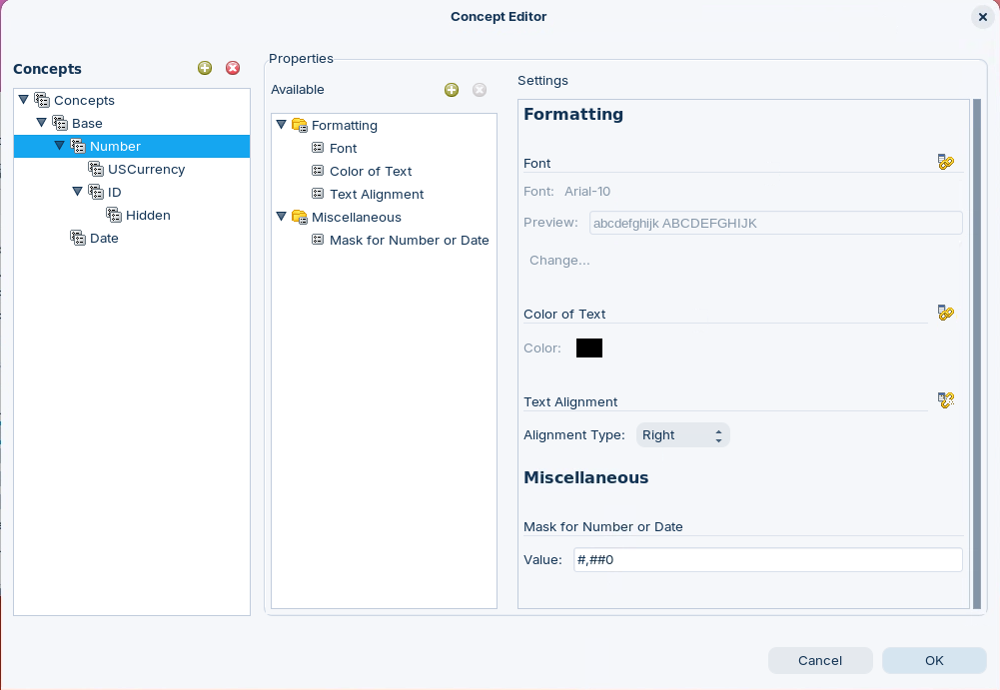<figcaption><p>Concept Editor</p></figcaption></figure>

***

1. Start Metadata Editor:

> **Note:**
>
> #### Windows (PowerShell)
>
> ```powershell
> cd \
> cd Pentaho/design-tools/metadata-editor/
> ./metadata-editor.bat
> ```

> **Note:**
>
> #### Linux
>
> ```bash
> cd
> cd Pentaho/design-tools/metadata-editor/
> ./metadata-editor.sh
> ```

2. Start the Pentaho Server (not required if using Pentaho Labs):

> **Note:**
>
> #### Windows (PowerShell)
>
> ```powershell
> cd \
> cd Pentaho/server/pentaho-server
> ./start-pentaho.bat
> ```

> **Danger:**
>
> #### Linux
>
> ```bash
> cd
> cd /opt/pentaho/server/pentaho-server
> sudo ./start-pentaho.sh
> ```

<button data-launch="metadata-editor">Open Metadata Editor</button>

Follow the guide to define and apply Concepts:

:::: tabs

### 1. Define Concepts

> **Note:**
>
> #### Define Concepts
>
> In the OrderStarCustomer workshop, Concepts are reusable bundles of metadata properties that standardize how data is formatted and displayed across the metadata domain without requiring repetitive property configuration for each individual column.
>
> This inheritance-based approach ensures consistent formatting across all reports generated from the metadata domain, automatically applying currency symbols, decimal places, thousand separators, and date formats whenever users create reports, while minimizing redundant property definitions and ensuring organizational standards are maintained throughout the BI environment.

<div class="pcm-embed-card" data-href="https://www.loom.com/share/c53a49ad5f204a29818000b69e47f7c8?hideEmbedTopBar=true&amp;hide_share=true&amp;hide_title=true&amp;sid=c43fa08d-06b6-4b14-8658-993775337ca4?hide_owner=true" data-title="Creating and Applying Metadata Concepts for Business Objects 💻" data-description="In this video, I demonstrate how to create and apply metadata concepts for formatting business columns, specifically for numbers, currency, and dates. I walk you through accessing the Concept Editor, where I start by modifying the base concept to create a number concept with right alignment and comma formatting. Next, I create a currency concept inheriting from the number concept, adding a dollar sign and two decimal places. Finally, I establish a date concept with a specific Java date format. Please be prepared to apply these concepts to the business columns in the next demonstration." data-thumb="../_assets/embeds/125979ecbc12.png"></div>
1. Choose File > Open from the menu options, choose OrderStarMetadata in the Select a Domain dialog and click OK.
2. From the menu options, choose Tools > Concept Editor.
3. Click Base.
4. Click Add Concept button.

#### Numeric

> **Note:**
>
> #### Numeric
>
> Using the Concept Editor, a hierarchy of parent concepts including Number (with mask #,##0 and right alignment).

1. In the New Concept dialog, type Number and click OK.

<figure>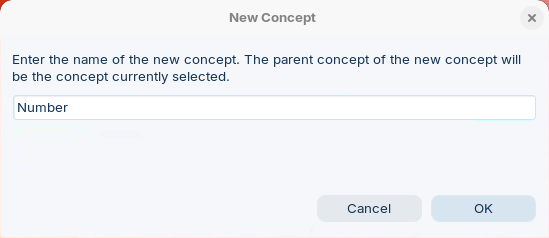<figcaption><p>New Concept</p></figcaption></figure>

2. In the Concepts pane, click Number.
3. In the Properties section, for Available, click the Add Properties button. 
4. In the Add a defined property pane, scroll to Miscellaneous and select Mask for Number or Date.

<figure>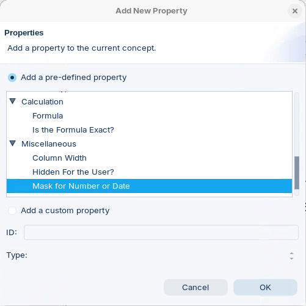<figcaption><p>Add Mask Property</p></figcaption></figure>

5. Click OK.
6. In the Available pane, select Miscellaneous > Mask for Number or Date.

<figure>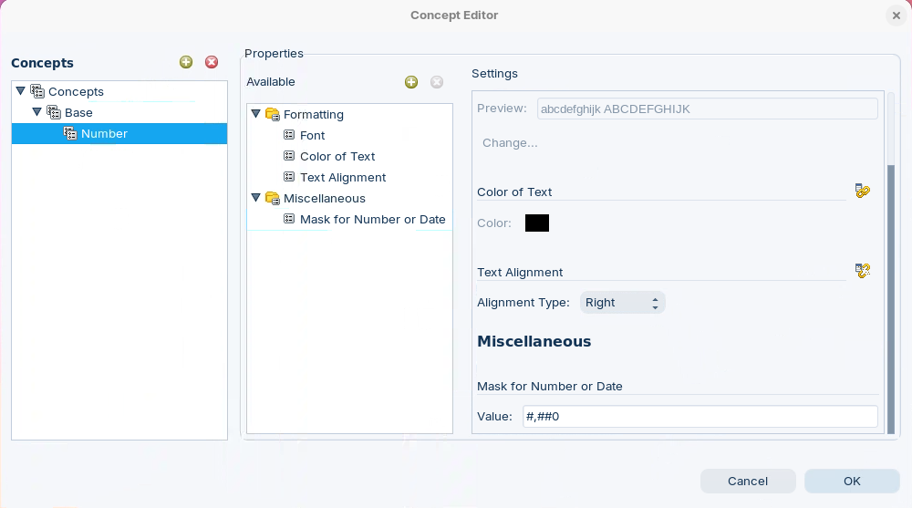<figcaption><p>Set Text Alignment &#x26; Mask</p></figcaption></figure>

7. For Text Alignment, for Alignment Type, click the Override icon, and then choose Right. In the Value field, type: #,##0

#### Currency

> **Note:**
>
> #### Currency
>
> Using the Concept Editor, a hierarchy of parent concepts including USCurrency (inheriting from Number with mask $#,##0.00;($#,##0.00)).

1. Expand Concepts > Base and click Number.
2. Click Add Concept button. 
3. In the New Concept dialog, type USCurrency and click OK.
4. In the Concepts pane, click USCurrency.
5. In the Available pane, select Mask for Number or Date.
6. In the Miscellaneous section, for Mask for Number or Date, click the Override button.
7. Change the Value to: $#,##0.00;($#,##0.00).

<figure>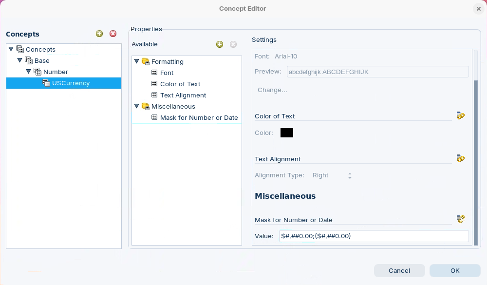<figcaption><p>Set Currency Mask</p></figcaption></figure>

#### ID

> **Note:**
>
> #### ID
>
> Using the Concept Editor, a hierarchy of parent concepts including ID (with mask # and no decimal places) & Hidden (marking fields as hidden from users).

<figure>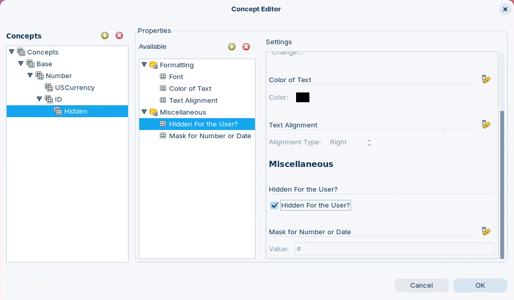<figcaption><p>Set Number mask &#x26; Hidden</p></figcaption></figure>

1. Expand Concepts > Base and click **Number**.
2. Click Add Concept button. 
3. In the New Concept dialog, type ID and click OK.
4. In the Concepts pane, click ID.
5. In the Available pane, click Miscellaneous > Mask for Number or Date.
6. In the Settings pane, in the Miscellaneous section, click the Override icon.
7. For Mask for Number or Date, in the Value field, type #.
8. In the Concepts pane, select ID and click New Concept. 
9. In the New Concept dialog, type Hidden and click OK.
10. In the Concepts pane, select Hidden.
11. In the Available pane, click Add New Property button. 
12. In the Add New Property dialog, scroll to Miscellaneous and select Hidden For the User?

<figure>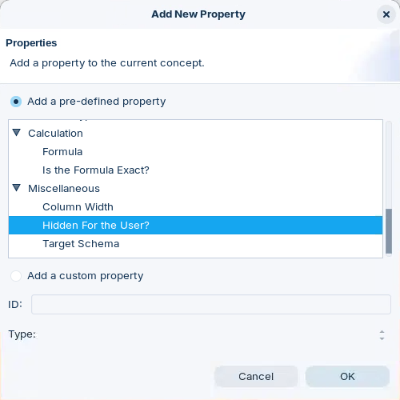<figcaption></figcaption></figure>

13. Click OK.
14. In the Available pane, click Miscellaneous > Hidden For the User?
15. In the Settings pane, check Hidden For the User?

> **Note:**
>
> You now have three defined concepts that can be used anywhere in your business model. Each concept serves a different type of business object:
>
> * Base for default, generic columns,
> * Number for those columns you know contain numeric financial data, and
> * ID for ID columns (the value is hidden from the user).

#### Date

> **Note:**
>
> #### Date
>
> Using the Concept Editor, a hierarchy of parent concepts including Date (with mask MM-dd-yyyy).

<figure>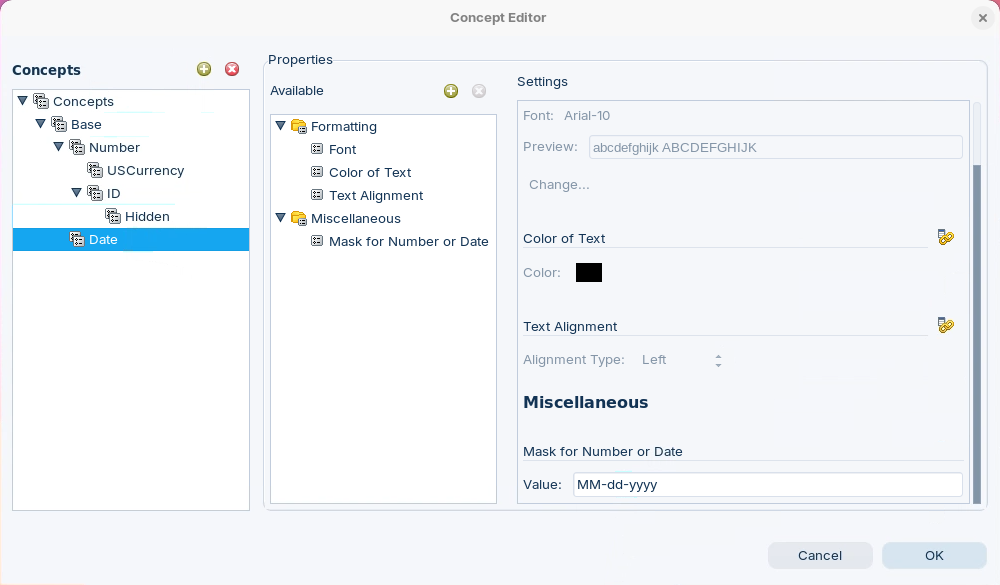<figcaption><p>Set Mask for Date</p></figcaption></figure>

1. From the menu options, choose Tools > Concept Editor.
2. In the Concepts pane, click **Base**.
3. Click Add Concept button. 
4. In the New Concept dialog, type Date and click OK.
5. In the Concepts pane, select Date.
6. In the Properties section, for Available, click the Add Properties button.
7. In the Add a defined property pane, scroll to Miscellaneous and select Mask for Number or Date.
8. Click OK.
9. In the Available pane, click Mask for Number or Date.
10. In the Settings pane, for Mask for Number or Date, type: MM-dd-yyyy.
11. Click OK and save your work.

### 2. Apply Concepts

> **Note:**
>
> #### Apply Concepts
>
> These concepts are then applied to business columns in the Business View by right-clicking columns and selecting "Set Parent Concept"- for example, assigning the USCurrency concept to Price Sold and Total columns, the Number concept to Quantity Ordered, the Date concept to Order Date, Shipped Date, and Required Date, and the ID concept to Order Number.

<div class="pcm-embed-card" data-href="https://www.loom.com/share/c076e434bfad4b5e9c63e7bf2dca9ca2?hideEmbedTopBar=true&amp;hide_share=true&amp;hide_title=true&amp;sid=a323e4f4-9cf0-4441-8e64-2ed8174abbbe?hide_owner=true" data-title="Applying Concepts to Business Columns in Data Management" data-description="In this demonstration, I applied concepts for numbers, currency, and dates to various business columns. I assigned the number concept to the quantity ordered, the currency concept to the price sold and total price columns, and the date concept to the order date. I also applied the currency concept to the total column. The remaining columns utilize the base concept, and I am now finished with applying concepts. In the next demonstration, I will use the query editor to test this metadata domain, so please stay tuned for that." data-thumb="../_assets/embeds/125979ecbc12.png"></div>
***

Follow the guide to set and apply the Concepts:

#### Orders

> **Note:**
>
> #### Orders
>
> In the Orders category of the OrderStarCustomer metadata domain, parent concepts are systematically assigned to each column to ensure consistent formatting and display behavior across all reports.
>
> The ID concept is applied to Order Number to format it as a whole number identifier without decimal places. Quantity Ordered receives the Number concept, which applies right-aligned formatting with thousand separators (#,##0).
>
> Financial columns Price Sold, Total Price, and Total are assigned the USCurrency concept, ensuring they display with dollar signs, two decimal places, and proper formatting for negative values ($#,##0.00;($#,##0.00)).
>
> The three date columns—Order Date, Required Date, and Shipped Date—are assigned the Date concept to standardize their display format as MM-dd-yyyy.
>
> This systematic application of parent concepts eliminates the need to configure formatting properties individually for each column and ensures that whenever users create reports using the OrdersStarCustomer data source, all numeric values display with thousand separators, currency values show proper dollar formatting, dates appear in consistent MM-dd-yyyy format, and identifiers display as whole numbers without decimals.

<figure>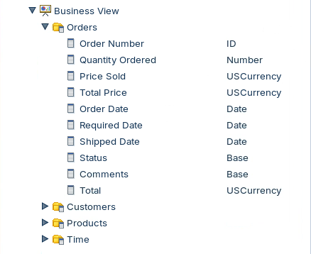<figcaption><p>Set Orders Concepts</p></figcaption></figure>

1. In Metadata Editor, expand Business Models > OrdersStarCustomer > Business View > Orders.
2. Right-click Order Number and choose Set Parent Concept.

<figure>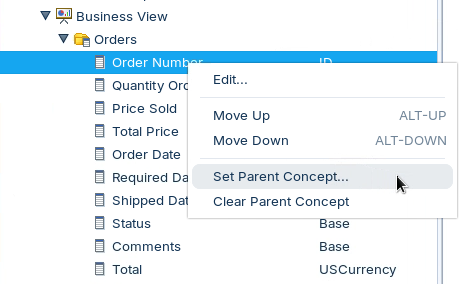<figcaption><p>Set Parent Concept - ID</p></figcaption></figure>

3. In the Select a Parent Concept dialog, choose ID and click OK.

<figure>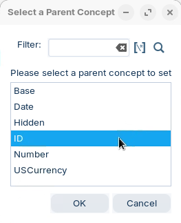<figcaption><p>Select ID Concept</p></figcaption></figure>

***

1. Right-click Quantity Ordered and choose Set Parent Concept.
2. In the Select a Parent Concept dialog, select Number.
3. Click OK.

***

1. Right-click Price Sold and choose Set Parent Concept.
2. In the Select a Parent Concept dialog, select USCurrency and click OK.
3. Right-click Total Price and choose Set Parent Concept.
4. In the Select a Parent dialog, select USCurrency and click OK.

***

1. Right-click Order Date and choose Set Parent Concept.
2. In the Select a Parent Concept dialog, choose Date and click OK.
3. Right-click Required Date and choose Set Parent Concept.
4. In the Select a Parent Concept dialog, choose Date and click OK.
5. Right-click Shipped Date and choose Set Parent Concept.
6. In the Select a Parent Concept dialog, choose Date and click OK.

***

1. Right-click Total and choose Set Parent Concept.
2. In the Select a Parent Concept dialog, choose USCurrency and click OK.

#### Customers

> **Note:**
>
> #### Customers
>
> The majority of customer attributes—including Customer Name, Phone, all address fields (Address Line 1, Address Line 2, City, State, Postal Code, Country), Credit Limit, Territory, and Contact Name—are assigned the Base concept, which provides default metadata properties without specialized formatting masks.
>
> The notable exception is Employee Number (Sales Rep Employee Number), which is assigned the Hidden concept, a child of the ID concept that not only formats the value as a whole number identifier but also marks the field as "Hidden For the User," preventing it from being visible in standard report interfaces.
>
> This approach reflects that customer dimension data consists primarily of text fields that require standard display formatting, with only the sales representative employee identifier needing special handling to hide internal reference numbers from end users while maintaining proper numeric formatting when the field is accessed programmatically.

<figure>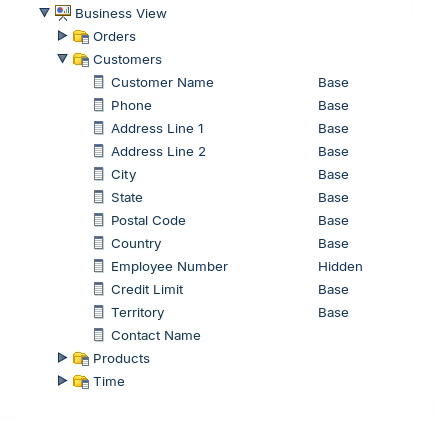<figcaption><p>Hidden Concept</p></figcaption></figure>

1. In the Business View, expand Customers.
2. Right-click Employee Number and choose Set Parent Concept.
3. In the Select a Parent Concept dialog, choose Hidden and click OK.
4. Verify your work and save your changes.

#### Products

> **Note:**
>
> #### Products
>
> The majority of product attributes—Product Name, Product Line, Product Scale, Product Vendor, and Product Description—are assigned the Base concept, providing standard metadata properties without specialized formatting since these are descriptive text fields.
>
> The two pricing fields are assigned the USCurrency concept: Buy Price (wholesale or cost basis) and MSRP (Manufacturer's Suggested Retail Price) both receive currency-specific formatting with dollar signs, two decimal places, and proper negative value handling ($#,##0.00;($#,##0.00)).
>
> This approach ensures that product dimension data displays with appropriate formatting for financial analysis and pricing strategy while maintaining simple text display for descriptive product attributes, allowing users to perform margin analysis and pricing comparisons with consistent, professionally formatted currency values across all reports.

<figure>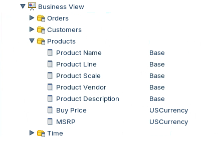<figcaption></figcaption></figure>

1. In the Business View, expand Products.
2. Right-click Buy Price and choose Set Parent Concept.
3. Select USCurrency and click OK.
4. Right-click MSRP and choose Set Parent Concept.
5. Select USCurrency and click OK.
6. Verify your work and save your changes.

### 3. Publish

> **Note:**
>
> #### Publish OrdersStarCustomer Model
>
> The final step is to publish the metadata domain to the BI server for use as a data source in the reporting tools.

<figure>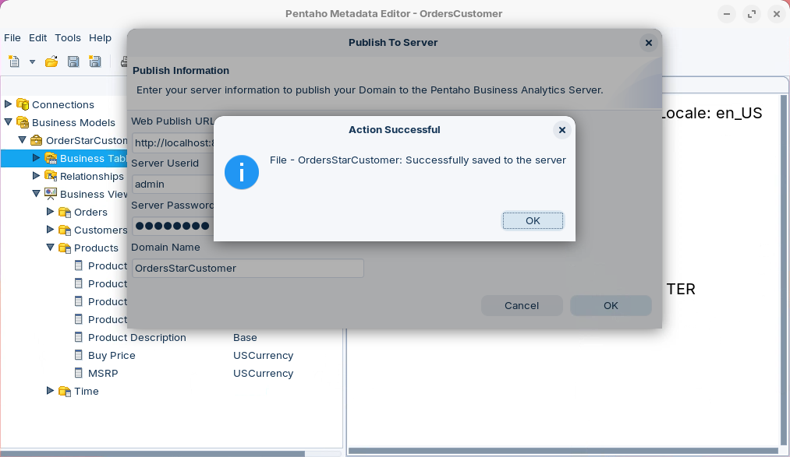<figcaption><p>Publish - OrdersStarCustomer</p></figcaption></figure>

1. Save the metadata domain by choose File > Save from the menu options or by clicking the Save icon.
2. From the menu, choose File > Publish To Server.
3. In the Publish To Server dialog, type or choose the following, and then click OK.

| Field | Value |
| --- | --- |
| Web Publish URL | http://localhost:8080/pentaho/plugin/dataaccess/api/metadata/import |
| Server UserID | admin |
| Server Password | password |
| Domain Name | OrdersStarCustomer |

### 4. Interactive Report

> **Note:**
>
> #### Interactive Report
>
> The final test is to create a test Interactive Report and check the Concepts have been successfully applied.

<button data-launch="puc">Open Pentaho User Console</button>

1. Maximize the User Console browser window.
2. From the Home Perspective, click Create New > Interactive Report.
3. In the Select Data Source dialog, choose OrdersStarCustomer and click OK.

<figure>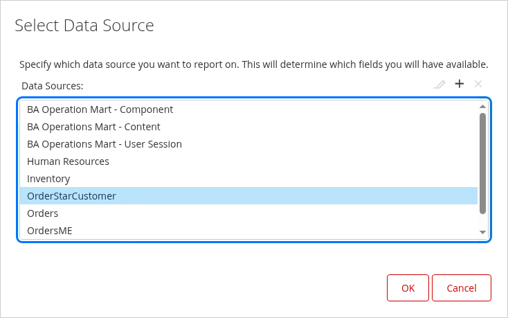<figcaption><p>Data Source - OrdersStarCustomer</p></figcaption></figure>

***

Create Interactive Report:

<figure>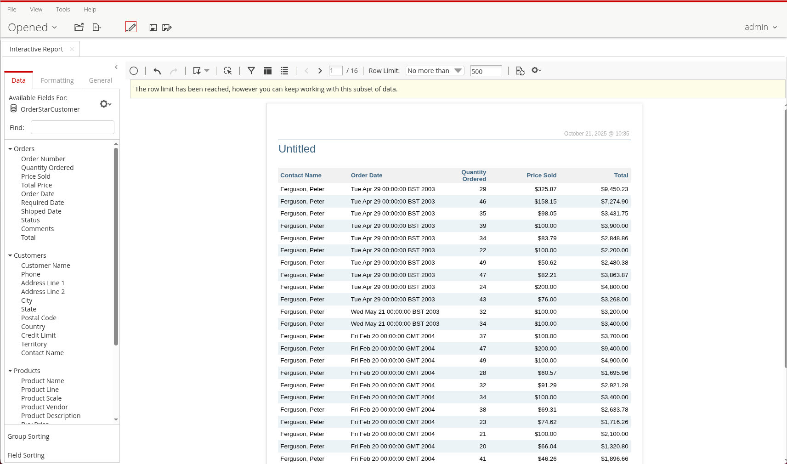<figcaption><p>Test Interactive Report</p></figcaption></figure>

> **Note:**
>
> The Categories and Columns created during the workshop are reflected in the layout.
> Employee Number does not appear in the Customers category - applied Hidden concept.

1. To add Quantity Ordered, on the Data tab, double-click Quantity Ordered. Quantity Ordered is formatted using the Number concept.
2. To add Price Sold, on the Data tab, double-click Price Sold. Price Sold is formatted using the USCurrency concept.
3. To add Total, on the Data tab, double-click Total. Confirm the calculation of the Total column (Quantity Ordered * Price Sold).
4. To add Order Date, on the Data tab, double-click Order Date. Order Date is formatted using the Date concept.
5. To add Required Date, on the Data tab, double-click Required Date. Required Date is not formatted using the Date concept. This is because we did not change the Data Type for the Required Date (as for Order Date), so it is still being treated as a string. The Mask for Number or Date property can only be applied to numeric or date data types.
6. To add Contact Name, on the Data tab, double-click Contact Name. Verify the formula for the Contact Name.
7. Close the Interactive Report tab. It is not necessary to save.

> **Success:** Your Concepts have been applied successfully. The Interactive Report displays each column with the formatting inherited from its parent Concept—Number, USCurrency, ID, and Date—and the Employee Number field is hidden via the Hidden concept.

::::

## Lab Files

- [OrderStarCustomer.xmi](../_assets/files/OrderStarCustomer.xmi)
