# Row-Level Security

> **Warning:**
>
> #### Workshop - Security & Data Access
>
> Publishing metadata domains to production environments requires more than just creating business-friendly semantic layers—you must ensure that sensitive data remains protected and that users only access information appropriate to their roles and responsibilities. Pentaho's metadata security framework provides comprehensive protection mechanisms including model-level access controls, column-level field restrictions, and row-level data filtering, all enforced automatically within the metadata layer without requiring complex database views or application-level security logic.
>
> In this hands-on workshop, you'll build the OrdersStarCustomer metadata domain and then systematically apply multiple layers of security constraints to protect sensitive business information. You'll configure the Metadata Editor to communicate with Pentaho Server's security service, implement column-level restrictions to hide financial data from unauthorized users, and create row-level security rules that automatically filter data based on user roles and territories. This comprehensive approach demonstrates how metadata-driven security creates consistent, maintainable data protection across your entire BI platform.
>
> **What you'll do**
>
> * Configure the Metadata Editor security service to connect with Pentaho Server's user and role repository
> * Set up Access Control Lists (ACLs) to retrieve usernames, roles, and security constraints
> * Apply model-level security to control which roles can access entire metadata domains
> * Implement column-level security to restrict access to sensitive fields like Credit Limit
> * Configure row-level security using role-based MQL formulas to filter data by territory
> * Understand metadata security inheritance from business models to tables and columns
> * Test security constraints by logging in as different users with varying permissions
> * Publish secured metadata domains and refresh server caches to apply changes
> * Validate that security rules properly restrict data visibility based on user roles
>
> By the end of this workshop, you'll understand how Pentaho's metadata security framework provides layered data protection that's both powerful and maintainable. Rather than creating complex database views for each user role or embedding security logic in individual reports, you'll centralize security rules within your metadata layer where they're automatically enforced across all reporting tools and data access methods. You'll see first-hand how administrators view all data while restricted users like Suzy only see information appropriate to their role and territory - all managed through intuitive metadata properties rather than custom SQL or application code.
>
> **Prerequisites:** Completion of OrdersME and Concepts workshops or access to OrderStarCustomer domain; Pentaho Metadata Editor and Pentaho Server installed and configured; Administrative access to Pentaho Server; Understanding of user roles and security concepts
>
> **Estimated time:** 75 minutes

<figure>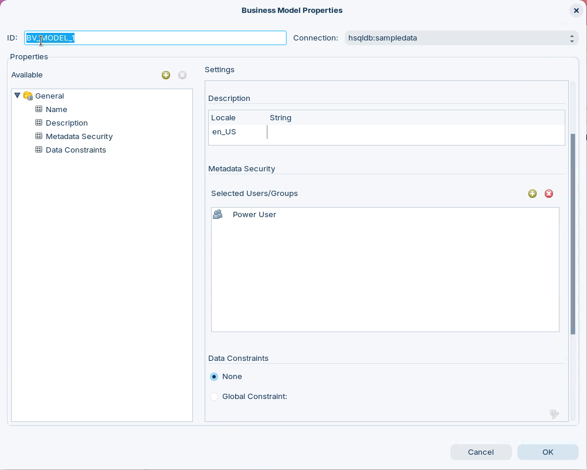<figcaption><p>SecurityOrder - constraints</p></figcaption></figure>

***

1. Start Metadata Editor:

> **Note:**
>
> #### Windows (PowerShell)
>
> ```powershell
> cd \
> cd Pentaho/design-tools/metadata-editor/
> ./metadata-editor.bat
> ```

> **Note:**
>
> #### Linux
>
> ```bash
> cd
> cd Pentaho/design-tools/metadata-editor/
> ./metadata-editor.sh
> ```

2. Start the Pentaho Server (not required if using Pentaho Labs):

> **Note:**
>
> #### Windows (PowerShell)
>
> ```powershell
> cd \
> cd Pentaho/server/pentaho-server
> ./start-pentaho.bat
> ```

> **Danger:**
>
> #### Linux
>
> ```bash
> cd
> cd /opt/pentaho/server/pentaho-server
> sudo ./start-pentaho.sh
> ```

<button data-launch="metadata-editor">Open Metadata Editor</button>

Follow the guide to apply security restrictions:

:::: tabs

### 1. Access Control List & Domains

> **Note:**
>
> #### Access Control List
>
> You must know the base URL for the Pentaho BA Server (the default URL is <http://localhost:8080/pentaho>) as well as the name of the service to execute security information retrieval (the service is ServiceAction).
>
> The Pentaho Metadata Editor must be configured to connect to your BA Server so that it can retrieve usernames, roles, and access control lists. Follow the below directions to set up Metadata Editor.

<figure>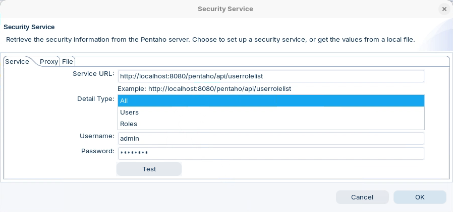<figcaption><p>ACL</p></figcaption></figure>

1. Go to the Tools menu, then select Security. The Security Service dialogue will appear.
2. In the Service URL field, type in the base URL for the BA Server plus the security service.

```
http://localhost:8080/pentaho/api/userrolelist
```

3. Next, select the level of detailed security information you want:

> **Note:**
>
> All
>
> Users
>
> Roles
>
> If you have hundreds of users in your system, you probably only want to return the roles, and use roles for security information properties. The access control lists are returned with all three options.

4. In the Username and Password fields, type:

Username: admin

Password: password

5. Click Test. A popup window with the returned XML should appear.

<figure>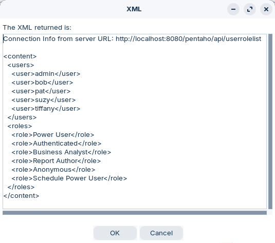<figcaption><p>ACL list</p></figcaption></figure>

***

> **Note:**
>
> #### OrderSecurity
>
> For clarity let's rename the current OrderStarModel to OrderSecurity. Remember its the name of the Business Models that is displayed as the Data Source.

1. Open the OrderStarCustomer.
2. Right-click on Business Models and select: Edit.

<figure>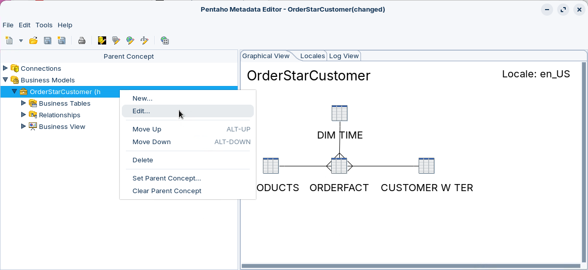<figcaption></figcaption></figure>

3. Name the model `OrderSecurity`
4. Click OK.

***

> **Note:**
>
> #### Offline Access
>
> If you want to work on your model and do not have access to the Pentaho Server, you can save your security information in a file. The Pentaho Metadata Editor retrieves your settings from the file instead of accessing the server every time you open your domain.

1. After you click Test, Copy all the XML between the tags, including content the tags themselves.
2. Paste the XML code into your favourite text editor, and save the file as metadata_security.xml, in a location of your choice.
3. Click the File tab in the Security Service dialog box.
4. Browse to the file that you just saved.
5. Click OK to exit the dialog box.

### 2. Model Access

> **Note:**
>
> #### Model Access
>
> The ACL provides the server with a list of Users and their Roles that is used to define both the Metadata Security (Model, Table, Column, Row) & Data (None, Global, User/Role - MQL) constraints.
>
> The out-of-the-box default security and data constraints enable only the Authenticated Administrator have access to everything.

Follow the guide to enable Suzy to access the OrderStarCustomer Model.

#### 1. Set Properties

> **Note:**
>
> #### Set Properties
>
> As we know, the Business Model is comprised of the Business Tables + Business Views. Any Properties that are set at the Business Model level will be inherited by the Business Tables & Columns.

1. Edit the OrderStarCustomer Model.

<figure>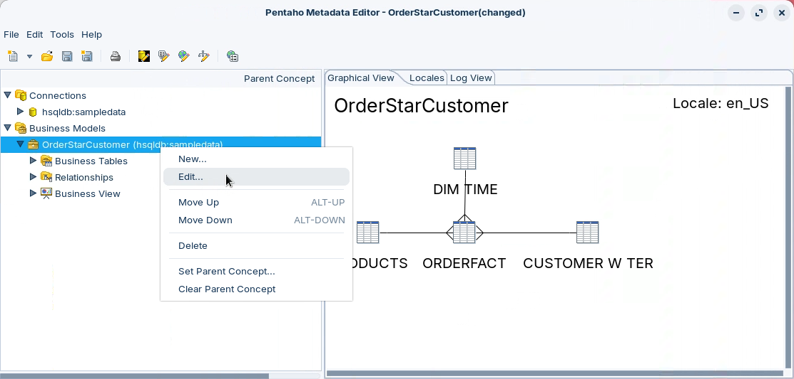<figcaption><p>OrderStarCustomer</p></figcaption></figure>

2. Ensure / Add the Metadata Security & Data Constraints Properties are available.
3. Add Power User Role to Metadata Security.
4. There should be no Data Constraints - None.

<figure>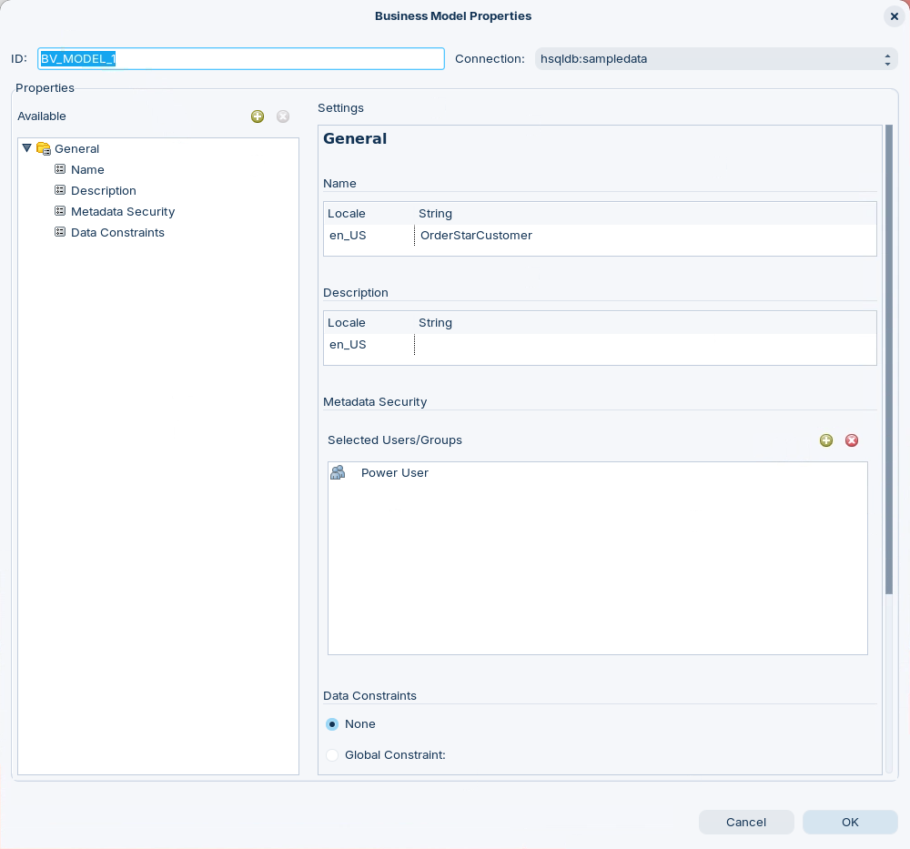<figcaption><p>Set Metadata Security &#x26; Data Constraints Properties</p></figcaption></figure>

5. Click: OK.

> **Note:** Check the Properties have been set for the Business Tables & Columns.

6. In Business Views, double-click on Orders Category.
7. Stop the Metadata Security Override - The Power User Role will appear.

<figure>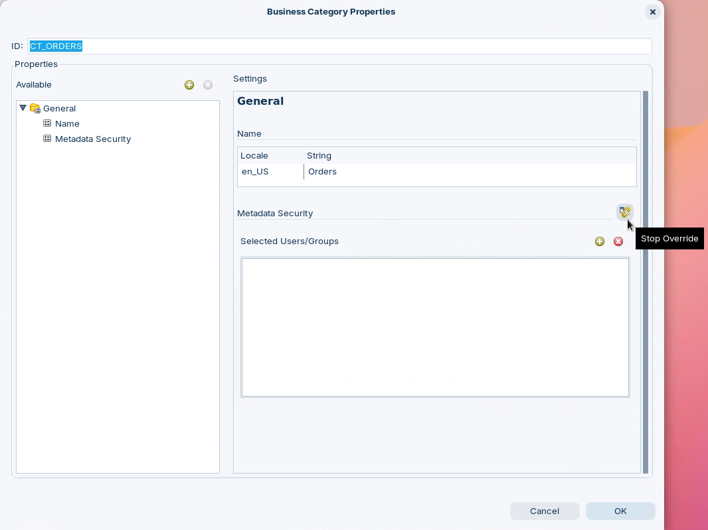<figcaption><p>Override Metadata Security</p></figcaption></figure>

> **Danger:**
>
> #### Business Views
>
> Currently there's a minor bug .. The Metadata Security Property set at the Business Model level is not automatically inherited in the Business View. You need to Stop the Override to set the inherited property.

<figure>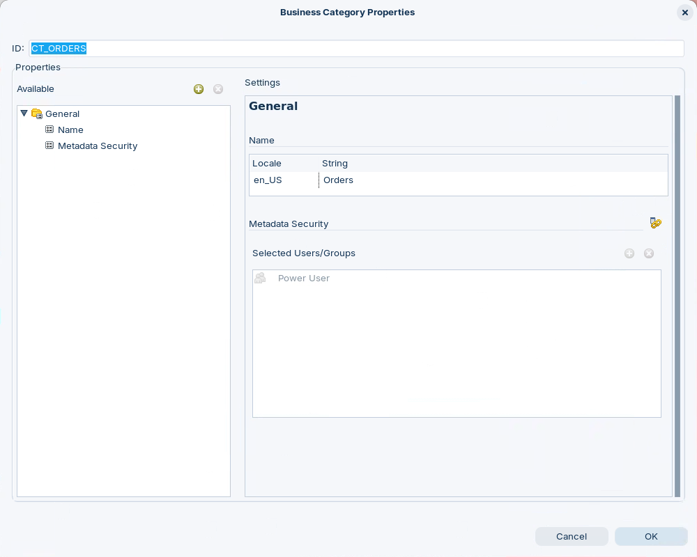<figcaption><p>Metadata Security - Power User</p></figcaption></figure>

8. Click: OK.
9. Repeat for the other Categories:

> **Note:**
>
> Customers
>
> Products
>
> Time

10. Save & Republish the model.

***

> **Note:**
>
> #### Grant Users Access to the Domain - Reference Only
>
> Another method is to grant the access by editing the settings.xml.
>
> By default, only users with the Administrator role can access metadata domains. To allow other users (for example, Suzy in the sample environment) to use OrderStarCustomer as a data source, you must adjust data-access permissions.

1. Stop the Pentaho Server.
2. Navigate to `/pentaho/server/pentaho-server/pentaho-solutions/system/data-access/` and open `settings.xml` in a text editor.
3. Find the following lines:

```xml
<data-access-roles>Administrator</data-access-roles>
<data-access-view-roles>Authenticated,Administrator</data-access-view-roles>
```

4. To allow all authenticated users to access data sources, change them to:

```xml
<data-access-roles>Authenticated</data-access-roles>
<data-access-view-roles>Authenticated</data-access-view-roles>
```

5. Alternatively, to allow specific users, modify:

```xml
<data-access-view-users>suzy,youruser</data-access-view-users>
```

6. Save the file and restart the Pentaho Server.
7. Wait for the server to fully start before proceeding.

#### 2. Refresh Models

> **Note:**
>
> #### Refresh Models
>
> Obviously .. the published models and reporting data are cached to improve the user reporting experience. Next step is to refresh the caches ..

1. Log into the Pentaho Server as Administrator:

<button data-launch="puc">Open Pentaho User Console</button>

2. Select: Tools > Refresh > Reporting Metadata.

<figure>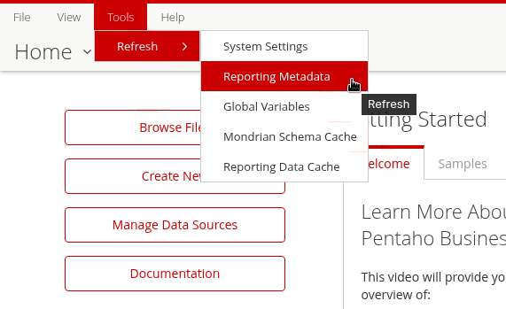<figcaption><p>Refresh Metadata Models</p></figcaption></figure>

3. Click: Ok - confirm models have reloaded.

<figure>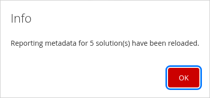<figcaption><p>Metadata Models reloaded</p></figcaption></figure>

4. Log Out and log back in as Suzy.
5. Select: Create New > Interactive Report.

<figure>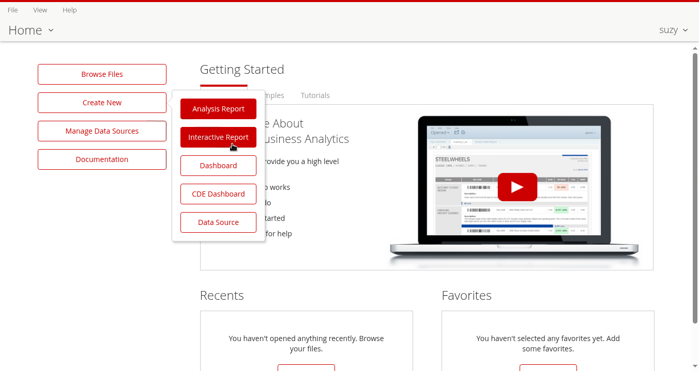<figcaption><p>Interactive Report - Suzy</p></figcaption></figure>

6. Select: OrderStarCustomer Data Source.

<figure>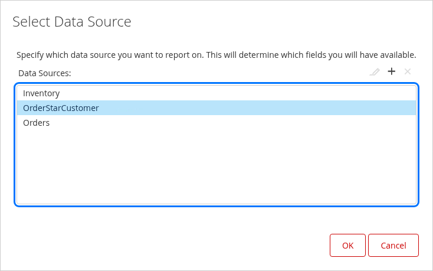<figcaption><p>Data Source - OrderStarCustomer</p></figcaption></figure>

7. Click OK.
8. Drag & Drop: Customers > Territory onto the reporting canvas.

<figure>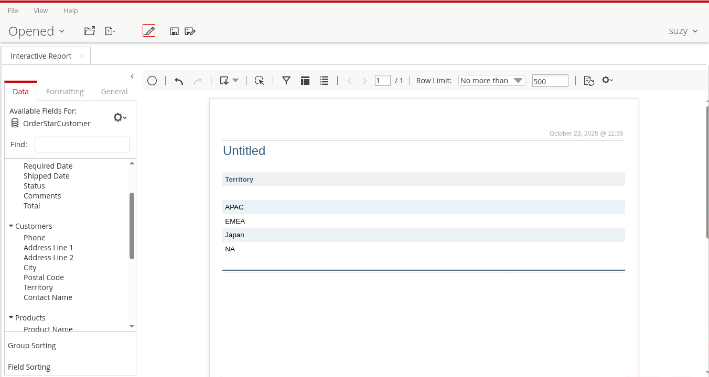<figcaption><p>Interactive Report</p></figcaption></figure>

> **Note:** We're all set to apply some constraints ..

### 3. Column-Level Security

> **Note:**
>
> #### Column-Level Security
>
> Scenario: Column-Level Security for Sensitive Fields
>
> Let's restrict customer account column - `Credit Limit` - so that only the Admin (Finance) roles can view them.
>
> This prevents Sales Reps (Power User Suzy) from seeing credit limits unless authorized.

1. In the left pane, right-click on the **Credit Limit** column under the CUSTOMER W TER business table.
2. Select **Edit.** The Business Column Properties dialog appears.

<figure>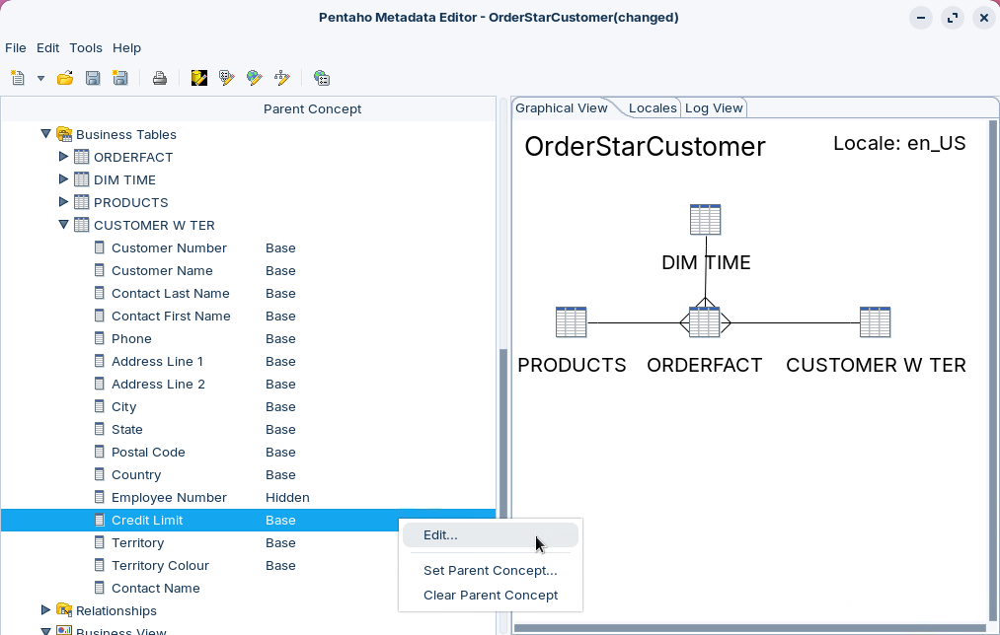<figcaption><p>Edit CUSTOMER W TER - Credit Limit</p></figcaption></figure>

3. Override the **Metadata Security** item.
4. Click the  next to this field in the **Selected Users/Groups** field. A list of users and roles appears.

<figure>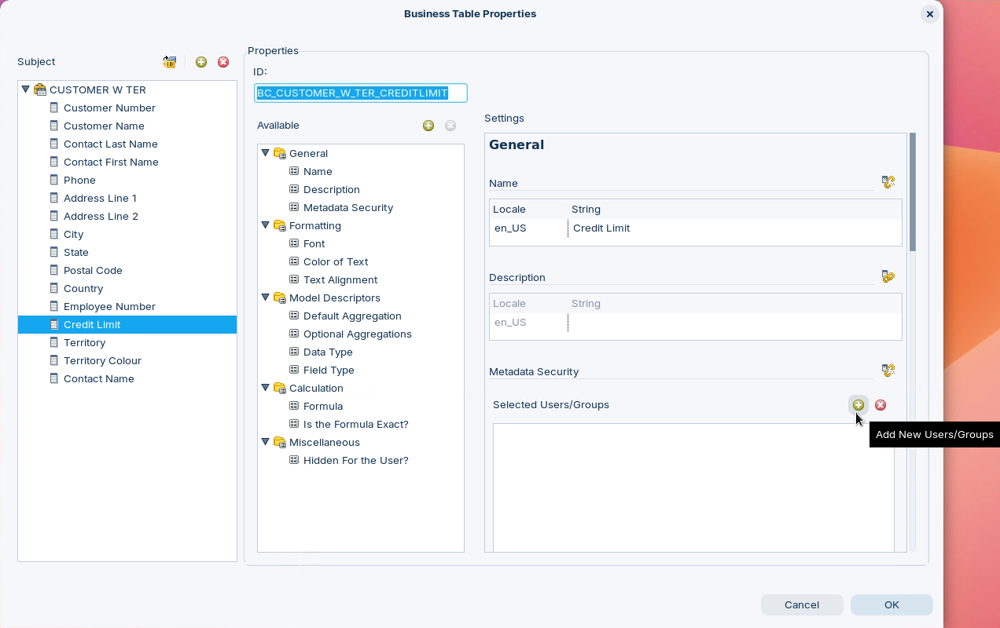<figcaption><p>Override Metadata Security</p></figcaption></figure>

5. Select **Admin** from the Available list.

<figure>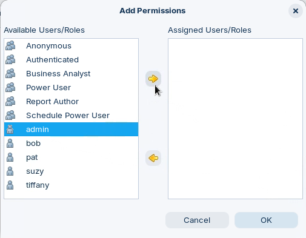<figcaption><p>Select Role / User(s)</p></figcaption></figure>

6. Click the Right Arrow to move Admin to the Assigned list.

<figure>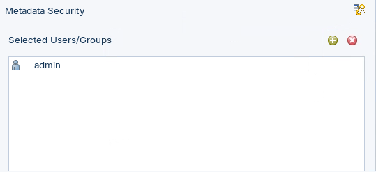<figcaption><p>Add Admin User</p></figcaption></figure>

7. Click OK.
8. Click OK to close the Business Column Properties dialog.

> **Note:** Repeat this process for any other information you wish to restrict.

9. Save & Republish the model.

***

1. Log into the Pentaho Server as Suzy.
2. Create an Interactive Report with OrderStarCustomer as the Data Source.

<figure>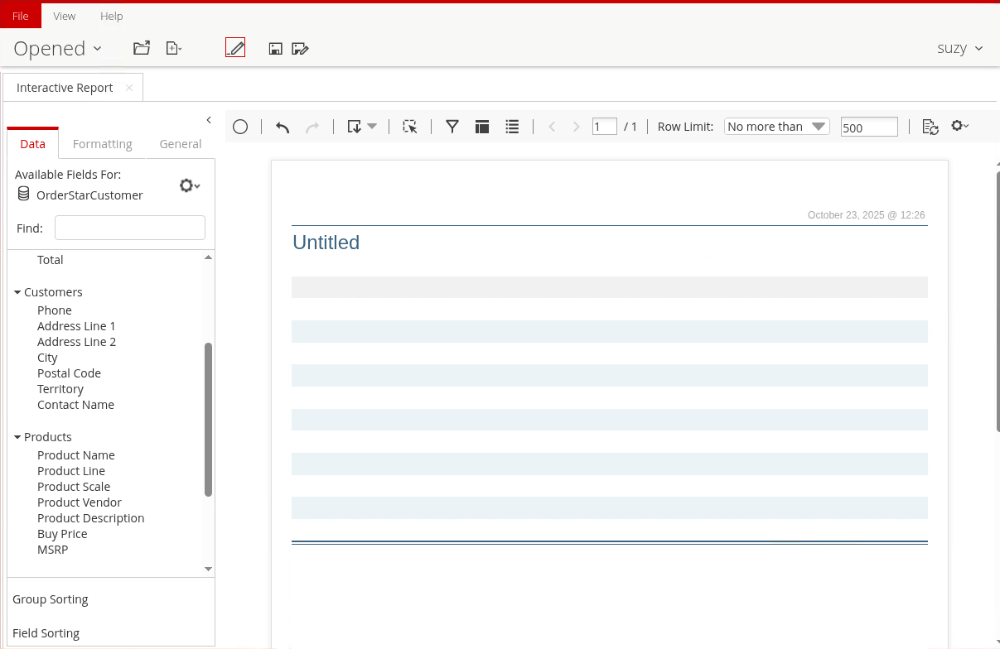<figcaption></figcaption></figure>

> **Note:** Notice: In the Customers Category that the Credit Limit is not displayed. You may have to Refresh the Reporting Metadata - Admin.

### 4. Row-Level Security

> **Note:**
>
> #### Row-Level Security
>
> Row-level security filters data results based on the user's role or department. This allows different users to see different rows from the same table.
>
> **Goal:** Configure security so that user SUZY can only see Customers where Territory = "EMEA". Admin should see all data.

Row-level security is applied as a **Data Constraint** on the business table. The constraint is a role-based MQL formula: when the constraint evaluates to true for the current user's role, the matching rows are returned; the Admin role is left unconstrained so it continues to see all data.

1. Right-click **CUSTOMER W TER** Business Table.
2. Select **Edit**. The Business Table Properties dialog appears.
3. In the Properties list, Override / Add the **Data Constraints** item.
4. In the Data Constraints editor, set the constraint type to **Role Based Security** (MQL).
5. Add a constraint that filters the Territory for the **Power User** role:

```
AND(
  ISNA(MATCH("Admin"; ROLES(); 0));
  [CUSTOMER_W_TER.BC_CUSTOMER_W_TER_TERRITORY] = "EMEA"
)
```

> **Note:**
>
> #### How the formula works
>
> * `ROLES()` returns the list of roles for the logged-in user.
> * `ISNA(MATCH("Admin"; ROLES(); 0))` is true only when the user is **not** an Admin — so the row filter is applied to everyone except Admin.
> * `[CUSTOMER_W_TER.BC_CUSTOMER_W_TER_TERRITORY] = "EMEA"` keeps only the rows where Territory equals EMEA.
>
> The result: Admin sees every row; the Power User (Suzy) sees only EMEA customers.

6. Click OK to apply the constraint.
7. Save & Republish the model.

> **Danger:**
>
> #### Refresh the Reporting Metadata
>
> Remember to refresh the Reporting Metadata cache (Tools > Refresh > Reporting Metadata) after republishing, otherwise the server serves the old, unsecured model.

***

Test the row-level security by logging in as each user:

1. Log into the Pentaho Server as **Admin** and create an Interactive Report with OrderStarCustomer as the Data Source. Drag **Customers > Territory** onto the canvas — all territories are visible.

<button data-launch="puc">Open Pentaho User Console</button>

2. Log out, then log back in as **Suzy** (Power User) and create the same Interactive Report. Only **EMEA** rows are returned.

> **Note:** Because the constraint lives in the metadata layer, the same row filter is enforced automatically across every reporting tool that consumes the OrderStarCustomer domain — no per-report SQL or database views required.

::::

## Lab Files

- [SecurityOrder constraints](../_assets/data/security-order-constraints.txt)
