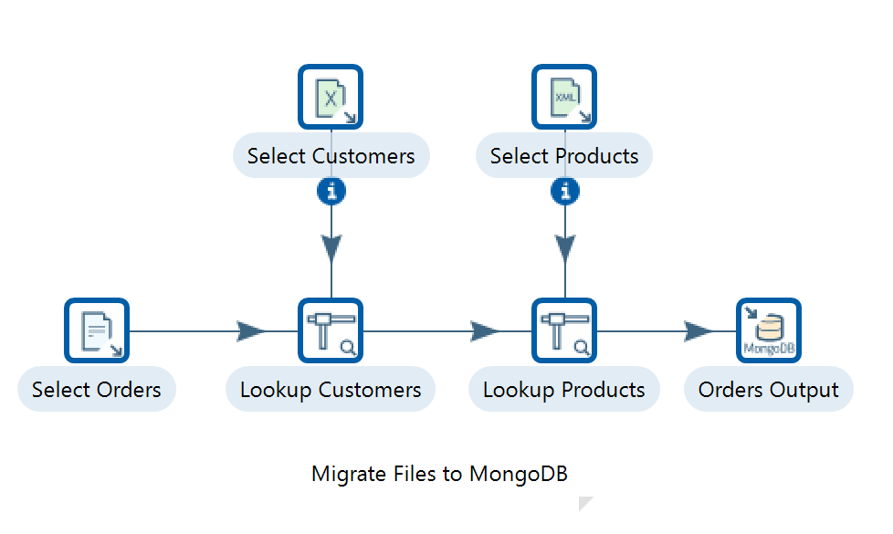
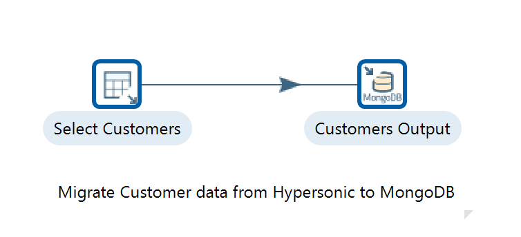

# MongoDB Reports

> **Warning:**
>
> #### Workshop - MongoDB Reports
>
> Steel Wheels Inc has customer order information stored in a MongoDB. To make the use case more interesting, you'll build a few pipelines in Pentaho Data Integration that load files and migrate tables into a MongoDB running in Docker, and then surface that document data through Pentaho's reporting tools.
>
> With **Pentaho Interactive Reporting** the process starts by establishing the MongoDB connection. You can create reports by dragging and dropping fields from your MongoDB collections directly onto the report canvas, but you first need a metadata layer that translates MongoDB's document structure into a relational-style format Pentaho can work with - defining how nested documents and arrays are represented.
>
> With **Pentaho Analyzer** you set up the MongoDB data connection in the Pentaho Server by configuring the MongoDB connector, then create a Mondrian schema that maps your MongoDB collections and fields to a multidimensional model. The schema defines the dimensions, measures, and hierarchies based on your MongoDB data structure.
>
> For both reporting tools, performance optimisation matters when working with MongoDB: create appropriate indexes to support your reporting queries, structure your aggregation pipelines for efficient retrieval, and consider using MongoDB's aggregation framework to pre-aggregate data for complex reports.
>
> **What you'll do**
>
> * Build a PDI transformation that loads data from filesystem files into a MongoDB collection
> * Build a PDI transformation that migrates SteelWheels RDBMS tables into MongoDB
> * Configure the Table Input and MongoDB Output steps, including the Mongo document fields mapping
> * Use the MongoDB Input step with the MongoDB aggregation framework to pre-aggregate data
> * Connect Schema Workbench to MongoDB and start a Mondrian schema with a Date dimension for Analyzer
>
> **Prerequisites:** Pentaho Server and Pentaho Data Integration installed and running; a MongoDB instance (running in Docker); access to the SteelWheels sample database; basic familiarity with PDI transformations and Mondrian schemas
>
> **Estimated time:** 60 minutes

***

> **Note:** Steel Wheels Inc has customer order information stored in a MongoDB. This workshop loads sample data into MongoDB with Pentaho Data Integration, then reports on it with Pentaho's reporting tools.

> **Note:**
>
> #### Reporting on MongoDB
>
> **Pentaho Interactive Reporting** - the process starts with establishing the MongoDB connection. You create reports by dragging and dropping fields from your MongoDB collections directly onto the report canvas, after first creating a metadata layer that translates MongoDB's document structure into a relational-style format Pentaho can work with.
>
> **Pentaho Analyzer** - you set up the MongoDB data connection in the Pentaho Server by configuring the MongoDB connector, then create a Mondrian schema that maps your MongoDB collections and fields to a multidimensional model that Analyzer can understand.

<button data-launch="puc">Open Pentaho User Console</button>

:::: tabs

### 1. Data Integration

> **Note:**
>
> #### Data Integration
>
> To make the use case more interesting, you'll create a few pipelines in Pentaho Data Integration that load files and migrate tables into a MongoDB running in Docker.

#### File

> **Note:** For this option you'll create a transformation that loads data from different files in your filesystem, and then loads them into a MongoDB collection. Each file contains a key you can use to join data in PDI before sending it to the MongoDB Output step.

> **Note:**
>
> #### Linux
>
> Ensure the Pentaho Server is up and running:
>
> ```bash
> cd
> cd /opt/pentaho/server/pentaho-server/
> sudo ./start-pentaho.sh
> ```
>
> Ensure Pentaho Data Integration is up and running:
>
> ```bash
> cd
> cd ~/Pentaho/design-tools/data-integration
> ./spoon.sh
> ```

***

**Create a New Transformation**

<figure><figcaption><p>Files</p></figcaption></figure>

1. Select the **Design** tab in the left-hand-side view.

#### RDBMS

> **Note:** In this transformation you'll transfer data from a sample RDBMS to a MongoDB database. The sample data is called **SteelWheels** and is available in the Pentaho Server, running on the Hypersonic Database Server.

> **Note:**
>
> #### Linux
>
> Ensure the Pentaho Server is up and running. The Hypersonic Database Server - SteelWheels - is an embedded service:
>
> ```bash
> cd
> cd /opt/pentaho/server/pentaho-server/
> sudo ./start-pentaho.sh
> ```
>
> Ensure Pentaho Data Integration is up and running:
>
> ```bash
> cd
> cd ~/Pentaho/design-tools/data-integration
> ./spoon.sh
> ```

***

**Create a New Transformation**

<figure><figcaption><p>Transformation - Migrate HSQLDB to MongoDB</p></figcaption></figure>

> **Note:** The Table Input step reads information from a connected database using SQL statements. Basic SQL statements can be generated automatically by clicking the **Get SQL select statement** button.

1. Select the **Design** tab in the left-hand-side view.
2. From the **Input** category folder, find the **Table Input** step and drag and drop it into the working area in the right-hand-side view.
3. Double-click on the Table Input step to open the configuration dialog.
4. Set the **Step Name** property to `Select Customers`.

> **Note:** Before you can get any data from the SteelWheels Hypersonic database, you'll have to create a JDBC connection to it.

1. Click on the **New** button next to the Database Connection pulldown. This opens the Database Connection dialog.
2. Enter the connection details for the SteelWheels Hypersonic database.
3. Test the connection by clicking the **Test** button at the bottom of the dialog. You should get a message similar to *Connection Successful*. If not, double-check your connection details.
4. Click **OK** to return to the Table Input step.
5. Now that you have a valid connection, you can get a list of customers from the SteelWheels database. Copy and paste the following SQL into the query text area:

```sql
SELECT * FROM CUSTOMERS
```

6. Click the **Preview** button and you'll see a table of customer details.

***

> **Note:** This step writes data to a MongoDB collection.

1. Under the **Design** tab, from the **Big Data** category folder, find the **MongoDB Output** step and drag and drop it into the working area in the right-hand-side view.
2. Create a hop from the Table Input step to the MongoDB Output step.
3. Double-click on the MongoDB Output step.
4. Enter the MongoDB Output connection details.
5. Define the MongoDB document structure - select the **Mongo document fields** tab.
6. Click the **Get fields** button, and the fields list is populated with the SteelWheels database fields in the ETL stream.
7. By default the column names in the SteelWheels database are uppercase. In MongoDB these field names should be in camel case. You can manually edit the MongoDB document paths in this section. Make sure the **Use Field Name** option is set to **No** for each field.
8. Click **Preview document structure** to see an example of what the document will look like when inserted into the MongoDB Customers collection.
9. Click **OK** to finish the MongoDB Output configuration.

***

**RUN** the transformation.

#### MongoDB Aggregation

> **Note:** Just for interest, let's explore using the MongoDB aggregation framework in the MongoDB Input step. You'll create a simple example to get data from a collection and see how to take advantage of the MongoDB aggregation framework to prepare data for the PDI stream.

> **Note:**
>
> #### Linux
>
> Ensure the Pentaho Server is up and running. The Hypersonic Database Server - SteelWheels - is an embedded service:
>
> ```bash
> cd
> cd /opt/pentaho/server/pentaho-server/
> sudo ./start-pentaho.sh
> ```
>
> Ensure Pentaho Data Integration is up and running:
>
> ```bash
> cd
> cd ~/Pentaho/design-tools/data-integration
> ./spoon.sh
> ```

***

**Create a New Transformation**

1. Select the **Design** tab in the left-hand-side view.
2. From the **Big Data** category folder, find the **MongoDB Input** step and drag and drop it into the working area in the right-hand-side view.
3. Double-click on the step to open the MongoDB Input dialog.
4. Set the step name to `Select 'Baane Mini Imports' Orders`.
5. Select the **Input options** tab. Click **Get DBs** and select the **SteelWheels** option for the Database field. Next, click **Get collections** and select the **Orders** option for the Collection field.
6. Select the **Query** tab and check the **Query is aggregation pipeline** option. In the text area, write the following aggregation query:

```javascript
[
 { $match: {"customer.name" : "Baane Mini Imports"} },
 { $group: {"_id" : {"orderNumber": "$orderNumber",
 "orderDate" : "$orderDate"}, "totalSpend": { $sum: "$totalPrice"} } }
]
```

7. Uncheck the **Output single JSON field** option.
8. Select the **Fields** tab.
9. Click the **Get Fields** button and you'll get a list of fields returned by the query.
10. Preview your data by clicking the **Preview** button.
11. Click **OK** to finish configuring this step.
12. Add a **Dummy** step to the stream. This step does nothing, but it lets you select a step to preview your data. Add the Dummy step from the **Flow** category to the workspace and name it `OUTPUT`.
13. Create a hop between the **Select 'Baane Mini Imports' Orders** step and the **OUTPUT** step.
14. Select the **OUTPUT** dummy step and preview the data.

### 2. Analyzer Reports

> **Note:**
>
> #### Analyzer Reports
>
> To 'slice and dice' the dataset you'll create OLAP (Online Analytical Processing) schemas for Pentaho based on MongoDB. Pentaho uses the ROLAP (Relational Online Analytical Processing) engine, called by Mondrian, to convert MDX (Multidimensional Expressions) queries into SQL queries.
>
> Let's start with a Mondrian 3.x schema using Schema Workbench. You'll first create a shared `date` dimension. A shared dimension can be referenced in different cubes; in this particular case it's not strictly necessary because there's just one cube.

<button data-launch="metadata-editor">Open Metadata Editor</button>

#### Date

> **Note:**
>
> #### Linux
>
> 1. Open the Schema Workbench application. With Schema Workbench open, configure the MongoDB database connection.
> 2. In the main menu, select **Options -> Connection**, and enter the MongoDB connection details.
> 3. Click the **Test** button and you should get a success message box. Click **OK**.

***

**Date Dimension**

1. In the main menu, go to **File -> New -> Schema**.
2. Select the **Schema** object and set `Orders` as the field name.
3. Right-click the **Schema** object and select **Add Dimension**.
4. Add a table to the hierarchy by right-clicking and selecting **Add Table**.
5. With the table object selected, choose the **date** option for the name field.
6. In the default hierarchy (**New Hierarchy 0**), right-click and select **Add Level**.
7. Define the **year** for this new level, entering the appropriate level details (name, column, type).
8. Add a new level and define the **month**, entering the appropriate level details.
9. Add a new level and define the **day**, entering the appropriate level details.
10. Select the hierarchy object, remove the default name (**New Hierarchy 0**), and select **date** for the **primaryKey** field.
11. Select the dimension object and, for the **name** field, set `date`.
12. In the **type** field, select **TimeDimension**.
13. Finally, in the **caption** field, set `Date`.

::::

> **Note:** The **Interactive Reports** section of this use case is not yet documented in the source material. Once the metadata layer over the MongoDB collections is in place, you'll drag and drop fields directly onto the Interactive Reporting canvas.
