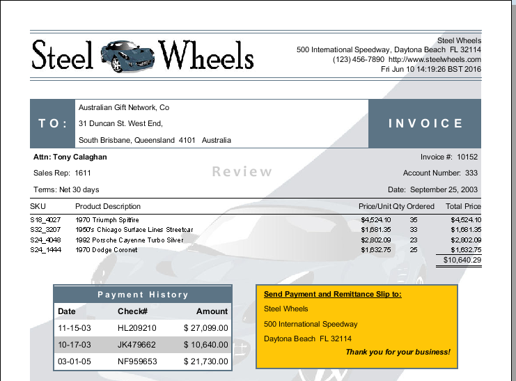

# Overview of Report Designer

> **Note:**
>
> Report Designer is the most comprehensive report authoring tool in the Pentaho suite. This section tours the workspace so every later lab feels familiar.

If you have little or no experience with Report Designer, then you will need to learn how to navigate the user interface before you can move on to more complex tasks. The content in this section provides a comprehensive yet brief introduction to all of Report Designer's user interface components.

### Learn more

- [Pentaho Report Designer documentation](https://docs.pentaho.com/pba-report-designer) - the official reference for everything in this section.
