# Navigating Report Designer

> **Warning:**
>
> #### Workshop - Navigating Report Designer
>
> Launch Report Designer and explore the workspace using the Inventory List sample report.
>
> **What you'll do**
>
> * Launch Report Designer and tour the Welcome screen.
> * Open the Inventory List sample report.
> * Explore the main and formatting toolbars, tabs, and preferences.
> * Preview a report and navigate its output.
>
> **Prerequisites:** Report Designer running, with the Pentaho sample data (HSQLDB) started
>
> **Estimated Time:** 15 minutes

---

> **Note:**
>
> #### **Navigating Report Designer**
>
> Launch Report Designer and explore the workspace using the Inventory List sample report.

## Launching Report Designer

For launching PRD (Pentaho Report designer), depending on your operating system:

::: tabs
### Windows

Windows steps:

```bash
cd C:\Pentaho\design-tools\report-designer
report-designer.bat
```

<button data-launch="prd" data-path="files/Inventory List.prpt">Open in Pentaho Report Designer</button>

### macOS / Linux

Unix steps:

```bash
cd ~/Pentaho/design-tools/report-designer
./report-designer.sh
```
:::


1. Click on the Report Designer icon on your Desktop:

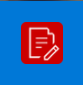

## Welcome Screen

The Welcome screen's primary purpose is to provide new a quick, four-step process that walks you through creating a new report through the Report Design Wizard. This is the default view when you start Report Designer, but if you close it, you can make it reappear at any time by going to the Help menu and selecting Welcome.

In addition to the new report creation buttons, the Welcome screen also shows a list of sample reports. You might find these useful if you're looking for inspiration, or if you can't figure out how to use a certain Report Designer feature. In order to display the samples, you must have the Pentaho sample data HSQLDB database installed and running.

If you do not want to see the Welcome screen at start-up, you can un-check the Show at start-up option in the lower right corner of the window.

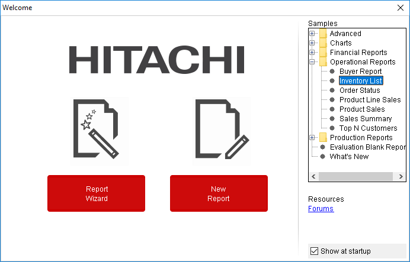

Report  Wizard: It  provides an  easy – to – use four  steps  process  that  walk  you  through creating a new Report.

New Report: If you choose this option, then you can create customized reports based on your requirement.

## Inventory List Report

To open the Inventory List sample report:

1. From the Samples pane, expand Operational Reports, and then double-click Inventory List.

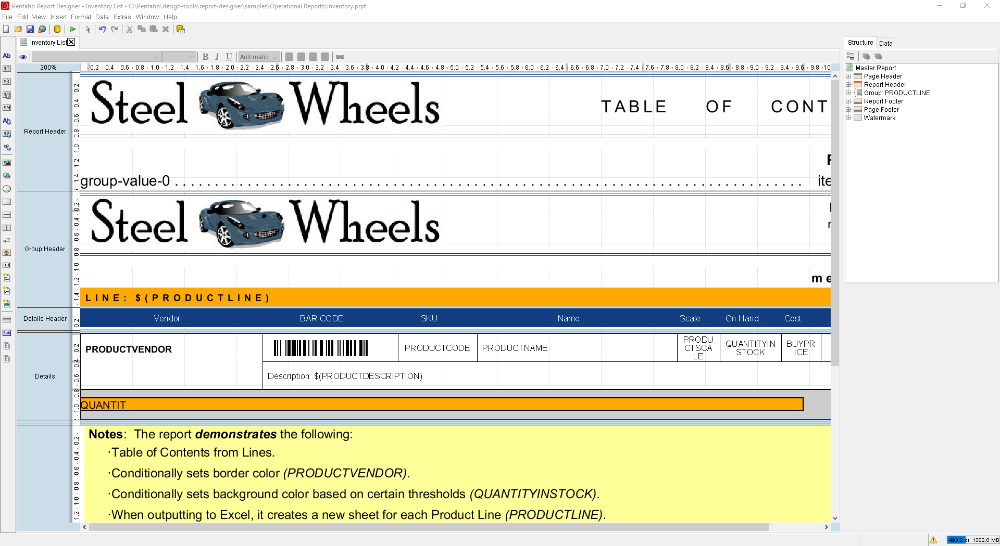

## Main Toolbar

The toolbar at the top of the Report Designer window is for file, data, publishing, and cut-and-paste operations. The toolbar makes some of the most frequently used features more accessible to users who have not yet learned keyboard shortcuts for them. There are no unique data, publishing, or file operations in the toolbar; every icon represents a feature that is also available through one of the panes or menus in Report Designer.

To discover what each icon does, mouse over it to see a tooltip description.

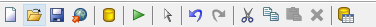

## Defining Preferences

To edit preferences associated with date and time format, look-and-feel, browsers, networks, external tools and locations go to Edit > Preferences. Enable Display the index columns in the Report Designer's field selectors...  to refer to data fields by name or column position.

## Tabbed Views

Each report and sub report is opened in its own tab in Report Designer, much like in modern Web browsers and text editors. The currently selected report's tab will always be highlighted in blue, as shown in the graphic below. Click the X in the corner of a tab to close the open report it represents, or right-click the tab to see a context menu that offers more advanced close operations.

## Formatting Toolbar

The toolbar below the tab area provides formatting and preview options.

The eye icon switches to preview mode, which shows you approximately how the report, as currently arranged, will display when published. When you are in preview mode, the eye turns into a pencil icon, which you can click to return to design mode.

The rest of the functions on this toolbar are standard font controls found in most text and word processors.

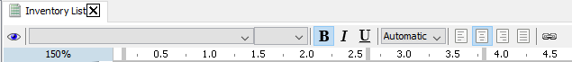

## Preview Reports

To preview the report results:

1. On the Formatting toolbar, click the Preview button.

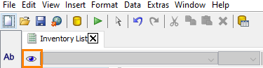

The Preview toolbar includes buttons to print, navigate and zoom the report results. Also notice that the Inventory List report provides prompts allowing the user to select the product line, and to show or hide the bar section and report notes.

2. To view the first page of results, on the Preview toolbar, click the Switch to the next page button.

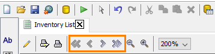

The following features in the Inventory List report:

3. The report header includes a graphic image and the current date.
4. The data is grouped by Product Line.
5. The On Hand column uses a colour coded background colour based on the data.
6. Each line of the report is followed by a Bar Section with a graphical representation of the number of units.
7. The page footer includes the current page number and number of pages.
You will create a report with these features later on this course.

8. To close the report preview and return to design mode, on the Preview toolbar, click the Design button.

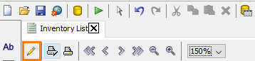

## Report Workspace

The report workspace is dominated by the layout bands, which define each individual portion of the report. The currently selected band’s label is highlighted in grey.

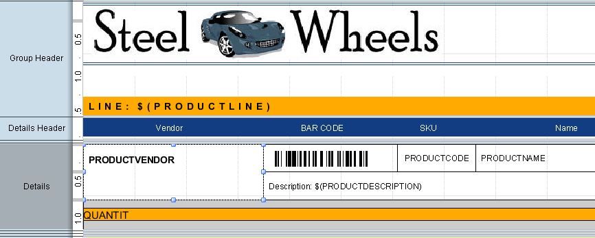

## Report Bands

The following describes the various report bands:

## Page Header

The Page Header band represents the top of each report page. On the first page of a multi-page report, the page header is the absolute top, above the report header.

> **Note:**
>
> The Inventory List report does not have a Page Header band.


## Report Header

The Report Header band contains report elements just below the page header, but only on the first page of the report. The Report Header band only appears once per report.

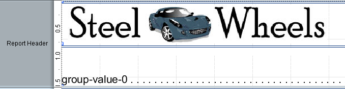

The Inventory List uses a report function to generate a Table of Contents for the report. We will discuss report functions later in this course.

## Group Header

You can choose to display the Group Header band if you have selected to group the report details displayed in the Details band.

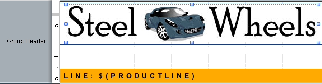

The Inventory List is grouped by Product Line, so the Group Header identifies the Product Line within a gold coloured band. It also includes a message field which identifies all the product lines included in the report. We will discuss message fields and formula expressions later in this course.

## Details Band

The Details band contains middle-of-the-page report elements. This is where most of your report data should go, and usually represents the largest portion of your report pages.

The report may also include additional Details-specific bands, such as the Details Header and Details Footer.

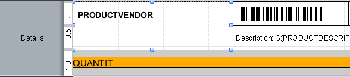

The Inventory List report includes a Details Header band with column labels. The Details band includes a number of data elements, and utilizes functions and expressions to enhance the appearance of the data.

## Report Footer

The Report Footer appears at the bottom of the last page of the report, just above the page footer.

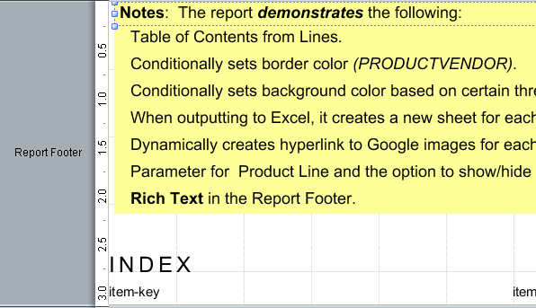

In Report Footer for the Inventory List includes several notes about the content in the report and a report index.

## Page Footer

The Page Footer appears at the absolute bottom of every page in the report.

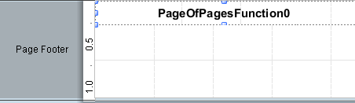

The Inventory List uses a function to display the page number and number of pages in the Page Footer.

All of the report bands can be resized by dragging their resize handles, or by moving report elements down past the bottom border. For this reason, report elements cannot be dragged from one band to another; they must be cut from the first band and pasted into the second.

To change the size of the report canvas to provide more work area (without changing the dimensions of the published report), click and drag the zoom percentage number in the top left corner of the workspace. By default, it is 100%, but if you click and drag it diagonally toward the bottom right or top left corners, the canvas will zoom in or out. If you want to reset the canvas to 100%, double-click the zoom percentage in the upper left corner.

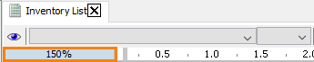

## Structure Pane

The Structure pane shows the exact hierarchy of every element included in the report. If you add an element to the workspace, it appears in the Structure pane. When you select an element in the Structure pane, all of its fine-grain details can be viewed and modified through the Style and Attributes panes in the bottom right section of the window.

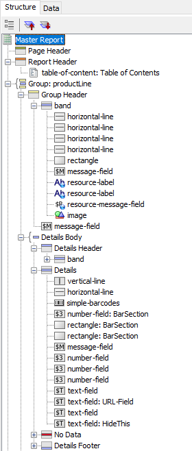

In addition to the standard drag-and-drop method using the Elements Palette and the workspace, you can also add elements to a report by right-clicking on any of the report sections in the Structure pane, then selecting Add Element from the context menu. You can delete any element in the list by clicking on it, then pressing the Delete key, or by right-clicking it and selecting Delete from the context menu.

## Master Report

This is the top-level section under which all other report bands are listed.

## Page Header

All of the elements shown in the Page Header band are listed in this section.

## Report Header

All of the elements shown in the Report Header band are listed in this section.

## Group

If you’ve created any groups for your report elements, they will appear here. The Details band is considered part of a group, and is explained below.

## Details

Elements placed in the Details band appear in the Details heading under the Group section. There are also Details-specific Header and Body bands which are available in the Structure pane. To enable these bands in your workspace, select them in the Structure pane, and then select either false for hide-on-canvas in the Attributes pane.

## No Data

In the event your query does not return any data, whatever content you put in the No Data band will appear in your report. To add a No Data band to your workspace, select No Data in the Structure pane, and then select false for hide-on-canvas in the Attributes pane.

## Report Footer

All of the elements shown in the Report Footer band are listed in this category.

## Page Footer

All of the elements shown in the Page Footer band are listed in this category.

## Watermark

To add a watermark to your report, select Watermark in the Structure pane, and then either right-click it and add via the Structure pane, or by select false for hide-on-canvas in the Attributes pane.

## Data Pane

The Data pane enables you to add data sources and view the individual queries, functions, and parameters in each report. The three buttons at the top of the pane will add a new data source, function, or parameter when clicked, respectively.

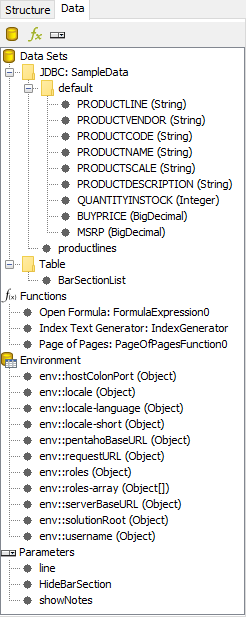

## Data Sets

All of the data sources and queries you have defined for the current report will be listed here. If you want to add a new data source, click the leftmost icon (the yellow cylinder) and select the data source type from the ensuing drop-down menu. To add a new query to an established data source, right-click the data source and then select Edit DataSource from the context menu. To delete a data source, select it, then press the Delete key, or right-click it and select Delete from the context menu.

## Functions

All of the mathematical functions and conditional elements that you add to a report will be listed in this category. Click the fx button in the upper left corner of the pane to add a new function. You can delete a function by clicking it, then pressing the Delete key, or by right-clicking it and selecting Delete from the context menu.

## Parameters

If your query is properly formed, you can add a parameter to your report, which enables report readers to customize the content of the output. To add a new parameter, click the rightmost icon in the upper left corner of the pane. You can delete parameters by selecting the parameter you want to eliminate and pressing the Delete key, or by right-clicking the parameter and selecting Delete from the context menu.

## Environment Variables

If you are publishing your report to the Pentaho Server, you can use certain environment variables in your report:

## Style Pane

The Style pane displays all of the visual and positional style options for a report element in the Structure pane. When you click on an element in the Structure pane, the Style pane adjusts to show all of the available style properties for that element.

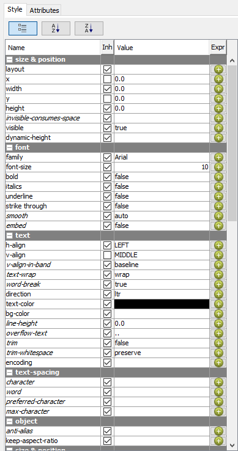

By default, the available styles are listed by group; however, you can sort the list alphabetically in ascending or descending order.

The style groups include:


You cannot edit any Style or Attribute option for any selected report element in the workspace while the Data pane has focus. Click the Structure pane to see the Style and Attributes panes for selected elements.

## View QUANTITYINSTOCK Report Element

1. To view the Style pane for the Quantity in Stock report element, in the right pane, click the Structure tab, and then in the Details section, click number-field: QUANTITYINSTOCK.
2. Scroll through the various style properties that can be set for the Quantity in Stock element. Some of these properties (such as the font family and font size) can be set either on the Style pane or on the Formatting toolbar.
3. To sort the properties in ascending order, on the Attributes pane, click the A-Z sort button.
4. To view the formula expression for the background colour, on the Style pane, click the pencil icon for text > bg-color.

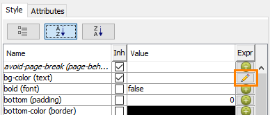

This formula expression sets the background colour according to the value of QUANTITYINSTOCK.

## Attributes Pane

The Attributes pane displays all of the low-level properties, and input and output options for any report element in the Structure pane. When you click on an element in the Structure pane, the Attributes pane adjusts to show all of the available attribute properties for that element.

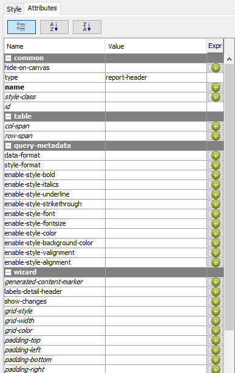

By default, the available attributes are listed by group; however, you can sort the list alphabetically in ascending or descending order. Not all attribute settings apply to every report element.

## Elements Palette

The Elements Palette contains all of the elements you can use to build a report. To add an element, click on a layout band to select it, then drag and drop an element from the Elements Palette to the selected band.

Product Line Sales Trend – Help > Sample Reports > Charts > Bar Chart

The Bar sample report contains a basic bar chart, the Product Line Sales Trend chart, showing the total sales by product line for 2003-2005.

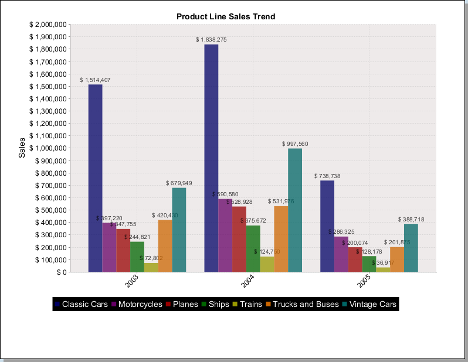

1. To preview the report, on the formatting toolbar, click the Preview button.

> **Note:**
>
> Notice the following characteristics on the Product Line Sales Trend chart:
> 1. Chart title
> 2. Bar colors
> 3. Data values
> 4. Legend

2. To view the query, from the Data pane, expand Data Sets > JDBC: SampleData, and then double-click Query 1.

> **Note:**
>
> Notice the following in the query:
> - The query uses fields from the PRODUCTS and ORDERFACT tables, which are joined by PRODUCTCODE.
> - The sum function is used for TOTALPRICE and QUANTITYORDERED, and the fields are renamed.The GROUP BY statement is necessary when using the sum function.

Buyer Report – Help > Sample Reports > Operational Reports > Buyer’s Report

The Buyer Report shows product facts grouped by product line and vendor.

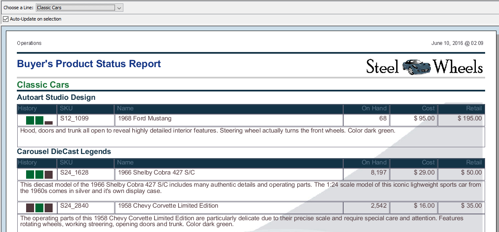

1. To preview the report, on the formatting toolbar, click the Preview button.

> **Note:**
>
> Notice the following characteristics of the Buyer’s Product Status Report:
> - There is a parameter to specify the product line.
> - The page header includes a label and date.
> - The report header includes a title and image.
> - The report details are grouped by product line and vendor.
> - The History column displays a sparkline chart.
> - There is a watermark image.
> - The page footer includes the report author’s name and page number.

2. To view various report specifications, select elements on the Structure pane, and then view the details on the Style and Attributes panes.

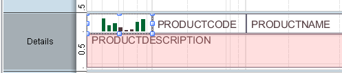

Invoice - Help > Sample Reports > Production Reports > Invoice

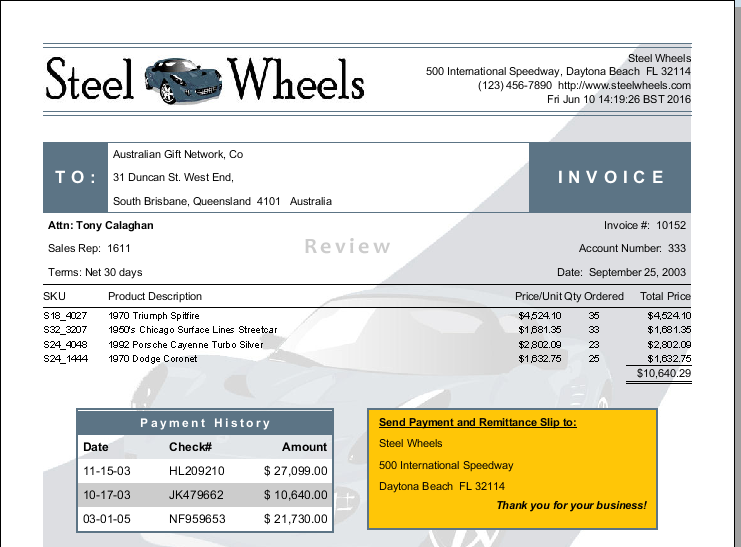

This report shows all the invoices that have been issued to customers. Each invoice is presented on a separate page, and the end user has the ability to select the client they want to analyze.

To view the specifications for the Sub-Report, in the Details band, double-click the Payment History (Sub-report) element.

## Lab files

<button data-launch="prd" data-path="files/Inventory List.prpt">Open: The sample report this lab tours</button>

