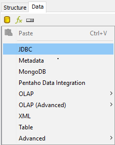
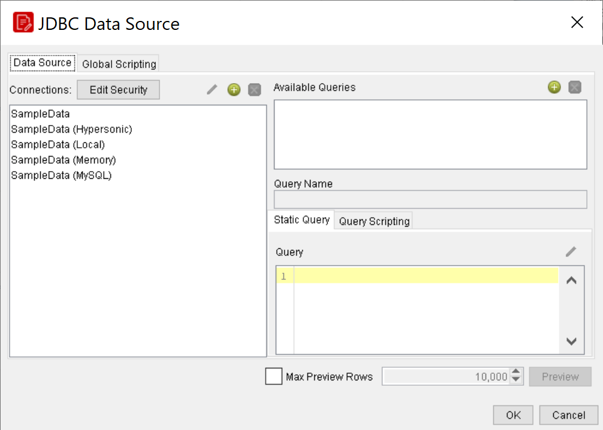
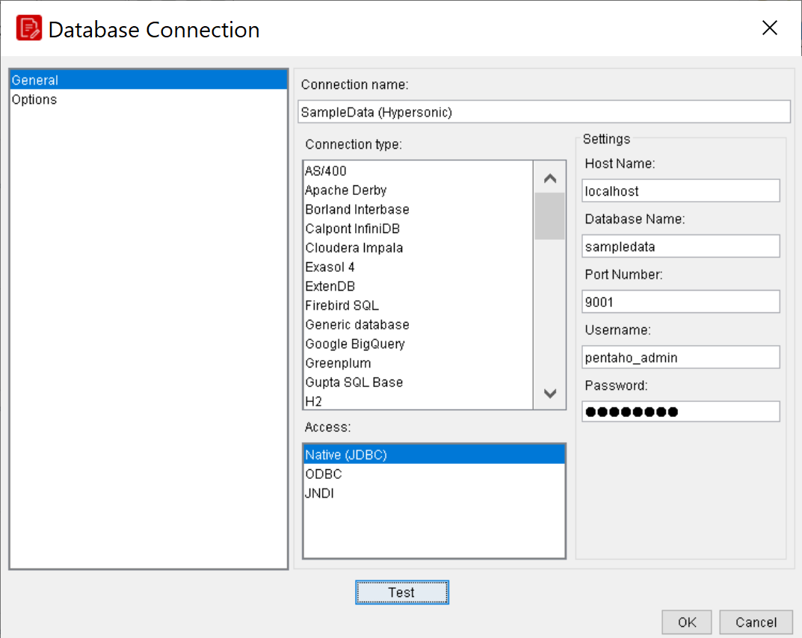

# Overview of Data Sources & Queries

> **Note:**
>
> Every report starts with data. This section covers the data source types Report Designer understands and how queries feed report elements.

The first step in creating a report is connecting to a data source. The second step is to use a query to refine that data source such that it only contains the information you need for your report. These two operations are closely related, so this section covers both in sufficient detail.

## Data Sources

> **Note:**
>
> Pentaho Report Designer supports the following data source types:
> * JDBC: Any JDBC-compliant database will work with Report Designer. Copy the appropriate JAR file to the /pentaho/design-tools/ report-designer/lib/ directory.
> * Metadata: A Pentaho Metadata XMI file.
> * Pentaho Data Integration (Kettle): Kettle KTR files can act as a data source.
> * OLAP: Report Designer only supports Pentaho Analysis (Mondrian) OLAP sources at this time.
> * Pentaho Analysis: A Mondrian schema file.
> * Pentaho Analysis Denormalized: A Mondrian schema file, denormalized.
> * Pentaho Analysis Legacy: A Mondrian data source imported from a report created with a version of Report Designer older than 3.5.0.
> * XML: An XQuery file.
> * Table: Create your own data table by entering information manually, or importing it from an Excel spreadsheet file (XLS).
> * Advanced: The data sources in this category are typically for software developers and special-use cases.
> * Scriptable: Generate data sets via JavaScript, Bean Shell, Groovy, Netrexx, XSLT, JACL, or Jython.
> * External: Used only if the report is going to run on the BI Server. The query name for the report has to be mapped to the result set in the .xaction file.
> * Sequence Generator: The same as table, with a sequencer.
> * Community Data Access:  an abstraction tool between database connections and CDF (Community Dashboard Framework)

## Creating Queries with JDBC Data Source

You may need to obtain database connection information from your system administrator, such as the URL, port number, JDBC connection string, database type, and user credentials.

Follow this procedure to add a standard JDBC data source in Report Designer.

1. Select the Data tab in the upper right pane.
By default, Report Designer starts in the Structure tab, which shares a pane with Data.

2. Click the yellow cylinder icon in the upper left part of the Data pane, or right-click Data Sets.
A drop-down menu with a list of supported data source types will appear.

3. Select JDBC from the drop-down menu.
The JDBC Data Source window will appear.

> **Note:**
>
> If you want to provide parameters that contain different database connection authentication credentials, click the Edit Security button in the upper left corner of the window, then type in the fields or variables that contain the user credentials you want to store as a parameter with this connection.
The role, username, and password will be available as a security parameter when you are creating your report.

4. Above the Connections pane on the left, click the round green + icon to add a new data source.
If you installed the Pentaho sample data, several SampleData entries will appear in the list. If you haven’t installed the sample data, you can safely delete the SampleData entries.

5. In the Database Connection dialogue, type in a descriptive name for this connection in the Connection Name field; select your database brand from the Connection Type list; select the access type in the Access list at the bottom; then type in your database connection details into the fields in the Settings section on the right.
The Access list will change according to the connection type you select; the settings section will change depending on which item in the access list you choose.

6. Click the Test button to ensure that the connection settings are correct. If they are not, the ensuing error message should give you some clues as to which settings need to be changed. If the test dialogue says that the connection to the database is OK, then click the OK button to complete the data source configuration.
Now that your data source is configured, you must design or enter an SQL query before you can finish adding the data source.

### Passing Security Information to a Report over a JDBC Connection

You can use one of two options when you want to pass security-related information, (such as user name and password), associated with a report over a JDBC connection:

1. Choose from the list of predefined environment variables; for example, env::username or env::roles
2. Define your own specific environment variables to pass to the connection, (session or global), using the formula function, ENV, inside a hidden parameter.
For example:

## =ENV("session:xaction_parameter_password")

=ENV("global:xaction_parameter_password") where xaction_parameter_password is the parameter
defined in an .xaction.

In either case, the available selections appear as drop-down options under JDBC Security Configuration when you click Edit Security in the JDBC Data Source dialog box.

## Learn more

- [Pentaho Report Designer documentation](https://docs.pentaho.com/pba-report-designer) - the official reference for everything in this section.
