# Connect to a JDBC Data Source

> **Warning:**
>
> #### Workshop - Connect to a JDBC Data Source
>
> Create a JDBC connection to the sample database and build the query your first report will use.
>
> **What you'll do**
>
> * Create a JDBC connection to the sample database.
> * Build and test the query that will drive your report.
> * Preview the rows the data source returns.
>
> **Prerequisites:** Report Designer running, with the Pentaho sample data (HSQLDB) started
>
> **Estimated Time:** 15 minutes

---

> **Note:**
>
> #### **Connect to a JDBC Data Source**
>
> Create a JDBC connection to the sample database and build the query your first report will use.

## Connect to SampleData (Hypersonic) Database

Follow this procedure to access the SampleData JDBC data source in Report Designer.

1. From the menu, select Data > Add Datasource > JDBC.

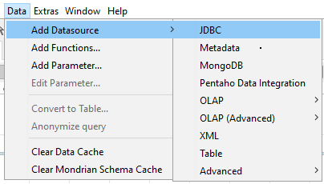

Or click on the Database icon.

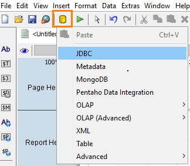

2. Select the SampleData

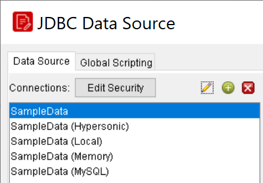

> **Under the hood:**
>
> #### SampleData is a connection definition that travels inside the report
>
> What you picked is a saved connection: a JDBC driver class, a URL
> and credentials. When you save the report those go into the bundle
> as `datasources/sql-ds.xml`, alongside every query you write against
> them. At run time the engine's SQL data factory loads the driver,
> opens the connection, runs the named query and closes it again — in
> Report Designer's preview and on the server alike.
>
> The alternative access type, JNDI, stores only a *name*. Report
> Designer resolves it locally from `simple-jndi/default.properties`;
> the server resolves the same name against its own configured data
> sources, so one report can point at the test database on your
> laptop and production on the server without editing.
>
> **Why it matters:** the report is self-describing about where its
> data comes from. Prefer JNDI for anything you will publish, so the
> credentials live on the server, not in a file that gets emailed
> around.

## SQL Query Designer

You must be in the JDBC Data Source window to follow this process. You should also have configured and tested a JDBC data source connection.

SQL Query Designer does not work with Hadoop Hive data sources.

Follow this process to design an SQL query for your data source with SQL Query Designer:

1. Select your data source in the Connections pane on the left,
2. Click the round green + icon above the Available Queries pane on the right (this is the + button in the upper right corner of the window).

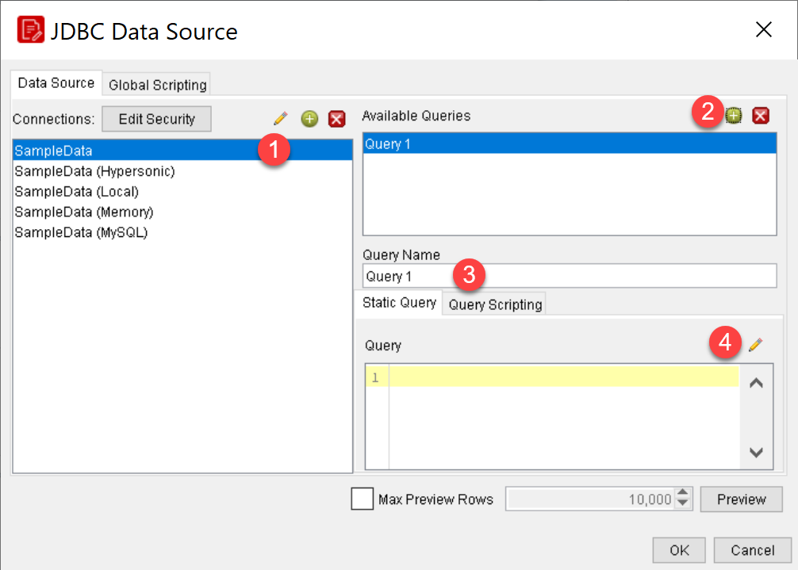

3. Type descriptive name for this query in the Query Name field: Products
4. Click the pencil icon above the upper right corner of the Query field.
In this part of the guided demonstration you will create a query to return fields from the Products, Order Fact, and Customer with Territory tables, sorted by Product Line, Territory, and Customer Name.

5. Ensure the PUBLIC Schema is selected, and double-click on the PRODUCTS table.

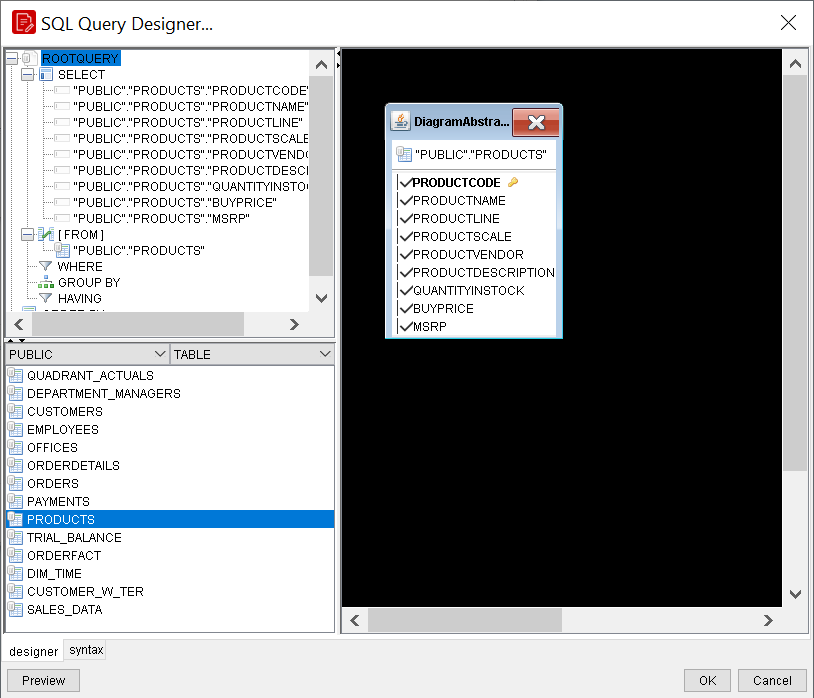

6. In the lower left pane, click to select PRODUCTS table you want to select data from, then double-click it to move it to the query workspace.
The table you selected will appear in the workspace as a sub-window containing all of the Table’s Fields.

7. Check all of the rows you want to include in the query.
By default, all Fields are selected. If you only want to select a few rows (or a single row), click the table name at the top of the sub-window, then click deselect all in the popup menu, then check only the rows you want to include in your query.

8. Repeat the previous step and add the ORDERFACT table.

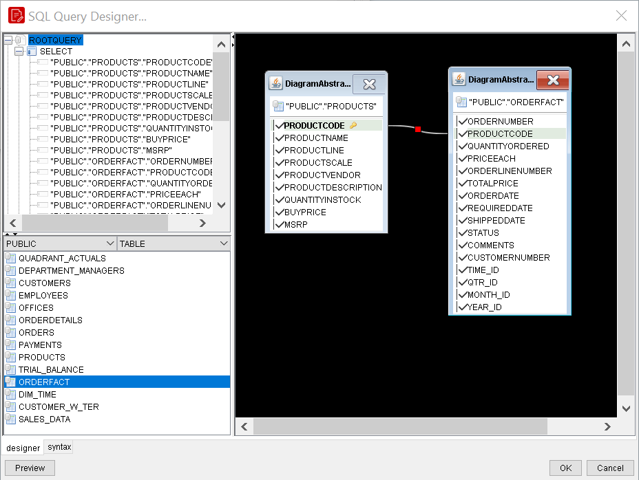

9. To view the join details, on the join path, double-click the red square.

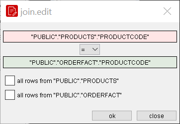

> **Note:**
>
> You can create an SQL JOIN between tables by selecting a reference key in one table, then dragging it to the appropriate row in another table.

10. Add the Customer with Territory table to the query, from the list of tables, double-click CUSTOMER_W_TER.

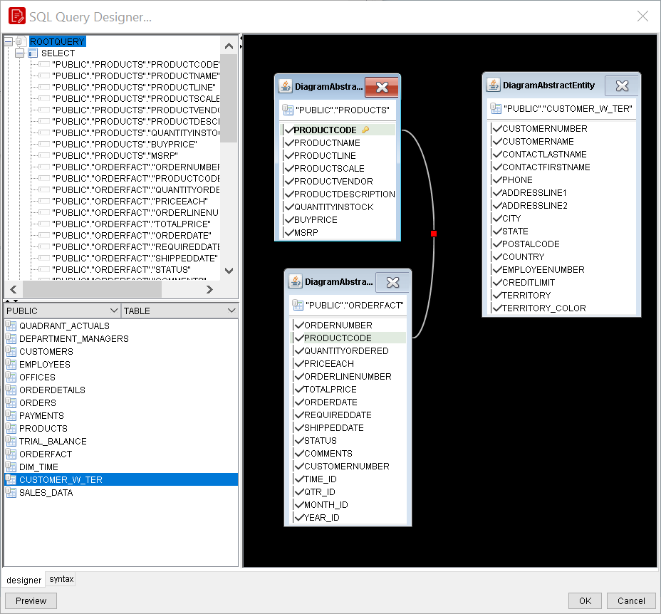

11. To join the Customer with Territory table to the Order Fact table:
12. In the CUSTOMER_W_TER table, click CUSTOMERNUMBER and hold the left mouse button.
13. Drag CUSTOMERNUMBER onto CUSTOMERNUMBER in the ORDERFACT table and release the mouse button.

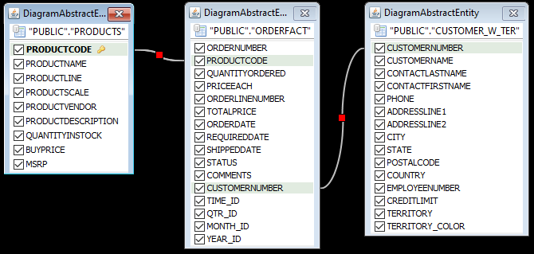

14. By default, all the fields from the selected tables are included in the SELECT statement:
15. To deselect the Product Description field, in the PRODUCTS view, click the checkbox for PRODUCTDESCRIPTION.

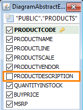

16. To deselect all fields in the Order Fact table, in the right pane, click the “ORDERFACT” header, and then click deselect all.

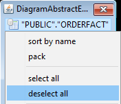

17. From the ORDERFACT table select only:
* ORDERNUMBER
* QUANTITYORDERED
* PRICEEACH
* ORDERDATE

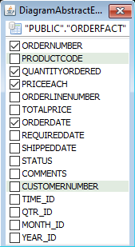

18. From the CUSTOMER_W_TER table select only:
* CUSTOMERNAME
* TERRITORY

> **Note:**
>
> Notice in the top left pane that the SELECT statement reflects the changes made in the previous steps.

> **Under the hood:**
>
> #### The Query Designer is a SQL text generator, nothing more
>
> Every click has been rewriting the statement in the top-left pane.
> The join path appeared because the designer asked the database's
> JDBC metadata for foreign keys between PRODUCTS and ORDERFACT; the
> join you drew by hand became the same kind of condition. Identifiers
> come out schema-qualified and quoted (`"PUBLIC"."PRODUCTS"."PRODUCTLINE"`)
> so they survive case-sensitive databases.
>
> Only the text is saved. The engine never sees the diagram, and you
> can edit the SQL directly at any point — the designer is a
> convenience, not a layer.
>
> **Why it matters:** anything your database can express — window
> functions, CTEs, vendor syntax — works here, because the query goes
> to the driver exactly as written.

Once the fields are selected, you can specify the sort order.

19. To sort the results by Product Line, in the top left pane, right-click “PRODUCTS.PRODUCTLINE” and then from the context menu select add to order-by.

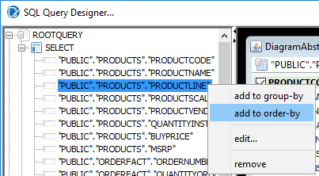

20. To change the sort from ASC to DESC:
21. Double-click on the ORDER BY: “PUBLIC”.”PRODUCTS”.”PRODUCTSLINE” ASC

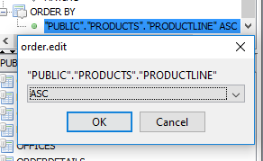

22. Sort the results by Territory and Customer Name.

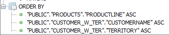

23. Close the SQL Query Designer.
24. Click the Preview button in the JDBC Data Source panel to view the results.
25. Rename the Query: Customer Sales by Territory
26. To save the report, on the toolbar, click the Save button, and then save the report to the desktop or a local folder as Demo - jdbc sql query.prpt

> **Under the hood:**
>
> #### Preview pulled the whole result into memory, in the order the database returned it
>
> Preview ran the query and read the result set into an in-memory
> table model, which is what the engine iterates — twice, as you'll
> see — when the report runs. Nothing is re-sorted afterwards. The
> `ORDER BY` you just built is therefore not cosmetic: the groups you
> will add in the next module are detected by watching a field's value
> change from one row to the next, and that only works on sorted rows.
>
> The query name matters too. The report references its data by that
> name, and a sub-report or parameter list can pick any query in the
> data source by it.
>
> **Why it matters:** sort in the query, in the order you intend to
> group — territory before customer — and the layout will follow. Get
> the order wrong and the report won't error; it will just show the
> same group header several times.

Further examples of connecting to various datasources can be found in Appendix A

## Lab files

<button data-launch="prd" data-path="files/Training Demo Report 3 jdbc sql query.prpt">Open: Solution: JDBC SQL query</button>

<button data-launch="prd" data-path="files/Training Demo Report 3 sql query.prpt">Open: Solution: SQL query</button>

<button data-launch="prd" data-path="files/Training Demo Report 3-1 metadata sql query.prpt">Open: Solution: metadata query</button>

