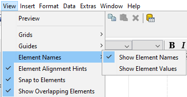

# Overview of Report Elements & Groups

> **Note:**
>
> Reports are built from elements placed in bands, and groups turn flat rows into structured sections. This section explains both.

Most report elements can easily be added by dragging and dropping them from the Palette or the Data pane to one of the layout bands. In some cases, there are a few extra details that you should know before you dive into report creation.

## Adding Design Elements

In order to add a report element, you must have configured a data source and designed a query to refine the data.

Follow this process to add design elements to a report.

1. If you have not already done so, click the Structure tab in the upper right pane.
If the Data tab is selected, you will be unable to edit the attributes or styles of any report elements.

2. Click the design element you want to add, then drag it into the report band that you want to add it to, roughly in the position where you want it to appear.
Once the element is placed, it will change from a grey shape to a transparent element with an inline label and blue resize handles.

3. Click the resize handles and drag them out to the desired dimensions.
If necessary, click the centre of the element and drag it to a different location within the layout band.

> **Warning:**
>
> You cannot drag an element from one band to another. If you want to move something to a different band, you must cut and paste it. Dragging an element toward the bottom of the band will increase the size of the band.

4. With the new report element selected, examine the options in the Attributes and Style panes and make any necessary changes or customizations.
Any changeable aspect of a report element can be changed through these two panes.

5. To delete an element, click to select it, then press the Delete key, or right-click the element and select Delete from the context menu.
You should now have a properly sized and placed report design element containing the data and options you specified in the Style and Attributes panes. Any of the changes you made in this process can be revisited to further customize the new element.

## Aligning Elements

Report Designer has several features to help you easily align your report elements. All can be found in the View menu.

Grids show a graph-paper-like grid on the report canvas. This can make it easier to evenly space elements by counting the exact number of hash marks between them. Grids can also make it easier to line up elements, but you may find it easier to rely on guides instead.

Guides are markers you create by clicking on the rulers on the top and left of the report canvas. Once you have guides in place, it's easier to align report elements vertically and/or horizontally. To turn off guides, go to the Guides submenu in the View menu, then un-check the Show Guides item. You can remove individual guides by right-clicking them on the ruler, then selecting Delete from the context menu.

Perhaps the most useful alignment feature in Report Designer is Element Alignment Hints. When you enable this option, each report element's outer borders will extend to the edges of the canvas, allowing you to easily line up multiple elements.

The Snap to Elements feature will add a kind of magnetism to elements so that they are easier to align with adjacent elements.

Though it may appear to be a good solution to some report design challenges, you should resist the temptation to overlap elements in Report Designer. While the output may seem agreeable in the Preview window and in some kinds of report output, the HTML and Excel output formats will have unusual problems.

## Learn more

- [Pentaho Report Designer documentation](https://docs.pentaho.com/pba-report-designer) - the official reference for everything in this section.
