# Adding Data Elements and Report Groups

> **Warning:**
>
> #### Workshop - Adding Data Elements and Report Groups
>
> Place data fields on the canvas, then group the report and add group headers.
>
> **What you'll do**
>
> * Place data fields onto the report canvas.
> * Group the report and add group headers.
> * Preview the grouped layout.
>
> **Prerequisites:** Report Designer running, with the Pentaho sample data (HSQLDB) started
>
> **Estimated Time:** 20 minutes

---

> **Note:**
>
> #### **Adding Data Elements and Report Groups**
>
> Place data fields on the canvas, then group the report and add group headers.

Guided Demonstration:  Adding Data Elements and Report Groups

## Adding Data Elements

In this demonstration you will add the Product Code, Product Name, Quantity in Stock, and Buy Price data elements to the Details band.

1. Open the Demo - jdbc sql query.prpt
2. To add Product Code to the Details band, from the Data pane, drag PRODUCTCODE to the Details band and drop it in the top left corner.
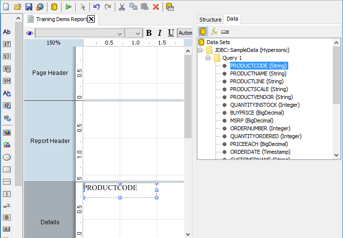

Do not worry about the exact placement of the PRODUCTCODE field. You will align the data elements in the next demonstration.

3. To add PRODCUTNAME to the Details band, from the Data pane, drag PRODUCTNAME to the Details band and drop it to the right of PRODUCTCODE.
4. Turn on the Field Selector Palette: On the toolbar, click the Toggles the Field-Selector Palette button.
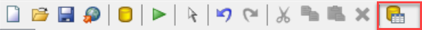

5. To add QUANTITYINSTOCK to the Details band, from the Field Selector Palette, drag QUANTITYINSTOCK to the Details band and drop it to the right of PRODUCTNAME.
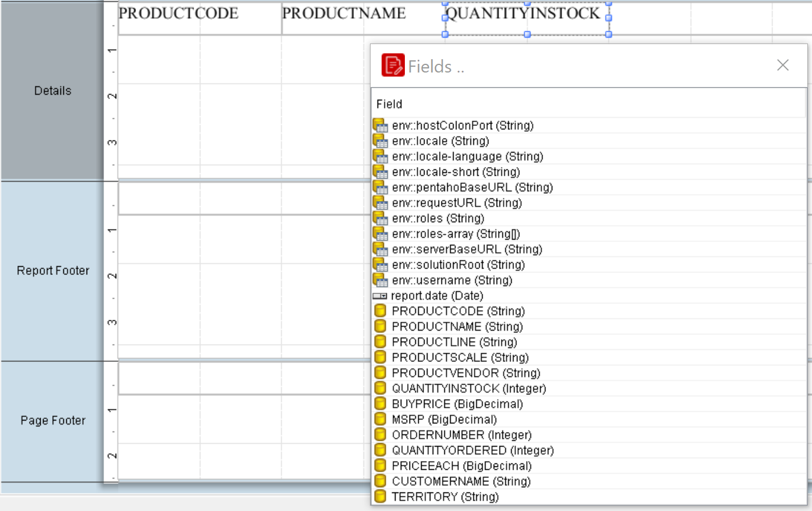

6. Add BUYPRICE to the right of QUANTITYINSTOCK.
7. Close the Field Selector Palette
## Aligning Data Elements

1. Select: View >
2. Grids (Show, Snap)
3. Guides (Show Guides)
4. Element Alignment Hints
to ensure they’re turned checked.

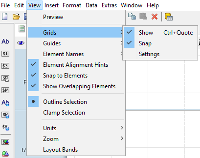

5. Zoom the report canvas to 175%:
In the top left corner of the report canvas, drag the zoom percentage number toward the bottom right corner until the percentage displays 175%.

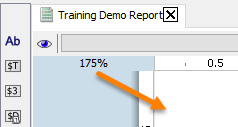

6. To add a vertical guide, in the top ruler, at 1.25 inches or 3cm.
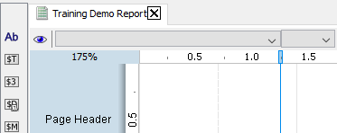

7. To align PRODUCTNAME with the vertical guide, on the report canvas, select PRODUCTNAME and drag it to the top of the Details band. Drop PRODUCTNAME on the vertical guide.
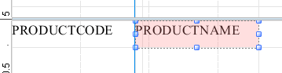

8. Resize PRODUCTCODE field and align the PRODUCTNAME so that the fields are clear.
9. Resize PRODUCTNAME element, to 3.75 inches or 9.5 cm on the report canvas.
10. Adjust the QUANTITYINSTOCK and BUYPRICE along a vertical guide of 5.25 inches or 13.5 cm
11. To select, or lasso, all the elements in the Details band:
12. On the toolbar, click the Select Objects button.
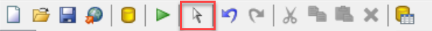

13. On the report canvas, select PRODUCTCODE.
14. Drag the pointer to the right until all the elements in the Details band are selected.
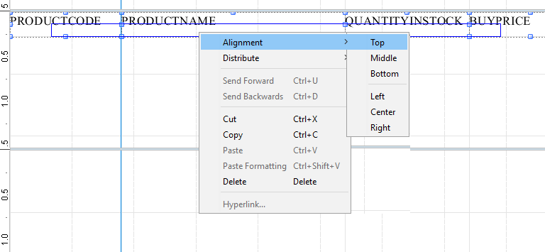

15. Right mouse click and select: Alignment > Top
16. Preview the report.
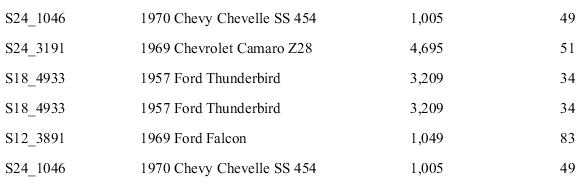

17. If you’re layout is different, check the order of your sorts in the datasource.
## Add Label Elements

1. To enable the Details Header band:
2. In the Structure pane, click Details Header.
3. In the Attributes pane, click in the Value column for common > hide-on-canvas.
4. Select False.
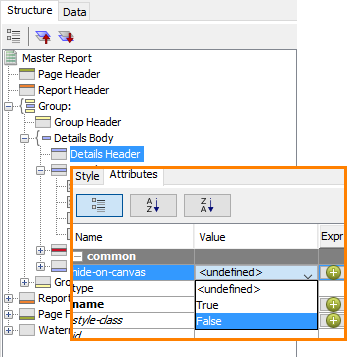

The Details Header band now appears on the canvas. By default, the Details Header band is one inch. The column labels require less space, so you can resize the band on the canvas.

5. Resize the Details Header band, on the canvas, click the divider line at the bottom of the Details Header band and drag it up to approximately 0.5” below the Report Header.
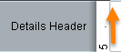

6. To assist with adding label elements for the column headers, on the horizontal ruler, click to add guides to align with QUANTITYINSTOCK, and BUYPRICE.
7. To add a label element for the PRODUCTCODE header, on the Elements Palette, click the label icon, and then drag it to the Details Header band and drop it directly above PRODUCTCODE.
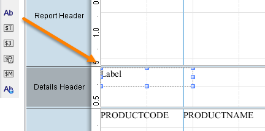

8. Resize and position the label element, so that it mirrors the PRODUCTCODE data element.
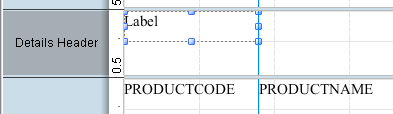

9. Click the cell … and rename Product Code.
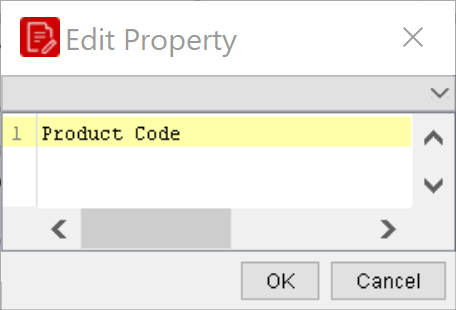

10. Repeat workflow for the other fields.
11. Preview and save the report.
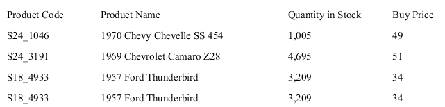

## Report Groups

Groups are added from the Structure pane. To create a new group, you assign the group a name and specify the field by which the data is to be grouped.

In this demonstration you will create a group for Product Line and add a message element identifying the Product Line to the Group Header band.

1. To add a group for Product Line, in the Structure pane, right-click Group, and then click Add Group.
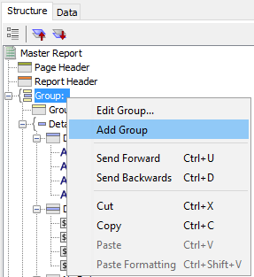

2. To create the group, in the Edit Group window:
3. In the Name field, type Product Line Group.
4. From the Available Fields, select PRODUCTLINE.
5. Click the right arrow to move PRODUCTLINE to the Selected Fields.
6. Click OK.
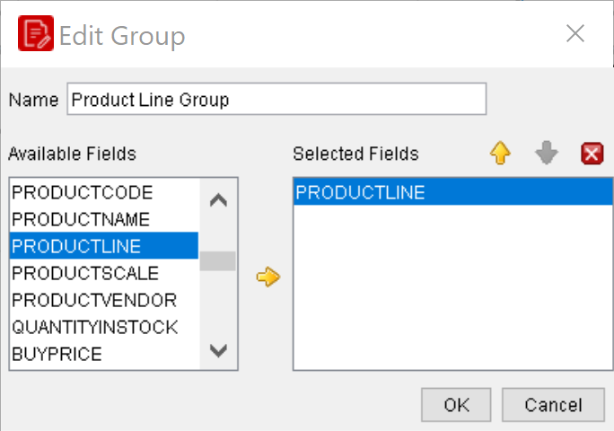

Notice the Group Header and Group Footer appear on the report canvas, and PRODUCTLINE appears on the Structure pane.

7. To add a message element to identify the Product Line, on the Elements Palette, click the message icon, and then drag it to the top left corner of the Group Header band.
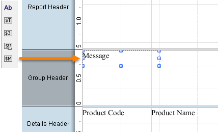

8. To edit the message element:
9. Double-click in the center of the message element to select it.
10. Click the … button to open the editor.
11. Replace the Message text with Product Line: $(PRODUCTLINE).
12. Click OK.
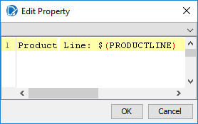

13. To resize and position the message element, in the Group Header band:
14. approximately 0.25” on the vertical ruler
15. 3.5” or 8 cm on the horizontal ruler.
16. Resize the Group Header band, to approximately 0.5” below the Report Header.
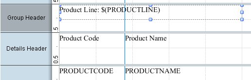

17. Format the Product Line message field;
18. Bold and 14 points.
We will now configure our report so that each Product Line begins on a new page. We will go to the Structure tab, navigate to Master Report | Productline Group, and make the following modification:

## Style.pagebreak-after = true

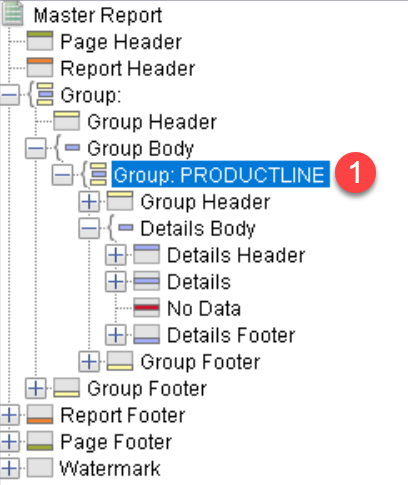

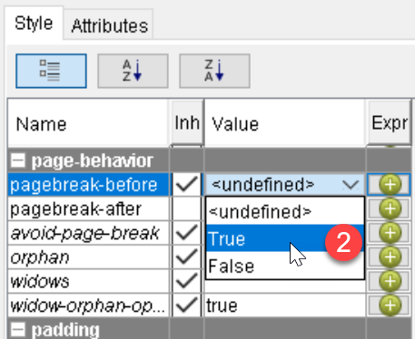

The pagebreak-after will result in separate tabs for each section when exported to Excel.

1. Preview and Save the Report: Demo - data elements.prpt

## Lab files

<button data-launch="prd" data-path="files/Training Demo Report 4 data elements.prpt">Open: Solution: data elements & groups</button>

